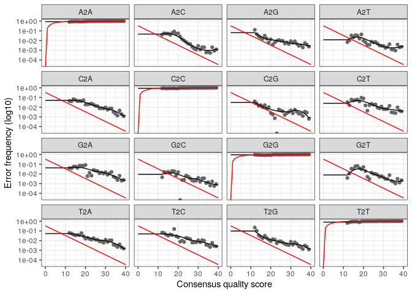
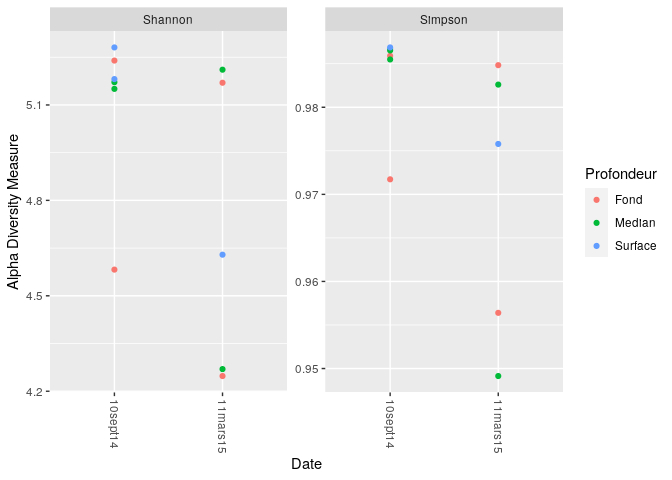
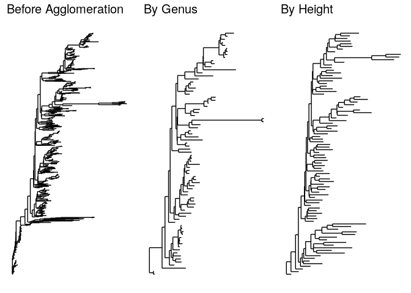
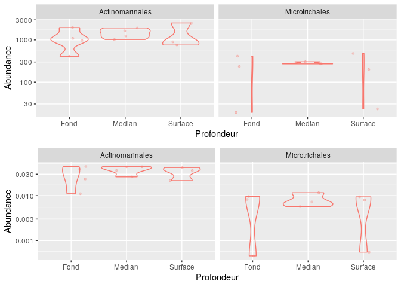
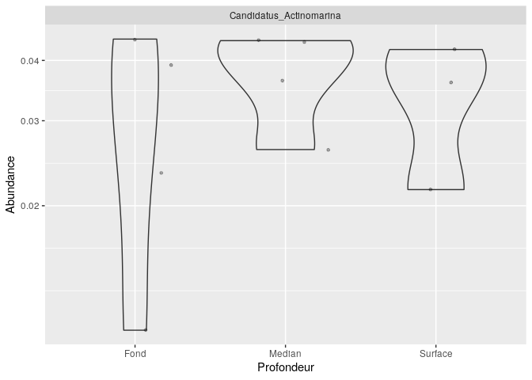
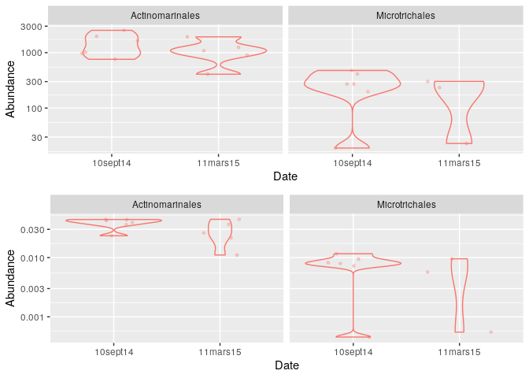
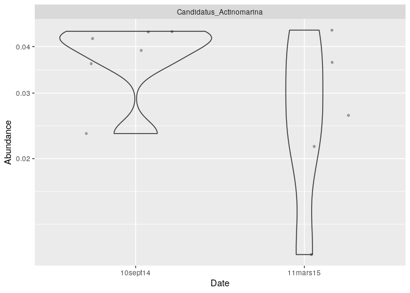
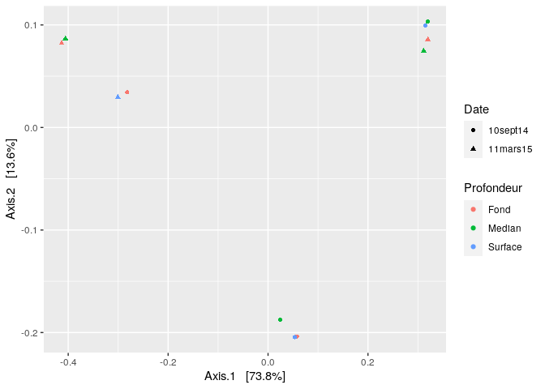
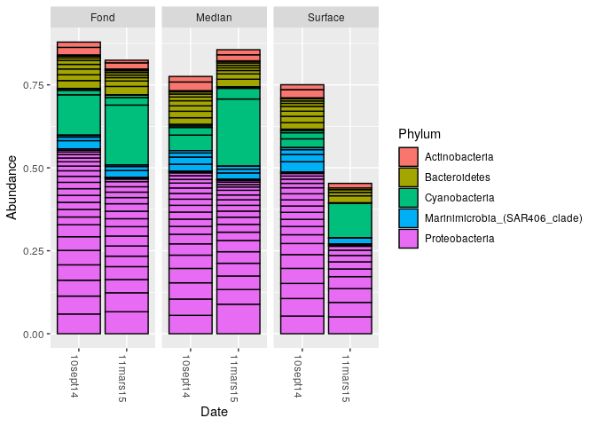
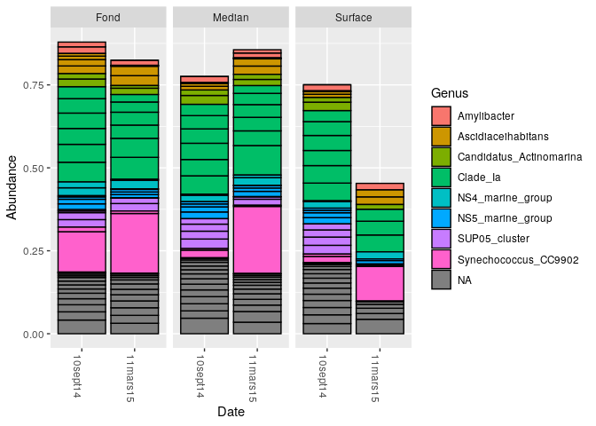

Contrôle continu 2 - Ecogénomique 2 - Rade de Brest
================

  - [Introduction](#introduction)
  - [Importation des packages](#importation-des-packages)
  - [Importation des données](#importation-des-données)
  - [Forward and Reverse](#forward-and-reverse)
  - [Profils de score de qualité](#profils-de-score-de-qualité)
  - [Apprendre le taux d’erreur](#apprendre-le-taux-derreur)
  - [Inférence des échantillons](#inférence-des-échantillons)
  - [Fusions des reads](#fusions-des-reads)
  - [Construction d’une table de
    séquence](#construction-dune-table-de-séquence)
      - [Distribution des longueurs des
        séquences](#distribution-des-longueurs-des-séquences)
  - [Elimination des chimères](#elimination-des-chimères)
  - [Suivi des reads dans le
    pipeline](#suivi-des-reads-dans-le-pipeline)
  - [Assignation de la taxonomie](#assignation-de-la-taxonomie)
  - [Evaluation de la précision](#evaluation-de-la-précision)
  - [Agglomération des taxons](#agglomération-des-taxons)
  - [Transformation de la valeur d’abondance selon la
    profondeur](#transformation-de-la-valeur-dabondance-selon-la-profondeur)
  - [Sous-ensemble par taxonomie](#sous-ensemble-par-taxonomie)
  - [Transformation de la valeur d’abondance selon la
    date](#transformation-de-la-valeur-dabondance-selon-la-date)
      - [Visualisation de l’ordination](#visualisation-de-lordination)
  - [Visualisation de l’abondance des différents
    phylums](#visualisation-de-labondance-des-différents-phylums)
  - [Conclusion](#conclusion)

# Introduction

A travers les différentes approches bioinformatiques utilisées,
l’objectif était de voir les influences relatives que pouvaient
entraîner la profondeur et la saison sur la structure des communautés
planctoniques de la rade de Brest. Enfin, nous voulions voir s’il
existait des biomarqueurs de saison (hiver et été).

# Importation des packages

``` r
library(BiocManager)
```

    ## Bioconductor version 3.11 (BiocManager 1.30.10), ?BiocManager::install for help

    ## Bioconductor version '3.11' is out-of-date; the current release version '3.12'
    ##   is available with R version '4.0'; see https://bioconductor.org/install

``` r
library(BiocVersion)
library(Biostrings)
```

    ## Loading required package: BiocGenerics

    ## Loading required package: parallel

    ## 
    ## Attaching package: 'BiocGenerics'

    ## The following objects are masked from 'package:parallel':
    ## 
    ##     clusterApply, clusterApplyLB, clusterCall, clusterEvalQ,
    ##     clusterExport, clusterMap, parApply, parCapply, parLapply,
    ##     parLapplyLB, parRapply, parSapply, parSapplyLB

    ## The following objects are masked from 'package:stats':
    ## 
    ##     IQR, mad, sd, var, xtabs

    ## The following objects are masked from 'package:base':
    ## 
    ##     anyDuplicated, append, as.data.frame, basename, cbind, colnames,
    ##     dirname, do.call, duplicated, eval, evalq, Filter, Find, get, grep,
    ##     grepl, intersect, is.unsorted, lapply, Map, mapply, match, mget,
    ##     order, paste, pmax, pmax.int, pmin, pmin.int, Position, rank,
    ##     rbind, Reduce, rownames, sapply, setdiff, sort, table, tapply,
    ##     union, unique, unsplit, which, which.max, which.min

    ## Loading required package: S4Vectors

    ## Loading required package: stats4

    ## 
    ## Attaching package: 'S4Vectors'

    ## The following object is masked from 'package:base':
    ## 
    ##     expand.grid

    ## Loading required package: IRanges

    ## Loading required package: XVector

    ## 
    ## Attaching package: 'Biostrings'

    ## The following object is masked from 'package:base':
    ## 
    ##     strsplit

``` r
library(dada2)
```

    ## Loading required package: Rcpp

``` r
library(DECIPHER)
```

    ## Loading required package: RSQLite

``` r
library(DESeq2)
```

    ## Loading required package: GenomicRanges

    ## Loading required package: GenomeInfoDb

    ## Loading required package: SummarizedExperiment

    ## Loading required package: Biobase

    ## Welcome to Bioconductor
    ## 
    ##     Vignettes contain introductory material; view with
    ##     'browseVignettes()'. To cite Bioconductor, see
    ##     'citation("Biobase")', and for packages 'citation("pkgname")'.

    ## Loading required package: DelayedArray

    ## Loading required package: matrixStats

    ## 
    ## Attaching package: 'matrixStats'

    ## The following objects are masked from 'package:Biobase':
    ## 
    ##     anyMissing, rowMedians

    ## 
    ## Attaching package: 'DelayedArray'

    ## The following objects are masked from 'package:matrixStats':
    ## 
    ##     colMaxs, colMins, colRanges, rowMaxs, rowMins, rowRanges

    ## The following objects are masked from 'package:base':
    ## 
    ##     aperm, apply, rowsum

``` r
library(ggplot2)
library(grDevices)
library(gridExtra)
```

    ## 
    ## Attaching package: 'gridExtra'

    ## The following object is masked from 'package:Biobase':
    ## 
    ##     combine

    ## The following object is masked from 'package:BiocGenerics':
    ## 
    ##     combine

``` r
library(igraph)
```

    ## 
    ## Attaching package: 'igraph'

    ## The following objects are masked from 'package:DelayedArray':
    ## 
    ##     path, simplify

    ## The following object is masked from 'package:GenomicRanges':
    ## 
    ##     union

    ## The following object is masked from 'package:Biostrings':
    ## 
    ##     union

    ## The following object is masked from 'package:IRanges':
    ## 
    ##     union

    ## The following object is masked from 'package:S4Vectors':
    ## 
    ##     union

    ## The following objects are masked from 'package:BiocGenerics':
    ## 
    ##     normalize, path, union

    ## The following objects are masked from 'package:stats':
    ## 
    ##     decompose, spectrum

    ## The following object is masked from 'package:base':
    ## 
    ##     union

``` r
library(IRanges)
library(phyloseq)
```

    ## 
    ## Attaching package: 'phyloseq'

    ## The following object is masked from 'package:SummarizedExperiment':
    ## 
    ##     distance

    ## The following object is masked from 'package:Biobase':
    ## 
    ##     sampleNames

    ## The following object is masked from 'package:GenomicRanges':
    ## 
    ##     distance

    ## The following object is masked from 'package:IRanges':
    ## 
    ##     distance

``` r
library(phyloseqGraphTest)
library(pls)
```

    ## 
    ## Attaching package: 'pls'

    ## The following object is masked from 'package:stats':
    ## 
    ##     loadings

``` r
library(ps)
library(reshape2)
```

# Importation des données

Les données ont été importées. Il s’agit de prélèvements effectués dans
la rade de Brest en 2014 et en 2015. Les données ont été définies dans
un répertoire précis.

``` bash
wget https://pagesperso.univ-brest.fr/~maignien/teaching/M1-MFA/UE-Ecogenomique2/EcoG2_data_cc2.tar.gz
tar xvzf EcoG2_data_cc2.tar.gz
```

    ## --2020-12-18 12:29:05--  https://pagesperso.univ-brest.fr/~maignien/teaching/M1-MFA/UE-Ecogenomique2/EcoG2_data_cc2.tar.gz
    ## Resolving pagesperso.univ-brest.fr (pagesperso.univ-brest.fr)... 195.83.247.112
    ## Connecting to pagesperso.univ-brest.fr (pagesperso.univ-brest.fr)|195.83.247.112|:443... connected.
    ## HTTP request sent, awaiting response... 200 OK
    ## Length: 333839543 (318M) [application/x-gzip]
    ## Saving to: ‘EcoG2_data_cc2.tar.gz.10’
    ## 
    ##      0K .......... .......... .......... .......... ..........  0% 1.22M 4m21s
    ##     50K .......... .......... .......... .......... ..........  0% 2.45M 3m16s
    ##    100K .......... .......... .......... .......... ..........  0% 2.61M 2m51s
    ##    150K .......... .......... .......... .......... ..........  0% 2.50M 2m40s
    ##    200K .......... .......... .......... .......... ..........  0% 18.9M 2m11s
    ##    250K .......... .......... .......... .......... ..........  0% 2.43M 2m11s
    ##    300K .......... .......... .......... .......... ..........  0% 2.67M 2m10s
    ##    350K .......... .......... .......... .......... ..........  0% 2.53M 2m9s
    ##    400K .......... .......... .......... .......... ..........  0% 2.41M 2m9s
    ##    450K .......... .......... .......... .......... ..........  0% 2.62M 2m9s
    ##    500K .......... .......... .......... .......... ..........  0% 2.51M 2m8s
    ##    550K .......... .......... .......... .......... ..........  0% 2.47M 2m8s
    ##    600K .......... .......... .......... .......... ..........  0% 16.4M 2m0s
    ##    650K .......... .......... .......... .......... ..........  0% 2.52M 2m0s
    ##    700K .......... .......... .......... .......... ..........  0% 1.34M 2m8s
    ##    750K .......... .......... .......... .......... ..........  0% 17.8M 2m1s
    ##    800K .......... .......... .......... .......... ..........  0% 1.40M 2m7s
    ##    850K .......... .......... .......... .......... ..........  0% 10.8M 2m2s
    ##    900K .......... .......... .......... .......... ..........  0% 2.53M 2m2s
    ##    950K .......... .......... .......... .......... ..........  0% 2.85M 2m2s
    ##   1000K .......... .......... .......... .......... ..........  0% 2.39M 2m2s
    ##   1050K .......... .......... .......... .......... ..........  0% 19.0M 1m57s
    ##   1100K .......... .......... .......... .......... ..........  0% 2.50M 1m58s
    ##   1150K .......... .......... .......... .......... ..........  0% 2.67M 1m58s
    ##   1200K .......... .......... .......... .......... ..........  0% 2.44M 1m58s
    ##   1250K .......... .......... .......... .......... ..........  0% 2.45M 1m59s
    ##   1300K .......... .......... .......... .......... ..........  0% 28.3M 1m55s
    ##   1350K .......... .......... .......... .......... ..........  0% 2.39M 1m55s
    ##   1400K .......... .......... .......... .......... ..........  0% 2.48M 1m56s
    ##   1450K .......... .......... .......... .......... ..........  0% 2.62M 1m56s
    ##   1500K .......... .......... .......... .......... ..........  0% 2.51M 1m56s
    ##   1550K .......... .......... .......... .......... ..........  0% 21.0M 1m53s
    ##   1600K .......... .......... .......... .......... ..........  0% 2.30M 1m54s
    ##   1650K .......... .......... .......... .......... ..........  0% 2.40M 1m54s
    ##   1700K .......... .......... .......... .......... ..........  0% 2.52M 1m55s
    ##   1750K .......... .......... .......... .......... ..........  0% 2.58M 1m55s
    ##   1800K .......... .......... .......... .......... ..........  0% 27.5M 1m52s
    ##   1850K .......... .......... .......... .......... ..........  0% 2.49M 1m52s
    ##   1900K .......... .......... .......... .......... ..........  0% 2.43M 1m53s
    ##   1950K .......... .......... .......... .......... ..........  0% 2.61M 1m53s
    ##   2000K .......... .......... .......... .......... ..........  0% 2.51M 1m53s
    ##   2050K .......... .......... .......... .......... ..........  0% 2.55M 1m54s
    ##   2100K .......... .......... .......... .......... ..........  0% 17.2M 1m51s
    ##   2150K .......... .......... .......... .......... ..........  0% 2.50M 1m52s
    ##   2200K .......... .......... .......... .......... ..........  0% 2.74M 1m52s
    ##   2250K .......... .......... .......... .......... ..........  0% 2.50M 1m52s
    ##   2300K .......... .......... .......... .......... ..........  0% 15.2M 1m50s
    ##   2350K .......... .......... .......... .......... ..........  0% 2.51M 1m50s
    ##   2400K .......... .......... .......... .......... ..........  0% 2.49M 1m51s
    ##   2450K .......... .......... .......... .......... ..........  0% 2.84M 1m51s
    ##   2500K .......... .......... .......... .......... ..........  0% 2.56M 1m51s
    ##   2550K .......... .......... .......... .......... ..........  0% 16.0M 1m49s
    ##   2600K .......... .......... .......... .......... ..........  0% 2.55M 1m49s
    ##   2650K .......... .......... .......... .......... ..........  0% 2.72M 1m49s
    ##   2700K .......... .......... .......... .......... ..........  0% 2.56M 1m50s
    ##   2750K .......... .......... .......... .......... ..........  0% 21.9M 1m48s
    ##   2800K .......... .......... .......... .......... ..........  0% 1.32M 1m50s
    ##   2850K .......... .......... .......... .......... ..........  0% 18.1M 1m49s
    ##   2900K .......... .......... .......... .......... ..........  0% 2.59M 1m49s
    ##   2950K .......... .......... .......... .......... ..........  0% 2.61M 1m49s
    ##   3000K .......... .......... .......... .......... ..........  0% 2.37M 1m49s
    ##   3050K .......... .......... .......... .......... ..........  0% 41.6M 1m48s
    ##   3100K .......... .......... .......... .......... ..........  0% 2.47M 1m48s
    ##   3150K .......... .......... .......... .......... ..........  0% 2.43M 1m48s
    ##   3200K .......... .......... .......... .......... ..........  0% 1.31M 1m50s
    ##   3250K .......... .......... .......... .......... ..........  1% 2.48M 1m51s
    ##   3300K .......... .......... .......... .......... ..........  1% 19.2M 1m49s
    ##   3350K .......... .......... .......... .......... ..........  1% 2.54M 1m49s
    ##   3400K .......... .......... .......... .......... ..........  1% 2.59M 1m50s
    ##   3450K .......... .......... .......... .......... ..........  1% 2.42M 1m50s
    ##   3500K .......... .......... .......... .......... ..........  1% 2.60M 1m50s
    ##   3550K .......... .......... .......... .......... ..........  1% 2.43M 1m50s
    ##   3600K .......... .......... .......... .......... ..........  1% 2.47M 1m50s
    ##   3650K .......... .......... .......... .......... ..........  1% 2.51M 1m51s
    ##   3700K .......... .......... .......... .......... ..........  1% 2.49M 1m51s
    ##   3750K .......... .......... .......... .......... ..........  1% 2.48M 1m51s
    ##   3800K .......... .......... .......... .......... ..........  1% 2.43M 1m51s
    ##   3850K .......... .......... .......... .......... ..........  1% 2.47M 1m51s
    ##   3900K .......... .......... .......... .......... ..........  1% 2.63M 1m52s
    ##   3950K .......... .......... .......... .......... ..........  1% 2.48M 1m52s
    ##   4000K .......... .......... .......... .......... ..........  1% 2.08M 1m52s
    ##   4050K .......... .......... .......... .......... ..........  1% 2.42M 1m52s
    ##   4100K .......... .......... .......... .......... ..........  1% 2.47M 1m53s
    ##   4150K .......... .......... .......... .......... ..........  1% 2.61M 1m53s
    ##   4200K .......... .......... .......... .......... ..........  1% 2.60M 1m53s
    ##   4250K .......... .......... .......... .......... ..........  1% 2.48M 1m53s
    ##   4300K .......... .......... .......... .......... ..........  1% 2.51M 1m53s
    ##   4350K .......... .......... .......... .......... ..........  1% 2.37M 1m53s
    ##   4400K .......... .......... .......... .......... ..........  1% 1.36M 1m54s
    ##   4450K .......... .......... .......... .......... ..........  1% 1.98M 1m55s
    ##   4500K .......... .......... .......... .......... ..........  1% 2.29M 1m55s
    ##   4550K .......... .......... .......... .......... ..........  1% 1.31M 1m57s
    ##   4600K .......... .......... .......... .......... ..........  1% 2.20M 1m57s
    ##   4650K .......... .......... .......... .......... ..........  1% 1.33M 1m58s
    ##   4700K .......... .......... .......... .......... ..........  1% 2.16M 1m58s
    ##   4750K .......... .......... .......... .......... ..........  1% 2.49M 1m58s
    ##   4800K .......... .......... .......... .......... ..........  1% 1.24M 2m0s
    ##   4850K .......... .......... .......... .......... ..........  1% 2.50M 2m0s
    ##   4900K .......... .......... .......... .......... ..........  1% 1.46M 2m1s
    ##   4950K .......... .......... .......... .......... ..........  1% 2.47M 2m1s
    ##   5000K .......... .......... .......... .......... ..........  1% 2.25M 2m1s
    ##   5050K .......... .......... .......... .......... ..........  1% 1.96M 2m1s
    ##   5100K .......... .......... .......... .......... ..........  1% 2.47M 2m1s
    ##   5150K .......... .......... .......... .......... ..........  1% 2.45M 2m1s
    ##   5200K .......... .......... .......... .......... ..........  1% 1.50M 2m2s
    ##   5250K .......... .......... .......... .......... ..........  1% 2.46M 2m2s
    ##   5300K .......... .......... .......... .......... ..........  1% 2.35M 2m2s
    ##   5350K .......... .......... .......... .......... ..........  1% 2.43M 2m2s
    ##   5400K .......... .......... .......... .......... ..........  1% 2.03M 2m3s
    ##   5450K .......... .......... .......... .......... ..........  1% 1.38M 2m4s
    ##   5500K .......... .......... .......... .......... ..........  1% 2.44M 2m4s
    ##   5550K .......... .......... .......... .......... ..........  1% 2.08M 2m4s
    ##   5600K .......... .......... .......... .......... ..........  1% 1.35M 2m5s
    ##   5650K .......... .......... .......... .......... ..........  1% 2.44M 2m5s
    ##   5700K .......... .......... .......... .......... ..........  1% 2.26M 2m5s
    ##   5750K .......... .......... .......... .......... ..........  1% 1.29M 2m6s
    ##   5800K .......... .......... .......... .......... ..........  1% 2.42M 2m6s
    ##   5850K .......... .......... .......... .......... ..........  1% 2.46M 2m6s
    ##   5900K .......... .......... .......... .......... ..........  1% 2.48M 2m6s
    ##   5950K .......... .......... .......... .......... ..........  1% 2.47M 2m6s
    ##   6000K .......... .......... .......... .......... ..........  1% 2.19M 2m6s
    ##   6050K .......... .......... .......... .......... ..........  1% 1.27M 2m7s
    ##   6100K .......... .......... .......... .......... ..........  1% 2.39M 2m7s
    ##   6150K .......... .......... .......... .......... ..........  1% 1.28M 2m8s
    ##   6200K .......... .......... .......... .......... ..........  1% 1.23M 2m9s
    ##   6250K .......... .......... .......... .......... ..........  1% 1.24M 2m10s
    ##   6300K .......... .......... .......... .......... ..........  1% 1.24M 2m11s
    ##   6350K .......... .......... .......... .......... ..........  1% 1.17M 2m12s
    ##   6400K .......... .......... .......... .......... ..........  1% 1.22M 2m13s
    ##   6450K .......... .......... .......... .......... ..........  1% 1.23M 2m14s
    ##   6500K .......... .......... .......... .......... ..........  2% 1.22M 2m15s
    ##   6550K .......... .......... .......... .......... ..........  2% 2.39M 2m14s
    ##   6600K .......... .......... .......... .......... ..........  2% 1.24M 2m15s
    ##   6650K .......... .......... .......... .......... ..........  2% 2.44M 2m15s
    ##   6700K .......... .......... .......... .......... ..........  2% 1.23M 2m16s
    ##   6750K .......... .......... .......... .......... ..........  2% 2.45M 2m16s
    ##   6800K .......... .......... .......... .......... ..........  2% 1.23M 2m17s
    ##   6850K .......... .......... .......... .......... ..........  2% 2.45M 2m17s
    ##   6900K .......... .......... .......... .......... ..........  2% 1.27M 2m18s
    ##   6950K .......... .......... .......... .......... ..........  2% 2.33M 2m17s
    ##   7000K .......... .......... .......... .......... ..........  2% 2.43M 2m17s
    ##   7050K .......... .......... .......... .......... ..........  2% 2.41M 2m17s
    ##   7100K .......... .......... .......... .......... ..........  2% 1.32M 2m18s
    ##   7150K .......... .......... .......... .......... ..........  2% 2.47M 2m18s
    ##   7200K .......... .......... .......... .......... ..........  2% 2.22M 2m18s
    ##   7250K .......... .......... .......... .......... ..........  2% 2.34M 2m18s
    ##   7300K .......... .......... .......... .......... ..........  2% 1.37M 2m18s
    ##   7350K .......... .......... .......... .......... ..........  2% 2.07M 2m18s
    ##   7400K .......... .......... .......... .......... ..........  2% 2.24M 2m18s
    ##   7450K .......... .......... .......... .......... ..........  2% 1.25M 2m19s
    ##   7500K .......... .......... .......... .......... ..........  2% 2.23M 2m19s
    ##   7550K .......... .......... .......... .......... ..........  2% 1.26M 2m20s
    ##   7600K .......... .......... .......... .......... ..........  2% 1.32M 2m20s
    ##   7650K .......... .......... .......... .......... ..........  2% 2.20M 2m20s
    ##   7700K .......... .......... .......... .......... ..........  2% 2.35M 2m20s
    ##   7750K .......... .......... .......... .......... ..........  2% 1.28M 2m21s
    ##   7800K .......... .......... .......... .......... ..........  2% 2.43M 2m21s
    ##   7850K .......... .......... .......... .......... ..........  2% 2.38M 2m21s
    ##   7900K .......... .......... .......... .......... ..........  2% 1.41M 2m21s
    ##   7950K .......... .......... .......... .......... ..........  2% 1.97M 2m21s
    ##   8000K .......... .......... .......... .......... ..........  2%  849K 2m23s
    ##   8050K .......... .......... .......... .......... ..........  2% 2.27M 2m23s
    ##   8100K .......... .......... .......... .......... ..........  2% 1.23M 2m23s
    ##   8150K .......... .......... .......... .......... ..........  2% 1.23M 2m24s
    ##   8200K .......... .......... .......... .......... ..........  2% 1.21M 2m25s
    ##   8250K .......... .......... .......... .......... ..........  2% 1.24M 2m25s
    ##   8300K .......... .......... .......... .......... ..........  2% 1.24M 2m26s
    ##   8350K .......... .......... .......... .......... ..........  2% 2.39M 2m26s
    ##   8400K .......... .......... .......... .......... ..........  2%  848K 2m27s
    ##   8450K .......... .......... .......... .......... ..........  2% 2.38M 2m27s
    ##   8500K .......... .......... .......... .......... ..........  2% 1.22M 2m28s
    ##   8550K .......... .......... .......... .......... ..........  2% 2.42M 2m27s
    ##   8600K .......... .......... .......... .......... ..........  2% 2.41M 2m27s
    ##   8650K .......... .......... .......... .......... ..........  2% 1.22M 2m28s
    ##   8700K .......... .......... .......... .......... ..........  2% 2.41M 2m28s
    ##   8750K .......... .......... .......... .......... ..........  2% 1.25M 2m28s
    ##   8800K .......... .......... .......... .......... ..........  2% 1.26M 2m29s
    ##   8850K .......... .......... .......... .......... ..........  2% 1.24M 2m29s
    ##   8900K .......... .......... .......... .......... ..........  2% 2.44M 2m29s
    ##   8950K .......... .......... .......... .......... ..........  2% 1.25M 2m30s
    ##   9000K .......... .......... .......... .......... ..........  2% 1.33M 2m30s
    ##   9050K .......... .......... .......... .......... ..........  2% 2.24M 2m30s
    ##   9100K .......... .......... .......... .......... ..........  2% 1.25M 2m31s
    ##   9150K .......... .......... .......... .......... ..........  2% 1.27M 2m31s
    ##   9200K .......... .......... .......... .......... ..........  2% 1.22M 2m32s
    ##   9250K .......... .......... .......... .......... ..........  2% 1.25M 2m32s
    ##   9300K .......... .......... .......... .......... ..........  2% 1.31M 2m33s
    ##   9350K .......... .......... .......... .......... ..........  2% 2.24M 2m32s
    ##   9400K .......... .......... .......... .......... ..........  2% 1.29M 2m33s
    ##   9450K .......... .......... .......... .......... ..........  2% 2.14M 2m33s
    ##   9500K .......... .......... .......... .......... ..........  2% 1.27M 2m33s
    ##   9550K .......... .......... .......... .......... ..........  2% 2.43M 2m33s
    ##   9600K .......... .......... .......... .......... ..........  2% 1.23M 2m34s
    ##   9650K .......... .......... .......... .......... ..........  2% 2.41M 2m33s
    ##   9700K .......... .......... .......... .......... ..........  2% 2.43M 2m33s
    ##   9750K .......... .......... .......... .......... ..........  3% 1.28M 2m34s
    ##   9800K .......... .......... .......... .......... ..........  3% 2.30M 2m34s
    ##   9850K .......... .......... .......... .......... ..........  3% 2.48M 2m33s
    ##   9900K .......... .......... .......... .......... ..........  3% 2.34M 2m33s
    ##   9950K .......... .......... .......... .......... ..........  3% 2.42M 2m33s
    ##  10000K .......... .......... .......... .......... ..........  3% 1.33M 2m34s
    ##  10050K .......... .......... .......... .......... ..........  3% 2.44M 2m33s
    ##  10100K .......... .......... .......... .......... ..........  3% 2.16M 2m33s
    ##  10150K .......... .......... .......... .......... ..........  3% 2.47M 2m33s
    ##  10200K .......... .......... .......... .......... ..........  3% 1.46M 2m33s
    ##  10250K .......... .......... .......... .......... ..........  3% 1.23M 2m34s
    ##  10300K .......... .......... .......... .......... ..........  3% 2.01M 2m34s
    ##  10350K .......... .......... .......... .......... ..........  3% 2.39M 2m34s
    ##  10400K .......... .......... .......... .......... ..........  3%  931K 2m35s
    ##  10450K .......... .......... .......... .......... ..........  3% 2.48M 2m34s
    ##  10500K .......... .......... .......... .......... ..........  3% 2.04M 2m34s
    ##  10550K .......... .......... .......... .......... ..........  3% 1.38M 2m35s
    ##  10600K .......... .......... .......... .......... ..........  3% 1.20M 2m35s
    ##  10650K .......... .......... .......... .......... ..........  3% 2.48M 2m35s
    ##  10700K .......... .......... .......... .......... ..........  3% 2.40M 2m35s
    ##  10750K .......... .......... .......... .......... ..........  3% 1.24M 2m35s
    ##  10800K .......... .......... .......... .......... ..........  3% 1.24M 2m36s
    ##  10850K .......... .......... .......... .......... ..........  3% 1.27M 2m36s
    ##  10900K .......... .......... .......... .......... ..........  3% 2.41M 2m36s
    ##  10950K .......... .......... .......... .......... ..........  3% 2.27M 2m36s
    ##  11000K .......... .......... .......... .......... ..........  3% 1.25M 2m36s
    ##  11050K .......... .......... .......... .......... ..........  3% 2.35M 2m36s
    ##  11100K .......... .......... .......... .......... ..........  3% 2.31M 2m36s
    ##  11150K .......... .......... .......... .......... ..........  3% 1.30M 2m36s
    ##  11200K .......... .......... .......... .......... ..........  3% 2.28M 2m36s
    ##  11250K .......... .......... .......... .......... ..........  3% 2.40M 2m36s
    ##  11300K .......... .......... .......... .......... ..........  3% 1.26M 2m36s
    ##  11350K .......... .......... .......... .......... ..........  3% 2.38M 2m36s
    ##  11400K .......... .......... .......... .......... ..........  3% 1.27M 2m36s
    ##  11450K .......... .......... .......... .......... ..........  3% 2.37M 2m36s
    ##  11500K .......... .......... .......... .......... ..........  3% 1.28M 2m37s
    ##  11550K .......... .......... .......... .......... ..........  3% 2.31M 2m36s
    ##  11600K .......... .......... .......... .......... ..........  3% 1.25M 2m37s
    ##  11650K .......... .......... .......... .......... ..........  3% 2.34M 2m37s
    ##  11700K .......... .......... .......... .......... ..........  3% 1.28M 2m37s
    ##  11750K .......... .......... .......... .......... ..........  3% 2.43M 2m37s
    ##  11800K .......... .......... .......... .......... ..........  3% 2.39M 2m37s
    ##  11850K .......... .......... .......... .......... ..........  3% 2.40M 2m37s
    ##  11900K .......... .......... .......... .......... ..........  3% 1.26M 2m37s
    ##  11950K .......... .......... .......... .......... ..........  3% 2.42M 2m37s
    ##  12000K .......... .......... .......... .......... ..........  3% 2.33M 2m37s
    ##  12050K .......... .......... .......... .......... ..........  3% 2.47M 2m36s
    ##  12100K .......... .......... .......... .......... ..........  3% 1.37M 2m37s
    ##  12150K .......... .......... .......... .......... ..........  3% 2.18M 2m37s
    ##  12200K .......... .......... .......... .......... ..........  3% 1.24M 2m37s
    ##  12250K .......... .......... .......... .......... ..........  3% 1.32M 2m37s
    ##  12300K .......... .......... .......... .......... ..........  3% 2.24M 2m37s
    ##  12350K .......... .......... .......... .......... ..........  3% 1.26M 2m37s
    ##  12400K .......... .......... .......... .......... ..........  3% 1.22M 2m38s
    ##  12450K .......... .......... .......... .......... ..........  3% 1.24M 2m38s
    ##  12500K .......... .......... .......... .......... ..........  3% 1.25M 2m38s
    ##  12550K .......... .......... .......... .......... ..........  3% 1.25M 2m39s
    ##  12600K .......... .......... .......... .......... ..........  3% 1.23M 2m39s
    ##  12650K .......... .......... .......... .......... ..........  3% 1.26M 2m39s
    ##  12700K .......... .......... .......... .......... ..........  3% 1.23M 2m40s
    ##  12750K .......... .......... .......... .......... ..........  3% 2.43M 2m40s
    ##  12800K .......... .......... .......... .......... ..........  3% 1.25M 2m40s
    ##  12850K .......... .......... .......... .......... ..........  3% 1.22M 2m40s
    ##  12900K .......... .......... .......... .......... ..........  3%  847K 2m41s
    ##  12950K .......... .......... .......... .......... ..........  3% 1.22M 2m41s
    ##  13000K .......... .......... .......... .......... ..........  4% 1.20M 2m42s
    ##  13050K .......... .......... .......... .......... ..........  4%  855K 2m42s
    ##  13100K .......... .......... .......... .......... ..........  4%  846K 2m43s
    ##  13150K .......... .......... .......... .......... ..........  4% 1.23M 2m43s
    ##  13200K .......... .......... .......... .......... ..........  4%  843K 2m44s
    ##  13250K .......... .......... .......... .......... ..........  4% 1.23M 2m45s
    ##  13300K .......... .......... .......... .......... ..........  4% 1.28M 2m45s
    ##  13350K .......... .......... .......... .......... ..........  4% 1.24M 2m45s
    ##  13400K .......... .......... .......... .......... ..........  4% 2.25M 2m45s
    ##  13450K .......... .......... .......... .......... ..........  4% 1.25M 2m45s
    ##  13500K .......... .......... .......... .......... ..........  4% 1.30M 2m45s
    ##  13550K .......... .......... .......... .......... ..........  4% 2.32M 2m45s
    ##  13600K .......... .......... .......... .......... ..........  4% 1.26M 2m46s
    ##  13650K .......... .......... .......... .......... ..........  4% 1.26M 2m46s
    ##  13700K .......... .......... .......... .......... ..........  4% 2.32M 2m46s
    ##  13750K .......... .......... .......... .......... ..........  4% 2.27M 2m45s
    ##  13800K .......... .......... .......... .......... ..........  4% 1.26M 2m46s
    ##  13850K .......... .......... .......... .......... ..........  4% 2.39M 2m46s
    ##  13900K .......... .......... .......... .......... ..........  4% 2.41M 2m45s
    ##  13950K .......... .......... .......... .......... ..........  4% 1.24M 2m46s
    ##  14000K .......... .......... .......... .......... ..........  4% 2.40M 2m46s
    ##  14050K .......... .......... .......... .......... ..........  4% 1.26M 2m46s
    ##  14100K .......... .......... .......... .......... ..........  4% 2.51M 2m46s
    ##  14150K .......... .......... .......... .......... ..........  4% 2.47M 2m45s
    ##  14200K .......... .......... .......... .......... ..........  4% 2.38M 2m45s
    ##  14250K .......... .......... .......... .......... ..........  4% 2.48M 2m45s
    ##  14300K .......... .......... .......... .......... ..........  4% 1.28M 2m45s
    ##  14350K .......... .......... .......... .......... ..........  4% 2.43M 2m45s
    ##  14400K .......... .......... .......... .......... ..........  4% 1.22M 2m45s
    ##  14450K .......... .......... .......... .......... ..........  4% 2.45M 2m45s
    ##  14500K .......... .......... .......... .......... ..........  4% 2.37M 2m45s
    ##  14550K .......... .......... .......... .......... ..........  4% 1.36M 2m45s
    ##  14600K .......... .......... .......... .......... ..........  4% 2.16M 2m45s
    ##  14650K .......... .......... .......... .......... ..........  4% 2.42M 2m45s
    ##  14700K .......... .......... .......... .......... ..........  4% 2.48M 2m45s
    ##  14750K .......... .......... .......... .......... ..........  4% 2.45M 2m45s
    ##  14800K .......... .......... .......... .......... ..........  4% 1.26M 2m45s
    ##  14850K .......... .......... .......... .......... ..........  4% 2.50M 2m45s
    ##  14900K .......... .......... .......... .......... ..........  4% 2.49M 2m45s
    ##  14950K .......... .......... .......... .......... ..........  4% 2.45M 2m44s
    ##  15000K .......... .......... .......... .......... ..........  4% 2.44M 2m44s
    ##  15050K .......... .......... .......... .......... ..........  4% 1.49M 2m44s
    ##  15100K .......... .......... .......... .......... ..........  4% 1.93M 2m44s
    ##  15150K .......... .......... .......... .......... ..........  4% 1.44M 2m44s
    ##  15200K .......... .......... .......... .......... ..........  4% 1.24M 2m45s
    ##  15250K .......... .......... .......... .......... ..........  4% 2.01M 2m45s
    ##  15300K .......... .......... .......... .......... ..........  4% 1.39M 2m45s
    ##  15350K .......... .......... .......... .......... ..........  4% 1.22M 2m45s
    ##  15400K .......... .......... .......... .......... ..........  4% 2.03M 2m45s
    ##  15450K .......... .......... .......... .......... ..........  4% 1.33M 2m45s
    ##  15500K .......... .......... .......... .......... ..........  4% 1.24M 2m45s
    ##  15550K .......... .......... .......... .......... ..........  4% 1.26M 2m45s
    ##  15600K .......... .......... .......... .......... ..........  4%  855K 2m46s
    ##  15650K .......... .......... .......... .......... ..........  4% 2.38M 2m46s
    ##  15700K .......... .......... .......... .......... ..........  4% 1.25M 2m46s
    ##  15750K .......... .......... .......... .......... ..........  4% 1.24M 2m46s
    ##  15800K .......... .......... .......... .......... ..........  4% 2.41M 2m46s
    ##  15850K .......... .......... .......... .......... ..........  4% 1.26M 2m46s
    ##  15900K .......... .......... .......... .......... ..........  4% 2.40M 2m46s
    ##  15950K .......... .......... .......... .......... ..........  4% 1.28M 2m46s
    ##  16000K .......... .......... .......... .......... ..........  4% 2.28M 2m46s
    ##  16050K .......... .......... .......... .......... ..........  4% 1.35M 2m46s
    ##  16100K .......... .......... .......... .......... ..........  4% 2.32M 2m46s
    ##  16150K .......... .......... .......... .......... ..........  4% 2.48M 2m46s
    ##  16200K .......... .......... .......... .......... ..........  4% 1.84M 2m46s
    ##  16250K .......... .......... .......... .......... ..........  4% 1.62M 2m46s
    ##  16300K .......... .......... .......... .......... ..........  5% 2.25M 2m46s
    ##  16350K .......... .......... .......... .......... ..........  5% 2.43M 2m46s
    ##  16400K .......... .......... .......... .......... ..........  5% 1.95M 2m46s
    ##  16450K .......... .......... .......... .......... ..........  5% 1.24M 2m46s
    ##  16500K .......... .......... .......... .......... ..........  5% 4.41M 2m46s
    ##  16550K .......... .......... .......... .......... ..........  5% 2.23M 2m46s
    ##  16600K .......... .......... .......... .......... ..........  5% 2.43M 2m45s
    ##  16650K .......... .......... .......... .......... ..........  5% 2.49M 2m45s
    ##  16700K .......... .......... .......... .......... ..........  5% 2.49M 2m45s
    ##  16750K .......... .......... .......... .......... ..........  5% 1.88M 2m45s
    ##  16800K .......... .......... .......... .......... ..........  5% 1.40M 2m45s
    ##  16850K .......... .......... .......... .......... ..........  5% 2.10M 2m45s
    ##  16900K .......... .......... .......... .......... ..........  5% 1.71M 2m45s
    ##  16950K .......... .......... .......... .......... ..........  5% 1.80M 2m45s
    ##  17000K .......... .......... .......... .......... ..........  5% 2.44M 2m45s
    ##  17050K .......... .......... .......... .......... ..........  5% 2.50M 2m45s
    ##  17100K .......... .......... .......... .......... ..........  5% 2.26M 2m45s
    ##  17150K .......... .......... .......... .......... ..........  5% 1.65M 2m45s
    ##  17200K .......... .......... .......... .......... ..........  5% 1.78M 2m45s
    ##  17250K .......... .......... .......... .......... ..........  5% 2.47M 2m45s
    ##  17300K .......... .......... .......... .......... ..........  5% 2.41M 2m44s
    ##  17350K .......... .......... .......... .......... ..........  5% 1.55M 2m45s
    ##  17400K .......... .......... .......... .......... ..........  5% 1.76M 2m44s
    ##  17450K .......... .......... .......... .......... ..........  5% 1.63M 2m45s
    ##  17500K .......... .......... .......... .......... ..........  5% 1.71M 2m45s
    ##  17550K .......... .......... .......... .......... ..........  5% 1.28M 2m45s
    ##  17600K .......... .......... .......... .......... ..........  5% 2.43M 2m45s
    ##  17650K .......... .......... .......... .......... ..........  5% 1.29M 2m45s
    ##  17700K .......... .......... .......... .......... ..........  5% 2.45M 2m45s
    ##  17750K .......... .......... .......... .......... ..........  5% 2.49M 2m44s
    ##  17800K .......... .......... .......... .......... ..........  5% 1.30M 2m45s
    ##  17850K .......... .......... .......... .......... ..........  5% 2.46M 2m44s
    ##  17900K .......... .......... .......... .......... ..........  5% 1.26M 2m45s
    ##  17950K .......... .......... .......... .......... ..........  5% 2.42M 2m44s
    ##  18000K .......... .......... .......... .......... ..........  5% 1.27M 2m45s
    ##  18050K .......... .......... .......... .......... ..........  5% 1.28M 2m45s
    ##  18100K .......... .......... .......... .......... ..........  5% 2.45M 2m45s
    ##  18150K .......... .......... .......... .......... ..........  5% 1.24M 2m45s
    ##  18200K .......... .......... .......... .......... ..........  5% 2.45M 2m45s
    ##  18250K .......... .......... .......... .......... ..........  5% 2.40M 2m45s
    ##  18300K .......... .......... .......... .......... ..........  5% 1.23M 2m45s
    ##  18350K .......... .......... .......... .......... ..........  5% 2.41M 2m45s
    ##  18400K .......... .......... .......... .......... ..........  5% 1.23M 2m45s
    ##  18450K .......... .......... .......... .......... ..........  5% 2.38M 2m45s
    ##  18500K .......... .......... .......... .......... ..........  5% 2.52M 2m45s
    ##  18550K .......... .......... .......... .......... ..........  5% 1.26M 2m45s
    ##  18600K .......... .......... .......... .......... ..........  5% 2.42M 2m45s
    ##  18650K .......... .......... .......... .......... ..........  5% 2.46M 2m44s
    ##  18700K .......... .......... .......... .......... ..........  5% 2.06M 2m44s
    ##  18750K .......... .......... .......... .......... ..........  5% 2.46M 2m44s
    ##  18800K .......... .......... .......... .......... ..........  5% 1.26M 2m44s
    ##  18850K .......... .......... .......... .......... ..........  5% 2.51M 2m44s
    ##  18900K .......... .......... .......... .......... ..........  5% 2.38M 2m44s
    ##  18950K .......... .......... .......... .......... ..........  5% 2.44M 2m44s
    ##  19000K .......... .......... .......... .......... ..........  5% 2.42M 2m44s
    ##  19050K .......... .......... .......... .......... ..........  5% 1.24M 2m44s
    ##  19100K .......... .......... .......... .......... ..........  5% 2.53M 2m44s
    ##  19150K .......... .......... .......... .......... ..........  5% 1.25M 2m44s
    ##  19200K .......... .......... .......... .......... ..........  5% 2.37M 2m44s
    ##  19250K .......... .......... .......... .......... ..........  5% 2.42M 2m44s
    ##  19300K .......... .......... .......... .......... ..........  5% 1.29M 2m44s
    ##  19350K .......... .......... .......... .......... ..........  5% 2.29M 2m44s
    ##  19400K .......... .......... .......... .......... ..........  5% 1.29M 2m44s
    ##  19450K .......... .......... .......... .......... ..........  5% 2.47M 2m44s
    ##  19500K .......... .......... .......... .......... ..........  5% 2.29M 2m44s
    ##  19550K .......... .......... .......... .......... ..........  6% 1.32M 2m44s
    ##  19600K .......... .......... .......... .......... ..........  6% 1.21M 2m44s
    ##  19650K .......... .......... .......... .......... ..........  6% 1.19M 2m44s
    ##  19700K .......... .......... .......... .......... ..........  6% 1.98M 2m44s
    ##  19750K .......... .......... .......... .......... ..........  6% 1.47M 2m44s
    ##  19800K .......... .......... .......... .......... ..........  6% 1.19M 2m44s
    ##  19850K .......... .......... .......... .......... ..........  6% 1.19M 2m45s
    ##  19900K .......... .......... .......... .......... ..........  6% 2.44M 2m45s
    ##  19950K .......... .......... .......... .......... ..........  6% 1.24M 2m45s
    ##  20000K .......... .......... .......... .......... ..........  6% 2.40M 2m45s
    ##  20050K .......... .......... .......... .......... ..........  6% 1.26M 2m45s
    ##  20100K .......... .......... .......... .......... ..........  6% 2.32M 2m45s
    ##  20150K .......... .......... .......... .......... ..........  6% 2.53M 2m44s
    ##  20200K .......... .......... .......... .......... ..........  6% 2.44M 2m44s
    ##  20250K .......... .......... .......... .......... ..........  6% 1.31M 2m44s
    ##  20300K .......... .......... .......... .......... ..........  6% 2.38M 2m44s
    ##  20350K .......... .......... .......... .......... ..........  6% 2.52M 2m44s
    ##  20400K .......... .......... .......... .......... ..........  6% 2.35M 2m44s
    ##  20450K .......... .......... .......... .......... ..........  6% 1.31M 2m44s
    ##  20500K .......... .......... .......... .......... ..........  6% 2.48M 2m44s
    ##  20550K .......... .......... .......... .......... ..........  6% 2.45M 2m44s
    ##  20600K .......... .......... .......... .......... ..........  6% 2.30M 2m44s
    ##  20650K .......... .......... .......... .......... ..........  6% 2.51M 2m44s
    ##  20700K .......... .......... .......... .......... ..........  6% 2.43M 2m44s
    ##  20750K .......... .......... .......... .......... ..........  6% 1.27M 2m44s
    ##  20800K .......... .......... .......... .......... ..........  6%  859K 2m44s
    ##  20850K .......... .......... .......... .......... ..........  6%  843K 2m45s
    ##  20900K .......... .......... .......... .......... ..........  6% 1.23M 2m45s
    ##  20950K .......... .......... .......... .......... ..........  6%  843K 2m45s
    ##  21000K .......... .......... .......... .......... ..........  6% 1.23M 2m45s
    ##  21050K .......... .......... .......... .......... ..........  6%  846K 2m46s
    ##  21100K .......... .......... .......... .......... ..........  6% 1.23M 2m46s
    ##  21150K .......... .......... .......... .......... ..........  6% 1.23M 2m46s
    ##  21200K .......... .......... .......... .......... ..........  6%  840K 2m47s
    ##  21250K .......... .......... .......... .......... ..........  6% 2.45M 2m46s
    ##  21300K .......... .......... .......... .......... ..........  6% 1.23M 2m47s
    ##  21350K .......... .......... .......... .......... ..........  6% 1.24M 2m47s
    ##  21400K .......... .......... .......... .......... ..........  6% 2.38M 2m47s
    ##  21450K .......... .......... .......... .......... ..........  6% 1.25M 2m47s
    ##  21500K .......... .......... .......... .......... ..........  6% 2.39M 2m47s
    ##  21550K .......... .......... .......... .......... ..........  6% 1.24M 2m47s
    ##  21600K .......... .......... .......... .......... ..........  6% 1.30M 2m47s
    ##  21650K .......... .......... .......... .......... ..........  6% 2.21M 2m47s
    ##  21700K .......... .......... .......... .......... ..........  6% 2.45M 2m47s
    ##  21750K .......... .......... .......... .......... ..........  6% 2.45M 2m46s
    ##  21800K .......... .......... .......... .......... ..........  6% 1.37M 2m47s
    ##  21850K .......... .......... .......... .......... ..........  6% 2.04M 2m47s
    ##  21900K .......... .......... .......... .......... ..........  6% 2.51M 2m46s
    ##  21950K .......... .......... .......... .......... ..........  6% 2.39M 2m46s
    ##  22000K .......... .......... .......... .......... ..........  6% 1.26M 2m46s
    ##  22050K .......... .......... .......... .......... ..........  6% 2.33M 2m46s
    ##  22100K .......... .......... .......... .......... ..........  6% 2.45M 2m46s
    ##  22150K .......... .......... .......... .......... ..........  6% 2.43M 2m46s
    ##  22200K .......... .......... .......... .......... ..........  6% 2.47M 2m46s
    ##  22250K .......... .......... .......... .......... ..........  6% 1.47M 2m46s
    ##  22300K .......... .......... .......... .......... ..........  6% 1.83M 2m46s
    ##  22350K .......... .......... .......... .......... ..........  6% 2.46M 2m46s
    ##  22400K .......... .......... .......... .......... ..........  6% 1.24M 2m46s
    ##  22450K .......... .......... .......... .......... ..........  6% 1.37M 2m46s
    ##  22500K .......... .......... .......... .......... ..........  6% 2.24M 2m46s
    ##  22550K .......... .......... .......... .......... ..........  6% 2.27M 2m46s
    ##  22600K .......... .......... .......... .......... ..........  6% 2.41M 2m46s
    ##  22650K .......... .......... .......... .......... ..........  6% 1.42M 2m46s
    ##  22700K .......... .......... .......... .......... ..........  6% 2.19M 2m46s
    ##  22750K .......... .......... .......... .......... ..........  6% 2.49M 2m45s
    ##  22800K .......... .......... .......... .......... ..........  7% 1.36M 2m46s
    ##  22850K .......... .......... .......... .......... ..........  7% 2.50M 2m45s
    ##  22900K .......... .......... .......... .......... ..........  7% 2.48M 2m45s
    ##  22950K .......... .......... .......... .......... ..........  7% 2.50M 2m45s
    ##  23000K .......... .......... .......... .......... ..........  7% 2.38M 2m45s
    ##  23050K .......... .......... .......... .......... ..........  7% 1.96M 2m45s
    ##  23100K .......... .......... .......... .......... ..........  7% 1.37M 2m45s
    ##  23150K .......... .......... .......... .......... ..........  7% 1.35M 2m45s
    ##  23200K .......... .......... .......... .......... ..........  7%  771K 2m46s
    ##  23250K .......... .......... .......... .......... ..........  7% 1.26M 2m46s
    ##  23300K .......... .......... .......... .......... ..........  7% 1.26M 2m46s
    ##  23350K .......... .......... .......... .......... ..........  7% 1.25M 2m46s
    ##  23400K .......... .......... .......... .......... ..........  7% 1.26M 2m46s
    ##  23450K .......... .......... .......... .......... ..........  7% 1.27M 2m46s
    ##  23500K .......... .......... .......... .......... ..........  7% 1.59M 2m46s
    ##  23550K .......... .......... .......... .......... ..........  7% 1.74M 2m46s
    ##  23600K .......... .......... .......... .......... ..........  7% 1.26M 2m46s
    ##  23650K .......... .......... .......... .......... ..........  7% 1.26M 2m46s
    ##  23700K .......... .......... .......... .......... ..........  7% 2.50M 2m46s
    ##  23750K .......... .......... .......... .......... ..........  7% 1.26M 2m46s
    ##  23800K .......... .......... .......... .......... ..........  7% 1.61M 2m46s
    ##  23850K .......... .......... .......... .......... ..........  7% 1.72M 2m46s
    ##  23900K .......... .......... .......... .......... ..........  7% 1.25M 2m47s
    ##  23950K .......... .......... .......... .......... ..........  7% 1.23M 2m47s
    ##  24000K .......... .......... .......... .......... ..........  7%  858K 2m47s
    ##  24050K .......... .......... .......... .......... ..........  7%  841K 2m47s
    ##  24100K .......... .......... .......... .......... ..........  7% 1.24M 2m48s
    ##  24150K .......... .......... .......... .......... ..........  7% 1.24M 2m48s
    ##  24200K .......... .......... .......... .......... ..........  7%  852K 2m48s
    ##  24250K .......... .......... .......... .......... ..........  7% 1.23M 2m48s
    ##  24300K .......... .......... .......... .......... ..........  7% 1.20M 2m48s
    ##  24350K .......... .......... .......... .......... ..........  7% 2.45M 2m48s
    ##  24400K .......... .......... .......... .......... ..........  7%  838K 2m48s
    ##  24450K .......... .......... .......... .......... ..........  7% 2.34M 2m48s
    ##  24500K .......... .......... .......... .......... ..........  7% 1.27M 2m48s
    ##  24550K .......... .......... .......... .......... ..........  7% 2.40M 2m48s
    ##  24600K .......... .......... .......... .......... ..........  7% 1.26M 2m48s
    ##  24650K .......... .......... .......... .......... ..........  7% 2.45M 2m48s
    ##  24700K .......... .......... .......... .......... ..........  7% 1.24M 2m48s
    ##  24750K .......... .......... .......... .......... ..........  7% 2.45M 2m48s
    ##  24800K .......... .......... .......... .......... ..........  7% 1.10M 2m49s
    ##  24850K .......... .......... .......... .......... ..........  7% 1.22M 2m49s
    ##  24900K .......... .......... .......... .......... ..........  7% 1.26M 2m49s
    ##  24950K .......... .......... .......... .......... ..........  7% 1.25M 2m49s
    ##  25000K .......... .......... .......... .......... ..........  7% 1.26M 2m49s
    ##  25050K .......... .......... .......... .......... ..........  7% 1.24M 2m49s
    ##  25100K .......... .......... .......... .......... ..........  7% 2.44M 2m49s
    ##  25150K .......... .......... .......... .......... ..........  7% 1.26M 2m49s
    ##  25200K .......... .......... .......... .......... ..........  7% 1.24M 2m49s
    ##  25250K .......... .......... .......... .......... ..........  7% 1.25M 2m49s
    ##  25300K .......... .......... .......... .......... ..........  7% 2.40M 2m49s
    ##  25350K .......... .......... .......... .......... ..........  7% 2.46M 2m49s
    ##  25400K .......... .......... .......... .......... ..........  7% 1.23M 2m49s
    ##  25450K .......... .......... .......... .......... ..........  7% 2.41M 2m49s
    ##  25500K .......... .......... .......... .......... ..........  7% 2.35M 2m49s
    ##  25550K .......... .......... .......... .......... ..........  7% 1.31M 2m49s
    ##  25600K .......... .......... .......... .......... ..........  7% 2.43M 2m49s
    ##  25650K .......... .......... .......... .......... ..........  7% 2.41M 2m49s
    ##  25700K .......... .......... .......... .......... ..........  7% 1.29M 2m49s
    ##  25750K .......... .......... .......... .......... ..........  7% 2.48M 2m49s
    ##  25800K .......... .......... .......... .......... ..........  7% 2.45M 2m49s
    ##  25850K .......... .......... .......... .......... ..........  7% 2.34M 2m48s
    ##  25900K .......... .......... .......... .......... ..........  7% 1.30M 2m48s
    ##  25950K .......... .......... .......... .......... ..........  7% 2.36M 2m48s
    ##  26000K .......... .......... .......... .......... ..........  7% 1.26M 2m48s
    ##  26050K .......... .......... .......... .......... ..........  8% 1.26M 2m49s
    ##  26100K .......... .......... .......... .......... ..........  8% 1.30M 2m49s
    ##  26150K .......... .......... .......... .......... ..........  8% 2.34M 2m49s
    ##  26200K .......... .......... .......... .......... ..........  8% 1.31M 2m49s
    ##  26250K .......... .......... .......... .......... ..........  8% 2.26M 2m49s
    ##  26300K .......... .......... .......... .......... ..........  8% 2.42M 2m48s
    ##  26350K .......... .......... .......... .......... ..........  8% 1.26M 2m48s
    ##  26400K .......... .......... .......... .......... ..........  8%  869K 2m49s
    ##  26450K .......... .......... .......... .......... ..........  8% 1.28M 2m49s
    ##  26500K .......... .......... .......... .......... ..........  8%  869K 2m49s
    ##  26550K .......... .......... .......... .......... ..........  8% 2.43M 2m49s
    ##  26600K .......... .......... .......... .......... ..........  8% 1.24M 2m49s
    ##  26650K .......... .......... .......... .......... ..........  8% 1.22M 2m49s
    ##  26700K .......... .......... .......... .......... ..........  8% 1.26M 2m49s
    ##  26750K .......... .......... .......... .......... ..........  8% 2.41M 2m49s
    ##  26800K .......... .......... .......... .......... ..........  8% 1.27M 2m49s
    ##  26850K .......... .......... .......... .......... ..........  8% 1.24M 2m49s
    ##  26900K .......... .......... .......... .......... ..........  8% 2.47M 2m49s
    ##  26950K .......... .......... .......... .......... ..........  8% 2.34M 2m49s
    ##  27000K .......... .......... .......... .......... ..........  8% 1.25M 2m49s
    ##  27050K .......... .......... .......... .......... ..........  8% 2.38M 2m49s
    ##  27100K .......... .......... .......... .......... ..........  8% 2.47M 2m49s
    ##  27150K .......... .......... .......... .......... ..........  8% 2.40M 2m49s
    ##  27200K .......... .......... .......... .......... ..........  8% 1.29M 2m49s
    ##  27250K .......... .......... .......... .......... ..........  8% 2.47M 2m49s
    ##  27300K .......... .......... .......... .......... ..........  8% 2.47M 2m49s
    ##  27350K .......... .......... .......... .......... ..........  8% 1.28M 2m49s
    ##  27400K .......... .......... .......... .......... ..........  8% 2.48M 2m49s
    ##  27450K .......... .......... .......... .......... ..........  8% 2.50M 2m49s
    ##  27500K .......... .......... .......... .......... ..........  8% 2.40M 2m48s
    ##  27550K .......... .......... .......... .......... ..........  8% 2.45M 2m48s
    ##  27600K .......... .......... .......... .......... ..........  8% 2.44M 2m48s
    ##  27650K .......... .......... .......... .......... ..........  8% 1.32M 2m48s
    ##  27700K .......... .......... .......... .......... ..........  8% 2.32M 2m48s
    ##  27750K .......... .......... .......... .......... ..........  8% 2.43M 2m48s
    ##  27800K .......... .......... .......... .......... ..........  8% 2.46M 2m48s
    ##  27850K .......... .......... .......... .......... ..........  8% 2.97M 2m48s
    ##  27900K .......... .......... .......... .......... ..........  8% 7.30M 2m48s
    ##  27950K .......... .......... .......... .......... ..........  8% 1.53M 2m48s
    ##  28000K .......... .......... .......... .......... ..........  8% 2.22M 2m47s
    ##  28050K .......... .......... .......... .......... ..........  8% 2.53M 2m47s
    ##  28100K .......... .......... .......... .......... ..........  8% 2.47M 2m47s
    ##  28150K .......... .......... .......... .......... ..........  8% 2.51M 2m47s
    ##  28200K .......... .......... .......... .......... ..........  8% 2.44M 2m47s
    ##  28250K .......... .......... .......... .......... ..........  8% 2.52M 2m47s
    ##  28300K .......... .......... .......... .......... ..........  8% 2.44M 2m47s
    ##  28350K .......... .......... .......... .......... ..........  8% 1.38M 2m47s
    ##  28400K .......... .......... .......... .......... ..........  8% 1.26M 2m47s
    ##  28450K .......... .......... .......... .......... ..........  8% 1.86M 2m47s
    ##  28500K .......... .......... .......... .......... ..........  8% 1.46M 2m47s
    ##  28550K .......... .......... .......... .......... ..........  8% 2.42M 2m47s
    ##  28600K .......... .......... .......... .......... ..........  8% 2.41M 2m47s
    ##  28650K .......... .......... .......... .......... ..........  8% 1.29M 2m47s
    ##  28700K .......... .......... .......... .......... ..........  8% 2.22M 2m47s
    ##  28750K .......... .......... .......... .......... ..........  8% 1.34M 2m47s
    ##  28800K .......... .......... .......... .......... ..........  8% 2.24M 2m47s
    ##  28850K .......... .......... .......... .......... ..........  8% 1.35M 2m47s
    ##  28900K .......... .......... .......... .......... ..........  8% 2.39M 2m47s
    ##  28950K .......... .......... .......... .......... ..........  8% 2.49M 2m46s
    ##  29000K .......... .......... .......... .......... ..........  8% 2.33M 2m46s
    ##  29050K .......... .......... .......... .......... ..........  8% 2.38M 2m46s
    ##  29100K .......... .......... .......... .......... ..........  8% 2.39M 2m46s
    ##  29150K .......... .......... .......... .......... ..........  8% 1.37M 2m46s
    ##  29200K .......... .......... .......... .......... ..........  8% 2.34M 2m46s
    ##  29250K .......... .......... .......... .......... ..........  8% 2.48M 2m46s
    ##  29300K .......... .......... .......... .......... ..........  9% 2.47M 2m46s
    ##  29350K .......... .......... .......... .......... ..........  9% 2.47M 2m46s
    ##  29400K .......... .......... .......... .......... ..........  9% 2.42M 2m46s
    ##  29450K .......... .......... .......... .......... ..........  9% 2.47M 2m46s
    ##  29500K .......... .......... .......... .......... ..........  9% 2.48M 2m45s
    ##  29550K .......... .......... .......... .......... ..........  9% 2.47M 2m45s
    ##  29600K .......... .......... .......... .......... ..........  9% 1.36M 2m45s
    ##  29650K .......... .......... .......... .......... ..........  9% 2.48M 2m45s
    ##  29700K .......... .......... .......... .......... ..........  9% 2.19M 2m45s
    ##  29750K .......... .......... .......... .......... ..........  9% 2.37M 2m45s
    ##  29800K .......... .......... .......... .......... ..........  9% 2.17M 2m45s
    ##  29850K .......... .......... .......... .......... ..........  9% 1.52M 2m45s
    ##  29900K .......... .......... .......... .......... ..........  9% 2.56M 2m45s
    ##  29950K .......... .......... .......... .......... ..........  9% 2.32M 2m45s
    ##  30000K .......... .......... .......... .......... ..........  9% 1.54M 2m45s
    ##  30050K .......... .......... .......... .......... ..........  9% 2.00M 2m45s
    ##  30100K .......... .......... .......... .......... ..........  9% 2.53M 2m45s
    ##  30150K .......... .......... .......... .......... ..........  9% 2.52M 2m45s
    ##  30200K .......... .......... .......... .......... ..........  9% 2.45M 2m44s
    ##  30250K .......... .......... .......... .......... ..........  9% 2.48M 2m44s
    ##  30300K .......... .......... .......... .......... ..........  9% 2.52M 2m44s
    ##  30350K .......... .......... .......... .......... ..........  9% 2.52M 2m44s
    ##  30400K .......... .......... .......... .......... ..........  9% 2.41M 2m44s
    ##  30450K .......... .......... .......... .......... ..........  9% 2.52M 2m44s
    ##  30500K .......... .......... .......... .......... ..........  9% 2.53M 2m44s
    ##  30550K .......... .......... .......... .......... ..........  9% 2.58M 2m44s
    ##  30600K .......... .......... .......... .......... ..........  9% 2.50M 2m44s
    ##  30650K .......... .......... .......... .......... ..........  9% 2.49M 2m43s
    ##  30700K .......... .......... .......... .......... ..........  9% 2.65M 2m43s
    ##  30750K .......... .......... .......... .......... ..........  9% 2.51M 2m43s
    ##  30800K .......... .......... .......... .......... ..........  9% 2.42M 2m43s
    ##  30850K .......... .......... .......... .......... ..........  9% 2.68M 2m43s
    ##  30900K .......... .......... .......... .......... ..........  9% 2.54M 2m43s
    ##  30950K .......... .......... .......... .......... ..........  9% 2.54M 2m43s
    ##  31000K .......... .......... .......... .......... ..........  9% 2.29M 2m43s
    ##  31050K .......... .......... .......... .......... ..........  9% 2.52M 2m43s
    ##  31100K .......... .......... .......... .......... ..........  9% 2.53M 2m42s
    ##  31150K .......... .......... .......... .......... ..........  9% 1.24M 2m43s
    ##  31200K .......... .......... .......... .......... ..........  9% 1.27M 2m43s
    ##  31250K .......... .......... .......... .......... ..........  9% 2.45M 2m43s
    ##  31300K .......... .......... .......... .......... ..........  9% 2.38M 2m42s
    ##  31350K .......... .......... .......... .......... ..........  9% 2.44M 2m42s
    ##  31400K .......... .......... .......... .......... ..........  9% 2.31M 2m42s
    ##  31450K .......... .......... .......... .......... ..........  9% 2.46M 2m42s
    ##  31500K .......... .......... .......... .......... ..........  9% 2.44M 2m42s
    ##  31550K .......... .......... .......... .......... ..........  9% 1.31M 2m42s
    ##  31600K .......... .......... .......... .......... ..........  9% 2.41M 2m42s
    ##  31650K .......... .......... .......... .......... ..........  9% 2.46M 2m42s
    ##  31700K .......... .......... .......... .......... ..........  9% 2.42M 2m42s
    ##  31750K .......... .......... .......... .......... ..........  9% 2.48M 2m42s
    ##  31800K .......... .......... .......... .......... ..........  9% 2.41M 2m42s
    ##  31850K .......... .......... .......... .......... ..........  9% 1.31M 2m42s
    ##  31900K .......... .......... .......... .......... ..........  9% 2.41M 2m42s
    ##  31950K .......... .......... .......... .......... ..........  9% 2.50M 2m42s
    ##  32000K .......... .......... .......... .......... ..........  9% 1.29M 2m42s
    ##  32050K .......... .......... .......... .......... ..........  9% 2.45M 2m41s
    ##  32100K .......... .......... .......... .......... ..........  9% 1.89M 2m41s
    ##  32150K .......... .......... .......... .......... ..........  9% 1.25M 2m42s
    ##  32200K .......... .......... .......... .......... ..........  9% 2.37M 2m41s
    ##  32250K .......... .......... .......... .......... ..........  9% 1.27M 2m42s
    ##  32300K .......... .......... .......... .......... ..........  9% 2.36M 2m41s
    ##  32350K .......... .......... .......... .......... ..........  9% 1.28M 2m41s
    ##  32400K .......... .......... .......... .......... ..........  9% 1.28M 2m42s
    ##  32450K .......... .......... .......... .......... ..........  9% 2.39M 2m41s
    ##  32500K .......... .......... .......... .......... ..........  9% 2.36M 2m41s
    ##  32550K .......... .......... .......... .......... ..........  9% 2.46M 2m41s
    ##  32600K .......... .......... .......... .......... .......... 10% 1.30M 2m41s
    ##  32650K .......... .......... .......... .......... .......... 10% 2.30M 2m41s
    ##  32700K .......... .......... .......... .......... .......... 10% 2.44M 2m41s
    ##  32750K .......... .......... .......... .......... .......... 10% 1.28M 2m41s
    ##  32800K .......... .......... .......... .......... .......... 10% 1.27M 2m41s
    ##  32850K .......... .......... .......... .......... .......... 10% 1.79M 2m41s
    ##  32900K .......... .......... .......... .......... .......... 10% 1.38M 2m41s
    ##  32950K .......... .......... .......... .......... .......... 10% 2.06M 2m41s
    ##  33000K .......... .......... .......... .......... .......... 10% 1.50M 2m41s
    ##  33050K .......... .......... .......... .......... .......... 10% 2.06M 2m41s
    ##  33100K .......... .......... .......... .......... .......... 10% 1.50M 2m41s
    ##  33150K .......... .......... .......... .......... .......... 10% 2.11M 2m41s
    ##  33200K .......... .......... .......... .......... .......... 10% 1.38M 2m41s
    ##  33250K .......... .......... .......... .......... .......... 10% 2.38M 2m41s
    ##  33300K .......... .......... .......... .......... .......... 10% 2.17M 2m41s
    ##  33350K .......... .......... .......... .......... .......... 10% 2.38M 2m41s
    ##  33400K .......... .......... .......... .......... .......... 10% 1.46M 2m41s
    ##  33450K .......... .......... .......... .......... .......... 10% 2.29M 2m41s
    ##  33500K .......... .......... .......... .......... .......... 10% 2.52M 2m41s
    ##  33550K .......... .......... .......... .......... .......... 10% 2.43M 2m41s
    ##  33600K .......... .......... .......... .......... .......... 10% 2.10M 2m41s
    ##  33650K .......... .......... .......... .......... .......... 10% 1.50M 2m41s
    ##  33700K .......... .......... .......... .......... .......... 10% 2.52M 2m41s
    ##  33750K .......... .......... .......... .......... .......... 10% 2.49M 2m40s
    ##  33800K .......... .......... .......... .......... .......... 10% 2.48M 2m40s
    ##  33850K .......... .......... .......... .......... .......... 10% 2.49M 2m40s
    ##  33900K .......... .......... .......... .......... .......... 10% 2.42M 2m40s
    ##  33950K .......... .......... .......... .......... .......... 10% 2.23M 2m40s
    ##  34000K .......... .......... .......... .......... .......... 10% 1.34M 2m40s
    ##  34050K .......... .......... .......... .......... .......... 10% 2.32M 2m40s
    ##  34100K .......... .......... .......... .......... .......... 10% 1.30M 2m40s
    ##  34150K .......... .......... .......... .......... .......... 10% 2.42M 2m40s
    ##  34200K .......... .......... .......... .......... .......... 10% 2.35M 2m40s
    ##  34250K .......... .......... .......... .......... .......... 10% 2.38M 2m40s
    ##  34300K .......... .......... .......... .......... .......... 10% 1.26M 2m40s
    ##  34350K .......... .......... .......... .......... .......... 10% 2.43M 2m40s
    ##  34400K .......... .......... .......... .......... .......... 10% 2.39M 2m40s
    ##  34450K .......... .......... .......... .......... .......... 10% 1.31M 2m40s
    ##  34500K .......... .......... .......... .......... .......... 10% 2.42M 2m40s
    ##  34550K .......... .......... .......... .......... .......... 10% 2.48M 2m40s
    ##  34600K .......... .......... .......... .......... .......... 10% 2.47M 2m40s
    ##  34650K .......... .......... .......... .......... .......... 10% 2.49M 2m39s
    ##  34700K .......... .......... .......... .......... .......... 10% 2.50M 2m39s
    ##  34750K .......... .......... .......... .......... .......... 10% 2.49M 2m39s
    ##  34800K .......... .......... .......... .......... .......... 10% 2.40M 2m39s
    ##  34850K .......... .......... .......... .......... .......... 10% 2.39M 2m39s
    ##  34900K .......... .......... .......... .......... .......... 10% 1.32M 2m39s
    ##  34950K .......... .......... .......... .......... .......... 10% 2.34M 2m39s
    ##  35000K .......... .......... .......... .......... .......... 10% 1.24M 2m39s
    ##  35050K .......... .......... .......... .......... .......... 10% 2.39M 2m39s
    ##  35100K .......... .......... .......... .......... .......... 10% 1.28M 2m39s
    ##  35150K .......... .......... .......... .......... .......... 10% 2.27M 2m39s
    ##  35200K .......... .......... .......... .......... .......... 10% 1.09M 2m39s
    ##  35250K .......... .......... .......... .......... .......... 10% 2.45M 2m39s
    ##  35300K .......... .......... .......... .......... .......... 10% 2.42M 2m39s
    ##  35350K .......... .......... .......... .......... .......... 10% 1.28M 2m39s
    ##  35400K .......... .......... .......... .......... .......... 10% 2.47M 2m39s
    ##  35450K .......... .......... .......... .......... .......... 10% 2.45M 2m39s
    ##  35500K .......... .......... .......... .......... .......... 10% 2.52M 2m39s
    ##  35550K .......... .......... .......... .......... .......... 10% 2.39M 2m39s
    ##  35600K .......... .......... .......... .......... .......... 10% 1.29M 2m39s
    ##  35650K .......... .......... .......... .......... .......... 10% 2.37M 2m39s
    ##  35700K .......... .......... .......... .......... .......... 10% 2.49M 2m39s
    ##  35750K .......... .......... .......... .......... .......... 10% 2.41M 2m39s
    ##  35800K .......... .......... .......... .......... .......... 10% 2.43M 2m38s
    ##  35850K .......... .......... .......... .......... .......... 11% 2.46M 2m38s
    ##  35900K .......... .......... .......... .......... .......... 11% 2.46M 2m38s
    ##  35950K .......... .......... .......... .......... .......... 11% 2.39M 2m38s
    ##  36000K .......... .......... .......... .......... .......... 11% 2.49M 2m38s
    ##  36050K .......... .......... .......... .......... .......... 11% 2.45M 2m38s
    ##  36100K .......... .......... .......... .......... .......... 11% 2.48M 2m38s
    ##  36150K .......... .......... .......... .......... .......... 11% 2.44M 2m38s
    ##  36200K .......... .......... .......... .......... .......... 11% 2.44M 2m38s
    ##  36250K .......... .......... .......... .......... .......... 11% 2.58M 2m38s
    ##  36300K .......... .......... .......... .......... .......... 11% 2.51M 2m38s
    ##  36350K .......... .......... .......... .......... .......... 11% 2.52M 2m37s
    ##  36400K .......... .......... .......... .......... .......... 11% 2.49M 2m37s
    ##  36450K .......... .......... .......... .......... .......... 11% 2.54M 2m37s
    ##  36500K .......... .......... .......... .......... .......... 11% 2.42M 2m37s
    ##  36550K .......... .......... .......... .......... .......... 11% 2.77M 2m37s
    ##  36600K .......... .......... .......... .......... .......... 11% 2.46M 2m37s
    ##  36650K .......... .......... .......... .......... .......... 11% 17.7M 2m37s
    ##  36700K .......... .......... .......... .......... .......... 11% 2.59M 2m37s
    ##  36750K .......... .......... .......... .......... .......... 11% 2.58M 2m37s
    ##  36800K .......... .......... .......... .......... .......... 11% 1.29M 2m37s
    ##  36850K .......... .......... .......... .......... .......... 11% 2.39M 2m37s
    ##  36900K .......... .......... .......... .......... .......... 11% 2.48M 2m37s
    ##  36950K .......... .......... .......... .......... .......... 11% 2.49M 2m36s
    ##  37000K .......... .......... .......... .......... .......... 11% 2.43M 2m36s
    ##  37050K .......... .......... .......... .......... .......... 11% 2.41M 2m36s
    ##  37100K .......... .......... .......... .......... .......... 11% 2.49M 2m36s
    ##  37150K .......... .......... .......... .......... .......... 11% 1.31M 2m36s
    ##  37200K .......... .......... .......... .......... .......... 11% 1.21M 2m36s
    ##  37250K .......... .......... .......... .......... .......... 11% 1.23M 2m36s
    ##  37300K .......... .......... .......... .......... .......... 11% 2.46M 2m36s
    ##  37350K .......... .......... .......... .......... .......... 11% 2.42M 2m36s
    ##  37400K .......... .......... .......... .......... .......... 11% 1.24M 2m36s
    ##  37450K .......... .......... .......... .......... .......... 11% 2.36M 2m36s
    ##  37500K .......... .......... .......... .......... .......... 11% 1.28M 2m36s
    ##  37550K .......... .......... .......... .......... .......... 11% 2.46M 2m36s
    ##  37600K .......... .......... .......... .......... .......... 11% 1.23M 2m36s
    ##  37650K .......... .......... .......... .......... .......... 11% 2.44M 2m36s
    ##  37700K .......... .......... .......... .......... .......... 11% 2.38M 2m36s
    ##  37750K .......... .......... .......... .......... .......... 11% 2.35M 2m36s
    ##  37800K .......... .......... .......... .......... .......... 11% 2.38M 2m36s
    ##  37850K .......... .......... .......... .......... .......... 11% 2.56M 2m36s
    ##  37900K .......... .......... .......... .......... .......... 11% 1.26M 2m36s
    ##  37950K .......... .......... .......... .......... .......... 11% 2.48M 2m36s
    ##  38000K .......... .......... .......... .......... .......... 11% 2.40M 2m36s
    ##  38050K .......... .......... .......... .......... .......... 11% 2.42M 2m36s
    ##  38100K .......... .......... .......... .......... .......... 11% 2.44M 2m36s
    ##  38150K .......... .......... .......... .......... .......... 11% 2.29M 2m36s
    ##  38200K .......... .......... .......... .......... .......... 11% 1.32M 2m36s
    ##  38250K .......... .......... .......... .......... .......... 11% 2.29M 2m36s
    ##  38300K .......... .......... .......... .......... .......... 11% 1.30M 2m36s
    ##  38350K .......... .......... .......... .......... .......... 11% 2.24M 2m35s
    ##  38400K .......... .......... .......... .......... .......... 11% 1.30M 2m36s
    ##  38450K .......... .......... .......... .......... .......... 11% 1.26M 2m36s
    ##  38500K .......... .......... .......... .......... .......... 11% 2.41M 2m36s
    ##  38550K .......... .......... .......... .......... .......... 11% 1.24M 2m36s
    ##  38600K .......... .......... .......... .......... .......... 11% 2.40M 2m36s
    ##  38650K .......... .......... .......... .......... .......... 11% 1.24M 2m36s
    ##  38700K .......... .......... .......... .......... .......... 11% 1.27M 2m36s
    ##  38750K .......... .......... .......... .......... .......... 11%  869K 2m36s
    ##  38800K .......... .......... .......... .......... .......... 11%  856K 2m36s
    ##  38850K .......... .......... .......... .......... .......... 11% 1.13M 2m36s
    ##  38900K .......... .......... .......... .......... .......... 11% 1.22M 2m36s
    ##  38950K .......... .......... .......... .......... .......... 11% 1.23M 2m36s
    ##  39000K .......... .......... .......... .......... .......... 11% 1.24M 2m36s
    ##  39050K .......... .......... .......... .......... .......... 11% 2.45M 2m36s
    ##  39100K .......... .......... .......... .......... .......... 12% 1.22M 2m36s
    ##  39150K .......... .......... .......... .......... .......... 12% 1.25M 2m36s
    ##  39200K .......... .......... .......... .......... .......... 12% 1.24M 2m36s
    ##  39250K .......... .......... .......... .......... .......... 12% 2.47M 2m36s
    ##  39300K .......... .......... .......... .......... .......... 12% 2.47M 2m36s
    ##  39350K .......... .......... .......... .......... .......... 12% 1.26M 2m36s
    ##  39400K .......... .......... .......... .......... .......... 12% 2.42M 2m36s
    ##  39450K .......... .......... .......... .......... .......... 12% 2.44M 2m36s
    ##  39500K .......... .......... .......... .......... .......... 12% 1.26M 2m36s
    ##  39550K .......... .......... .......... .......... .......... 12% 1.21M 2m36s
    ##  39600K .......... .......... .......... .......... .......... 12% 1.22M 2m36s
    ##  39650K .......... .......... .......... .......... .......... 12% 1.22M 2m36s
    ##  39700K .......... .......... .......... .......... .......... 12% 2.44M 2m36s
    ##  39750K .......... .......... .......... .......... .......... 12% 1.25M 2m36s
    ##  39800K .......... .......... .......... .......... .......... 12% 2.41M 2m36s
    ##  39850K .......... .......... .......... .......... .......... 12% 1.24M 2m36s
    ##  39900K .......... .......... .......... .......... .......... 12% 2.41M 2m36s
    ##  39950K .......... .......... .......... .......... .......... 12% 1.24M 2m36s
    ##  40000K .......... .......... .......... .......... .......... 12% 2.41M 2m36s
    ##  40050K .......... .......... .......... .......... .......... 12% 1.23M 2m36s
    ##  40100K .......... .......... .......... .......... .......... 12% 2.45M 2m36s
    ##  40150K .......... .......... .......... .......... .......... 12% 2.43M 2m36s
    ##  40200K .......... .......... .......... .......... .......... 12% 2.43M 2m36s
    ##  40250K .......... .......... .......... .......... .......... 12% 1.29M 2m36s
    ##  40300K .......... .......... .......... .......... .......... 12% 2.48M 2m36s
    ##  40350K .......... .......... .......... .......... .......... 12% 2.49M 2m36s
    ##  40400K .......... .......... .......... .......... .......... 12% 2.23M 2m36s
    ##  40450K .......... .......... .......... .......... .......... 12% 2.46M 2m36s
    ##  40500K .......... .......... .......... .......... .......... 12% 1.20M 2m36s
    ##  40550K .......... .......... .......... .......... .......... 12% 2.42M 2m36s
    ##  40600K .......... .......... .......... .......... .......... 12% 2.42M 2m36s
    ##  40650K .......... .......... .......... .......... .......... 12% 2.42M 2m36s
    ##  40700K .......... .......... .......... .......... .......... 12% 2.40M 2m36s
    ##  40750K .......... .......... .......... .......... .......... 12% 1.24M 2m36s
    ##  40800K .......... .......... .......... .......... .......... 12%  866K 2m36s
    ##  40850K .......... .......... .......... .......... .......... 12% 2.36M 2m36s
    ##  40900K .......... .......... .......... .......... .......... 12% 1.25M 2m36s
    ##  40950K .......... .......... .......... .......... .......... 12% 1.26M 2m36s
    ##  41000K .......... .......... .......... .......... .......... 12% 1.34M 2m36s
    ##  41050K .......... .......... .......... .......... .......... 12% 2.16M 2m36s
    ##  41100K .......... .......... .......... .......... .......... 12% 1.26M 2m36s
    ##  41150K .......... .......... .......... .......... .......... 12% 2.50M 2m36s
    ##  41200K .......... .......... .......... .......... .......... 12% 1.25M 2m36s
    ##  41250K .......... .......... .......... .......... .......... 12% 1.35M 2m36s
    ##  41300K .......... .......... .......... .......... .......... 12% 2.21M 2m36s
    ##  41350K .......... .......... .......... .......... .......... 12% 2.42M 2m36s
    ##  41400K .......... .......... .......... .......... .......... 12% 1.26M 2m36s
    ##  41450K .......... .......... .......... .......... .......... 12%  902K 2m36s
    ##  41500K .......... .......... .......... .......... .......... 12% 1.25M 2m36s
    ##  41550K .......... .......... .......... .......... .......... 12% 1.98M 2m36s
    ##  41600K .......... .......... .......... .......... .......... 12% 1.24M 2m36s
    ##  41650K .......... .......... .......... .......... .......... 12% 1.25M 2m36s
    ##  41700K .......... .......... .......... .......... .......... 12% 1.26M 2m36s
    ##  41750K .......... .......... .......... .......... .......... 12% 2.43M 2m36s
    ##  41800K .......... .......... .......... .......... .......... 12% 1.26M 2m36s
    ##  41850K .......... .......... .......... .......... .......... 12% 2.40M 2m36s
    ##  41900K .......... .......... .......... .......... .......... 12% 1.26M 2m36s
    ##  41950K .......... .......... .......... .......... .......... 12% 2.43M 2m36s
    ##  42000K .......... .......... .......... .......... .......... 12% 1.22M 2m36s
    ##  42050K .......... .......... .......... .......... .......... 12% 2.45M 2m36s
    ##  42100K .......... .......... .......... .......... .......... 12% 2.36M 2m36s
    ##  42150K .......... .......... .......... .......... .......... 12% 2.34M 2m36s
    ##  42200K .......... .......... .......... .......... .......... 12% 2.46M 2m36s
    ##  42250K .......... .......... .......... .......... .......... 12% 1.24M 2m36s
    ##  42300K .......... .......... .......... .......... .......... 12% 2.42M 2m36s
    ##  42350K .......... .......... .......... .......... .......... 13% 2.42M 2m36s
    ##  42400K .......... .......... .......... .......... .......... 13% 1.25M 2m36s
    ##  42450K .......... .......... .......... .......... .......... 13% 2.47M 2m36s
    ##  42500K .......... .......... .......... .......... .......... 13% 1.24M 2m36s
    ##  42550K .......... .......... .......... .......... .......... 13% 2.43M 2m36s
    ##  42600K .......... .......... .......... .......... .......... 13% 1.23M 2m36s
    ##  42650K .......... .......... .......... .......... .......... 13% 2.45M 2m36s
    ##  42700K .......... .......... .......... .......... .......... 13% 1.29M 2m36s
    ##  42750K .......... .......... .......... .......... .......... 13% 2.24M 2m36s
    ##  42800K .......... .......... .......... .......... .......... 13% 1.32M 2m36s
    ##  42850K .......... .......... .......... .......... .......... 13% 2.18M 2m36s
    ##  42900K .......... .......... .......... .......... .......... 13% 1.30M 2m36s
    ##  42950K .......... .......... .......... .......... .......... 13% 2.22M 2m36s
    ##  43000K .......... .......... .......... .......... .......... 13% 2.45M 2m35s
    ##  43050K .......... .......... .......... .......... .......... 13% 1.49M 2m35s
    ##  43100K .......... .......... .......... .......... .......... 13% 1.84M 2m35s
    ##  43150K .......... .......... .......... .......... .......... 13% 1.25M 2m35s
    ##  43200K .......... .......... .......... .......... .......... 13%  952K 2m36s
    ##  43250K .......... .......... .......... .......... .......... 13% 1.82M 2m36s
    ##  43300K .......... .......... .......... .......... .......... 13% 1.24M 2m36s
    ##  43350K .......... .......... .......... .......... .......... 13% 2.45M 2m36s
    ##  43400K .......... .......... .......... .......... .......... 13% 1.55M 2m36s
    ##  43450K .......... .......... .......... .......... .......... 13% 1.78M 2m36s
    ##  43500K .......... .......... .......... .......... .......... 13% 1.55M 2m36s
    ##  43550K .......... .......... .......... .......... .......... 13% 1.78M 2m35s
    ##  43600K .......... .......... .......... .......... .......... 13% 1.22M 2m36s
    ##  43650K .......... .......... .......... .......... .......... 13% 2.47M 2m35s
    ##  43700K .......... .......... .......... .......... .......... 13% 2.44M 2m35s
    ##  43750K .......... .......... .......... .......... .......... 13% 1.27M 2m35s
    ##  43800K .......... .......... .......... .......... .......... 13% 1.54M 2m35s
    ##  43850K .......... .......... .......... .......... .......... 13% 1.66M 2m35s
    ##  43900K .......... .......... .......... .......... .......... 13% 1.23M 2m35s
    ##  43950K .......... .......... .......... .......... .......... 13% 1.25M 2m36s
    ##  44000K .......... .......... .......... .......... .......... 13% 1.23M 2m36s
    ##  44050K .......... .......... .......... .......... .......... 13% 2.45M 2m35s
    ##  44100K .......... .......... .......... .......... .......... 13% 1.30M 2m36s
    ##  44150K .......... .......... .......... .......... .......... 13% 2.24M 2m35s
    ##  44200K .......... .......... .......... .......... .......... 13% 2.41M 2m35s
    ##  44250K .......... .......... .......... .......... .......... 13% 1.23M 2m35s
    ##  44300K .......... .......... .......... .......... .......... 13% 2.48M 2m35s
    ##  44350K .......... .......... .......... .......... .......... 13% 2.44M 2m35s
    ##  44400K .......... .......... .......... .......... .......... 13% 1.24M 2m35s
    ##  44450K .......... .......... .......... .......... .......... 13% 2.46M 2m35s
    ##  44500K .......... .......... .......... .......... .......... 13% 2.49M 2m35s
    ##  44550K .......... .......... .......... .......... .......... 13% 2.38M 2m35s
    ##  44600K .......... .......... .......... .......... .......... 13% 1.46M 2m35s
    ##  44650K .......... .......... .......... .......... .......... 13% 2.48M 2m35s
    ##  44700K .......... .......... .......... .......... .......... 13% 2.47M 2m35s
    ##  44750K .......... .......... .......... .......... .......... 13% 1.85M 2m35s
    ##  44800K .......... .......... .......... .......... .......... 13% 1.24M 2m35s
    ##  44850K .......... .......... .......... .......... .......... 13% 1.50M 2m35s
    ##  44900K .......... .......... .......... .......... .......... 13% 1.82M 2m35s
    ##  44950K .......... .......... .......... .......... .......... 13% 1.27M 2m35s
    ##  45000K .......... .......... .......... .......... .......... 13% 1.43M 2m35s
    ##  45050K .......... .......... .......... .......... .......... 13% 1.24M 2m35s
    ##  45100K .......... .......... .......... .......... .......... 13% 1.24M 2m35s
    ##  45150K .......... .......... .......... .......... .......... 13% 2.21M 2m35s
    ##  45200K .......... .......... .......... .......... .......... 13% 1.26M 2m35s
    ##  45250K .......... .......... .......... .......... .......... 13% 1.30M 2m35s
    ##  45300K .......... .......... .......... .......... .......... 13% 2.30M 2m35s
    ##  45350K .......... .......... .......... .......... .......... 13% 1.30M 2m35s
    ##  45400K .......... .......... .......... .......... .......... 13% 2.37M 2m35s
    ##  45450K .......... .......... .......... .......... .......... 13% 2.37M 2m35s
    ##  45500K .......... .......... .......... .......... .......... 13% 2.36M 2m35s
    ##  45550K .......... .......... .......... .......... .......... 13% 1.33M 2m35s
    ##  45600K .......... .......... .......... .......... .......... 14% 2.37M 2m35s
    ##  45650K .......... .......... .......... .......... .......... 14% 2.39M 2m35s
    ##  45700K .......... .......... .......... .......... .......... 14% 1.26M 2m35s
    ##  45750K .......... .......... .......... .......... .......... 14% 2.48M 2m35s
    ##  45800K .......... .......... .......... .......... .......... 14% 2.46M 2m35s
    ##  45850K .......... .......... .......... .......... .......... 14% 2.35M 2m35s
    ##  45900K .......... .......... .......... .......... .......... 14% 2.40M 2m34s
    ##  45950K .......... .......... .......... .......... .......... 14% 2.51M 2m34s
    ##  46000K .......... .......... .......... .......... .......... 14% 1.24M 2m34s
    ##  46050K .......... .......... .......... .......... .......... 14% 2.44M 2m34s
    ##  46100K .......... .......... .......... .......... .......... 14% 2.28M 2m34s
    ##  46150K .......... .......... .......... .......... .......... 14% 2.46M 2m34s
    ##  46200K .......... .......... .......... .......... .......... 14% 1.27M 2m34s
    ##  46250K .......... .......... .......... .......... .......... 14% 2.44M 2m34s
    ##  46300K .......... .......... .......... .......... .......... 14% 1.33M 2m34s
    ##  46350K .......... .......... .......... .......... .......... 14% 2.14M 2m34s
    ##  46400K .......... .......... .......... .......... .......... 14% 1.28M 2m34s
    ##  46450K .......... .......... .......... .......... .......... 14% 2.37M 2m34s
    ##  46500K .......... .......... .......... .......... .......... 14% 1.40M 2m34s
    ##  46550K .......... .......... .......... .......... .......... 14% 2.49M 2m34s
    ##  46600K .......... .......... .......... .......... .......... 14% 2.46M 2m34s
    ##  46650K .......... .......... .......... .......... .......... 14% 2.01M 2m34s
    ##  46700K .......... .......... .......... .......... .......... 14% 2.44M 2m34s
    ##  46750K .......... .......... .......... .......... .......... 14% 1.39M 2m34s
    ##  46800K .......... .......... .......... .......... .......... 14% 2.45M 2m34s
    ##  46850K .......... .......... .......... .......... .......... 14% 2.45M 2m34s
    ##  46900K .......... .......... .......... .......... .......... 14% 2.18M 2m34s
    ##  46950K .......... .......... .......... .......... .......... 14% 2.48M 2m34s
    ##  47000K .......... .......... .......... .......... .......... 14% 2.43M 2m34s
    ##  47050K .......... .......... .......... .......... .......... 14% 2.53M 2m33s
    ##  47100K .......... .......... .......... .......... .......... 14% 2.50M 2m33s
    ##  47150K .......... .......... .......... .......... .......... 14% 2.47M 2m33s
    ##  47200K .......... .......... .......... .......... .......... 14% 1.34M 2m33s
    ##  47250K .......... .......... .......... .......... .......... 14% 2.51M 2m33s
    ##  47300K .......... .......... .......... .......... .......... 14% 2.72M 2m33s
    ##  47350K .......... .......... .......... .......... .......... 14% 2.50M 2m33s
    ##  47400K .......... .......... .......... .......... .......... 14% 9.78M 2m33s
    ##  47450K .......... .......... .......... .......... .......... 14% 2.53M 2m33s
    ##  47500K .......... .......... .......... .......... .......... 14% 2.51M 2m33s
    ##  47550K .......... .......... .......... .......... .......... 14% 2.51M 2m33s
    ##  47600K .......... .......... .......... .......... .......... 14% 1.32M 2m33s
    ##  47650K .......... .......... .......... .......... .......... 14% 2.42M 2m33s
    ##  47700K .......... .......... .......... .......... .......... 14% 1.33M 2m33s
    ##  47750K .......... .......... .......... .......... .......... 14% 2.48M 2m33s
    ##  47800K .......... .......... .......... .......... .......... 14% 2.40M 2m33s
    ##  47850K .......... .......... .......... .......... .......... 14% 2.50M 2m33s
    ##  47900K .......... .......... .......... .......... .......... 14% 2.49M 2m32s
    ##  47950K .......... .......... .......... .......... .......... 14% 1.24M 2m32s
    ##  48000K .......... .......... .......... .......... .......... 14% 2.42M 2m32s
    ##  48050K .......... .......... .......... .......... .......... 14% 2.42M 2m32s
    ##  48100K .......... .......... .......... .......... .......... 14% 2.49M 2m32s
    ##  48150K .......... .......... .......... .......... .......... 14% 2.40M 2m32s
    ##  48200K .......... .......... .......... .......... .......... 14% 2.46M 2m32s
    ##  48250K .......... .......... .......... .......... .......... 14% 2.50M 2m32s
    ##  48300K .......... .......... .......... .......... .......... 14% 1.35M 2m32s
    ##  48350K .......... .......... .......... .......... .......... 14% 2.19M 2m32s
    ##  48400K .......... .......... .......... .......... .......... 14% 1.23M 2m32s
    ##  48450K .......... .......... .......... .......... .......... 14% 2.42M 2m32s
    ##  48500K .......... .......... .......... .......... .......... 14% 1.24M 2m32s
    ##  48550K .......... .......... .......... .......... .......... 14% 1.23M 2m32s
    ##  48600K .......... .......... .......... .......... .......... 14%  835K 2m32s
    ##  48650K .......... .......... .......... .......... .......... 14% 1.24M 2m32s
    ##  48700K .......... .......... .......... .......... .......... 14% 1.23M 2m32s
    ##  48750K .......... .......... .......... .......... .......... 14% 1.25M 2m32s
    ##  48800K .......... .......... .......... .......... .......... 14%  841K 2m33s
    ##  48850K .......... .......... .......... .......... .......... 14% 1.23M 2m33s
    ##  48900K .......... .......... .......... .......... .......... 15% 1.24M 2m33s
    ##  48950K .......... .......... .......... .......... .......... 15% 1.26M 2m33s
    ##  49000K .......... .......... .......... .......... .......... 15% 1.25M 2m33s
    ##  49050K .......... .......... .......... .......... .......... 15% 1.25M 2m33s
    ##  49100K .......... .......... .......... .......... .......... 15% 1.25M 2m33s
    ##  49150K .......... .......... .......... .......... .......... 15% 1.30M 2m33s
    ##  49200K .......... .......... .......... .......... .......... 15% 1.21M 2m33s
    ##  49250K .......... .......... .......... .......... .......... 15% 1.28M 2m33s
    ##  49300K .......... .......... .......... .......... .......... 15% 2.37M 2m33s
    ##  49350K .......... .......... .......... .......... .......... 15% 1.25M 2m33s
    ##  49400K .......... .......... .......... .......... .......... 15% 2.37M 2m33s
    ##  49450K .......... .......... .......... .......... .......... 15% 1.28M 2m33s
    ##  49500K .......... .......... .......... .......... .......... 15% 2.44M 2m33s
    ##  49550K .......... .......... .......... .......... .......... 15% 2.43M 2m33s
    ##  49600K .......... .......... .......... .......... .......... 15%  845K 2m33s
    ##  49650K .......... .......... .......... .......... .......... 15% 2.42M 2m33s
    ##  49700K .......... .......... .......... .......... .......... 15% 1.26M 2m33s
    ##  49750K .......... .......... .......... .......... .......... 15% 2.46M 2m33s
    ##  49800K .......... .......... .......... .......... .......... 15% 1.25M 2m33s
    ##  49850K .......... .......... .......... .......... .......... 15% 1.21M 2m33s
    ##  49900K .......... .......... .......... .......... .......... 15% 2.49M 2m33s
    ##  49950K .......... .......... .......... .......... .......... 15% 2.38M 2m33s
    ##  50000K .......... .......... .......... .......... .......... 15% 1.22M 2m33s
    ##  50050K .......... .......... .......... .......... .......... 15% 2.43M 2m33s
    ##  50100K .......... .......... .......... .......... .......... 15% 1.26M 2m33s
    ##  50150K .......... .......... .......... .......... .......... 15% 2.43M 2m33s
    ##  50200K .......... .......... .......... .......... .......... 15% 2.43M 2m32s
    ##  50250K .......... .......... .......... .......... .......... 15% 2.51M 2m32s
    ##  50300K .......... .......... .......... .......... .......... 15% 1.16M 2m32s
    ##  50350K .......... .......... .......... .......... .......... 15% 2.53M 2m32s
    ##  50400K .......... .......... .......... .......... .......... 15% 2.43M 2m32s
    ##  50450K .......... .......... .......... .......... .......... 15% 2.44M 2m32s
    ##  50500K .......... .......... .......... .......... .......... 15% 2.46M 2m32s
    ##  50550K .......... .......... .......... .......... .......... 15% 2.51M 2m32s
    ##  50600K .......... .......... .......... .......... .......... 15% 2.48M 2m32s
    ##  50650K .......... .......... .......... .......... .......... 15% 1.29M 2m32s
    ##  50700K .......... .......... .......... .......... .......... 15% 2.51M 2m32s
    ##  50750K .......... .......... .......... .......... .......... 15% 2.43M 2m32s
    ##  50800K .......... .......... .......... .......... .......... 15% 1.26M 2m32s
    ##  50850K .......... .......... .......... .......... .......... 15% 2.32M 2m32s
    ##  50900K .......... .......... .......... .......... .......... 15% 2.40M 2m32s
    ##  50950K .......... .......... .......... .......... .......... 15% 1.31M 2m32s
    ##  51000K .......... .......... .......... .......... .......... 15% 2.31M 2m32s
    ##  51050K .......... .......... .......... .......... .......... 15% 2.44M 2m32s
    ##  51100K .......... .......... .......... .......... .......... 15% 1.28M 2m32s
    ##  51150K .......... .......... .......... .......... .......... 15% 2.50M 2m32s
    ##  51200K .......... .......... .......... .......... .......... 15% 2.35M 2m32s
    ##  51250K .......... .......... .......... .......... .......... 15% 1.32M 2m32s
    ##  51300K .......... .......... .......... .......... .......... 15% 2.36M 2m32s
    ##  51350K .......... .......... .......... .......... .......... 15% 2.52M 2m32s
    ##  51400K .......... .......... .......... .......... .......... 15% 2.47M 2m31s
    ##  51450K .......... .......... .......... .......... .......... 15% 2.43M 2m31s
    ##  51500K .......... .......... .......... .......... .......... 15% 2.54M 2m31s
    ##  51550K .......... .......... .......... .......... .......... 15% 2.51M 2m31s
    ##  51600K .......... .......... .......... .......... .......... 15% 2.33M 2m31s
    ##  51650K .......... .......... .......... .......... .......... 15% 2.50M 2m31s
    ##  51700K .......... .......... .......... .......... .......... 15% 2.51M 2m31s
    ##  51750K .......... .......... .......... .......... .......... 15% 2.51M 2m31s
    ##  51800K .......... .......... .......... .......... .......... 15% 2.46M 2m31s
    ##  51850K .......... .......... .......... .......... .......... 15% 2.53M 2m31s
    ##  51900K .......... .......... .......... .......... .......... 15% 2.42M 2m31s
    ##  51950K .......... .......... .......... .......... .......... 15% 2.40M 2m31s
    ##  52000K .......... .......... .......... .......... .......... 15% 1.27M 2m31s
    ##  52050K .......... .......... .......... .......... .......... 15% 2.44M 2m31s
    ##  52100K .......... .......... .......... .......... .......... 15% 1.25M 2m31s
    ##  52150K .......... .......... .......... .......... .......... 16% 1.26M 2m31s
    ##  52200K .......... .......... .......... .......... .......... 16% 2.31M 2m31s
    ##  52250K .......... .......... .......... .......... .......... 16% 1.29M 2m31s
    ##  52300K .......... .......... .......... .......... .......... 16% 2.26M 2m31s
    ##  52350K .......... .......... .......... .......... .......... 16% 1.23M 2m31s
    ##  52400K .......... .......... .......... .......... .......... 16%  897K 2m31s
    ##  52450K .......... .......... .......... .......... .......... 16% 2.16M 2m31s
    ##  52500K .......... .......... .......... .......... .......... 16% 1.34M 2m31s
    ##  52550K .......... .......... .......... .......... .......... 16% 2.17M 2m31s
    ##  52600K .......... .......... .......... .......... .......... 16% 1.33M 2m31s
    ##  52650K .......... .......... .......... .......... .......... 16% 2.46M 2m31s
    ##  52700K .......... .......... .......... .......... .......... 16% 2.20M 2m31s
    ##  52750K .......... .......... .......... .......... .......... 16% 1.31M 2m31s
    ##  52800K .......... .......... .......... .......... .......... 16% 1.06M 2m31s
    ##  52850K .......... .......... .......... .......... .......... 16% 3.60M 2m31s
    ##  52900K .......... .......... .......... .......... .......... 16% 2.44M 2m31s
    ##  52950K .......... .......... .......... .......... .......... 16% 2.38M 2m30s
    ##  53000K .......... .......... .......... .......... .......... 16% 2.47M 2m30s
    ##  53050K .......... .......... .......... .......... .......... 16% 2.05M 2m30s
    ##  53100K .......... .......... .......... .......... .......... 16% 1.39M 2m30s
    ##  53150K .......... .......... .......... .......... .......... 16% 2.58M 2m30s
    ##  53200K .......... .......... .......... .......... .......... 16% 2.42M 2m30s
    ##  53250K .......... .......... .......... .......... .......... 16% 2.42M 2m30s
    ##  53300K .......... .......... .......... .......... .......... 16% 2.49M 2m30s
    ##  53350K .......... .......... .......... .......... .......... 16% 2.48M 2m30s
    ##  53400K .......... .......... .......... .......... .......... 16% 2.47M 2m30s
    ##  53450K .......... .......... .......... .......... .......... 16% 2.49M 2m30s
    ##  53500K .......... .......... .......... .......... .......... 16% 2.48M 2m30s
    ##  53550K .......... .......... .......... .......... .......... 16% 2.51M 2m30s
    ##  53600K .......... .......... .......... .......... .......... 16% 2.32M 2m30s
    ##  53650K .......... .......... .......... .......... .......... 16% 2.64M 2m30s
    ##  53700K .......... .......... .......... .......... .......... 16% 2.51M 2m30s
    ##  53750K .......... .......... .......... .......... .......... 16% 2.49M 2m29s
    ##  53800K .......... .......... .......... .......... .......... 16% 1.28M 2m30s
    ##  53850K .......... .......... .......... .......... .......... 16% 2.43M 2m29s
    ##  53900K .......... .......... .......... .......... .......... 16% 2.31M 2m29s
    ##  53950K .......... .......... .......... .......... .......... 16% 2.47M 2m29s
    ##  54000K .......... .......... .......... .......... .......... 16% 1.25M 2m29s
    ##  54050K .......... .......... .......... .......... .......... 16% 2.39M 2m29s
    ##  54100K .......... .......... .......... .......... .......... 16% 1.29M 2m29s
    ##  54150K .......... .......... .......... .......... .......... 16% 2.25M 2m29s
    ##  54200K .......... .......... .......... .......... .......... 16% 2.22M 2m29s
    ##  54250K .......... .......... .......... .......... .......... 16% 2.39M 2m29s
    ##  54300K .......... .......... .......... .......... .......... 16% 1.43M 2m29s
    ##  54350K .......... .......... .......... .......... .......... 16% 2.07M 2m29s
    ##  54400K .......... .......... .......... .......... .......... 16% 1.27M 2m29s
    ##  54450K .......... .......... .......... .......... .......... 16% 2.49M 2m29s
    ##  54500K .......... .......... .......... .......... .......... 16% 2.29M 2m29s
    ##  54550K .......... .......... .......... .......... .......... 16% 1.34M 2m29s
    ##  54600K .......... .......... .......... .......... .......... 16% 2.31M 2m29s
    ##  54650K .......... .......... .......... .......... .......... 16% 2.42M 2m29s
    ##  54700K .......... .......... .......... .......... .......... 16% 2.45M 2m29s
    ##  54750K .......... .......... .......... .......... .......... 16% 2.45M 2m29s
    ##  54800K .......... .......... .......... .......... .......... 16% 1.32M 2m29s
    ##  54850K .......... .......... .......... .......... .......... 16% 2.49M 2m29s
    ##  54900K .......... .......... .......... .......... .......... 16% 2.47M 2m29s
    ##  54950K .......... .......... .......... .......... .......... 16% 2.51M 2m29s
    ##  55000K .......... .......... .......... .......... .......... 16% 2.48M 2m29s
    ##  55050K .......... .......... .......... .......... .......... 16% 2.50M 2m28s
    ##  55100K .......... .......... .......... .......... .......... 16% 2.52M 2m28s
    ##  55150K .......... .......... .......... .......... .......... 16% 2.18M 2m28s
    ##  55200K .......... .......... .......... .......... .......... 16% 1.36M 2m28s
    ##  55250K .......... .......... .......... .......... .......... 16% 2.11M 2m28s
    ##  55300K .......... .......... .......... .......... .......... 16% 1.51M 2m28s
    ##  55350K .......... .......... .......... .......... .......... 16% 2.22M 2m28s
    ##  55400K .......... .......... .......... .......... .......... 17% 1.36M 2m28s
    ##  55450K .......... .......... .......... .......... .......... 17% 2.14M 2m28s
    ##  55500K .......... .......... .......... .......... .......... 17% 1.41M 2m28s
    ##  55550K .......... .......... .......... .......... .......... 17% 2.03M 2m28s
    ##  55600K .......... .......... .......... .......... .......... 17%  921K 2m28s
    ##  55650K .......... .......... .......... .......... .......... 17% 2.38M 2m28s
    ##  55700K .......... .......... .......... .......... .......... 17% 2.32M 2m28s
    ##  55750K .......... .......... .......... .......... .......... 17% 2.35M 2m28s
    ##  55800K .......... .......... .......... .......... .......... 17% 1.34M 2m28s
    ##  55850K .......... .......... .......... .......... .......... 17% 2.46M 2m28s
    ##  55900K .......... .......... .......... .......... .......... 17% 2.50M 2m28s
    ##  55950K .......... .......... .......... .......... .......... 17% 2.45M 2m28s
    ##  56000K .......... .......... .......... .......... .......... 17% 1.28M 2m28s
    ##  56050K .......... .......... .......... .......... .......... 17% 2.37M 2m28s
    ##  56100K .......... .......... .......... .......... .......... 17% 2.50M 2m28s
    ##  56150K .......... .......... .......... .......... .......... 17% 2.49M 2m28s
    ##  56200K .......... .......... .......... .......... .......... 17% 2.49M 2m28s
    ##  56250K .......... .......... .......... .......... .......... 17% 2.52M 2m28s
    ##  56300K .......... .......... .......... .......... .......... 17% 2.52M 2m28s
    ##  56350K .......... .......... .......... .......... .......... 17% 2.52M 2m27s
    ##  56400K .......... .......... .......... .......... .......... 17% 2.42M 2m27s
    ##  56450K .......... .......... .......... .......... .......... 17% 2.52M 2m27s
    ##  56500K .......... .......... .......... .......... .......... 17% 2.50M 2m27s
    ##  56550K .......... .......... .......... .......... .......... 17% 2.53M 2m27s
    ##  56600K .......... .......... .......... .......... .......... 17% 2.50M 2m27s
    ##  56650K .......... .......... .......... .......... .......... 17% 2.52M 2m27s
    ##  56700K .......... .......... .......... .......... .......... 17% 2.34M 2m27s
    ##  56750K .......... .......... .......... .......... .......... 17% 2.46M 2m27s
    ##  56800K .......... .......... .......... .......... .......... 17% 1.30M 2m27s
    ##  56850K .......... .......... .......... .......... .......... 17% 2.48M 2m27s
    ##  56900K .......... .......... .......... .......... .......... 17% 2.44M 2m27s
    ##  56950K .......... .......... .......... .......... .......... 17% 1.94M 2m27s
    ##  57000K .......... .......... .......... .......... .......... 17% 1.42M 2m27s
    ##  57050K .......... .......... .......... .......... .......... 17% 2.42M 2m27s
    ##  57100K .......... .......... .......... .......... .......... 17% 2.48M 2m27s
    ##  57150K .......... .......... .......... .......... .......... 17% 2.50M 2m27s
    ##  57200K .......... .......... .......... .......... .......... 17% 2.43M 2m27s
    ##  57250K .......... .......... .......... .......... .......... 17% 2.40M 2m27s
    ##  57300K .......... .......... .......... .......... .......... 17% 2.46M 2m26s
    ##  57350K .......... .......... .......... .......... .......... 17% 2.41M 2m26s
    ##  57400K .......... .......... .......... .......... .......... 17% 2.48M 2m26s
    ##  57450K .......... .......... .......... .......... .......... 17% 2.41M 2m26s
    ##  57500K .......... .......... .......... .......... .......... 17% 2.27M 2m26s
    ##  57550K .......... .......... .......... .......... .......... 17% 1.28M 2m26s
    ##  57600K .......... .......... .......... .......... .......... 17% 1.29M 2m26s
    ##  57650K .......... .......... .......... .......... .......... 17% 2.40M 2m26s
    ##  57700K .......... .......... .......... .......... .......... 17% 2.49M 2m26s
    ##  57750K .......... .......... .......... .......... .......... 17% 1.29M 2m26s
    ##  57800K .......... .......... .......... .......... .......... 17% 2.48M 2m26s
    ##  57850K .......... .......... .......... .......... .......... 17% 2.42M 2m26s
    ##  57900K .......... .......... .......... .......... .......... 17% 1.23M 2m26s
    ##  57950K .......... .......... .......... .......... .......... 17% 2.42M 2m26s
    ##  58000K .......... .......... .......... .......... .......... 17% 1.19M 2m26s
    ##  58050K .......... .......... .......... .......... .......... 17% 1.24M 2m26s
    ##  58100K .......... .......... .......... .......... .......... 17% 1.23M 2m26s
    ##  58150K .......... .......... .......... .......... .......... 17% 1.24M 2m26s
    ##  58200K .......... .......... .......... .......... .......... 17%  856K 2m26s
    ##  58250K .......... .......... .......... .......... .......... 17% 1.20M 2m26s
    ##  58300K .......... .......... .......... .......... .......... 17% 1.25M 2m26s
    ##  58350K .......... .......... .......... .......... .......... 17% 1.26M 2m26s
    ##  58400K .......... .......... .......... .......... .......... 17%  848K 2m26s
    ##  58450K .......... .......... .......... .......... .......... 17% 1.26M 2m27s
    ##  58500K .......... .......... .......... .......... .......... 17% 2.34M 2m26s
    ##  58550K .......... .......... .......... .......... .......... 17% 1.26M 2m26s
    ##  58600K .......... .......... .......... .......... .......... 17% 1.23M 2m26s
    ##  58650K .......... .......... .......... .......... .......... 18% 2.44M 2m26s
    ##  58700K .......... .......... .......... .......... .......... 18% 1.23M 2m26s
    ##  58750K .......... .......... .......... .......... .......... 18% 2.42M 2m26s
    ##  58800K .......... .......... .......... .......... .......... 18% 1.22M 2m26s
    ##  58850K .......... .......... .......... .......... .......... 18% 1.26M 2m26s
    ##  58900K .......... .......... .......... .......... .......... 18% 1.28M 2m26s
    ##  58950K .......... .......... .......... .......... .......... 18% 2.36M 2m26s
    ##  59000K .......... .......... .......... .......... .......... 18% 1.30M 2m26s
    ##  59050K .......... .......... .......... .......... .......... 18% 2.33M 2m26s
    ##  59100K .......... .......... .......... .......... .......... 18% 1.30M 2m26s
    ##  59150K .......... .......... .......... .......... .......... 18% 2.41M 2m26s
    ##  59200K .......... .......... .......... .......... .......... 18% 1.26M 2m26s
    ##  59250K .......... .......... .......... .......... .......... 18% 1.26M 2m26s
    ##  59300K .......... .......... .......... .......... .......... 18% 2.40M 2m26s
    ##  59350K .......... .......... .......... .......... .......... 18% 2.44M 2m26s
    ##  59400K .......... .......... .......... .......... .......... 18% 2.40M 2m26s
    ##  59450K .......... .......... .......... .......... .......... 18% 1.28M 2m26s
    ##  59500K .......... .......... .......... .......... .......... 18% 2.37M 2m26s
    ##  59550K .......... .......... .......... .......... .......... 18% 2.49M 2m26s
    ##  59600K .......... .......... .......... .......... .......... 18% 1.30M 2m26s
    ##  59650K .......... .......... .......... .......... .......... 18% 2.49M 2m26s
    ##  59700K .......... .......... .......... .......... .......... 18% 2.47M 2m26s
    ##  59750K .......... .......... .......... .......... .......... 18% 2.14M 2m26s
    ##  59800K .......... .......... .......... .......... .......... 18% 1.37M 2m26s
    ##  59850K .......... .......... .......... .......... .......... 18% 2.08M 2m26s
    ##  59900K .......... .......... .......... .......... .......... 18% 1.36M 2m26s
    ##  59950K .......... .......... .......... .......... .......... 18% 2.15M 2m26s
    ##  60000K .......... .......... .......... .......... .......... 18% 1.26M 2m26s
    ##  60050K .......... .......... .......... .......... .......... 18% 2.44M 2m26s
    ##  60100K .......... .......... .......... .......... .......... 18% 1.37M 2m26s
    ##  60150K .......... .......... .......... .......... .......... 18% 2.14M 2m26s
    ##  60200K .......... .......... .......... .......... .......... 18% 2.45M 2m26s
    ##  60250K .......... .......... .......... .......... .......... 18% 1.40M 2m26s
    ##  60300K .......... .......... .......... .......... .......... 18% 1.93M 2m26s
    ##  60350K .......... .......... .......... .......... .......... 18% 1.40M 2m26s
    ##  60400K .......... .......... .......... .......... .......... 18% 1.23M 2m26s
    ##  60450K .......... .......... .......... .......... .......... 18% 1.94M 2m26s
    ##  60500K .......... .......... .......... .......... .......... 18% 1.46M 2m26s
    ##  60550K .......... .......... .......... .......... .......... 18% 1.93M 2m26s
    ##  60600K .......... .......... .......... .......... .......... 18% 1.44M 2m26s
    ##  60650K .......... .......... .......... .......... .......... 18% 2.03M 2m26s
    ##  60700K .......... .......... .......... .......... .......... 18% 2.52M 2m26s
    ##  60750K .......... .......... .......... .......... .......... 18% 2.42M 2m26s
    ##  60800K .......... .......... .......... .......... .......... 18% 1.29M 2m26s
    ##  60850K .......... .......... .......... .......... .......... 18% 2.47M 2m25s
    ##  60900K .......... .......... .......... .......... .......... 18% 1.40M 2m25s
    ##  60950K .......... .......... .......... .......... .......... 18% 2.51M 2m25s
    ##  61000K .......... .......... .......... .......... .......... 18% 2.43M 2m25s
    ##  61050K .......... .......... .......... .......... .......... 18% 2.52M 2m25s
    ##  61100K .......... .......... .......... .......... .......... 18% 2.09M 2m25s
    ##  61150K .......... .......... .......... .......... .......... 18% 1.36M 2m25s
    ##  61200K .......... .......... .......... .......... .......... 18% 1.24M 2m25s
    ##  61250K .......... .......... .......... .......... .......... 18% 2.14M 2m25s
    ##  61300K .......... .......... .......... .......... .......... 18%  891K 2m25s
    ##  61350K .......... .......... .......... .......... .......... 18% 1.23M 2m25s
    ##  61400K .......... .......... .......... .......... .......... 18% 1.24M 2m25s
    ##  61450K .......... .......... .......... .......... .......... 18% 1.26M 2m25s
    ##  61500K .......... .......... .......... .......... .......... 18% 1.25M 2m25s
    ##  61550K .......... .......... .......... .......... .......... 18% 2.42M 2m25s
    ##  61600K .......... .......... .......... .......... .......... 18% 1.23M 2m25s
    ##  61650K .......... .......... .......... .......... .......... 18% 1.25M 2m25s
    ##  61700K .......... .......... .......... .......... .......... 18% 2.40M 2m25s
    ##  61750K .......... .......... .......... .......... .......... 18% 1.24M 2m25s
    ##  61800K .......... .......... .......... .......... .......... 18% 2.42M 2m25s
    ##  61850K .......... .......... .......... .......... .......... 18% 1.22M 2m25s
    ##  61900K .......... .......... .......... .......... .......... 19% 2.41M 2m25s
    ##  61950K .......... .......... .......... .......... .......... 19% 2.44M 2m25s
    ##  62000K .......... .......... .......... .......... .......... 19% 1.21M 2m25s
    ##  62050K .......... .......... .......... .......... .......... 19% 2.44M 2m25s
    ##  62100K .......... .......... .......... .......... .......... 19% 2.42M 2m25s
    ##  62150K .......... .......... .......... .......... .......... 19% 1.23M 2m25s
    ##  62200K .......... .......... .......... .......... .......... 19% 2.49M 2m25s
    ##  62250K .......... .......... .......... .......... .......... 19% 2.41M 2m25s
    ##  62300K .......... .......... .......... .......... .......... 19% 2.43M 2m25s
    ##  62350K .......... .......... .......... .......... .......... 19% 2.46M 2m25s
    ##  62400K .......... .......... .......... .......... .......... 19% 1.25M 2m25s
    ##  62450K .......... .......... .......... .......... .......... 19% 1.22M 2m25s
    ##  62500K .......... .......... .......... .......... .......... 19% 1.25M 2m25s
    ##  62550K .......... .......... .......... .......... .......... 19% 1.19M 2m25s
    ##  62600K .......... .......... .......... .......... .......... 19% 1.25M 2m25s
    ##  62650K .......... .......... .......... .......... .......... 19%  857K 2m25s
    ##  62700K .......... .......... .......... .......... .......... 19% 1.25M 2m25s
    ##  62750K .......... .......... .......... .......... .......... 19%  891K 2m25s
    ##  62800K .......... .......... .......... .......... .......... 19%  855K 2m25s
    ##  62850K .......... .......... .......... .......... .......... 19% 1.24M 2m25s
    ##  62900K .......... .......... .......... .......... .......... 19% 2.11M 2m25s
    ##  62950K .......... .......... .......... .......... .......... 19%  850K 2m25s
    ##  63000K .......... .......... .......... .......... .......... 19% 1.23M 2m25s
    ##  63050K .......... .......... .......... .......... .......... 19% 1.24M 2m25s
    ##  63100K .......... .......... .......... .......... .......... 19%  859K 2m26s
    ##  63150K .......... .......... .......... .......... .......... 19% 1.22M 2m26s
    ##  63200K .......... .......... .......... .......... .......... 19%  870K 2m26s
    ##  63250K .......... .......... .......... .......... .......... 19% 1.23M 2m26s
    ##  63300K .......... .......... .......... .......... .......... 19% 2.43M 2m26s
    ##  63350K .......... .......... .......... .......... .......... 19% 1.24M 2m26s
    ##  63400K .......... .......... .......... .......... .......... 19% 1.22M 2m26s
    ##  63450K .......... .......... .......... .......... .......... 19% 1.23M 2m26s
    ##  63500K .......... .......... .......... .......... .......... 19% 1.22M 2m26s
    ##  63550K .......... .......... .......... .......... .......... 19% 1.27M 2m26s
    ##  63600K .......... .......... .......... .......... .......... 19% 1.24M 2m26s
    ##  63650K .......... .......... .......... .......... .......... 19% 1.26M 2m26s
    ##  63700K .......... .......... .......... .......... .......... 19% 1.24M 2m26s
    ##  63750K .......... .......... .......... .......... .......... 19% 2.42M 2m26s
    ##  63800K .......... .......... .......... .......... .......... 19% 1.26M 2m26s
    ##  63850K .......... .......... .......... .......... .......... 19% 2.36M 2m26s
    ##  63900K .......... .......... .......... .......... .......... 19% 1.24M 2m26s
    ##  63950K .......... .......... .......... .......... .......... 19% 2.42M 2m26s
    ##  64000K .......... .......... .......... .......... .......... 19%  834K 2m26s
    ##  64050K .......... .......... .......... .......... .......... 19% 2.38M 2m26s
    ##  64100K .......... .......... .......... .......... .......... 19% 1.23M 2m26s
    ##  64150K .......... .......... .......... .......... .......... 19% 1.30M 2m26s
    ##  64200K .......... .......... .......... .......... .......... 19% 2.21M 2m26s
    ##  64250K .......... .......... .......... .......... .......... 19% 1.22M 2m26s
    ##  64300K .......... .......... .......... .......... .......... 19% 1.23M 2m26s
    ##  64350K .......... .......... .......... .......... .......... 19% 1.24M 2m26s
    ##  64400K .......... .......... .......... .......... .......... 19%  843K 2m26s
    ##  64450K .......... .......... .......... .......... .......... 19%  843K 2m26s
    ##  64500K .......... .......... .......... .......... .......... 19% 1.22M 2m26s
    ##  64550K .......... .......... .......... .......... .......... 19%  846K 2m26s
    ##  64600K .......... .......... .......... .......... .......... 19% 1.19M 2m26s
    ##  64650K .......... .......... .......... .......... .......... 19% 1.23M 2m26s
    ##  64700K .......... .......... .......... .......... .......... 19% 1.23M 2m26s
    ##  64750K .......... .......... .......... .......... .......... 19% 1.24M 2m26s
    ##  64800K .......... .......... .......... .......... .......... 19% 1.24M 2m26s
    ##  64850K .......... .......... .......... .......... .......... 19% 1.22M 2m26s
    ##  64900K .......... .......... .......... .......... .......... 19% 2.39M 2m26s
    ##  64950K .......... .......... .......... .......... .......... 19% 1.23M 2m26s
    ##  65000K .......... .......... .......... .......... .......... 19% 2.43M 2m26s
    ##  65050K .......... .......... .......... .......... .......... 19% 1.23M 2m26s
    ##  65100K .......... .......... .......... .......... .......... 19% 2.51M 2m26s
    ##  65150K .......... .......... .......... .......... .......... 19% 2.46M 2m26s
    ##  65200K .......... .......... .......... .......... .......... 20% 1.23M 2m26s
    ##  65250K .......... .......... .......... .......... .......... 20% 2.49M 2m26s
    ##  65300K .......... .......... .......... .......... .......... 20% 2.45M 2m26s
    ##  65350K .......... .......... .......... .......... .......... 20% 2.43M 2m26s
    ##  65400K .......... .......... .......... .......... .......... 20% 1.22M 2m26s
    ##  65450K .......... .......... .......... .......... .......... 20% 2.50M 2m26s
    ##  65500K .......... .......... .......... .......... .......... 20% 2.40M 2m26s
    ##  65550K .......... .......... .......... .......... .......... 20% 2.43M 2m26s
    ##  65600K .......... .......... .......... .......... .......... 20% 1.25M 2m26s
    ##  65650K .......... .......... .......... .......... .......... 20% 2.47M 2m26s
    ##  65700K .......... .......... .......... .......... .......... 20% 2.41M 2m26s
    ##  65750K .......... .......... .......... .......... .......... 20% 2.40M 2m26s
    ##  65800K .......... .......... .......... .......... .......... 20% 1.29M 2m26s
    ##  65850K .......... .......... .......... .......... .......... 20% 1.24M 2m26s
    ##  65900K .......... .......... .......... .......... .......... 20% 2.27M 2m25s
    ##  65950K .......... .......... .......... .......... .......... 20% 2.48M 2m25s
    ##  66000K .......... .......... .......... .......... .......... 20% 1.26M 2m25s
    ##  66050K .......... .......... .......... .......... .......... 20% 2.46M 2m25s
    ##  66100K .......... .......... .......... .......... .......... 20% 1.29M 2m25s
    ##  66150K .......... .......... .......... .......... .......... 20% 2.32M 2m25s
    ##  66200K .......... .......... .......... .......... .......... 20% 2.43M 2m25s
    ##  66250K .......... .......... .......... .......... .......... 20% 2.41M 2m25s
    ##  66300K .......... .......... .......... .......... .......... 20% 1.30M 2m25s
    ##  66350K .......... .......... .......... .......... .......... 20% 2.38M 2m25s
    ##  66400K .......... .......... .......... .......... .......... 20% 2.12M 2m25s
    ##  66450K .......... .......... .......... .......... .......... 20% 2.43M 2m25s
    ##  66500K .......... .......... .......... .......... .......... 20% 2.44M 2m25s
    ##  66550K .......... .......... .......... .......... .......... 20% 2.44M 2m25s
    ##  66600K .......... .......... .......... .......... .......... 20% 1.33M 2m25s
    ##  66650K .......... .......... .......... .......... .......... 20% 2.49M 2m25s
    ##  66700K .......... .......... .......... .......... .......... 20% 2.51M 2m25s
    ##  66750K .......... .......... .......... .......... .......... 20% 2.48M 2m25s
    ##  66800K .......... .......... .......... .......... .......... 20% 2.19M 2m25s
    ##  66850K .......... .......... .......... .......... .......... 20% 2.48M 2m25s
    ##  66900K .......... .......... .......... .......... .......... 20% 2.44M 2m25s
    ##  66950K .......... .......... .......... .......... .......... 20% 2.60M 2m25s
    ##  67000K .......... .......... .......... .......... .......... 20% 2.73M 2m24s
    ##  67050K .......... .......... .......... .......... .......... 20% 2.59M 2m24s
    ##  67100K .......... .......... .......... .......... .......... 20% 2.48M 2m24s
    ##  67150K .......... .......... .......... .......... .......... 20% 8.55M 2m24s
    ##  67200K .......... .......... .......... .......... .......... 20% 1.47M 2m24s
    ##  67250K .......... .......... .......... .......... .......... 20% 2.47M 2m24s
    ##  67300K .......... .......... .......... .......... .......... 20% 2.36M 2m24s
    ##  67350K .......... .......... .......... .......... .......... 20% 2.46M 2m24s
    ##  67400K .......... .......... .......... .......... .......... 20% 2.30M 2m24s
    ##  67450K .......... .......... .......... .......... .......... 20% 2.22M 2m24s
    ##  67500K .......... .......... .......... .......... .......... 20% 1.36M 2m24s
    ##  67550K .......... .......... .......... .......... .......... 20% 1.23M 2m24s
    ##  67600K .......... .......... .......... .......... .......... 20% 2.00M 2m24s
    ##  67650K .......... .......... .......... .......... .......... 20% 1.59M 2m24s
    ##  67700K .......... .......... .......... .......... .......... 20% 2.15M 2m24s
    ##  67750K .......... .......... .......... .......... .......... 20% 2.00M 2m24s
    ##  67800K .......... .......... .......... .......... .......... 20% 1.36M 2m24s
    ##  67850K .......... .......... .......... .......... .......... 20% 1.38M 2m24s
    ##  67900K .......... .......... .......... .......... .......... 20% 2.03M 2m24s
    ##  67950K .......... .......... .......... .......... .......... 20% 1.39M 2m24s
    ##  68000K .......... .......... .......... .......... .......... 20% 1.87M 2m24s
    ##  68050K .......... .......... .......... .......... .......... 20% 1.47M 2m24s
    ##  68100K .......... .......... .......... .......... .......... 20% 2.15M 2m24s
    ##  68150K .......... .......... .......... .......... .......... 20% 2.21M 2m24s
    ##  68200K .......... .......... .......... .......... .......... 20% 1.52M 2m24s
    ##  68250K .......... .......... .......... .......... .......... 20% 1.97M 2m24s
    ##  68300K .......... .......... .......... .......... .......... 20% 2.22M 2m24s
    ##  68350K .......... .......... .......... .......... .......... 20% 2.46M 2m24s
    ##  68400K .......... .......... .......... .......... .......... 20% 1.34M 2m24s
    ##  68450K .......... .......... .......... .......... .......... 21% 2.38M 2m23s
    ##  68500K .......... .......... .......... .......... .......... 21% 2.23M 2m23s
    ##  68550K .......... .......... .......... .......... .......... 21% 2.45M 2m23s
    ##  68600K .......... .......... .......... .......... .......... 21% 2.45M 2m23s
    ##  68650K .......... .......... .......... .......... .......... 21% 1.62M 2m23s
    ##  68700K .......... .......... .......... .......... .......... 21% 1.74M 2m23s
    ##  68750K .......... .......... .......... .......... .......... 21% 1.62M 2m23s
    ##  68800K .......... .......... .......... .......... .......... 21% 1.71M 2m23s
    ##  68850K .......... .......... .......... .......... .......... 21% 1.60M 2m23s
    ##  68900K .......... .......... .......... .......... .......... 21% 1.70M 2m23s
    ##  68950K .......... .......... .......... .......... .......... 21% 2.45M 2m23s
    ##  69000K .......... .......... .......... .......... .......... 21% 1.35M 2m23s
    ##  69050K .......... .......... .......... .......... .......... 21% 2.24M 2m23s
    ##  69100K .......... .......... .......... .......... .......... 21% 2.33M 2m23s
    ##  69150K .......... .......... .......... .......... .......... 21% 1.77M 2m23s
    ##  69200K .......... .......... .......... .......... .......... 21% 1.52M 2m23s
    ##  69250K .......... .......... .......... .......... .......... 21% 1.37M 2m23s
    ##  69300K .......... .......... .......... .......... .......... 21% 2.13M 2m23s
    ##  69350K .......... .......... .......... .......... .......... 21% 1.36M 2m23s
    ##  69400K .......... .......... .......... .......... .......... 21% 2.06M 2m23s
    ##  69450K .......... .......... .......... .......... .......... 21% 2.34M 2m23s
    ##  69500K .......... .......... .......... .......... .......... 21% 1.30M 2m23s
    ##  69550K .......... .......... .......... .......... .......... 21% 2.45M 2m23s
    ##  69600K .......... .......... .......... .......... .......... 21% 1.27M 2m23s
    ##  69650K .......... .......... .......... .......... .......... 21% 2.38M 2m23s
    ##  69700K .......... .......... .......... .......... .......... 21% 2.47M 2m23s
    ##  69750K .......... .......... .......... .......... .......... 21% 1.41M 2m23s
    ##  69800K .......... .......... .......... .......... .......... 21% 2.46M 2m23s
    ##  69850K .......... .......... .......... .......... .......... 21% 2.12M 2m23s
    ##  69900K .......... .......... .......... .......... .......... 21% 2.53M 2m22s
    ##  69950K .......... .......... .......... .......... .......... 21% 2.36M 2m22s
    ##  70000K .......... .......... .......... .......... .......... 21% 1.43M 2m22s
    ##  70050K .......... .......... .......... .......... .......... 21% 2.40M 2m22s
    ##  70100K .......... .......... .......... .......... .......... 21% 1.32M 2m22s
    ##  70150K .......... .......... .......... .......... .......... 21% 2.33M 2m22s
    ##  70200K .......... .......... .......... .......... .......... 21% 2.47M 2m22s
    ##  70250K .......... .......... .......... .......... .......... 21% 2.03M 2m22s
    ##  70300K .......... .......... .......... .......... .......... 21% 1.48M 2m22s
    ##  70350K .......... .......... .......... .......... .......... 21% 2.28M 2m22s
    ##  70400K .......... .......... .......... .......... .......... 21% 1.32M 2m22s
    ##  70450K .......... .......... .......... .......... .......... 21% 1.84M 2m22s
    ##  70500K .......... .......... .......... .......... .......... 21% 2.48M 2m22s
    ##  70550K .......... .......... .......... .......... .......... 21% 2.38M 2m22s
    ##  70600K .......... .......... .......... .......... .......... 21% 1.98M 2m22s
    ##  70650K .......... .......... .......... .......... .......... 21% 2.49M 2m22s
    ##  70700K .......... .......... .......... .......... .......... 21% 2.49M 2m22s
    ##  70750K .......... .......... .......... .......... .......... 21% 1.63M 2m22s
    ##  70800K .......... .......... .......... .......... .......... 21% 2.01M 2m22s
    ##  70850K .......... .......... .......... .......... .......... 21% 2.47M 2m22s
    ##  70900K .......... .......... .......... .......... .......... 21% 2.37M 2m22s
    ##  70950K .......... .......... .......... .......... .......... 21% 1.46M 2m22s
    ##  71000K .......... .......... .......... .......... .......... 21% 1.99M 2m22s
    ##  71050K .......... .......... .......... .......... .......... 21% 2.45M 2m22s
    ##  71100K .......... .......... .......... .......... .......... 21% 1.26M 2m22s
    ##  71150K .......... .......... .......... .......... .......... 21% 2.27M 2m22s
    ##  71200K .......... .......... .......... .......... .......... 21% 1.32M 2m22s
    ##  71250K .......... .......... .......... .......... .......... 21% 2.31M 2m22s
    ##  71300K .......... .......... .......... .......... .......... 21% 1.28M 2m22s
    ##  71350K .......... .......... .......... .......... .......... 21% 2.43M 2m21s
    ##  71400K .......... .......... .......... .......... .......... 21% 2.39M 2m21s
    ##  71450K .......... .......... .......... .......... .......... 21% 2.45M 2m21s
    ##  71500K .......... .......... .......... .......... .......... 21% 2.45M 2m21s
    ##  71550K .......... .......... .......... .......... .......... 21% 1.23M 2m21s
    ##  71600K .......... .......... .......... .......... .......... 21% 2.43M 2m21s
    ##  71650K .......... .......... .......... .......... .......... 21% 2.45M 2m21s
    ##  71700K .......... .......... .......... .......... .......... 22% 2.38M 2m21s
    ##  71750K .......... .......... .......... .......... .......... 22% 2.55M 2m21s
    ##  71800K .......... .......... .......... .......... .......... 22% 2.44M 2m21s
    ##  71850K .......... .......... .......... .......... .......... 22% 2.43M 2m21s
    ##  71900K .......... .......... .......... .......... .......... 22% 1.27M 2m21s
    ##  71950K .......... .......... .......... .......... .......... 22% 2.49M 2m21s
    ##  72000K .......... .......... .......... .......... .......... 22% 2.35M 2m21s
    ##  72050K .......... .......... .......... .......... .......... 22% 1.30M 2m21s
    ##  72100K .......... .......... .......... .......... .......... 22% 2.46M 2m21s
    ##  72150K .......... .......... .......... .......... .......... 22% 2.39M 2m21s
    ##  72200K .......... .......... .......... .......... .......... 22% 1.27M 2m21s
    ##  72250K .......... .......... .......... .......... .......... 22% 2.48M 2m21s
    ##  72300K .......... .......... .......... .......... .......... 22% 2.30M 2m21s
    ##  72350K .......... .......... .......... .......... .......... 22% 2.38M 2m21s
    ##  72400K .......... .......... .......... .......... .......... 22% 1.27M 2m21s
    ##  72450K .......... .......... .......... .......... .......... 22% 2.52M 2m21s
    ##  72500K .......... .......... .......... .......... .......... 22% 2.48M 2m21s
    ##  72550K .......... .......... .......... .......... .......... 22% 2.46M 2m20s
    ##  72600K .......... .......... .......... .......... .......... 22% 2.31M 2m20s
    ##  72650K .......... .......... .......... .......... .......... 22% 2.30M 2m20s
    ##  72700K .......... .......... .......... .......... .......... 22% 2.39M 2m20s
    ##  72750K .......... .......... .......... .......... .......... 22% 1.33M 2m20s
    ##  72800K .......... .......... .......... .......... .......... 22% 2.25M 2m20s
    ##  72850K .......... .......... .......... .......... .......... 22% 1.35M 2m20s
    ##  72900K .......... .......... .......... .......... .......... 22% 2.15M 2m20s
    ##  72950K .......... .......... .......... .......... .......... 22% 2.52M 2m20s
    ##  73000K .......... .......... .......... .......... .......... 22% 1.38M 2m20s
    ##  73050K .......... .......... .......... .......... .......... 22% 2.43M 2m20s
    ##  73100K .......... .......... .......... .......... .......... 22% 2.48M 2m20s
    ##  73150K .......... .......... .......... .......... .......... 22% 2.08M 2m20s
    ##  73200K .......... .......... .......... .......... .......... 22% 1.41M 2m20s
    ##  73250K .......... .......... .......... .......... .......... 22% 2.49M 2m20s
    ##  73300K .......... .......... .......... .......... .......... 22% 2.46M 2m20s
    ##  73350K .......... .......... .......... .......... .......... 22% 2.44M 2m20s
    ##  73400K .......... .......... .......... .......... .......... 22% 1.98M 2m20s
    ##  73450K .......... .......... .......... .......... .......... 22% 1.40M 2m20s
    ##  73500K .......... .......... .......... .......... .......... 22% 2.03M 2m20s
    ##  73550K .......... .......... .......... .......... .......... 22% 1.41M 2m20s
    ##  73600K .......... .......... .......... .......... .......... 22% 1.26M 2m20s
    ##  73650K .......... .......... .......... .......... .......... 22% 2.43M 2m20s
    ##  73700K .......... .......... .......... .......... .......... 22% 2.05M 2m20s
    ##  73750K .......... .......... .......... .......... .......... 22% 1.36M 2m20s
    ##  73800K .......... .......... .......... .......... .......... 22% 2.35M 2m20s
    ##  73850K .......... .......... .......... .......... .......... 22% 2.25M 2m20s
    ##  73900K .......... .......... .......... .......... .......... 22% 2.51M 2m20s
    ##  73950K .......... .......... .......... .......... .......... 22% 1.32M 2m20s
    ##  74000K .......... .......... .......... .......... .......... 22% 2.39M 2m19s
    ##  74050K .......... .......... .......... .......... .......... 22% 2.36M 2m19s
    ##  74100K .......... .......... .......... .......... .......... 22% 2.54M 2m19s
    ##  74150K .......... .......... .......... .......... .......... 22% 1.29M 2m19s
    ##  74200K .......... .......... .......... .......... .......... 22% 2.34M 2m19s
    ##  74250K .......... .......... .......... .......... .......... 22% 1.27M 2m19s
    ##  74300K .......... .......... .......... .......... .......... 22% 2.41M 2m19s
    ##  74350K .......... .......... .......... .......... .......... 22% 1.26M 2m19s
    ##  74400K .......... .......... .......... .......... .......... 22%  858K 2m19s
    ##  74450K .......... .......... .......... .......... .......... 22% 2.41M 2m19s
    ##  74500K .......... .......... .......... .......... .......... 22% 1.24M 2m19s
    ##  74550K .......... .......... .......... .......... .......... 22% 1.26M 2m19s
    ##  74600K .......... .......... .......... .......... .......... 22% 1.27M 2m19s
    ##  74650K .......... .......... .......... .......... .......... 22% 2.40M 2m19s
    ##  74700K .......... .......... .......... .......... .......... 22% 1.26M 2m19s
    ##  74750K .......... .......... .......... .......... .......... 22% 1.27M 2m19s
    ##  74800K .......... .......... .......... .......... .......... 22% 2.41M 2m19s
    ##  74850K .......... .......... .......... .......... .......... 22% 1.26M 2m19s
    ##  74900K .......... .......... .......... .......... .......... 22% 2.41M 2m19s
    ##  74950K .......... .......... .......... .......... .......... 23% 1.32M 2m19s
    ##  75000K .......... .......... .......... .......... .......... 23% 2.32M 2m19s
    ##  75050K .......... .......... .......... .......... .......... 23% 2.25M 2m19s
    ##  75100K .......... .......... .......... .......... .......... 23% 2.48M 2m19s
    ##  75150K .......... .......... .......... .......... .......... 23% 1.36M 2m19s
    ##  75200K .......... .......... .......... .......... .......... 23% 2.17M 2m19s
    ##  75250K .......... .......... .......... .......... .......... 23% 2.48M 2m19s
    ##  75300K .......... .......... .......... .......... .......... 23% 1.27M 2m19s
    ##  75350K .......... .......... .......... .......... .......... 23% 2.49M 2m19s
    ##  75400K .......... .......... .......... .......... .......... 23% 1.34M 2m19s
    ##  75450K .......... .......... .......... .......... .......... 23% 2.14M 2m19s
    ##  75500K .......... .......... .......... .......... .......... 23% 2.42M 2m19s
    ##  75550K .......... .......... .......... .......... .......... 23% 1.37M 2m19s
    ##  75600K .......... .......... .......... .......... .......... 23% 1.25M 2m19s
    ##  75650K .......... .......... .......... .......... .......... 23% 2.47M 2m19s
    ##  75700K .......... .......... .......... .......... .......... 23% 2.37M 2m19s
    ##  75750K .......... .......... .......... .......... .......... 23% 2.24M 2m19s
    ##  75800K .......... .......... .......... .......... .......... 23% 2.46M 2m19s
    ##  75850K .......... .......... .......... .......... .......... 23% 2.41M 2m19s
    ##  75900K .......... .......... .......... .......... .......... 23% 1.31M 2m19s
    ##  75950K .......... .......... .......... .......... .......... 23% 2.44M 2m19s
    ##  76000K .......... .......... .......... .......... .......... 23% 2.33M 2m18s
    ##  76050K .......... .......... .......... .......... .......... 23% 1.29M 2m18s
    ##  76100K .......... .......... .......... .......... .......... 23% 2.44M 2m18s
    ##  76150K .......... .......... .......... .......... .......... 23% 1.98M 2m18s
    ##  76200K .......... .......... .......... .......... .......... 23% 2.38M 2m18s
    ##  76250K .......... .......... .......... .......... .......... 23% 2.45M 2m18s
    ##  76300K .......... .......... .......... .......... .......... 23% 1.23M 2m18s
    ##  76350K .......... .......... .......... .......... .......... 23% 1.32M 2m18s
    ##  76400K .......... .......... .......... .......... .......... 23% 1.27M 2m18s
    ##  76450K .......... .......... .......... .......... .......... 23% 2.25M 2m18s
    ##  76500K .......... .......... .......... .......... .......... 23% 1.27M 2m18s
    ##  76550K .......... .......... .......... .......... .......... 23% 2.44M 2m18s
    ##  76600K .......... .......... .......... .......... .......... 23% 1.31M 2m18s
    ##  76650K .......... .......... .......... .......... .......... 23% 2.25M 2m18s
    ##  76700K .......... .......... .......... .......... .......... 23% 2.45M 2m18s
    ##  76750K .......... .......... .......... .......... .......... 23% 1.31M 2m18s
    ##  76800K .......... .......... .......... .......... .......... 23% 2.25M 2m18s
    ##  76850K .......... .......... .......... .......... .......... 23% 1.31M 2m18s
    ##  76900K .......... .......... .......... .......... .......... 23% 2.49M 2m18s
    ##  76950K .......... .......... .......... .......... .......... 23% 2.48M 2m18s
    ##  77000K .......... .......... .......... .......... .......... 23% 2.15M 2m18s
    ##  77050K .......... .......... .......... .......... .......... 23% 2.44M 2m18s
    ##  77100K .......... .......... .......... .......... .......... 23% 2.50M 2m18s
    ##  77150K .......... .......... .......... .......... .......... 23% 2.43M 2m18s
    ##  77200K .......... .......... .......... .......... .......... 23% 1.40M 2m18s
    ##  77250K .......... .......... .......... .......... .......... 23% 2.43M 2m18s
    ##  77300K .......... .......... .......... .......... .......... 23% 2.48M 2m18s
    ##  77350K .......... .......... .......... .......... .......... 23% 2.54M 2m18s
    ##  77400K .......... .......... .......... .......... .......... 23% 2.45M 2m18s
    ##  77450K .......... .......... .......... .......... .......... 23% 2.00M 2m18s
    ##  77500K .......... .......... .......... .......... .......... 23% 1.41M 2m18s
    ##  77550K .......... .......... .......... .......... .......... 23% 2.50M 2m17s
    ##  77600K .......... .......... .......... .......... .......... 23% 1.27M 2m17s
    ##  77650K .......... .......... .......... .......... .......... 23% 2.50M 2m17s
    ##  77700K .......... .......... .......... .......... .......... 23% 2.05M 2m17s
    ##  77750K .......... .......... .......... .......... .......... 23% 2.47M 2m17s
    ##  77800K .......... .......... .......... .......... .......... 23% 2.31M 2m17s
    ##  77850K .......... .......... .......... .......... .......... 23% 1.43M 2m17s
    ##  77900K .......... .......... .......... .......... .......... 23% 2.43M 2m17s
    ##  77950K .......... .......... .......... .......... .......... 23% 2.46M 2m17s
    ##  78000K .......... .......... .......... .......... .......... 23% 2.05M 2m17s
    ##  78050K .......... .......... .......... .......... .......... 23% 2.37M 2m17s
    ##  78100K .......... .......... .......... .......... .......... 23% 2.47M 2m17s
    ##  78150K .......... .......... .......... .......... .......... 23% 2.49M 2m17s
    ##  78200K .......... .......... .......... .......... .......... 24% 2.36M 2m17s
    ##  78250K .......... .......... .......... .......... .......... 24% 1.41M 2m17s
    ##  78300K .......... .......... .......... .......... .......... 24% 2.02M 2m17s
    ##  78350K .......... .......... .......... .......... .......... 24% 1.45M 2m17s
    ##  78400K .......... .......... .......... .......... .......... 24% 1.26M 2m17s
    ##  78450K .......... .......... .......... .......... .......... 24% 1.89M 2m17s
    ##  78500K .......... .......... .......... .......... .......... 24% 1.25M 2m17s
    ##  78550K .......... .......... .......... .......... .......... 24% 1.47M 2m17s
    ##  78600K .......... .......... .......... .......... .......... 24% 1.87M 2m17s
    ##  78650K .......... .......... .......... .......... .......... 24% 2.36M 2m17s
    ##  78700K .......... .......... .......... .......... .......... 24% 1.52M 2m17s
    ##  78750K .......... .......... .......... .......... .......... 24% 1.72M 2m17s
    ##  78800K .......... .......... .......... .......... .......... 24% 1.57M 2m17s
    ##  78850K .......... .......... .......... .......... .......... 24% 2.37M 2m17s
    ##  78900K .......... .......... .......... .......... .......... 24% 1.82M 2m17s
    ##  78950K .......... .......... .......... .......... .......... 24% 1.53M 2m17s
    ##  79000K .......... .......... .......... .......... .......... 24% 2.29M 2m17s
    ##  79050K .......... .......... .......... .......... .......... 24% 1.28M 2m17s
    ##  79100K .......... .......... .......... .......... .......... 24% 1.25M 2m17s
    ##  79150K .......... .......... .......... .......... .......... 24% 2.37M 2m17s
    ##  79200K .......... .......... .......... .......... .......... 24% 1.10M 2m17s
    ##  79250K .......... .......... .......... .......... .......... 24% 1.42M 2m17s
    ##  79300K .......... .......... .......... .......... .......... 24% 1.31M 2m17s
    ##  79350K .......... .......... .......... .......... .......... 24% 2.22M 2m17s
    ##  79400K .......... .......... .......... .......... .......... 24% 1.27M 2m17s
    ##  79450K .......... .......... .......... .......... .......... 24% 2.38M 2m16s
    ##  79500K .......... .......... .......... .......... .......... 24% 2.44M 2m16s
    ##  79550K .......... .......... .......... .......... .......... 24% 1.28M 2m16s
    ##  79600K .......... .......... .......... .......... .......... 24% 1.29M 2m16s
    ##  79650K .......... .......... .......... .......... .......... 24% 2.41M 2m16s
    ##  79700K .......... .......... .......... .......... .......... 24% 2.27M 2m16s
    ##  79750K .......... .......... .......... .......... .......... 24% 1.30M 2m16s
    ##  79800K .......... .......... .......... .......... .......... 24% 2.49M 2m16s
    ##  79850K .......... .......... .......... .......... .......... 24% 2.45M 2m16s
    ##  79900K .......... .......... .......... .......... .......... 24% 2.41M 2m16s
    ##  79950K .......... .......... .......... .......... .......... 24% 2.33M 2m16s
    ##  80000K .......... .......... .......... .......... .......... 24% 1.26M 2m16s
    ##  80050K .......... .......... .......... .......... .......... 24% 1.31M 2m16s
    ##  80100K .......... .......... .......... .......... .......... 24% 1.20M 2m16s
    ##  80150K .......... .......... .......... .......... .......... 24% 1.24M 2m16s
    ##  80200K .......... .......... .......... .......... .......... 24% 1.27M 2m16s
    ##  80250K .......... .......... .......... .......... .......... 24% 1.24M 2m16s
    ##  80300K .......... .......... .......... .......... .......... 24% 2.30M 2m16s
    ##  80350K .......... .......... .......... .......... .......... 24% 1.24M 2m16s
    ##  80400K .......... .......... .......... .......... .......... 24%  866K 2m16s
    ##  80450K .......... .......... .......... .......... .......... 24% 1.26M 2m16s
    ##  80500K .......... .......... .......... .......... .......... 24% 2.35M 2m16s
    ##  80550K .......... .......... .......... .......... .......... 24% 1.23M 2m16s
    ##  80600K .......... .......... .......... .......... .......... 24% 1.24M 2m16s
    ##  80650K .......... .......... .......... .......... .......... 24% 1.29M 2m16s
    ##  80700K .......... .......... .......... .......... .......... 24% 2.34M 2m16s
    ##  80750K .......... .......... .......... .......... .......... 24% 1.28M 2m16s
    ##  80800K .......... .......... .......... .......... .......... 24% 1.23M 2m16s
    ##  80850K .......... .......... .......... .......... .......... 24% 2.42M 2m16s
    ##  80900K .......... .......... .......... .......... .......... 24% 1.28M 2m16s
    ##  80950K .......... .......... .......... .......... .......... 24% 2.42M 2m16s
    ##  81000K .......... .......... .......... .......... .......... 24% 2.47M 2m16s
    ##  81050K .......... .......... .......... .......... .......... 24% 1.23M 2m16s
    ##  81100K .......... .......... .......... .......... .......... 24% 2.44M 2m16s
    ##  81150K .......... .......... .......... .......... .......... 24% 2.40M 2m16s
    ##  81200K .......... .......... .......... .......... .......... 24% 1.27M 2m16s
    ##  81250K .......... .......... .......... .......... .......... 24% 2.46M 2m16s
    ##  81300K .......... .......... .......... .......... .......... 24% 2.46M 2m16s
    ##  81350K .......... .......... .......... .......... .......... 24% 2.46M 2m16s
    ##  81400K .......... .......... .......... .......... .......... 24% 2.46M 2m16s
    ##  81450K .......... .......... .......... .......... .......... 24% 2.40M 2m16s
    ##  81500K .......... .......... .......... .......... .......... 25% 2.45M 2m16s
    ##  81550K .......... .......... .......... .......... .......... 25% 1.27M 2m16s
    ##  81600K .......... .......... .......... .......... .......... 25% 1.25M 2m16s
    ##  81650K .......... .......... .......... .......... .......... 25% 1.25M 2m16s
    ##  81700K .......... .......... .......... .......... .......... 25% 1.15M 2m16s
    ##  81750K .......... .......... .......... .......... .......... 25% 1.25M 2m16s
    ##  81800K .......... .......... .......... .......... .......... 25% 1.25M 2m16s
    ##  81850K .......... .......... .......... .......... .......... 25% 1.26M 2m16s
    ##  81900K .......... .......... .......... .......... .......... 25% 2.39M 2m16s
    ##  81950K .......... .......... .......... .......... .......... 25% 1.25M 2m16s
    ##  82000K .......... .......... .......... .......... .......... 25% 1.23M 2m16s
    ##  82050K .......... .......... .......... .......... .......... 25% 1.21M 2m16s
    ##  82100K .......... .......... .......... .......... .......... 25% 2.39M 2m16s
    ##  82150K .......... .......... .......... .......... .......... 25% 1.09M 2m16s
    ##  82200K .......... .......... .......... .......... .......... 25% 2.40M 2m16s
    ##  82250K .......... .......... .......... .......... .......... 25% 2.44M 2m15s
    ##  82300K .......... .......... .......... .......... .......... 25% 1.30M 2m15s
    ##  82350K .......... .......... .......... .......... .......... 25% 2.39M 2m15s
    ##  82400K .......... .......... .......... .......... .......... 25% 1.30M 2m15s
    ##  82450K .......... .......... .......... .......... .......... 25% 2.34M 2m15s
    ##  82500K .......... .......... .......... .......... .......... 25% 2.47M 2m15s
    ##  82550K .......... .......... .......... .......... .......... 25% 2.43M 2m15s
    ##  82600K .......... .......... .......... .......... .......... 25% 2.36M 2m15s
    ##  82650K .......... .......... .......... .......... .......... 25% 2.39M 2m15s
    ##  82700K .......... .......... .......... .......... .......... 25% 1.38M 2m15s
    ##  82750K .......... .......... .......... .......... .......... 25% 2.48M 2m15s
    ##  82800K .......... .......... .......... .......... .......... 25% 2.18M 2m15s
    ##  82850K .......... .......... .......... .......... .......... 25% 2.49M 2m15s
    ##  82900K .......... .......... .......... .......... .......... 25% 2.46M 2m15s
    ##  82950K .......... .......... .......... .......... .......... 25% 2.44M 2m15s
    ##  83000K .......... .......... .......... .......... .......... 25% 2.23M 2m15s
    ##  83050K .......... .......... .......... .......... .......... 25% 2.53M 2m15s
    ##  83100K .......... .......... .......... .......... .......... 25% 2.37M 2m15s
    ##  83150K .......... .......... .......... .......... .......... 25% 1.42M 2m15s
    ##  83200K .......... .......... .......... .......... .......... 25% 1.91M 2m15s
    ##  83250K .......... .......... .......... .......... .......... 25% 1.50M 2m15s
    ##  83300K .......... .......... .......... .......... .......... 25% 1.88M 2m15s
    ##  83350K .......... .......... .......... .......... .......... 25% 2.48M 2m15s
    ##  83400K .......... .......... .......... .......... .......... 25% 1.48M 2m15s
    ##  83450K .......... .......... .......... .......... .......... 25% 2.47M 2m15s
    ##  83500K .......... .......... .......... .......... .......... 25% 2.06M 2m15s
    ##  83550K .......... .......... .......... .......... .......... 25% 2.31M 2m14s
    ##  83600K .......... .......... .......... .......... .......... 25% 1.47M 2m14s
    ##  83650K .......... .......... .......... .......... .......... 25% 2.42M 2m14s
    ##  83700K .......... .......... .......... .......... .......... 25% 2.25M 2m14s
    ##  83750K .......... .......... .......... .......... .......... 25% 2.52M 2m14s
    ##  83800K .......... .......... .......... .......... .......... 25% 2.04M 2m14s
    ##  83850K .......... .......... .......... .......... .......... 25% 1.39M 2m14s
    ##  83900K .......... .......... .......... .......... .......... 25% 2.43M 2m14s
    ##  83950K .......... .......... .......... .......... .......... 25% 2.47M 2m14s
    ##  84000K .......... .......... .......... .......... .......... 25% 1.24M 2m14s
    ##  84050K .......... .......... .......... .......... .......... 25% 2.47M 2m14s
    ##  84100K .......... .......... .......... .......... .......... 25% 2.34M 2m14s
    ##  84150K .......... .......... .......... .......... .......... 25% 1.27M 2m14s
    ##  84200K .......... .......... .......... .......... .......... 25% 2.31M 2m14s
    ##  84250K .......... .......... .......... .......... .......... 25% 2.40M 2m14s
    ##  84300K .......... .......... .......... .......... .......... 25% 1.25M 2m14s
    ##  84350K .......... .......... .......... .......... .......... 25% 2.34M 2m14s
    ##  84400K .......... .......... .......... .......... .......... 25% 1.26M 2m14s
    ##  84450K .......... .......... .......... .......... .......... 25% 2.37M 2m14s
    ##  84500K .......... .......... .......... .......... .......... 25% 1.32M 2m14s
    ##  84550K .......... .......... .......... .......... .......... 25% 2.30M 2m14s
    ##  84600K .......... .......... .......... .......... .......... 25% 2.34M 2m14s
    ##  84650K .......... .......... .......... .......... .......... 25% 2.50M 2m14s
    ##  84700K .......... .......... .......... .......... .......... 25% 1.41M 2m14s
    ##  84750K .......... .......... .......... .......... .......... 26% 1.98M 2m14s
    ##  84800K .......... .......... .......... .......... .......... 26% 2.41M 2m14s
    ##  84850K .......... .......... .......... .......... .......... 26% 1.49M 2m14s
    ##  84900K .......... .......... .......... .......... .......... 26% 2.50M 2m14s
    ##  84950K .......... .......... .......... .......... .......... 26% 2.25M 2m14s
    ##  85000K .......... .......... .......... .......... .......... 26% 2.46M 2m14s
    ##  85050K .......... .......... .......... .......... .......... 26% 2.05M 2m13s
    ##  85100K .......... .......... .......... .......... .......... 26% 1.38M 2m13s
    ##  85150K .......... .......... .......... .......... .......... 26% 2.12M 2m13s
    ##  85200K .......... .......... .......... .......... .......... 26% 1.27M 2m13s
    ##  85250K .......... .......... .......... .......... .......... 26% 1.35M 2m13s
    ##  85300K .......... .......... .......... .......... .......... 26% 2.16M 2m13s
    ##  85350K .......... .......... .......... .......... .......... 26% 1.33M 2m13s
    ##  85400K .......... .......... .......... .......... .......... 26% 2.43M 2m13s
    ##  85450K .......... .......... .......... .......... .......... 26% 2.21M 2m13s
    ##  85500K .......... .......... .......... .......... .......... 26% 1.48M 2m13s
    ##  85550K .......... .......... .......... .......... .......... 26% 2.03M 2m13s
    ##  85600K .......... .......... .......... .......... .......... 26% 1.27M 2m13s
    ##  85650K .......... .......... .......... .......... .......... 26% 2.31M 2m13s
    ##  85700K .......... .......... .......... .......... .......... 26% 1.31M 2m13s
    ##  85750K .......... .......... .......... .......... .......... 26% 2.33M 2m13s
    ##  85800K .......... .......... .......... .......... .......... 26% 1.27M 2m13s
    ##  85850K .......... .......... .......... .......... .......... 26% 2.38M 2m13s
    ##  85900K .......... .......... .......... .......... .......... 26% 1.24M 2m13s
    ##  85950K .......... .......... .......... .......... .......... 26% 2.40M 2m13s
    ##  86000K .......... .......... .......... .......... .......... 26% 1.24M 2m13s
    ##  86050K .......... .......... .......... .......... .......... 26% 2.39M 2m13s
    ##  86100K .......... .......... .......... .......... .......... 26% 2.50M 2m13s
    ##  86150K .......... .......... .......... .......... .......... 26% 2.37M 2m13s
    ##  86200K .......... .......... .......... .......... .......... 26% 2.44M 2m13s
    ##  86250K .......... .......... .......... .......... .......... 26% 1.32M 2m13s
    ##  86300K .......... .......... .......... .......... .......... 26% 2.49M 2m13s
    ##  86350K .......... .......... .......... .......... .......... 26% 2.36M 2m13s
    ##  86400K .......... .......... .......... .......... .......... 26% 2.44M 2m13s
    ##  86450K .......... .......... .......... .......... .......... 26% 2.38M 2m13s
    ##  86500K .......... .......... .......... .......... .......... 26% 1.31M 2m13s
    ##  86550K .......... .......... .......... .......... .......... 26% 2.36M 2m13s
    ##  86600K .......... .......... .......... .......... .......... 26% 1.25M 2m13s
    ##  86650K .......... .......... .......... .......... .......... 26% 1.29M 2m13s
    ##  86700K .......... .......... .......... .......... .......... 26% 2.32M 2m13s
    ##  86750K .......... .......... .......... .......... .......... 26% 2.49M 2m13s
    ##  86800K .......... .......... .......... .......... .......... 26% 1.25M 2m13s
    ##  86850K .......... .......... .......... .......... .......... 26% 1.29M 2m13s
    ##  86900K .......... .......... .......... .......... .......... 26% 2.37M 2m12s
    ##  86950K .......... .......... .......... .......... .......... 26% 2.44M 2m12s
    ##  87000K .......... .......... .......... .......... .......... 26% 2.35M 2m12s
    ##  87050K .......... .......... .......... .......... .......... 26% 1.30M 2m12s
    ##  87100K .......... .......... .......... .......... .......... 26% 2.48M 2m12s
    ##  87150K .......... .......... .......... .......... .......... 26% 2.47M 2m12s
    ##  87200K .......... .......... .......... .......... .......... 26% 1.26M 2m12s
    ##  87250K .......... .......... .......... .......... .......... 26% 2.46M 2m12s
    ##  87300K .......... .......... .......... .......... .......... 26% 2.46M 2m12s
    ##  87350K .......... .......... .......... .......... .......... 26% 2.42M 2m12s
    ##  87400K .......... .......... .......... .......... .......... 26% 2.36M 2m12s
    ##  87450K .......... .......... .......... .......... .......... 26% 1.29M 2m12s
    ##  87500K .......... .......... .......... .......... .......... 26% 1.28M 2m12s
    ##  87550K .......... .......... .......... .......... .......... 26% 2.47M 2m12s
    ##  87600K .......... .......... .......... .......... .......... 26% 1.24M 2m12s
    ##  87650K .......... .......... .......... .......... .......... 26% 1.28M 2m12s
    ##  87700K .......... .......... .......... .......... .......... 26% 2.43M 2m12s
    ##  87750K .......... .......... .......... .......... .......... 26% 2.39M 2m12s
    ##  87800K .......... .......... .......... .......... .......... 26% 1.30M 2m12s
    ##  87850K .......... .......... .......... .......... .......... 26% 2.38M 2m12s
    ##  87900K .......... .......... .......... .......... .......... 26% 2.36M 2m12s
    ##  87950K .......... .......... .......... .......... .......... 26% 2.48M 2m12s
    ##  88000K .......... .......... .......... .......... .......... 27% 1.29M 2m12s
    ##  88050K .......... .......... .......... .......... .......... 27% 2.42M 2m12s
    ##  88100K .......... .......... .......... .......... .......... 27% 2.51M 2m12s
    ##  88150K .......... .......... .......... .......... .......... 27% 2.38M 2m12s
    ##  88200K .......... .......... .......... .......... .......... 27% 1.38M 2m12s
    ##  88250K .......... .......... .......... .......... .......... 27% 2.13M 2m12s
    ##  88300K .......... .......... .......... .......... .......... 27% 2.50M 2m12s
    ##  88350K .......... .......... .......... .......... .......... 27% 1.38M 2m12s
    ##  88400K .......... .......... .......... .......... .......... 27% 2.13M 2m12s
    ##  88450K .......... .......... .......... .......... .......... 27% 1.38M 2m12s
    ##  88500K .......... .......... .......... .......... .......... 27% 2.41M 2m11s
    ##  88550K .......... .......... .......... .......... .......... 27% 2.22M 2m11s
    ##  88600K .......... .......... .......... .......... .......... 27% 2.53M 2m11s
    ##  88650K .......... .......... .......... .......... .......... 27% 2.43M 2m11s
    ##  88700K .......... .......... .......... .......... .......... 27% 1.35M 2m11s
    ##  88750K .......... .......... .......... .......... .......... 27% 2.49M 2m11s
    ##  88800K .......... .......... .......... .......... .......... 27% 2.23M 2m11s
    ##  88850K .......... .......... .......... .......... .......... 27% 2.51M 2m11s
    ##  88900K .......... .......... .......... .......... .......... 27% 2.48M 2m11s
    ##  88950K .......... .......... .......... .......... .......... 27% 2.51M 2m11s
    ##  89000K .......... .......... .......... .......... .......... 27% 2.46M 2m11s
    ##  89050K .......... .......... .......... .......... .......... 27% 1.31M 2m11s
    ##  89100K .......... .......... .......... .......... .......... 27% 2.50M 2m11s
    ##  89150K .......... .......... .......... .......... .......... 27% 2.43M 2m11s
    ##  89200K .......... .......... .......... .......... .......... 27% 1.24M 2m11s
    ##  89250K .......... .......... .......... .......... .......... 27% 2.38M 2m11s
    ##  89300K .......... .......... .......... .......... .......... 27% 2.24M 2m11s
    ##  89350K .......... .......... .......... .......... .......... 27% 1.28M 2m11s
    ##  89400K .......... .......... .......... .......... .......... 27% 2.44M 2m11s
    ##  89450K .......... .......... .......... .......... .......... 27% 2.37M 2m11s
    ##  89500K .......... .......... .......... .......... .......... 27% 2.41M 2m11s
    ##  89550K .......... .......... .......... .......... .......... 27% 1.31M 2m11s
    ##  89600K .......... .......... .......... .......... .......... 27% 1.69M 2m11s
    ##  89650K .......... .......... .......... .......... .......... 27% 1.58M 2m11s
    ##  89700K .......... .......... .......... .......... .......... 27% 1.82M 2m11s
    ##  89750K .......... .......... .......... .......... .......... 27% 2.48M 2m11s
    ##  89800K .......... .......... .......... .......... .......... 27% 2.38M 2m11s
    ##  89850K .......... .......... .......... .......... .......... 27% 1.55M 2m11s
    ##  89900K .......... .......... .......... .......... .......... 27% 2.48M 2m10s
    ##  89950K .......... .......... .......... .......... .......... 27% 2.43M 2m10s
    ##  90000K .......... .......... .......... .......... .......... 27% 1.89M 2m10s
    ##  90050K .......... .......... .......... .......... .......... 27% 1.55M 2m10s
    ##  90100K .......... .......... .......... .......... .......... 27% 2.48M 2m10s
    ##  90150K .......... .......... .......... .......... .......... 27% 2.46M 2m10s
    ##  90200K .......... .......... .......... .......... .......... 27% 2.41M 2m10s
    ##  90250K .......... .......... .......... .......... .......... 27% 2.48M 2m10s
    ##  90300K .......... .......... .......... .......... .......... 27% 2.51M 2m10s
    ##  90350K .......... .......... .......... .......... .......... 27% 2.47M 2m10s
    ##  90400K .......... .......... .......... .......... .......... 27% 2.46M 2m10s
    ##  90450K .......... .......... .......... .......... .......... 27% 2.51M 2m10s
    ##  90500K .......... .......... .......... .......... .......... 27% 1.46M 2m10s
    ##  90550K .......... .......... .......... .......... .......... 27% 8.11M 2m10s
    ##  90600K .......... .......... .......... .......... .......... 27% 1.46M 2m10s
    ##  90650K .......... .......... .......... .......... .......... 27% 2.08M 2m10s
    ##  90700K .......... .......... .......... .......... .......... 27% 2.31M 2m10s
    ##  90750K .......... .......... .......... .......... .......... 27% 1.47M 2m10s
    ##  90800K .......... .......... .......... .......... .......... 27% 1.91M 2m10s
    ##  90850K .......... .......... .......... .......... .......... 27% 2.47M 2m10s
    ##  90900K .......... .......... .......... .......... .......... 27% 1.58M 2m10s
    ##  90950K .......... .......... .......... .......... .......... 27% 2.25M 2m10s
    ##  91000K .......... .......... .......... .......... .......... 27% 2.46M 2m10s
    ##  91050K .......... .......... .......... .......... .......... 27% 1.96M 2m10s
    ##  91100K .......... .......... .......... .......... .......... 27% 1.50M 2m10s
    ##  91150K .......... .......... .......... .......... .......... 27% 1.32M 2m10s
    ##  91200K .......... .......... .......... .......... .......... 27% 1.24M 2m10s
    ##  91250K .......... .......... .......... .......... .......... 28% 1.76M 2m10s
    ##  91300K .......... .......... .......... .......... .......... 28% 1.52M 2m10s
    ##  91350K .......... .......... .......... .......... .......... 28% 1.79M 2m9s
    ##  91400K .......... .......... .......... .......... .......... 28% 1.48M 2m9s
    ##  91450K .......... .......... .......... .......... .......... 28% 2.34M 2m9s
    ##  91500K .......... .......... .......... .......... .......... 28% 1.36M 2m9s
    ##  91550K .......... .......... .......... .......... .......... 28% 2.25M 2m9s
    ##  91600K .......... .......... .......... .......... .......... 28% 1.30M 2m9s
    ##  91650K .......... .......... .......... .......... .......... 28% 2.37M 2m9s
    ##  91700K .......... .......... .......... .......... .......... 28% 2.40M 2m9s
    ##  91750K .......... .......... .......... .......... .......... 28% 2.14M 2m9s
    ##  91800K .......... .......... .......... .......... .......... 28% 1.45M 2m9s
    ##  91850K .......... .......... .......... .......... .......... 28% 2.50M 2m9s
    ##  91900K .......... .......... .......... .......... .......... 28% 2.34M 2m9s
    ##  91950K .......... .......... .......... .......... .......... 28% 2.52M 2m9s
    ##  92000K .......... .......... .......... .......... .......... 28% 2.17M 2m9s
    ##  92050K .......... .......... .......... .......... .......... 28% 1.50M 2m9s
    ##  92100K .......... .......... .......... .......... .......... 28% 2.36M 2m9s
    ##  92150K .......... .......... .......... .......... .......... 28% 2.51M 2m9s
    ##  92200K .......... .......... .......... .......... .......... 28% 2.44M 2m9s
    ##  92250K .......... .......... .......... .......... .......... 28% 2.52M 2m9s
    ##  92300K .......... .......... .......... .......... .......... 28% 2.67M 2m9s
    ##  92350K .......... .......... .......... .......... .......... 28% 2.38M 2m9s
    ##  92400K .......... .......... .......... .......... .......... 28% 2.14M 2m9s
    ##  92450K .......... .......... .......... .......... .......... 28% 2.48M 2m9s
    ##  92500K .......... .......... .......... .......... .......... 28% 3.11M 2m9s
    ##  92550K .......... .......... .......... .......... .......... 28% 2.11M 2m9s
    ##  92600K .......... .......... .......... .......... .......... 28% 1.41M 2m9s
    ##  92650K .......... .......... .......... .......... .......... 28% 2.05M 2m9s
    ##  92700K .......... .......... .......... .......... .......... 28% 2.51M 2m8s
    ##  92750K .......... .......... .......... .......... .......... 28% 1.44M 2m8s
    ##  92800K .......... .......... .......... .......... .......... 28% 1.73M 2m8s
    ##  92850K .......... .......... .......... .......... .......... 28% 1.61M 2m8s
    ##  92900K .......... .......... .......... .......... .......... 28% 2.30M 2m8s
    ##  92950K .......... .......... .......... .......... .......... 28% 2.47M 2m8s
    ##  93000K .......... .......... .......... .......... .......... 28% 1.84M 2m8s
    ##  93050K .......... .......... .......... .......... .......... 28% 2.47M 2m8s
    ##  93100K .......... .......... .......... .......... .......... 28% 2.46M 2m8s
    ##  93150K .......... .......... .......... .......... .......... 28% 2.49M 2m8s
    ##  93200K .......... .......... .......... .......... .......... 28% 1.58M 2m8s
    ##  93250K .......... .......... .......... .......... .......... 28% 1.73M 2m8s
    ##  93300K .......... .......... .......... .......... .......... 28% 2.47M 2m8s
    ##  93350K .......... .......... .......... .......... .......... 28% 2.50M 2m8s
    ##  93400K .......... .......... .......... .......... .......... 28% 2.51M 2m8s
    ##  93450K .......... .......... .......... .......... .......... 28% 2.46M 2m8s
    ##  93500K .......... .......... .......... .......... .......... 28% 2.44M 2m8s
    ##  93550K .......... .......... .......... .......... .......... 28% 2.46M 2m8s
    ##  93600K .......... .......... .......... .......... .......... 28% 1.26M 2m8s
    ##  93650K .......... .......... .......... .......... .......... 28% 1.91M 2m8s
    ##  93700K .......... .......... .......... .......... .......... 28% 2.31M 2m8s
    ##  93750K .......... .......... .......... .......... .......... 28% 1.62M 2m8s
    ##  93800K .......... .......... .......... .......... .......... 28% 2.44M 2m8s
    ##  93850K .......... .......... .......... .......... .......... 28% 1.73M 2m8s
    ##  93900K .......... .......... .......... .......... .......... 28% 2.37M 2m8s
    ##  93950K .......... .......... .......... .......... .......... 28% 1.24M 2m8s
    ##  94000K .......... .......... .......... .......... .......... 28% 1.42M 2m8s
    ##  94050K .......... .......... .......... .......... .......... 28% 1.97M 2m8s
    ##  94100K .......... .......... .......... .......... .......... 28% 2.48M 2m8s
    ##  94150K .......... .......... .......... .......... .......... 28% 2.49M 2m7s
    ##  94200K .......... .......... .......... .......... .......... 28% 1.50M 2m7s
    ##  94250K .......... .......... .......... .......... .......... 28% 1.86M 2m7s
    ##  94300K .......... .......... .......... .......... .......... 28% 1.63M 2m7s
    ##  94350K .......... .......... .......... .......... .......... 28% 1.69M 2m7s
    ##  94400K .......... .......... .......... .......... .......... 28% 1.26M 2m7s
    ##  94450K .......... .......... .......... .......... .......... 28% 2.48M 2m7s
    ##  94500K .......... .......... .......... .......... .......... 29% 1.70M 2m7s
    ##  94550K .......... .......... .......... .......... .......... 29% 1.78M 2m7s
    ##  94600K .......... .......... .......... .......... .......... 29% 2.26M 2m7s
    ##  94650K .......... .......... .......... .......... .......... 29% 2.46M 2m7s
    ##  94700K .......... .......... .......... .......... .......... 29% 1.72M 2m7s
    ##  94750K .......... .......... .......... .......... .......... 29% 2.50M 2m7s
    ##  94800K .......... .......... .......... .......... .......... 29% 1.60M 2m7s
    ##  94850K .......... .......... .......... .......... .......... 29% 2.51M 2m7s
    ##  94900K .......... .......... .......... .......... .......... 29% 2.40M 2m7s
    ##  94950K .......... .......... .......... .......... .......... 29% 2.50M 2m7s
    ##  95000K .......... .......... .......... .......... .......... 29% 2.51M 2m7s
    ##  95050K .......... .......... .......... .......... .......... 29% 1.68M 2m7s
    ##  95100K .......... .......... .......... .......... .......... 29% 2.50M 2m7s
    ##  95150K .......... .......... .......... .......... .......... 29% 2.53M 2m7s
    ##  95200K .......... .......... .......... .......... .......... 29% 1.86M 2m7s
    ##  95250K .......... .......... .......... .......... .......... 29% 2.53M 2m7s
    ##  95300K .......... .......... .......... .......... .......... 29% 2.25M 2m7s
    ##  95350K .......... .......... .......... .......... .......... 29% 2.46M 2m7s
    ##  95400K .......... .......... .......... .......... .......... 29% 1.32M 2m7s
    ##  95450K .......... .......... .......... .......... .......... 29% 2.13M 2m7s
    ##  95500K .......... .......... .......... .......... .......... 29% 2.48M 2m7s
    ##  95550K .......... .......... .......... .......... .......... 29% 1.70M 2m7s
    ##  95600K .......... .......... .......... .......... .......... 29% 1.62M 2m7s
    ##  95650K .......... .......... .......... .......... .......... 29% 2.49M 2m6s
    ##  95700K .......... .......... .......... .......... .......... 29% 1.78M 2m6s
    ##  95750K .......... .......... .......... .......... .......... 29% 1.83M 2m6s
    ##  95800K .......... .......... .......... .......... .......... 29% 2.45M 2m6s
    ##  95850K .......... .......... .......... .......... .......... 29% 2.36M 2m6s
    ##  95900K .......... .......... .......... .......... .......... 29% 1.96M 2m6s
    ##  95950K .......... .......... .......... .......... .......... 29% 2.46M 2m6s
    ##  96000K .......... .......... .......... .......... .......... 29% 1.92M 2m6s
    ##  96050K .......... .......... .......... .......... .......... 29% 2.52M 2m6s
    ##  96100K .......... .......... .......... .......... .......... 29% 2.51M 2m6s
    ##  96150K .......... .......... .......... .......... .......... 29% 2.47M 2m6s
    ##  96200K .......... .......... .......... .......... .......... 29% 2.45M 2m6s
    ##  96250K .......... .......... .......... .......... .......... 29% 2.51M 2m6s
    ##  96300K .......... .......... .......... .......... .......... 29% 3.21M 2m6s
    ##  96350K .......... .......... .......... .......... .......... 29% 2.67M 2m6s
    ##  96400K .......... .......... .......... .......... .......... 29% 1.26M 2m6s
    ##  96450K .......... .......... .......... .......... .......... 29% 2.38M 2m6s
    ##  96500K .......... .......... .......... .......... .......... 29% 1.99M 2m6s
    ##  96550K .......... .......... .......... .......... .......... 29% 2.00M 2m6s
    ##  96600K .......... .......... .......... .......... .......... 29% 1.73M 2m6s
    ##  96650K .......... .......... .......... .......... .......... 29% 2.52M 2m6s
    ##  96700K .......... .......... .......... .......... .......... 29% 2.46M 2m6s
    ##  96750K .......... .......... .......... .......... .......... 29% 1.91M 2m6s
    ##  96800K .......... .......... .......... .......... .......... 29% 1.53M 2m6s
    ##  96850K .......... .......... .......... .......... .......... 29% 1.77M 2m6s
    ##  96900K .......... .......... .......... .......... .......... 29% 1.60M 2m6s
    ##  96950K .......... .......... .......... .......... .......... 29% 1.25M 2m6s
    ##  97000K .......... .......... .......... .......... .......... 29% 2.27M 2m5s
    ##  97050K .......... .......... .......... .......... .......... 29% 1.22M 2m5s
    ##  97100K .......... .......... .......... .......... .......... 29%  848K 2m6s
    ##  97150K .......... .......... .......... .......... .......... 29% 1.23M 2m6s
    ##  97200K .......... .......... .......... .......... .......... 29%  842K 2m6s
    ##  97250K .......... .......... .......... .......... .......... 29% 1.24M 2m6s
    ##  97300K .......... .......... .......... .......... .......... 29% 1.25M 2m6s
    ##  97350K .......... .......... .......... .......... .......... 29% 1.25M 2m6s
    ##  97400K .......... .......... .......... .......... .......... 29% 1.23M 2m6s
    ##  97450K .......... .......... .......... .......... .......... 29% 1.21M 2m6s
    ##  97500K .......... .......... .......... .......... .......... 29% 2.35M 2m6s
    ##  97550K .......... .......... .......... .......... .......... 29% 1.25M 2m6s
    ##  97600K .......... .......... .......... .......... .......... 29% 1.23M 2m6s
    ##  97650K .......... .......... .......... .......... .......... 29% 2.42M 2m6s
    ##  97700K .......... .......... .......... .......... .......... 29% 1.30M 2m6s
    ##  97750K .......... .......... .......... .......... .......... 29% 2.29M 2m5s
    ##  97800K .......... .......... .......... .......... .......... 30% 1.29M 2m5s
    ##  97850K .......... .......... .......... .......... .......... 30% 2.32M 2m5s
    ##  97900K .......... .......... .......... .......... .......... 30% 2.41M 2m5s
    ##  97950K .......... .......... .......... .......... .......... 30% 1.29M 2m5s
    ##  98000K .......... .......... .......... .......... .......... 30% 2.31M 2m5s
    ##  98050K .......... .......... .......... .......... .......... 30% 2.44M 2m5s
    ##  98100K .......... .......... .......... .......... .......... 30% 1.25M 2m5s
    ##  98150K .......... .......... .......... .......... .......... 30% 2.47M 2m5s
    ##  98200K .......... .......... .......... .......... .......... 30% 2.37M 2m5s
    ##  98250K .......... .......... .......... .......... .......... 30% 2.47M 2m5s
    ##  98300K .......... .......... .......... .......... .......... 30% 1.23M 2m5s
    ##  98350K .......... .......... .......... .......... .......... 30% 2.46M 2m5s
    ##  98400K .......... .......... .......... .......... .......... 30% 1.24M 2m5s
    ##  98450K .......... .......... .......... .......... .......... 30% 2.32M 2m5s
    ##  98500K .......... .......... .......... .......... .......... 30% 1.22M 2m5s
    ##  98550K .......... .......... .......... .......... .......... 30% 1.22M 2m5s
    ##  98600K .......... .......... .......... .......... .......... 30% 1.23M 2m5s
    ##  98650K .......... .......... .......... .......... .......... 30%  851K 2m5s
    ##  98700K .......... .......... .......... .......... .......... 30%  851K 2m5s
    ##  98750K .......... .......... .......... .......... .......... 30%  839K 2m5s
    ##  98800K .......... .......... .......... .......... .......... 30%  835K 2m5s
    ##  98850K .......... .......... .......... .......... .......... 30% 1.23M 2m5s
    ##  98900K .......... .......... .......... .......... .......... 30% 1.24M 2m5s
    ##  98950K .......... .......... .......... .......... .......... 30% 1.22M 2m5s
    ##  99000K .......... .......... .......... .......... .......... 30% 1.24M 2m5s
    ##  99050K .......... .......... .......... .......... .......... 30% 1.41M 2m5s
    ##  99100K .......... .......... .......... .......... .......... 30% 1.24M 2m5s
    ##  99150K .......... .......... .......... .......... .......... 30% 1.24M 2m5s
    ##  99200K .......... .......... .......... .......... .......... 30% 1.11M 2m5s
    ##  99250K .......... .......... .......... .......... .......... 30% 1.24M 2m5s
    ##  99300K .......... .......... .......... .......... .......... 30% 1.23M 2m5s
    ##  99350K .......... .......... .......... .......... .......... 30% 1.24M 2m5s
    ##  99400K .......... .......... .......... .......... .......... 30% 1.23M 2m5s
    ##  99450K .......... .......... .......... .......... .......... 30% 1.48M 2m5s
    ##  99500K .......... .......... .......... .......... .......... 30% 1.83M 2m5s
    ##  99550K .......... .......... .......... .......... .......... 30% 1.50M 2m5s
    ##  99600K .......... .......... .......... .......... .......... 30% 1.24M 2m5s
    ##  99650K .......... .......... .......... .......... .......... 30% 1.82M 2m5s
    ##  99700K .......... .......... .......... .......... .......... 30% 2.45M 2m5s
    ##  99750K .......... .......... .......... .......... .......... 30% 1.51M 2m5s
    ##  99800K .......... .......... .......... .......... .......... 30% 2.42M 2m5s
    ##  99850K .......... .......... .......... .......... .......... 30% 1.80M 2m5s
    ##  99900K .......... .......... .......... .......... .......... 30% 1.53M 2m5s
    ##  99950K .......... .......... .......... .......... .......... 30% 2.47M 2m5s
    ## 100000K .......... .......... .......... .......... .......... 30% 1.78M 2m5s
    ## 100050K .......... .......... .......... .......... .......... 30% 2.46M 2m5s
    ## 100100K .......... .......... .......... .......... .......... 30% 1.54M 2m5s
    ## 100150K .......... .......... .......... .......... .......... 30% 2.45M 2m5s
    ## 100200K .......... .......... .......... .......... .......... 30% 2.44M 2m5s
    ## 100250K .......... .......... .......... .......... .......... 30% 2.46M 2m5s
    ## 100300K .......... .......... .......... .......... .......... 30% 2.50M 2m5s
    ## 100350K .......... .......... .......... .......... .......... 30% 2.47M 2m5s
    ## 100400K .......... .......... .......... .......... .......... 30% 1.80M 2m5s
    ## 100450K .......... .......... .......... .......... .......... 30% 2.47M 2m5s
    ## 100500K .......... .......... .......... .......... .......... 30% 2.44M 2m5s
    ## 100550K .......... .......... .......... .......... .......... 30% 2.50M 2m4s
    ## 100600K .......... .......... .......... .......... .......... 30% 1.52M 2m4s
    ## 100650K .......... .......... .......... .......... .......... 30% 2.38M 2m4s
    ## 100700K .......... .......... .......... .......... .......... 30% 1.87M 2m4s
    ## 100750K .......... .......... .......... .......... .......... 30% 1.50M 2m4s
    ## 100800K .......... .......... .......... .......... .......... 30% 1.22M 2m4s
    ## 100850K .......... .......... .......... .......... .......... 30% 2.43M 2m4s
    ## 100900K .......... .......... .......... .......... .......... 30% 1.25M 2m4s
    ## 100950K .......... .......... .......... .......... .......... 30% 1.24M 2m4s
    ## 101000K .......... .......... .......... .......... .......... 30% 2.43M 2m4s
    ## 101050K .......... .......... .......... .......... .......... 31% 1.23M 2m4s
    ## 101100K .......... .......... .......... .......... .......... 31% 1.25M 2m4s
    ## 101150K .......... .......... .......... .......... .......... 31% 2.45M 2m4s
    ## 101200K .......... .......... .......... .......... .......... 31% 1.22M 2m4s
    ## 101250K .......... .......... .......... .......... .......... 31% 1.23M 2m4s
    ## 101300K .......... .......... .......... .......... .......... 31% 2.47M 2m4s
    ## 101350K .......... .......... .......... .......... .......... 31% 2.37M 2m4s
    ## 101400K .......... .......... .......... .......... .......... 31% 1.22M 2m4s
    ## 101450K .......... .......... .......... .......... .......... 31% 2.46M 2m4s
    ## 101500K .......... .......... .......... .......... .......... 31% 2.42M 2m4s
    ## 101550K .......... .......... .......... .......... .......... 31% 2.47M 2m4s
    ## 101600K .......... .......... .......... .......... .......... 31% 1.23M 2m4s
    ## 101650K .......... .......... .......... .......... .......... 31% 2.45M 2m4s
    ## 101700K .......... .......... .......... .......... .......... 31% 1.26M 2m4s
    ## 101750K .......... .......... .......... .......... .......... 31% 2.41M 2m4s
    ## 101800K .......... .......... .......... .......... .......... 31% 2.42M 2m4s
    ## 101850K .......... .......... .......... .......... .......... 31% 1.27M 2m4s
    ## 101900K .......... .......... .......... .......... .......... 31% 2.38M 2m4s
    ## 101950K .......... .......... .......... .......... .......... 31% 2.39M 2m4s
    ## 102000K .......... .......... .......... .......... .......... 31% 1.26M 2m4s
    ## 102050K .......... .......... .......... .......... .......... 31% 2.35M 2m4s
    ## 102100K .......... .......... .......... .......... .......... 31% 1.34M 2m4s
    ## 102150K .......... .......... .......... .......... .......... 31% 2.41M 2m4s
    ## 102200K .......... .......... .......... .......... .......... 31% 2.24M 2m4s
    ## 102250K .......... .......... .......... .......... .......... 31% 2.53M 2m4s
    ## 102300K .......... .......... .......... .......... .......... 31% 2.34M 2m4s
    ## 102350K .......... .......... .......... .......... .......... 31% 2.54M 2m3s
    ## 102400K .......... .......... .......... .......... .......... 31% 1.36M 2m3s
    ## 102450K .......... .......... .......... .......... .......... 31% 2.42M 2m3s
    ## 102500K .......... .......... .......... .......... .......... 31% 2.44M 2m3s
    ## 102550K .......... .......... .......... .......... .......... 31% 2.53M 2m3s
    ## 102600K .......... .......... .......... .......... .......... 31% 2.30M 2m3s
    ## 102650K .......... .......... .......... .......... .......... 31% 2.49M 2m3s
    ## 102700K .......... .......... .......... .......... .......... 31% 2.51M 2m3s
    ## 102750K .......... .......... .......... .......... .......... 31% 2.51M 2m3s
    ## 102800K .......... .......... .......... .......... .......... 31% 2.39M 2m3s
    ## 102850K .......... .......... .......... .......... .......... 31% 2.60M 2m3s
    ## 102900K .......... .......... .......... .......... .......... 31% 2.48M 2m3s
    ## 102950K .......... .......... .......... .......... .......... 31% 2.48M 2m3s
    ## 103000K .......... .......... .......... .......... .......... 31% 2.47M 2m3s
    ## 103050K .......... .......... .......... .......... .......... 31% 2.93M 2m3s
    ## 103100K .......... .......... .......... .......... .......... 31% 2.49M 2m3s
    ## 103150K .......... .......... .......... .......... .......... 31% 2.66M 2m3s
    ## 103200K .......... .......... .......... .......... .......... 31% 2.32M 2m3s
    ## 103250K .......... .......... .......... .......... .......... 31% 2.71M 2m3s
    ## 103300K .......... .......... .......... .......... .......... 31% 2.51M 2m3s
    ## 103350K .......... .......... .......... .......... .......... 31% 7.18M 2m3s
    ## 103400K .......... .......... .......... .......... .......... 31% 2.66M 2m3s
    ## 103450K .......... .......... .......... .......... .......... 31% 2.94M 2m3s
    ## 103500K .......... .......... .......... .......... .......... 31% 2.47M 2m2s
    ## 103550K .......... .......... .......... .......... .......... 31% 2.68M 2m2s
    ## 103600K .......... .......... .......... .......... .......... 31% 2.41M 2m2s
    ## 103650K .......... .......... .......... .......... .......... 31% 2.59M 2m2s
    ## 103700K .......... .......... .......... .......... .......... 31% 7.53M 2m2s
    ## 103750K .......... .......... .......... .......... .......... 31% 2.68M 2m2s
    ## 103800K .......... .......... .......... .......... .......... 31% 2.90M 2m2s
    ## 103850K .......... .......... .......... .......... .......... 31% 2.58M 2m2s
    ## 103900K .......... .......... .......... .......... .......... 31% 2.53M 2m2s
    ## 103950K .......... .......... .......... .......... .......... 31% 9.73M 2m2s
    ## 104000K .......... .......... .......... .......... .......... 31% 2.51M 2m2s
    ## 104050K .......... .......... .......... .......... .......... 31% 2.90M 2m2s
    ## 104100K .......... .......... .......... .......... .......... 31% 2.56M 2m2s
    ## 104150K .......... .......... .......... .......... .......... 31% 2.50M 2m2s
    ## 104200K .......... .......... .......... .......... .......... 31% 12.2M 2m2s
    ## 104250K .......... .......... .......... .......... .......... 31% 2.51M 2m2s
    ## 104300K .......... .......... .......... .......... .......... 32% 2.76M 2m2s
    ## 104350K .......... .......... .......... .......... .......... 32% 2.35M 2m2s
    ## 104400K .......... .......... .......... .......... .......... 32% 1.26M 2m2s
    ## 104450K .......... .......... .......... .......... .......... 32% 2.49M 2m2s
    ## 104500K .......... .......... .......... .......... .......... 32% 2.48M 2m2s
    ## 104550K .......... .......... .......... .......... .......... 32% 2.50M 2m1s
    ## 104600K .......... .......... .......... .......... .......... 32% 2.36M 2m1s
    ## 104650K .......... .......... .......... .......... .......... 32% 1.34M 2m1s
    ## 104700K .......... .......... .......... .......... .......... 32% 2.44M 2m1s
    ## 104750K .......... .......... .......... .......... .......... 32% 2.50M 2m1s
    ## 104800K .......... .......... .......... .......... .......... 32% 2.09M 2m1s
    ## 104850K .......... .......... .......... .......... .......... 32% 1.38M 2m1s
    ## 104900K .......... .......... .......... .......... .......... 32% 2.45M 2m1s
    ## 104950K .......... .......... .......... .......... .......... 32% 2.36M 2m1s
    ## 105000K .......... .......... .......... .......... .......... 32% 2.19M 2m1s
    ## 105050K .......... .......... .......... .......... .......... 32%  869K 2m1s
    ## 105100K .......... .......... .......... .......... .......... 32% 1.21M 2m1s
    ## 105150K .......... .......... .......... .......... .......... 32% 1.23M 2m1s
    ## 105200K .......... .......... .......... .......... .......... 32%  630K 2m1s
    ## 105250K .......... .......... .......... .......... .......... 32%  839K 2m1s
    ## 105300K .......... .......... .......... .......... .......... 32%  841K 2m1s
    ## 105350K .......... .......... .......... .......... .......... 32%  841K 2m1s
    ## 105400K .......... .......... .......... .......... .......... 32% 1.22M 2m1s
    ## 105450K .......... .......... .......... .......... .......... 32% 1.24M 2m1s
    ## 105500K .......... .......... .......... .......... .......... 32% 1.26M 2m1s
    ## 105550K .......... .......... .......... .......... .......... 32%  848K 2m1s
    ## 105600K .......... .......... .......... .......... .......... 32% 1.24M 2m1s
    ## 105650K .......... .......... .......... .......... .......... 32% 1.26M 2m1s
    ## 105700K .......... .......... .......... .......... .......... 32% 2.41M 2m1s
    ## 105750K .......... .......... .......... .......... .......... 32% 1.23M 2m1s
    ## 105800K .......... .......... .......... .......... .......... 32% 1.24M 2m1s
    ## 105850K .......... .......... .......... .......... .......... 32%  861K 2m1s
    ## 105900K .......... .......... .......... .......... .......... 32% 1.24M 2m1s
    ## 105950K .......... .......... .......... .......... .......... 32%  858K 2m1s
    ## 106000K .......... .......... .......... .......... .......... 32% 1.22M 2m1s
    ## 106050K .......... .......... .......... .......... .......... 32% 1.24M 2m1s
    ## 106100K .......... .......... .......... .......... .......... 32% 1.24M 2m1s
    ## 106150K .......... .......... .......... .......... .......... 32% 1.25M 2m1s
    ## 106200K .......... .......... .......... .......... .......... 32% 1.24M 2m1s
    ## 106250K .......... .......... .......... .......... .......... 32% 2.45M 2m1s
    ## 106300K .......... .......... .......... .......... .......... 32% 1.24M 2m1s
    ## 106350K .......... .......... .......... .......... .......... 32% 2.44M 2m1s
    ## 106400K .......... .......... .......... .......... .......... 32% 1.24M 2m1s
    ## 106450K .......... .......... .......... .......... .......... 32% 1.27M 2m1s
    ## 106500K .......... .......... .......... .......... .......... 32% 2.45M 2m1s
    ## 106550K .......... .......... .......... .......... .......... 32% 1.24M 2m1s
    ## 106600K .......... .......... .......... .......... .......... 32% 1.23M 2m1s
    ## 106650K .......... .......... .......... .......... .......... 32% 1.25M 2m1s
    ## 106700K .......... .......... .......... .......... .......... 32% 2.40M 2m1s
    ## 106750K .......... .......... .......... .......... .......... 32%  851K 2m1s
    ## 106800K .......... .......... .......... .......... .......... 32% 1.21M 2m1s
    ## 106850K .......... .......... .......... .......... .......... 32% 1.25M 2m1s
    ## 106900K .......... .......... .......... .......... .......... 32% 1.24M 2m1s
    ## 106950K .......... .......... .......... .......... .......... 32% 1.23M 2m1s
    ## 107000K .......... .......... .......... .......... .......... 32% 2.45M 2m1s
    ## 107050K .......... .......... .......... .......... .......... 32% 1.25M 2m1s
    ## 107100K .......... .......... .......... .......... .......... 32% 1.30M 2m1s
    ## 107150K .......... .......... .......... .......... .......... 32% 2.32M 2m1s
    ## 107200K .......... .......... .......... .......... .......... 32% 1.26M 2m1s
    ## 107250K .......... .......... .......... .......... .......... 32% 1.32M 2m1s
    ## 107300K .......... .......... .......... .......... .......... 32% 2.27M 2m1s
    ## 107350K .......... .......... .......... .......... .......... 32% 2.44M 2m1s
    ## 107400K .......... .......... .......... .......... .......... 32% 1.34M 2m1s
    ## 107450K .......... .......... .......... .......... .......... 32% 2.27M 2m1s
    ## 107500K .......... .......... .......... .......... .......... 32% 2.49M 2m1s
    ## 107550K .......... .......... .......... .......... .......... 33% 2.38M 2m1s
    ## 107600K .......... .......... .......... .......... .......... 33% 1.32M 2m1s
    ## 107650K .......... .......... .......... .......... .......... 33% 2.53M 2m1s
    ## 107700K .......... .......... .......... .......... .......... 33% 2.29M 2m1s
    ## 107750K .......... .......... .......... .......... .......... 33% 2.44M 2m1s
    ## 107800K .......... .......... .......... .......... .......... 33% 1.36M 2m1s
    ## 107850K .......... .......... .......... .......... .......... 33% 2.49M 2m1s
    ## 107900K .......... .......... .......... .......... .......... 33% 2.36M 2m1s
    ## 107950K .......... .......... .......... .......... .......... 33% 2.49M 2m1s
    ## 108000K .......... .......... .......... .......... .......... 33% 2.18M 2m1s
    ## 108050K .......... .......... .......... .......... .......... 33% 2.50M 2m1s
    ## 108100K .......... .......... .......... .......... .......... 33% 2.52M 2m1s
    ## 108150K .......... .......... .......... .......... .......... 33% 2.53M 2m0s
    ## 108200K .......... .......... .......... .......... .......... 33% 2.48M 2m0s
    ## 108250K .......... .......... .......... .......... .......... 33% 2.85M 2m0s
    ## 108300K .......... .......... .......... .......... .......... 33% 2.52M 2m0s
    ## 108350K .......... .......... .......... .......... .......... 33% 2.45M 2m0s
    ## 108400K .......... .......... .......... .......... .......... 33% 2.38M 2m0s
    ## 108450K .......... .......... .......... .......... .......... 33% 2.25M 2m0s
    ## 108500K .......... .......... .......... .......... .......... 33% 1.39M 2m0s
    ## 108550K .......... .......... .......... .......... .......... 33% 2.42M 2m0s
    ## 108600K .......... .......... .......... .......... .......... 33% 2.08M 2m0s
    ## 108650K .......... .......... .......... .......... .......... 33% 2.51M 2m0s
    ## 108700K .......... .......... .......... .......... .......... 33% 1.38M 2m0s
    ## 108750K .......... .......... .......... .......... .......... 33% 2.40M 2m0s
    ## 108800K .......... .......... .......... .......... .......... 33% 2.14M 2m0s
    ## 108850K .......... .......... .......... .......... .......... 33% 1.36M 2m0s
    ## 108900K .......... .......... .......... .......... .......... 33% 2.42M 2m0s
    ## 108950K .......... .......... .......... .......... .......... 33% 2.45M 2m0s
    ## 109000K .......... .......... .......... .......... .......... 33% 2.40M 2m0s
    ## 109050K .......... .......... .......... .......... .......... 33% 2.42M 2m0s
    ## 109100K .......... .......... .......... .......... .......... 33% 2.54M 2m0s
    ## 109150K .......... .......... .......... .......... .......... 33% 2.51M 2m0s
    ## 109200K .......... .......... .......... .......... .......... 33% 2.36M 2m0s
    ## 109250K .......... .......... .......... .......... .......... 33% 2.49M 2m0s
    ## 109300K .......... .......... .......... .......... .......... 33% 2.41M 2m0s
    ## 109350K .......... .......... .......... .......... .......... 33% 2.45M 2m0s
    ## 109400K .......... .......... .......... .......... .......... 33% 2.46M 1m59s
    ## 109450K .......... .......... .......... .......... .......... 33% 2.48M 1m59s
    ## 109500K .......... .......... .......... .......... .......... 33% 2.48M 1m59s
    ## 109550K .......... .......... .......... .......... .......... 33% 2.44M 1m59s
    ## 109600K .......... .......... .......... .......... .......... 33% 2.43M 1m59s
    ## 109650K .......... .......... .......... .......... .......... 33% 2.56M 1m59s
    ## 109700K .......... .......... .......... .......... .......... 33% 2.44M 1m59s
    ## 109750K .......... .......... .......... .......... .......... 33% 2.77M 1m59s
    ## 109800K .......... .......... .......... .......... .......... 33% 2.47M 1m59s
    ## 109850K .......... .......... .......... .......... .......... 33% 2.65M 1m59s
    ## 109900K .......... .......... .......... .......... .......... 33% 2.45M 1m59s
    ## 109950K .......... .......... .......... .......... .......... 33% 13.9M 1m59s
    ## 110000K .......... .......... .......... .......... .......... 33% 2.24M 1m59s
    ## 110050K .......... .......... .......... .......... .......... 33% 2.78M 1m59s
    ## 110100K .......... .......... .......... .......... .......... 33% 2.60M 1m59s
    ## 110150K .......... .......... .......... .......... .......... 33% 2.48M 1m59s
    ## 110200K .......... .......... .......... .......... .......... 33% 2.52M 1m59s
    ## 110250K .......... .......... .......... .......... .......... 33% 2.83M 1m59s
    ## 110300K .......... .......... .......... .......... .......... 33% 10.9M 1m59s
    ## 110350K .......... .......... .......... .......... .......... 33% 2.58M 1m59s
    ## 110400K .......... .......... .......... .......... .......... 33% 2.49M 1m59s
    ## 110450K .......... .......... .......... .......... .......... 33% 2.64M 1m59s
    ## 110500K .......... .......... .......... .......... .......... 33% 2.86M 1m58s
    ## 110550K .......... .......... .......... .......... .......... 33% 2.47M 1m58s
    ## 110600K .......... .......... .......... .......... .......... 33% 14.0M 1m58s
    ## 110650K .......... .......... .......... .......... .......... 33% 2.42M 1m58s
    ## 110700K .......... .......... .......... .......... .......... 33% 2.60M 1m58s
    ## 110750K .......... .......... .......... .......... .......... 33% 2.90M 1m58s
    ## 110800K .......... .......... .......... .......... .......... 34% 2.10M 1m58s
    ## 110850K .......... .......... .......... .......... .......... 34% 2.49M 1m58s
    ## 110900K .......... .......... .......... .......... .......... 34% 2.72M 1m58s
    ## 110950K .......... .......... .......... .......... .......... 34% 2.48M 1m58s
    ## 111000K .......... .......... .......... .......... .......... 34% 2.46M 1m58s
    ## 111050K .......... .......... .......... .......... .......... 34% 2.12M 1m58s
    ## 111100K .......... .......... .......... .......... .......... 34% 2.51M 1m58s
    ## 111150K .......... .......... .......... .......... .......... 34% 2.37M 1m58s
    ## 111200K .......... .......... .......... .......... .......... 34% 1.39M 1m58s
    ## 111250K .......... .......... .......... .......... .......... 34% 2.52M 1m58s
    ## 111300K .......... .......... .......... .......... .......... 34% 2.50M 1m58s
    ## 111350K .......... .......... .......... .......... .......... 34% 9.65M 1m58s
    ## 111400K .......... .......... .......... .......... .......... 34% 2.44M 1m58s
    ## 111450K .......... .......... .......... .......... .......... 34% 2.33M 1m58s
    ## 111500K .......... .......... .......... .......... .......... 34% 2.50M 1m58s
    ## 111550K .......... .......... .......... .......... .......... 34% 2.50M 1m58s
    ## 111600K .......... .......... .......... .......... .......... 34% 1.37M 1m58s
    ## 111650K .......... .......... .......... .......... .......... 34% 2.36M 1m57s
    ## 111700K .......... .......... .......... .......... .......... 34% 2.46M 1m57s
    ## 111750K .......... .......... .......... .......... .......... 34% 1.36M 1m57s
    ## 111800K .......... .......... .......... .......... .......... 34% 2.41M 1m57s
    ## 111850K .......... .......... .......... .......... .......... 34% 2.07M 1m57s
    ## 111900K .......... .......... .......... .......... .......... 34% 2.45M 1m57s
    ## 111950K .......... .......... .......... .......... .......... 34% 2.47M 1m57s
    ## 112000K .......... .......... .......... .......... .......... 34% 1.39M 1m57s
    ## 112050K .......... .......... .......... .......... .......... 34% 2.51M 1m57s
    ## 112100K .......... .......... .......... .......... .......... 34% 2.15M 1m57s
    ## 112150K .......... .......... .......... .......... .......... 34% 2.52M 1m57s
    ## 112200K .......... .......... .......... .......... .......... 34% 2.44M 1m57s
    ## 112250K .......... .......... .......... .......... .......... 34% 2.49M 1m57s
    ## 112300K .......... .......... .......... .......... .......... 34% 2.49M 1m57s
    ## 112350K .......... .......... .......... .......... .......... 34% 1.89M 1m57s
    ## 112400K .......... .......... .......... .......... .......... 34% 2.33M 1m57s
    ## 112450K .......... .......... .......... .......... .......... 34% 1.90M 1m57s
    ## 112500K .......... .......... .......... .......... .......... 34% 2.48M 1m57s
    ## 112550K .......... .......... .......... .......... .......... 34% 1.54M 1m57s
    ## 112600K .......... .......... .......... .......... .......... 34% 2.31M 1m57s
    ## 112650K .......... .......... .......... .......... .......... 34% 1.26M 1m57s
    ## 112700K .......... .......... .......... .......... .......... 34% 1.84M 1m57s
    ## 112750K .......... .......... .......... .......... .......... 34% 1.89M 1m57s
    ## 112800K .......... .......... .......... .......... .......... 34% 1.10M 1m57s
    ## 112850K .......... .......... .......... .......... .......... 34% 1.47M 1m57s
    ## 112900K .......... .......... .......... .......... .......... 34% 1.26M 1m57s
    ## 112950K .......... .......... .......... .......... .......... 34% 2.37M 1m57s
    ## 113000K .......... .......... .......... .......... .......... 34% 1.26M 1m57s
    ## 113050K .......... .......... .......... .......... .......... 34% 2.37M 1m57s
    ## 113100K .......... .......... .......... .......... .......... 34% 1.26M 1m57s
    ## 113150K .......... .......... .......... .......... .......... 34% 2.37M 1m57s
    ## 113200K .......... .......... .......... .......... .......... 34% 1.28M 1m57s
    ## 113250K .......... .......... .......... .......... .......... 34% 2.42M 1m57s
    ## 113300K .......... .......... .......... .......... .......... 34% 2.03M 1m57s
    ## 113350K .......... .......... .......... .......... .......... 34% 1.37M 1m57s
    ## 113400K .......... .......... .......... .......... .......... 34% 2.46M 1m56s
    ## 113450K .......... .......... .......... .......... .......... 34% 2.46M 1m56s
    ## 113500K .......... .......... .......... .......... .......... 34% 2.47M 1m56s
    ## 113550K .......... .......... .......... .......... .......... 34% 2.43M 1m56s
    ## 113600K .......... .......... .......... .......... .......... 34% 1.26M 1m56s
    ## 113650K .......... .......... .......... .......... .......... 34% 2.43M 1m56s
    ## 113700K .......... .......... .......... .......... .......... 34% 1.23M 1m56s
    ## 113750K .......... .......... .......... .......... .......... 34% 1.22M 1m56s
    ## 113800K .......... .......... .......... .......... .......... 34% 2.43M 1m56s
    ## 113850K .......... .......... .......... .......... .......... 34% 1.25M 1m56s
    ## 113900K .......... .......... .......... .......... .......... 34% 1.22M 1m56s
    ## 113950K .......... .......... .......... .......... .......... 34% 2.41M 1m56s
    ## 114000K .......... .......... .......... .......... .......... 34%  841K 1m56s
    ## 114050K .......... .......... .......... .......... .......... 34% 2.37M 1m56s
    ## 114100K .......... .......... .......... .......... .......... 35% 1.25M 1m56s
    ## 114150K .......... .......... .......... .......... .......... 35% 1.23M 1m56s
    ## 114200K .......... .......... .......... .......... .......... 35% 2.40M 1m56s
    ## 114250K .......... .......... .......... .......... .......... 35% 1.22M 1m56s
    ## 114300K .......... .......... .......... .......... .......... 35% 2.37M 1m56s
    ## 114350K .......... .......... .......... .......... .......... 35% 1.44M 1m56s
    ## 114400K .......... .......... .......... .......... .......... 35% 1.97M 1m56s
    ## 114450K .......... .......... .......... .......... .......... 35% 1.30M 1m56s
    ## 114500K .......... .......... .......... .......... .......... 35% 2.28M 1m56s
    ## 114550K .......... .......... .......... .......... .......... 35% 2.32M 1m56s
    ## 114600K .......... .......... .......... .......... .......... 35% 2.36M 1m56s
    ## 114650K .......... .......... .......... .......... .......... 35% 1.42M 1m56s
    ## 114700K .......... .......... .......... .......... .......... 35% 2.05M 1m56s
    ## 114750K .......... .......... .......... .......... .......... 35% 2.50M 1m56s
    ## 114800K .......... .......... .......... .......... .......... 35% 1.60M 1m56s
    ## 114850K .......... .......... .......... .......... .......... 35% 2.51M 1m56s
    ## 114900K .......... .......... .......... .......... .......... 35% 2.16M 1m56s
    ## 114950K .......... .......... .......... .......... .......... 35% 2.49M 1m56s
    ## 115000K .......... .......... .......... .......... .......... 35% 1.99M 1m56s
    ## 115050K .......... .......... .......... .......... .......... 35% 2.49M 1m56s
    ## 115100K .......... .......... .......... .......... .......... 35% 2.49M 1m56s
    ## 115150K .......... .......... .......... .......... .......... 35% 2.51M 1m56s
    ## 115200K .......... .......... .......... .......... .......... 35% 2.23M 1m55s
    ## 115250K .......... .......... .......... .......... .......... 35% 1.64M 1m55s
    ## 115300K .......... .......... .......... .......... .......... 35% 2.39M 1m55s
    ## 115350K .......... .......... .......... .......... .......... 35% 2.49M 1m55s
    ## 115400K .......... .......... .......... .......... .......... 35% 2.46M 1m55s
    ## 115450K .......... .......... .......... .......... .......... 35% 1.24M 1m55s
    ## 115500K .......... .......... .......... .......... .......... 35% 2.42M 1m55s
    ## 115550K .......... .......... .......... .......... .......... 35% 1.92M 1m55s
    ## 115600K .......... .......... .......... .......... .......... 35% 1.25M 1m55s
    ## 115650K .......... .......... .......... .......... .......... 35% 1.47M 1m55s
    ## 115700K .......... .......... .......... .......... .......... 35% 2.40M 1m55s
    ## 115750K .......... .......... .......... .......... .......... 35% 1.94M 1m55s
    ## 115800K .......... .......... .......... .......... .......... 35% 1.18M 1m55s
    ## 115850K .......... .......... .......... .......... .......... 35% 4.30M 1m55s
    ## 115900K .......... .......... .......... .......... .......... 35% 1.88M 1m55s
    ## 115950K .......... .......... .......... .......... .......... 35% 2.44M 1m55s
    ## 116000K .......... .......... .......... .......... .......... 35% 1.24M 1m55s
    ## 116050K .......... .......... .......... .......... .......... 35% 2.40M 1m55s
    ## 116100K .......... .......... .......... .......... .......... 35% 2.46M 1m55s
    ## 116150K .......... .......... .......... .......... .......... 35% 2.34M 1m55s
    ## 116200K .......... .......... .......... .......... .......... 35% 1.82M 1m55s
    ## 116250K .......... .......... .......... .......... .......... 35% 2.50M 1m55s
    ## 116300K .......... .......... .......... .......... .......... 35% 1.48M 1m55s
    ## 116350K .......... .......... .......... .......... .......... 35% 2.48M 1m55s
    ## 116400K .......... .......... .......... .......... .......... 35% 1.24M 1m55s
    ## 116450K .......... .......... .......... .......... .......... 35% 2.46M 1m55s
    ## 116500K .......... .......... .......... .......... .......... 35% 2.47M 1m55s
    ## 116550K .......... .......... .......... .......... .......... 35% 2.49M 1m55s
    ## 116600K .......... .......... .......... .......... .......... 35% 1.90M 1m55s
    ## 116650K .......... .......... .......... .......... .......... 35% 1.45M 1m55s
    ## 116700K .......... .......... .......... .......... .......... 35% 2.45M 1m55s
    ## 116750K .......... .......... .......... .......... .......... 35% 2.46M 1m55s
    ## 116800K .......... .......... .......... .......... .......... 35% 2.43M 1m54s
    ## 116850K .......... .......... .......... .......... .......... 35% 1.28M 1m54s
    ## 116900K .......... .......... .......... .......... .......... 35% 2.42M 1m54s
    ## 116950K .......... .......... .......... .......... .......... 35% 2.39M 1m54s
    ## 117000K .......... .......... .......... .......... .......... 35% 1.24M 1m54s
    ## 117050K .......... .......... .......... .......... .......... 35% 2.40M 1m54s
    ## 117100K .......... .......... .......... .......... .......... 35% 2.40M 1m54s
    ## 117150K .......... .......... .......... .......... .......... 35% 1.40M 1m54s
    ## 117200K .......... .......... .......... .......... .......... 35% 1.87M 1m54s
    ## 117250K .......... .......... .......... .......... .......... 35% 1.22M 1m54s
    ## 117300K .......... .......... .......... .......... .......... 35% 2.44M 1m54s
    ## 117350K .......... .......... .......... .......... .......... 36% 2.39M 1m54s
    ## 117400K .......... .......... .......... .......... .......... 36% 2.41M 1m54s
    ## 117450K .......... .......... .......... .......... .......... 36% 1.33M 1m54s
    ## 117500K .......... .......... .......... .......... .......... 36% 2.16M 1m54s
    ## 117550K .......... .......... .......... .......... .......... 36% 2.47M 1m54s
    ## 117600K .......... .......... .......... .......... .......... 36% 1.37M 1m54s
    ## 117650K .......... .......... .......... .......... .......... 36% 2.08M 1m54s
    ## 117700K .......... .......... .......... .......... .......... 36% 2.47M 1m54s
    ## 117750K .......... .......... .......... .......... .......... 36% 2.40M 1m54s
    ## 117800K .......... .......... .......... .......... .......... 36% 1.42M 1m54s
    ## 117850K .......... .......... .......... .......... .......... 36% 2.48M 1m54s
    ## 117900K .......... .......... .......... .......... .......... 36% 2.14M 1m54s
    ## 117950K .......... .......... .......... .......... .......... 36% 1.34M 1m54s
    ## 118000K .......... .......... .......... .......... .......... 36% 2.11M 1m54s
    ## 118050K .......... .......... .......... .......... .......... 36% 1.36M 1m54s
    ## 118100K .......... .......... .......... .......... .......... 36% 2.07M 1m54s
    ## 118150K .......... .......... .......... .......... .......... 36% 2.35M 1m54s
    ## 118200K .......... .......... .......... .......... .......... 36% 1.41M 1m54s
    ## 118250K .......... .......... .......... .......... .......... 36% 2.41M 1m54s
    ## 118300K .......... .......... .......... .......... .......... 36% 2.09M 1m54s
    ## 118350K .......... .......... .......... .......... .......... 36% 2.44M 1m54s
    ## 118400K .......... .......... .......... .......... .......... 36% 1.24M 1m54s
    ## 118450K .......... .......... .......... .......... .......... 36% 1.36M 1m54s
    ## 118500K .......... .......... .......... .......... .......... 36% 2.09M 1m54s
    ## 118550K .......... .......... .......... .......... .......... 36% 1.33M 1m54s
    ## 118600K .......... .......... .......... .......... .......... 36% 2.14M 1m53s
    ## 118650K .......... .......... .......... .......... .......... 36% 2.42M 1m53s
    ## 118700K .......... .......... .......... .......... .......... 36% 1.26M 1m53s
    ## 118750K .......... .......... .......... .......... .......... 36% 2.46M 1m53s
    ## 118800K .......... .......... .......... .......... .......... 36% 1.25M 1m53s
    ## 118850K .......... .......... .......... .......... .......... 36% 2.40M 1m53s
    ## 118900K .......... .......... .......... .......... .......... 36% 2.45M 1m53s
    ## 118950K .......... .......... .......... .......... .......... 36% 1.23M 1m53s
    ## 119000K .......... .......... .......... .......... .......... 36% 2.45M 1m53s
    ## 119050K .......... .......... .......... .......... .......... 36% 2.38M 1m53s
    ## 119100K .......... .......... .......... .......... .......... 36% 2.31M 1m53s
    ## 119150K .......... .......... .......... .......... .......... 36% 2.46M 1m53s
    ## 119200K .......... .......... .......... .......... .......... 36% 1.27M 1m53s
    ## 119250K .......... .......... .......... .......... .......... 36% 1.97M 1m53s
    ## 119300K .......... .......... .......... .......... .......... 36% 2.37M 1m53s
    ## 119350K .......... .......... .......... .......... .......... 36% 2.49M 1m53s
    ## 119400K .......... .......... .......... .......... .......... 36% 1.22M 1m53s
    ## 119450K .......... .......... .......... .......... .......... 36% 2.46M 1m53s
    ## 119500K .......... .......... .......... .......... .......... 36% 1.25M 1m53s
    ## 119550K .......... .......... .......... .......... .......... 36% 2.43M 1m53s
    ## 119600K .......... .......... .......... .......... .......... 36% 1.24M 1m53s
    ## 119650K .......... .......... .......... .......... .......... 36% 2.29M 1m53s
    ## 119700K .......... .......... .......... .......... .......... 36% 2.42M 1m53s
    ## 119750K .......... .......... .......... .......... .......... 36% 2.40M 1m53s
    ## 119800K .......... .......... .......... .......... .......... 36% 2.47M 1m53s
    ## 119850K .......... .......... .......... .......... .......... 36% 1.37M 1m53s
    ## 119900K .......... .......... .......... .......... .......... 36% 2.47M 1m53s
    ## 119950K .......... .......... .......... .......... .......... 36% 2.49M 1m53s
    ## 120000K .......... .......... .......... .......... .......... 36% 1.26M 1m53s
    ## 120050K .......... .......... .......... .......... .......... 36% 1.97M 1m53s
    ## 120100K .......... .......... .......... .......... .......... 36% 1.22M 1m53s
    ## 120150K .......... .......... .......... .......... .......... 36% 2.36M 1m53s
    ## 120200K .......... .......... .......... .......... .......... 36%  854K 1m53s
    ## 120250K .......... .......... .......... .......... .......... 36%  846K 1m53s
    ## 120300K .......... .......... .......... .......... .......... 36%  841K 1m53s
    ## 120350K .......... .......... .......... .......... .......... 36% 1.23M 1m53s
    ## 120400K .......... .......... .......... .......... .......... 36%  841K 1m53s
    ## 120450K .......... .......... .......... .......... .......... 36% 1.24M 1m53s
    ## 120500K .......... .......... .......... .......... .......... 36% 1.25M 1m53s
    ## 120550K .......... .......... .......... .......... .......... 36% 1.23M 1m53s
    ## 120600K .......... .......... .......... .......... .......... 37%  844K 1m53s
    ## 120650K .......... .......... .......... .......... .......... 37% 1.21M 1m53s
    ## 120700K .......... .......... .......... .......... .......... 37% 1.24M 1m53s
    ## 120750K .......... .......... .......... .......... .......... 37% 1.23M 1m53s
    ## 120800K .......... .......... .......... .......... .......... 37%  878K 1m53s
    ## 120850K .......... .......... .......... .......... .......... 37% 1.25M 1m53s
    ## 120900K .......... .......... .......... .......... .......... 37% 2.17M 1m53s
    ## 120950K .......... .......... .......... .......... .......... 37% 1.24M 1m53s
    ## 121000K .......... .......... .......... .......... .......... 37% 1.37M 1m53s
    ## 121050K .......... .......... .......... .......... .......... 37% 2.13M 1m53s
    ## 121100K .......... .......... .......... .......... .......... 37% 1.38M 1m53s
    ## 121150K .......... .......... .......... .......... .......... 37% 2.11M 1m53s
    ## 121200K .......... .......... .......... .......... .......... 37% 1.25M 1m53s
    ## 121250K .......... .......... .......... .......... .......... 37% 2.42M 1m53s
    ## 121300K .......... .......... .......... .......... .......... 37% 1.35M 1m52s
    ## 121350K .......... .......... .......... .......... .......... 37% 2.09M 1m52s
    ## 121400K .......... .......... .......... .......... .......... 37% 2.46M 1m52s
    ## 121450K .......... .......... .......... .......... .......... 37% 2.46M 1m52s
    ## 121500K .......... .......... .......... .......... .......... 37% 1.42M 1m52s
    ## 121550K .......... .......... .......... .......... .......... 37% 2.51M 1m52s
    ## 121600K .......... .......... .......... .......... .......... 37% 1.26M 1m52s
    ## 121650K .......... .......... .......... .......... .......... 37% 1.27M 1m52s
    ## 121700K .......... .......... .......... .......... .......... 37% 2.06M 1m52s
    ## 121750K .......... .......... .......... .......... .......... 37% 1.43M 1m52s
    ## 121800K .......... .......... .......... .......... .......... 37% 2.08M 1m52s
    ## 121850K .......... .......... .......... .......... .......... 37% 2.37M 1m52s
    ## 121900K .......... .......... .......... .......... .......... 37% 1.40M 1m52s
    ## 121950K .......... .......... .......... .......... .......... 37% 2.05M 1m52s
    ## 122000K .......... .......... .......... .......... .......... 37% 1.31M 1m52s
    ## 122050K .......... .......... .......... .......... .......... 37% 2.24M 1m52s
    ## 122100K .......... .......... .......... .......... .......... 37% 2.45M 1m52s
    ## 122150K .......... .......... .......... .......... .......... 37% 1.50M 1m52s
    ## 122200K .......... .......... .......... .......... .......... 37% 2.06M 1m52s
    ## 122250K .......... .......... .......... .......... .......... 37% 2.51M 1m52s
    ## 122300K .......... .......... .......... .......... .......... 37% 2.08M 1m52s
    ## 122350K .......... .......... .......... .......... .......... 37% 2.48M 1m52s
    ## 122400K .......... .......... .......... .......... .......... 37% 1.59M 1m52s
    ## 122450K .......... .......... .......... .......... .......... 37% 1.99M 1m52s
    ## 122500K .......... .......... .......... .......... .......... 37% 2.47M 1m52s
    ## 122550K .......... .......... .......... .......... .......... 37% 2.51M 1m52s
    ## 122600K .......... .......... .......... .......... .......... 37% 2.45M 1m52s
    ## 122650K .......... .......... .......... .......... .......... 37% 2.48M 1m52s
    ## 122700K .......... .......... .......... .......... .......... 37% 2.50M 1m52s
    ## 122750K .......... .......... .......... .......... .......... 37% 2.50M 1m52s
    ## 122800K .......... .......... .......... .......... .......... 37% 2.12M 1m52s
    ## 122850K .......... .......... .......... .......... .......... 37% 2.47M 1m52s
    ## 122900K .......... .......... .......... .......... .......... 37% 2.50M 1m51s
    ## 122950K .......... .......... .......... .......... .......... 37% 2.50M 1m51s
    ## 123000K .......... .......... .......... .......... .......... 37% 3.13M 1m51s
    ## 123050K .......... .......... .......... .......... .......... 37% 2.49M 1m51s
    ## 123100K .......... .......... .......... .......... .......... 37% 3.12M 1m51s
    ## 123150K .......... .......... .......... .......... .......... 37% 2.20M 1m51s
    ## 123200K .......... .......... .......... .......... .......... 37% 2.45M 1m51s
    ## 123250K .......... .......... .......... .......... .......... 37% 2.48M 1m51s
    ## 123300K .......... .......... .......... .......... .......... 37% 2.35M 1m51s
    ## 123350K .......... .......... .......... .......... .......... 37% 9.46M 1m51s
    ## 123400K .......... .......... .......... .......... .......... 37% 2.52M 1m51s
    ## 123450K .......... .......... .......... .......... .......... 37% 2.42M 1m51s
    ## 123500K .......... .......... .......... .......... .......... 37% 2.44M 1m51s
    ## 123550K .......... .......... .......... .......... .......... 37% 3.33M 1m51s
    ## 123600K .......... .......... .......... .......... .......... 37% 2.00M 1m51s
    ## 123650K .......... .......... .......... .......... .......... 37% 2.35M 1m51s
    ## 123700K .......... .......... .......... .......... .......... 37% 2.51M 1m51s
    ## 123750K .......... .......... .......... .......... .......... 37% 3.55M 1m51s
    ## 123800K .......... .......... .......... .......... .......... 37% 2.44M 1m51s
    ## 123850K .......... .......... .......... .......... .......... 38% 2.45M 1m51s
    ## 123900K .......... .......... .......... .......... .......... 38% 2.52M 1m51s
    ## 123950K .......... .......... .......... .......... .......... 38% 2.51M 1m51s
    ## 124000K .......... .......... .......... .......... .......... 38% 1.97M 1m51s
    ## 124050K .......... .......... .......... .......... .......... 38% 2.46M 1m51s
    ## 124100K .......... .......... .......... .......... .......... 38% 1.46M 1m50s
    ## 124150K .......... .......... .......... .......... .......... 38% 2.39M 1m50s
    ## 124200K .......... .......... .......... .......... .......... 38% 2.42M 1m50s
    ## 124250K .......... .......... .......... .......... .......... 38% 2.01M 1m50s
    ## 124300K .......... .......... .......... .......... .......... 38% 1.40M 1m50s
    ## 124350K .......... .......... .......... .......... .......... 38% 1.92M 1m50s
    ## 124400K .......... .......... .......... .......... .......... 38% 1.44M 1m50s
    ## 124450K .......... .......... .......... .......... .......... 38% 2.41M 1m50s
    ## 124500K .......... .......... .......... .......... .......... 38% 2.10M 1m50s
    ## 124550K .......... .......... .......... .......... .......... 38% 2.23M 1m50s
    ## 124600K .......... .......... .......... .......... .......... 38% 2.23M 1m50s
    ## 124650K .......... .......... .......... .......... .......... 38% 2.49M 1m50s
    ## 124700K .......... .......... .......... .......... .......... 38% 1.52M 1m50s
    ## 124750K .......... .......... .......... .......... .......... 38% 2.45M 1m50s
    ## 124800K .......... .......... .......... .......... .......... 38% 2.36M 1m50s
    ## 124850K .......... .......... .......... .......... .......... 38% 2.23M 1m50s
    ## 124900K .......... .......... .......... .......... .......... 38% 1.33M 1m50s
    ## 124950K .......... .......... .......... .......... .......... 38% 2.24M 1m50s
    ## 125000K .......... .......... .......... .......... .......... 38% 2.49M 1m50s
    ## 125050K .......... .......... .......... .......... .......... 38% 1.37M 1m50s
    ## 125100K .......... .......... .......... .......... .......... 38% 2.15M 1m50s
    ## 125150K .......... .......... .......... .......... .......... 38% 2.43M 1m50s
    ## 125200K .......... .......... .......... .......... .......... 38% 2.43M 1m50s
    ## 125250K .......... .......... .......... .......... .......... 38% 1.45M 1m50s
    ## 125300K .......... .......... .......... .......... .......... 38% 1.85M 1m50s
    ## 125350K .......... .......... .......... .......... .......... 38% 2.49M 1m50s
    ## 125400K .......... .......... .......... .......... .......... 38% 2.43M 1m50s
    ## 125450K .......... .......... .......... .......... .......... 38% 2.39M 1m50s
    ## 125500K .......... .......... .......... .......... .......... 38% 2.33M 1m50s
    ## 125550K .......... .......... .......... .......... .......... 38% 1.24M 1m50s
    ## 125600K .......... .......... .......... .......... .......... 38% 1.23M 1m50s
    ## 125650K .......... .......... .......... .......... .......... 38% 2.48M 1m50s
    ## 125700K .......... .......... .......... .......... .......... 38% 1.78M 1m50s
    ## 125750K .......... .......... .......... .......... .......... 38% 1.57M 1m49s
    ## 125800K .......... .......... .......... .......... .......... 38% 1.25M 1m49s
    ## 125850K .......... .......... .......... .......... .......... 38% 2.43M 1m49s
    ## 125900K .......... .......... .......... .......... .......... 38% 1.25M 1m49s
    ## 125950K .......... .......... .......... .......... .......... 38% 2.39M 1m49s
    ## 126000K .......... .......... .......... .......... .......... 38% 1.26M 1m49s
    ## 126050K .......... .......... .......... .......... .......... 38% 1.26M 1m49s
    ## 126100K .......... .......... .......... .......... .......... 38% 2.40M 1m49s
    ## 126150K .......... .......... .......... .......... .......... 38% 2.50M 1m49s
    ## 126200K .......... .......... .......... .......... .......... 38% 1.96M 1m49s
    ## 126250K .......... .......... .......... .......... .......... 38% 1.43M 1m49s
    ## 126300K .......... .......... .......... .......... .......... 38% 2.47M 1m49s
    ## 126350K .......... .......... .......... .......... .......... 38% 2.50M 1m49s
    ## 126400K .......... .......... .......... .......... .......... 38% 1.21M 1m49s
    ## 126450K .......... .......... .......... .......... .......... 38% 2.39M 1m49s
    ## 126500K .......... .......... .......... .......... .......... 38% 2.42M 1m49s
    ## 126550K .......... .......... .......... .......... .......... 38% 2.47M 1m49s
    ## 126600K .......... .......... .......... .......... .......... 38% 2.44M 1m49s
    ## 126650K .......... .......... .......... .......... .......... 38% 2.45M 1m49s
    ## 126700K .......... .......... .......... .......... .......... 38% 1.23M 1m49s
    ## 126750K .......... .......... .......... .......... .......... 38% 2.34M 1m49s
    ## 126800K .......... .......... .......... .......... .......... 38% 1.23M 1m49s
    ## 126850K .......... .......... .......... .......... .......... 38% 1.30M 1m49s
    ## 126900K .......... .......... .......... .......... .......... 38% 2.20M 1m49s
    ## 126950K .......... .......... .......... .......... .......... 38% 2.42M 1m49s
    ## 127000K .......... .......... .......... .......... .......... 38% 1.37M 1m49s
    ## 127050K .......... .......... .......... .......... .......... 38% 2.03M 1m49s
    ## 127100K .......... .......... .......... .......... .......... 39% 2.45M 1m49s
    ## 127150K .......... .......... .......... .......... .......... 39% 2.48M 1m49s
    ## 127200K .......... .......... .......... .......... .......... 39% 1.26M 1m49s
    ## 127250K .......... .......... .......... .......... .......... 39% 2.43M 1m49s
    ## 127300K .......... .......... .......... .......... .......... 39% 2.43M 1m49s
    ## 127350K .......... .......... .......... .......... .......... 39% 1.38M 1m49s
    ## 127400K .......... .......... .......... .......... .......... 39% 2.49M 1m49s
    ## 127450K .......... .......... .......... .......... .......... 39% 2.48M 1m49s
    ## 127500K .......... .......... .......... .......... .......... 39% 2.49M 1m48s
    ## 127550K .......... .......... .......... .......... .......... 39% 1.87M 1m48s
    ## 127600K .......... .......... .......... .......... .......... 39% 2.45M 1m48s
    ## 127650K .......... .......... .......... .......... .......... 39% 1.51M 1m48s
    ## 127700K .......... .......... .......... .......... .......... 39% 1.86M 1m48s
    ## 127750K .......... .......... .......... .......... .......... 39% 1.48M 1m48s
    ## 127800K .......... .......... .......... .......... .......... 39% 1.93M 1m48s
    ## 127850K .......... .......... .......... .......... .......... 39% 1.43M 1m48s
    ## 127900K .......... .......... .......... .......... .......... 39% 1.23M 1m48s
    ## 127950K .......... .......... .......... .......... .......... 39% 1.29M 1m48s
    ## 128000K .......... .......... .......... .......... .......... 39% 1.21M 1m48s
    ## 128050K .......... .......... .......... .......... .......... 39% 1.29M 1m48s
    ## 128100K .......... .......... .......... .......... .......... 39% 2.12M 1m48s
    ## 128150K .......... .......... .......... .......... .......... 39% 1.24M 1m48s
    ## 128200K .......... .......... .......... .......... .......... 39% 1.46M 1m48s
    ## 128250K .......... .......... .......... .......... .......... 39% 1.84M 1m48s
    ## 128300K .......... .......... .......... .......... .......... 39% 2.41M 1m48s
    ## 128350K .......... .......... .......... .......... .......... 39% 1.55M 1m48s
    ## 128400K .......... .......... .......... .......... .......... 39% 1.25M 1m48s
    ## 128450K .......... .......... .......... .......... .......... 39% 2.38M 1m48s
    ## 128500K .......... .......... .......... .......... .......... 39% 1.83M 1m48s
    ## 128550K .......... .......... .......... .......... .......... 39% 1.50M 1m48s
    ## 128600K .......... .......... .......... .......... .......... 39% 2.41M 1m48s
    ## 128650K .......... .......... .......... .......... .......... 39% 2.36M 1m48s
    ## 128700K .......... .......... .......... .......... .......... 39% 2.43M 1m48s
    ## 128750K .......... .......... .......... .......... .......... 39% 2.03M 1m48s
    ## 128800K .......... .......... .......... .......... .......... 39% 1.43M 1m48s
    ## 128850K .......... .......... .......... .......... .......... 39% 2.36M 1m48s
    ## 128900K .......... .......... .......... .......... .......... 39% 2.39M 1m48s
    ## 128950K .......... .......... .......... .......... .......... 39% 2.49M 1m48s
    ## 129000K .......... .......... .......... .......... .......... 39% 2.45M 1m48s
    ## 129050K .......... .......... .......... .......... .......... 39% 2.49M 1m48s
    ## 129100K .......... .......... .......... .......... .......... 39% 2.49M 1m48s
    ## 129150K .......... .......... .......... .......... .......... 39% 2.50M 1m48s
    ## 129200K .......... .......... .......... .......... .......... 39% 1.84M 1m48s
    ## 129250K .......... .......... .......... .......... .......... 39% 2.46M 1m48s
    ## 129300K .......... .......... .......... .......... .......... 39% 2.45M 1m47s
    ## 129350K .......... .......... .......... .......... .......... 39% 2.46M 1m47s
    ## 129400K .......... .......... .......... .......... .......... 39% 2.28M 1m47s
    ## 129450K .......... .......... .......... .......... .......... 39% 2.45M 1m47s
    ## 129500K .......... .......... .......... .......... .......... 39% 1.72M 1m47s
    ## 129550K .......... .......... .......... .......... .......... 39% 1.65M 1m47s
    ## 129600K .......... .......... .......... .......... .......... 39% 1.63M 1m47s
    ## 129650K .......... .......... .......... .......... .......... 39% 1.73M 1m47s
    ## 129700K .......... .......... .......... .......... .......... 39% 1.64M 1m47s
    ## 129750K .......... .......... .......... .......... .......... 39% 2.43M 1m47s
    ## 129800K .......... .......... .......... .......... .......... 39% 2.45M 1m47s
    ## 129850K .......... .......... .......... .......... .......... 39% 2.44M 1m47s
    ## 129900K .......... .......... .......... .......... .......... 39% 1.81M 1m47s
    ## 129950K .......... .......... .......... .......... .......... 39% 1.62M 1m47s
    ## 130000K .......... .......... .......... .......... .......... 39% 2.38M 1m47s
    ## 130050K .......... .......... .......... .......... .......... 39% 2.42M 1m47s
    ## 130100K .......... .......... .......... .......... .......... 39% 2.40M 1m47s
    ## 130150K .......... .......... .......... .......... .......... 39% 2.46M 1m47s
    ## 130200K .......... .......... .......... .......... .......... 39% 2.44M 1m47s
    ## 130250K .......... .......... .......... .......... .......... 39% 2.53M 1m47s
    ## 130300K .......... .......... .......... .......... .......... 39% 2.49M 1m47s
    ## 130350K .......... .......... .......... .......... .......... 39% 2.55M 1m47s
    ## 130400K .......... .......... .......... .......... .......... 40% 1.36M 1m47s
    ## 130450K .......... .......... .......... .......... .......... 40% 2.31M 1m47s
    ## 130500K .......... .......... .......... .......... .......... 40% 2.51M 1m47s
    ## 130550K .......... .......... .......... .......... .......... 40% 2.37M 1m47s
    ## 130600K .......... .......... .......... .......... .......... 40% 2.41M 1m47s
    ## 130650K .......... .......... .......... .......... .......... 40% 1.38M 1m47s
    ## 130700K .......... .......... .......... .......... .......... 40% 2.50M 1m47s
    ## 130750K .......... .......... .......... .......... .......... 40% 2.29M 1m47s
    ## 130800K .......... .......... .......... .......... .......... 40% 1.31M 1m47s
    ## 130850K .......... .......... .......... .......... .......... 40% 2.30M 1m46s
    ## 130900K .......... .......... .......... .......... .......... 40% 1.30M 1m46s
    ## 130950K .......... .......... .......... .......... .......... 40% 2.23M 1m46s
    ## 131000K .......... .......... .......... .......... .......... 40% 2.38M 1m46s
    ## 131050K .......... .......... .......... .......... .......... 40% 2.49M 1m46s
    ## 131100K .......... .......... .......... .......... .......... 40% 1.34M 1m46s
    ## 131150K .......... .......... .......... .......... .......... 40% 2.38M 1m46s
    ## 131200K .......... .......... .......... .......... .......... 40% 1.28M 1m46s
    ## 131250K .......... .......... .......... .......... .......... 40% 2.36M 1m46s
    ## 131300K .......... .......... .......... .......... .......... 40% 2.46M 1m46s
    ## 131350K .......... .......... .......... .......... .......... 40% 1.23M 1m46s
    ## 131400K .......... .......... .......... .......... .......... 40% 2.00M 1m46s
    ## 131450K .......... .......... .......... .......... .......... 40%  846K 1m46s
    ## 131500K .......... .......... .......... .......... .......... 40% 1.24M 1m46s
    ## 131550K .......... .......... .......... .......... .......... 40%  849K 1m46s
    ## 131600K .......... .......... .......... .......... .......... 40%  638K 1m46s
    ## 131650K .......... .......... .......... .......... .......... 40%  761K 1m46s
    ## 131700K .......... .......... .......... .......... .......... 40% 1.25M 1m46s
    ## 131750K .......... .......... .......... .......... .......... 40% 1.24M 1m46s
    ## 131800K .......... .......... .......... .......... .......... 40% 1.22M 1m46s
    ## 131850K .......... .......... .......... .......... .......... 40% 1.24M 1m46s
    ## 131900K .......... .......... .......... .......... .......... 40% 1.24M 1m46s
    ## 131950K .......... .......... .......... .......... .......... 40% 1.24M 1m46s
    ## 132000K .......... .......... .......... .......... .......... 40% 1.25M 1m46s
    ## 132050K .......... .......... .......... .......... .......... 40% 1.25M 1m46s
    ## 132100K .......... .......... .......... .......... .......... 40% 2.32M 1m46s
    ## 132150K .......... .......... .......... .......... .......... 40% 1.32M 1m46s
    ## 132200K .......... .......... .......... .......... .......... 40% 2.23M 1m46s
    ## 132250K .......... .......... .......... .......... .......... 40% 1.37M 1m46s
    ## 132300K .......... .......... .......... .......... .......... 40% 2.18M 1m46s
    ## 132350K .......... .......... .......... .......... .......... 40% 2.39M 1m46s
    ## 132400K .......... .......... .......... .......... .......... 40% 1.31M 1m46s
    ## 132450K .......... .......... .......... .......... .......... 40% 2.50M 1m46s
    ## 132500K .......... .......... .......... .......... .......... 40% 2.43M 1m46s
    ## 132550K .......... .......... .......... .......... .......... 40% 1.33M 1m46s
    ## 132600K .......... .......... .......... .......... .......... 40% 2.49M 1m46s
    ## 132650K .......... .......... .......... .......... .......... 40% 2.46M 1m46s
    ## 132700K .......... .......... .......... .......... .......... 40% 2.50M 1m46s
    ## 132750K .......... .......... .......... .......... .......... 40% 2.48M 1m46s
    ## 132800K .......... .......... .......... .......... .......... 40% 1.27M 1m46s
    ## 132850K .......... .......... .......... .......... .......... 40% 2.51M 1m46s
    ## 132900K .......... .......... .......... .......... .......... 40% 2.36M 1m46s
    ## 132950K .......... .......... .......... .......... .......... 40% 2.46M 1m46s
    ## 133000K .......... .......... .......... .......... .......... 40% 1.31M 1m46s
    ## 133050K .......... .......... .......... .......... .......... 40% 2.25M 1m46s
    ## 133100K .......... .......... .......... .......... .......... 40% 1.24M 1m46s
    ## 133150K .......... .......... .......... .......... .......... 40% 1.25M 1m46s
    ## 133200K .......... .......... .......... .......... .......... 40%  917K 1m46s
    ## 133250K .......... .......... .......... .......... .......... 40% 1.98M 1m46s
    ## 133300K .......... .......... .......... .......... .......... 40% 1.44M 1m46s
    ## 133350K .......... .......... .......... .......... .......... 40% 1.23M 1m46s
    ## 133400K .......... .......... .......... .......... .......... 40% 2.41M 1m45s
    ## 133450K .......... .......... .......... .......... .......... 40% 1.23M 1m45s
    ## 133500K .......... .......... .......... .......... .......... 40% 2.43M 1m45s
    ## 133550K .......... .......... .......... .......... .......... 40% 2.12M 1m45s
    ## 133600K .......... .......... .......... .......... .......... 40% 1.31M 1m45s
    ## 133650K .......... .......... .......... .......... .......... 41% 1.25M 1m45s
    ## 133700K .......... .......... .......... .......... .......... 41% 2.39M 1m45s
    ## 133750K .......... .......... .......... .......... .......... 41% 2.44M 1m45s
    ## 133800K .......... .......... .......... .......... .......... 41% 2.49M 1m45s
    ## 133850K .......... .......... .......... .......... .......... 41% 1.29M 1m45s
    ## 133900K .......... .......... .......... .......... .......... 41% 2.42M 1m45s
    ## 133950K .......... .......... .......... .......... .......... 41% 2.21M 1m45s
    ## 134000K .......... .......... .......... .......... .......... 41% 2.42M 1m45s
    ## 134050K .......... .......... .......... .......... .......... 41% 1.33M 1m45s
    ## 134100K .......... .......... .......... .......... .......... 41% 2.48M 1m45s
    ## 134150K .......... .......... .......... .......... .......... 41% 2.46M 1m45s
    ## 134200K .......... .......... .......... .......... .......... 41% 2.41M 1m45s
    ## 134250K .......... .......... .......... .......... .......... 41% 2.46M 1m45s
    ## 134300K .......... .......... .......... .......... .......... 41% 2.30M 1m45s
    ## 134350K .......... .......... .......... .......... .......... 41% 2.40M 1m45s
    ## 134400K .......... .......... .......... .......... .......... 41% 1.24M 1m45s
    ## 134450K .......... .......... .......... .......... .......... 41% 1.28M 1m45s
    ## 134500K .......... .......... .......... .......... .......... 41% 2.42M 1m45s
    ## 134550K .......... .......... .......... .......... .......... 41% 2.32M 1m45s
    ## 134600K .......... .......... .......... .......... .......... 41% 2.27M 1m45s
    ## 134650K .......... .......... .......... .......... .......... 41% 1.36M 1m45s
    ## 134700K .......... .......... .......... .......... .......... 41% 2.29M 1m45s
    ## 134750K .......... .......... .......... .......... .......... 41% 2.44M 1m45s
    ## 134800K .......... .......... .......... .......... .......... 41% 1.35M 1m45s
    ## 134850K .......... .......... .......... .......... .......... 41% 2.49M 1m45s
    ## 134900K .......... .......... .......... .......... .......... 41% 2.18M 1m45s
    ## 134950K .......... .......... .......... .......... .......... 41% 2.42M 1m45s
    ## 135000K .......... .......... .......... .......... .......... 41% 1.27M 1m45s
    ## 135050K .......... .......... .......... .......... .......... 41% 2.08M 1m45s
    ## 135100K .......... .......... .......... .......... .......... 41% 2.38M 1m44s
    ## 135150K .......... .......... .......... .......... .......... 41% 2.43M 1m44s
    ## 135200K .......... .......... .......... .......... .......... 41% 1.27M 1m44s
    ## 135250K .......... .......... .......... .......... .......... 41% 2.28M 1m44s
    ## 135300K .......... .......... .......... .......... .......... 41% 2.68M 1m44s
    ## 135350K .......... .......... .......... .......... .......... 41% 2.34M 1m44s
    ## 135400K .......... .......... .......... .......... .......... 41% 2.49M 1m44s
    ## 135450K .......... .......... .......... .......... .......... 41% 2.46M 1m44s
    ## 135500K .......... .......... .......... .......... .......... 41% 1.65M 1m44s
    ## 135550K .......... .......... .......... .......... .......... 41% 1.63M 1m44s
    ## 135600K .......... .......... .......... .......... .......... 41% 1.22M 1m44s
    ## 135650K .......... .......... .......... .......... .......... 41% 1.24M 1m44s
    ## 135700K .......... .......... .......... .......... .......... 41% 1.23M 1m44s
    ## 135750K .......... .......... .......... .......... .......... 41% 2.34M 1m44s
    ## 135800K .......... .......... .......... .......... .......... 41% 1.23M 1m44s
    ## 135850K .......... .......... .......... .......... .......... 41% 1.23M 1m44s
    ## 135900K .......... .......... .......... .......... .......... 41% 2.35M 1m44s
    ## 135950K .......... .......... .......... .......... .......... 41% 1.24M 1m44s
    ## 136000K .......... .......... .......... .......... .......... 41% 2.39M 1m44s
    ## 136050K .......... .......... .......... .......... .......... 41% 1.24M 1m44s
    ## 136100K .......... .......... .......... .......... .......... 41% 2.41M 1m44s
    ## 136150K .......... .......... .......... .......... .......... 41% 2.43M 1m44s
    ## 136200K .......... .......... .......... .......... .......... 41% 1.23M 1m44s
    ## 136250K .......... .......... .......... .......... .......... 41% 2.39M 1m44s
    ## 136300K .......... .......... .......... .......... .......... 41% 2.40M 1m44s
    ## 136350K .......... .......... .......... .......... .......... 41% 1.24M 1m44s
    ## 136400K .......... .......... .......... .......... .......... 41% 1.24M 1m44s
    ## 136450K .......... .......... .......... .......... .......... 41% 2.40M 1m44s
    ## 136500K .......... .......... .......... .......... .......... 41% 1.23M 1m44s
    ## 136550K .......... .......... .......... .......... .......... 41% 1.23M 1m44s
    ## 136600K .......... .......... .......... .......... .......... 41% 2.45M 1m44s
    ## 136650K .......... .......... .......... .......... .......... 41% 2.47M 1m44s
    ## 136700K .......... .......... .......... .......... .......... 41% 1.25M 1m44s
    ## 136750K .......... .......... .......... .......... .......... 41% 1.24M 1m44s
    ## 136800K .......... .......... .......... .......... .......... 41% 1.26M 1m44s
    ## 136850K .......... .......... .......... .......... .......... 41% 1.23M 1m44s
    ## 136900K .......... .......... .......... .......... .......... 42% 1.25M 1m44s
    ## 136950K .......... .......... .......... .......... .......... 42% 2.43M 1m44s
    ## 137000K .......... .......... .......... .......... .......... 42% 1.24M 1m44s
    ## 137050K .......... .......... .......... .......... .......... 42% 2.42M 1m44s
    ## 137100K .......... .......... .......... .......... .......... 42% 1.27M 1m44s
    ## 137150K .......... .......... .......... .......... .......... 42% 2.41M 1m44s
    ## 137200K .......... .......... .......... .......... .......... 42% 1.21M 1m43s
    ## 137250K .......... .......... .......... .......... .......... 42% 1.25M 1m43s
    ## 137300K .......... .......... .......... .......... .......... 42% 2.47M 1m43s
    ## 137350K .......... .......... .......... .......... .......... 42% 2.43M 1m43s
    ## 137400K .......... .......... .......... .......... .......... 42% 2.42M 1m43s
    ## 137450K .......... .......... .......... .......... .......... 42% 1.26M 1m43s
    ## 137500K .......... .......... .......... .......... .......... 42% 2.47M 1m43s
    ## 137550K .......... .......... .......... .......... .......... 42% 2.41M 1m43s
    ## 137600K .......... .......... .......... .......... .......... 42% 2.43M 1m43s
    ## 137650K .......... .......... .......... .......... .......... 42% 2.45M 1m43s
    ## 137700K .......... .......... .......... .......... .......... 42% 1.25M 1m43s
    ## 137750K .......... .......... .......... .......... .......... 42% 2.34M 1m43s
    ## 137800K .......... .......... .......... .......... .......... 42% 2.40M 1m43s
    ## 137850K .......... .......... .......... .......... .......... 42% 1.27M 1m43s
    ## 137900K .......... .......... .......... .......... .......... 42% 2.51M 1m43s
    ## 137950K .......... .......... .......... .......... .......... 42% 2.30M 1m43s
    ## 138000K .......... .......... .......... .......... .......... 42% 1.29M 1m43s
    ## 138050K .......... .......... .......... .......... .......... 42% 2.33M 1m43s
    ## 138100K .......... .......... .......... .......... .......... 42% 1.33M 1m43s
    ## 138150K .......... .......... .......... .......... .......... 42% 2.40M 1m43s
    ## 138200K .......... .......... .......... .......... .......... 42% 2.45M 1m43s
    ## 138250K .......... .......... .......... .......... .......... 42% 2.32M 1m43s
    ## 138300K .......... .......... .......... .......... .......... 42% 2.50M 1m43s
    ## 138350K .......... .......... .......... .......... .......... 42% 1.31M 1m43s
    ## 138400K .......... .......... .......... .......... .......... 42% 2.36M 1m43s
    ## 138450K .......... .......... .......... .......... .......... 42% 2.45M 1m43s
    ## 138500K .......... .......... .......... .......... .......... 42% 2.46M 1m43s
    ## 138550K .......... .......... .......... .......... .......... 42% 2.42M 1m43s
    ## 138600K .......... .......... .......... .......... .......... 42% 1.32M 1m43s
    ## 138650K .......... .......... .......... .......... .......... 42% 2.15M 1m43s
    ## 138700K .......... .......... .......... .......... .......... 42% 2.42M 1m43s
    ## 138750K .......... .......... .......... .......... .......... 42% 1.23M 1m43s
    ## 138800K .......... .......... .......... .......... .......... 42% 1.25M 1m43s
    ## 138850K .......... .......... .......... .......... .......... 42% 1.88M 1m43s
    ## 138900K .......... .......... .......... .......... .......... 42% 1.23M 1m43s
    ## 138950K .......... .......... .......... .......... .......... 42% 2.43M 1m42s
    ## 139000K .......... .......... .......... .......... .......... 42% 1.24M 1m42s
    ## 139050K .......... .......... .......... .......... .......... 42% 2.43M 1m42s
    ## 139100K .......... .......... .......... .......... .......... 42% 2.39M 1m42s
    ## 139150K .......... .......... .......... .......... .......... 42% 2.48M 1m42s
    ## 139200K .......... .......... .......... .......... .......... 42% 1.25M 1m42s
    ## 139250K .......... .......... .......... .......... .......... 42% 2.40M 1m42s
    ## 139300K .......... .......... .......... .......... .......... 42% 2.44M 1m42s
    ## 139350K .......... .......... .......... .......... .......... 42% 1.28M 1m42s
    ## 139400K .......... .......... .......... .......... .......... 42% 2.34M 1m42s
    ## 139450K .......... .......... .......... .......... .......... 42% 1.28M 1m42s
    ## 139500K .......... .......... .......... .......... .......... 42% 1.25M 1m42s
    ## 139550K .......... .......... .......... .......... .......... 42% 1.25M 1m42s
    ## 139600K .......... .......... .......... .......... .......... 42% 1.19M 1m42s
    ## 139650K .......... .......... .......... .......... .......... 42% 1.24M 1m42s
    ## 139700K .......... .......... .......... .......... .......... 42% 1.24M 1m42s
    ## 139750K .......... .......... .......... .......... .......... 42% 1.26M 1m42s
    ## 139800K .......... .......... .......... .......... .......... 42% 1.34M 1m42s
    ## 139850K .......... .......... .......... .......... .......... 42% 2.11M 1m42s
    ## 139900K .......... .......... .......... .......... .......... 42% 1.37M 1m42s
    ## 139950K .......... .......... .......... .......... .......... 42% 2.08M 1m42s
    ## 140000K .......... .......... .......... .......... .......... 42% 1.26M 1m42s
    ## 140050K .......... .......... .......... .......... .......... 42% 2.45M 1m42s
    ## 140100K .......... .......... .......... .......... .......... 42% 1.35M 1m42s
    ## 140150K .......... .......... .......... .......... .......... 43% 2.45M 1m42s
    ## 140200K .......... .......... .......... .......... .......... 43% 2.12M 1m42s
    ## 140250K .......... .......... .......... .......... .......... 43% 1.35M 1m42s
    ## 140300K .......... .......... .......... .......... .......... 43% 2.48M 1m42s
    ## 140350K .......... .......... .......... .......... .......... 43% 2.51M 1m42s
    ## 140400K .......... .......... .......... .......... .......... 43% 2.06M 1m42s
    ## 140450K .......... .......... .......... .......... .......... 43% 1.37M 1m42s
    ## 140500K .......... .......... .......... .......... .......... 43% 2.48M 1m42s
    ## 140550K .......... .......... .......... .......... .......... 43% 2.47M 1m42s
    ## 140600K .......... .......... .......... .......... .......... 43% 2.42M 1m42s
    ## 140650K .......... .......... .......... .......... .......... 43% 2.43M 1m42s
    ## 140700K .......... .......... .......... .......... .......... 43% 2.46M 1m42s
    ## 140750K .......... .......... .......... .......... .......... 43% 2.50M 1m42s
    ## 140800K .......... .......... .......... .......... .......... 43% 2.15M 1m42s
    ## 140850K .......... .......... .......... .......... .......... 43% 2.49M 1m41s
    ## 140900K .......... .......... .......... .......... .......... 43% 2.22M 1m41s
    ## 140950K .......... .......... .......... .......... .......... 43% 2.79M 1m41s
    ## 141000K .......... .......... .......... .......... .......... 43% 1.33M 1m41s
    ## 141050K .......... .......... .......... .......... .......... 43% 2.44M 1m41s
    ## 141100K .......... .......... .......... .......... .......... 43% 1.23M 1m41s
    ## 141150K .......... .......... .......... .......... .......... 43% 2.41M 1m41s
    ## 141200K .......... .......... .......... .......... .......... 43% 1.22M 1m41s
    ## 141250K .......... .......... .......... .......... .......... 43% 1.22M 1m41s
    ## 141300K .......... .......... .......... .......... .......... 43% 2.41M 1m41s
    ## 141350K .......... .......... .......... .......... .......... 43% 1.24M 1m41s
    ## 141400K .......... .......... .......... .......... .......... 43% 2.29M 1m41s
    ## 141450K .......... .......... .......... .......... .......... 43% 2.40M 1m41s
    ## 141500K .......... .......... .......... .......... .......... 43% 1.27M 1m41s
    ## 141550K .......... .......... .......... .......... .......... 43% 2.19M 1m41s
    ## 141600K .......... .......... .......... .......... .......... 43% 1.35M 1m41s
    ## 141650K .......... .......... .......... .......... .......... 43% 2.15M 1m41s
    ## 141700K .......... .......... .......... .......... .......... 43% 1.33M 1m41s
    ## 141750K .......... .......... .......... .......... .......... 43% 1.22M 1m41s
    ## 141800K .......... .......... .......... .......... .......... 43% 2.37M 1m41s
    ## 141850K .......... .......... .......... .......... .......... 43% 2.40M 1m41s
    ## 141900K .......... .......... .......... .......... .......... 43% 2.41M 1m41s
    ## 141950K .......... .......... .......... .......... .......... 43% 2.39M 1m41s
    ## 142000K .......... .......... .......... .......... .......... 43% 1.23M 1m41s
    ## 142050K .......... .......... .......... .......... .......... 43% 2.44M 1m41s
    ## 142100K .......... .......... .......... .......... .......... 43% 2.41M 1m41s
    ## 142150K .......... .......... .......... .......... .......... 43% 1.32M 1m41s
    ## 142200K .......... .......... .......... .......... .......... 43% 2.43M 1m41s
    ## 142250K .......... .......... .......... .......... .......... 43% 2.47M 1m41s
    ## 142300K .......... .......... .......... .......... .......... 43% 2.34M 1m41s
    ## 142350K .......... .......... .......... .......... .......... 43% 2.47M 1m41s
    ## 142400K .......... .......... .......... .......... .......... 43% 2.42M 1m41s
    ## 142450K .......... .......... .......... .......... .......... 43% 2.46M 1m41s
    ## 142500K .......... .......... .......... .......... .......... 43% 2.44M 1m41s
    ## 142550K .......... .......... .......... .......... .......... 43% 2.46M 1m40s
    ## 142600K .......... .......... .......... .......... .......... 43% 2.32M 1m40s
    ## 142650K .......... .......... .......... .......... .......... 43% 2.47M 1m40s
    ## 142700K .......... .......... .......... .......... .......... 43% 1.35M 1m40s
    ## 142750K .......... .......... .......... .......... .......... 43% 14.3M 1m40s
    ## 142800K .......... .......... .......... .......... .......... 43% 1.24M 1m40s
    ## 142850K .......... .......... .......... .......... .......... 43% 2.42M 1m40s
    ## 142900K .......... .......... .......... .......... .......... 43% 2.45M 1m40s
    ## 142950K .......... .......... .......... .......... .......... 43% 1.31M 1m40s
    ## 143000K .......... .......... .......... .......... .......... 43% 2.35M 1m40s
    ## 143050K .......... .......... .......... .......... .......... 43% 2.46M 1m40s
    ## 143100K .......... .......... .......... .......... .......... 43% 1.26M 1m40s
    ## 143150K .......... .......... .......... .......... .......... 43% 2.45M 1m40s
    ## 143200K .......... .......... .......... .......... .......... 43% 1.22M 1m40s
    ## 143250K .......... .......... .......... .......... .......... 43% 2.46M 1m40s
    ## 143300K .......... .......... .......... .......... .......... 43% 1.36M 1m40s
    ## 143350K .......... .......... .......... .......... .......... 43% 2.16M 1m40s
    ## 143400K .......... .......... .......... .......... .......... 44% 2.39M 1m40s
    ## 143450K .......... .......... .......... .......... .......... 44% 2.41M 1m40s
    ## 143500K .......... .......... .......... .......... .......... 44% 2.51M 1m40s
    ## 143550K .......... .......... .......... .......... .......... 44% 2.48M 1m40s
    ## 143600K .......... .......... .......... .......... .......... 44% 1.25M 1m40s
    ## 143650K .......... .......... .......... .......... .......... 44% 2.48M 1m40s
    ## 143700K .......... .......... .......... .......... .......... 44% 2.41M 1m40s
    ## 143750K .......... .......... .......... .......... .......... 44% 2.43M 1m40s
    ## 143800K .......... .......... .......... .......... .......... 44% 2.43M 1m40s
    ## 143850K .......... .......... .......... .......... .......... 44% 2.41M 1m40s
    ## 143900K .......... .......... .......... .......... .......... 44% 1.37M 1m40s
    ## 143950K .......... .......... .......... .......... .......... 44% 2.03M 1m40s
    ## 144000K .......... .......... .......... .......... .......... 44% 1.38M 1m40s
    ## 144050K .......... .......... .......... .......... .......... 44% 2.45M 1m40s
    ## 144100K .......... .......... .......... .......... .......... 44% 2.06M 1m40s
    ## 144150K .......... .......... .......... .......... .......... 44% 2.45M 1m40s
    ## 144200K .......... .......... .......... .......... .......... 44% 2.42M 99s
    ## 144250K .......... .......... .......... .......... .......... 44% 2.42M 99s
    ## 144300K .......... .......... .......... .......... .......... 44% 1.39M 99s
    ## 144350K .......... .......... .......... .......... .......... 44% 2.44M 99s
    ## 144400K .......... .......... .......... .......... .......... 44% 2.15M 99s
    ## 144450K .......... .......... .......... .......... .......... 44% 2.49M 99s
    ## 144500K .......... .......... .......... .......... .......... 44% 2.47M 99s
    ## 144550K .......... .......... .......... .......... .......... 44% 2.49M 99s
    ## 144600K .......... .......... .......... .......... .......... 44% 2.42M 99s
    ## 144650K .......... .......... .......... .......... .......... 44% 2.45M 99s
    ## 144700K .......... .......... .......... .......... .......... 44% 2.44M 99s
    ## 144750K .......... .......... .......... .......... .......... 44% 2.49M 99s
    ## 144800K .......... .......... .......... .......... .......... 44% 2.51M 99s
    ## 144850K .......... .......... .......... .......... .......... 44% 2.44M 99s
    ## 144900K .......... .......... .......... .......... .......... 44% 1.44M 99s
    ## 144950K .......... .......... .......... .......... .......... 44% 2.35M 99s
    ## 145000K .......... .......... .......... .......... .......... 44% 1.98M 99s
    ## 145050K .......... .......... .......... .......... .......... 44% 1.38M 99s
    ## 145100K .......... .......... .......... .......... .......... 44% 2.13M 99s
    ## 145150K .......... .......... .......... .......... .......... 44% 2.49M 99s
    ## 145200K .......... .......... .......... .......... .......... 44% 1.31M 99s
    ## 145250K .......... .......... .......... .......... .......... 44% 1.75M 99s
    ## 145300K .......... .......... .......... .......... .......... 44% 1.71M 99s
    ## 145350K .......... .......... .......... .......... .......... 44% 2.51M 99s
    ## 145400K .......... .......... .......... .......... .......... 44% 2.16M 99s
    ## 145450K .......... .......... .......... .......... .......... 44% 2.47M 99s
    ## 145500K .......... .......... .......... .......... .......... 44% 2.32M 99s
    ## 145550K .......... .......... .......... .......... .......... 44% 2.49M 99s
    ## 145600K .......... .......... .......... .......... .......... 44% 1.39M 99s
    ## 145650K .......... .......... .......... .......... .......... 44% 2.26M 99s
    ## 145700K .......... .......... .......... .......... .......... 44% 1.88M 99s
    ## 145750K .......... .......... .......... .......... .......... 44% 1.41M 98s
    ## 145800K .......... .......... .......... .......... .......... 44% 2.44M 98s
    ## 145850K .......... .......... .......... .......... .......... 44% 1.31M 98s
    ## 145900K .......... .......... .......... .......... .......... 44% 1.25M 98s
    ## 145950K .......... .......... .......... .......... .......... 44% 2.46M 98s
    ## 146000K .......... .......... .......... .......... .......... 44% 1.26M 98s
    ## 146050K .......... .......... .......... .......... .......... 44% 2.20M 98s
    ## 146100K .......... .......... .......... .......... .......... 44% 1.31M 98s
    ## 146150K .......... .......... .......... .......... .......... 44% 2.29M 98s
    ## 146200K .......... .......... .......... .......... .......... 44% 1.27M 98s
    ## 146250K .......... .......... .......... .......... .......... 44% 2.39M 98s
    ## 146300K .......... .......... .......... .......... .......... 44% 2.45M 98s
    ## 146350K .......... .......... .......... .......... .......... 44% 1.28M 98s
    ## 146400K .......... .......... .......... .......... .......... 44% 2.43M 98s
    ## 146450K .......... .......... .......... .......... .......... 44% 1.36M 98s
    ## 146500K .......... .......... .......... .......... .......... 44% 2.34M 98s
    ## 146550K .......... .......... .......... .......... .......... 44% 2.31M 98s
    ## 146600K .......... .......... .......... .......... .......... 44% 2.41M 98s
    ## 146650K .......... .......... .......... .......... .......... 44% 2.40M 98s
    ## 146700K .......... .......... .......... .......... .......... 45% 2.45M 98s
    ## 146750K .......... .......... .......... .......... .......... 45% 2.42M 98s
    ## 146800K .......... .......... .......... .......... .......... 45% 1.28M 98s
    ## 146850K .......... .......... .......... .......... .......... 45% 2.47M 98s
    ## 146900K .......... .......... .......... .......... .......... 45% 2.47M 98s
    ## 146950K .......... .......... .......... .......... .......... 45% 2.51M 98s
    ## 147000K .......... .......... .......... .......... .......... 45% 2.47M 98s
    ## 147050K .......... .......... .......... .......... .......... 45% 2.48M 98s
    ## 147100K .......... .......... .......... .......... .......... 45% 3.59M 98s
    ## 147150K .......... .......... .......... .......... .......... 45% 2.53M 98s
    ## 147200K .......... .......... .......... .......... .......... 45% 1.92M 98s
    ## 147250K .......... .......... .......... .......... .......... 45% 2.51M 98s
    ## 147300K .......... .......... .......... .......... .......... 45% 3.58M 98s
    ## 147350K .......... .......... .......... .......... .......... 45% 2.51M 98s
    ## 147400K .......... .......... .......... .......... .......... 45% 1.86M 97s
    ## 147450K .......... .......... .......... .......... .......... 45% 2.42M 97s
    ## 147500K .......... .......... .......... .......... .......... 45% 2.32M 97s
    ## 147550K .......... .......... .......... .......... .......... 45% 1.30M 97s
    ## 147600K .......... .......... .......... .......... .......... 45% 2.36M 97s
    ## 147650K .......... .......... .......... .......... .......... 45% 1.29M 97s
    ## 147700K .......... .......... .......... .......... .......... 45% 2.50M 97s
    ## 147750K .......... .......... .......... .......... .......... 45% 2.42M 97s
    ## 147800K .......... .......... .......... .......... .......... 45% 2.46M 97s
    ## 147850K .......... .......... .......... .......... .......... 45% 2.39M 97s
    ## 147900K .......... .......... .......... .......... .......... 45% 1.24M 97s
    ## 147950K .......... .......... .......... .......... .......... 45% 2.45M 97s
    ## 148000K .......... .......... .......... .......... .......... 45% 1.24M 97s
    ## 148050K .......... .......... .......... .......... .......... 45% 2.44M 97s
    ## 148100K .......... .......... .......... .......... .......... 45% 2.48M 97s
    ## 148150K .......... .......... .......... .......... .......... 45% 2.36M 97s
    ## 148200K .......... .......... .......... .......... .......... 45% 2.44M 97s
    ## 148250K .......... .......... .......... .......... .......... 45% 1.27M 97s
    ## 148300K .......... .......... .......... .......... .......... 45% 2.43M 97s
    ## 148350K .......... .......... .......... .......... .......... 45% 2.31M 97s
    ## 148400K .......... .......... .......... .......... .......... 45% 1.24M 97s
    ## 148450K .......... .......... .......... .......... .......... 45% 2.40M 97s
    ## 148500K .......... .......... .......... .......... .......... 45% 2.41M 97s
    ## 148550K .......... .......... .......... .......... .......... 45% 2.49M 97s
    ## 148600K .......... .......... .......... .......... .......... 45% 1.28M 97s
    ## 148650K .......... .......... .......... .......... .......... 45% 2.53M 97s
    ## 148700K .......... .......... .......... .......... .......... 45% 2.50M 97s
    ## 148750K .......... .......... .......... .......... .......... 45% 2.48M 97s
    ## 148800K .......... .......... .......... .......... .......... 45% 2.05M 97s
    ## 148850K .......... .......... .......... .......... .......... 45% 1.35M 97s
    ## 148900K .......... .......... .......... .......... .......... 45% 2.48M 97s
    ## 148950K .......... .......... .......... .......... .......... 45% 2.39M 97s
    ## 149000K .......... .......... .......... .......... .......... 45% 2.45M 97s
    ## 149050K .......... .......... .......... .......... .......... 45% 2.50M 96s
    ## 149100K .......... .......... .......... .......... .......... 45% 2.38M 96s
    ## 149150K .......... .......... .......... .......... .......... 45% 2.46M 96s
    ## 149200K .......... .......... .......... .......... .......... 45% 1.25M 96s
    ## 149250K .......... .......... .......... .......... .......... 45% 2.43M 96s
    ## 149300K .......... .......... .......... .......... .......... 45% 2.33M 96s
    ## 149350K .......... .......... .......... .......... .......... 45% 2.44M 96s
    ## 149400K .......... .......... .......... .......... .......... 45% 2.33M 96s
    ## 149450K .......... .......... .......... .......... .......... 45% 1.46M 96s
    ## 149500K .......... .......... .......... .......... .......... 45% 2.48M 96s
    ## 149550K .......... .......... .......... .......... .......... 45% 2.03M 96s
    ## 149600K .......... .......... .......... .......... .......... 45% 2.40M 96s
    ## 149650K .......... .......... .......... .......... .......... 45% 2.47M 96s
    ## 149700K .......... .......... .......... .......... .......... 45% 2.49M 96s
    ## 149750K .......... .......... .......... .......... .......... 45% 2.53M 96s
    ## 149800K .......... .......... .......... .......... .......... 45% 2.39M 96s
    ## 149850K .......... .......... .......... .......... .......... 45% 2.40M 96s
    ## 149900K .......... .......... .......... .......... .......... 45% 2.45M 96s
    ## 149950K .......... .......... .......... .......... .......... 46% 1.47M 96s
    ## 150000K .......... .......... .......... .......... .......... 46% 1.92M 96s
    ## 150050K .......... .......... .......... .......... .......... 46% 1.46M 96s
    ## 150100K .......... .......... .......... .......... .......... 46% 2.37M 96s
    ## 150150K .......... .......... .......... .......... .......... 46% 2.00M 96s
    ## 150200K .......... .......... .......... .......... .......... 46% 1.40M 96s
    ## 150250K .......... .......... .......... .......... .......... 46% 2.18M 96s
    ## 150300K .......... .......... .......... .......... .......... 46% 1.34M 96s
    ## 150350K .......... .......... .......... .......... .......... 46% 2.43M 96s
    ## 150400K .......... .......... .......... .......... .......... 46% 1.25M 96s
    ## 150450K .......... .......... .......... .......... .......... 46% 2.45M 96s
    ## 150500K .......... .......... .......... .......... .......... 46% 2.36M 96s
    ## 150550K .......... .......... .......... .......... .......... 46% 2.31M 96s
    ## 150600K .......... .......... .......... .......... .......... 46% 1.29M 96s
    ## 150650K .......... .......... .......... .......... .......... 46% 2.35M 95s
    ## 150700K .......... .......... .......... .......... .......... 46% 1.26M 95s
    ## 150750K .......... .......... .......... .......... .......... 46% 2.47M 95s
    ## 150800K .......... .......... .......... .......... .......... 46%  874K 95s
    ## 150850K .......... .......... .......... .......... .......... 46% 1.09M 95s
    ## 150900K .......... .......... .......... .......... .......... 46% 2.39M 95s
    ## 150950K .......... .......... .......... .......... .......... 46% 1.28M 95s
    ## 151000K .......... .......... .......... .......... .......... 46% 2.33M 95s
    ## 151050K .......... .......... .......... .......... .......... 46% 2.39M 95s
    ## 151100K .......... .......... .......... .......... .......... 46% 1.26M 95s
    ## 151150K .......... .......... .......... .......... .......... 46% 2.47M 95s
    ## 151200K .......... .......... .......... .......... .......... 46% 1.25M 95s
    ## 151250K .......... .......... .......... .......... .......... 46% 2.40M 95s
    ## 151300K .......... .......... .......... .......... .......... 46% 2.37M 95s
    ## 151350K .......... .......... .......... .......... .......... 46% 1.26M 95s
    ## 151400K .......... .......... .......... .......... .......... 46% 2.43M 95s
    ## 151450K .......... .......... .......... .......... .......... 46% 2.47M 95s
    ## 151500K .......... .......... .......... .......... .......... 46% 2.38M 95s
    ## 151550K .......... .......... .......... .......... .......... 46% 2.56M 95s
    ## 151600K .......... .......... .......... .......... .......... 46% 1.26M 95s
    ## 151650K .......... .......... .......... .......... .......... 46% 2.46M 95s
    ## 151700K .......... .......... .......... .......... .......... 46% 2.44M 95s
    ## 151750K .......... .......... .......... .......... .......... 46% 2.50M 95s
    ## 151800K .......... .......... .......... .......... .......... 46% 2.46M 95s
    ## 151850K .......... .......... .......... .......... .......... 46% 2.50M 95s
    ## 151900K .......... .......... .......... .......... .......... 46% 2.47M 95s
    ## 151950K .......... .......... .......... .......... .......... 46% 2.50M 95s
    ## 152000K .......... .......... .......... .......... .......... 46% 2.50M 95s
    ## 152050K .......... .......... .......... .......... .......... 46% 2.52M 95s
    ## 152100K .......... .......... .......... .......... .......... 46% 2.48M 95s
    ## 152150K .......... .......... .......... .......... .......... 46% 2.49M 95s
    ## 152200K .......... .......... .......... .......... .......... 46% 3.53M 95s
    ## 152250K .......... .......... .......... .......... .......... 46% 2.51M 95s
    ## 152300K .......... .......... .......... .......... .......... 46% 2.48M 95s
    ## 152350K .......... .......... .......... .......... .......... 46% 2.53M 94s
    ## 152400K .......... .......... .......... .......... .......... 46% 1.88M 94s
    ## 152450K .......... .......... .......... .......... .......... 46% 1.49M 94s
    ## 152500K .......... .......... .......... .......... .......... 46% 1.98M 94s
    ## 152550K .......... .......... .......... .......... .......... 46% 2.41M 94s
    ## 152600K .......... .......... .......... .......... .......... 46% 1.51M 94s
    ## 152650K .......... .......... .......... .......... .......... 46% 1.95M 94s
    ## 152700K .......... .......... .......... .......... .......... 46% 2.45M 94s
    ## 152750K .......... .......... .......... .......... .......... 46% 2.27M 94s
    ## 152800K .......... .......... .......... .......... .......... 46% 1.31M 94s
    ## 152850K .......... .......... .......... .......... .......... 46% 2.19M 94s
    ## 152900K .......... .......... .......... .......... .......... 46% 2.32M 94s
    ## 152950K .......... .......... .......... .......... .......... 46% 1.25M 94s
    ## 153000K .......... .......... .......... .......... .......... 46% 2.41M 94s
    ## 153050K .......... .......... .......... .......... .......... 46% 1.45M 94s
    ## 153100K .......... .......... .......... .......... .......... 46% 2.46M 94s
    ## 153150K .......... .......... .......... .......... .......... 46% 1.25M 94s
    ## 153200K .......... .......... .......... .......... .......... 47% 1.25M 94s
    ## 153250K .......... .......... .......... .......... .......... 47% 1.24M 94s
    ## 153300K .......... .......... .......... .......... .......... 47% 1.24M 94s
    ## 153350K .......... .......... .......... .......... .......... 47% 2.04M 94s
    ## 153400K .......... .......... .......... .......... .......... 47% 1.24M 94s
    ## 153450K .......... .......... .......... .......... .......... 47% 1.25M 94s
    ## 153500K .......... .......... .......... .......... .......... 47% 2.46M 94s
    ## 153550K .......... .......... .......... .......... .......... 47% 1.24M 94s
    ## 153600K .......... .......... .......... .......... .......... 47% 1.23M 94s
    ## 153650K .......... .......... .......... .......... .......... 47% 1.24M 94s
    ## 153700K .......... .......... .......... .......... .......... 47% 1.27M 94s
    ## 153750K .......... .......... .......... .......... .......... 47% 1.24M 94s
    ## 153800K .......... .......... .......... .......... .......... 47% 1.27M 94s
    ## 153850K .......... .......... .......... .......... .......... 47% 1.28M 94s
    ## 153900K .......... .......... .......... .......... .......... 47% 2.37M 94s
    ## 153950K .......... .......... .......... .......... .......... 47% 1.28M 94s
    ## 154000K .......... .......... .......... .......... .......... 47% 1.27M 94s
    ## 154050K .......... .......... .......... .......... .......... 47% 2.46M 94s
    ## 154100K .......... .......... .......... .......... .......... 47% 1.31M 94s
    ## 154150K .......... .......... .......... .......... .......... 47% 2.42M 94s
    ## 154200K .......... .......... .......... .......... .......... 47% 1.29M 94s
    ## 154250K .......... .......... .......... .......... .......... 47% 2.48M 94s
    ## 154300K .......... .......... .......... .......... .......... 47% 2.50M 94s
    ## 154350K .......... .......... .......... .......... .......... 47% 1.28M 94s
    ## 154400K .......... .......... .......... .......... .......... 47% 2.39M 94s
    ## 154450K .......... .......... .......... .......... .......... 47% 2.49M 93s
    ## 154500K .......... .......... .......... .......... .......... 47% 1.27M 93s
    ## 154550K .......... .......... .......... .......... .......... 47% 2.38M 93s
    ## 154600K .......... .......... .......... .......... .......... 47% 2.46M 93s
    ## 154650K .......... .......... .......... .......... .......... 47% 2.41M 93s
    ## 154700K .......... .......... .......... .......... .......... 47% 2.49M 93s
    ## 154750K .......... .......... .......... .......... .......... 47% 1.29M 93s
    ## 154800K .......... .......... .......... .......... .......... 47% 1.19M 93s
    ## 154850K .......... .......... .......... .......... .......... 47% 2.74M 93s
    ## 154900K .......... .......... .......... .......... .......... 47% 2.27M 93s
    ## 154950K .......... .......... .......... .......... .......... 47% 1.35M 93s
    ## 155000K .......... .......... .......... .......... .......... 47% 2.28M 93s
    ## 155050K .......... .......... .......... .......... .......... 47% 2.46M 93s
    ## 155100K .......... .......... .......... .......... .......... 47% 2.40M 93s
    ## 155150K .......... .......... .......... .......... .......... 47% 1.33M 93s
    ## 155200K .......... .......... .......... .......... .......... 47% 2.35M 93s
    ## 155250K .......... .......... .......... .......... .......... 47% 2.44M 93s
    ## 155300K .......... .......... .......... .......... .......... 47% 2.47M 93s
    ## 155350K .......... .......... .......... .......... .......... 47% 2.45M 93s
    ## 155400K .......... .......... .......... .......... .......... 47% 2.42M 93s
    ## 155450K .......... .......... .......... .......... .......... 47% 1.26M 93s
    ## 155500K .......... .......... .......... .......... .......... 47% 2.49M 93s
    ## 155550K .......... .......... .......... .......... .......... 47% 2.47M 93s
    ## 155600K .......... .......... .......... .......... .......... 47% 2.37M 93s
    ## 155650K .......... .......... .......... .......... .......... 47% 1.25M 93s
    ## 155700K .......... .......... .......... .......... .......... 47% 2.50M 93s
    ## 155750K .......... .......... .......... .......... .......... 47% 2.38M 93s
    ## 155800K .......... .......... .......... .......... .......... 47% 1.31M 93s
    ## 155850K .......... .......... .......... .......... .......... 47% 2.24M 93s
    ## 155900K .......... .......... .......... .......... .......... 47% 1.33M 93s
    ## 155950K .......... .......... .......... .......... .......... 47% 2.29M 93s
    ## 156000K .......... .......... .......... .......... .......... 47% 1.33M 93s
    ## 156050K .......... .......... .......... .......... .......... 47% 2.41M 93s
    ## 156100K .......... .......... .......... .......... .......... 47% 2.39M 93s
    ## 156150K .......... .......... .......... .......... .......... 47% 2.46M 92s
    ## 156200K .......... .......... .......... .......... .......... 47% 1.39M 92s
    ## 156250K .......... .......... .......... .......... .......... 47% 2.39M 92s
    ## 156300K .......... .......... .......... .......... .......... 47% 2.44M 92s
    ## 156350K .......... .......... .......... .......... .......... 47% 2.36M 92s
    ## 156400K .......... .......... .......... .......... .......... 47% 2.32M 92s
    ## 156450K .......... .......... .......... .......... .......... 48% 1.40M 92s
    ## 156500K .......... .......... .......... .......... .......... 48% 2.39M 92s
    ## 156550K .......... .......... .......... .......... .......... 48% 2.50M 92s
    ## 156600K .......... .......... .......... .......... .......... 48% 2.07M 92s
    ## 156650K .......... .......... .......... .......... .......... 48% 1.35M 92s
    ## 156700K .......... .......... .......... .......... .......... 48% 2.44M 92s
    ## 156750K .......... .......... .......... .......... .......... 48% 1.26M 92s
    ## 156800K .......... .......... .......... .......... .......... 48% 1.25M 92s
    ## 156850K .......... .......... .......... .......... .......... 48% 2.32M 92s
    ## 156900K .......... .......... .......... .......... .......... 48% 2.33M 92s
    ## 156950K .......... .......... .......... .......... .......... 48% 2.43M 92s
    ## 157000K .......... .......... .......... .......... .......... 48% 1.32M 92s
    ## 157050K .......... .......... .......... .......... .......... 48% 2.28M 92s
    ## 157100K .......... .......... .......... .......... .......... 48% 2.46M 92s
    ## 157150K .......... .......... .......... .......... .......... 48% 1.34M 92s
    ## 157200K .......... .......... .......... .......... .......... 48% 2.05M 92s
    ## 157250K .......... .......... .......... .......... .......... 48% 1.44M 92s
    ## 157300K .......... .......... .......... .......... .......... 48% 2.02M 92s
    ## 157350K .......... .......... .......... .......... .......... 48% 2.44M 92s
    ## 157400K .......... .......... .......... .......... .......... 48% 2.43M 92s
    ## 157450K .......... .......... .......... .......... .......... 48% 2.44M 92s
    ## 157500K .......... .......... .......... .......... .......... 48% 1.49M 92s
    ## 157550K .......... .......... .......... .......... .......... 48% 2.49M 92s
    ## 157600K .......... .......... .......... .......... .......... 48% 1.90M 92s
    ## 157650K .......... .......... .......... .......... .......... 48% 1.50M 92s
    ## 157700K .......... .......... .......... .......... .......... 48% 1.95M 92s
    ## 157750K .......... .......... .......... .......... .......... 48% 2.45M 92s
    ## 157800K .......... .......... .......... .......... .......... 48% 2.37M 92s
    ## 157850K .......... .......... .......... .......... .......... 48% 1.52M 92s
    ## 157900K .......... .......... .......... .......... .......... 48% 1.82M 91s
    ## 157950K .......... .......... .......... .......... .......... 48% 2.39M 91s
    ## 158000K .......... .......... .......... .......... .......... 48% 1.28M 91s
    ## 158050K .......... .......... .......... .......... .......... 48% 2.37M 91s
    ## 158100K .......... .......... .......... .......... .......... 48% 1.29M 91s
    ## 158150K .......... .......... .......... .......... .......... 48% 2.49M 91s
    ## 158200K .......... .......... .......... .......... .......... 48% 1.51M 91s
    ## 158250K .......... .......... .......... .......... .......... 48% 2.45M 91s
    ## 158300K .......... .......... .......... .......... .......... 48% 1.85M 91s
    ## 158350K .......... .......... .......... .......... .......... 48% 2.48M 91s
    ## 158400K .......... .......... .......... .......... .......... 48% 1.25M 91s
    ## 158450K .......... .......... .......... .......... .......... 48% 2.46M 91s
    ## 158500K .......... .......... .......... .......... .......... 48% 2.40M 91s
    ## 158550K .......... .......... .......... .......... .......... 48% 2.41M 91s
    ## 158600K .......... .......... .......... .......... .......... 48% 2.43M 91s
    ## 158650K .......... .......... .......... .......... .......... 48% 1.51M 91s
    ## 158700K .......... .......... .......... .......... .......... 48% 2.52M 91s
    ## 158750K .......... .......... .......... .......... .......... 48% 2.36M 91s
    ## 158800K .......... .......... .......... .......... .......... 48% 1.88M 91s
    ## 158850K .......... .......... .......... .......... .......... 48% 2.53M 91s
    ## 158900K .......... .......... .......... .......... .......... 48% 2.52M 91s
    ## 158950K .......... .......... .......... .......... .......... 48% 1.50M 91s
    ## 159000K .......... .......... .......... .......... .......... 48% 2.43M 91s
    ## 159050K .......... .......... .......... .......... .......... 48% 2.44M 91s
    ## 159100K .......... .......... .......... .......... .......... 48% 1.90M 91s
    ## 159150K .......... .......... .......... .......... .......... 48% 3.53M 91s
    ## 159200K .......... .......... .......... .......... .......... 48% 1.88M 91s
    ## 159250K .......... .......... .......... .......... .......... 48% 2.36M 91s
    ## 159300K .......... .......... .......... .......... .......... 48% 2.35M 91s
    ## 159350K .......... .......... .......... .......... .......... 48% 2.46M 91s
    ## 159400K .......... .......... .......... .......... .......... 48% 1.26M 91s
    ## 159450K .......... .......... .......... .......... .......... 48% 1.37M 91s
    ## 159500K .......... .......... .......... .......... .......... 48% 2.03M 91s
    ## 159550K .......... .......... .......... .......... .......... 48% 1.42M 91s
    ## 159600K .......... .......... .......... .......... .......... 48% 1.25M 90s
    ## 159650K .......... .......... .......... .......... .......... 48% 2.45M 90s
    ## 159700K .......... .......... .......... .......... .......... 49% 1.96M 90s
    ## 159750K .......... .......... .......... .......... .......... 49% 2.37M 90s
    ## 159800K .......... .......... .......... .......... .......... 49% 1.42M 90s
    ## 159850K .......... .......... .......... .......... .......... 49% 2.36M 90s
    ## 159900K .......... .......... .......... .......... .......... 49% 2.02M 90s
    ## 159950K .......... .......... .......... .......... .......... 49% 1.43M 90s
    ## 160000K .......... .......... .......... .......... .......... 49% 2.40M 90s
    ## 160050K .......... .......... .......... .......... .......... 49% 2.06M 90s
    ## 160100K .......... .......... .......... .......... .......... 49% 2.52M 90s
    ## 160150K .......... .......... .......... .......... .......... 49% 2.47M 90s
    ## 160200K .......... .......... .......... .......... .......... 49% 2.47M 90s
    ## 160250K .......... .......... .......... .......... .......... 49% 1.40M 90s
    ## 160300K .......... .......... .......... .......... .......... 49% 2.45M 90s
    ## 160350K .......... .......... .......... .......... .......... 49% 2.38M 90s
    ## 160400K .......... .......... .......... .......... .......... 49% 1.28M 90s
    ## 160450K .......... .......... .......... .......... .......... 49% 2.08M 90s
    ## 160500K .......... .......... .......... .......... .......... 49% 1.25M 90s
    ## 160550K .......... .......... .......... .......... .......... 49% 1.25M 90s
    ## 160600K .......... .......... .......... .......... .......... 49% 1.32M 90s
    ## 160650K .......... .......... .......... .......... .......... 49% 1.26M 90s
    ## 160700K .......... .......... .......... .......... .......... 49% 1.24M 90s
    ## 160750K .......... .......... .......... .......... .......... 49% 2.21M 90s
    ## 160800K .......... .......... .......... .......... .......... 49%  891K 90s
    ## 160850K .......... .......... .......... .......... .......... 49% 2.39M 90s
    ## 160900K .......... .......... .......... .......... .......... 49% 1.28M 90s
    ## 160950K .......... .......... .......... .......... .......... 49% 2.36M 90s
    ## 161000K .......... .......... .......... .......... .......... 49% 1.18M 90s
    ## 161050K .......... .......... .......... .......... .......... 49% 1.23M 90s
    ## 161100K .......... .......... .......... .......... .......... 49% 1.24M 90s
    ## 161150K .......... .......... .......... .......... .......... 49% 1.28M 90s
    ## 161200K .......... .......... .......... .......... .......... 49% 1.23M 90s
    ## 161250K .......... .......... .......... .......... .......... 49% 1.29M 90s
    ## 161300K .......... .......... .......... .......... .......... 49% 2.37M 90s
    ## 161350K .......... .......... .......... .......... .......... 49% 1.28M 90s
    ## 161400K .......... .......... .......... .......... .......... 49% 2.34M 90s
    ## 161450K .......... .......... .......... .......... .......... 49% 1.27M 90s
    ## 161500K .......... .......... .......... .......... .......... 49% 2.32M 90s
    ## 161550K .......... .......... .......... .......... .......... 49% 1.28M 90s
    ## 161600K .......... .......... .......... .......... .......... 49% 2.33M 90s
    ## 161650K .......... .......... .......... .......... .......... 49% 1.29M 90s
    ## 161700K .......... .......... .......... .......... .......... 49% 2.44M 89s
    ## 161750K .......... .......... .......... .......... .......... 49% 2.33M 89s
    ## 161800K .......... .......... .......... .......... .......... 49% 2.39M 89s
    ## 161850K .......... .......... .......... .......... .......... 49% 2.34M 89s
    ## 161900K .......... .......... .......... .......... .......... 49% 1.29M 89s
    ## 161950K .......... .......... .......... .......... .......... 49% 2.43M 89s
    ## 162000K .......... .......... .......... .......... .......... 49% 2.39M 89s
    ## 162050K .......... .......... .......... .......... .......... 49% 1.27M 89s
    ## 162100K .......... .......... .......... .......... .......... 49% 2.33M 89s
    ## 162150K .......... .......... .......... .......... .......... 49% 1.27M 89s
    ## 162200K .......... .......... .......... .......... .......... 49% 1.26M 89s
    ## 162250K .......... .......... .......... .......... .......... 49% 2.34M 89s
    ## 162300K .......... .......... .......... .......... .......... 49% 1.26M 89s
    ## 162350K .......... .......... .......... .......... .......... 49% 2.42M 89s
    ## 162400K .......... .......... .......... .......... .......... 49% 1.24M 89s
    ## 162450K .......... .......... .......... .......... .......... 49% 2.38M 89s
    ## 162500K .......... .......... .......... .......... .......... 49% 1.24M 89s
    ## 162550K .......... .......... .......... .......... .......... 49% 2.45M 89s
    ## 162600K .......... .......... .......... .......... .......... 49% 2.47M 89s
    ## 162650K .......... .......... .......... .......... .......... 49% 2.44M 89s
    ## 162700K .......... .......... .......... .......... .......... 49% 1.27M 89s
    ## 162750K .......... .......... .......... .......... .......... 49% 2.35M 89s
    ## 162800K .......... .......... .......... .......... .......... 49% 2.43M 89s
    ## 162850K .......... .......... .......... .......... .......... 49% 1.49M 89s
    ## 162900K .......... .......... .......... .......... .......... 49% 1.91M 89s
    ## 162950K .......... .......... .......... .......... .......... 49% 2.36M 89s
    ## 163000K .......... .......... .......... .......... .......... 50% 1.23M 89s
    ## 163050K .......... .......... .......... .......... .......... 50% 1.27M 89s
    ## 163100K .......... .......... .......... .......... .......... 50% 2.26M 89s
    ## 163150K .......... .......... .......... .......... .......... 50% 1.25M 89s
    ## 163200K .......... .......... .......... .......... .......... 50% 1.24M 89s
    ## 163250K .......... .......... .......... .......... .......... 50% 1.33M 89s
    ## 163300K .......... .......... .......... .......... .......... 50% 2.24M 89s
    ## 163350K .......... .......... .......... .......... .......... 50% 1.33M 89s
    ## 163400K .......... .......... .......... .......... .......... 50% 2.22M 89s
    ## 163450K .......... .......... .......... .......... .......... 50% 1.33M 89s
    ## 163500K .......... .......... .......... .......... .......... 50% 1.23M 89s
    ## 163550K .......... .......... .......... .......... .......... 50% 2.40M 89s
    ## 163600K .......... .......... .......... .......... .......... 50% 1.23M 89s
    ## 163650K .......... .......... .......... .......... .......... 50% 1.24M 88s
    ## 163700K .......... .......... .......... .......... .......... 50% 1.26M 88s
    ## 163750K .......... .......... .......... .......... .......... 50% 2.35M 88s
    ## 163800K .......... .......... .......... .......... .......... 50% 1.22M 88s
    ## 163850K .......... .......... .......... .......... .......... 50%  875K 88s
    ## 163900K .......... .......... .......... .......... .......... 50% 1.25M 88s
    ## 163950K .......... .......... .......... .......... .......... 50% 1.26M 88s
    ## 164000K .......... .......... .......... .......... .......... 50% 1.21M 88s
    ## 164050K .......... .......... .......... .......... .......... 50% 1.25M 88s
    ## 164100K .......... .......... .......... .......... .......... 50% 1.28M 88s
    ## 164150K .......... .......... .......... .......... .......... 50% 2.39M 88s
    ## 164200K .......... .......... .......... .......... .......... 50% 1.29M 88s
    ## 164250K .......... .......... .......... .......... .......... 50% 2.24M 88s
    ## 164300K .......... .......... .......... .......... .......... 50% 1.29M 88s
    ## 164350K .......... .......... .......... .......... .......... 50% 2.38M 88s
    ## 164400K .......... .......... .......... .......... .......... 50% 1.28M 88s
    ## 164450K .......... .......... .......... .......... .......... 50% 1.30M 88s
    ## 164500K .......... .......... .......... .......... .......... 50% 2.26M 88s
    ## 164550K .......... .......... .......... .......... .......... 50% 1.30M 88s
    ## 164600K .......... .......... .......... .......... .......... 50% 2.16M 88s
    ## 164650K .......... .......... .......... .......... .......... 50% 1.24M 88s
    ## 164700K .......... .......... .......... .......... .......... 50% 1.21M 88s
    ## 164750K .......... .......... .......... .......... .......... 50% 1.23M 88s
    ## 164800K .......... .......... .......... .......... .......... 50% 1.26M 88s
    ## 164850K .......... .......... .......... .......... .......... 50% 1.27M 88s
    ## 164900K .......... .......... .......... .......... .......... 50% 2.46M 88s
    ## 164950K .......... .......... .......... .......... .......... 50% 1.27M 88s
    ## 165000K .......... .......... .......... .......... .......... 50% 2.39M 88s
    ## 165050K .......... .......... .......... .......... .......... 50% 1.25M 88s
    ## 165100K .......... .......... .......... .......... .......... 50% 2.32M 88s
    ## 165150K .......... .......... .......... .......... .......... 50% 1.29M 88s
    ## 165200K .......... .......... .......... .......... .......... 50% 2.38M 88s
    ## 165250K .......... .......... .......... .......... .......... 50% 1.28M 88s
    ## 165300K .......... .......... .......... .......... .......... 50% 2.48M 88s
    ## 165350K .......... .......... .......... .......... .......... 50% 2.47M 88s
    ## 165400K .......... .......... .......... .......... .......... 50% 2.34M 88s
    ## 165450K .......... .......... .......... .......... .......... 50% 2.49M 88s
    ## 165500K .......... .......... .......... .......... .......... 50% 1.25M 88s
    ## 165550K .......... .......... .......... .......... .......... 50% 2.48M 88s
    ## 165600K .......... .......... .......... .......... .......... 50% 2.42M 88s
    ## 165650K .......... .......... .......... .......... .......... 50% 2.47M 88s
    ## 165700K .......... .......... .......... .......... .......... 50% 2.47M 88s
    ## 165750K .......... .......... .......... .......... .......... 50% 2.39M 87s
    ## 165800K .......... .......... .......... .......... .......... 50% 1.26M 87s
    ## 165850K .......... .......... .......... .......... .......... 50% 2.38M 87s
    ## 165900K .......... .......... .......... .......... .......... 50% 1.21M 87s
    ## 165950K .......... .......... .......... .......... .......... 50% 2.36M 87s
    ## 166000K .......... .......... .......... .......... .......... 50% 1.24M 87s
    ## 166050K .......... .......... .......... .......... .......... 50% 2.42M 87s
    ## 166100K .......... .......... .......... .......... .......... 50% 2.35M 87s
    ## 166150K .......... .......... .......... .......... .......... 50% 2.52M 87s
    ## 166200K .......... .......... .......... .......... .......... 50% 1.24M 87s
    ## 166250K .......... .......... .......... .......... .......... 51% 2.34M 87s
    ## 166300K .......... .......... .......... .......... .......... 51% 1.27M 87s
    ## 166350K .......... .......... .......... .......... .......... 51% 1.23M 87s
    ## 166400K .......... .......... .......... .......... .......... 51% 1.23M 87s
    ## 166450K .......... .......... .......... .......... .......... 51% 1.24M 87s
    ## 166500K .......... .......... .......... .......... .......... 51% 1.21M 87s
    ## 166550K .......... .......... .......... .......... .......... 51% 2.41M 87s
    ## 166600K .......... .......... .......... .......... .......... 51% 1.23M 87s
    ## 166650K .......... .......... .......... .......... .......... 51% 1.24M 87s
    ## 166700K .......... .......... .......... .......... .......... 51% 2.41M 87s
    ## 166750K .......... .......... .......... .......... .......... 51% 2.42M 87s
    ## 166800K .......... .......... .......... .......... .......... 51% 1.21M 87s
    ## 166850K .......... .......... .......... .......... .......... 51% 1.24M 87s
    ## 166900K .......... .......... .......... .......... .......... 51% 2.41M 87s
    ## 166950K .......... .......... .......... .......... .......... 51% 1.24M 87s
    ## 167000K .......... .......... .......... .......... .......... 51% 2.42M 87s
    ## 167050K .......... .......... .......... .......... .......... 51% 2.50M 87s
    ## 167100K .......... .......... .......... .......... .......... 51% 1.27M 87s
    ## 167150K .......... .......... .......... .......... .......... 51% 2.47M 87s
    ## 167200K .......... .......... .......... .......... .......... 51% 1.27M 87s
    ## 167250K .......... .......... .......... .......... .......... 51% 2.39M 87s
    ## 167300K .......... .......... .......... .......... .......... 51% 2.53M 87s
    ## 167350K .......... .......... .......... .......... .......... 51% 2.43M 87s
    ## 167400K .......... .......... .......... .......... .......... 51% 1.37M 87s
    ## 167450K .......... .......... .......... .......... .......... 51% 2.25M 87s
    ## 167500K .......... .......... .......... .......... .......... 51% 2.38M 87s
    ## 167550K .......... .......... .......... .......... .......... 51% 2.32M 87s
    ## 167600K .......... .......... .......... .......... .......... 51% 2.48M 87s
    ## 167650K .......... .......... .......... .......... .......... 51% 1.30M 87s
    ## 167700K .......... .......... .......... .......... .......... 51% 2.25M 86s
    ## 167750K .......... .......... .......... .......... .......... 51% 2.42M 86s
    ## 167800K .......... .......... .......... .......... .......... 51% 1.30M 86s
    ## 167850K .......... .......... .......... .......... .......... 51% 2.30M 86s
    ## 167900K .......... .......... .......... .......... .......... 51% 1.28M 86s
    ## 167950K .......... .......... .......... .......... .......... 51% 2.34M 86s
    ## 168000K .......... .......... .......... .......... .......... 51% 1.29M 86s
    ## 168050K .......... .......... .......... .......... .......... 51% 2.30M 86s
    ## 168100K .......... .......... .......... .......... .......... 51% 2.47M 86s
    ## 168150K .......... .......... .......... .......... .......... 51% 1.29M 86s
    ## 168200K .......... .......... .......... .......... .......... 51% 2.49M 86s
    ## 168250K .......... .......... .......... .......... .......... 51% 2.31M 86s
    ## 168300K .......... .......... .......... .......... .......... 51% 2.50M 86s
    ## 168350K .......... .......... .......... .......... .......... 51% 2.51M 86s
    ## 168400K .......... .......... .......... .......... .......... 51% 1.32M 86s
    ## 168450K .......... .......... .......... .......... .......... 51% 2.31M 86s
    ## 168500K .......... .......... .......... .......... .......... 51% 1.26M 86s
    ## 168550K .......... .......... .......... .......... .......... 51% 2.42M 86s
    ## 168600K .......... .......... .......... .......... .......... 51% 1.26M 86s
    ## 168650K .......... .......... .......... .......... .......... 51% 2.42M 86s
    ## 168700K .......... .......... .......... .......... .......... 51% 1.24M 86s
    ## 168750K .......... .......... .......... .......... .......... 51% 2.42M 86s
    ## 168800K .......... .......... .......... .......... .......... 51% 1.22M 86s
    ## 168850K .......... .......... .......... .......... .......... 51% 2.42M 86s
    ## 168900K .......... .......... .......... .......... .......... 51% 1.23M 86s
    ## 168950K .......... .......... .......... .......... .......... 51% 2.48M 86s
    ## 169000K .......... .......... .......... .......... .......... 51% 2.47M 86s
    ## 169050K .......... .......... .......... .......... .......... 51% 1.31M 86s
    ## 169100K .......... .......... .......... .......... .......... 51% 2.45M 86s
    ## 169150K .......... .......... .......... .......... .......... 51% 2.27M 86s
    ## 169200K .......... .......... .......... .......... .......... 51% 2.45M 86s
    ## 169250K .......... .......... .......... .......... .......... 51% 2.40M 86s
    ## 169300K .......... .......... .......... .......... .......... 51% 1.34M 86s
    ## 169350K .......... .......... .......... .......... .......... 51% 2.47M 86s
    ## 169400K .......... .......... .......... .......... .......... 51% 2.20M 86s
    ## 169450K .......... .......... .......... .......... .......... 51% 2.38M 86s
    ## 169500K .......... .......... .......... .......... .......... 52% 1.28M 85s
    ## 169550K .......... .......... .......... .......... .......... 52% 2.43M 85s
    ## 169600K .......... .......... .......... .......... .......... 52% 1.20M 85s
    ## 169650K .......... .......... .......... .......... .......... 52% 1.25M 85s
    ## 169700K .......... .......... .......... .......... .......... 52% 2.30M 85s
    ## 169750K .......... .......... .......... .......... .......... 52% 2.46M 85s
    ## 169800K .......... .......... .......... .......... .......... 52% 1.24M 85s
    ## 169850K .......... .......... .......... .......... .......... 52% 2.43M 85s
    ## 169900K .......... .......... .......... .......... .......... 52% 2.40M 85s
    ## 169950K .......... .......... .......... .......... .......... 52% 1.35M 85s
    ## 170000K .......... .......... .......... .......... .......... 52% 2.12M 85s
    ## 170050K .......... .......... .......... .......... .......... 52% 2.41M 85s
    ## 170100K .......... .......... .......... .......... .......... 52% 1.38M 85s
    ## 170150K .......... .......... .......... .......... .......... 52% 2.02M 85s
    ## 170200K .......... .......... .......... .......... .......... 52% 2.40M 85s
    ## 170250K .......... .......... .......... .......... .......... 52% 2.45M 85s
    ## 170300K .......... .......... .......... .......... .......... 52% 2.43M 85s
    ## 170350K .......... .......... .......... .......... .......... 52% 2.46M 85s
    ## 170400K .......... .......... .......... .......... .......... 52% 1.45M 85s
    ## 170450K .......... .......... .......... .......... .......... 52% 2.48M 85s
    ## 170500K .......... .......... .......... .......... .......... 52% 1.93M 85s
    ## 170550K .......... .......... .......... .......... .......... 52% 2.39M 85s
    ## 170600K .......... .......... .......... .......... .......... 52% 1.45M 85s
    ## 170650K .......... .......... .......... .......... .......... 52% 1.95M 85s
    ## 170700K .......... .......... .......... .......... .......... 52% 2.46M 85s
    ## 170750K .......... .......... .......... .......... .......... 52% 2.45M 85s
    ## 170800K .......... .......... .......... .......... .......... 52% 1.25M 85s
    ## 170850K .......... .......... .......... .......... .......... 52% 2.46M 85s
    ## 170900K .......... .......... .......... .......... .......... 52% 2.44M 85s
    ## 170950K .......... .......... .......... .......... .......... 52% 1.52M 85s
    ## 171000K .......... .......... .......... .......... .......... 52% 1.95M 85s
    ## 171050K .......... .......... .......... .......... .......... 52% 2.14M 85s
    ## 171100K .......... .......... .......... .......... .......... 52% 2.35M 85s
    ## 171150K .......... .......... .......... .......... .......... 52% 2.46M 85s
    ## 171200K .......... .......... .......... .......... .......... 52% 1.24M 85s
    ## 171250K .......... .......... .......... .......... .......... 52% 2.48M 84s
    ## 171300K .......... .......... .......... .......... .......... 52% 1.47M 84s
    ## 171350K .......... .......... .......... .......... .......... 52% 1.85M 84s
    ## 171400K .......... .......... .......... .......... .......... 52% 1.57M 84s
    ## 171450K .......... .......... .......... .......... .......... 52% 2.29M 84s
    ## 171500K .......... .......... .......... .......... .......... 52% 1.73M 84s
    ## 171550K .......... .......... .......... .......... .......... 52% 1.64M 84s
    ## 171600K .......... .......... .......... .......... .......... 52% 1.65M 84s
    ## 171650K .......... .......... .......... .......... .......... 52% 1.66M 84s
    ## 171700K .......... .......... .......... .......... .......... 52% 1.99M 84s
    ## 171750K .......... .......... .......... .......... .......... 52% 2.41M 84s
    ## 171800K .......... .......... .......... .......... .......... 52% 2.43M 84s
    ## 171850K .......... .......... .......... .......... .......... 52% 1.98M 84s
    ## 171900K .......... .......... .......... .......... .......... 52% 2.39M 84s
    ## 171950K .......... .......... .......... .......... .......... 52% 2.49M 84s
    ## 172000K .......... .......... .......... .......... .......... 52% 1.24M 84s
    ## 172050K .......... .......... .......... .......... .......... 52% 1.46M 84s
    ## 172100K .......... .......... .......... .......... .......... 52% 1.89M 84s
    ## 172150K .......... .......... .......... .......... .......... 52% 1.47M 84s
    ## 172200K .......... .......... .......... .......... .......... 52% 2.45M 84s
    ## 172250K .......... .......... .......... .......... .......... 52% 1.23M 84s
    ## 172300K .......... .......... .......... .......... .......... 52% 2.40M 84s
    ## 172350K .......... .......... .......... .......... .......... 52% 2.44M 84s
    ## 172400K .......... .......... .......... .......... .......... 52% 1.23M 84s
    ## 172450K .......... .......... .......... .......... .......... 52% 2.48M 84s
    ## 172500K .......... .......... .......... .......... .......... 52% 2.14M 84s
    ## 172550K .......... .......... .......... .......... .......... 52% 1.45M 84s
    ## 172600K .......... .......... .......... .......... .......... 52% 2.21M 84s
    ## 172650K .......... .......... .......... .......... .......... 52% 2.46M 84s
    ## 172700K .......... .......... .......... .......... .......... 52% 2.47M 84s
    ## 172750K .......... .......... .......... .......... .......... 53% 2.44M 84s
    ## 172800K .......... .......... .......... .......... .......... 53% 1.23M 84s
    ## 172850K .......... .......... .......... .......... .......... 53% 2.42M 84s
    ## 172900K .......... .......... .......... .......... .......... 53% 1.23M 84s
    ## 172950K .......... .......... .......... .......... .......... 53% 2.40M 84s
    ## 173000K .......... .......... .......... .......... .......... 53% 1.24M 84s
    ## 173050K .......... .......... .......... .......... .......... 53% 2.41M 83s
    ## 173100K .......... .......... .......... .......... .......... 53% 1.28M 83s
    ## 173150K .......... .......... .......... .......... .......... 53% 1.72M 83s
    ## 173200K .......... .......... .......... .......... .......... 53% 1.23M 83s
    ## 173250K .......... .......... .......... .......... .......... 53% 2.48M 83s
    ## 173300K .......... .......... .......... .......... .......... 53% 1.63M 83s
    ## 173350K .......... .......... .......... .......... .......... 53% 1.64M 83s
    ## 173400K .......... .......... .......... .......... .......... 53% 2.40M 83s
    ## 173450K .......... .......... .......... .......... .......... 53% 1.66M 83s
    ## 173500K .......... .......... .......... .......... .......... 53% 1.65M 83s
    ## 173550K .......... .......... .......... .......... .......... 53% 2.43M 83s
    ## 173600K .......... .......... .......... .......... .......... 53% 1.68M 83s
    ## 173650K .......... .......... .......... .......... .......... 53% 2.47M 83s
    ## 173700K .......... .......... .......... .......... .......... 53% 1.57M 83s
    ## 173750K .......... .......... .......... .......... .......... 53% 2.47M 83s
    ## 173800K .......... .......... .......... .......... .......... 53% 2.47M 83s
    ## 173850K .......... .......... .......... .......... .......... 53% 2.41M 83s
    ## 173900K .......... .......... .......... .......... .......... 53% 2.47M 83s
    ## 173950K .......... .......... .......... .......... .......... 53% 2.46M 83s
    ## 174000K .......... .......... .......... .......... .......... 53% 1.81M 83s
    ## 174050K .......... .......... .......... .......... .......... 53% 2.46M 83s
    ## 174100K .......... .......... .......... .......... .......... 53% 2.43M 83s
    ## 174150K .......... .......... .......... .......... .......... 53% 2.52M 83s
    ## 174200K .......... .......... .......... .......... .......... 53% 2.48M 83s
    ## 174250K .......... .......... .......... .......... .......... 53% 2.47M 83s
    ## 174300K .......... .......... .......... .......... .......... 53% 2.50M 83s
    ## 174350K .......... .......... .......... .......... .......... 53% 3.68M 83s
    ## 174400K .......... .......... .......... .......... .......... 53% 1.91M 83s
    ## 174450K .......... .......... .......... .......... .......... 53% 1.47M 83s
    ## 174500K .......... .......... .......... .......... .......... 53% 2.49M 83s
    ## 174550K .......... .......... .......... .......... .......... 53% 2.49M 83s
    ## 174600K .......... .......... .......... .......... .......... 53% 2.44M 83s
    ## 174650K .......... .......... .......... .......... .......... 53% 2.47M 83s
    ## 174700K .......... .......... .......... .......... .......... 53% 2.44M 82s
    ## 174750K .......... .......... .......... .......... .......... 53% 1.92M 82s
    ## 174800K .......... .......... .......... .......... .......... 53% 1.44M 82s
    ## 174850K .......... .......... .......... .......... .......... 53% 2.42M 82s
    ## 174900K .......... .......... .......... .......... .......... 53% 2.01M 82s
    ## 174950K .......... .......... .......... .......... .......... 53% 1.43M 82s
    ## 175000K .......... .......... .......... .......... .......... 53% 2.38M 82s
    ## 175050K .......... .......... .......... .......... .......... 53% 2.43M 82s
    ## 175100K .......... .......... .......... .......... .......... 53% 2.45M 82s
    ## 175150K .......... .......... .......... .......... .......... 53% 2.25M 82s
    ## 175200K .......... .......... .......... .......... .......... 53% 1.31M 82s
    ## 175250K .......... .......... .......... .......... .......... 53% 2.28M 82s
    ## 175300K .......... .......... .......... .......... .......... 53% 2.51M 82s
    ## 175350K .......... .......... .......... .......... .......... 53% 2.27M 82s
    ## 175400K .......... .......... .......... .......... .......... 53% 1.39M 82s
    ## 175450K .......... .......... .......... .......... .......... 53% 2.23M 82s
    ## 175500K .......... .......... .......... .......... .......... 53% 1.23M 82s
    ## 175550K .......... .......... .......... .......... .......... 53% 1.33M 82s
    ## 175600K .......... .......... .......... .......... .......... 53% 1.25M 82s
    ## 175650K .......... .......... .......... .......... .......... 53% 2.13M 82s
    ## 175700K .......... .......... .......... .......... .......... 53% 1.24M 82s
    ## 175750K .......... .......... .......... .......... .......... 53% 2.44M 82s
    ## 175800K .......... .......... .......... .......... .......... 53% 1.39M 82s
    ## 175850K .......... .......... .......... .......... .......... 53% 1.99M 82s
    ## 175900K .......... .......... .......... .......... .......... 53% 2.45M 82s
    ## 175950K .......... .......... .......... .......... .......... 53% 1.23M 82s
    ## 176000K .......... .......... .......... .......... .......... 54% 2.45M 82s
    ## 176050K .......... .......... .......... .......... .......... 54% 1.47M 82s
    ## 176100K .......... .......... .......... .......... .......... 54% 1.92M 82s
    ## 176150K .......... .......... .......... .......... .......... 54% 1.85M 82s
    ## 176200K .......... .......... .......... .......... .......... 54% 2.35M 82s
    ## 176250K .......... .......... .......... .......... .......... 54% 2.48M 82s
    ## 176300K .......... .......... .......... .......... .......... 54% 2.37M 82s
    ## 176350K .......... .......... .......... .......... .......... 54% 2.52M 82s
    ## 176400K .......... .......... .......... .......... .......... 54% 1.56M 82s
    ## 176450K .......... .......... .......... .......... .......... 54% 2.49M 82s
    ## 176500K .......... .......... .......... .......... .......... 54% 2.51M 81s
    ## 176550K .......... .......... .......... .......... .......... 54% 2.50M 81s
    ## 176600K .......... .......... .......... .......... .......... 54% 2.49M 81s
    ## 176650K .......... .......... .......... .......... .......... 54% 2.52M 81s
    ## 176700K .......... .......... .......... .......... .......... 54% 3.39M 81s
    ## 176750K .......... .......... .......... .......... .......... 54% 2.50M 81s
    ## 176800K .......... .......... .......... .......... .......... 54% 1.54M 81s
    ## 176850K .......... .......... .......... .......... .......... 54% 2.51M 81s
    ## 176900K .......... .......... .......... .......... .......... 54% 4.09M 81s
    ## 176950K .......... .......... .......... .......... .......... 54% 3.03M 81s
    ## 177000K .......... .......... .......... .......... .......... 54% 2.49M 81s
    ## 177050K .......... .......... .......... .......... .......... 54% 2.48M 81s
    ## 177100K .......... .......... .......... .......... .......... 54% 2.44M 81s
    ## 177150K .......... .......... .......... .......... .......... 54% 3.41M 81s
    ## 177200K .......... .......... .......... .......... .......... 54% 2.48M 81s
    ## 177250K .......... .......... .......... .......... .......... 54% 2.48M 81s
    ## 177300K .......... .......... .......... .......... .......... 54% 2.49M 81s
    ## 177350K .......... .......... .......... .......... .......... 54% 3.04M 81s
    ## 177400K .......... .......... .......... .......... .......... 54% 4.97M 81s
    ## 177450K .......... .......... .......... .......... .......... 54% 2.55M 81s
    ## 177500K .......... .......... .......... .......... .......... 54% 2.50M 81s
    ## 177550K .......... .......... .......... .......... .......... 54% 3.48M 81s
    ## 177600K .......... .......... .......... .......... .......... 54% 2.47M 81s
    ## 177650K .......... .......... .......... .......... .......... 54% 2.44M 81s
    ## 177700K .......... .......... .......... .......... .......... 54% 9.48M 81s
    ## 177750K .......... .......... .......... .......... .......... 54% 2.42M 81s
    ## 177800K .......... .......... .......... .......... .......... 54% 2.50M 81s
    ## 177850K .......... .......... .......... .......... .......... 54% 3.26M 81s
    ## 177900K .......... .......... .......... .......... .......... 54% 3.10M 80s
    ## 177950K .......... .......... .......... .......... .......... 54% 4.86M 80s
    ## 178000K .......... .......... .......... .......... .......... 54% 2.53M 80s
    ## 178050K .......... .......... .......... .......... .......... 54% 2.62M 80s
    ## 178100K .......... .......... .......... .......... .......... 54% 2.29M 80s
    ## 178150K .......... .......... .......... .......... .......... 54% 5.65M 80s
    ## 178200K .......... .......... .......... .......... .......... 54% 2.56M 80s
    ## 178250K .......... .......... .......... .......... .......... 54% 2.41M 80s
    ## 178300K .......... .......... .......... .......... .......... 54% 4.70M 80s
    ## 178350K .......... .......... .......... .......... .......... 54% 2.57M 80s
    ## 178400K .......... .......... .......... .......... .......... 54% 1.56M 80s
    ## 178450K .......... .......... .......... .......... .......... 54% 2.71M 80s
    ## 178500K .......... .......... .......... .......... .......... 54% 1.66M 80s
    ## 178550K .......... .......... .......... .......... .......... 54% 2.39M 80s
    ## 178600K .......... .......... .......... .......... .......... 54% 2.43M 80s
    ## 178650K .......... .......... .......... .......... .......... 54% 2.52M 80s
    ## 178700K .......... .......... .......... .......... .......... 54% 2.51M 80s
    ## 178750K .......... .......... .......... .......... .......... 54% 2.42M 80s
    ## 178800K .......... .......... .......... .......... .......... 54% 1.26M 80s
    ## 178850K .......... .......... .......... .......... .......... 54% 2.40M 80s
    ## 178900K .......... .......... .......... .......... .......... 54% 1.23M 80s
    ## 178950K .......... .......... .......... .......... .......... 54% 1.97M 80s
    ## 179000K .......... .......... .......... .......... .......... 54% 1.41M 80s
    ## 179050K .......... .......... .......... .......... .......... 54% 2.31M 80s
    ## 179100K .......... .......... .......... .......... .......... 54% 1.27M 80s
    ## 179150K .......... .......... .......... .......... .......... 54% 2.40M 80s
    ## 179200K .......... .......... .......... .......... .......... 54% 1.25M 80s
    ## 179250K .......... .......... .......... .......... .......... 54% 2.42M 80s
    ## 179300K .......... .......... .......... .......... .......... 55% 2.44M 80s
    ## 179350K .......... .......... .......... .......... .......... 55% 2.42M 80s
    ## 179400K .......... .......... .......... .......... .......... 55% 2.38M 80s
    ## 179450K .......... .......... .......... .......... .......... 55% 1.30M 80s
    ## 179500K .......... .......... .......... .......... .......... 55% 2.48M 80s
    ## 179550K .......... .......... .......... .......... .......... 55% 2.35M 79s
    ## 179600K .......... .......... .......... .......... .......... 55% 2.34M 79s
    ## 179650K .......... .......... .......... .......... .......... 55% 2.45M 79s
    ## 179700K .......... .......... .......... .......... .......... 55% 2.48M 79s
    ## 179750K .......... .......... .......... .......... .......... 55% 1.26M 79s
    ## 179800K .......... .......... .......... .......... .......... 55% 2.39M 79s
    ## 179850K .......... .......... .......... .......... .......... 55% 1.24M 79s
    ## 179900K .......... .......... .......... .......... .......... 55% 1.29M 79s
    ## 179950K .......... .......... .......... .......... .......... 55% 2.26M 79s
    ## 180000K .......... .......... .......... .......... .......... 55% 1.27M 79s
    ## 180050K .......... .......... .......... .......... .......... 55% 2.48M 79s
    ## 180100K .......... .......... .......... .......... .......... 55% 2.41M 79s
    ## 180150K .......... .......... .......... .......... .......... 55% 2.45M 79s
    ## 180200K .......... .......... .......... .......... .......... 55% 1.34M 79s
    ## 180250K .......... .......... .......... .......... .......... 55% 2.48M 79s
    ## 180300K .......... .......... .......... .......... .......... 55% 2.14M 79s
    ## 180350K .......... .......... .......... .......... .......... 55% 2.45M 79s
    ## 180400K .......... .......... .......... .......... .......... 55% 1.21M 79s
    ## 180450K .......... .......... .......... .......... .......... 55% 1.26M 79s
    ## 180500K .......... .......... .......... .......... .......... 55% 2.41M 79s
    ## 180550K .......... .......... .......... .......... .......... 55% 1.26M 79s
    ## 180600K .......... .......... .......... .......... .......... 55% 1.40M 79s
    ## 180650K .......... .......... .......... .......... .......... 55% 2.00M 79s
    ## 180700K .......... .......... .......... .......... .......... 55% 2.47M 79s
    ## 180750K .......... .......... .......... .......... .......... 55% 1.26M 79s
    ## 180800K .......... .......... .......... .......... .......... 55% 1.42M 79s
    ## 180850K .......... .......... .......... .......... .......... 55% 1.90M 79s
    ## 180900K .......... .......... .......... .......... .......... 55% 2.46M 79s
    ## 180950K .......... .......... .......... .......... .......... 55% 2.38M 79s
    ## 181000K .......... .......... .......... .......... .......... 55% 2.40M 79s
    ## 181050K .......... .......... .......... .......... .......... 55% 1.55M 79s
    ## 181100K .......... .......... .......... .......... .......... 55% 1.90M 79s
    ## 181150K .......... .......... .......... .......... .......... 55% 2.52M 79s
    ## 181200K .......... .......... .......... .......... .......... 55% 2.40M 79s
    ## 181250K .......... .......... .......... .......... .......... 55% 2.53M 79s
    ## 181300K .......... .......... .......... .......... .......... 55% 2.52M 79s
    ## 181350K .......... .......... .......... .......... .......... 55% 1.30M 78s
    ## 181400K .......... .......... .......... .......... .......... 55% 2.40M 78s
    ## 181450K .......... .......... .......... .......... .......... 55% 1.51M 78s
    ## 181500K .......... .......... .......... .......... .......... 55% 1.83M 78s
    ## 181550K .......... .......... .......... .......... .......... 55% 2.42M 78s
    ## 181600K .......... .......... .......... .......... .......... 55% 1.25M 78s
    ## 181650K .......... .......... .......... .......... .......... 55% 2.39M 78s
    ## 181700K .......... .......... .......... .......... .......... 55% 1.60M 78s
    ## 181750K .......... .......... .......... .......... .......... 55% 1.68M 78s
    ## 181800K .......... .......... .......... .......... .......... 55% 2.43M 78s
    ## 181850K .......... .......... .......... .......... .......... 55% 2.42M 78s
    ## 181900K .......... .......... .......... .......... .......... 55% 2.43M 78s
    ## 181950K .......... .......... .......... .......... .......... 55% 2.45M 78s
    ## 182000K .......... .......... .......... .......... .......... 55% 1.27M 78s
    ## 182050K .......... .......... .......... .......... .......... 55% 2.39M 78s
    ## 182100K .......... .......... .......... .......... .......... 55% 2.49M 78s
    ## 182150K .......... .......... .......... .......... .......... 55% 2.43M 78s
    ## 182200K .......... .......... .......... .......... .......... 55% 2.45M 78s
    ## 182250K .......... .......... .......... .......... .......... 55% 2.48M 78s
    ## 182300K .......... .......... .......... .......... .......... 55% 2.48M 78s
    ## 182350K .......... .......... .......... .......... .......... 55% 2.42M 78s
    ## 182400K .......... .......... .......... .......... .......... 55% 1.35M 78s
    ## 182450K .......... .......... .......... .......... .......... 55% 2.26M 78s
    ## 182500K .......... .......... .......... .......... .......... 55% 2.50M 78s
    ## 182550K .......... .......... .......... .......... .......... 56% 2.40M 78s
    ## 182600K .......... .......... .......... .......... .......... 56% 1.84M 78s
    ## 182650K .......... .......... .......... .......... .......... 56% 1.68M 78s
    ## 182700K .......... .......... .......... .......... .......... 56% 2.53M 78s
    ## 182750K .......... .......... .......... .......... .......... 56% 2.40M 78s
    ## 182800K .......... .......... .......... .......... .......... 56% 1.27M 78s
    ## 182850K .......... .......... .......... .......... .......... 56% 2.29M 78s
    ## 182900K .......... .......... .......... .......... .......... 56% 2.50M 78s
    ## 182950K .......... .......... .......... .......... .......... 56% 1.24M 78s
    ## 183000K .......... .......... .......... .......... .......... 56% 2.35M 78s
    ## 183050K .......... .......... .......... .......... .......... 56% 1.11M 78s
    ## 183100K .......... .......... .......... .......... .......... 56%  941K 78s
    ## 183150K .......... .......... .......... .......... .......... 56% 1.11M 78s
    ## 183200K .......... .......... .......... .......... .......... 56%  923K 77s
    ## 183250K .......... .......... .......... .......... .......... 56% 1.20M 77s
    ## 183300K .......... .......... .......... .......... .......... 56% 1.22M 77s
    ## 183350K .......... .......... .......... .......... .......... 56% 1.24M 77s
    ## 183400K .......... .......... .......... .......... .......... 56% 1.15M 77s
    ## 183450K .......... .......... .......... .......... .......... 56% 2.39M 77s
    ## 183500K .......... .......... .......... .......... .......... 56% 1.22M 77s
    ## 183550K .......... .......... .......... .......... .......... 56% 2.37M 77s
    ## 183600K .......... .......... .......... .......... .......... 56% 1.22M 77s
    ## 183650K .......... .......... .......... .......... .......... 56% 1.24M 77s
    ## 183700K .......... .......... .......... .......... .......... 56% 2.42M 77s
    ## 183750K .......... .......... .......... .......... .......... 56% 2.46M 77s
    ## 183800K .......... .......... .......... .......... .......... 56% 1.27M 77s
    ## 183850K .......... .......... .......... .......... .......... 56% 2.44M 77s
    ## 183900K .......... .......... .......... .......... .......... 56% 2.51M 77s
    ## 183950K .......... .......... .......... .......... .......... 56% 2.50M 77s
    ## 184000K .......... .......... .......... .......... .......... 56% 1.25M 77s
    ## 184050K .......... .......... .......... .......... .......... 56% 1.23M 77s
    ## 184100K .......... .......... .......... .......... .......... 56% 2.40M 77s
    ## 184150K .......... .......... .......... .......... .......... 56% 1.24M 77s
    ## 184200K .......... .......... .......... .......... .......... 56% 2.44M 77s
    ## 184250K .......... .......... .......... .......... .......... 56% 1.21M 77s
    ## 184300K .......... .......... .......... .......... .......... 56% 2.37M 77s
    ## 184350K .......... .......... .......... .......... .......... 56% 1.23M 77s
    ## 184400K .......... .......... .......... .......... .......... 56% 1.22M 77s
    ## 184450K .......... .......... .......... .......... .......... 56% 2.46M 77s
    ## 184500K .......... .......... .......... .......... .......... 56% 1.25M 77s
    ## 184550K .......... .......... .......... .......... .......... 56% 2.41M 77s
    ## 184600K .......... .......... .......... .......... .......... 56% 1.22M 77s
    ## 184650K .......... .......... .......... .......... .......... 56% 2.42M 77s
    ## 184700K .......... .......... .......... .......... .......... 56% 1.37M 77s
    ## 184750K .......... .......... .......... .......... .......... 56% 2.06M 77s
    ## 184800K .......... .......... .......... .......... .......... 56% 1.38M 77s
    ## 184850K .......... .......... .......... .......... .......... 56% 2.02M 77s
    ## 184900K .......... .......... .......... .......... .......... 56% 2.43M 77s
    ## 184950K .......... .......... .......... .......... .......... 56% 1.43M 77s
    ## 185000K .......... .......... .......... .......... .......... 56% 1.91M 77s
    ## 185050K .......... .......... .......... .......... .......... 56% 1.48M 77s
    ## 185100K .......... .......... .......... .......... .......... 56% 1.26M 77s
    ## 185150K .......... .......... .......... .......... .......... 56% 1.81M 77s
    ## 185200K .......... .......... .......... .......... .......... 56% 1.24M 77s
    ## 185250K .......... .......... .......... .......... .......... 56% 1.57M 77s
    ## 185300K .......... .......... .......... .......... .......... 56% 2.35M 76s
    ## 185350K .......... .......... .......... .......... .......... 56% 1.84M 76s
    ## 185400K .......... .......... .......... .......... .......... 56% 1.51M 76s
    ## 185450K .......... .......... .......... .......... .......... 56% 2.50M 76s
    ## 185500K .......... .......... .......... .......... .......... 56% 1.80M 76s
    ## 185550K .......... .......... .......... .......... .......... 56% 1.51M 76s
    ## 185600K .......... .......... .......... .......... .......... 56% 2.42M 76s
    ## 185650K .......... .......... .......... .......... .......... 56% 1.89M 76s
    ## 185700K .......... .......... .......... .......... .......... 56% 1.45M 76s
    ## 185750K .......... .......... .......... .......... .......... 56% 2.42M 76s
    ## 185800K .......... .......... .......... .......... .......... 57% 2.42M 76s
    ## 185850K .......... .......... .......... .......... .......... 57% 2.43M 76s
    ## 185900K .......... .......... .......... .......... .......... 57% 2.47M 76s
    ## 185950K .......... .......... .......... .......... .......... 57% 2.50M 76s
    ## 186000K .......... .......... .......... .......... .......... 57% 1.24M 76s
    ## 186050K .......... .......... .......... .......... .......... 57% 2.19M 76s
    ## 186100K .......... .......... .......... .......... .......... 57% 1.34M 76s
    ## 186150K .......... .......... .......... .......... .......... 57% 2.36M 76s
    ## 186200K .......... .......... .......... .......... .......... 57% 2.21M 76s
    ## 186250K .......... .......... .......... .......... .......... 57% 1.18M 76s
    ## 186300K .......... .......... .......... .......... .......... 57% 2.32M 76s
    ## 186350K .......... .......... .......... .......... .......... 57% 2.42M 76s
    ## 186400K .......... .......... .......... .......... .......... 57% 1.26M 76s
    ## 186450K .......... .......... .......... .......... .......... 57% 2.33M 76s
    ## 186500K .......... .......... .......... .......... .......... 57% 2.45M 76s
    ## 186550K .......... .......... .......... .......... .......... 57% 2.43M 76s
    ## 186600K .......... .......... .......... .......... .......... 57% 2.42M 76s
    ## 186650K .......... .......... .......... .......... .......... 57% 1.25M 76s
    ## 186700K .......... .......... .......... .......... .......... 57% 1.24M 76s
    ## 186750K .......... .......... .......... .......... .......... 57% 2.39M 76s
    ## 186800K .......... .......... .......... .......... .......... 57% 1.25M 76s
    ## 186850K .......... .......... .......... .......... .......... 57% 1.27M 76s
    ## 186900K .......... .......... .......... .......... .......... 57% 2.33M 76s
    ## 186950K .......... .......... .......... .......... .......... 57% 2.28M 76s
    ## 187000K .......... .......... .......... .......... .......... 57% 1.28M 76s
    ## 187050K .......... .......... .......... .......... .......... 57% 2.40M 76s
    ## 187100K .......... .......... .......... .......... .......... 57% 2.47M 75s
    ## 187150K .......... .......... .......... .......... .......... 57% 1.23M 75s
    ## 187200K .......... .......... .......... .......... .......... 57% 2.41M 75s
    ## 187250K .......... .......... .......... .......... .......... 57% 2.35M 75s
    ## 187300K .......... .......... .......... .......... .......... 57% 2.46M 75s
    ## 187350K .......... .......... .......... .......... .......... 57% 1.28M 75s
    ## 187400K .......... .......... .......... .......... .......... 57% 2.43M 75s
    ## 187450K .......... .......... .......... .......... .......... 57% 2.49M 75s
    ## 187500K .......... .......... .......... .......... .......... 57% 2.36M 75s
    ## 187550K .......... .......... .......... .......... .......... 57% 2.38M 75s
    ## 187600K .......... .......... .......... .......... .......... 57% 1.27M 75s
    ## 187650K .......... .......... .......... .......... .......... 57% 2.37M 75s
    ## 187700K .......... .......... .......... .......... .......... 57% 2.37M 75s
    ## 187750K .......... .......... .......... .......... .......... 57% 1.28M 75s
    ## 187800K .......... .......... .......... .......... .......... 57% 2.34M 75s
    ## 187850K .......... .......... .......... .......... .......... 57% 2.52M 75s
    ## 187900K .......... .......... .......... .......... .......... 57% 2.37M 75s
    ## 187950K .......... .......... .......... .......... .......... 57% 1.31M 75s
    ## 188000K .......... .......... .......... .......... .......... 57% 2.29M 75s
    ## 188050K .......... .......... .......... .......... .......... 57% 2.48M 75s
    ## 188100K .......... .......... .......... .......... .......... 57% 2.48M 75s
    ## 188150K .......... .......... .......... .......... .......... 57% 1.26M 75s
    ## 188200K .......... .......... .......... .......... .......... 57% 2.38M 75s
    ## 188250K .......... .......... .......... .......... .......... 57% 2.27M 75s
    ## 188300K .......... .......... .......... .......... .......... 57% 2.47M 75s
    ## 188350K .......... .......... .......... .......... .......... 57% 1.32M 75s
    ## 188400K .......... .......... .......... .......... .......... 57% 1.23M 75s
    ## 188450K .......... .......... .......... .......... .......... 57% 1.27M 75s
    ## 188500K .......... .......... .......... .......... .......... 57% 2.44M 75s
    ## 188550K .......... .......... .......... .......... .......... 57% 1.28M 75s
    ## 188600K .......... .......... .......... .......... .......... 57% 2.31M 75s
    ## 188650K .......... .......... .......... .......... .......... 57% 2.50M 75s
    ## 188700K .......... .......... .......... .......... .......... 57% 2.42M 75s
    ## 188750K .......... .......... .......... .......... .......... 57% 1.27M 75s
    ## 188800K .......... .......... .......... .......... .......... 57% 2.42M 75s
    ## 188850K .......... .......... .......... .......... .......... 57% 1.34M 75s
    ## 188900K .......... .......... .......... .......... .......... 57% 2.17M 74s
    ## 188950K .......... .......... .......... .......... .......... 57% 2.44M 74s
    ## 189000K .......... .......... .......... .......... .......... 57% 2.41M 74s
    ## 189050K .......... .......... .......... .......... .......... 58% 1.99M 74s
    ## 189100K .......... .......... .......... .......... .......... 58% 2.41M 74s
    ## 189150K .......... .......... .......... .......... .......... 58% 1.27M 74s
    ## 189200K .......... .......... .......... .......... .......... 58% 2.29M 74s
    ## 189250K .......... .......... .......... .......... .......... 58% 2.46M 74s
    ## 189300K .......... .......... .......... .......... .......... 58% 2.33M 74s
    ## 189350K .......... .......... .......... .......... .......... 58% 2.41M 74s
    ## 189400K .......... .......... .......... .......... .......... 58% 2.39M 74s
    ## 189450K .......... .......... .......... .......... .......... 58% 2.43M 74s
    ## 189500K .......... .......... .......... .......... .......... 58% 1.35M 74s
    ## 189550K .......... .......... .......... .......... .......... 58% 2.34M 74s
    ## 189600K .......... .......... .......... .......... .......... 58% 1.25M 74s
    ## 189650K .......... .......... .......... .......... .......... 58% 1.27M 74s
    ## 189700K .......... .......... .......... .......... .......... 58% 2.50M 74s
    ## 189750K .......... .......... .......... .......... .......... 58% 1.34M 74s
    ## 189800K .......... .......... .......... .......... .......... 58% 2.18M 74s
    ## 189850K .......... .......... .......... .......... .......... 58% 2.46M 74s
    ## 189900K .......... .......... .......... .......... .......... 58% 1.34M 74s
    ## 189950K .......... .......... .......... .......... .......... 58% 2.14M 74s
    ## 190000K .......... .......... .......... .......... .......... 58% 1.45M 74s
    ## 190050K .......... .......... .......... .......... .......... 58% 2.27M 74s
    ## 190100K .......... .......... .......... .......... .......... 58% 1.99M 74s
    ## 190150K .......... .......... .......... .......... .......... 58% 2.48M 74s
    ## 190200K .......... .......... .......... .......... .......... 58% 2.43M 74s
    ## 190250K .......... .......... .......... .......... .......... 58% 2.49M 74s
    ## 190300K .......... .......... .......... .......... .......... 58% 2.49M 74s
    ## 190350K .......... .......... .......... .......... .......... 58% 1.57M 74s
    ## 190400K .......... .......... .......... .......... .......... 58% 1.73M 74s
    ## 190450K .......... .......... .......... .......... .......... 58% 2.45M 74s
    ## 190500K .......... .......... .......... .......... .......... 58% 1.61M 74s
    ## 190550K .......... .......... .......... .......... .......... 58% 1.71M 74s
    ## 190600K .......... .......... .......... .......... .......... 58% 1.60M 74s
    ## 190650K .......... .......... .......... .......... .......... 58% 1.69M 73s
    ## 190700K .......... .......... .......... .......... .......... 58% 1.66M 73s
    ## 190750K .......... .......... .......... .......... .......... 58% 1.22M 73s
    ## 190800K .......... .......... .......... .......... .......... 58% 1.23M 73s
    ## 190850K .......... .......... .......... .......... .......... 58% 1.24M 73s
    ## 190900K .......... .......... .......... .......... .......... 58% 1.73M 73s
    ## 190950K .......... .......... .......... .......... .......... 58% 1.55M 73s
    ## 191000K .......... .......... .......... .......... .......... 58% 1.22M 73s
    ## 191050K .......... .......... .......... .......... .......... 58% 1.82M 73s
    ## 191100K .......... .......... .......... .......... .......... 58% 1.50M 73s
    ## 191150K .......... .......... .......... .......... .......... 58% 1.25M 73s
    ## 191200K .......... .......... .......... .......... .......... 58% 1.24M 73s
    ## 191250K .......... .......... .......... .......... .......... 58% 1.24M 73s
    ## 191300K .......... .......... .......... .......... .......... 58% 2.43M 73s
    ## 191350K .......... .......... .......... .......... .......... 58% 1.23M 73s
    ## 191400K .......... .......... .......... .......... .......... 58% 2.44M 73s
    ## 191450K .......... .......... .......... .......... .......... 58% 2.13M 73s
    ## 191500K .......... .......... .......... .......... .......... 58% 1.36M 73s
    ## 191550K .......... .......... .......... .......... .......... 58% 2.50M 73s
    ## 191600K .......... .......... .......... .......... .......... 58% 1.25M 73s
    ## 191650K .......... .......... .......... .......... .......... 58% 2.40M 73s
    ## 191700K .......... .......... .......... .......... .......... 58% 2.49M 73s
    ## 191750K .......... .......... .......... .......... .......... 58% 2.34M 73s
    ## 191800K .......... .......... .......... .......... .......... 58% 1.38M 73s
    ## 191850K .......... .......... .......... .......... .......... 58% 2.41M 73s
    ## 191900K .......... .......... .......... .......... .......... 58% 2.45M 73s
    ## 191950K .......... .......... .......... .......... .......... 58% 2.50M 73s
    ## 192000K .......... .......... .......... .......... .......... 58% 2.37M 73s
    ## 192050K .......... .......... .......... .......... .......... 58% 2.54M 73s
    ## 192100K .......... .......... .......... .......... .......... 58% 2.50M 73s
    ## 192150K .......... .......... .......... .......... .......... 58% 2.48M 73s
    ## 192200K .......... .......... .......... .......... .......... 58% 2.49M 73s
    ## 192250K .......... .......... .......... .......... .......... 58% 2.28M 73s
    ## 192300K .......... .......... .......... .......... .......... 59% 2.69M 73s
    ## 192350K .......... .......... .......... .......... .......... 59% 2.43M 73s
    ## 192400K .......... .......... .......... .......... .......... 59% 1.29M 73s
    ## 192450K .......... .......... .......... .......... .......... 59% 2.47M 73s
    ## 192500K .......... .......... .......... .......... .......... 59% 2.49M 72s
    ## 192550K .......... .......... .......... .......... .......... 59% 29.8M 72s
    ## 192600K .......... .......... .......... .......... .......... 59% 2.45M 72s
    ## 192650K .......... .......... .......... .......... .......... 59% 2.49M 72s
    ## 192700K .......... .......... .......... .......... .......... 59% 1.31M 72s
    ## 192750K .......... .......... .......... .......... .......... 59% 2.44M 72s
    ## 192800K .......... .......... .......... .......... .......... 59% 2.24M 72s
    ## 192850K .......... .......... .......... .......... .......... 59% 2.41M 72s
    ## 192900K .......... .......... .......... .......... .......... 59% 1.39M 72s
    ## 192950K .......... .......... .......... .......... .......... 59% 2.29M 72s
    ## 193000K .......... .......... .......... .......... .......... 59% 2.01M 72s
    ## 193050K .......... .......... .......... .......... .......... 59% 1.40M 72s
    ## 193100K .......... .......... .......... .......... .......... 59% 1.93M 72s
    ## 193150K .......... .......... .......... .......... .......... 59% 1.24M 72s
    ## 193200K .......... .......... .......... .......... .......... 59% 1.24M 72s
    ## 193250K .......... .......... .......... .......... .......... 59% 1.40M 72s
    ## 193300K .......... .......... .......... .......... .......... 59% 1.95M 72s
    ## 193350K .......... .......... .......... .......... .......... 59% 2.45M 72s
    ## 193400K .......... .......... .......... .......... .......... 59% 1.25M 72s
    ## 193450K .......... .......... .......... .......... .......... 59% 2.45M 72s
    ## 193500K .......... .......... .......... .......... .......... 59% 1.46M 72s
    ## 193550K .......... .......... .......... .......... .......... 59% 1.94M 72s
    ## 193600K .......... .......... .......... .......... .......... 59% 1.45M 72s
    ## 193650K .......... .......... .......... .......... .......... 59% 1.86M 72s
    ## 193700K .......... .......... .......... .......... .......... 59% 2.41M 72s
    ## 193750K .......... .......... .......... .......... .......... 59% 2.44M 72s
    ## 193800K .......... .......... .......... .......... .......... 59% 2.41M 72s
    ## 193850K .......... .......... .......... .......... .......... 59% 2.43M 72s
    ## 193900K .......... .......... .......... .......... .......... 59% 1.50M 72s
    ## 193950K .......... .......... .......... .......... .......... 59% 2.49M 72s
    ## 194000K .......... .......... .......... .......... .......... 59% 1.88M 72s
    ## 194050K .......... .......... .......... .......... .......... 59% 2.51M 72s
    ## 194100K .......... .......... .......... .......... .......... 59% 2.42M 72s
    ## 194150K .......... .......... .......... .......... .......... 59% 2.51M 72s
    ## 194200K .......... .......... .......... .......... .......... 59% 1.54M 72s
    ## 194250K .......... .......... .......... .......... .......... 59% 1.74M 71s
    ## 194300K .......... .......... .......... .......... .......... 59% 2.53M 71s
    ## 194350K .......... .......... .......... .......... .......... 59% 2.44M 71s
    ## 194400K .......... .......... .......... .......... .......... 59% 1.27M 71s
    ## 194450K .......... .......... .......... .......... .......... 59% 2.49M 71s
    ## 194500K .......... .......... .......... .......... .......... 59% 1.59M 71s
    ## 194550K .......... .......... .......... .......... .......... 59% 1.74M 71s
    ## 194600K .......... .......... .......... .......... .......... 59% 2.43M 71s
    ## 194650K .......... .......... .......... .......... .......... 59% 2.42M 71s
    ## 194700K .......... .......... .......... .......... .......... 59% 2.34M 71s
    ## 194750K .......... .......... .......... .......... .......... 59% 2.46M 71s
    ## 194800K .......... .......... .......... .......... .......... 59% 2.47M 71s
    ## 194850K .......... .......... .......... .......... .......... 59% 1.22M 71s
    ## 194900K .......... .......... .......... .......... .......... 59%  840K 71s
    ## 194950K .......... .......... .......... .......... .......... 59% 2.44M 71s
    ## 195000K .......... .......... .......... .......... .......... 59% 2.45M 71s
    ## 195050K .......... .......... .......... .......... .......... 59% 1.23M 71s
    ## 195100K .......... .......... .......... .......... .......... 59% 2.38M 71s
    ## 195150K .......... .......... .......... .......... .......... 59% 2.48M 71s
    ## 195200K .......... .......... .......... .......... .......... 59% 1.22M 71s
    ## 195250K .......... .......... .......... .......... .......... 59% 2.45M 71s
    ## 195300K .......... .......... .......... .......... .......... 59% 1.22M 71s
    ## 195350K .......... .......... .......... .......... .......... 59% 1.25M 71s
    ## 195400K .......... .......... .......... .......... .......... 59% 2.38M 71s
    ## 195450K .......... .......... .......... .......... .......... 59% 1.24M 71s
    ## 195500K .......... .......... .......... .......... .......... 59% 1.23M 71s
    ## 195550K .......... .......... .......... .......... .......... 59% 2.38M 71s
    ## 195600K .......... .......... .......... .......... .......... 60% 1.22M 71s
    ## 195650K .......... .......... .......... .......... .......... 60% 2.40M 71s
    ## 195700K .......... .......... .......... .......... .......... 60% 1.24M 71s
    ## 195750K .......... .......... .......... .......... .......... 60% 2.48M 71s
    ## 195800K .......... .......... .......... .......... .......... 60% 1.28M 71s
    ## 195850K .......... .......... .......... .......... .......... 60% 2.44M 71s
    ## 195900K .......... .......... .......... .......... .......... 60% 2.43M 71s
    ## 195950K .......... .......... .......... .......... .......... 60% 2.50M 71s
    ## 196000K .......... .......... .......... .......... .......... 60% 1.25M 71s
    ## 196050K .......... .......... .......... .......... .......... 60% 2.47M 71s
    ## 196100K .......... .......... .......... .......... .......... 60% 2.47M 71s
    ## 196150K .......... .......... .......... .......... .......... 60% 2.46M 70s
    ## 196200K .......... .......... .......... .......... .......... 60% 1.27M 70s
    ## 196250K .......... .......... .......... .......... .......... 60% 2.49M 70s
    ## 196300K .......... .......... .......... .......... .......... 60% 2.43M 70s
    ## 196350K .......... .......... .......... .......... .......... 60% 2.48M 70s
    ## 196400K .......... .......... .......... .......... .......... 60% 2.33M 70s
    ## 196450K .......... .......... .......... .......... .......... 60% 2.50M 70s
    ## 196500K .......... .......... .......... .......... .......... 60% 2.46M 70s
    ## 196550K .......... .......... .......... .......... .......... 60% 2.48M 70s
    ## 196600K .......... .......... .......... .......... .......... 60% 1.30M 70s
    ## 196650K .......... .......... .......... .......... .......... 60% 2.30M 70s
    ## 196700K .......... .......... .......... .......... .......... 60% 1.30M 70s
    ## 196750K .......... .......... .......... .......... .......... 60% 2.23M 70s
    ## 196800K .......... .......... .......... .......... .......... 60% 1.26M 70s
    ## 196850K .......... .......... .......... .......... .......... 60% 2.44M 70s
    ## 196900K .......... .......... .......... .......... .......... 60% 1.32M 70s
    ## 196950K .......... .......... .......... .......... .......... 60% 2.40M 70s
    ## 197000K .......... .......... .......... .......... .......... 60% 2.27M 70s
    ## 197050K .......... .......... .......... .......... .......... 60% 2.45M 70s
    ## 197100K .......... .......... .......... .......... .......... 60% 1.30M 70s
    ## 197150K .......... .......... .......... .......... .......... 60% 2.54M 70s
    ## 197200K .......... .......... .......... .......... .......... 60% 2.38M 70s
    ## 197250K .......... .......... .......... .......... .......... 60% 1.27M 70s
    ## 197300K .......... .......... .......... .......... .......... 60% 2.37M 70s
    ## 197350K .......... .......... .......... .......... .......... 60% 1.23M 70s
    ## 197400K .......... .......... .......... .......... .......... 60% 2.43M 70s
    ## 197450K .......... .......... .......... .......... .......... 60% 1.19M 70s
    ## 197500K .......... .......... .......... .......... .......... 60% 1.24M 70s
    ## 197550K .......... .......... .......... .......... .......... 60% 2.44M 70s
    ## 197600K .......... .......... .......... .......... .......... 60% 1.23M 70s
    ## 197650K .......... .......... .......... .......... .......... 60% 1.28M 70s
    ## 197700K .......... .......... .......... .......... .......... 60% 2.42M 70s
    ## 197750K .......... .......... .......... .......... .......... 60% 2.47M 70s
    ## 197800K .......... .......... .......... .......... .......... 60% 1.29M 70s
    ## 197850K .......... .......... .......... .......... .......... 60% 2.48M 70s
    ## 197900K .......... .......... .......... .......... .......... 60% 2.34M 70s
    ## 197950K .......... .......... .......... .......... .......... 60% 2.47M 69s
    ## 198000K .......... .......... .......... .......... .......... 60% 1.28M 69s
    ## 198050K .......... .......... .......... .......... .......... 60% 2.35M 69s
    ## 198100K .......... .......... .......... .......... .......... 60% 2.36M 69s
    ## 198150K .......... .......... .......... .......... .......... 60% 2.46M 69s
    ## 198200K .......... .......... .......... .......... .......... 60% 2.41M 69s
    ## 198250K .......... .......... .......... .......... .......... 60% 2.49M 69s
    ## 198300K .......... .......... .......... .......... .......... 60% 1.23M 69s
    ## 198350K .......... .......... .......... .......... .......... 60% 2.36M 69s
    ## 198400K .......... .......... .......... .......... .......... 60% 1.22M 69s
    ## 198450K .......... .......... .......... .......... .......... 60% 1.25M 69s
    ## 198500K .......... .......... .......... .......... .......... 60% 1.24M 69s
    ## 198550K .......... .......... .......... .......... .......... 60% 2.44M 69s
    ## 198600K .......... .......... .......... .......... .......... 60% 1.25M 69s
    ## 198650K .......... .......... .......... .......... .......... 60% 2.43M 69s
    ## 198700K .......... .......... .......... .......... .......... 60% 2.46M 69s
    ## 198750K .......... .......... .......... .......... .......... 60% 1.24M 69s
    ## 198800K .......... .......... .......... .......... .......... 60% 2.41M 69s
    ## 198850K .......... .......... .......... .......... .......... 61% 1.23M 69s
    ## 198900K .......... .......... .......... .......... .......... 61% 2.47M 69s
    ## 198950K .......... .......... .......... .......... .......... 61% 2.46M 69s
    ## 199000K .......... .......... .......... .......... .......... 61% 2.42M 69s
    ## 199050K .......... .......... .......... .......... .......... 61% 2.44M 69s
    ## 199100K .......... .......... .......... .......... .......... 61% 2.49M 69s
    ## 199150K .......... .......... .......... .......... .......... 61% 2.48M 69s
    ## 199200K .......... .......... .......... .......... .......... 61% 1.21M 69s
    ## 199250K .......... .......... .......... .......... .......... 61% 2.46M 69s
    ## 199300K .......... .......... .......... .......... .......... 61% 2.42M 69s
    ## 199350K .......... .......... .......... .......... .......... 61% 2.52M 69s
    ## 199400K .......... .......... .......... .......... .......... 61% 2.46M 69s
    ## 199450K .......... .......... .......... .......... .......... 61% 2.39M 69s
    ## 199500K .......... .......... .......... .......... .......... 61% 2.44M 69s
    ## 199550K .......... .......... .......... .......... .......... 61% 2.48M 69s
    ## 199600K .......... .......... .......... .......... .......... 61% 2.38M 69s
    ## 199650K .......... .......... .......... .......... .......... 61% 2.46M 69s
    ## 199700K .......... .......... .......... .......... .......... 61% 2.48M 68s
    ## 199750K .......... .......... .......... .......... .......... 61% 2.49M 68s
    ## 199800K .......... .......... .......... .......... .......... 61% 2.53M 68s
    ## 199850K .......... .......... .......... .......... .......... 61% 2.47M 68s
    ## 199900K .......... .......... .......... .......... .......... 61% 2.46M 68s
    ## 199950K .......... .......... .......... .......... .......... 61% 2.45M 68s
    ## 200000K .......... .......... .......... .......... .......... 61% 2.46M 68s
    ## 200050K .......... .......... .......... .......... .......... 61% 2.48M 68s
    ## 200100K .......... .......... .......... .......... .......... 61% 17.3M 68s
    ## 200150K .......... .......... .......... .......... .......... 61% 2.41M 68s
    ## 200200K .......... .......... .......... .......... .......... 61% 2.41M 68s
    ## 200250K .......... .......... .......... .......... .......... 61% 2.46M 68s
    ## 200300K .......... .......... .......... .......... .......... 61% 2.47M 68s
    ## 200350K .......... .......... .......... .......... .......... 61% 2.51M 68s
    ## 200400K .......... .......... .......... .......... .......... 61% 2.51M 68s
    ## 200450K .......... .......... .......... .......... .......... 61% 2.33M 68s
    ## 200500K .......... .......... .......... .......... .......... 61% 21.4M 68s
    ## 200550K .......... .......... .......... .......... .......... 61% 1.36M 68s
    ## 200600K .......... .......... .......... .......... .......... 61% 11.4M 68s
    ## 200650K .......... .......... .......... .......... .......... 61% 2.48M 68s
    ## 200700K .......... .......... .......... .......... .......... 61% 2.45M 68s
    ## 200750K .......... .......... .......... .......... .......... 61% 2.45M 68s
    ## 200800K .......... .......... .......... .......... .......... 61% 1.34M 68s
    ## 200850K .......... .......... .......... .......... .......... 61% 2.52M 68s
    ## 200900K .......... .......... .......... .......... .......... 61% 2.49M 68s
    ## 200950K .......... .......... .......... .......... .......... 61% 2.29M 68s
    ## 201000K .......... .......... .......... .......... .......... 61% 1.28M 68s
    ## 201050K .......... .......... .......... .......... .......... 61% 2.39M 68s
    ## 201100K .......... .......... .......... .......... .......... 61% 1.23M 68s
    ## 201150K .......... .......... .......... .......... .......... 61% 2.45M 68s
    ## 201200K .......... .......... .......... .......... .......... 61% 1.22M 68s
    ## 201250K .......... .......... .......... .......... .......... 61% 2.49M 68s
    ## 201300K .......... .......... .......... .......... .......... 61% 2.45M 68s
    ## 201350K .......... .......... .......... .......... .......... 61% 1.60M 67s
    ## 201400K .......... .......... .......... .......... .......... 61% 1.74M 67s
    ## 201450K .......... .......... .......... .......... .......... 61% 2.44M 67s
    ## 201500K .......... .......... .......... .......... .......... 61% 2.45M 67s
    ## 201550K .......... .......... .......... .......... .......... 61% 2.40M 67s
    ## 201600K .......... .......... .......... .......... .......... 61% 1.34M 67s
    ## 201650K .......... .......... .......... .......... .......... 61% 2.13M 67s
    ## 201700K .......... .......... .......... .......... .......... 61% 2.42M 67s
    ## 201750K .......... .......... .......... .......... .......... 61% 2.40M 67s
    ## 201800K .......... .......... .......... .......... .......... 61% 2.42M 67s
    ## 201850K .......... .......... .......... .......... .......... 61% 2.47M 67s
    ## 201900K .......... .......... .......... .......... .......... 61% 1.27M 67s
    ## 201950K .......... .......... .......... .......... .......... 61% 2.47M 67s
    ## 202000K .......... .......... .......... .......... .......... 61% 1.23M 67s
    ## 202050K .......... .......... .......... .......... .......... 61% 2.43M 67s
    ## 202100K .......... .......... .......... .......... .......... 62% 1.62M 67s
    ## 202150K .......... .......... .......... .......... .......... 62% 1.71M 67s
    ## 202200K .......... .......... .......... .......... .......... 62% 1.62M 67s
    ## 202250K .......... .......... .......... .......... .......... 62% 1.64M 67s
    ## 202300K .......... .......... .......... .......... .......... 62% 2.46M 67s
    ## 202350K .......... .......... .......... .......... .......... 62% 1.24M 67s
    ## 202400K .......... .......... .......... .......... .......... 62% 1.75M 67s
    ## 202450K .......... .......... .......... .......... .......... 62% 1.56M 67s
    ## 202500K .......... .......... .......... .......... .......... 62% 2.42M 67s
    ## 202550K .......... .......... .......... .......... .......... 62% 2.41M 67s
    ## 202600K .......... .......... .......... .......... .......... 62% 1.24M 67s
    ## 202650K .......... .......... .......... .......... .......... 62% 2.43M 67s
    ## 202700K .......... .......... .......... .......... .......... 62% 2.47M 67s
    ## 202750K .......... .......... .......... .......... .......... 62% 2.52M 67s
    ## 202800K .......... .......... .......... .......... .......... 62% 1.89M 67s
    ## 202850K .......... .......... .......... .......... .......... 62% 1.47M 67s
    ## 202900K .......... .......... .......... .......... .......... 62% 2.56M 67s
    ## 202950K .......... .......... .......... .......... .......... 62% 2.46M 67s
    ## 203000K .......... .......... .......... .......... .......... 62% 2.47M 67s
    ## 203050K .......... .......... .......... .......... .......... 62% 2.50M 67s
    ## 203100K .......... .......... .......... .......... .......... 62% 2.37M 66s
    ## 203150K .......... .......... .......... .......... .......... 62% 2.65M 66s
    ## 203200K .......... .......... .......... .......... .......... 62% 1.70M 66s
    ## 203250K .......... .......... .......... .......... .......... 62% 1.66M 66s
    ## 203300K .......... .......... .......... .......... .......... 62% 2.28M 66s
    ## 203350K .......... .......... .......... .......... .......... 62% 1.82M 66s
    ## 203400K .......... .......... .......... .......... .......... 62% 1.75M 66s
    ## 203450K .......... .......... .......... .......... .......... 62% 2.09M 66s
    ## 203500K .......... .......... .......... .......... .......... 62% 2.51M 66s
    ## 203550K .......... .......... .......... .......... .......... 62% 2.43M 66s
    ## 203600K .......... .......... .......... .......... .......... 62% 1.38M 66s
    ## 203650K .......... .......... .......... .......... .......... 62% 2.09M 66s
    ## 203700K .......... .......... .......... .......... .......... 62% 2.47M 66s
    ## 203750K .......... .......... .......... .......... .......... 62% 2.37M 66s
    ## 203800K .......... .......... .......... .......... .......... 62% 1.85M 66s
    ## 203850K .......... .......... .......... .......... .......... 62% 1.66M 66s
    ## 203900K .......... .......... .......... .......... .......... 62% 2.46M 66s
    ## 203950K .......... .......... .......... .......... .......... 62% 2.45M 66s
    ## 204000K .......... .......... .......... .......... .......... 62% 2.41M 66s
    ## 204050K .......... .......... .......... .......... .......... 62% 2.46M 66s
    ## 204100K .......... .......... .......... .......... .......... 62% 2.34M 66s
    ## 204150K .......... .......... .......... .......... .......... 62% 1.27M 66s
    ## 204200K .......... .......... .......... .......... .......... 62% 2.44M 66s
    ## 204250K .......... .......... .......... .......... .......... 62% 1.24M 66s
    ## 204300K .......... .......... .......... .......... .......... 62% 2.35M 66s
    ## 204350K .......... .......... .......... .......... .......... 62% 1.28M 66s
    ## 204400K .......... .......... .......... .......... .......... 62% 2.33M 66s
    ## 204450K .......... .......... .......... .......... .......... 62% 1.24M 66s
    ## 204500K .......... .......... .......... .......... .......... 62% 2.45M 66s
    ## 204550K .......... .......... .......... .......... .......... 62% 2.45M 66s
    ## 204600K .......... .......... .......... .......... .......... 62% 1.23M 66s
    ## 204650K .......... .......... .......... .......... .......... 62% 2.41M 66s
    ## 204700K .......... .......... .......... .......... .......... 62% 2.43M 66s
    ## 204750K .......... .......... .......... .......... .......... 62% 2.41M 66s
    ## 204800K .......... .......... .......... .......... .......... 62% 1.27M 66s
    ## 204850K .......... .......... .......... .......... .......... 62% 2.49M 66s
    ## 204900K .......... .......... .......... .......... .......... 62% 2.50M 65s
    ## 204950K .......... .......... .......... .......... .......... 62% 2.48M 65s
    ## 205000K .......... .......... .......... .......... .......... 62% 2.48M 65s
    ## 205050K .......... .......... .......... .......... .......... 62% 1.93M 65s
    ## 205100K .......... .......... .......... .......... .......... 62% 1.28M 65s
    ## 205150K .......... .......... .......... .......... .......... 62% 2.37M 65s
    ## 205200K .......... .......... .......... .......... .......... 62% 1.22M 65s
    ## 205250K .......... .......... .......... .......... .......... 62% 2.36M 65s
    ## 205300K .......... .......... .......... .......... .......... 62% 2.48M 65s
    ## 205350K .......... .......... .......... .......... .......... 63% 1.26M 65s
    ## 205400K .......... .......... .......... .......... .......... 63% 2.38M 65s
    ## 205450K .......... .......... .......... .......... .......... 63% 1.26M 65s
    ## 205500K .......... .......... .......... .......... .......... 63% 2.45M 65s
    ## 205550K .......... .......... .......... .......... .......... 63% 1.38M 65s
    ## 205600K .......... .......... .......... .......... .......... 63% 2.03M 65s
    ## 205650K .......... .......... .......... .......... .......... 63% 1.41M 65s
    ## 205700K .......... .......... .......... .......... .......... 63% 2.44M 65s
    ## 205750K .......... .......... .......... .......... .......... 63% 2.52M 65s
    ## 205800K .......... .......... .......... .......... .......... 63% 2.06M 65s
    ## 205850K .......... .......... .......... .......... .......... 63% 2.44M 65s
    ## 205900K .......... .......... .......... .......... .......... 63% 2.45M 65s
    ## 205950K .......... .......... .......... .......... .......... 63% 1.40M 65s
    ## 206000K .......... .......... .......... .......... .......... 63% 1.14M 65s
    ## 206050K .......... .......... .......... .......... .......... 63% 1.25M 65s
    ## 206100K .......... .......... .......... .......... .......... 63% 1.25M 65s
    ## 206150K .......... .......... .......... .......... .......... 63% 1.24M 65s
    ## 206200K .......... .......... .......... .......... .......... 63% 1.24M 65s
    ## 206250K .......... .......... .......... .......... .......... 63% 1.35M 65s
    ## 206300K .......... .......... .......... .......... .......... 63% 1.23M 65s
    ## 206350K .......... .......... .......... .......... .......... 63% 1.22M 65s
    ## 206400K .......... .......... .......... .......... .......... 63% 1.24M 65s
    ## 206450K .......... .......... .......... .......... .......... 63% 2.42M 65s
    ## 206500K .......... .......... .......... .......... .......... 63% 2.11M 65s
    ## 206550K .......... .......... .......... .......... .......... 63% 1.35M 65s
    ## 206600K .......... .......... .......... .......... .......... 63% 2.19M 65s
    ## 206650K .......... .......... .......... .......... .......... 63% 1.32M 65s
    ## 206700K .......... .......... .......... .......... .......... 63% 2.42M 65s
    ## 206750K .......... .......... .......... .......... .......... 63% 2.41M 65s
    ## 206800K .......... .......... .......... .......... .......... 63% 1.24M 65s
    ## 206850K .......... .......... .......... .......... .......... 63% 2.44M 64s
    ## 206900K .......... .......... .......... .......... .......... 63% 2.48M 64s
    ## 206950K .......... .......... .......... .......... .......... 63% 2.43M 64s
    ## 207000K .......... .......... .......... .......... .......... 63% 1.27M 64s
    ## 207050K .......... .......... .......... .......... .......... 63% 2.37M 64s
    ## 207100K .......... .......... .......... .......... .......... 63% 1.24M 64s
    ## 207150K .......... .......... .......... .......... .......... 63% 2.40M 64s
    ## 207200K .......... .......... .......... .......... .......... 63%  861K 64s
    ## 207250K .......... .......... .......... .......... .......... 63% 2.39M 64s
    ## 207300K .......... .......... .......... .......... .......... 63% 1.31M 64s
    ## 207350K .......... .......... .......... .......... .......... 63% 2.34M 64s
    ## 207400K .......... .......... .......... .......... .......... 63% 1.30M 64s
    ## 207450K .......... .......... .......... .......... .......... 63% 2.40M 64s
    ## 207500K .......... .......... .......... .......... .......... 63% 2.40M 64s
    ## 207550K .......... .......... .......... .......... .......... 63% 1.31M 64s
    ## 207600K .......... .......... .......... .......... .......... 63% 2.26M 64s
    ## 207650K .......... .......... .......... .......... .......... 63% 2.47M 64s
    ## 207700K .......... .......... .......... .......... .......... 63% 1.33M 64s
    ## 207750K .......... .......... .......... .......... .......... 63% 2.12M 64s
    ## 207800K .......... .......... .......... .......... .......... 63% 2.38M 64s
    ## 207850K .......... .......... .......... .......... .......... 63% 2.40M 64s
    ## 207900K .......... .......... .......... .......... .......... 63% 2.50M 64s
    ## 207950K .......... .......... .......... .......... .......... 63% 2.53M 64s
    ## 208000K .......... .......... .......... .......... .......... 63% 1.35M 64s
    ## 208050K .......... .......... .......... .......... .......... 63% 2.48M 64s
    ## 208100K .......... .......... .......... .......... .......... 63% 2.45M 64s
    ## 208150K .......... .......... .......... .......... .......... 63% 2.49M 64s
    ## 208200K .......... .......... .......... .......... .......... 63% 2.47M 64s
    ## 208250K .......... .......... .......... .......... .......... 63% 2.40M 64s
    ## 208300K .......... .......... .......... .......... .......... 63% 2.43M 64s
    ## 208350K .......... .......... .......... .......... .......... 63% 2.56M 64s
    ## 208400K .......... .......... .......... .......... .......... 63% 2.19M 64s
    ## 208450K .......... .......... .......... .......... .......... 63% 2.77M 64s
    ## 208500K .......... .......... .......... .......... .......... 63% 2.53M 64s
    ## 208550K .......... .......... .......... .......... .......... 63% 2.49M 64s
    ## 208600K .......... .......... .......... .......... .......... 64% 2.52M 63s
    ## 208650K .......... .......... .......... .......... .......... 64% 2.53M 63s
    ## 208700K .......... .......... .......... .......... .......... 64% 3.41M 63s
    ## 208750K .......... .......... .......... .......... .......... 64% 1.96M 63s
    ## 208800K .......... .......... .......... .......... .......... 64% 1.80M 63s
    ## 208850K .......... .......... .......... .......... .......... 64% 2.40M 63s
    ## 208900K .......... .......... .......... .......... .......... 64% 1.95M 63s
    ## 208950K .......... .......... .......... .......... .......... 64% 1.50M 63s
    ## 209000K .......... .......... .......... .......... .......... 64% 1.89M 63s
    ## 209050K .......... .......... .......... .......... .......... 64% 3.65M 63s
    ## 209100K .......... .......... .......... .......... .......... 64% 2.33M 63s
    ## 209150K .......... .......... .......... .......... .......... 64% 2.41M 63s
    ## 209200K .......... .......... .......... .......... .......... 64% 2.45M 63s
    ## 209250K .......... .......... .......... .......... .......... 64% 1.24M 63s
    ## 209300K .......... .......... .......... .......... .......... 64% 2.37M 63s
    ## 209350K .......... .......... .......... .......... .......... 64% 1.26M 63s
    ## 209400K .......... .......... .......... .......... .......... 64% 1.24M 63s
    ## 209450K .......... .......... .......... .......... .......... 64% 2.34M 63s
    ## 209500K .......... .......... .......... .......... .......... 64% 1.29M 63s
    ## 209550K .......... .......... .......... .......... .......... 64% 2.37M 63s
    ## 209600K .......... .......... .......... .......... .......... 64% 1.24M 63s
    ## 209650K .......... .......... .......... .......... .......... 64% 1.25M 63s
    ## 209700K .......... .......... .......... .......... .......... 64% 2.42M 63s
    ## 209750K .......... .......... .......... .......... .......... 64% 2.47M 63s
    ## 209800K .......... .......... .......... .......... .......... 64% 1.25M 63s
    ## 209850K .......... .......... .......... .......... .......... 64% 2.41M 63s
    ## 209900K .......... .......... .......... .......... .......... 64% 2.41M 63s
    ## 209950K .......... .......... .......... .......... .......... 64% 2.42M 63s
    ## 210000K .......... .......... .......... .......... .......... 64% 1.29M 63s
    ## 210050K .......... .......... .......... .......... .......... 64% 2.52M 63s
    ## 210100K .......... .......... .......... .......... .......... 64% 2.43M 63s
    ## 210150K .......... .......... .......... .......... .......... 64% 2.39M 63s
    ## 210200K .......... .......... .......... .......... .......... 64% 2.43M 63s
    ## 210250K .......... .......... .......... .......... .......... 64% 1.22M 63s
    ## 210300K .......... .......... .......... .......... .......... 64% 2.44M 63s
    ## 210350K .......... .......... .......... .......... .......... 64% 1.26M 63s
    ## 210400K .......... .......... .......... .......... .......... 64% 1.25M 63s
    ## 210450K .......... .......... .......... .......... .......... 64% 2.48M 62s
    ## 210500K .......... .......... .......... .......... .......... 64% 2.38M 62s
    ## 210550K .......... .......... .......... .......... .......... 64% 1.15M 62s
    ## 210600K .......... .......... .......... .......... .......... 64% 2.34M 62s
    ## 210650K .......... .......... .......... .......... .......... 64% 2.40M 62s
    ## 210700K .......... .......... .......... .......... .......... 64% 2.39M 62s
    ## 210750K .......... .......... .......... .......... .......... 64% 1.26M 62s
    ## 210800K .......... .......... .......... .......... .......... 64% 2.45M 62s
    ## 210850K .......... .......... .......... .......... .......... 64% 1.26M 62s
    ## 210900K .......... .......... .......... .......... .......... 64% 2.45M 62s
    ## 210950K .......... .......... .......... .......... .......... 64% 2.32M 62s
    ## 211000K .......... .......... .......... .......... .......... 64% 1.23M 62s
    ## 211050K .......... .......... .......... .......... .......... 64% 1.32M 62s
    ## 211100K .......... .......... .......... .......... .......... 64% 2.06M 62s
    ## 211150K .......... .......... .......... .......... .......... 64% 1.41M 62s
    ## 211200K .......... .......... .......... .......... .......... 64% 1.23M 62s
    ## 211250K .......... .......... .......... .......... .......... 64% 2.17M 62s
    ## 211300K .......... .......... .......... .......... .......... 64% 1.37M 62s
    ## 211350K .......... .......... .......... .......... .......... 64% 2.40M 62s
    ## 211400K .......... .......... .......... .......... .......... 64% 2.16M 62s
    ## 211450K .......... .......... .......... .......... .......... 64% 1.38M 62s
    ## 211500K .......... .......... .......... .......... .......... 64% 2.29M 62s
    ## 211550K .......... .......... .......... .......... .......... 64% 2.50M 62s
    ## 211600K .......... .......... .......... .......... .......... 64% 1.32M 62s
    ## 211650K .......... .......... .......... .......... .......... 64% 2.38M 62s
    ## 211700K .......... .......... .......... .......... .......... 64% 2.36M 62s
    ## 211750K .......... .......... .......... .......... .......... 64% 2.25M 62s
    ## 211800K .......... .......... .......... .......... .......... 64% 2.38M 62s
    ## 211850K .......... .......... .......... .......... .......... 64% 2.46M 62s
    ## 211900K .......... .......... .......... .......... .......... 65% 1.41M 62s
    ## 211950K .......... .......... .......... .......... .......... 65% 2.19M 62s
    ## 212000K .......... .......... .......... .......... .......... 65% 1.17M 62s
    ## 212050K .......... .......... .......... .......... .......... 65% 1.42M 62s
    ## 212100K .......... .......... .......... .......... .......... 65% 2.00M 62s
    ## 212150K .......... .......... .......... .......... .......... 65% 1.43M 62s
    ## 212200K .......... .......... .......... .......... .......... 65% 2.36M 62s
    ## 212250K .......... .......... .......... .......... .......... 65% 2.12M 62s
    ## 212300K .......... .......... .......... .......... .......... 65% 1.43M 61s
    ## 212350K .......... .......... .......... .......... .......... 65% 2.55M 61s
    ## 212400K .......... .......... .......... .......... .......... 65% 1.26M 61s
    ## 212450K .......... .......... .......... .......... .......... 65% 2.49M 61s
    ## 212500K .......... .......... .......... .......... .......... 65% 2.41M 61s
    ## 212550K .......... .......... .......... .......... .......... 65% 2.33M 61s
    ## 212600K .......... .......... .......... .......... .......... 65% 1.65M 61s
    ## 212650K .......... .......... .......... .......... .......... 65% 2.48M 61s
    ## 212700K .......... .......... .......... .......... .......... 65% 1.83M 61s
    ## 212750K .......... .......... .......... .......... .......... 65% 2.48M 61s
    ## 212800K .......... .......... .......... .......... .......... 65% 1.57M 61s
    ## 212850K .......... .......... .......... .......... .......... 65% 1.81M 61s
    ## 212900K .......... .......... .......... .......... .......... 65% 2.25M 61s
    ## 212950K .......... .......... .......... .......... .......... 65% 1.69M 61s
    ## 213000K .......... .......... .......... .......... .......... 65% 1.75M 61s
    ## 213050K .......... .......... .......... .......... .......... 65% 1.61M 61s
    ## 213100K .......... .......... .......... .......... .......... 65% 1.68M 61s
    ## 213150K .......... .......... .......... .......... .......... 65% 2.36M 61s
    ## 213200K .......... .......... .......... .......... .......... 65% 1.30M 61s
    ## 213250K .......... .......... .......... .......... .......... 65% 2.43M 61s
    ## 213300K .......... .......... .......... .......... .......... 65% 2.47M 61s
    ## 213350K .......... .......... .......... .......... .......... 65% 1.72M 61s
    ## 213400K .......... .......... .......... .......... .......... 65% 1.62M 61s
    ## 213450K .......... .......... .......... .......... .......... 65% 2.47M 61s
    ## 213500K .......... .......... .......... .......... .......... 65% 2.47M 61s
    ## 213550K .......... .......... .......... .......... .......... 65% 2.49M 61s
    ## 213600K .......... .......... .......... .......... .......... 65% 1.76M 61s
    ## 213650K .......... .......... .......... .......... .......... 65% 2.46M 61s
    ## 213700K .......... .......... .......... .......... .......... 65% 2.46M 61s
    ## 213750K .......... .......... .......... .......... .......... 65% 1.52M 61s
    ## 213800K .......... .......... .......... .......... .......... 65% 6.21M 61s
    ## 213850K .......... .......... .......... .......... .......... 65% 2.44M 61s
    ## 213900K .......... .......... .......... .......... .......... 65% 1.48M 61s
    ## 213950K .......... .......... .......... .......... .......... 65% 1.81M 61s
    ## 214000K .......... .......... .......... .......... .......... 65% 1.22M 61s
    ## 214050K .......... .......... .......... .......... .......... 65% 2.50M 61s
    ## 214100K .......... .......... .......... .......... .......... 65% 1.78M 60s
    ## 214150K .......... .......... .......... .......... .......... 65% 1.57M 60s
    ## 214200K .......... .......... .......... .......... .......... 65% 2.38M 60s
    ## 214250K .......... .......... .......... .......... .......... 65% 1.80M 60s
    ## 214300K .......... .......... .......... .......... .......... 65% 2.42M 60s
    ## 214350K .......... .......... .......... .......... .......... 65% 1.58M 60s
    ## 214400K .......... .......... .......... .......... .......... 65% 1.82M 60s
    ## 214450K .......... .......... .......... .......... .......... 65% 1.71M 60s
    ## 214500K .......... .......... .......... .......... .......... 65% 2.42M 60s
    ## 214550K .......... .......... .......... .......... .......... 65% 2.11M 60s
    ## 214600K .......... .......... .......... .......... .......... 65% 2.47M 60s
    ## 214650K .......... .......... .......... .......... .......... 65% 2.45M 60s
    ## 214700K .......... .......... .......... .......... .......... 65% 2.47M 60s
    ## 214750K .......... .......... .......... .......... .......... 65% 1.95M 60s
    ## 214800K .......... .......... .......... .......... .......... 65% 1.75M 60s
    ## 214850K .......... .......... .......... .......... .......... 65% 2.49M 60s
    ## 214900K .......... .......... .......... .......... .......... 65% 2.33M 60s
    ## 214950K .......... .......... .......... .......... .......... 65% 2.50M 60s
    ## 215000K .......... .......... .......... .......... .......... 65% 2.46M 60s
    ## 215050K .......... .......... .......... .......... .......... 65% 2.47M 60s
    ## 215100K .......... .......... .......... .......... .......... 65% 2.48M 60s
    ## 215150K .......... .......... .......... .......... .......... 66% 2.45M 60s
    ## 215200K .......... .......... .......... .......... .......... 66% 2.46M 60s
    ## 215250K .......... .......... .......... .......... .......... 66% 2.46M 60s
    ## 215300K .......... .......... .......... .......... .......... 66% 2.47M 60s
    ## 215350K .......... .......... .......... .......... .......... 66% 5.67M 60s
    ## 215400K .......... .......... .......... .......... .......... 66% 2.49M 60s
    ## 215450K .......... .......... .......... .......... .......... 66% 3.19M 60s
    ## 215500K .......... .......... .......... .......... .......... 66% 2.53M 60s
    ## 215550K .......... .......... .......... .......... .......... 66% 2.54M 60s
    ## 215600K .......... .......... .......... .......... .......... 66% 2.46M 60s
    ## 215650K .......... .......... .......... .......... .......... 66% 2.50M 60s
    ## 215700K .......... .......... .......... .......... .......... 66% 3.12M 60s
    ## 215750K .......... .......... .......... .......... .......... 66% 2.56M 59s
    ## 215800K .......... .......... .......... .......... .......... 66% 5.22M 59s
    ## 215850K .......... .......... .......... .......... .......... 66% 2.48M 59s
    ## 215900K .......... .......... .......... .......... .......... 66% 3.21M 59s
    ## 215950K .......... .......... .......... .......... .......... 66% 3.35M 59s
    ## 216000K .......... .......... .......... .......... .......... 66% 1.97M 59s
    ## 216050K .......... .......... .......... .......... .......... 66% 3.39M 59s
    ## 216100K .......... .......... .......... .......... .......... 66% 5.12M 59s
    ## 216150K .......... .......... .......... .......... .......... 66% 2.50M 59s
    ## 216200K .......... .......... .......... .......... .......... 66% 3.15M 59s
    ## 216250K .......... .......... .......... .......... .......... 66% 2.43M 59s
    ## 216300K .......... .......... .......... .......... .......... 66% 2.61M 59s
    ## 216350K .......... .......... .......... .......... .......... 66% 3.44M 59s
    ## 216400K .......... .......... .......... .......... .......... 66% 1.51M 59s
    ## 216450K .......... .......... .......... .......... .......... 66% 2.48M 59s
    ## 216500K .......... .......... .......... .......... .......... 66% 3.40M 59s
    ## 216550K .......... .......... .......... .......... .......... 66% 2.42M 59s
    ## 216600K .......... .......... .......... .......... .......... 66% 2.43M 59s
    ## 216650K .......... .......... .......... .......... .......... 66% 2.58M 59s
    ## 216700K .......... .......... .......... .......... .......... 66% 2.46M 59s
    ## 216750K .......... .......... .......... .......... .......... 66% 1.65M 59s
    ## 216800K .......... .......... .......... .......... .......... 66% 1.63M 59s
    ## 216850K .......... .......... .......... .......... .......... 66% 2.12M 59s
    ## 216900K .......... .......... .......... .......... .......... 66% 1.56M 59s
    ## 216950K .......... .......... .......... .......... .......... 66% 2.14M 59s
    ## 217000K .......... .......... .......... .......... .......... 66% 2.47M 59s
    ## 217050K .......... .......... .......... .......... .......... 66% 2.30M 59s
    ## 217100K .......... .......... .......... .......... .......... 66% 2.28M 59s
    ## 217150K .......... .......... .......... .......... .......... 66% 1.57M 59s
    ## 217200K .......... .......... .......... .......... .......... 66% 1.64M 59s
    ## 217250K .......... .......... .......... .......... .......... 66% 2.48M 59s
    ## 217300K .......... .......... .......... .......... .......... 66% 2.41M 59s
    ## 217350K .......... .......... .......... .......... .......... 66% 1.75M 59s
    ## 217400K .......... .......... .......... .......... .......... 66% 1.56M 58s
    ## 217450K .......... .......... .......... .......... .......... 66% 1.74M 58s
    ## 217500K .......... .......... .......... .......... .......... 66% 2.41M 58s
    ## 217550K .......... .......... .......... .......... .......... 66% 1.27M 58s
    ## 217600K .......... .......... .......... .......... .......... 66% 1.27M 58s
    ## 217650K .......... .......... .......... .......... .......... 66% 1.54M 58s
    ## 217700K .......... .......... .......... .......... .......... 66% 1.86M 58s
    ## 217750K .......... .......... .......... .......... .......... 66% 1.59M 58s
    ## 217800K .......... .......... .......... .......... .......... 66% 2.35M 58s
    ## 217850K .......... .......... .......... .......... .......... 66% 1.84M 58s
    ## 217900K .......... .......... .......... .......... .......... 66% 2.38M 58s
    ## 217950K .......... .......... .......... .......... .......... 66% 1.67M 58s
    ## 218000K .......... .......... .......... .......... .......... 66% 1.74M 58s
    ## 218050K .......... .......... .......... .......... .......... 66% 1.56M 58s
    ## 218100K .......... .......... .......... .......... .......... 66% 2.50M 58s
    ## 218150K .......... .......... .......... .......... .......... 66% 2.47M 58s
    ## 218200K .......... .......... .......... .......... .......... 66% 2.44M 58s
    ## 218250K .......... .......... .......... .......... .......... 66% 2.45M 58s
    ## 218300K .......... .......... .......... .......... .......... 66% 1.19M 58s
    ## 218350K .......... .......... .......... .......... .......... 66% 2.47M 58s
    ## 218400K .......... .......... .......... .......... .......... 67% 1.27M 58s
    ## 218450K .......... .......... .......... .......... .......... 67% 1.74M 58s
    ## 218500K .......... .......... .......... .......... .......... 67% 1.61M 58s
    ## 218550K .......... .......... .......... .......... .......... 67% 1.71M 58s
    ## 218600K .......... .......... .......... .......... .......... 67% 1.65M 58s
    ## 218650K .......... .......... .......... .......... .......... 67% 2.41M 58s
    ## 218700K .......... .......... .......... .......... .......... 67% 1.72M 58s
    ## 218750K .......... .......... .......... .......... .......... 67% 1.63M 58s
    ## 218800K .......... .......... .......... .......... .......... 67% 1.72M 58s
    ## 218850K .......... .......... .......... .......... .......... 67% 2.52M 58s
    ## 218900K .......... .......... .......... .......... .......... 67% 1.60M 58s
    ## 218950K .......... .......... .......... .......... .......... 67% 2.51M 58s
    ## 219000K .......... .......... .......... .......... .......... 67% 1.26M 58s
    ## 219050K .......... .......... .......... .......... .......... 67% 1.73M 58s
    ## 219100K .......... .......... .......... .......... .......... 67% 1.25M 58s
    ## 219150K .......... .......... .......... .......... .......... 67% 1.64M 58s
    ## 219200K .......... .......... .......... .......... .......... 67% 1.03M 58s
    ## 219250K .......... .......... .......... .......... .......... 67% 2.30M 58s
    ## 219300K .......... .......... .......... .......... .......... 67% 1.30M 58s
    ## 219350K .......... .......... .......... .......... .......... 67% 2.26M 57s
    ## 219400K .......... .......... .......... .......... .......... 67% 1.77M 57s
    ## 219450K .......... .......... .......... .......... .......... 67% 1.68M 57s
    ## 219500K .......... .......... .......... .......... .......... 67% 2.19M 57s
    ## 219550K .......... .......... .......... .......... .......... 67% 2.40M 57s
    ## 219600K .......... .......... .......... .......... .......... 67% 1.28M 57s
    ## 219650K .......... .......... .......... .......... .......... 67% 2.44M 57s
    ## 219700K .......... .......... .......... .......... .......... 67% 2.39M 57s
    ## 219750K .......... .......... .......... .......... .......... 67% 2.09M 57s
    ## 219800K .......... .......... .......... .......... .......... 67% 1.59M 57s
    ## 219850K .......... .......... .......... .......... .......... 67% 2.44M 57s
    ## 219900K .......... .......... .......... .......... .......... 67% 2.40M 57s
    ## 219950K .......... .......... .......... .......... .......... 67% 2.48M 57s
    ## 220000K .......... .......... .......... .......... .......... 67% 2.05M 57s
    ## 220050K .......... .......... .......... .......... .......... 67% 2.47M 57s
    ## 220100K .......... .......... .......... .......... .......... 67% 2.50M 57s
    ## 220150K .......... .......... .......... .......... .......... 67% 2.50M 57s
    ## 220200K .......... .......... .......... .......... .......... 67% 2.43M 57s
    ## 220250K .......... .......... .......... .......... .......... 67% 2.49M 57s
    ## 220300K .......... .......... .......... .......... .......... 67% 1.41M 57s
    ## 220350K .......... .......... .......... .......... .......... 67% 2.41M 57s
    ## 220400K .......... .......... .......... .......... .......... 67% 1.27M 57s
    ## 220450K .......... .......... .......... .......... .......... 67% 2.45M 57s
    ## 220500K .......... .......... .......... .......... .......... 67% 2.37M 57s
    ## 220550K .......... .......... .......... .......... .......... 67% 1.74M 57s
    ## 220600K .......... .......... .......... .......... .......... 67% 3.10M 57s
    ## 220650K .......... .......... .......... .......... .......... 67% 2.02M 57s
    ## 220700K .......... .......... .......... .......... .......... 67% 2.48M 57s
    ## 220750K .......... .......... .......... .......... .......... 67% 1.60M 57s
    ## 220800K .......... .......... .......... .......... .......... 67% 2.42M 57s
    ## 220850K .......... .......... .......... .......... .......... 67% 1.81M 57s
    ## 220900K .......... .......... .......... .......... .......... 67% 2.35M 57s
    ## 220950K .......... .......... .......... .......... .......... 67% 1.64M 57s
    ## 221000K .......... .......... .......... .......... .......... 67% 2.29M 57s
    ## 221050K .......... .......... .......... .......... .......... 67% 2.50M 57s
    ## 221100K .......... .......... .......... .......... .......... 67% 1.78M 56s
    ## 221150K .......... .......... .......... .......... .......... 67% 1.53M 56s
    ## 221200K .......... .......... .......... .......... .......... 67% 2.46M 56s
    ## 221250K .......... .......... .......... .......... .......... 67% 1.81M 56s
    ## 221300K .......... .......... .......... .......... .......... 67% 2.50M 56s
    ## 221350K .......... .......... .......... .......... .......... 67% 1.52M 56s
    ## 221400K .......... .......... .......... .......... .......... 67% 2.42M 56s
    ## 221450K .......... .......... .......... .......... .......... 67% 2.46M 56s
    ## 221500K .......... .......... .......... .......... .......... 67% 2.47M 56s
    ## 221550K .......... .......... .......... .......... .......... 67% 2.39M 56s
    ## 221600K .......... .......... .......... .......... .......... 67% 1.28M 56s
    ## 221650K .......... .......... .......... .......... .......... 68% 2.49M 56s
    ## 221700K .......... .......... .......... .......... .......... 68% 2.39M 56s
    ## 221750K .......... .......... .......... .......... .......... 68% 2.00M 56s
    ## 221800K .......... .......... .......... .......... .......... 68% 2.44M 56s
    ## 221850K .......... .......... .......... .......... .......... 68% 2.50M 56s
    ## 221900K .......... .......... .......... .......... .......... 68% 1.44M 56s
    ## 221950K .......... .......... .......... .......... .......... 68% 2.48M 56s
    ## 222000K .......... .......... .......... .......... .......... 68% 2.43M 56s
    ## 222050K .......... .......... .......... .......... .......... 68% 2.04M 56s
    ## 222100K .......... .......... .......... .......... .......... 68% 2.44M 56s
    ## 222150K .......... .......... .......... .......... .......... 68% 2.49M 56s
    ## 222200K .......... .......... .......... .......... .......... 68% 2.48M 56s
    ## 222250K .......... .......... .......... .......... .......... 68% 2.50M 56s
    ## 222300K .......... .......... .......... .......... .......... 68% 2.43M 56s
    ## 222350K .......... .......... .......... .......... .......... 68% 2.45M 56s
    ## 222400K .......... .......... .......... .......... .......... 68% 2.44M 56s
    ## 222450K .......... .......... .......... .......... .......... 68% 2.47M 56s
    ## 222500K .......... .......... .......... .......... .......... 68% 2.48M 56s
    ## 222550K .......... .......... .......... .......... .......... 68% 2.43M 56s
    ## 222600K .......... .......... .......... .......... .......... 68% 2.50M 56s
    ## 222650K .......... .......... .......... .......... .......... 68% 3.30M 56s
    ## 222700K .......... .......... .......... .......... .......... 68% 2.49M 56s
    ## 222750K .......... .......... .......... .......... .......... 68% 2.47M 56s
    ## 222800K .......... .......... .......... .......... .......... 68% 2.48M 55s
    ## 222850K .......... .......... .......... .......... .......... 68% 2.56M 55s
    ## 222900K .......... .......... .......... .......... .......... 68% 8.04M 55s
    ## 222950K .......... .......... .......... .......... .......... 68% 2.40M 55s
    ## 223000K .......... .......... .......... .......... .......... 68% 2.55M 55s
    ## 223050K .......... .......... .......... .......... .......... 68% 2.48M 55s
    ## 223100K .......... .......... .......... .......... .......... 68% 2.37M 55s
    ## 223150K .......... .......... .......... .......... .......... 68% 1.51M 55s
    ## 223200K .......... .......... .......... .......... .......... 68% 1.27M 55s
    ## 223250K .......... .......... .......... .......... .......... 68% 2.39M 55s
    ## 223300K .......... .......... .......... .......... .......... 68% 2.49M 55s
    ## 223350K .......... .......... .......... .......... .......... 68% 2.13M 55s
    ## 223400K .......... .......... .......... .......... .......... 68% 2.36M 55s
    ## 223450K .......... .......... .......... .......... .......... 68% 2.23M 55s
    ## 223500K .......... .......... .......... .......... .......... 68% 1.49M 55s
    ## 223550K .......... .......... .......... .......... .......... 68% 1.90M 55s
    ## 223600K .......... .......... .......... .......... .......... 68% 1.24M 55s
    ## 223650K .......... .......... .......... .......... .......... 68% 1.48M 55s
    ## 223700K .......... .......... .......... .......... .......... 68% 2.15M 55s
    ## 223750K .......... .......... .......... .......... .......... 68% 1.50M 55s
    ## 223800K .......... .......... .......... .......... .......... 68% 2.04M 55s
    ## 223850K .......... .......... .......... .......... .......... 68% 2.41M 55s
    ## 223900K .......... .......... .......... .......... .......... 68% 1.41M 55s
    ## 223950K .......... .......... .......... .......... .......... 68% 2.23M 55s
    ## 224000K .......... .......... .......... .......... .......... 68% 1.32M 55s
    ## 224050K .......... .......... .......... .......... .......... 68% 2.54M 55s
    ## 224100K .......... .......... .......... .......... .......... 68% 2.07M 55s
    ## 224150K .......... .......... .......... .......... .......... 68% 2.43M 55s
    ## 224200K .......... .......... .......... .......... .......... 68% 2.36M 55s
    ## 224250K .......... .......... .......... .......... .......... 68% 1.44M 55s
    ## 224300K .......... .......... .......... .......... .......... 68% 1.81M 55s
    ## 224350K .......... .......... .......... .......... .......... 68% 1.53M 55s
    ## 224400K .......... .......... .......... .......... .......... 68% 1.06M 55s
    ## 224450K .......... .......... .......... .......... .......... 68% 2.46M 55s
    ## 224500K .......... .......... .......... .......... .......... 68% 1.54M 55s
    ## 224550K .......... .......... .......... .......... .......... 68% 1.79M 55s
    ## 224600K .......... .......... .......... .......... .......... 68% 1.54M 54s
    ## 224650K .......... .......... .......... .......... .......... 68% 1.78M 54s
    ## 224700K .......... .......... .......... .......... .......... 68% 2.36M 54s
    ## 224750K .......... .......... .......... .......... .......... 68% 1.60M 54s
    ## 224800K .......... .......... .......... .......... .......... 68% 1.76M 54s
    ## 224850K .......... .......... .......... .......... .......... 68% 1.61M 54s
    ## 224900K .......... .......... .......... .......... .......... 68% 1.77M 54s
    ## 224950K .......... .......... .......... .......... .......... 69% 2.49M 54s
    ## 225000K .......... .......... .......... .......... .......... 69% 2.41M 54s
    ## 225050K .......... .......... .......... .......... .......... 69% 2.42M 54s
    ## 225100K .......... .......... .......... .......... .......... 69% 1.58M 54s
    ## 225150K .......... .......... .......... .......... .......... 69% 1.70M 54s
    ## 225200K .......... .......... .......... .......... .......... 69% 1.26M 54s
    ## 225250K .......... .......... .......... .......... .......... 69% 1.24M 54s
    ## 225300K .......... .......... .......... .......... .......... 69% 1.30M 54s
    ## 225350K .......... .......... .......... .......... .......... 69% 2.21M 54s
    ## 225400K .......... .......... .......... .......... .......... 69% 1.31M 54s
    ## 225450K .......... .......... .......... .......... .......... 69% 2.19M 54s
    ## 225500K .......... .......... .......... .......... .......... 69% 1.32M 54s
    ## 225550K .......... .......... .......... .......... .......... 69% 2.21M 54s
    ## 225600K .......... .......... .......... .......... .......... 69% 1.26M 54s
    ## 225650K .......... .......... .......... .......... .......... 69% 1.31M 54s
    ## 225700K .......... .......... .......... .......... .......... 69% 2.45M 54s
    ## 225750K .......... .......... .......... .......... .......... 69% 2.38M 54s
    ## 225800K .......... .......... .......... .......... .......... 69% 1.27M 54s
    ## 225850K .......... .......... .......... .......... .......... 69% 2.46M 54s
    ## 225900K .......... .......... .......... .......... .......... 69% 2.36M 54s
    ## 225950K .......... .......... .......... .......... .......... 69% 2.38M 54s
    ## 226000K .......... .......... .......... .......... .......... 69% 1.28M 54s
    ## 226050K .......... .......... .......... .......... .......... 69% 2.44M 54s
    ## 226100K .......... .......... .......... .......... .......... 69% 2.44M 54s
    ## 226150K .......... .......... .......... .......... .......... 69% 1.33M 54s
    ## 226200K .......... .......... .......... .......... .......... 69% 2.42M 54s
    ## 226250K .......... .......... .......... .......... .......... 69% 2.34M 54s
    ## 226300K .......... .......... .......... .......... .......... 69% 2.45M 54s
    ## 226350K .......... .......... .......... .......... .......... 69% 2.48M 54s
    ## 226400K .......... .......... .......... .......... .......... 69% 2.44M 54s
    ## 226450K .......... .......... .......... .......... .......... 69% 2.47M 54s
    ## 226500K .......... .......... .......... .......... .......... 69% 2.50M 53s
    ## 226550K .......... .......... .......... .......... .......... 69% 2.47M 53s
    ## 226600K .......... .......... .......... .......... .......... 69% 2.44M 53s
    ## 226650K .......... .......... .......... .......... .......... 69% 2.46M 53s
    ## 226700K .......... .......... .......... .......... .......... 69% 2.46M 53s
    ## 226750K .......... .......... .......... .......... .......... 69% 2.48M 53s
    ## 226800K .......... .......... .......... .......... .......... 69% 2.49M 53s
    ## 226850K .......... .......... .......... .......... .......... 69% 2.38M 53s
    ## 226900K .......... .......... .......... .......... .......... 69% 1.36M 53s
    ## 226950K .......... .......... .......... .......... .......... 69% 2.12M 53s
    ## 227000K .......... .......... .......... .......... .......... 69% 2.42M 53s
    ## 227050K .......... .......... .......... .......... .......... 69% 1.25M 53s
    ## 227100K .......... .......... .......... .......... .......... 69% 1.40M 53s
    ## 227150K .......... .......... .......... .......... .......... 69% 1.14M 53s
    ## 227200K .......... .......... .......... .......... .......... 69%  897K 53s
    ## 227250K .......... .......... .......... .......... .......... 69% 1.14M 53s
    ## 227300K .......... .......... .......... .......... .......... 69% 1.23M 53s
    ## 227350K .......... .......... .......... .......... .......... 69% 1.25M 53s
    ## 227400K .......... .......... .......... .......... .......... 69% 1.23M 53s
    ## 227450K .......... .......... .......... .......... .......... 69% 1.26M 53s
    ## 227500K .......... .......... .......... .......... .......... 69% 1.35M 53s
    ## 227550K .......... .......... .......... .......... .......... 69% 1.23M 53s
    ## 227600K .......... .......... .......... .......... .......... 69% 1.23M 53s
    ## 227650K .......... .......... .......... .......... .......... 69% 1.26M 53s
    ## 227700K .......... .......... .......... .......... .......... 69% 2.44M 53s
    ## 227750K .......... .......... .......... .......... .......... 69% 1.25M 53s
    ## 227800K .......... .......... .......... .......... .......... 69% 2.44M 53s
    ## 227850K .......... .......... .......... .......... .......... 69% 2.29M 53s
    ## 227900K .......... .......... .......... .......... .......... 69% 1.27M 53s
    ## 227950K .......... .......... .......... .......... .......... 69% 2.42M 53s
    ## 228000K .......... .......... .......... .......... .......... 69% 1.24M 53s
    ## 228050K .......... .......... .......... .......... .......... 69% 2.38M 53s
    ## 228100K .......... .......... .......... .......... .......... 69% 2.41M 53s
    ## 228150K .......... .......... .......... .......... .......... 69% 2.38M 53s
    ## 228200K .......... .......... .......... .......... .......... 70% 1.26M 53s
    ## 228250K .......... .......... .......... .......... .......... 70% 2.39M 53s
    ## 228300K .......... .......... .......... .......... .......... 70% 1.27M 53s
    ## 228350K .......... .......... .......... .......... .......... 70% 2.44M 53s
    ## 228400K .......... .......... .......... .......... .......... 70%  851K 53s
    ## 228450K .......... .......... .......... .......... .......... 70% 2.42M 52s
    ## 228500K .......... .......... .......... .......... .......... 70% 1.24M 52s
    ## 228550K .......... .......... .......... .......... .......... 70% 2.37M 52s
    ## 228600K .......... .......... .......... .......... .......... 70% 1.26M 52s
    ## 228650K .......... .......... .......... .......... .......... 70% 1.24M 52s
    ## 228700K .......... .......... .......... .......... .......... 70% 1.22M 52s
    ## 228750K .......... .......... .......... .......... .......... 70% 1.24M 52s
    ## 228800K .......... .......... .......... .......... .......... 70%  839K 52s
    ## 228850K .......... .......... .......... .......... .......... 70% 1.23M 52s
    ## 228900K .......... .......... .......... .......... .......... 70% 1.25M 52s
    ## 228950K .......... .......... .......... .......... .......... 70% 1.25M 52s
    ## 229000K .......... .......... .......... .......... .......... 70% 1.25M 52s
    ## 229050K .......... .......... .......... .......... .......... 70% 1.23M 52s
    ## 229100K .......... .......... .......... .......... .......... 70% 2.39M 52s
    ## 229150K .......... .......... .......... .......... .......... 70% 1.22M 52s
    ## 229200K .......... .......... .......... .......... .......... 70% 1.21M 52s
    ## 229250K .......... .......... .......... .......... .......... 70% 2.45M 52s
    ## 229300K .......... .......... .......... .......... .......... 70% 1.24M 52s
    ## 229350K .......... .......... .......... .......... .......... 70% 2.46M 52s
    ## 229400K .......... .......... .......... .......... .......... 70% 1.32M 52s
    ## 229450K .......... .......... .......... .......... .......... 70% 2.20M 52s
    ## 229500K .......... .......... .......... .......... .......... 70% 2.45M 52s
    ## 229550K .......... .......... .......... .......... .......... 70% 2.42M 52s
    ## 229600K .......... .......... .......... .......... .......... 70% 1.21M 52s
    ## 229650K .......... .......... .......... .......... .......... 70% 2.52M 52s
    ## 229700K .......... .......... .......... .......... .......... 70% 1.48M 52s
    ## 229750K .......... .......... .......... .......... .......... 70% 1.85M 52s
    ## 229800K .......... .......... .......... .......... .......... 70% 2.44M 52s
    ## 229850K .......... .......... .......... .......... .......... 70% 2.49M 52s
    ## 229900K .......... .......... .......... .......... .......... 70% 2.37M 52s
    ## 229950K .......... .......... .......... .......... .......... 70% 1.29M 52s
    ## 230000K .......... .......... .......... .......... .......... 70% 2.43M 52s
    ## 230050K .......... .......... .......... .......... .......... 70% 1.28M 52s
    ## 230100K .......... .......... .......... .......... .......... 70% 2.38M 52s
    ## 230150K .......... .......... .......... .......... .......... 70% 1.28M 52s
    ## 230200K .......... .......... .......... .......... .......... 70% 2.42M 52s
    ## 230250K .......... .......... .......... .......... .......... 70% 2.47M 52s
    ## 230300K .......... .......... .......... .......... .......... 70% 1.21M 52s
    ## 230350K .......... .......... .......... .......... .......... 70% 2.37M 52s
    ## 230400K .......... .......... .......... .......... .......... 70% 2.08M 52s
    ## 230450K .......... .......... .......... .......... .......... 70% 1.39M 51s
    ## 230500K .......... .......... .......... .......... .......... 70% 2.45M 51s
    ## 230550K .......... .......... .......... .......... .......... 70% 2.46M 51s
    ## 230600K .......... .......... .......... .......... .......... 70% 2.43M 51s
    ## 230650K .......... .......... .......... .......... .......... 70% 1.22M 51s
    ## 230700K .......... .......... .......... .......... .......... 70% 2.43M 51s
    ## 230750K .......... .......... .......... .......... .......... 70% 2.43M 51s
    ## 230800K .......... .......... .......... .......... .......... 70% 1.25M 51s
    ## 230850K .......... .......... .......... .......... .......... 70% 1.27M 51s
    ## 230900K .......... .......... .......... .......... .......... 70% 2.45M 51s
    ## 230950K .......... .......... .......... .......... .......... 70% 1.23M 51s
    ## 231000K .......... .......... .......... .......... .......... 70% 2.37M 51s
    ## 231050K .......... .......... .......... .......... .......... 70% 1.24M 51s
    ## 231100K .......... .......... .......... .......... .......... 70% 2.52M 51s
    ## 231150K .......... .......... .......... .......... .......... 70% 2.39M 51s
    ## 231200K .......... .......... .......... .......... .......... 70% 1.29M 51s
    ## 231250K .......... .......... .......... .......... .......... 70% 2.34M 51s
    ## 231300K .......... .......... .......... .......... .......... 70% 1.27M 51s
    ## 231350K .......... .......... .......... .......... .......... 70% 2.45M 51s
    ## 231400K .......... .......... .......... .......... .......... 70% 2.42M 51s
    ## 231450K .......... .......... .......... .......... .......... 71% 2.38M 51s
    ## 231500K .......... .......... .......... .......... .......... 71% 2.49M 51s
    ## 231550K .......... .......... .......... .......... .......... 71% 1.26M 51s
    ## 231600K .......... .......... .......... .......... .......... 71% 1.24M 51s
    ## 231650K .......... .......... .......... .......... .......... 71% 1.29M 51s
    ## 231700K .......... .......... .......... .......... .......... 71% 2.42M 51s
    ## 231750K .......... .......... .......... .......... .......... 71% 1.29M 51s
    ## 231800K .......... .......... .......... .......... .......... 71% 2.44M 51s
    ## 231850K .......... .......... .......... .......... .......... 71% 1.28M 51s
    ## 231900K .......... .......... .......... .......... .......... 71% 2.48M 51s
    ## 231950K .......... .......... .......... .......... .......... 71% 2.50M 51s
    ## 232000K .......... .......... .......... .......... .......... 71% 1.28M 51s
    ## 232050K .......... .......... .......... .......... .......... 71% 2.47M 51s
    ## 232100K .......... .......... .......... .......... .......... 71% 1.27M 51s
    ## 232150K .......... .......... .......... .......... .......... 71% 2.35M 51s
    ## 232200K .......... .......... .......... .......... .......... 71% 1.26M 51s
    ## 232250K .......... .......... .......... .......... .......... 71% 2.37M 51s
    ## 232300K .......... .......... .......... .......... .......... 71% 1.24M 51s
    ## 232350K .......... .......... .......... .......... .......... 71% 1.23M 50s
    ## 232400K .......... .......... .......... .......... .......... 71%  856K 50s
    ## 232450K .......... .......... .......... .......... .......... 71% 1.24M 50s
    ## 232500K .......... .......... .......... .......... .......... 71% 1.24M 50s
    ## 232550K .......... .......... .......... .......... .......... 71% 1.24M 50s
    ## 232600K .......... .......... .......... .......... .......... 71% 1.22M 50s
    ## 232650K .......... .......... .......... .......... .......... 71%  844K 50s
    ## 232700K .......... .......... .......... .......... .......... 71% 1.24M 50s
    ## 232750K .......... .......... .......... .......... .......... 71% 1.23M 50s
    ## 232800K .......... .......... .......... .......... .......... 71% 1.25M 50s
    ## 232850K .......... .......... .......... .......... .......... 71% 1.24M 50s
    ## 232900K .......... .......... .......... .......... .......... 71% 1.24M 50s
    ## 232950K .......... .......... .......... .......... .......... 71% 1.24M 50s
    ## 233000K .......... .......... .......... .......... .......... 71% 2.40M 50s
    ## 233050K .......... .......... .......... .......... .......... 71% 1.25M 50s
    ## 233100K .......... .......... .......... .......... .......... 71% 2.46M 50s
    ## 233150K .......... .......... .......... .......... .......... 71% 1.27M 50s
    ## 233200K .......... .......... .......... .......... .......... 71% 1.25M 50s
    ## 233250K .......... .......... .......... .......... .......... 71% 1.23M 50s
    ## 233300K .......... .......... .......... .......... .......... 71% 1.29M 50s
    ## 233350K .......... .......... .......... .......... .......... 71% 2.25M 50s
    ## 233400K .......... .......... .......... .......... .......... 71% 1.29M 50s
    ## 233450K .......... .......... .......... .......... .......... 71% 1.28M 50s
    ## 233500K .......... .......... .......... .......... .......... 71% 2.37M 50s
    ## 233550K .......... .......... .......... .......... .......... 71% 2.45M 50s
    ## 233600K .......... .......... .......... .......... .......... 71% 1.25M 50s
    ## 233650K .......... .......... .......... .......... .......... 71% 1.24M 50s
    ## 233700K .......... .......... .......... .......... .......... 71% 1.26M 50s
    ## 233750K .......... .......... .......... .......... .......... 71% 1.26M 50s
    ## 233800K .......... .......... .......... .......... .......... 71% 1.22M 50s
    ## 233850K .......... .......... .......... .......... .......... 71% 2.37M 50s
    ## 233900K .......... .......... .......... .......... .......... 71% 1.25M 50s
    ## 233950K .......... .......... .......... .......... .......... 71% 2.40M 50s
    ## 234000K .......... .......... .......... .......... .......... 71% 1.21M 50s
    ## 234050K .......... .......... .......... .......... .......... 71% 1.25M 50s
    ## 234100K .......... .......... .......... .......... .......... 71% 2.39M 50s
    ## 234150K .......... .......... .......... .......... .......... 71% 1.26M 50s
    ## 234200K .......... .......... .......... .......... .......... 71% 2.33M 50s
    ## 234250K .......... .......... .......... .......... .......... 71% 2.35M 50s
    ## 234300K .......... .......... .......... .......... .......... 71% 2.38M 50s
    ## 234350K .......... .......... .......... .......... .......... 71% 1.26M 50s
    ## 234400K .......... .......... .......... .......... .......... 71% 2.44M 50s
    ## 234450K .......... .......... .......... .......... .......... 71% 2.34M 49s
    ## 234500K .......... .......... .......... .......... .......... 71% 2.38M 49s
    ## 234550K .......... .......... .......... .......... .......... 71% 1.25M 49s
    ## 234600K .......... .......... .......... .......... .......... 71% 2.37M 49s
    ## 234650K .......... .......... .......... .......... .......... 71% 2.47M 49s
    ## 234700K .......... .......... .......... .......... .......... 72% 2.39M 49s
    ## 234750K .......... .......... .......... .......... .......... 72% 1.25M 49s
    ## 234800K .......... .......... .......... .......... .......... 72% 1.26M 49s
    ## 234850K .......... .......... .......... .......... .......... 72% 2.48M 49s
    ## 234900K .......... .......... .......... .......... .......... 72% 1.32M 49s
    ## 234950K .......... .......... .......... .......... .......... 72% 2.26M 49s
    ## 235000K .......... .......... .......... .......... .......... 72% 2.34M 49s
    ## 235050K .......... .......... .......... .......... .......... 72% 1.35M 49s
    ## 235100K .......... .......... .......... .......... .......... 72% 2.19M 49s
    ## 235150K .......... .......... .......... .......... .......... 72% 1.25M 49s
    ## 235200K .......... .......... .......... .......... .......... 72% 1.27M 49s
    ## 235250K .......... .......... .......... .......... .......... 72% 1.32M 49s
    ## 235300K .......... .......... .......... .......... .......... 72% 2.47M 49s
    ## 235350K .......... .......... .......... .......... .......... 72% 1.25M 49s
    ## 235400K .......... .......... .......... .......... .......... 72% 2.29M 49s
    ## 235450K .......... .......... .......... .......... .......... 72% 1.27M 49s
    ## 235500K .......... .......... .......... .......... .......... 72% 1.26M 49s
    ## 235550K .......... .......... .......... .......... .......... 72% 1.27M 49s
    ## 235600K .......... .......... .......... .......... .......... 72%  873K 49s
    ## 235650K .......... .......... .......... .......... .......... 72% 1.24M 49s
    ## 235700K .......... .......... .......... .......... .......... 72% 2.32M 49s
    ## 235750K .......... .......... .......... .......... .......... 72% 1.26M 49s
    ## 235800K .......... .......... .......... .......... .......... 72% 1.26M 49s
    ## 235850K .......... .......... .......... .......... .......... 72% 2.34M 49s
    ## 235900K .......... .......... .......... .......... .......... 72% 1.29M 49s
    ## 235950K .......... .......... .......... .......... .......... 72% 2.32M 49s
    ## 236000K .......... .......... .......... .......... .......... 72% 1.24M 49s
    ## 236050K .......... .......... .......... .......... .......... 72% 2.37M 49s
    ## 236100K .......... .......... .......... .......... .......... 72% 1.31M 49s
    ## 236150K .......... .......... .......... .......... .......... 72% 2.40M 49s
    ## 236200K .......... .......... .......... .......... .......... 72% 2.43M 49s
    ## 236250K .......... .......... .......... .......... .......... 72% 1.30M 49s
    ## 236300K .......... .......... .......... .......... .......... 72% 2.42M 49s
    ## 236350K .......... .......... .......... .......... .......... 72% 2.47M 48s
    ## 236400K .......... .......... .......... .......... .......... 72% 2.36M 48s
    ## 236450K .......... .......... .......... .......... .......... 72% 1.32M 48s
    ## 236500K .......... .......... .......... .......... .......... 72% 2.48M 48s
    ## 236550K .......... .......... .......... .......... .......... 72% 2.39M 48s
    ## 236600K .......... .......... .......... .......... .......... 72% 2.42M 48s
    ## 236650K .......... .......... .......... .......... .......... 72% 2.45M 48s
    ## 236700K .......... .......... .......... .......... .......... 72% 2.47M 48s
    ## 236750K .......... .......... .......... .......... .......... 72% 2.49M 48s
    ## 236800K .......... .......... .......... .......... .......... 72% 1.29M 48s
    ## 236850K .......... .......... .......... .......... .......... 72% 2.37M 48s
    ## 236900K .......... .......... .......... .......... .......... 72% 1.24M 48s
    ## 236950K .......... .......... .......... .......... .......... 72% 1.22M 48s
    ## 237000K .......... .......... .......... .......... .......... 72% 1.26M 48s
    ## 237050K .......... .......... .......... .......... .......... 72% 1.24M 48s
    ## 237100K .......... .......... .......... .......... .......... 72% 1.23M 48s
    ## 237150K .......... .......... .......... .......... .......... 72% 1.26M 48s
    ## 237200K .......... .......... .......... .......... .......... 72% 1.26M 48s
    ## 237250K .......... .......... .......... .......... .......... 72% 2.34M 48s
    ## 237300K .......... .......... .......... .......... .......... 72% 2.35M 48s
    ## 237350K .......... .......... .......... .......... .......... 72% 1.25M 48s
    ## 237400K .......... .......... .......... .......... .......... 72% 2.32M 48s
    ## 237450K .......... .......... .......... .......... .......... 72% 2.37M 48s
    ## 237500K .......... .......... .......... .......... .......... 72% 1.32M 48s
    ## 237550K .......... .......... .......... .......... .......... 72% 2.39M 48s
    ## 237600K .......... .......... .......... .......... .......... 72% 2.02M 48s
    ## 237650K .......... .......... .......... .......... .......... 72% 2.41M 48s
    ## 237700K .......... .......... .......... .......... .......... 72% 1.34M 48s
    ## 237750K .......... .......... .......... .......... .......... 72% 2.47M 48s
    ## 237800K .......... .......... .......... .......... .......... 72% 1.84M 48s
    ## 237850K .......... .......... .......... .......... .......... 72% 1.27M 48s
    ## 237900K .......... .......... .......... .......... .......... 72% 1.24M 48s
    ## 237950K .......... .......... .......... .......... .......... 73% 2.35M 48s
    ## 238000K .......... .......... .......... .......... .......... 73%  844K 48s
    ## 238050K .......... .......... .......... .......... .......... 73% 1.25M 48s
    ## 238100K .......... .......... .......... .......... .......... 73% 1.19M 48s
    ## 238150K .......... .......... .......... .......... .......... 73%  860K 48s
    ## 238200K .......... .......... .......... .......... .......... 73% 1.25M 48s
    ## 238250K .......... .......... .......... .......... .......... 73% 1.26M 48s
    ## 238300K .......... .......... .......... .......... .......... 73% 2.30M 47s
    ## 238350K .......... .......... .......... .......... .......... 73% 1.29M 47s
    ## 238400K .......... .......... .......... .......... .......... 73% 1.21M 47s
    ## 238450K .......... .......... .......... .......... .......... 73% 1.31M 47s
    ## 238500K .......... .......... .......... .......... .......... 73% 1.28M 47s
    ## 238550K .......... .......... .......... .......... .......... 73% 2.39M 47s
    ## 238600K .......... .......... .......... .......... .......... 73% 1.04M 47s
    ## 238650K .......... .......... .......... .......... .......... 73% 2.42M 47s
    ## 238700K .......... .......... .......... .......... .......... 73% 2.41M 47s
    ## 238750K .......... .......... .......... .......... .......... 73% 1.25M 47s
    ## 238800K .......... .......... .......... .......... .......... 73% 2.38M 47s
    ## 238850K .......... .......... .......... .......... .......... 73% 1.20M 47s
    ## 238900K .......... .......... .......... .......... .......... 73% 2.42M 47s
    ## 238950K .......... .......... .......... .......... .......... 73% 2.39M 47s
    ## 239000K .......... .......... .......... .......... .......... 73% 2.28M 47s
    ## 239050K .......... .......... .......... .......... .......... 73% 2.51M 47s
    ## 239100K .......... .......... .......... .......... .......... 73% 2.14M 47s
    ## 239150K .......... .......... .......... .......... .......... 73% 2.45M 47s
    ## 239200K .......... .......... .......... .......... .......... 73% 1.26M 47s
    ## 239250K .......... .......... .......... .......... .......... 73% 2.45M 47s
    ## 239300K .......... .......... .......... .......... .......... 73% 2.46M 47s
    ## 239350K .......... .......... .......... .......... .......... 73% 2.46M 47s
    ## 239400K .......... .......... .......... .......... .......... 73% 2.21M 47s
    ## 239450K .......... .......... .......... .......... .......... 73% 1.27M 47s
    ## 239500K .......... .......... .......... .......... .......... 73% 1.30M 47s
    ## 239550K .......... .......... .......... .......... .......... 73% 2.23M 47s
    ## 239600K .......... .......... .......... .......... .......... 73% 1.32M 47s
    ## 239650K .......... .......... .......... .......... .......... 73% 2.34M 47s
    ## 239700K .......... .......... .......... .......... .......... 73% 2.50M 47s
    ## 239750K .......... .......... .......... .......... .......... 73% 2.28M 47s
    ## 239800K .......... .......... .......... .......... .......... 73% 1.38M 47s
    ## 239850K .......... .......... .......... .......... .......... 73% 2.15M 47s
    ## 239900K .......... .......... .......... .......... .......... 73% 2.44M 47s
    ## 239950K .......... .......... .......... .......... .......... 73% 2.34M 47s
    ## 240000K .......... .......... .......... .......... .......... 73% 1.43M 47s
    ## 240050K .......... .......... .......... .......... .......... 73% 2.52M 47s
    ## 240100K .......... .......... .......... .......... .......... 73% 1.97M 47s
    ## 240150K .......... .......... .......... .......... .......... 73% 1.46M 46s
    ## 240200K .......... .......... .......... .......... .......... 73% 1.96M 46s
    ## 240250K .......... .......... .......... .......... .......... 73% 1.43M 46s
    ## 240300K .......... .......... .......... .......... .......... 73% 1.98M 46s
    ## 240350K .......... .......... .......... .......... .......... 73% 2.39M 46s
    ## 240400K .......... .......... .......... .......... .......... 73% 1.28M 46s
    ## 240450K .......... .......... .......... .......... .......... 73% 2.38M 46s
    ## 240500K .......... .......... .......... .......... .......... 73% 1.41M 46s
    ## 240550K .......... .......... .......... .......... .......... 73% 2.52M 46s
    ## 240600K .......... .......... .......... .......... .......... 73% 2.00M 46s
    ## 240650K .......... .......... .......... .......... .......... 73% 2.51M 46s
    ## 240700K .......... .......... .......... .......... .......... 73% 2.40M 46s
    ## 240750K .......... .......... .......... .......... .......... 73% 2.52M 46s
    ## 240800K .......... .......... .......... .......... .......... 73% 1.29M 46s
    ## 240850K .......... .......... .......... .......... .......... 73% 2.51M 46s
    ## 240900K .......... .......... .......... .......... .......... 73% 2.53M 46s
    ## 240950K .......... .......... .......... .......... .......... 73% 2.47M 46s
    ## 241000K .......... .......... .......... .......... .......... 73% 2.45M 46s
    ## 241050K .......... .......... .......... .......... .......... 73% 2.38M 46s
    ## 241100K .......... .......... .......... .......... .......... 73% 1.44M 46s
    ## 241150K .......... .......... .......... .......... .......... 73% 2.44M 46s
    ## 241200K .......... .......... .......... .......... .......... 73% 1.99M 46s
    ## 241250K .......... .......... .......... .......... .......... 74% 1.31M 46s
    ## 241300K .......... .......... .......... .......... .......... 74% 1.36M 46s
    ## 241350K .......... .......... .......... .......... .......... 74% 2.06M 46s
    ## 241400K .......... .......... .......... .......... .......... 74% 1.25M 46s
    ## 241450K .......... .......... .......... .......... .......... 74% 1.37M 46s
    ## 241500K .......... .......... .......... .......... .......... 74% 1.22M 46s
    ## 241550K .......... .......... .......... .......... .......... 74% 2.33M 46s
    ## 241600K .......... .......... .......... .......... .......... 74% 1.25M 46s
    ## 241650K .......... .......... .......... .......... .......... 74% 1.31M 46s
    ## 241700K .......... .......... .......... .......... .......... 74% 2.32M 46s
    ## 241750K .......... .......... .......... .......... .......... 74% 1.29M 46s
    ## 241800K .......... .......... .......... .......... .......... 74% 2.40M 46s
    ## 241850K .......... .......... .......... .......... .......... 74% 2.37M 46s
    ## 241900K .......... .......... .......... .......... .......... 74% 2.37M 46s
    ## 241950K .......... .......... .......... .......... .......... 74% 1.27M 46s
    ## 242000K .......... .......... .......... .......... .......... 74% 1.24M 46s
    ## 242050K .......... .......... .......... .......... .......... 74% 2.50M 45s
    ## 242100K .......... .......... .......... .......... .......... 74% 1.25M 45s
    ## 242150K .......... .......... .......... .......... .......... 74% 2.36M 45s
    ## 242200K .......... .......... .......... .......... .......... 74% 1.26M 45s
    ## 242250K .......... .......... .......... .......... .......... 74% 2.41M 45s
    ## 242300K .......... .......... .......... .......... .......... 74% 1.24M 45s
    ## 242350K .......... .......... .......... .......... .......... 74% 1.26M 45s
    ## 242400K .......... .......... .......... .......... .......... 74% 1.25M 45s
    ## 242450K .......... .......... .......... .......... .......... 74% 2.41M 45s
    ## 242500K .......... .......... .......... .......... .......... 74% 1.28M 45s
    ## 242550K .......... .......... .......... .......... .......... 74% 1.28M 45s
    ## 242600K .......... .......... .......... .......... .......... 74% 2.27M 45s
    ## 242650K .......... .......... .......... .......... .......... 74% 1.20M 45s
    ## 242700K .......... .......... .......... .......... .......... 74% 1.27M 45s
    ## 242750K .......... .......... .......... .......... .......... 74% 2.38M 45s
    ## 242800K .......... .......... .......... .......... .......... 74% 1.26M 45s
    ## 242850K .......... .......... .......... .......... .......... 74% 1.38M 45s
    ## 242900K .......... .......... .......... .......... .......... 74% 2.02M 45s
    ## 242950K .......... .......... .......... .......... .......... 74% 1.42M 45s
    ## 243000K .......... .......... .......... .......... .......... 74% 1.93M 45s
    ## 243050K .......... .......... .......... .......... .......... 74% 2.45M 45s
    ## 243100K .......... .......... .......... .......... .......... 74% 2.39M 45s
    ## 243150K .......... .......... .......... .......... .......... 74% 1.50M 45s
    ## 243200K .......... .......... .......... .......... .......... 74% 1.83M 45s
    ## 243250K .......... .......... .......... .......... .......... 74% 1.53M 45s
    ## 243300K .......... .......... .......... .......... .......... 74% 2.47M 45s
    ## 243350K .......... .......... .......... .......... .......... 74% 2.45M 45s
    ## 243400K .......... .......... .......... .......... .......... 74% 1.88M 45s
    ## 243450K .......... .......... .......... .......... .......... 74% 2.47M 45s
    ## 243500K .......... .......... .......... .......... .......... 74% 2.47M 45s
    ## 243550K .......... .......... .......... .......... .......... 74% 2.38M 45s
    ## 243600K .......... .......... .......... .......... .......... 74% 1.47M 45s
    ## 243650K .......... .......... .......... .......... .......... 74% 2.46M 45s
    ## 243700K .......... .......... .......... .......... .......... 74% 2.49M 45s
    ## 243750K .......... .......... .......... .......... .......... 74% 2.42M 45s
    ## 243800K .......... .......... .......... .......... .......... 74% 2.39M 45s
    ## 243850K .......... .......... .......... .......... .......... 74% 2.44M 45s
    ## 243900K .......... .......... .......... .......... .......... 74% 2.50M 44s
    ## 243950K .......... .......... .......... .......... .......... 74% 2.48M 44s
    ## 244000K .......... .......... .......... .......... .......... 74% 2.36M 44s
    ## 244050K .......... .......... .......... .......... .......... 74% 1.24M 44s
    ## 244100K .......... .......... .......... .......... .......... 74% 2.42M 44s
    ## 244150K .......... .......... .......... .......... .......... 74% 2.42M 44s
    ## 244200K .......... .......... .......... .......... .......... 74% 1.35M 44s
    ## 244250K .......... .......... .......... .......... .......... 74% 2.27M 44s
    ## 244300K .......... .......... .......... .......... .......... 74% 2.41M 44s
    ## 244350K .......... .......... .......... .......... .......... 74% 2.39M 44s
    ## 244400K .......... .......... .......... .......... .......... 74% 1.30M 44s
    ## 244450K .......... .......... .......... .......... .......... 74% 2.48M 44s
    ## 244500K .......... .......... .......... .......... .......... 75% 2.38M 44s
    ## 244550K .......... .......... .......... .......... .......... 75% 2.52M 44s
    ## 244600K .......... .......... .......... .......... .......... 75% 1.36M 44s
    ## 244650K .......... .......... .......... .......... .......... 75% 2.40M 44s
    ## 244700K .......... .......... .......... .......... .......... 75% 2.12M 44s
    ## 244750K .......... .......... .......... .......... .......... 75% 2.48M 44s
    ## 244800K .......... .......... .......... .......... .......... 75% 2.44M 44s
    ## 244850K .......... .......... .......... .......... .......... 75% 2.51M 44s
    ## 244900K .......... .......... .......... .......... .......... 75% 2.48M 44s
    ## 244950K .......... .......... .......... .......... .......... 75% 2.49M 44s
    ## 245000K .......... .......... .......... .......... .......... 75% 2.45M 44s
    ## 245050K .......... .......... .......... .......... .......... 75% 2.43M 44s
    ## 245100K .......... .......... .......... .......... .......... 75% 2.46M 44s
    ## 245150K .......... .......... .......... .......... .......... 75% 2.43M 44s
    ## 245200K .......... .......... .......... .......... .......... 75% 2.44M 44s
    ## 245250K .......... .......... .......... .......... .......... 75% 2.45M 44s
    ## 245300K .......... .......... .......... .......... .......... 75% 1.37M 44s
    ## 245350K .......... .......... .......... .......... .......... 75% 2.06M 44s
    ## 245400K .......... .......... .......... .......... .......... 75% 2.42M 44s
    ## 245450K .......... .......... .......... .......... .......... 75% 2.43M 44s
    ## 245500K .......... .......... .......... .......... .......... 75% 2.42M 44s
    ## 245550K .......... .......... .......... .......... .......... 75% 1.42M 44s
    ## 245600K .......... .......... .......... .......... .......... 75% 1.92M 44s
    ## 245650K .......... .......... .......... .......... .......... 75% 2.37M 43s
    ## 245700K .......... .......... .......... .......... .......... 75% 2.47M 43s
    ## 245750K .......... .......... .......... .......... .......... 75% 1.25M 43s
    ## 245800K .......... .......... .......... .......... .......... 75% 1.45M 43s
    ## 245850K .......... .......... .......... .......... .......... 75% 1.03M 43s
    ## 245900K .......... .......... .......... .......... .......... 75% 1.31M 43s
    ## 245950K .......... .......... .......... .......... .......... 75% 1.17M 43s
    ## 246000K .......... .......... .......... .......... .......... 75% 1.24M 43s
    ## 246050K .......... .......... .......... .......... .......... 75% 1.24M 43s
    ## 246100K .......... .......... .......... .......... .......... 75% 2.34M 43s
    ## 246150K .......... .......... .......... .......... .......... 75% 1.37M 43s
    ## 246200K .......... .......... .......... .......... .......... 75% 2.13M 43s
    ## 246250K .......... .......... .......... .......... .......... 75% 1.34M 43s
    ## 246300K .......... .......... .......... .......... .......... 75% 2.44M 43s
    ## 246350K .......... .......... .......... .......... .......... 75% 1.24M 43s
    ## 246400K .......... .......... .......... .......... .......... 75% 1.13M 43s
    ## 246450K .......... .......... .......... .......... .......... 75% 1.23M 43s
    ## 246500K .......... .......... .......... .......... .......... 75% 1.26M 43s
    ## 246550K .......... .......... .......... .......... .......... 75% 1.23M 43s
    ## 246600K .......... .......... .......... .......... .......... 75% 1.24M 43s
    ## 246650K .......... .......... .......... .......... .......... 75% 1.25M 43s
    ## 246700K .......... .......... .......... .......... .......... 75% 1.24M 43s
    ## 246750K .......... .......... .......... .......... .......... 75% 1.41M 43s
    ## 246800K .......... .......... .......... .......... .......... 75% 1.14M 43s
    ## 246850K .......... .......... .......... .......... .......... 75% 1.42M 43s
    ## 246900K .......... .......... .......... .......... .......... 75% 2.02M 43s
    ## 246950K .......... .......... .......... .......... .......... 75% 1.42M 43s
    ## 247000K .......... .......... .......... .......... .......... 75% 2.01M 43s
    ## 247050K .......... .......... .......... .......... .......... 75% 1.41M 43s
    ## 247100K .......... .......... .......... .......... .......... 75% 2.03M 43s
    ## 247150K .......... .......... .......... .......... .......... 75% 2.45M 43s
    ## 247200K .......... .......... .......... .......... .......... 75% 1.24M 43s
    ## 247250K .......... .......... .......... .......... .......... 75% 1.38M 43s
    ## 247300K .......... .......... .......... .......... .......... 75% 2.45M 43s
    ## 247350K .......... .......... .......... .......... .......... 75% 2.41M 43s
    ## 247400K .......... .......... .......... .......... .......... 75% 2.13M 43s
    ## 247450K .......... .......... .......... .......... .......... 75% 2.49M 43s
    ## 247500K .......... .......... .......... .......... .......... 75% 1.33M 43s
    ## 247550K .......... .......... .......... .......... .......... 75% 2.49M 43s
    ## 247600K .......... .......... .......... .......... .......... 75% 2.18M 42s
    ## 247650K .......... .......... .......... .......... .......... 75% 2.53M 42s
    ## 247700K .......... .......... .......... .......... .......... 75% 2.48M 42s
    ## 247750K .......... .......... .......... .......... .......... 76% 2.48M 42s
    ## 247800K .......... .......... .......... .......... .......... 76% 2.49M 42s
    ## 247850K .......... .......... .......... .......... .......... 76% 1.31M 42s
    ## 247900K .......... .......... .......... .......... .......... 76% 2.24M 42s
    ## 247950K .......... .......... .......... .......... .......... 76% 2.46M 42s
    ## 248000K .......... .......... .......... .......... .......... 76% 1.32M 42s
    ## 248050K .......... .......... .......... .......... .......... 76% 2.25M 42s
    ## 248100K .......... .......... .......... .......... .......... 76% 2.28M 42s
    ## 248150K .......... .......... .......... .......... .......... 76% 1.46M 42s
    ## 248200K .......... .......... .......... .......... .......... 76% 2.20M 42s
    ## 248250K .......... .......... .......... .......... .......... 76% 2.50M 42s
    ## 248300K .......... .......... .......... .......... .......... 76% 2.44M 42s
    ## 248350K .......... .......... .......... .......... .......... 76% 2.06M 42s
    ## 248400K .......... .......... .......... .......... .......... 76% 1.50M 42s
    ## 248450K .......... .......... .......... .......... .......... 76% 2.49M 42s
    ## 248500K .......... .......... .......... .......... .......... 76% 1.70M 42s
    ## 248550K .......... .......... .......... .......... .......... 76% 2.90M 42s
    ## 248600K .......... .......... .......... .......... .......... 76% 2.43M 42s
    ## 248650K .......... .......... .......... .......... .......... 76% 2.42M 42s
    ## 248700K .......... .......... .......... .......... .......... 76% 2.45M 42s
    ## 248750K .......... .......... .......... .......... .......... 76% 2.46M 42s
    ## 248800K .......... .......... .......... .......... .......... 76% 2.40M 42s
    ## 248850K .......... .......... .......... .......... .......... 76% 2.49M 42s
    ## 248900K .......... .......... .......... .......... .......... 76% 1.23M 42s
    ## 248950K .......... .......... .......... .......... .......... 76% 2.48M 42s
    ## 249000K .......... .......... .......... .......... .......... 76% 1.24M 42s
    ## 249050K .......... .......... .......... .......... .......... 76% 1.26M 42s
    ## 249100K .......... .......... .......... .......... .......... 76% 2.44M 42s
    ## 249150K .......... .......... .......... .......... .......... 76% 2.49M 42s
    ## 249200K .......... .......... .......... .......... .......... 76% 1.26M 42s
    ## 249250K .......... .......... .......... .......... .......... 76% 2.48M 42s
    ## 249300K .......... .......... .......... .......... .......... 76% 1.41M 42s
    ## 249350K .......... .......... .......... .......... .......... 76% 2.49M 42s
    ## 249400K .......... .......... .......... .......... .......... 76% 2.43M 41s
    ## 249450K .......... .......... .......... .......... .......... 76% 2.35M 41s
    ## 249500K .......... .......... .......... .......... .......... 76% 2.32M 41s
    ## 249550K .......... .......... .......... .......... .......... 76% 2.38M 41s
    ## 249600K .......... .......... .......... .......... .......... 76% 1.43M 41s
    ## 249650K .......... .......... .......... .......... .......... 76% 2.49M 41s
    ## 249700K .......... .......... .......... .......... .......... 76% 2.38M 41s
    ## 249750K .......... .......... .......... .......... .......... 76% 2.20M 41s
    ## 249800K .......... .......... .......... .......... .......... 76% 1.33M 41s
    ## 249850K .......... .......... .......... .......... .......... 76% 2.15M 41s
    ## 249900K .......... .......... .......... .......... .......... 76% 1.39M 41s
    ## 249950K .......... .......... .......... .......... .......... 76% 2.27M 41s
    ## 250000K .......... .......... .......... .......... .......... 76% 1.29M 41s
    ## 250050K .......... .......... .......... .......... .......... 76% 2.40M 41s
    ## 250100K .......... .......... .......... .......... .......... 76% 2.17M 41s
    ## 250150K .......... .......... .......... .......... .......... 76% 1.32M 41s
    ## 250200K .......... .......... .......... .......... .......... 76% 2.42M 41s
    ## 250250K .......... .......... .......... .......... .......... 76% 2.42M 41s
    ## 250300K .......... .......... .......... .......... .......... 76% 2.50M 41s
    ## 250350K .......... .......... .......... .......... .......... 76% 2.29M 41s
    ## 250400K .......... .......... .......... .......... .......... 76% 1.31M 41s
    ## 250450K .......... .......... .......... .......... .......... 76% 2.46M 41s
    ## 250500K .......... .......... .......... .......... .......... 76% 2.30M 41s
    ## 250550K .......... .......... .......... .......... .......... 76% 1.25M 41s
    ## 250600K .......... .......... .......... .......... .......... 76% 2.41M 41s
    ## 250650K .......... .......... .......... .......... .......... 76% 1.25M 41s
    ## 250700K .......... .......... .......... .......... .......... 76% 2.49M 41s
    ## 250750K .......... .......... .......... .......... .......... 76% 1.24M 41s
    ## 250800K .......... .......... .......... .......... .......... 76% 1.26M 41s
    ## 250850K .......... .......... .......... .......... .......... 76% 2.36M 41s
    ## 250900K .......... .......... .......... .......... .......... 76% 2.40M 41s
    ## 250950K .......... .......... .......... .......... .......... 76% 1.25M 41s
    ## 251000K .......... .......... .......... .......... .......... 77% 2.49M 41s
    ## 251050K .......... .......... .......... .......... .......... 77% 2.40M 41s
    ## 251100K .......... .......... .......... .......... .......... 77% 2.48M 41s
    ## 251150K .......... .......... .......... .......... .......... 77% 2.49M 41s
    ## 251200K .......... .......... .......... .......... .......... 77% 1.24M 41s
    ## 251250K .......... .......... .......... .......... .......... 77% 2.45M 40s
    ## 251300K .......... .......... .......... .......... .......... 77% 2.42M 40s
    ## 251350K .......... .......... .......... .......... .......... 77% 2.44M 40s
    ## 251400K .......... .......... .......... .......... .......... 77% 2.42M 40s
    ## 251450K .......... .......... .......... .......... .......... 77% 2.35M 40s
    ## 251500K .......... .......... .......... .......... .......... 77% 1.25M 40s
    ## 251550K .......... .......... .......... .......... .......... 77% 1.36M 40s
    ## 251600K .......... .......... .......... .......... .......... 77% 1.26M 40s
    ## 251650K .......... .......... .......... .......... .......... 77% 2.02M 40s
    ## 251700K .......... .......... .......... .......... .......... 77% 1.42M 40s
    ## 251750K .......... .......... .......... .......... .......... 77% 1.98M 40s
    ## 251800K .......... .......... .......... .......... .......... 77% 2.48M 40s
    ## 251850K .......... .......... .......... .......... .......... 77% 1.33M 40s
    ## 251900K .......... .......... .......... .......... .......... 77% 2.20M 40s
    ## 251950K .......... .......... .......... .......... .......... 77% 2.46M 40s
    ## 252000K .......... .......... .......... .......... .......... 77% 1.33M 40s
    ## 252050K .......... .......... .......... .......... .......... 77% 2.28M 40s
    ## 252100K .......... .......... .......... .......... .......... 77% 2.37M 40s
    ## 252150K .......... .......... .......... .......... .......... 77% 1.54M 40s
    ## 252200K .......... .......... .......... .......... .......... 77% 1.95M 40s
    ## 252250K .......... .......... .......... .......... .......... 77% 2.49M 40s
    ## 252300K .......... .......... .......... .......... .......... 77% 2.52M 40s
    ## 252350K .......... .......... .......... .......... .......... 77% 2.19M 40s
    ## 252400K .......... .......... .......... .......... .......... 77% 1.38M 40s
    ## 252450K .......... .......... .......... .......... .......... 77% 2.34M 40s
    ## 252500K .......... .......... .......... .......... .......... 77% 2.25M 40s
    ## 252550K .......... .......... .......... .......... .......... 77% 1.38M 40s
    ## 252600K .......... .......... .......... .......... .......... 77% 1.95M 40s
    ## 252650K .......... .......... .......... .......... .......... 77% 2.47M 40s
    ## 252700K .......... .......... .......... .......... .......... 77% 1.42M 40s
    ## 252750K .......... .......... .......... .......... .......... 77% 1.86M 40s
    ## 252800K .......... .......... .......... .......... .......... 77% 1.25M 40s
    ## 252850K .......... .......... .......... .......... .......... 77% 2.36M 40s
    ## 252900K .......... .......... .......... .......... .......... 77% 1.56M 40s
    ## 252950K .......... .......... .......... .......... .......... 77% 1.76M 40s
    ## 253000K .......... .......... .......... .......... .......... 77% 1.53M 40s
    ## 253050K .......... .......... .......... .......... .......... 77% 1.68M 40s
    ## 253100K .......... .......... .......... .......... .......... 77% 2.44M 39s
    ## 253150K .......... .......... .......... .......... .......... 77% 1.50M 39s
    ## 253200K .......... .......... .......... .......... .......... 77% 1.26M 39s
    ## 253250K .......... .......... .......... .......... .......... 77% 1.75M 39s
    ## 253300K .......... .......... .......... .......... .......... 77% 2.36M 39s
    ## 253350K .......... .......... .......... .......... .......... 77% 1.29M 39s
    ## 253400K .......... .......... .......... .......... .......... 77% 2.25M 39s
    ## 253450K .......... .......... .......... .......... .......... 77% 2.41M 39s
    ## 253500K .......... .......... .......... .......... .......... 77% 1.32M 39s
    ## 253550K .......... .......... .......... .......... .......... 77% 2.34M 39s
    ## 253600K .......... .......... .......... .......... .......... 77% 1.32M 39s
    ## 253650K .......... .......... .......... .......... .......... 77% 2.31M 39s
    ## 253700K .......... .......... .......... .......... .......... 77% 2.47M 39s
    ## 253750K .......... .......... .......... .......... .......... 77% 2.33M 39s
    ## 253800K .......... .......... .......... .......... .......... 77% 1.24M 39s
    ## 253850K .......... .......... .......... .......... .......... 77% 2.46M 39s
    ## 253900K .......... .......... .......... .......... .......... 77% 1.19M 39s
    ## 253950K .......... .......... .......... .......... .......... 77% 2.38M 39s
    ## 254000K .......... .......... .......... .......... .......... 77% 1.27M 39s
    ## 254050K .......... .......... .......... .......... .......... 77% 2.32M 39s
    ## 254100K .......... .......... .......... .......... .......... 77% 2.41M 39s
    ## 254150K .......... .......... .......... .......... .......... 77% 1.25M 39s
    ## 254200K .......... .......... .......... .......... .......... 77% 2.42M 39s
    ## 254250K .......... .......... .......... .......... .......... 78% 2.33M 39s
    ## 254300K .......... .......... .......... .......... .......... 78% 1.32M 39s
    ## 254350K .......... .......... .......... .......... .......... 78% 2.25M 39s
    ## 254400K .......... .......... .......... .......... .......... 78% 1.29M 39s
    ## 254450K .......... .......... .......... .......... .......... 78% 2.33M 39s
    ## 254500K .......... .......... .......... .......... .......... 78% 2.37M 39s
    ## 254550K .......... .......... .......... .......... .......... 78% 1.40M 39s
    ## 254600K .......... .......... .......... .......... .......... 78% 1.97M 39s
    ## 254650K .......... .......... .......... .......... .......... 78% 1.37M 39s
    ## 254700K .......... .......... .......... .......... .......... 78% 2.06M 39s
    ## 254750K .......... .......... .......... .......... .......... 78% 1.32M 39s
    ## 254800K .......... .......... .......... .......... .......... 78% 1.23M 39s
    ## 254850K .......... .......... .......... .......... .......... 78% 2.40M 39s
    ## 254900K .......... .......... .......... .......... .......... 78% 2.22M 39s
    ## 254950K .......... .......... .......... .......... .......... 78% 1.29M 38s
    ## 255000K .......... .......... .......... .......... .......... 78% 2.38M 38s
    ## 255050K .......... .......... .......... .......... .......... 78% 1.39M 38s
    ## 255100K .......... .......... .......... .......... .......... 78% 2.37M 38s
    ## 255150K .......... .......... .......... .......... .......... 78% 2.06M 38s
    ## 255200K .......... .......... .......... .......... .......... 78% 1.39M 38s
    ## 255250K .......... .......... .......... .......... .......... 78% 2.03M 38s
    ## 255300K .......... .......... .......... .......... .......... 78% 2.48M 38s
    ## 255350K .......... .......... .......... .......... .......... 78% 2.47M 38s
    ## 255400K .......... .......... .......... .......... .......... 78% 2.31M 38s
    ## 255450K .......... .......... .......... .......... .......... 78% 1.47M 38s
    ## 255500K .......... .......... .......... .......... .......... 78% 2.43M 38s
    ## 255550K .......... .......... .......... .......... .......... 78% 2.45M 38s
    ## 255600K .......... .......... .......... .......... .......... 78% 1.69M 38s
    ## 255650K .......... .......... .......... .......... .......... 78% 2.46M 38s
    ## 255700K .......... .......... .......... .......... .......... 78% 1.69M 38s
    ## 255750K .......... .......... .......... .......... .......... 78% 2.26M 38s
    ## 255800K .......... .......... .......... .......... .......... 78% 1.78M 38s
    ## 255850K .......... .......... .......... .......... .......... 78% 2.30M 38s
    ## 255900K .......... .......... .......... .......... .......... 78% 1.52M 38s
    ## 255950K .......... .......... .......... .......... .......... 78% 2.40M 38s
    ## 256000K .......... .......... .......... .......... .......... 78% 1.24M 38s
    ## 256050K .......... .......... .......... .......... .......... 78% 1.82M 38s
    ## 256100K .......... .......... .......... .......... .......... 78% 1.50M 38s
    ## 256150K .......... .......... .......... .......... .......... 78% 1.23M 38s
    ## 256200K .......... .......... .......... .......... .......... 78% 1.20M 38s
    ## 256250K .......... .......... .......... .......... .......... 78% 1.23M 38s
    ## 256300K .......... .......... .......... .......... .......... 78% 2.43M 38s
    ## 256350K .......... .......... .......... .......... .......... 78% 1.25M 38s
    ## 256400K .......... .......... .......... .......... .......... 78%  873K 38s
    ## 256450K .......... .......... .......... .......... .......... 78% 2.33M 38s
    ## 256500K .......... .......... .......... .......... .......... 78%  856K 38s
    ## 256550K .......... .......... .......... .......... .......... 78% 2.40M 38s
    ## 256600K .......... .......... .......... .......... .......... 78% 1.20M 38s
    ## 256650K .......... .......... .......... .......... .......... 78% 1.24M 38s
    ## 256700K .......... .......... .......... .......... .......... 78% 1.21M 38s
    ## 256750K .......... .......... .......... .......... .......... 78% 2.31M 38s
    ## 256800K .......... .......... .......... .......... .......... 78% 1.23M 38s
    ## 256850K .......... .......... .......... .......... .......... 78% 1.25M 37s
    ## 256900K .......... .......... .......... .......... .......... 78% 2.31M 37s
    ## 256950K .......... .......... .......... .......... .......... 78% 1.23M 37s
    ## 257000K .......... .......... .......... .......... .......... 78% 2.39M 37s
    ## 257050K .......... .......... .......... .......... .......... 78% 2.36M 37s
    ## 257100K .......... .......... .......... .......... .......... 78% 1.28M 37s
    ## 257150K .......... .......... .......... .......... .......... 78% 2.45M 37s
    ## 257200K .......... .......... .......... .......... .......... 78% 2.35M 37s
    ## 257250K .......... .......... .......... .......... .......... 78% 1.24M 37s
    ## 257300K .......... .......... .......... .......... .......... 78% 2.39M 37s
    ## 257350K .......... .......... .......... .......... .......... 78% 2.04M 37s
    ## 257400K .......... .......... .......... .......... .......... 78% 3.14M 37s
    ## 257450K .......... .......... .......... .......... .......... 78% 2.21M 37s
    ## 257500K .......... .......... .......... .......... .......... 78% 2.49M 37s
    ## 257550K .......... .......... .......... .......... .......... 79% 2.40M 37s
    ## 257600K .......... .......... .......... .......... .......... 79% 1.33M 37s
    ## 257650K .......... .......... .......... .......... .......... 79% 2.44M 37s
    ## 257700K .......... .......... .......... .......... .......... 79% 1.30M 37s
    ## 257750K .......... .......... .......... .......... .......... 79% 2.30M 37s
    ## 257800K .......... .......... .......... .......... .......... 79% 2.38M 37s
    ## 257850K .......... .......... .......... .......... .......... 79% 1.26M 37s
    ## 257900K .......... .......... .......... .......... .......... 79% 2.36M 37s
    ## 257950K .......... .......... .......... .......... .......... 79% 2.24M 37s
    ## 258000K .......... .......... .......... .......... .......... 79% 1.29M 37s
    ## 258050K .......... .......... .......... .......... .......... 79% 2.20M 37s
    ## 258100K .......... .......... .......... .......... .......... 79% 2.45M 37s
    ## 258150K .......... .......... .......... .......... .......... 79% 1.35M 37s
    ## 258200K .......... .......... .......... .......... .......... 79% 2.41M 37s
    ## 258250K .......... .......... .......... .......... .......... 79% 2.48M 37s
    ## 258300K .......... .......... .......... .......... .......... 79% 2.34M 37s
    ## 258350K .......... .......... .......... .......... .......... 79% 2.18M 37s
    ## 258400K .......... .......... .......... .......... .......... 79% 1.24M 37s
    ## 258450K .......... .......... .......... .......... .......... 79% 1.25M 37s
    ## 258500K .......... .......... .......... .......... .......... 79% 2.24M 37s
    ## 258550K .......... .......... .......... .......... .......... 79% 1.32M 37s
    ## 258600K .......... .......... .......... .......... .......... 79% 1.30M 37s
    ## 258650K .......... .......... .......... .......... .......... 79% 2.24M 37s
    ## 258700K .......... .......... .......... .......... .......... 79% 1.31M 36s
    ## 258750K .......... .......... .......... .......... .......... 79% 2.25M 36s
    ## 258800K .......... .......... .......... .......... .......... 79% 1.25M 36s
    ## 258850K .......... .......... .......... .......... .......... 79% 2.39M 36s
    ## 258900K .......... .......... .......... .......... .......... 79% 1.33M 36s
    ## 258950K .......... .......... .......... .......... .......... 79% 2.25M 36s
    ## 259000K .......... .......... .......... .......... .......... 79% 2.32M 36s
    ## 259050K .......... .......... .......... .......... .......... 79% 1.28M 36s
    ## 259100K .......... .......... .......... .......... .......... 79% 2.42M 36s
    ## 259150K .......... .......... .......... .......... .......... 79% 2.41M 36s
    ## 259200K .......... .......... .......... .......... .......... 79% 1.27M 36s
    ## 259250K .......... .......... .......... .......... .......... 79% 2.46M 36s
    ## 259300K .......... .......... .......... .......... .......... 79% 2.46M 36s
    ## 259350K .......... .......... .......... .......... .......... 79% 2.46M 36s
    ## 259400K .......... .......... .......... .......... .......... 79% 2.49M 36s
    ## 259450K .......... .......... .......... .......... .......... 79% 2.47M 36s
    ## 259500K .......... .......... .......... .......... .......... 79% 2.40M 36s
    ## 259550K .......... .......... .......... .......... .......... 79% 2.44M 36s
    ## 259600K .......... .......... .......... .......... .......... 79% 2.33M 36s
    ## 259650K .......... .......... .......... .......... .......... 79% 1.29M 36s
    ## 259700K .......... .......... .......... .......... .......... 79% 23.3M 36s
    ## 259750K .......... .......... .......... .......... .......... 79% 2.53M 36s
    ## 259800K .......... .......... .......... .......... .......... 79% 2.50M 36s
    ## 259850K .......... .......... .......... .......... .......... 79% 2.50M 36s
    ## 259900K .......... .......... .......... .......... .......... 79% 2.52M 36s
    ## 259950K .......... .......... .......... .......... .......... 79% 2.45M 36s
    ## 260000K .......... .......... .......... .......... .......... 79% 1.25M 36s
    ## 260050K .......... .......... .......... .......... .......... 79% 2.32M 36s
    ## 260100K .......... .......... .......... .......... .......... 79% 57.9M 36s
    ## 260150K .......... .......... .......... .......... .......... 79% 2.43M 36s
    ## 260200K .......... .......... .......... .......... .......... 79% 2.43M 36s
    ## 260250K .......... .......... .......... .......... .......... 79% 2.52M 36s
    ## 260300K .......... .......... .......... .......... .......... 79% 2.37M 36s
    ## 260350K .......... .......... .......... .......... .......... 79% 2.45M 36s
    ## 260400K .......... .......... .......... .......... .......... 79% 2.54M 36s
    ## 260450K .......... .......... .......... .......... .......... 79% 2.52M 35s
    ## 260500K .......... .......... .......... .......... .......... 79% 2.48M 35s
    ## 260550K .......... .......... .......... .......... .......... 79% 21.8M 35s
    ## 260600K .......... .......... .......... .......... .......... 79% 2.50M 35s
    ## 260650K .......... .......... .......... .......... .......... 79% 2.49M 35s
    ## 260700K .......... .......... .......... .......... .......... 79% 2.33M 35s
    ## 260750K .......... .......... .......... .......... .......... 79% 2.83M 35s
    ## 260800K .......... .......... .......... .......... .......... 80% 2.43M 35s
    ## 260850K .......... .......... .......... .......... .......... 80% 13.7M 35s
    ## 260900K .......... .......... .......... .......... .......... 80% 2.42M 35s
    ## 260950K .......... .......... .......... .......... .......... 80% 1.38M 35s
    ## 261000K .......... .......... .......... .......... .......... 80% 8.06M 35s
    ## 261050K .......... .......... .......... .......... .......... 80% 1.22M 35s
    ## 261100K .......... .......... .......... .......... .......... 80% 2.40M 35s
    ## 261150K .......... .......... .......... .......... .......... 80% 1.27M 35s
    ## 261200K .......... .......... .......... .......... .......... 80% 1.25M 35s
    ## 261250K .......... .......... .......... .......... .......... 80% 2.40M 35s
    ## 261300K .......... .......... .......... .......... .......... 80% 1.45M 35s
    ## 261350K .......... .......... .......... .......... .......... 80% 1.85M 35s
    ## 261400K .......... .......... .......... .......... .......... 80% 1.39M 35s
    ## 261450K .......... .......... .......... .......... .......... 80% 2.05M 35s
    ## 261500K .......... .......... .......... .......... .......... 80% 1.37M 35s
    ## 261550K .......... .......... .......... .......... .......... 80% 2.03M 35s
    ## 261600K .......... .......... .......... .......... .......... 80% 1.12M 35s
    ## 261650K .......... .......... .......... .......... .......... 80% 2.41M 35s
    ## 261700K .......... .......... .......... .......... .......... 80% 2.51M 35s
    ## 261750K .......... .......... .......... .......... .......... 80% 2.36M 35s
    ## 261800K .......... .......... .......... .......... .......... 80% 1.21M 35s
    ## 261850K .......... .......... .......... .......... .......... 80% 2.40M 35s
    ## 261900K .......... .......... .......... .......... .......... 80% 2.42M 35s
    ## 261950K .......... .......... .......... .......... .......... 80% 2.38M 35s
    ## 262000K .......... .......... .......... .......... .......... 80% 1.26M 35s
    ## 262050K .......... .......... .......... .......... .......... 80% 2.42M 35s
    ## 262100K .......... .......... .......... .......... .......... 80% 2.37M 35s
    ## 262150K .......... .......... .......... .......... .......... 80% 1.25M 35s
    ## 262200K .......... .......... .......... .......... .......... 80% 2.31M 35s
    ## 262250K .......... .......... .......... .......... .......... 80% 1.27M 34s
    ## 262300K .......... .......... .......... .......... .......... 80% 2.22M 34s
    ## 262350K .......... .......... .......... .......... .......... 80% 1.21M 34s
    ## 262400K .......... .......... .......... .......... .......... 80%  886K 34s
    ## 262450K .......... .......... .......... .......... .......... 80% 2.17M 34s
    ## 262500K .......... .......... .......... .......... .......... 80% 1.41M 34s
    ## 262550K .......... .......... .......... .......... .......... 80% 2.15M 34s
    ## 262600K .......... .......... .......... .......... .......... 80% 2.18M 34s
    ## 262650K .......... .......... .......... .......... .......... 80% 1.30M 34s
    ## 262700K .......... .......... .......... .......... .......... 80% 2.47M 34s
    ## 262750K .......... .......... .......... .......... .......... 80% 2.24M 34s
    ## 262800K .......... .......... .......... .......... .......... 80% 1.29M 34s
    ## 262850K .......... .......... .......... .......... .......... 80% 2.41M 34s
    ## 262900K .......... .......... .......... .......... .......... 80% 2.34M 34s
    ## 262950K .......... .......... .......... .......... .......... 80% 1.51M 34s
    ## 263000K .......... .......... .......... .......... .......... 80% 2.37M 34s
    ## 263050K .......... .......... .......... .......... .......... 80% 2.48M 34s
    ## 263100K .......... .......... .......... .......... .......... 80% 1.81M 34s
    ## 263150K .......... .......... .......... .......... .......... 80% 2.03M 34s
    ## 263200K .......... .......... .......... .......... .......... 80% 2.06M 34s
    ## 263250K .......... .......... .......... .......... .......... 80% 2.39M 34s
    ## 263300K .......... .......... .......... .......... .......... 80% 2.43M 34s
    ## 263350K .......... .......... .......... .......... .......... 80% 2.46M 34s
    ## 263400K .......... .......... .......... .......... .......... 80% 2.40M 34s
    ## 263450K .......... .......... .......... .......... .......... 80% 2.50M 34s
    ## 263500K .......... .......... .......... .......... .......... 80% 2.33M 34s
    ## 263550K .......... .......... .......... .......... .......... 80% 2.24M 34s
    ## 263600K .......... .......... .......... .......... .......... 80% 2.40M 34s
    ## 263650K .......... .......... .......... .......... .......... 80% 2.48M 34s
    ## 263700K .......... .......... .......... .......... .......... 80% 2.48M 34s
    ## 263750K .......... .......... .......... .......... .......... 80% 2.44M 34s
    ## 263800K .......... .......... .......... .......... .......... 80% 2.18M 34s
    ## 263850K .......... .......... .......... .......... .......... 80% 1.59M 34s
    ## 263900K .......... .......... .......... .......... .......... 80% 2.51M 34s
    ## 263950K .......... .......... .......... .......... .......... 80% 2.49M 34s
    ## 264000K .......... .......... .......... .......... .......... 80% 1.74M 34s
    ## 264050K .......... .......... .......... .......... .......... 81% 2.46M 33s
    ## 264100K .......... .......... .......... .......... .......... 81% 1.65M 33s
    ## 264150K .......... .......... .......... .......... .......... 81% 1.74M 33s
    ## 264200K .......... .......... .......... .......... .......... 81% 2.37M 33s
    ## 264250K .......... .......... .......... .......... .......... 81% 1.69M 33s
    ## 264300K .......... .......... .......... .......... .......... 81% 1.72M 33s
    ## 264350K .......... .......... .......... .......... .......... 81% 2.49M 33s
    ## 264400K .......... .......... .......... .......... .......... 81% 1.65M 33s
    ## 264450K .......... .......... .......... .......... .......... 81% 2.54M 33s
    ## 264500K .......... .......... .......... .......... .......... 81% 1.76M 33s
    ## 264550K .......... .......... .......... .......... .......... 81% 2.47M 33s
    ## 264600K .......... .......... .......... .......... .......... 81% 2.43M 33s
    ## 264650K .......... .......... .......... .......... .......... 81% 2.51M 33s
    ## 264700K .......... .......... .......... .......... .......... 81% 2.48M 33s
    ## 264750K .......... .......... .......... .......... .......... 81% 2.49M 33s
    ## 264800K .......... .......... .......... .......... .......... 81% 2.37M 33s
    ## 264850K .......... .......... .......... .......... .......... 81% 1.67M 33s
    ## 264900K .......... .......... .......... .......... .......... 81% 2.32M 33s
    ## 264950K .......... .......... .......... .......... .......... 81% 2.48M 33s
    ## 265000K .......... .......... .......... .......... .......... 81% 1.79M 33s
    ## 265050K .......... .......... .......... .......... .......... 81% 2.42M 33s
    ## 265100K .......... .......... .......... .......... .......... 81% 1.66M 33s
    ## 265150K .......... .......... .......... .......... .......... 81% 2.49M 33s
    ## 265200K .......... .......... .......... .......... .......... 81% 2.43M 33s
    ## 265250K .......... .......... .......... .......... .......... 81% 2.37M 33s
    ## 265300K .......... .......... .......... .......... .......... 81% 2.51M 33s
    ## 265350K .......... .......... .......... .......... .......... 81% 2.44M 33s
    ## 265400K .......... .......... .......... .......... .......... 81% 2.46M 33s
    ## 265450K .......... .......... .......... .......... .......... 81% 2.43M 33s
    ## 265500K .......... .......... .......... .......... .......... 81% 2.43M 33s
    ## 265550K .......... .......... .......... .......... .......... 81% 2.46M 33s
    ## 265600K .......... .......... .......... .......... .......... 81% 2.04M 33s
    ## 265650K .......... .......... .......... .......... .......... 81% 2.52M 33s
    ## 265700K .......... .......... .......... .......... .......... 81% 2.46M 33s
    ## 265750K .......... .......... .......... .......... .......... 81% 3.18M 33s
    ## 265800K .......... .......... .......... .......... .......... 81% 2.00M 33s
    ## 265850K .......... .......... .......... .......... .......... 81% 1.47M 32s
    ## 265900K .......... .......... .......... .......... .......... 81% 2.33M 32s
    ## 265950K .......... .......... .......... .......... .......... 81% 2.43M 32s
    ## 266000K .......... .......... .......... .......... .......... 81% 1.25M 32s
    ## 266050K .......... .......... .......... .......... .......... 81% 1.33M 32s
    ## 266100K .......... .......... .......... .......... .......... 81% 2.19M 32s
    ## 266150K .......... .......... .......... .......... .......... 81% 2.23M 32s
    ## 266200K .......... .......... .......... .......... .......... 81% 1.31M 32s
    ## 266250K .......... .......... .......... .......... .......... 81% 2.28M 32s
    ## 266300K .......... .......... .......... .......... .......... 81% 1.42M 32s
    ## 266350K .......... .......... .......... .......... .......... 81% 2.18M 32s
    ## 266400K .......... .......... .......... .......... .......... 81% 1.25M 32s
    ## 266450K .......... .......... .......... .......... .......... 81% 2.33M 32s
    ## 266500K .......... .......... .......... .......... .......... 81% 1.36M 32s
    ## 266550K .......... .......... .......... .......... .......... 81% 2.21M 32s
    ## 266600K .......... .......... .......... .......... .......... 81% 2.36M 32s
    ## 266650K .......... .......... .......... .......... .......... 81% 1.37M 32s
    ## 266700K .......... .......... .......... .......... .......... 81% 2.48M 32s
    ## 266750K .......... .......... .......... .......... .......... 81% 2.14M 32s
    ## 266800K .......... .......... .......... .......... .......... 81% 1.24M 32s
    ## 266850K .......... .......... .......... .......... .......... 81% 2.37M 32s
    ## 266900K .......... .......... .......... .......... .......... 81% 1.40M 32s
    ## 266950K .......... .......... .......... .......... .......... 81% 1.95M 32s
    ## 267000K .......... .......... .......... .......... .......... 81% 2.46M 32s
    ## 267050K .......... .......... .......... .......... .......... 81% 2.46M 32s
    ## 267100K .......... .......... .......... .......... .......... 81% 1.46M 32s
    ## 267150K .......... .......... .......... .......... .......... 81% 2.19M 32s
    ## 267200K .......... .......... .......... .......... .......... 81% 1.36M 32s
    ## 267250K .......... .......... .......... .......... .......... 81% 2.21M 32s
    ## 267300K .......... .......... .......... .......... .......... 82% 2.31M 32s
    ## 267350K .......... .......... .......... .......... .......... 82% 2.41M 32s
    ## 267400K .......... .......... .......... .......... .......... 82% 2.44M 32s
    ## 267450K .......... .......... .......... .......... .......... 82% 1.40M 32s
    ## 267500K .......... .......... .......... .......... .......... 82% 2.47M 32s
    ## 267550K .......... .......... .......... .......... .......... 82% 1.92M 32s
    ## 267600K .......... .......... .......... .......... .......... 82% 1.48M 32s
    ## 267650K .......... .......... .......... .......... .......... 82% 2.41M 32s
    ## 267700K .......... .......... .......... .......... .......... 82% 1.92M 31s
    ## 267750K .......... .......... .......... .......... .......... 82% 2.49M 31s
    ## 267800K .......... .......... .......... .......... .......... 82% 2.34M 31s
    ## 267850K .......... .......... .......... .......... .......... 82% 1.54M 31s
    ## 267900K .......... .......... .......... .......... .......... 82% 1.79M 31s
    ## 267950K .......... .......... .......... .......... .......... 82% 2.43M 31s
    ## 268000K .......... .......... .......... .......... .......... 82% 1.55M 31s
    ## 268050K .......... .......... .......... .......... .......... 82% 1.79M 31s
    ## 268100K .......... .......... .......... .......... .......... 82% 1.56M 31s
    ## 268150K .......... .......... .......... .......... .......... 82% 1.75M 31s
    ## 268200K .......... .......... .......... .......... .......... 82% 1.26M 31s
    ## 268250K .......... .......... .......... .......... .......... 82% 2.38M 31s
    ## 268300K .......... .......... .......... .......... .......... 82% 1.57M 31s
    ## 268350K .......... .......... .......... .......... .......... 82% 1.82M 31s
    ## 268400K .......... .......... .......... .......... .......... 82% 1.25M 31s
    ## 268450K .......... .......... .......... .......... .......... 82% 2.44M 31s
    ## 268500K .......... .......... .......... .......... .......... 82% 1.56M 31s
    ## 268550K .......... .......... .......... .......... .......... 82% 1.78M 31s
    ## 268600K .......... .......... .......... .......... .......... 82% 2.48M 31s
    ## 268650K .......... .......... .......... .......... .......... 82% 2.48M 31s
    ## 268700K .......... .......... .......... .......... .......... 82% 1.58M 31s
    ## 268750K .......... .......... .......... .......... .......... 82% 1.82M 31s
    ## 268800K .......... .......... .......... .......... .......... 82% 2.20M 31s
    ## 268850K .......... .......... .......... .......... .......... 82% 2.45M 31s
    ## 268900K .......... .......... .......... .......... .......... 82% 1.64M 31s
    ## 268950K .......... .......... .......... .......... .......... 82% 2.48M 31s
    ## 269000K .......... .......... .......... .......... .......... 82% 1.58M 31s
    ## 269050K .......... .......... .......... .......... .......... 82% 2.48M 31s
    ## 269100K .......... .......... .......... .......... .......... 82% 1.75M 31s
    ## 269150K .......... .......... .......... .......... .......... 82% 1.56M 31s
    ## 269200K .......... .......... .......... .......... .......... 82% 1.23M 31s
    ## 269250K .......... .......... .......... .......... .......... 82% 2.46M 31s
    ## 269300K .......... .......... .......... .......... .......... 82% 1.79M 31s
    ## 269350K .......... .......... .......... .......... .......... 82% 2.05M 31s
    ## 269400K .......... .......... .......... .......... .......... 82% 1.73M 31s
    ## 269450K .......... .......... .......... .......... .......... 82% 2.39M 31s
    ## 269500K .......... .......... .......... .......... .......... 82% 1.84M 31s
    ## 269550K .......... .......... .......... .......... .......... 82% 2.40M 30s
    ## 269600K .......... .......... .......... .......... .......... 82% 1.24M 30s
    ## 269650K .......... .......... .......... .......... .......... 82% 1.04M 30s
    ## 269700K .......... .......... .......... .......... .......... 82% 1.21M 30s
    ## 269750K .......... .......... .......... .......... .......... 82% 1.24M 30s
    ## 269800K .......... .......... .......... .......... .......... 82% 1.21M 30s
    ## 269850K .......... .......... .......... .......... .......... 82% 1.23M 30s
    ## 269900K .......... .......... .......... .......... .......... 82% 2.40M 30s
    ## 269950K .......... .......... .......... .......... .......... 82% 1.25M 30s
    ## 270000K .......... .......... .......... .......... .......... 82% 1.17M 30s
    ## 270050K .......... .......... .......... .......... .......... 82% 1.24M 30s
    ## 270100K .......... .......... .......... .......... .......... 82% 1.24M 30s
    ## 270150K .......... .......... .......... .......... .......... 82% 1.31M 30s
    ## 270200K .......... .......... .......... .......... .......... 82% 1.24M 30s
    ## 270250K .......... .......... .......... .......... .......... 82% 2.25M 30s
    ## 270300K .......... .......... .......... .......... .......... 82% 1.30M 30s
    ## 270350K .......... .......... .......... .......... .......... 82% 1.22M 30s
    ## 270400K .......... .......... .......... .......... .......... 82%  837K 30s
    ## 270450K .......... .......... .......... .......... .......... 82% 1.23M 30s
    ## 270500K .......... .......... .......... .......... .......... 82% 2.42M 30s
    ## 270550K .......... .......... .......... .......... .......... 83%  847K 30s
    ## 270600K .......... .......... .......... .......... .......... 83% 2.37M 30s
    ## 270650K .......... .......... .......... .......... .......... 83% 1.23M 30s
    ## 270700K .......... .......... .......... .......... .......... 83% 1.23M 30s
    ## 270750K .......... .......... .......... .......... .......... 83% 2.35M 30s
    ## 270800K .......... .......... .......... .......... .......... 83% 1.23M 30s
    ## 270850K .......... .......... .......... .......... .......... 83% 1.23M 30s
    ## 270900K .......... .......... .......... .......... .......... 83% 2.40M 30s
    ## 270950K .......... .......... .......... .......... .......... 83% 1.26M 30s
    ## 271000K .......... .......... .......... .......... .......... 83% 2.39M 30s
    ## 271050K .......... .......... .......... .......... .......... 83% 2.49M 30s
    ## 271100K .......... .......... .......... .......... .......... 83% 1.24M 30s
    ## 271150K .......... .......... .......... .......... .......... 83% 2.38M 30s
    ## 271200K .......... .......... .......... .......... .......... 83% 1.23M 30s
    ## 271250K .......... .......... .......... .......... .......... 83% 2.41M 30s
    ## 271300K .......... .......... .......... .......... .......... 83% 1.24M 30s
    ## 271350K .......... .......... .......... .......... .......... 83% 1.24M 30s
    ## 271400K .......... .......... .......... .......... .......... 83% 2.36M 30s
    ## 271450K .......... .......... .......... .......... .......... 83% 1.26M 30s
    ## 271500K .......... .......... .......... .......... .......... 83% 2.41M 29s
    ## 271550K .......... .......... .......... .......... .......... 83% 1.23M 29s
    ## 271600K .......... .......... .......... .......... .......... 83% 1.22M 29s
    ## 271650K .......... .......... .......... .......... .......... 83% 2.42M 29s
    ## 271700K .......... .......... .......... .......... .......... 83% 1.24M 29s
    ## 271750K .......... .......... .......... .......... .......... 83% 2.45M 29s
    ## 271800K .......... .......... .......... .......... .......... 83% 2.35M 29s
    ## 271850K .......... .......... .......... .......... .......... 83% 1.23M 29s
    ## 271900K .......... .......... .......... .......... .......... 83% 2.45M 29s
    ## 271950K .......... .......... .......... .......... .......... 83% 2.45M 29s
    ## 272000K .......... .......... .......... .......... .......... 83% 1.23M 29s
    ## 272050K .......... .......... .......... .......... .......... 83% 2.45M 29s
    ## 272100K .......... .......... .......... .......... .......... 83% 2.42M 29s
    ## 272150K .......... .......... .......... .......... .......... 83% 2.42M 29s
    ## 272200K .......... .......... .......... .......... .......... 83% 2.45M 29s
    ## 272250K .......... .......... .......... .......... .......... 83% 2.49M 29s
    ## 272300K .......... .......... .......... .......... .......... 83% 2.43M 29s
    ## 272350K .......... .......... .......... .......... .......... 83% 2.47M 29s
    ## 272400K .......... .......... .......... .......... .......... 83% 1.23M 29s
    ## 272450K .......... .......... .......... .......... .......... 83% 2.41M 29s
    ## 272500K .......... .......... .......... .......... .......... 83% 2.51M 29s
    ## 272550K .......... .......... .......... .......... .......... 83% 1.28M 29s
    ## 272600K .......... .......... .......... .......... .......... 83% 2.30M 29s
    ## 272650K .......... .......... .......... .......... .......... 83% 2.46M 29s
    ## 272700K .......... .......... .......... .......... .......... 83% 1.25M 29s
    ## 272750K .......... .......... .......... .......... .......... 83% 2.38M 29s
    ## 272800K .......... .......... .......... .......... .......... 83%  867K 29s
    ## 272850K .......... .......... .......... .......... .......... 83% 1.27M 29s
    ## 272900K .......... .......... .......... .......... .......... 83% 2.32M 29s
    ## 272950K .......... .......... .......... .......... .......... 83% 1.26M 29s
    ## 273000K .......... .......... .......... .......... .......... 83% 1.26M 29s
    ## 273050K .......... .......... .......... .......... .......... 83% 2.48M 29s
    ## 273100K .......... .......... .......... .......... .......... 83% 1.27M 29s
    ## 273150K .......... .......... .......... .......... .......... 83% 2.32M 29s
    ## 273200K .......... .......... .......... .......... .......... 83% 1.21M 29s
    ## 273250K .......... .......... .......... .......... .......... 83% 2.44M 29s
    ## 273300K .......... .......... .......... .......... .......... 83% 1.33M 29s
    ## 273350K .......... .......... .......... .......... .......... 83% 2.52M 28s
    ## 273400K .......... .......... .......... .......... .......... 83% 2.03M 28s
    ## 273450K .......... .......... .......... .......... .......... 83% 2.46M 28s
    ## 273500K .......... .......... .......... .......... .......... 83% 2.44M 28s
    ## 273550K .......... .......... .......... .......... .......... 83% 1.36M 28s
    ## 273600K .......... .......... .......... .......... .......... 83% 2.06M 28s
    ## 273650K .......... .......... .......... .......... .......... 83% 2.41M 28s
    ## 273700K .......... .......... .......... .......... .......... 83% 2.41M 28s
    ## 273750K .......... .......... .......... .......... .......... 83% 1.39M 28s
    ## 273800K .......... .......... .......... .......... .......... 83% 2.46M 28s
    ## 273850K .......... .......... .......... .......... .......... 84% 2.46M 28s
    ## 273900K .......... .......... .......... .......... .......... 84% 2.40M 28s
    ## 273950K .......... .......... .......... .......... .......... 84% 2.16M 28s
    ## 274000K .......... .......... .......... .......... .......... 84% 2.34M 28s
    ## 274050K .......... .......... .......... .......... .......... 84% 2.52M 28s
    ## 274100K .......... .......... .......... .......... .......... 84% 2.46M 28s
    ## 274150K .......... .......... .......... .......... .......... 84% 2.44M 28s
    ## 274200K .......... .......... .......... .......... .......... 84% 2.41M 28s
    ## 274250K .......... .......... .......... .......... .......... 84% 1.25M 28s
    ## 274300K .......... .......... .......... .......... .......... 84% 1.25M 28s
    ## 274350K .......... .......... .......... .......... .......... 84% 2.40M 28s
    ## 274400K .......... .......... .......... .......... .......... 84% 1.26M 28s
    ## 274450K .......... .......... .......... .......... .......... 84% 2.39M 28s
    ## 274500K .......... .......... .......... .......... .......... 84% 2.41M 28s
    ## 274550K .......... .......... .......... .......... .......... 84% 1.23M 28s
    ## 274600K .......... .......... .......... .......... .......... 84% 2.34M 28s
    ## 274650K .......... .......... .......... .......... .......... 84% 2.49M 28s
    ## 274700K .......... .......... .......... .......... .......... 84% 2.50M 28s
    ## 274750K .......... .......... .......... .......... .......... 84% 1.24M 28s
    ## 274800K .......... .......... .......... .......... .......... 84% 2.35M 28s
    ## 274850K .......... .......... .......... .......... .......... 84% 2.47M 28s
    ## 274900K .......... .......... .......... .......... .......... 84% 2.37M 28s
    ## 274950K .......... .......... .......... .......... .......... 84% 2.36M 28s
    ## 275000K .......... .......... .......... .......... .......... 84% 2.48M 28s
    ## 275050K .......... .......... .......... .......... .......... 84% 1.24M 28s
    ## 275100K .......... .......... .......... .......... .......... 84% 2.39M 28s
    ## 275150K .......... .......... .......... .......... .......... 84% 2.43M 28s
    ## 275200K .......... .......... .......... .......... .......... 84% 2.36M 27s
    ## 275250K .......... .......... .......... .......... .......... 84% 2.42M 27s
    ## 275300K .......... .......... .......... .......... .......... 84% 2.46M 27s
    ## 275350K .......... .......... .......... .......... .......... 84% 2.35M 27s
    ## 275400K .......... .......... .......... .......... .......... 84% 1.24M 27s
    ## 275450K .......... .......... .......... .......... .......... 84% 2.43M 27s
    ## 275500K .......... .......... .......... .......... .......... 84% 1.23M 27s
    ## 275550K .......... .......... .......... .......... .......... 84% 2.43M 27s
    ## 275600K .......... .......... .......... .......... .......... 84% 1.24M 27s
    ## 275650K .......... .......... .......... .......... .......... 84% 2.48M 27s
    ## 275700K .......... .......... .......... .......... .......... 84% 2.41M 27s
    ## 275750K .......... .......... .......... .......... .......... 84% 1.25M 27s
    ## 275800K .......... .......... .......... .......... .......... 84% 2.49M 27s
    ## 275850K .......... .......... .......... .......... .......... 84% 2.39M 27s
    ## 275900K .......... .......... .......... .......... .......... 84% 2.43M 27s
    ## 275950K .......... .......... .......... .......... .......... 84% 2.40M 27s
    ## 276000K .......... .......... .......... .......... .......... 84% 1.26M 27s
    ## 276050K .......... .......... .......... .......... .......... 84% 2.44M 27s
    ## 276100K .......... .......... .......... .......... .......... 84% 2.41M 27s
    ## 276150K .......... .......... .......... .......... .......... 84% 2.44M 27s
    ## 276200K .......... .......... .......... .......... .......... 84% 2.49M 27s
    ## 276250K .......... .......... .......... .......... .......... 84% 1.25M 27s
    ## 276300K .......... .......... .......... .......... .......... 84% 2.37M 27s
    ## 276350K .......... .......... .......... .......... .......... 84% 1.24M 27s
    ## 276400K .......... .......... .......... .......... .......... 84% 1.23M 27s
    ## 276450K .......... .......... .......... .......... .......... 84% 2.38M 27s
    ## 276500K .......... .......... .......... .......... .......... 84% 2.39M 27s
    ## 276550K .......... .......... .......... .......... .......... 84% 1.23M 27s
    ## 276600K .......... .......... .......... .......... .......... 84% 2.32M 27s
    ## 276650K .......... .......... .......... .......... .......... 84% 2.44M 27s
    ## 276700K .......... .......... .......... .......... .......... 84% 2.44M 27s
    ## 276750K .......... .......... .......... .......... .......... 84% 2.52M 27s
    ## 276800K .......... .......... .......... .......... .......... 84% 1.25M 27s
    ## 276850K .......... .......... .......... .......... .......... 84% 2.44M 27s
    ## 276900K .......... .......... .......... .......... .......... 84% 2.38M 27s
    ## 276950K .......... .......... .......... .......... .......... 84% 2.43M 27s
    ## 277000K .......... .......... .......... .......... .......... 84% 2.47M 26s
    ## 277050K .......... .......... .......... .......... .......... 84% 2.50M 26s
    ## 277100K .......... .......... .......... .......... .......... 85% 2.50M 26s
    ## 277150K .......... .......... .......... .......... .......... 85% 2.42M 26s
    ## 277200K .......... .......... .......... .......... .......... 85% 1.31M 26s
    ## 277250K .......... .......... .......... .......... .......... 85% 2.45M 26s
    ## 277300K .......... .......... .......... .......... .......... 85% 2.43M 26s
    ## 277350K .......... .......... .......... .......... .......... 85% 2.47M 26s
    ## 277400K .......... .......... .......... .......... .......... 85% 2.34M 26s
    ## 277450K .......... .......... .......... .......... .......... 85% 2.27M 26s
    ## 277500K .......... .......... .......... .......... .......... 85% 1.32M 26s
    ## 277550K .......... .......... .......... .......... .......... 85% 2.27M 26s
    ## 277600K .......... .......... .......... .......... .......... 85% 1.25M 26s
    ## 277650K .......... .......... .......... .......... .......... 85% 1.30M 26s
    ## 277700K .......... .......... .......... .......... .......... 85% 2.28M 26s
    ## 277750K .......... .......... .......... .......... .......... 85% 2.52M 26s
    ## 277800K .......... .......... .......... .......... .......... 85% 1.34M 26s
    ## 277850K .......... .......... .......... .......... .......... 85% 2.38M 26s
    ## 277900K .......... .......... .......... .......... .......... 85% 2.47M 26s
    ## 277950K .......... .......... .......... .......... .......... 85% 2.37M 26s
    ## 278000K .......... .......... .......... .......... .......... 85% 1.34M 26s
    ## 278050K .......... .......... .......... .......... .......... 85% 2.15M 26s
    ## 278100K .......... .......... .......... .......... .......... 85% 2.36M 26s
    ## 278150K .......... .......... .......... .......... .......... 85% 2.42M 26s
    ## 278200K .......... .......... .......... .......... .......... 85% 1.34M 26s
    ## 278250K .......... .......... .......... .......... .......... 85% 2.13M 26s
    ## 278300K .......... .......... .......... .......... .......... 85% 2.37M 26s
    ## 278350K .......... .......... .......... .......... .......... 85% 2.35M 26s
    ## 278400K .......... .......... .......... .......... .......... 85% 1.12M 26s
    ## 278450K .......... .......... .......... .......... .......... 85% 2.20M 26s
    ## 278500K .......... .......... .......... .......... .......... 85% 2.58M 26s
    ## 278550K .......... .......... .......... .......... .......... 85% 1.62M 26s
    ## 278600K .......... .......... .......... .......... .......... 85% 1.73M 26s
    ## 278650K .......... .......... .......... .......... .......... 85% 2.45M 26s
    ## 278700K .......... .......... .......... .......... .......... 85% 2.45M 26s
    ## 278750K .......... .......... .......... .......... .......... 85% 2.43M 26s
    ## 278800K .......... .......... .......... .......... .......... 85% 1.24M 26s
    ## 278850K .......... .......... .......... .......... .......... 85% 2.36M 25s
    ## 278900K .......... .......... .......... .......... .......... 85% 2.46M 25s
    ## 278950K .......... .......... .......... .......... .......... 85% 1.78M 25s
    ## 279000K .......... .......... .......... .......... .......... 85% 1.59M 25s
    ## 279050K .......... .......... .......... .......... .......... 85% 2.50M 25s
    ## 279100K .......... .......... .......... .......... .......... 85% 2.34M 25s
    ## 279150K .......... .......... .......... .......... .......... 85% 2.47M 25s
    ## 279200K .......... .......... .......... .......... .......... 85% 1.28M 25s
    ## 279250K .......... .......... .......... .......... .......... 85% 2.37M 25s
    ## 279300K .......... .......... .......... .......... .......... 85% 2.49M 25s
    ## 279350K .......... .......... .......... .......... .......... 85% 2.36M 25s
    ## 279400K .......... .......... .......... .......... .......... 85% 1.27M 25s
    ## 279450K .......... .......... .......... .......... .......... 85% 2.34M 25s
    ## 279500K .......... .......... .......... .......... .......... 85% 2.36M 25s
    ## 279550K .......... .......... .......... .......... .......... 85% 2.41M 25s
    ## 279600K .......... .......... .......... .......... .......... 85%  858K 25s
    ## 279650K .......... .......... .......... .......... .......... 85% 2.33M 25s
    ## 279700K .......... .......... .......... .......... .......... 85% 2.44M 25s
    ## 279750K .......... .......... .......... .......... .......... 85% 2.48M 25s
    ## 279800K .......... .......... .......... .......... .......... 85% 1.25M 25s
    ## 279850K .......... .......... .......... .......... .......... 85% 2.46M 25s
    ## 279900K .......... .......... .......... .......... .......... 85% 2.40M 25s
    ## 279950K .......... .......... .......... .......... .......... 85% 2.38M 25s
    ## 280000K .......... .......... .......... .......... .......... 85% 2.43M 25s
    ## 280050K .......... .......... .......... .......... .......... 85% 1.55M 25s
    ## 280100K .......... .......... .......... .......... .......... 85% 2.50M 25s
    ## 280150K .......... .......... .......... .......... .......... 85% 1.75M 25s
    ## 280200K .......... .......... .......... .......... .......... 85% 2.39M 25s
    ## 280250K .......... .......... .......... .......... .......... 85% 2.39M 25s
    ## 280300K .......... .......... .......... .......... .......... 85% 2.43M 25s
    ## 280350K .......... .......... .......... .......... .......... 86% 2.42M 25s
    ## 280400K .......... .......... .......... .......... .......... 86% 1.75M 25s
    ## 280450K .......... .......... .......... .......... .......... 86% 2.44M 25s
    ## 280500K .......... .......... .......... .......... .......... 86% 1.61M 25s
    ## 280550K .......... .......... .......... .......... .......... 86% 2.38M 25s
    ## 280600K .......... .......... .......... .......... .......... 86% 1.25M 25s
    ## 280650K .......... .......... .......... .......... .......... 86% 2.42M 24s
    ## 280700K .......... .......... .......... .......... .......... 86% 1.83M 24s
    ## 280750K .......... .......... .......... .......... .......... 86% 1.47M 24s
    ## 280800K .......... .......... .......... .......... .......... 86% 1.76M 24s
    ## 280850K .......... .......... .......... .......... .......... 86% 1.54M 24s
    ## 280900K .......... .......... .......... .......... .......... 86% 2.38M 24s
    ## 280950K .......... .......... .......... .......... .......... 86% 2.40M 24s
    ## 281000K .......... .......... .......... .......... .......... 86% 2.42M 24s
    ## 281050K .......... .......... .......... .......... .......... 86% 1.82M 24s
    ## 281100K .......... .......... .......... .......... .......... 86% 2.41M 24s
    ## 281150K .......... .......... .......... .......... .......... 86% 1.45M 24s
    ## 281200K .......... .......... .......... .......... .......... 86% 1.84M 24s
    ## 281250K .......... .......... .......... .......... .......... 86% 1.50M 24s
    ## 281300K .......... .......... .......... .......... .......... 86% 6.40M 24s
    ## 281350K .......... .......... .......... .......... .......... 86% 1.21M 24s
    ## 281400K .......... .......... .......... .......... .......... 86% 2.42M 24s
    ## 281450K .......... .......... .......... .......... .......... 86% 1.24M 24s
    ## 281500K .......... .......... .......... .......... .......... 86% 2.44M 24s
    ## 281550K .......... .......... .......... .......... .......... 86% 1.61M 24s
    ## 281600K .......... .......... .......... .......... .......... 86% 1.72M 24s
    ## 281650K .......... .......... .......... .......... .......... 86% 1.60M 24s
    ## 281700K .......... .......... .......... .......... .......... 86% 2.47M 24s
    ## 281750K .......... .......... .......... .......... .......... 86% 1.70M 24s
    ## 281800K .......... .......... .......... .......... .......... 86% 2.44M 24s
    ## 281850K .......... .......... .......... .......... .......... 86% 1.60M 24s
    ## 281900K .......... .......... .......... .......... .......... 86% 1.65M 24s
    ## 281950K .......... .......... .......... .......... .......... 86% 1.70M 24s
    ## 282000K .......... .......... .......... .......... .......... 86% 1.22M 24s
    ## 282050K .......... .......... .......... .......... .......... 86% 1.66M 24s
    ## 282100K .......... .......... .......... .......... .......... 86% 1.70M 24s
    ## 282150K .......... .......... .......... .......... .......... 86% 1.62M 24s
    ## 282200K .......... .......... .......... .......... .......... 86% 2.29M 24s
    ## 282250K .......... .......... .......... .......... .......... 86% 1.74M 24s
    ## 282300K .......... .......... .......... .......... .......... 86% 1.59M 24s
    ## 282350K .......... .......... .......... .......... .......... 86% 2.43M 24s
    ## 282400K .......... .......... .......... .......... .......... 86% 1.25M 24s
    ## 282450K .......... .......... .......... .......... .......... 86% 2.45M 24s
    ## 282500K .......... .......... .......... .......... .......... 86% 2.39M 23s
    ## 282550K .......... .......... .......... .......... .......... 86% 2.49M 23s
    ## 282600K .......... .......... .......... .......... .......... 86% 2.41M 23s
    ## 282650K .......... .......... .......... .......... .......... 86% 2.42M 23s
    ## 282700K .......... .......... .......... .......... .......... 86% 2.13M 23s
    ## 282750K .......... .......... .......... .......... .......... 86% 2.37M 23s
    ## 282800K .......... .......... .......... .......... .......... 86% 1.42M 23s
    ## 282850K .......... .......... .......... .......... .......... 86% 2.49M 23s
    ## 282900K .......... .......... .......... .......... .......... 86% 2.47M 23s
    ## 282950K .......... .......... .......... .......... .......... 86% 1.28M 23s
    ## 283000K .......... .......... .......... .......... .......... 86% 2.31M 23s
    ## 283050K .......... .......... .......... .......... .......... 86% 2.34M 23s
    ## 283100K .......... .......... .......... .......... .......... 86% 1.29M 23s
    ## 283150K .......... .......... .......... .......... .......... 86% 2.38M 23s
    ## 283200K .......... .......... .......... .......... .......... 86% 1.26M 23s
    ## 283250K .......... .......... .......... .......... .......... 86% 2.33M 23s
    ## 283300K .......... .......... .......... .......... .......... 86% 2.48M 23s
    ## 283350K .......... .......... .......... .......... .......... 86% 2.22M 23s
    ## 283400K .......... .......... .......... .......... .......... 86% 1.34M 23s
    ## 283450K .......... .......... .......... .......... .......... 86% 2.47M 23s
    ## 283500K .......... .......... .......... .......... .......... 86% 2.46M 23s
    ## 283550K .......... .......... .......... .......... .......... 86% 2.12M 23s
    ## 283600K .......... .......... .......... .......... .......... 87% 2.42M 23s
    ## 283650K .......... .......... .......... .......... .......... 87% 2.46M 23s
    ## 283700K .......... .......... .......... .......... .......... 87% 1.23M 23s
    ## 283750K .......... .......... .......... .......... .......... 87% 2.39M 23s
    ## 283800K .......... .......... .......... .......... .......... 87% 1.26M 23s
    ## 283850K .......... .......... .......... .......... .......... 87% 2.36M 23s
    ## 283900K .......... .......... .......... .......... .......... 87% 1.29M 23s
    ## 283950K .......... .......... .......... .......... .......... 87% 2.37M 23s
    ## 284000K .......... .......... .......... .......... .......... 87% 1.30M 23s
    ## 284050K .......... .......... .......... .......... .......... 87% 2.25M 23s
    ## 284100K .......... .......... .......... .......... .......... 87% 2.48M 23s
    ## 284150K .......... .......... .......... .......... .......... 87% 1.40M 23s
    ## 284200K .......... .......... .......... .......... .......... 87% 2.48M 23s
    ## 284250K .......... .......... .......... .......... .......... 87% 2.22M 23s
    ## 284300K .......... .......... .......... .......... .......... 87% 2.49M 23s
    ## 284350K .......... .......... .......... .......... .......... 87% 1.67M 22s
    ## 284400K .......... .......... .......... .......... .......... 87% 1.79M 22s
    ## 284450K .......... .......... .......... .......... .......... 87% 2.41M 22s
    ## 284500K .......... .......... .......... .......... .......... 87% 2.09M 22s
    ## 284550K .......... .......... .......... .......... .......... 87% 2.46M 22s
    ## 284600K .......... .......... .......... .......... .......... 87% 1.24M 22s
    ## 284650K .......... .......... .......... .......... .......... 87% 1.31M 22s
    ## 284700K .......... .......... .......... .......... .......... 87% 2.28M 22s
    ## 284750K .......... .......... .......... .......... .......... 87% 2.44M 22s
    ## 284800K .......... .......... .......... .......... .......... 87% 1.24M 22s
    ## 284850K .......... .......... .......... .......... .......... 87% 1.34M 22s
    ## 284900K .......... .......... .......... .......... .......... 87% 2.11M 22s
    ## 284950K .......... .......... .......... .......... .......... 87% 2.46M 22s
    ## 285000K .......... .......... .......... .......... .......... 87% 1.31M 22s
    ## 285050K .......... .......... .......... .......... .......... 87% 2.47M 22s
    ## 285100K .......... .......... .......... .......... .......... 87% 2.23M 22s
    ## 285150K .......... .......... .......... .......... .......... 87% 2.46M 22s
    ## 285200K .......... .......... .......... .......... .......... 87% 1.32M 22s
    ## 285250K .......... .......... .......... .......... .......... 87% 2.44M 22s
    ## 285300K .......... .......... .......... .......... .......... 87% 2.23M 22s
    ## 285350K .......... .......... .......... .......... .......... 87% 1.30M 22s
    ## 285400K .......... .......... .......... .......... .......... 87% 2.34M 22s
    ## 285450K .......... .......... .......... .......... .......... 87% 1.28M 22s
    ## 285500K .......... .......... .......... .......... .......... 87% 2.34M 22s
    ## 285550K .......... .......... .......... .......... .......... 87% 1.28M 22s
    ## 285600K .......... .......... .......... .......... .......... 87% 1.25M 22s
    ## 285650K .......... .......... .......... .......... .......... 87% 2.33M 22s
    ## 285700K .......... .......... .......... .......... .......... 87% 2.31M 22s
    ## 285750K .......... .......... .......... .......... .......... 87% 1.29M 22s
    ## 285800K .......... .......... .......... .......... .......... 87% 2.41M 22s
    ## 285850K .......... .......... .......... .......... .......... 87% 2.33M 22s
    ## 285900K .......... .......... .......... .......... .......... 87% 2.47M 22s
    ## 285950K .......... .......... .......... .......... .......... 87% 2.29M 22s
    ## 286000K .......... .......... .......... .......... .......... 87% 1.32M 22s
    ## 286050K .......... .......... .......... .......... .......... 87% 2.28M 22s
    ## 286100K .......... .......... .......... .......... .......... 87% 2.43M 22s
    ## 286150K .......... .......... .......... .......... .......... 87% 1.26M 22s
    ## 286200K .......... .......... .......... .......... .......... 87% 2.34M 21s
    ## 286250K .......... .......... .......... .......... .......... 87% 1.25M 21s
    ## 286300K .......... .......... .......... .......... .......... 87% 2.42M 21s
    ## 286350K .......... .......... .......... .......... .......... 87% 2.45M 21s
    ## 286400K .......... .......... .......... .......... .......... 87%  841K 21s
    ## 286450K .......... .......... .......... .......... .......... 87% 1.25M 21s
    ## 286500K .......... .......... .......... .......... .......... 87% 1.23M 21s
    ## 286550K .......... .......... .......... .......... .......... 87% 1.24M 21s
    ## 286600K .......... .......... .......... .......... .......... 87% 2.32M 21s
    ## 286650K .......... .......... .......... .......... .......... 87%  861K 21s
    ## 286700K .......... .......... .......... .......... .......... 87% 2.22M 21s
    ## 286750K .......... .......... .......... .......... .......... 87% 1.21M 21s
    ## 286800K .......... .......... .......... .......... .......... 87%  886K 21s
    ## 286850K .......... .......... .......... .......... .......... 88% 2.16M 21s
    ## 286900K .......... .......... .......... .......... .......... 88% 1.34M 21s
    ## 286950K .......... .......... .......... .......... .......... 88% 1.23M 21s
    ## 287000K .......... .......... .......... .......... .......... 88% 2.20M 21s
    ## 287050K .......... .......... .......... .......... .......... 88% 1.29M 21s
    ## 287100K .......... .......... .......... .......... .......... 88% 2.33M 21s
    ## 287150K .......... .......... .......... .......... .......... 88% 2.38M 21s
    ## 287200K .......... .......... .......... .......... .......... 88% 1.28M 21s
    ## 287250K .......... .......... .......... .......... .......... 88% 2.39M 21s
    ## 287300K .......... .......... .......... .......... .......... 88% 1.23M 21s
    ## 287350K .......... .......... .......... .......... .......... 88% 2.41M 21s
    ## 287400K .......... .......... .......... .......... .......... 88% 2.54M 21s
    ## 287450K .......... .......... .......... .......... .......... 88% 2.36M 21s
    ## 287500K .......... .......... .......... .......... .......... 88% 1.24M 21s
    ## 287550K .......... .......... .......... .......... .......... 88% 1.23M 21s
    ## 287600K .......... .......... .......... .......... .......... 88% 1.23M 21s
    ## 287650K .......... .......... .......... .......... .......... 88% 1.27M 21s
    ## 287700K .......... .......... .......... .......... .......... 88% 2.35M 21s
    ## 287750K .......... .......... .......... .......... .......... 88% 1.26M 21s
    ## 287800K .......... .......... .......... .......... .......... 88% 2.33M 21s
    ## 287850K .......... .......... .......... .......... .......... 88% 2.38M 21s
    ## 287900K .......... .......... .......... .......... .......... 88% 1.27M 21s
    ## 287950K .......... .......... .......... .......... .......... 88% 2.34M 21s
    ## 288000K .......... .......... .......... .......... .......... 88% 1.27M 21s
    ## 288050K .......... .......... .......... .......... .......... 88% 2.33M 21s
    ## 288100K .......... .......... .......... .......... .......... 88% 2.39M 20s
    ## 288150K .......... .......... .......... .......... .......... 88% 1.21M 20s
    ## 288200K .......... .......... .......... .......... .......... 88% 2.44M 20s
    ## 288250K .......... .......... .......... .......... .......... 88% 2.44M 20s
    ## 288300K .......... .......... .......... .......... .......... 88% 2.45M 20s
    ## 288350K .......... .......... .......... .......... .......... 88% 2.43M 20s
    ## 288400K .......... .......... .......... .......... .......... 88%  831K 20s
    ## 288450K .......... .......... .......... .......... .......... 88% 1.22M 20s
    ## 288500K .......... .......... .......... .......... .......... 88% 1.23M 20s
    ## 288550K .......... .......... .......... .......... .......... 88% 1.23M 20s
    ## 288600K .......... .......... .......... .......... .......... 88% 1.22M 20s
    ## 288650K .......... .......... .......... .......... .......... 88% 1.23M 20s
    ## 288700K .......... .......... .......... .......... .......... 88% 1.22M 20s
    ## 288750K .......... .......... .......... .......... .......... 88% 1.25M 20s
    ## 288800K .......... .......... .......... .......... .......... 88% 1.26M 20s
    ## 288850K .......... .......... .......... .......... .......... 88% 2.38M 20s
    ## 288900K .......... .......... .......... .......... .......... 88% 1.29M 20s
    ## 288950K .......... .......... .......... .......... .......... 88% 2.39M 20s
    ## 289000K .......... .......... .......... .......... .......... 88% 1.27M 20s
    ## 289050K .......... .......... .......... .......... .......... 88% 2.43M 20s
    ## 289100K .......... .......... .......... .......... .......... 88% 1.24M 20s
    ## 289150K .......... .......... .......... .......... .......... 88% 2.14M 20s
    ## 289200K .......... .......... .......... .......... .......... 88% 1.25M 20s
    ## 289250K .......... .......... .......... .......... .......... 88% 2.44M 20s
    ## 289300K .......... .......... .......... .......... .......... 88% 2.43M 20s
    ## 289350K .......... .......... .......... .......... .......... 88% 2.45M 20s
    ## 289400K .......... .......... .......... .......... .......... 88% 2.40M 20s
    ## 289450K .......... .......... .......... .......... .......... 88% 1.27M 20s
    ## 289500K .......... .......... .......... .......... .......... 88% 2.48M 20s
    ## 289550K .......... .......... .......... .......... .......... 88% 2.46M 20s
    ## 289600K .......... .......... .......... .......... .......... 88% 1.27M 20s
    ## 289650K .......... .......... .......... .......... .......... 88% 2.33M 20s
    ## 289700K .......... .......... .......... .......... .......... 88% 1.28M 20s
    ## 289750K .......... .......... .......... .......... .......... 88% 2.40M 20s
    ## 289800K .......... .......... .......... .......... .......... 88% 1.22M 20s
    ## 289850K .......... .......... .......... .......... .......... 88% 2.39M 20s
    ## 289900K .......... .......... .......... .......... .......... 88% 1.23M 20s
    ## 289950K .......... .......... .......... .......... .......... 88% 1.25M 20s
    ## 290000K .......... .......... .......... .......... .......... 88%  849K 19s
    ## 290050K .......... .......... .......... .......... .......... 88% 1.24M 19s
    ## 290100K .......... .......... .......... .......... .......... 88% 2.45M 19s
    ## 290150K .......... .......... .......... .......... .......... 89% 1.23M 19s
    ## 290200K .......... .......... .......... .......... .......... 89% 2.47M 19s
    ## 290250K .......... .......... .......... .......... .......... 89% 1.24M 19s
    ## 290300K .......... .......... .......... .......... .......... 89% 1.28M 19s
    ## 290350K .......... .......... .......... .......... .......... 89% 2.31M 19s
    ## 290400K .......... .......... .......... .......... .......... 89% 1.24M 19s
    ## 290450K .......... .......... .......... .......... .......... 89% 2.48M 19s
    ## 290500K .......... .......... .......... .......... .......... 89% 1.31M 19s
    ## 290550K .......... .......... .......... .......... .......... 89% 2.33M 19s
    ## 290600K .......... .......... .......... .......... .......... 89% 2.47M 19s
    ## 290650K .......... .......... .......... .......... .......... 89% 2.43M 19s
    ## 290700K .......... .......... .......... .......... .......... 89% 2.43M 19s
    ## 290750K .......... .......... .......... .......... .......... 89% 1.31M 19s
    ## 290800K .......... .......... .......... .......... .......... 89% 2.14M 19s
    ## 290850K .......... .......... .......... .......... .......... 89% 2.39M 19s
    ## 290900K .......... .......... .......... .......... .......... 89% 2.43M 19s
    ## 290950K .......... .......... .......... .......... .......... 89% 2.50M 19s
    ## 291000K .......... .......... .......... .......... .......... 89% 1.37M 19s
    ## 291050K .......... .......... .......... .......... .......... 89% 2.47M 19s
    ## 291100K .......... .......... .......... .......... .......... 89% 2.49M 19s
    ## 291150K .......... .......... .......... .......... .......... 89% 1.96M 19s
    ## 291200K .......... .......... .......... .......... .......... 89% 1.24M 19s
    ## 291250K .......... .......... .......... .......... .......... 89% 1.44M 19s
    ## 291300K .......... .......... .......... .......... .......... 89% 1.93M 19s
    ## 291350K .......... .......... .......... .......... .......... 89% 1.45M 19s
    ## 291400K .......... .......... .......... .......... .......... 89% 2.48M 19s
    ## 291450K .......... .......... .......... .......... .......... 89% 1.93M 19s
    ## 291500K .......... .......... .......... .......... .......... 89% 2.49M 19s
    ## 291550K .......... .......... .......... .......... .......... 89% 1.43M 19s
    ## 291600K .......... .......... .......... .......... .......... 89% 1.97M 19s
    ## 291650K .......... .......... .......... .......... .......... 89% 2.49M 19s
    ## 291700K .......... .......... .......... .......... .......... 89% 1.42M 19s
    ## 291750K .......... .......... .......... .......... .......... 89% 2.47M 19s
    ## 291800K .......... .......... .......... .......... .......... 89% 2.45M 19s
    ## 291850K .......... .......... .......... .......... .......... 89% 1.90M 18s
    ## 291900K .......... .......... .......... .......... .......... 89% 2.44M 18s
    ## 291950K .......... .......... .......... .......... .......... 89% 1.26M 18s
    ## 292000K .......... .......... .......... .......... .......... 89%  924K 18s
    ## 292050K .......... .......... .......... .......... .......... 89%  838K 18s
    ## 292100K .......... .......... .......... .......... .......... 89% 1.24M 18s
    ## 292150K .......... .......... .......... .......... .......... 89% 2.44M 18s
    ## 292200K .......... .......... .......... .......... .......... 89% 1.23M 18s
    ## 292250K .......... .......... .......... .......... .......... 89% 2.45M 18s
    ## 292300K .......... .......... .......... .......... .......... 89% 1.22M 18s
    ## 292350K .......... .......... .......... .......... .......... 89% 2.45M 18s
    ## 292400K .......... .......... .......... .......... .......... 89% 1.26M 18s
    ## 292450K .......... .......... .......... .......... .......... 89% 2.43M 18s
    ## 292500K .......... .......... .......... .......... .......... 89% 2.41M 18s
    ## 292550K .......... .......... .......... .......... .......... 89% 1.26M 18s
    ## 292600K .......... .......... .......... .......... .......... 89% 2.47M 18s
    ## 292650K .......... .......... .......... .......... .......... 89% 2.41M 18s
    ## 292700K .......... .......... .......... .......... .......... 89% 2.41M 18s
    ## 292750K .......... .......... .......... .......... .......... 89% 2.36M 18s
    ## 292800K .......... .......... .......... .......... .......... 89% 1.25M 18s
    ## 292850K .......... .......... .......... .......... .......... 89% 1.27M 18s
    ## 292900K .......... .......... .......... .......... .......... 89% 2.26M 18s
    ## 292950K .......... .......... .......... .......... .......... 89% 1.33M 18s
    ## 293000K .......... .......... .......... .......... .......... 89% 2.22M 18s
    ## 293050K .......... .......... .......... .......... .......... 89% 1.30M 18s
    ## 293100K .......... .......... .......... .......... .......... 89% 2.17M 18s
    ## 293150K .......... .......... .......... .......... .......... 89% 1.33M 18s
    ## 293200K .......... .......... .......... .......... .......... 89% 2.11M 18s
    ## 293250K .......... .......... .......... .......... .......... 89% 1.35M 18s
    ## 293300K .......... .......... .......... .......... .......... 89% 2.40M 18s
    ## 293350K .......... .......... .......... .......... .......... 89% 2.17M 18s
    ## 293400K .......... .......... .......... .......... .......... 90% 2.47M 18s
    ## 293450K .......... .......... .......... .......... .......... 90% 2.45M 18s
    ## 293500K .......... .......... .......... .......... .......... 90% 2.41M 18s
    ## 293550K .......... .......... .......... .......... .......... 90% 1.35M 18s
    ## 293600K .......... .......... .......... .......... .......... 90% 2.11M 18s
    ## 293650K .......... .......... .......... .......... .......... 90%  904K 18s
    ## 293700K .......... .......... .......... .......... .......... 90% 2.10M 17s
    ## 293750K .......... .......... .......... .......... .......... 90% 1.35M 17s
    ## 293800K .......... .......... .......... .......... .......... 90% 2.14M 17s
    ## 293850K .......... .......... .......... .......... .......... 90% 1.32M 17s
    ## 293900K .......... .......... .......... .......... .......... 90% 2.18M 17s
    ## 293950K .......... .......... .......... .......... .......... 90% 1.32M 17s
    ## 294000K .......... .......... .......... .......... .......... 90% 2.22M 17s
    ## 294050K .......... .......... .......... .......... .......... 90% 1.31M 17s
    ## 294100K .......... .......... .......... .......... .......... 90% 2.18M 17s
    ## 294150K .......... .......... .......... .......... .......... 90% 2.44M 17s
    ## 294200K .......... .......... .......... .......... .......... 90% 2.45M 17s
    ## 294250K .......... .......... .......... .......... .......... 90% 1.33M 17s
    ## 294300K .......... .......... .......... .......... .......... 90% 2.14M 17s
    ## 294350K .......... .......... .......... .......... .......... 90% 2.43M 17s
    ## 294400K .......... .......... .......... .......... .......... 90% 1.24M 17s
    ## 294450K .......... .......... .......... .......... .......... 90% 1.24M 17s
    ## 294500K .......... .......... .......... .......... .......... 90% 1.24M 17s
    ## 294550K .......... .......... .......... .......... .......... 90% 1.22M 17s
    ## 294600K .......... .......... .......... .......... .......... 90% 1.25M 17s
    ## 294650K .......... .......... .......... .......... .......... 90% 2.35M 17s
    ## 294700K .......... .......... .......... .......... .......... 90% 1.26M 17s
    ## 294750K .......... .......... .......... .......... .......... 90% 2.38M 17s
    ## 294800K .......... .......... .......... .......... .......... 90% 1.25M 17s
    ## 294850K .......... .......... .......... .......... .......... 90% 1.24M 17s
    ## 294900K .......... .......... .......... .......... .......... 90% 2.40M 17s
    ## 294950K .......... .......... .......... .......... .......... 90% 1.22M 17s
    ## 295000K .......... .......... .......... .......... .......... 90% 2.41M 17s
    ## 295050K .......... .......... .......... .......... .......... 90% 2.44M 17s
    ## 295100K .......... .......... .......... .......... .......... 90% 2.45M 17s
    ## 295150K .......... .......... .......... .......... .......... 90% 1.24M 17s
    ## 295200K .......... .......... .......... .......... .......... 90% 1.23M 17s
    ## 295250K .......... .......... .......... .......... .......... 90% 2.41M 17s
    ## 295300K .......... .......... .......... .......... .......... 90% 2.37M 17s
    ## 295350K .......... .......... .......... .......... .......... 90% 2.41M 17s
    ## 295400K .......... .......... .......... .......... .......... 90% 2.38M 17s
    ## 295450K .......... .......... .......... .......... .......... 90% 2.52M 17s
    ## 295500K .......... .......... .......... .......... .......... 90% 1.28M 17s
    ## 295550K .......... .......... .......... .......... .......... 90% 2.35M 16s
    ## 295600K .......... .......... .......... .......... .......... 90%  878K 16s
    ## 295650K .......... .......... .......... .......... .......... 90% 1.24M 16s
    ## 295700K .......... .......... .......... .......... .......... 90% 1.25M 16s
    ## 295750K .......... .......... .......... .......... .......... 90% 2.39M 16s
    ## 295800K .......... .......... .......... .......... .......... 90% 1.28M 16s
    ## 295850K .......... .......... .......... .......... .......... 90% 2.41M 16s
    ## 295900K .......... .......... .......... .......... .......... 90% 2.36M 16s
    ## 295950K .......... .......... .......... .......... .......... 90% 1.30M 16s
    ## 296000K .......... .......... .......... .......... .......... 90% 1.25M 16s
    ## 296050K .......... .......... .......... .......... .......... 90% 2.47M 16s
    ## 296100K .......... .......... .......... .......... .......... 90% 2.34M 16s
    ## 296150K .......... .......... .......... .......... .......... 90% 1.32M 16s
    ## 296200K .......... .......... .......... .......... .......... 90% 2.06M 16s
    ## 296250K .......... .......... .......... .......... .......... 90% 2.48M 16s
    ## 296300K .......... .......... .......... .......... .......... 90% 2.50M 16s
    ## 296350K .......... .......... .......... .......... .......... 90% 2.39M 16s
    ## 296400K .......... .......... .......... .......... .......... 90% 1.34M 16s
    ## 296450K .......... .......... .......... .......... .......... 90% 2.29M 16s
    ## 296500K .......... .......... .......... .......... .......... 90% 2.47M 16s
    ## 296550K .......... .......... .......... .......... .......... 90% 2.51M 16s
    ## 296600K .......... .......... .......... .......... .......... 90% 2.46M 16s
    ## 296650K .......... .......... .......... .......... .......... 91% 2.53M 16s
    ## 296700K .......... .......... .......... .......... .......... 91% 2.50M 16s
    ## 296750K .......... .......... .......... .......... .......... 91% 2.49M 16s
    ## 296800K .......... .......... .......... .......... .......... 91% 2.40M 16s
    ## 296850K .......... .......... .......... .......... .......... 91% 2.52M 16s
    ## 296900K .......... .......... .......... .......... .......... 91% 2.47M 16s
    ## 296950K .......... .......... .......... .......... .......... 91% 1.31M 16s
    ## 297000K .......... .......... .......... .......... .......... 91% 2.27M 16s
    ## 297050K .......... .......... .......... .......... .......... 91% 2.54M 16s
    ## 297100K .......... .......... .......... .......... .......... 91% 2.43M 16s
    ## 297150K .......... .......... .......... .......... .......... 91% 1.29M 16s
    ## 297200K .......... .......... .......... .......... .......... 91% 1.25M 16s
    ## 297250K .......... .......... .......... .......... .......... 91% 1.26M 16s
    ## 297300K .......... .......... .......... .......... .......... 91% 2.48M 16s
    ## 297350K .......... .......... .......... .......... .......... 91% 1.82M 16s
    ## 297400K .......... .......... .......... .......... .......... 91% 2.42M 15s
    ## 297450K .......... .......... .......... .......... .......... 91% 2.44M 15s
    ## 297500K .......... .......... .......... .......... .......... 91% 1.57M 15s
    ## 297550K .......... .......... .......... .......... .......... 91% 2.41M 15s
    ## 297600K .......... .......... .......... .......... .......... 91% 1.88M 15s
    ## 297650K .......... .......... .......... .......... .......... 91% 2.47M 15s
    ## 297700K .......... .......... .......... .......... .......... 91% 2.40M 15s
    ## 297750K .......... .......... .......... .......... .......... 91% 1.51M 15s
    ## 297800K .......... .......... .......... .......... .......... 91% 2.41M 15s
    ## 297850K .......... .......... .......... .......... .......... 91% 1.88M 15s
    ## 297900K .......... .......... .......... .......... .......... 91% 1.54M 15s
    ## 297950K .......... .......... .......... .......... .......... 91% 2.29M 15s
    ## 298000K .......... .......... .......... .......... .......... 91% 1.90M 15s
    ## 298050K .......... .......... .......... .......... .......... 91% 1.60M 15s
    ## 298100K .......... .......... .......... .......... .......... 91% 2.36M 15s
    ## 298150K .......... .......... .......... .......... .......... 91% 1.87M 15s
    ## 298200K .......... .......... .......... .......... .......... 91% 2.31M 15s
    ## 298250K .......... .......... .......... .......... .......... 91% 1.57M 15s
    ## 298300K .......... .......... .......... .......... .......... 91% 2.47M 15s
    ## 298350K .......... .......... .......... .......... .......... 91% 2.48M 15s
    ## 298400K .......... .......... .......... .......... .......... 91% 1.32M 15s
    ## 298450K .......... .......... .......... .......... .......... 91% 2.26M 15s
    ## 298500K .......... .......... .......... .......... .......... 91% 2.48M 15s
    ## 298550K .......... .......... .......... .......... .......... 91% 2.45M 15s
    ## 298600K .......... .......... .......... .......... .......... 91% 2.26M 15s
    ## 298650K .......... .......... .......... .......... .......... 91% 2.29M 15s
    ## 298700K .......... .......... .......... .......... .......... 91% 2.35M 15s
    ## 298750K .......... .......... .......... .......... .......... 91% 2.50M 15s
    ## 298800K .......... .......... .......... .......... .......... 91% 1.39M 15s
    ## 298850K .......... .......... .......... .......... .......... 91% 2.10M 15s
    ## 298900K .......... .......... .......... .......... .......... 91% 1.49M 15s
    ## 298950K .......... .......... .......... .......... .......... 91% 2.15M 15s
    ## 299000K .......... .......... .......... .......... .......... 91% 2.21M 15s
    ## 299050K .......... .......... .......... .......... .......... 91% 1.43M 15s
    ## 299100K .......... .......... .......... .......... .......... 91% 2.14M 15s
    ## 299150K .......... .......... .......... .......... .......... 91% 1.36M 15s
    ## 299200K .......... .......... .......... .......... .......... 91% 1.24M 15s
    ## 299250K .......... .......... .......... .......... .......... 91% 2.20M 14s
    ## 299300K .......... .......... .......... .......... .......... 91% 2.25M 14s
    ## 299350K .......... .......... .......... .......... .......... 91% 1.37M 14s
    ## 299400K .......... .......... .......... .......... .......... 91% 2.31M 14s
    ## 299450K .......... .......... .......... .......... .......... 91% 2.22M 14s
    ## 299500K .......... .......... .......... .......... .......... 91% 1.36M 14s
    ## 299550K .......... .......... .......... .......... .......... 91% 2.43M 14s
    ## 299600K .......... .......... .......... .......... .......... 91% 2.26M 14s
    ## 299650K .......... .......... .......... .......... .......... 91% 1.31M 14s
    ## 299700K .......... .......... .......... .......... .......... 91% 2.46M 14s
    ## 299750K .......... .......... .......... .......... .......... 91% 2.47M 14s
    ## 299800K .......... .......... .......... .......... .......... 91% 2.45M 14s
    ## 299850K .......... .......... .......... .......... .......... 91% 2.39M 14s
    ## 299900K .......... .......... .......... .......... .......... 92% 2.00M 14s
    ## 299950K .......... .......... .......... .......... .......... 92% 2.42M 14s
    ## 300000K .......... .......... .......... .......... .......... 92% 2.38M 14s
    ## 300050K .......... .......... .......... .......... .......... 92% 2.47M 14s
    ## 300100K .......... .......... .......... .......... .......... 92% 2.37M 14s
    ## 300150K .......... .......... .......... .......... .......... 92% 2.56M 14s
    ## 300200K .......... .......... .......... .......... .......... 92% 2.48M 14s
    ## 300250K .......... .......... .......... .......... .......... 92% 2.44M 14s
    ## 300300K .......... .......... .......... .......... .......... 92% 2.43M 14s
    ## 300350K .......... .......... .......... .......... .......... 92% 2.55M 14s
    ## 300400K .......... .......... .......... .......... .......... 92% 2.37M 14s
    ## 300450K .......... .......... .......... .......... .......... 92% 1.46M 14s
    ## 300500K .......... .......... .......... .......... .......... 92% 2.26M 14s
    ## 300550K .......... .......... .......... .......... .......... 92% 2.13M 14s
    ## 300600K .......... .......... .......... .......... .......... 92% 2.33M 14s
    ## 300650K .......... .......... .......... .......... .......... 92% 1.38M 14s
    ## 300700K .......... .......... .......... .......... .......... 92% 2.47M 14s
    ## 300750K .......... .......... .......... .......... .......... 92% 2.25M 14s
    ## 300800K .......... .......... .......... .......... .......... 92% 1.25M 14s
    ## 300850K .......... .......... .......... .......... .......... 92% 2.45M 14s
    ## 300900K .......... .......... .......... .......... .......... 92% 1.33M 14s
    ## 300950K .......... .......... .......... .......... .......... 92% 2.31M 14s
    ## 301000K .......... .......... .......... .......... .......... 92% 2.40M 14s
    ## 301050K .......... .......... .......... .......... .......... 92% 2.38M 13s
    ## 301100K .......... .......... .......... .......... .......... 92% 2.50M 13s
    ## 301150K .......... .......... .......... .......... .......... 92% 1.36M 13s
    ## 301200K .......... .......... .......... .......... .......... 92% 2.16M 13s
    ## 301250K .......... .......... .......... .......... .......... 92% 2.46M 13s
    ## 301300K .......... .......... .......... .......... .......... 92% 2.41M 13s
    ## 301350K .......... .......... .......... .......... .......... 92% 2.43M 13s
    ## 301400K .......... .......... .......... .......... .......... 92% 2.50M 13s
    ## 301450K .......... .......... .......... .......... .......... 92% 1.36M 13s
    ## 301500K .......... .......... .......... .......... .......... 92% 1.24M 13s
    ## 301550K .......... .......... .......... .......... .......... 92% 2.11M 13s
    ## 301600K .......... .......... .......... .......... .......... 92%  910K 13s
    ## 301650K .......... .......... .......... .......... .......... 92% 1.96M 13s
    ## 301700K .......... .......... .......... .......... .......... 92%  857K 13s
    ## 301750K .......... .......... .......... .......... .......... 92% 1.22M 13s
    ## 301800K .......... .......... .......... .......... .......... 92% 1.23M 13s
    ## 301850K .......... .......... .......... .......... .......... 92% 1.22M 13s
    ## 301900K .......... .......... .......... .......... .......... 92% 1.21M 13s
    ## 301950K .......... .......... .......... .......... .......... 92% 1.23M 13s
    ## 302000K .......... .......... .......... .......... .......... 92% 1.22M 13s
    ## 302050K .......... .......... .......... .......... .......... 92% 1.23M 13s
    ## 302100K .......... .......... .......... .......... .......... 92% 1.24M 13s
    ## 302150K .......... .......... .......... .......... .......... 92% 2.35M 13s
    ## 302200K .......... .......... .......... .......... .......... 92% 1.25M 13s
    ## 302250K .......... .......... .......... .......... .......... 92% 2.34M 13s
    ## 302300K .......... .......... .......... .......... .......... 92% 2.48M 13s
    ## 302350K .......... .......... .......... .......... .......... 92% 1.26M 13s
    ## 302400K .......... .......... .......... .......... .......... 92% 1.24M 13s
    ## 302450K .......... .......... .......... .......... .......... 92% 2.50M 13s
    ## 302500K .......... .......... .......... .......... .......... 92% 1.26M 13s
    ## 302550K .......... .......... .......... .......... .......... 92% 2.34M 13s
    ## 302600K .......... .......... .......... .......... .......... 92% 1.26M 13s
    ## 302650K .......... .......... .......... .......... .......... 92% 2.42M 13s
    ## 302700K .......... .......... .......... .......... .......... 92% 1.23M 13s
    ## 302750K .......... .......... .......... .......... .......... 92% 2.59M 13s
    ## 302800K .......... .......... .......... .......... .......... 92% 1.25M 13s
    ## 302850K .......... .......... .......... .......... .......... 92% 1.26M 13s
    ## 302900K .......... .......... .......... .......... .......... 92% 2.47M 13s
    ## 302950K .......... .......... .......... .......... .......... 92% 2.40M 12s
    ## 303000K .......... .......... .......... .......... .......... 92% 1.25M 12s
    ## 303050K .......... .......... .......... .......... .......... 92% 2.47M 12s
    ## 303100K .......... .......... .......... .......... .......... 92% 2.44M 12s
    ## 303150K .......... .......... .......... .......... .......... 93% 2.43M 12s
    ## 303200K .......... .......... .......... .......... .......... 93% 1.27M 12s
    ## 303250K .......... .......... .......... .......... .......... 93% 2.42M 12s
    ## 303300K .......... .......... .......... .......... .......... 93% 2.50M 12s
    ## 303350K .......... .......... .......... .......... .......... 93% 2.40M 12s
    ## 303400K .......... .......... .......... .......... .......... 93% 2.50M 12s
    ## 303450K .......... .......... .......... .......... .......... 93% 2.45M 12s
    ## 303500K .......... .......... .......... .......... .......... 93% 2.47M 12s
    ## 303550K .......... .......... .......... .......... .......... 93% 2.49M 12s
    ## 303600K .......... .......... .......... .......... .......... 93% 1.24M 12s
    ## 303650K .......... .......... .......... .......... .......... 93% 2.49M 12s
    ## 303700K .......... .......... .......... .......... .......... 93% 2.39M 12s
    ## 303750K .......... .......... .......... .......... .......... 93% 2.36M 12s
    ## 303800K .......... .......... .......... .......... .......... 93% 1.22M 12s
    ## 303850K .......... .......... .......... .......... .......... 93% 2.48M 12s
    ## 303900K .......... .......... .......... .......... .......... 93% 2.43M 12s
    ## 303950K .......... .......... .......... .......... .......... 93% 1.42M 12s
    ## 304000K .......... .......... .......... .......... .......... 93% 1.94M 12s
    ## 304050K .......... .......... .......... .......... .......... 93% 2.44M 12s
    ## 304100K .......... .......... .......... .......... .......... 93% 2.45M 12s
    ## 304150K .......... .......... .......... .......... .......... 93% 1.48M 12s
    ## 304200K .......... .......... .......... .......... .......... 93% 2.47M 12s
    ## 304250K .......... .......... .......... .......... .......... 93% 1.92M 12s
    ## 304300K .......... .......... .......... .......... .......... 93% 2.50M 12s
    ## 304350K .......... .......... .......... .......... .......... 93% 2.48M 12s
    ## 304400K .......... .......... .......... .......... .......... 93% 2.46M 12s
    ## 304450K .......... .......... .......... .......... .......... 93% 1.43M 12s
    ## 304500K .......... .......... .......... .......... .......... 93% 2.47M 12s
    ## 304550K .......... .......... .......... .......... .......... 93% 2.42M 12s
    ## 304600K .......... .......... .......... .......... .......... 93% 2.01M 12s
    ## 304650K .......... .......... .......... .......... .......... 93% 1.41M 12s
    ## 304700K .......... .......... .......... .......... .......... 93% 2.03M 12s
    ## 304750K .......... .......... .......... .......... .......... 93% 1.42M 11s
    ## 304800K .......... .......... .......... .......... .......... 93% 1.96M 11s
    ## 304850K .......... .......... .......... .......... .......... 93% 2.48M 11s
    ## 304900K .......... .......... .......... .......... .......... 93% 1.39M 11s
    ## 304950K .......... .......... .......... .......... .......... 93% 2.33M 11s
    ## 305000K .......... .......... .......... .......... .......... 93% 2.15M 11s
    ## 305050K .......... .......... .......... .......... .......... 93% 2.46M 11s
    ## 305100K .......... .......... .......... .......... .......... 93% 2.48M 11s
    ## 305150K .......... .......... .......... .......... .......... 93% 2.44M 11s
    ## 305200K .......... .......... .......... .......... .......... 93% 1.35M 11s
    ## 305250K .......... .......... .......... .......... .......... 93% 2.47M 11s
    ## 305300K .......... .......... .......... .......... .......... 93% 2.19M 11s
    ## 305350K .......... .......... .......... .......... .......... 93% 2.51M 11s
    ## 305400K .......... .......... .......... .......... .......... 93% 2.47M 11s
    ## 305450K .......... .......... .......... .......... .......... 93% 2.44M 11s
    ## 305500K .......... .......... .......... .......... .......... 93% 2.69M 11s
    ## 305550K .......... .......... .......... .......... .......... 93% 2.51M 11s
    ## 305600K .......... .......... .......... .......... .......... 93% 2.29M 11s
    ## 305650K .......... .......... .......... .......... .......... 93% 2.45M 11s
    ## 305700K .......... .......... .......... .......... .......... 93% 2.46M 11s
    ## 305750K .......... .......... .......... .......... .......... 93% 2.82M 11s
    ## 305800K .......... .......... .......... .......... .......... 93% 2.78M 11s
    ## 305850K .......... .......... .......... .......... .......... 93% 2.52M 11s
    ## 305900K .......... .......... .......... .......... .......... 93% 2.24M 11s
    ## 305950K .......... .......... .......... .......... .......... 93% 2.61M 11s
    ## 306000K .......... .......... .......... .......... .......... 93% 1.92M 11s
    ## 306050K .......... .......... .......... .......... .......... 93% 1.45M 11s
    ## 306100K .......... .......... .......... .......... .......... 93% 2.37M 11s
    ## 306150K .......... .......... .......... .......... .......... 93% 2.39M 11s
    ## 306200K .......... .......... .......... .......... .......... 93% 2.09M 11s
    ## 306250K .......... .......... .......... .......... .......... 93% 1.34M 11s
    ## 306300K .......... .......... .......... .......... .......... 93% 2.49M 11s
    ## 306350K .......... .......... .......... .......... .......... 93% 1.40M 11s
    ## 306400K .......... .......... .......... .......... .......... 93% 2.03M 11s
    ## 306450K .......... .......... .......... .......... .......... 94% 2.20M 11s
    ## 306500K .......... .......... .......... .......... .......... 94% 1.49M 11s
    ## 306550K .......... .......... .......... .......... .......... 94% 2.06M 11s
    ## 306600K .......... .......... .......... .......... .......... 94% 2.47M 10s
    ## 306650K .......... .......... .......... .......... .......... 94% 2.46M 10s
    ## 306700K .......... .......... .......... .......... .......... 94% 2.47M 10s
    ## 306750K .......... .......... .......... .......... .......... 94% 2.23M 10s
    ## 306800K .......... .......... .......... .......... .......... 94% 1.53M 10s
    ## 306850K .......... .......... .......... .......... .......... 94% 2.49M 10s
    ## 306900K .......... .......... .......... .......... .......... 94% 2.51M 10s
    ## 306950K .......... .......... .......... .......... .......... 94% 2.48M 10s
    ## 307000K .......... .......... .......... .......... .......... 94% 2.43M 10s
    ## 307050K .......... .......... .......... .......... .......... 94% 1.95M 10s
    ## 307100K .......... .......... .......... .......... .......... 94% 2.17M 10s
    ## 307150K .......... .......... .......... .......... .......... 94% 1.34M 10s
    ## 307200K .......... .......... .......... .......... .......... 94% 1.24M 10s
    ## 307250K .......... .......... .......... .......... .......... 94% 2.52M 10s
    ## 307300K .......... .......... .......... .......... .......... 94% 1.69M 10s
    ## 307350K .......... .......... .......... .......... .......... 94% 1.62M 10s
    ## 307400K .......... .......... .......... .......... .......... 94% 2.44M 10s
    ## 307450K .......... .......... .......... .......... .......... 94% 1.70M 10s
    ## 307500K .......... .......... .......... .......... .......... 94% 2.48M 10s
    ## 307550K .......... .......... .......... .......... .......... 94% 2.36M 10s
    ## 307600K .......... .......... .......... .......... .......... 94% 1.29M 10s
    ## 307650K .......... .......... .......... .......... .......... 94% 2.47M 10s
    ## 307700K .......... .......... .......... .......... .......... 94% 2.46M 10s
    ## 307750K .......... .......... .......... .......... .......... 94% 2.47M 10s
    ## 307800K .......... .......... .......... .......... .......... 94% 1.61M 10s
    ## 307850K .......... .......... .......... .......... .......... 94% 1.64M 10s
    ## 307900K .......... .......... .......... .......... .......... 94% 1.51M 10s
    ## 307950K .......... .......... .......... .......... .......... 94% 1.89M 10s
    ## 308000K .......... .......... .......... .......... .......... 94% 1.24M 10s
    ## 308050K .......... .......... .......... .......... .......... 94% 2.41M 10s
    ## 308100K .......... .......... .......... .......... .......... 94% 1.49M 10s
    ## 308150K .......... .......... .......... .......... .......... 94% 1.92M 10s
    ## 308200K .......... .......... .......... .......... .......... 94% 2.49M 10s
    ## 308250K .......... .......... .......... .......... .......... 94% 1.44M 10s
    ## 308300K .......... .......... .......... .......... .......... 94% 2.39M 10s
    ## 308350K .......... .......... .......... .......... .......... 94% 1.97M 10s
    ## 308400K .......... .......... .......... .......... .......... 94% 1.48M 10s
    ## 308450K .......... .......... .......... .......... .......... 94% 2.40M 9s
    ## 308500K .......... .......... .......... .......... .......... 94% 2.37M 9s
    ## 308550K .......... .......... .......... .......... .......... 94% 2.49M 9s
    ## 308600K .......... .......... .......... .......... .......... 94% 2.44M 9s
    ## 308650K .......... .......... .......... .......... .......... 94% 2.06M 9s
    ## 308700K .......... .......... .......... .......... .......... 94% 2.46M 9s
    ## 308750K .......... .......... .......... .......... .......... 94% 2.53M 9s
    ## 308800K .......... .......... .......... .......... .......... 94% 1.40M 9s
    ## 308850K .......... .......... .......... .......... .......... 94% 2.49M 9s
    ## 308900K .......... .......... .......... .......... .......... 94% 2.47M 9s
    ## 308950K .......... .......... .......... .......... .......... 94% 2.49M 9s
    ## 309000K .......... .......... .......... .......... .......... 94% 2.47M 9s
    ## 309050K .......... .......... .......... .......... .......... 94% 2.40M 9s
    ## 309100K .......... .......... .......... .......... .......... 94% 2.09M 9s
    ## 309150K .......... .......... .......... .......... .......... 94% 1.36M 9s
    ## 309200K .......... .......... .......... .......... .......... 94% 1.23M 9s
    ## 309250K .......... .......... .......... .......... .......... 94% 2.30M 9s
    ## 309300K .......... .......... .......... .......... .......... 94% 1.31M 9s
    ## 309350K .......... .......... .......... .......... .......... 94% 2.51M 9s
    ## 309400K .......... .......... .......... .......... .......... 94% 2.42M 9s
    ## 309450K .......... .......... .......... .......... .......... 94% 2.47M 9s
    ## 309500K .......... .......... .......... .......... .......... 94% 1.29M 9s
    ## 309550K .......... .......... .......... .......... .......... 94% 2.49M 9s
    ## 309600K .......... .......... .......... .......... .......... 94% 1.57M 9s
    ## 309650K .......... .......... .......... .......... .......... 94% 2.51M 9s
    ## 309700K .......... .......... .......... .......... .......... 95% 1.84M 9s
    ## 309750K .......... .......... .......... .......... .......... 95% 2.48M 9s
    ## 309800K .......... .......... .......... .......... .......... 95% 2.45M 9s
    ## 309850K .......... .......... .......... .......... .......... 95% 2.50M 9s
    ## 309900K .......... .......... .......... .......... .......... 95% 2.43M 9s
    ## 309950K .......... .......... .......... .......... .......... 95% 2.49M 9s
    ## 310000K .......... .......... .......... .......... .......... 95% 1.20M 9s
    ## 310050K .......... .......... .......... .......... .......... 95% 2.53M 9s
    ## 310100K .......... .......... .......... .......... .......... 95% 2.80M 9s
    ## 310150K .......... .......... .......... .......... .......... 95% 2.14M 9s
    ## 310200K .......... .......... .......... .......... .......... 95% 1.38M 9s
    ## 310250K .......... .......... .......... .......... .......... 95% 2.15M 8s
    ## 310300K .......... .......... .......... .......... .......... 95% 2.28M 8s
    ## 310350K .......... .......... .......... .......... .......... 95% 1.45M 8s
    ## 310400K .......... .......... .......... .......... .......... 95% 1.97M 8s
    ## 310450K .......... .......... .......... .......... .......... 95% 2.28M 8s
    ## 310500K .......... .......... .......... .......... .......... 95% 1.55M 8s
    ## 310550K .......... .......... .......... .......... .......... 95% 2.23M 8s
    ## 310600K .......... .......... .......... .......... .......... 95% 2.50M 8s
    ## 310650K .......... .......... .......... .......... .......... 95% 2.14M 8s
    ## 310700K .......... .......... .......... .......... .......... 95% 1.54M 8s
    ## 310750K .......... .......... .......... .......... .......... 95% 2.54M 8s
    ## 310800K .......... .......... .......... .......... .......... 95% 1.77M 8s
    ## 310850K .......... .......... .......... .......... .......... 95% 1.44M 8s
    ## 310900K .......... .......... .......... .......... .......... 95% 2.12M 8s
    ## 310950K .......... .......... .......... .......... .......... 95% 2.33M 8s
    ## 311000K .......... .......... .......... .......... .......... 95% 2.43M 8s
    ## 311050K .......... .......... .......... .......... .......... 95% 1.46M 8s
    ## 311100K .......... .......... .......... .......... .......... 95% 2.02M 8s
    ## 311150K .......... .......... .......... .......... .......... 95% 2.50M 8s
    ## 311200K .......... .......... .......... .......... .......... 95% 2.32M 8s
    ## 311250K .......... .......... .......... .......... .......... 95% 1.51M 8s
    ## 311300K .......... .......... .......... .......... .......... 95% 2.04M 8s
    ## 311350K .......... .......... .......... .......... .......... 95% 2.52M 8s
    ## 311400K .......... .......... .......... .......... .......... 95% 2.31M 8s
    ## 311450K .......... .......... .......... .......... .......... 95% 2.51M 8s
    ## 311500K .......... .......... .......... .......... .......... 95% 2.49M 8s
    ## 311550K .......... .......... .......... .......... .......... 95% 2.50M 8s
    ## 311600K .......... .......... .......... .......... .......... 95% 2.38M 8s
    ## 311650K .......... .......... .......... .......... .......... 95% 2.49M 8s
    ## 311700K .......... .......... .......... .......... .......... 95% 2.43M 8s
    ## 311750K .......... .......... .......... .......... .......... 95% 2.46M 8s
    ## 311800K .......... .......... .......... .......... .......... 95% 2.37M 8s
    ## 311850K .......... .......... .......... .......... .......... 95% 1.34M 8s
    ## 311900K .......... .......... .......... .......... .......... 95% 2.28M 8s
    ## 311950K .......... .......... .......... .......... .......... 95% 1.29M 8s
    ## 312000K .......... .......... .......... .......... .......... 95% 1.25M 8s
    ## 312050K .......... .......... .......... .......... .......... 95% 2.34M 8s
    ## 312100K .......... .......... .......... .......... .......... 95% 2.36M 7s
    ## 312150K .......... .......... .......... .......... .......... 95% 1.27M 7s
    ## 312200K .......... .......... .......... .......... .......... 95% 2.30M 7s
    ## 312250K .......... .......... .......... .......... .......... 95% 2.48M 7s
    ## 312300K .......... .......... .......... .......... .......... 95% 1.43M 7s
    ## 312350K .......... .......... .......... .......... .......... 95% 2.02M 7s
    ## 312400K .......... .......... .......... .......... .......... 95% 2.48M 7s
    ## 312450K .......... .......... .......... .......... .......... 95% 2.44M 7s
    ## 312500K .......... .......... .......... .......... .......... 95% 1.48M 7s
    ## 312550K .......... .......... .......... .......... .......... 95% 2.50M 7s
    ## 312600K .......... .......... .......... .......... .......... 95% 2.15M 7s
    ## 312650K .......... .......... .......... .......... .......... 95% 2.07M 7s
    ## 312700K .......... .......... .......... .......... .......... 95% 2.46M 7s
    ## 312750K .......... .......... .......... .......... .......... 95% 2.47M 7s
    ## 312800K .......... .......... .......... .......... .......... 95% 2.46M 7s
    ## 312850K .......... .......... .......... .......... .......... 95% 2.48M 7s
    ## 312900K .......... .......... .......... .......... .......... 95% 2.46M 7s
    ## 312950K .......... .......... .......... .......... .......... 96% 1.41M 7s
    ## 313000K .......... .......... .......... .......... .......... 96% 2.36M 7s
    ## 313050K .......... .......... .......... .......... .......... 96% 2.08M 7s
    ## 313100K .......... .......... .......... .......... .......... 96% 1.37M 7s
    ## 313150K .......... .......... .......... .......... .......... 96% 2.51M 7s
    ## 313200K .......... .......... .......... .......... .......... 96% 2.14M 7s
    ## 313250K .......... .......... .......... .......... .......... 96% 1.37M 7s
    ## 313300K .......... .......... .......... .......... .......... 96% 2.50M 7s
    ## 313350K .......... .......... .......... .......... .......... 96% 2.49M 7s
    ## 313400K .......... .......... .......... .......... .......... 96% 2.14M 7s
    ## 313450K .......... .......... .......... .......... .......... 96% 2.37M 7s
    ## 313500K .......... .......... .......... .......... .......... 96% 2.49M 7s
    ## 313550K .......... .......... .......... .......... .......... 96% 2.46M 7s
    ## 313600K .......... .......... .......... .......... .......... 96% 1.27M 7s
    ## 313650K .......... .......... .......... .......... .......... 96% 2.49M 7s
    ## 313700K .......... .......... .......... .......... .......... 96% 1.43M 7s
    ## 313750K .......... .......... .......... .......... .......... 96% 2.49M 7s
    ## 313800K .......... .......... .......... .......... .......... 96% 2.06M 7s
    ## 313850K .......... .......... .......... .......... .......... 96% 2.50M 7s
    ## 313900K .......... .......... .......... .......... .......... 96% 1.47M 7s
    ## 313950K .......... .......... .......... .......... .......... 96% 2.31M 6s
    ## 314000K .......... .......... .......... .......... .......... 96% 1.98M 6s
    ## 314050K .......... .......... .......... .......... .......... 96% 2.49M 6s
    ## 314100K .......... .......... .......... .......... .......... 96% 1.51M 6s
    ## 314150K .......... .......... .......... .......... .......... 96% 2.42M 6s
    ## 314200K .......... .......... .......... .......... .......... 96% 2.47M 6s
    ## 314250K .......... .......... .......... .......... .......... 96% 2.46M 6s
    ## 314300K .......... .......... .......... .......... .......... 96% 2.47M 6s
    ## 314350K .......... .......... .......... .......... .......... 96% 2.48M 6s
    ## 314400K .......... .......... .......... .......... .......... 96% 2.32M 6s
    ## 314450K .......... .......... .......... .......... .......... 96% 2.53M 6s
    ## 314500K .......... .......... .......... .......... .......... 96% 2.52M 6s
    ## 314550K .......... .......... .......... .......... .......... 96% 2.48M 6s
    ## 314600K .......... .......... .......... .......... .......... 96% 2.48M 6s
    ## 314650K .......... .......... .......... .......... .......... 96% 2.58M 6s
    ## 314700K .......... .......... .......... .......... .......... 96% 2.43M 6s
    ## 314750K .......... .......... .......... .......... .......... 96% 2.39M 6s
    ## 314800K .......... .......... .......... .......... .......... 96% 2.39M 6s
    ## 314850K .......... .......... .......... .......... .......... 96% 2.49M 6s
    ## 314900K .......... .......... .......... .......... .......... 96% 1.39M 6s
    ## 314950K .......... .......... .......... .......... .......... 96% 2.12M 6s
    ## 315000K .......... .......... .......... .......... .......... 96% 2.49M 6s
    ## 315050K .......... .......... .......... .......... .......... 96% 2.47M 6s
    ## 315100K .......... .......... .......... .......... .......... 96% 1.32M 6s
    ## 315150K .......... .......... .......... .......... .......... 96% 2.51M 6s
    ## 315200K .......... .......... .......... .......... .......... 96% 2.26M 6s
    ## 315250K .......... .......... .......... .......... .......... 96% 1.34M 6s
    ## 315300K .......... .......... .......... .......... .......... 96% 2.50M 6s
    ## 315350K .......... .......... .......... .......... .......... 96% 2.52M 6s
    ## 315400K .......... .......... .......... .......... .......... 96% 2.30M 6s
    ## 315450K .......... .......... .......... .......... .......... 96% 2.51M 6s
    ## 315500K .......... .......... .......... .......... .......... 96% 2.51M 6s
    ## 315550K .......... .......... .......... .......... .......... 96% 2.49M 6s
    ## 315600K .......... .......... .......... .......... .......... 96% 1.24M 6s
    ## 315650K .......... .......... .......... .......... .......... 96% 2.48M 6s
    ## 315700K .......... .......... .......... .......... .......... 96% 2.50M 6s
    ## 315750K .......... .......... .......... .......... .......... 96% 2.54M 6s
    ## 315800K .......... .......... .......... .......... .......... 96% 2.44M 5s
    ## 315850K .......... .......... .......... .......... .......... 96% 19.2M 5s
    ## 315900K .......... .......... .......... .......... .......... 96% 2.51M 5s
    ## 315950K .......... .......... .......... .......... .......... 96% 2.49M 5s
    ## 316000K .......... .......... .......... .......... .......... 96% 1.37M 5s
    ## 316050K .......... .......... .......... .......... .......... 96% 13.4M 5s
    ## 316100K .......... .......... .......... .......... .......... 96% 2.47M 5s
    ## 316150K .......... .......... .......... .......... .......... 96% 2.56M 5s
    ## 316200K .......... .......... .......... .......... .......... 97% 2.42M 5s
    ## 316250K .......... .......... .......... .......... .......... 97% 2.53M 5s
    ## 316300K .......... .......... .......... .......... .......... 97% 2.41M 5s
    ## 316350K .......... .......... .......... .......... .......... 97% 2.82M 5s
    ## 316400K .......... .......... .......... .......... .......... 97% 2.11M 5s
    ## 316450K .......... .......... .......... .......... .......... 97% 2.50M 5s
    ## 316500K .......... .......... .......... .......... .......... 97% 2.42M 5s
    ## 316550K .......... .......... .......... .......... .......... 97% 2.45M 5s
    ## 316600K .......... .......... .......... .......... .......... 97% 2.35M 5s
    ## 316650K .......... .......... .......... .......... .......... 97% 1.61M 5s
    ## 316700K .......... .......... .......... .......... .......... 97% 2.50M 5s
    ## 316750K .......... .......... .......... .......... .......... 97% 1.78M 5s
    ## 316800K .......... .......... .......... .......... .......... 97% 1.47M 5s
    ## 316850K .......... .......... .......... .......... .......... 97% 2.44M 5s
    ## 316900K .......... .......... .......... .......... .......... 97% 2.51M 5s
    ## 316950K .......... .......... .......... .......... .......... 97% 2.05M 5s
    ## 317000K .......... .......... .......... .......... .......... 97% 2.45M 5s
    ## 317050K .......... .......... .......... .......... .......... 97% 2.33M 5s
    ## 317100K .......... .......... .......... .......... .......... 97% 2.45M 5s
    ## 317150K .......... .......... .......... .......... .......... 97% 2.48M 5s
    ## 317200K .......... .......... .......... .......... .......... 97% 2.34M 5s
    ## 317250K .......... .......... .......... .......... .......... 97% 2.55M 5s
    ## 317300K .......... .......... .......... .......... .......... 97% 2.47M 5s
    ## 317350K .......... .......... .......... .......... .......... 97% 2.42M 5s
    ## 317400K .......... .......... .......... .......... .......... 97% 2.36M 5s
    ## 317450K .......... .......... .......... .......... .......... 97% 1.26M 5s
    ## 317500K .......... .......... .......... .......... .......... 97% 2.37M 5s
    ## 317550K .......... .......... .......... .......... .......... 97% 1.27M 5s
    ## 317600K .......... .......... .......... .......... .......... 97% 1.26M 5s
    ## 317650K .......... .......... .......... .......... .......... 97% 2.33M 4s
    ## 317700K .......... .......... .......... .......... .......... 97% 1.26M 4s
    ## 317750K .......... .......... .......... .......... .......... 97% 2.47M 4s
    ## 317800K .......... .......... .......... .......... .......... 97% 1.26M 4s
    ## 317850K .......... .......... .......... .......... .......... 97% 2.44M 4s
    ## 317900K .......... .......... .......... .......... .......... 97% 1.23M 4s
    ## 317950K .......... .......... .......... .......... .......... 97% 2.39M 4s
    ## 318000K .......... .......... .......... .......... .......... 97% 1.28M 4s
    ## 318050K .......... .......... .......... .......... .......... 97% 2.50M 4s
    ## 318100K .......... .......... .......... .......... .......... 97% 2.38M 4s
    ## 318150K .......... .......... .......... .......... .......... 97% 2.50M 4s
    ## 318200K .......... .......... .......... .......... .......... 97% 2.43M 4s
    ## 318250K .......... .......... .......... .......... .......... 97% 1.33M 4s
    ## 318300K .......... .......... .......... .......... .......... 97% 2.50M 4s
    ## 318350K .......... .......... .......... .......... .......... 97% 2.51M 4s
    ## 318400K .......... .......... .......... .......... .......... 97% 2.21M 4s
    ## 318450K .......... .......... .......... .......... .......... 97% 2.50M 4s
    ## 318500K .......... .......... .......... .......... .......... 97% 1.34M 4s
    ## 318550K .......... .......... .......... .......... .......... 97% 2.33M 4s
    ## 318600K .......... .......... .......... .......... .......... 97% 2.23M 4s
    ## 318650K .......... .......... .......... .......... .......... 97% 1.33M 4s
    ## 318700K .......... .......... .......... .......... .......... 97% 2.12M 4s
    ## 318750K .......... .......... .......... .......... .......... 97% 2.39M 4s
    ## 318800K .......... .......... .......... .......... .......... 97% 1.26M 4s
    ## 318850K .......... .......... .......... .......... .......... 97% 2.33M 4s
    ## 318900K .......... .......... .......... .......... .......... 97% 2.50M 4s
    ## 318950K .......... .......... .......... .......... .......... 97% 1.29M 4s
    ## 319000K .......... .......... .......... .......... .......... 97% 2.44M 4s
    ## 319050K .......... .......... .......... .......... .......... 97% 2.34M 4s
    ## 319100K .......... .......... .......... .......... .......... 97% 2.48M 4s
    ## 319150K .......... .......... .......... .......... .......... 97% 2.38M 4s
    ## 319200K .......... .......... .......... .......... .......... 97% 1.24M 4s
    ## 319250K .......... .......... .......... .......... .......... 97% 1.36M 4s
    ## 319300K .......... .......... .......... .......... .......... 97% 2.21M 4s
    ## 319350K .......... .......... .......... .......... .......... 97% 1.31M 4s
    ## 319400K .......... .......... .......... .......... .......... 97% 2.28M 4s
    ## 319450K .......... .......... .......... .......... .......... 98% 1.23M 4s
    ## 319500K .......... .......... .......... .......... .......... 98% 1.22M 3s
    ## 319550K .......... .......... .......... .......... .......... 98% 1.37M 3s
    ## 319600K .......... .......... .......... .......... .......... 98% 1.24M 3s
    ## 319650K .......... .......... .......... .......... .......... 98% 2.43M 3s
    ## 319700K .......... .......... .......... .......... .......... 98% 2.19M 3s
    ## 319750K .......... .......... .......... .......... .......... 98% 1.25M 3s
    ## 319800K .......... .......... .......... .......... .......... 98%  853K 3s
    ## 319850K .......... .......... .......... .......... .......... 98% 2.45M 3s
    ## 319900K .......... .......... .......... .......... .......... 98% 1.23M 3s
    ## 319950K .......... .......... .......... .......... .......... 98% 1.25M 3s
    ## 320000K .......... .......... .......... .......... .......... 98% 1.25M 3s
    ## 320050K .......... .......... .......... .......... .......... 98% 1.26M 3s
    ## 320100K .......... .......... .......... .......... .......... 98% 2.06M 3s
    ## 320150K .......... .......... .......... .......... .......... 98% 1.32M 3s
    ## 320200K .......... .......... .......... .......... .......... 98% 1.23M 3s
    ## 320250K .......... .......... .......... .......... .......... 98% 2.42M 3s
    ## 320300K .......... .......... .......... .......... .......... 98% 2.39M 3s
    ## 320350K .......... .......... .......... .......... .......... 98% 1.24M 3s
    ## 320400K .......... .......... .......... .......... .......... 98% 1.22M 3s
    ## 320450K .......... .......... .......... .......... .......... 98% 1.29M 3s
    ## 320500K .......... .......... .......... .......... .......... 98% 1.23M 3s
    ## 320550K .......... .......... .......... .......... .......... 98% 1.23M 3s
    ## 320600K .......... .......... .......... .......... .......... 98% 2.33M 3s
    ## 320650K .......... .......... .......... .......... .......... 98% 1.22M 3s
    ## 320700K .......... .......... .......... .......... .......... 98% 1.24M 3s
    ## 320750K .......... .......... .......... .......... .......... 98% 1.23M 3s
    ## 320800K .......... .......... .......... .......... .......... 98% 1.20M 3s
    ## 320850K .......... .......... .......... .......... .......... 98% 1.24M 3s
    ## 320900K .......... .......... .......... .......... .......... 98% 1.28M 3s
    ## 320950K .......... .......... .......... .......... .......... 98% 1.23M 3s
    ## 321000K .......... .......... .......... .......... .......... 98% 2.35M 3s
    ## 321050K .......... .......... .......... .......... .......... 98% 1.27M 3s
    ## 321100K .......... .......... .......... .......... .......... 98% 1.25M 3s
    ## 321150K .......... .......... .......... .......... .......... 98% 2.45M 3s
    ## 321200K .......... .......... .......... .......... .......... 98% 1.24M 3s
    ## 321250K .......... .......... .......... .......... .......... 98% 2.43M 3s
    ## 321300K .......... .......... .......... .......... .......... 98% 1.29M 3s
    ## 321350K .......... .......... .......... .......... .......... 98% 2.38M 2s
    ## 321400K .......... .......... .......... .......... .......... 98% 2.44M 2s
    ## 321450K .......... .......... .......... .......... .......... 98% 1.28M 2s
    ## 321500K .......... .......... .......... .......... .......... 98% 2.44M 2s
    ## 321550K .......... .......... .......... .......... .......... 98% 2.43M 2s
    ## 321600K .......... .......... .......... .......... .......... 98% 1.29M 2s
    ## 321650K .......... .......... .......... .......... .......... 98% 2.48M 2s
    ## 321700K .......... .......... .......... .......... .......... 98% 2.49M 2s
    ## 321750K .......... .......... .......... .......... .......... 98% 2.39M 2s
    ## 321800K .......... .......... .......... .......... .......... 98% 2.50M 2s
    ## 321850K .......... .......... .......... .......... .......... 98% 2.46M 2s
    ## 321900K .......... .......... .......... .......... .......... 98% 2.43M 2s
    ## 321950K .......... .......... .......... .......... .......... 98% 2.48M 2s
    ## 322000K .......... .......... .......... .......... .......... 98% 1.24M 2s
    ## 322050K .......... .......... .......... .......... .......... 98% 1.34M 2s
    ## 322100K .......... .......... .......... .......... .......... 98% 2.17M 2s
    ## 322150K .......... .......... .......... .......... .......... 98% 2.33M 2s
    ## 322200K .......... .......... .......... .......... .......... 98% 2.44M 2s
    ## 322250K .......... .......... .......... .......... .......... 98% 1.26M 2s
    ## 322300K .......... .......... .......... .......... .......... 98% 2.49M 2s
    ## 322350K .......... .......... .......... .......... .......... 98% 2.48M 2s
    ## 322400K .......... .......... .......... .......... .......... 98% 1.39M 2s
    ## 322450K .......... .......... .......... .......... .......... 98% 2.01M 2s
    ## 322500K .......... .......... .......... .......... .......... 98% 2.45M 2s
    ## 322550K .......... .......... .......... .......... .......... 98% 2.54M 2s
    ## 322600K .......... .......... .......... .......... .......... 98% 2.30M 2s
    ## 322650K .......... .......... .......... .......... .......... 98% 1.46M 2s
    ## 322700K .......... .......... .......... .......... .......... 98% 2.03M 2s
    ## 322750K .......... .......... .......... .......... .......... 99% 2.40M 2s
    ## 322800K .......... .......... .......... .......... .......... 99% 1.30M 2s
    ## 322850K .......... .......... .......... .......... .......... 99% 2.37M 2s
    ## 322900K .......... .......... .......... .......... .......... 99% 2.38M 2s
    ## 322950K .......... .......... .......... .......... .......... 99% 1.47M 2s
    ## 323000K .......... .......... .......... .......... .......... 99% 2.41M 2s
    ## 323050K .......... .......... .......... .......... .......... 99% 2.13M 2s
    ## 323100K .......... .......... .......... .......... .......... 99% 2.36M 2s
    ## 323150K .......... .......... .......... .......... .......... 99% 1.42M 2s
    ## 323200K .......... .......... .......... .......... .......... 99% 2.00M 1s
    ## 323250K .......... .......... .......... .......... .......... 99% 1.25M 1s
    ## 323300K .......... .......... .......... .......... .......... 99% 1.42M 1s
    ## 323350K .......... .......... .......... .......... .......... 99% 2.16M 1s
    ## 323400K .......... .......... .......... .......... .......... 99% 2.34M 1s
    ## 323450K .......... .......... .......... .......... .......... 99% 1.43M 1s
    ## 323500K .......... .......... .......... .......... .......... 99% 2.02M 1s
    ## 323550K .......... .......... .......... .......... .......... 99% 2.41M 1s
    ## 323600K .......... .......... .......... .......... .......... 99% 1.25M 1s
    ## 323650K .......... .......... .......... .......... .......... 99% 1.45M 1s
    ## 323700K .......... .......... .......... .......... .......... 99% 2.10M 1s
    ## 323750K .......... .......... .......... .......... .......... 99% 2.27M 1s
    ## 323800K .......... .......... .......... .......... .......... 99% 1.49M 1s
    ## 323850K .......... .......... .......... .......... .......... 99% 2.32M 1s
    ## 323900K .......... .......... .......... .......... .......... 99% 2.26M 1s
    ## 323950K .......... .......... .......... .......... .......... 99% 1.37M 1s
    ## 324000K .......... .......... .......... .......... .......... 99% 1.93M 1s
    ## 324050K .......... .......... .......... .......... .......... 99% 1.48M 1s
    ## 324100K .......... .......... .......... .......... .......... 99% 2.34M 1s
    ## 324150K .......... .......... .......... .......... .......... 99% 1.96M 1s
    ## 324200K .......... .......... .......... .......... .......... 99% 2.39M 1s
    ## 324250K .......... .......... .......... .......... .......... 99% 1.54M 1s
    ## 324300K .......... .......... .......... .......... .......... 99% 2.40M 1s
    ## 324350K .......... .......... .......... .......... .......... 99% 1.91M 1s
    ## 324400K .......... .......... .......... .......... .......... 99% 1.52M 1s
    ## 324450K .......... .......... .......... .......... .......... 99% 2.33M 1s
    ## 324500K .......... .......... .......... .......... .......... 99% 2.51M 1s
    ## 324550K .......... .......... .......... .......... .......... 99% 2.51M 1s
    ## 324600K .......... .......... .......... .......... .......... 99% 1.96M 1s
    ## 324650K .......... .......... .......... .......... .......... 99% 2.47M 1s
    ## 324700K .......... .......... .......... .......... .......... 99% 2.24M 1s
    ## 324750K .......... .......... .......... .......... .......... 99% 1.54M 1s
    ## 324800K .......... .......... .......... .......... .......... 99% 1.77M 1s
    ## 324850K .......... .......... .......... .......... .......... 99% 1.61M 1s
    ## 324900K .......... .......... .......... .......... .......... 99% 2.07M 1s
    ## 324950K .......... .......... .......... .......... .......... 99% 2.07M 1s
    ## 325000K .......... .......... .......... .......... .......... 99% 2.43M 1s
    ## 325050K .......... .......... .......... .......... .......... 99% 1.57M 0s
    ## 325100K .......... .......... .......... .......... .......... 99% 2.46M 0s
    ## 325150K .......... .......... .......... .......... .......... 99% 2.48M 0s
    ## 325200K .......... .......... .......... .......... .......... 99% 1.74M 0s
    ## 325250K .......... .......... .......... .......... .......... 99% 2.44M 0s
    ## 325300K .......... .......... .......... .......... .......... 99% 2.48M 0s
    ## 325350K .......... .......... .......... .......... .......... 99% 1.61M 0s
    ## 325400K .......... .......... .......... .......... .......... 99% 1.73M 0s
    ## 325450K .......... .......... .......... .......... .......... 99% 1.59M 0s
    ## 325500K .......... .......... .......... .......... .......... 99% 1.67M 0s
    ## 325550K .......... .......... .......... .......... .......... 99% 2.47M 0s
    ## 325600K .......... .......... .......... .......... .......... 99% 1.25M 0s
    ## 325650K .......... .......... .......... .......... .......... 99% 1.71M 0s
    ## 325700K .......... .......... .......... .......... .......... 99% 2.40M 0s
    ## 325750K .......... .......... .......... .......... .......... 99% 1.65M 0s
    ## 325800K .......... .......... .......... .......... .......... 99% 1.70M 0s
    ## 325850K .......... .......... .......... .......... .......... 99% 2.46M 0s
    ## 325900K .......... .......... .......... .......... .......... 99% 2.48M 0s
    ## 325950K .......... .......... .......... .......... .......... 99% 1.63M 0s
    ## 326000K .......... .....                                      100% 1.69M=2m56s
    ## 
    ## 2020-12-18 12:32:02 (1.81 MB/s) - ‘EcoG2_data_cc2.tar.gz.10’ saved [333839543/333839543]
    ## 
    ## St_Stratif_10sept14/
    ## St_Stratif_10sept14/Station5_Fond1_10sept14_R1.fastq
    ## St_Stratif_10sept14/Station5_Fond1_10sept14_R2.fastq
    ## St_Stratif_10sept14/Station5_Fond2_10sept14_R2.fastq
    ## St_Stratif_10sept14/Station5_Fond2_10sept14_R1.fastq
    ## St_Stratif_10sept14/Station5_Fond3_10sept14_R1.fastq
    ## St_Stratif_10sept14/Station5_Fond3_10sept14_R2.fastq
    ## St_Stratif_10sept14/Station5_Median1_10sept14_R2.fastq
    ## St_Stratif_10sept14/Station5_Median1_10sept14_R1.fastq
    ## St_Stratif_10sept14/Station5_Median2_10sept14_R1.fastq
    ## St_Stratif_10sept14/Station5_Median2_10sept14_R2.fastq
    ## St_Stratif_10sept14/Station5_Surface1_10sept14_R2.fastq
    ## St_Stratif_10sept14/Station5_Surface1_10sept14_R1.fastq
    ## St_Stratif_10sept14/Station5_Surface2_10sept14_R1.fastq
    ## St_Stratif_10sept14/Station5_Surface2_10sept14_R2.fastq
    ## St_Stratif_11mars15/
    ## St_Stratif_11mars15/Station5_Fond1_11mars15_R1.fastq
    ## St_Stratif_11mars15/Station5_Fond1_11mars15_R2.fastq
    ## St_Stratif_11mars15/Station5_Fond2_11mars15_R1.fastq
    ## St_Stratif_11mars15/Station5_Fond2_11mars15_R2.fastq
    ## St_Stratif_11mars15/Station5_Surface1_11mars15_R1.fastq
    ## St_Stratif_11mars15/Station5_Surface1_11mars15_R2.fastq
    ## St_Stratif_11mars15/Station5_Surface2_11mars15_R1.fastq
    ## St_Stratif_11mars15/Station5_Surface2_11mars15_R2.fastq

``` r
path <- "~/controle_continu_2/controle_continu_2/Stratif_CC2"
list.files(path)
```

    ##  [1] "filtered"                            "Station5_Fond1_10sept14_R1.fastq"   
    ##  [3] "Station5_Fond1_10sept14_R2.fastq"    "Station5_Fond1_11mars15_R1.fastq"   
    ##  [5] "Station5_Fond1_11mars15_R2.fastq"    "Station5_Fond2_10sept14_R1.fastq"   
    ##  [7] "Station5_Fond2_10sept14_R2.fastq"    "Station5_Fond2_11mars15_R1.fastq"   
    ##  [9] "Station5_Fond2_11mars15_R2.fastq"    "Station5_Fond3_10sept14_R1.fastq"   
    ## [11] "Station5_Fond3_10sept14_R2.fastq"    "Station5_Median1_10sept14_R1.fastq" 
    ## [13] "Station5_Median1_10sept14_R2.fastq"  "Station5_Median2_10sept14_R1.fastq" 
    ## [15] "Station5_Median2_10sept14_R2.fastq"  "Station5_Surface1_10sept14_R1.fastq"
    ## [17] "Station5_Surface1_10sept14_R2.fastq" "Station5_Surface1_11mars15_R1.fastq"
    ## [19] "Station5_Surface1_11mars15_R2.fastq" "Station5_Surface2_10sept14_R1.fastq"
    ## [21] "Station5_Surface2_10sept14_R2.fastq" "Station5_Surface2_11mars15_R1.fastq"
    ## [23] "Station5_Surface2_11mars15_R2.fastq"

Cette liste représente les 11 échantillons qui ont été prélevés, avec
les reads 1 et 2 pour chaque échantillon. Il s’agit de fichiers fastq,
des séquences associées à des scores de qualité.

# Forward and Reverse

``` r
fnFs <- sort(list.files(path, pattern="_R1.fastq", full.names = TRUE))
fnRs <- sort(list.files(path, pattern="_R2.fastq", full.names = TRUE))

sample.names <- sapply(strsplit(basename(fnFs), "_R"), `[`,1)
```

Les données ont été nommées selon qu’il s’agisse de reads 1 ou 2. La
distinction a été effectuée en considérant la fin des titres des
séquences.

``` r
library(dada2)
```

# Profils de score de qualité

``` r
plotQualityProfile(fnFs[1:2])
```

<!-- -->

Ici sont présentés les profiles des scores de qualité des forwards de
deux échantillons différents. Le score de qualité moyen correspond à la
ligne verte.  
Les premières lectures sont de bonne qualité. Plus on fait de lectures,
moins la qualité est bonne. C’est pour cela qu’on filtrera plus tard.

Nous faisons la même chose pour les mêmes échantillons, cette fois-ci
avec les reverse :

``` r
plotQualityProfile(fnRs[1:2])
```

<!-- -->

Nous pouvons constater que les read reverse sont de moins bonne qualité,
ce qui apparaît souvent avec Illumina. Nous allons également découper.

\#Filtrage et coupures

Tout d’abord, nous attribuons des noms aux fichiers filtrés. Ainsi, les
forward filtrés sont sauvegardés sous le nom de filtFs et les reverse
filtrés sous le nom de filtRs.

``` r
filtFs <- file.path(path, "filtered", paste0(sample.names, "_F_filt.fastq.gz"))
filtRs <- file.path(path, "filtered", paste0(sample.names, "_R_filt.fastq.gz"))
names(filtFs) <- sample.names
names(filtRs) <- sample.names
```

``` r
out <- filterAndTrim(fnFs, filtFs, fnRs, filtRs, truncLen=c(250,220), trimLeft=c(21,21), maxN=0, maxEE=c(2,2), truncQ=2, rm.phix=TRUE, compress=TRUE, multithread = TRUE)
head(out)
```

    ##                                    reads.in reads.out
    ## Station5_Fond1_10sept14_R1.fastq     159971    140426
    ## Station5_Fond1_11mars15_R1.fastq     175993    155169
    ## Station5_Fond2_10sept14_R1.fastq     197039    170640
    ## Station5_Fond2_11mars15_R1.fastq      87585     77454
    ## Station5_Fond3_10sept14_R1.fastq     117140    102584
    ## Station5_Median1_10sept14_R1.fastq   116519    103406

Nous avons choisi de couper à 250 pb pour les forward. Cela a été fait à
220pb pour les reverse. Il était nécessaire d’avoir une séqence de 450
pb environ, car la région V4-V5 comporte ce nombre de pb environ. Il
faut que les read se chevauchent.

Nous avions vu précédemment, par les graphiques, que la qualité des
forward était meilleur que les reverse. .

Nous voyons que le filtrage a été effectué, le nombre de reads retenus
étant inférieur aux reads avant le filtrage.

Le paramètre trimLeft a été utilisé afin d’enlever les primers utilisés
précédemment.

# Apprendre le taux d’erreur

Les manipulations suivantes permettront de visualiser l’estimation des
taux d’erreur et l’inférence de la composition de l’échantillon, afin de
converger pour une meilleure cohérence. Nous faisons cela pour les
Forward tout d’abord, puis pour les Reverse.

``` r
errF <- learnErrors(filtFs, multithread=TRUE)
```

    ## 106767815 total bases in 466235 reads from 3 samples will be used for learning the error rates.

Il s’agit de nombre de bases qui seront utilisées pour l’apprentisssage
du taux d’erreur pour les forward.

``` r
errR <- learnErrors(filtRs, multithread=TRUE)
```

    ## 108194111 total bases in 543689 reads from 4 samples will be used for learning the error rates.

Il s’agit du nombre de bases qui seront utilisées pour l’apprentissage
du taux d’erreur pour les Reverse.

Nous allons ensuite visualiser le taux d’erreurs, selon des erreurs de
bases qui pourraient se produire. Cet exemple concerne les forward.

``` r
plotErrors(errF, nominalQ=TRUE)
```

    ## Warning: Transformation introduced infinite values in continuous y-axis
    
    ## Warning: Transformation introduced infinite values in continuous y-axis

<!-- -->

Nous voyons que les taux d’erreur ont une tendance à diminuer des lors
que l’on obtient une qualité plus forte. Ainsi, nous pouvons considérer
d’après ce graphique que tout semble bon.

# Inférence des échantillons

Nous appliquons cela aux forward filtrés et découpés. Cela permet de
faire des comparaisons. Nous commençons par les forward puis nous
faisons cette manipulation pour les reverse.

``` r
dadaFs <- dada(filtFs, err=errF, multithread=TRUE)
```

    ## Sample 1 - 140426 reads in 38016 unique sequences.
    ## Sample 2 - 155169 reads in 35872 unique sequences.
    ## Sample 3 - 170640 reads in 47222 unique sequences.
    ## Sample 4 - 77454 reads in 20445 unique sequences.
    ## Sample 5 - 102584 reads in 30421 unique sequences.
    ## Sample 6 - 103406 reads in 28779 unique sequences.
    ## Sample 7 - 95733 reads in 25683 unique sequences.
    ## Sample 8 - 104313 reads in 26810 unique sequences.
    ## Sample 9 - 68774 reads in 18014 unique sequences.
    ## Sample 10 - 75850 reads in 20182 unique sequences.
    ## Sample 11 - 88570 reads in 24685 unique sequences.

``` r
dadaRs <- dada(filtRs, err=errR, multithread = TRUE)
```

    ## Sample 1 - 140426 reads in 51188 unique sequences.
    ## Sample 2 - 155169 reads in 47006 unique sequences.
    ## Sample 3 - 170640 reads in 62320 unique sequences.
    ## Sample 4 - 77454 reads in 26303 unique sequences.
    ## Sample 5 - 102584 reads in 39012 unique sequences.
    ## Sample 6 - 103406 reads in 36126 unique sequences.
    ## Sample 7 - 95733 reads in 33034 unique sequences.
    ## Sample 8 - 104313 reads in 33464 unique sequences.
    ## Sample 9 - 68774 reads in 24172 unique sequences.
    ## Sample 10 - 75850 reads in 25212 unique sequences.
    ## Sample 11 - 88570 reads in 32082 unique sequences.

``` r
dadaFs[[1]]
```

    ## dada-class: object describing DADA2 denoising results
    ## 1008 sequence variants were inferred from 38016 input unique sequences.
    ## Key parameters: OMEGA_A = 1e-40, OMEGA_C = 1e-40, BAND_SIZE = 16

Ce résultat signifie qu’il y a 937 variants de séquences à partir de
38016 séquences uniques pour le premier échantilon (Forward).

# Fusions des reads

La fusion des forward et des reverse permet d’avoir des séquences
débruitées. Cela peut se faire par complémentarité inverse entre les
forward et les reverse. Il y a formation de contigs. Il faut absolument
qu’il y ait un certain chevauchement.

La fonction “merge” permet de faire cela, tout en éliminant les paires
qui ne se chevauchent pas donc, ou s’il y trop de divergences dans cette
région chevauchante. Le fait de mettre “verbose=TRUE” permet d’avoir une
sortie sur le document.

``` r
mergers <- mergePairs(dadaFs, filtFs, dadaRs, filtRs, verbose=TRUE)
```

    ## 110252 paired-reads (in 3534 unique pairings) successfully merged out of 135111 (in 19053 pairings) input.

    ## 131273 paired-reads (in 2785 unique pairings) successfully merged out of 150524 (in 14179 pairings) input.

    ## 133305 paired-reads (in 4822 unique pairings) successfully merged out of 163945 (in 24000 pairings) input.

    ## 62971 paired-reads (in 1696 unique pairings) successfully merged out of 74668 (in 8634 pairings) input.

    ## 78497 paired-reads (in 2410 unique pairings) successfully merged out of 97666 (in 14362 pairings) input.

    ## 82217 paired-reads (in 2555 unique pairings) successfully merged out of 99554 (in 12643 pairings) input.

    ## 77182 paired-reads (in 2050 unique pairings) successfully merged out of 92146 (in 10913 pairings) input.

    ## 85179 paired-reads (in 2286 unique pairings) successfully merged out of 100559 (in 10943 pairings) input.

    ## 55988 paired-reads (in 1283 unique pairings) successfully merged out of 65995 (in 7103 pairings) input.

    ## 63178 paired-reads (in 1397 unique pairings) successfully merged out of 73615 (in 7438 pairings) input.

    ## 69246 paired-reads (in 1929 unique pairings) successfully merged out of 84711 (in 10872 pairings) input.

# Construction d’une table de séquence

Nous construisons une table ASV, pour Amplicon Sequence Variant table.
Un variant de séquence d’amplicon est une séquence unique d’ADN. Ces
variants sont créés après le filtrage que nous avons effectué
auparavant. Cela permet la classification des séquences en groupement
d’espèces. Cette méthode est plus précise que les OTU car la première
permet de voir ne serait-ce qu’un changement de nucléotide.

``` r
seqtab <- makeSequenceTable(mergers)
dim(seqtab)
```

    ## [1]    11 13428

Nous voyons qu’il y a 11099 ASV dans les 11 échantillons.

## Distribution des longueurs des séquences

``` r
table(nchar(getSequences(seqtab)))
```

    ## 
    ##  352  353  363  364  365  366  367  368  369  370  371  372  373  374  375  376 
    ##    2    1    1    4  163   21  124  120 3660 1930 1658 1927 2180   93 1448   74 
    ##  377  378  382  386  387  389  392  397  398  406 
    ##    5    1    1    2    1    1    5    3    2    1

Nous avons les longueurs des séquences.

# Elimination des chimères

Dada ne permet pas d’éliminer les chimères. Ceci est plus facile à faire
à partir d’ASV en comparaison aux OTU.

``` r
seqtab.nochim <- removeBimeraDenovo(seqtab, method="consensus", multithread=TRUE, verbose=TRUE)
```

    ## Identified 12003 bimeras out of 13428 input sequences.

``` r
dim(seqtab.nochim)
```

    ## [1]   11 1425

``` r
sum(seqtab.nochim)/sum(seqtab)
```

    ## [1] 0.7963231

Nous voyons qu’il y a environ 20% de chimères.

# Suivi des reads dans le pipeline

Ces tests permettent de voir à quel degré nous avons conservé les reads
de départ. Comparer les pertes \!\!

``` r
getN <- function(x) sum(getUniques(x))
track <- cbind(out, sapply(dadaFs, getN), sapply(dadaRs, getN), sapply(mergers, getN), rowSums(seqtab.nochim))

colnames(track) <- c("input", "filtered", "denoisedF", "denoisedR", "merged", "nonchim")
rownames(track) <- sample.names
head(track)
```

    ##                            input filtered denoisedF denoisedR merged nonchim
    ## Station5_Fond1_10sept14   159971   140426    137784    137489 110252   84920
    ## Station5_Fond1_11mars15   175993   155169    152596    152766 131273  107804
    ## Station5_Fond2_10sept14   197039   170640    166816    167419 133305  100033
    ## Station5_Fond2_11mars15    87585    77454     76079     75826  62971   52787
    ## Station5_Fond3_10sept14   117140   102584     99921    100069  78497   61892
    ## Station5_Median1_10sept14 116519   103406    101336    101437  82217   63656

Par exemple, pour l’échantillon du Fond1 prélevé le 10 septembre 2014,
nous voyons qu’il y a une perte de 47% à peu près à la suite de
filtrage, de débruitage et de fusion. Cela nous a permis de vérifier la
cohérence. Nous voyons donc que le nombre a chuté à l’issue du filtrage.

# Assignation de la taxonomie

Grâce à la fonction “assignTaxonomy”, cela permet de classer les
séquences avec une taxonomie connue. Nous prenons la base de données
Silva.

``` bash
wget https://zenodo.org/record/1172783/files/silva_nr_v132_train_set.fa.gz
```

    ## --2020-12-18 13:23:08--  https://zenodo.org/record/1172783/files/silva_nr_v132_train_set.fa.gz
    ## Resolving zenodo.org (zenodo.org)... 137.138.76.77
    ## Connecting to zenodo.org (zenodo.org)|137.138.76.77|:443... connected.
    ## HTTP request sent, awaiting response... 200 OK
    ## Length: 60083420 (57M) [application/octet-stream]
    ## Saving to: ‘silva_nr_v132_train_set.fa.gz.5’
    ## 
    ##      0K .......... .......... .......... .......... ..........  0% 4.44M 13s
    ##     50K .......... .......... .......... .......... ..........  0% 14.3M 8s
    ##    100K .......... .......... .......... .......... ..........  0% 9.64M 8s
    ##    150K .......... .......... .......... .......... ..........  0% 65.8M 6s
    ##    200K .......... .......... .......... .......... ..........  0% 9.60M 6s
    ##    250K .......... .......... .......... .......... ..........  0% 33.5M 5s
    ##    300K .......... .......... .......... .......... ..........  0% 66.9M 5s
    ##    350K .......... .......... .......... .......... ..........  0% 90.9M 4s
    ##    400K .......... .......... .......... .......... ..........  0% 34.8M 4s
    ##    450K .......... .......... .......... .......... ..........  0% 53.6M 4s
    ##    500K .......... .......... .......... .......... ..........  0% 76.8M 3s
    ##    550K .......... .......... .......... .......... ..........  1% 64.9M 3s
    ##    600K .......... .......... .......... .......... ..........  1% 48.6M 3s
    ##    650K .......... .......... .......... .......... ..........  1% 42.5M 3s
    ##    700K .......... .......... .......... .......... ..........  1% 26.9M 3s
    ##    750K .......... .......... .......... .......... ..........  1% 53.1M 3s
    ##    800K .......... .......... .......... .......... ..........  1% 80.2M 3s
    ##    850K .......... .......... .......... .......... ..........  1% 73.9M 2s
    ##    900K .......... .......... .......... .......... ..........  1% 43.5M 2s
    ##    950K .......... .......... .......... .......... ..........  1% 94.8M 2s
    ##   1000K .......... .......... .......... .......... ..........  1% 86.5M 2s
    ##   1050K .......... .......... .......... .......... ..........  1% 60.7M 2s
    ##   1100K .......... .......... .......... .......... ..........  1% 24.3M 2s
    ##   1150K .......... .......... .......... .......... ..........  2% 88.8M 2s
    ##   1200K .......... .......... .......... .......... ..........  2% 93.3M 2s
    ##   1250K .......... .......... .......... .......... ..........  2% 6.53M 2s
    ##   1300K .......... .......... .......... .......... ..........  2% 70.5M 2s
    ##   1350K .......... .......... .......... .......... ..........  2% 54.4M 2s
    ##   1400K .......... .......... .......... .......... ..........  2% 41.6M 2s
    ##   1450K .......... .......... .......... .......... ..........  2% 26.3M 2s
    ##   1500K .......... .......... .......... .......... ..........  2% 40.9M 2s
    ##   1550K .......... .......... .......... .......... ..........  2% 26.6M 2s
    ##   1600K .......... .......... .......... .......... ..........  2% 57.4M 2s
    ##   1650K .......... .......... .......... .......... ..........  2% 89.0M 2s
    ##   1700K .......... .......... .......... .......... ..........  2% 68.2M 2s
    ##   1750K .......... .......... .......... .......... ..........  3% 95.8M 2s
    ##   1800K .......... .......... .......... .......... ..........  3% 44.8M 2s
    ##   1850K .......... .......... .......... .......... ..........  3% 86.1M 2s
    ##   1900K .......... .......... .......... .......... ..........  3% 54.1M 2s
    ##   1950K .......... .......... .......... .......... ..........  3% 85.7M 2s
    ##   2000K .......... .......... .......... .......... ..........  3% 91.4M 2s
    ##   2050K .......... .......... .......... .......... ..........  3% 85.1M 2s
    ##   2100K .......... .......... .......... .......... ..........  3% 92.1M 2s
    ##   2150K .......... .......... .......... .......... ..........  3% 78.7M 2s
    ##   2200K .......... .......... .......... .......... ..........  3% 89.5M 2s
    ##   2250K .......... .......... .......... .......... ..........  3% 12.3M 2s
    ##   2300K .......... .......... .......... .......... ..........  4% 21.2M 2s
    ##   2350K .......... .......... .......... .......... ..........  4% 32.3M 2s
    ##   2400K .......... .......... .......... .......... ..........  4% 76.0M 2s
    ##   2450K .......... .......... .......... .......... ..........  4%  109M 2s
    ##   2500K .......... .......... .......... .......... ..........  4% 61.9M 2s
    ##   2550K .......... .......... .......... .......... ..........  4% 64.6M 2s
    ##   2600K .......... .......... .......... .......... ..........  4% 73.9M 2s
    ##   2650K .......... .......... .......... .......... ..........  4% 84.1M 2s
    ##   2700K .......... .......... .......... .......... ..........  4% 79.8M 2s
    ##   2750K .......... .......... .......... .......... ..........  4% 15.2M 2s
    ##   2800K .......... .......... .......... .......... ..........  4% 57.3M 2s
    ##   2850K .......... .......... .......... .......... ..........  4% 96.9M 2s
    ##   2900K .......... .......... .......... .......... ..........  5% 80.8M 2s
    ##   2950K .......... .......... .......... .......... ..........  5% 79.9M 2s
    ##   3000K .......... .......... .......... .......... ..........  5% 95.0M 2s
    ##   3050K .......... .......... .......... .......... ..........  5% 75.4M 2s
    ##   3100K .......... .......... .......... .......... ..........  5% 94.3M 2s
    ##   3150K .......... .......... .......... .......... ..........  5% 58.5M 2s
    ##   3200K .......... .......... .......... .......... ..........  5% 72.9M 2s
    ##   3250K .......... .......... .......... .......... ..........  5% 60.6M 2s
    ##   3300K .......... .......... .......... .......... ..........  5% 63.4M 1s
    ##   3350K .......... .......... .......... .......... ..........  5% 23.7M 2s
    ##   3400K .......... .......... .......... .......... ..........  5% 44.0M 1s
    ##   3450K .......... .......... .......... .......... ..........  5% 71.7M 1s
    ##   3500K .......... .......... .......... .......... ..........  6% 82.6M 1s
    ##   3550K .......... .......... .......... .......... ..........  6%  100M 1s
    ##   3600K .......... .......... .......... .......... ..........  6% 91.0M 1s
    ##   3650K .......... .......... .......... .......... ..........  6% 89.2M 1s
    ##   3700K .......... .......... .......... .......... ..........  6% 94.9M 1s
    ##   3750K .......... .......... .......... .......... ..........  6%  113M 1s
    ##   3800K .......... .......... .......... .......... ..........  6% 6.47M 1s
    ##   3850K .......... .......... .......... .......... ..........  6% 27.2M 1s
    ##   3900K .......... .......... .......... .......... ..........  6% 52.5M 1s
    ##   3950K .......... .......... .......... .......... ..........  6% 27.7M 1s
    ##   4000K .......... .......... .......... .......... ..........  6% 58.1M 1s
    ##   4050K .......... .......... .......... .......... ..........  6%  104M 1s
    ##   4100K .......... .......... .......... .......... ..........  7% 89.1M 1s
    ##   4150K .......... .......... .......... .......... ..........  7% 53.7M 1s
    ##   4200K .......... .......... .......... .......... ..........  7% 57.4M 1s
    ##   4250K .......... .......... .......... .......... ..........  7% 59.8M 1s
    ##   4300K .......... .......... .......... .......... ..........  7% 59.8M 1s
    ##   4350K .......... .......... .......... .......... ..........  7% 43.2M 1s
    ##   4400K .......... .......... .......... .......... ..........  7% 77.4M 1s
    ##   4450K .......... .......... .......... .......... ..........  7%  106M 1s
    ##   4500K .......... .......... .......... .......... ..........  7%  103M 1s
    ##   4550K .......... .......... .......... .......... ..........  7%  106M 1s
    ##   4600K .......... .......... .......... .......... ..........  7%  104M 1s
    ##   4650K .......... .......... .......... .......... ..........  8% 79.1M 1s
    ##   4700K .......... .......... .......... .......... ..........  8% 67.2M 1s
    ##   4750K .......... .......... .......... .......... ..........  8%  108M 1s
    ##   4800K .......... .......... .......... .......... ..........  8% 64.4M 1s
    ##   4850K .......... .......... .......... .......... ..........  8% 24.4M 1s
    ##   4900K .......... .......... .......... .......... ..........  8% 64.0M 1s
    ##   4950K .......... .......... .......... .......... ..........  8%  113M 1s
    ##   5000K .......... .......... .......... .......... ..........  8% 33.9M 1s
    ##   5050K .......... .......... .......... .......... ..........  8% 57.6M 1s
    ##   5100K .......... .......... .......... .......... ..........  8% 44.1M 1s
    ##   5150K .......... .......... .......... .......... ..........  8% 96.4M 1s
    ##   5200K .......... .......... .......... .......... ..........  8% 38.2M 1s
    ##   5250K .......... .......... .......... .......... ..........  9%  119M 1s
    ##   5300K .......... .......... .......... .......... ..........  9% 99.2M 1s
    ##   5350K .......... .......... .......... .......... ..........  9% 18.5M 1s
    ##   5400K .......... .......... .......... .......... ..........  9% 23.5M 1s
    ##   5450K .......... .......... .......... .......... ..........  9% 58.7M 1s
    ##   5500K .......... .......... .......... .......... ..........  9% 46.0M 1s
    ##   5550K .......... .......... .......... .......... ..........  9% 51.9M 1s
    ##   5600K .......... .......... .......... .......... ..........  9% 70.8M 1s
    ##   5650K .......... .......... .......... .......... ..........  9% 97.7M 1s
    ##   5700K .......... .......... .......... .......... ..........  9%  121M 1s
    ##   5750K .......... .......... .......... .......... ..........  9%  121M 1s
    ##   5800K .......... .......... .......... .......... ..........  9% 97.5M 1s
    ##   5850K .......... .......... .......... .......... .......... 10% 15.8M 1s
    ##   5900K .......... .......... .......... .......... .......... 10% 56.7M 1s
    ##   5950K .......... .......... .......... .......... .......... 10% 66.3M 1s
    ##   6000K .......... .......... .......... .......... .......... 10% 25.5M 1s
    ##   6050K .......... .......... .......... .......... .......... 10% 81.8M 1s
    ##   6100K .......... .......... .......... .......... .......... 10% 26.8M 1s
    ##   6150K .......... .......... .......... .......... .......... 10% 48.2M 1s
    ##   6200K .......... .......... .......... .......... .......... 10%  119M 1s
    ##   6250K .......... .......... .......... .......... .......... 10% 88.2M 1s
    ##   6300K .......... .......... .......... .......... .......... 10% 9.29M 1s
    ##   6350K .......... .......... .......... .......... .......... 10% 17.4M 1s
    ##   6400K .......... .......... .......... .......... .......... 10% 70.4M 1s
    ##   6450K .......... .......... .......... .......... .......... 11% 35.3M 1s
    ##   6500K .......... .......... .......... .......... .......... 11% 65.2M 1s
    ##   6550K .......... .......... .......... .......... .......... 11%  118M 1s
    ##   6600K .......... .......... .......... .......... .......... 11% 99.2M 1s
    ##   6650K .......... .......... .......... .......... .......... 11% 79.3M 1s
    ##   6700K .......... .......... .......... .......... .......... 11%  104M 1s
    ##   6750K .......... .......... .......... .......... .......... 11% 74.4M 1s
    ##   6800K .......... .......... .......... .......... .......... 11% 74.1M 1s
    ##   6850K .......... .......... .......... .......... .......... 11%  122M 1s
    ##   6900K .......... .......... .......... .......... .......... 11% 77.2M 1s
    ##   6950K .......... .......... .......... .......... .......... 11% 67.8M 1s
    ##   7000K .......... .......... .......... .......... .......... 12% 81.6M 1s
    ##   7050K .......... .......... .......... .......... .......... 12% 39.3M 1s
    ##   7100K .......... .......... .......... .......... .......... 12%  104M 1s
    ##   7150K .......... .......... .......... .......... .......... 12% 30.7M 1s
    ##   7200K .......... .......... .......... .......... .......... 12% 80.5M 1s
    ##   7250K .......... .......... .......... .......... .......... 12% 56.8M 1s
    ##   7300K .......... .......... .......... .......... .......... 12% 58.3M 1s
    ##   7350K .......... .......... .......... .......... .......... 12% 79.5M 1s
    ##   7400K .......... .......... .......... .......... .......... 12% 81.3M 1s
    ##   7450K .......... .......... .......... .......... .......... 12% 76.1M 1s
    ##   7500K .......... .......... .......... .......... .......... 12%  125M 1s
    ##   7550K .......... .......... .......... .......... .......... 12%  129M 1s
    ##   7600K .......... .......... .......... .......... .......... 13%  130M 1s
    ##   7650K .......... .......... .......... .......... .......... 13% 42.3M 1s
    ##   7700K .......... .......... .......... .......... .......... 13% 27.4M 1s
    ##   7750K .......... .......... .......... .......... .......... 13%  103M 1s
    ##   7800K .......... .......... .......... .......... .......... 13% 29.4M 1s
    ##   7850K .......... .......... .......... .......... .......... 13%  119M 1s
    ##   7900K .......... .......... .......... .......... .......... 13%  138M 1s
    ##   7950K .......... .......... .......... .......... .......... 13% 66.1M 1s
    ##   8000K .......... .......... .......... .......... .......... 13% 71.3M 1s
    ##   8050K .......... .......... .......... .......... .......... 13% 69.6M 1s
    ##   8100K .......... .......... .......... .......... .......... 13% 73.2M 1s
    ##   8150K .......... .......... .......... .......... .......... 13%  126M 1s
    ##   8200K .......... .......... .......... .......... .......... 14%  134M 1s
    ##   8250K .......... .......... .......... .......... .......... 14%  132M 1s
    ##   8300K .......... .......... .......... .......... .......... 14%  153M 1s
    ##   8350K .......... .......... .......... .......... .......... 14% 21.3M 1s
    ##   8400K .......... .......... .......... .......... .......... 14% 39.9M 1s
    ##   8450K .......... .......... .......... .......... .......... 14% 73.6M 1s
    ##   8500K .......... .......... .......... .......... .......... 14% 38.4M 1s
    ##   8550K .......... .......... .......... .......... .......... 14% 51.3M 1s
    ##   8600K .......... .......... .......... .......... .......... 14% 41.2M 1s
    ##   8650K .......... .......... .......... .......... .......... 14% 47.6M 1s
    ##   8700K .......... .......... .......... .......... .......... 14%  127M 1s
    ##   8750K .......... .......... .......... .......... .......... 14%  131M 1s
    ##   8800K .......... .......... .......... .......... .......... 15% 70.4M 1s
    ##   8850K .......... .......... .......... .......... .......... 15%  113M 1s
    ##   8900K .......... .......... .......... .......... .......... 15%  122M 1s
    ##   8950K .......... .......... .......... .......... .......... 15% 40.7M 1s
    ##   9000K .......... .......... .......... .......... .......... 15%  104M 1s
    ##   9050K .......... .......... .......... .......... .......... 15% 53.4M 1s
    ##   9100K .......... .......... .......... .......... .......... 15%  119M 1s
    ##   9150K .......... .......... .......... .......... .......... 15% 87.2M 1s
    ##   9200K .......... .......... .......... .......... .......... 15%  117M 1s
    ##   9250K .......... .......... .......... .......... .......... 15%  116M 1s
    ##   9300K .......... .......... .......... .......... .......... 15% 46.8M 1s
    ##   9350K .......... .......... .......... .......... .......... 16%  134M 1s
    ##   9400K .......... .......... .......... .......... .......... 16%  134M 1s
    ##   9450K .......... .......... .......... .......... .......... 16%  148M 1s
    ##   9500K .......... .......... .......... .......... .......... 16% 45.8M 1s
    ##   9550K .......... .......... .......... .......... .......... 16% 81.4M 1s
    ##   9600K .......... .......... .......... .......... .......... 16% 56.9M 1s
    ##   9650K .......... .......... .......... .......... .......... 16% 89.6M 1s
    ##   9700K .......... .......... .......... .......... .......... 16% 59.8M 1s
    ##   9750K .......... .......... .......... .......... .......... 16% 85.3M 1s
    ##   9800K .......... .......... .......... .......... .......... 16% 96.6M 1s
    ##   9850K .......... .......... .......... .......... .......... 16% 85.1M 1s
    ##   9900K .......... .......... .......... .......... .......... 16%  115M 1s
    ##   9950K .......... .......... .......... .......... .......... 17% 86.3M 1s
    ##  10000K .......... .......... .......... .......... .......... 17%  131M 1s
    ##  10050K .......... .......... .......... .......... .......... 17% 74.4M 1s
    ##  10100K .......... .......... .......... .......... .......... 17% 69.0M 1s
    ##  10150K .......... .......... .......... .......... .......... 17%  101M 1s
    ##  10200K .......... .......... .......... .......... .......... 17% 28.8M 1s
    ##  10250K .......... .......... .......... .......... .......... 17% 60.8M 1s
    ##  10300K .......... .......... .......... .......... .......... 17% 67.1M 1s
    ##  10350K .......... .......... .......... .......... .......... 17%  119M 1s
    ##  10400K .......... .......... .......... .......... .......... 17% 79.6M 1s
    ##  10450K .......... .......... .......... .......... .......... 17% 67.1M 1s
    ##  10500K .......... .......... .......... .......... .......... 17% 77.0M 1s
    ##  10550K .......... .......... .......... .......... .......... 18%  117M 1s
    ##  10600K .......... .......... .......... .......... .......... 18%  117M 1s
    ##  10650K .......... .......... .......... .......... .......... 18% 85.8M 1s
    ##  10700K .......... .......... .......... .......... .......... 18% 49.6M 1s
    ##  10750K .......... .......... .......... .......... .......... 18%  114M 1s
    ##  10800K .......... .......... .......... .......... .......... 18%  145M 1s
    ##  10850K .......... .......... .......... .......... .......... 18%  163M 1s
    ##  10900K .......... .......... .......... .......... .......... 18%  129M 1s
    ##  10950K .......... .......... .......... .......... .......... 18%  140M 1s
    ##  11000K .......... .......... .......... .......... .......... 18%  148M 1s
    ##  11050K .......... .......... .......... .......... .......... 18% 10.1M 1s
    ##  11100K .......... .......... .......... .......... .......... 19% 72.6M 1s
    ##  11150K .......... .......... .......... .......... .......... 19% 36.3M 1s
    ##  11200K .......... .......... .......... .......... .......... 19% 34.5M 1s
    ##  11250K .......... .......... .......... .......... .......... 19%  134M 1s
    ##  11300K .......... .......... .......... .......... .......... 19% 62.0M 1s
    ##  11350K .......... .......... .......... .......... .......... 19% 26.4M 1s
    ##  11400K .......... .......... .......... .......... .......... 19%  135M 1s
    ##  11450K .......... .......... .......... .......... .......... 19%  156M 1s
    ##  11500K .......... .......... .......... .......... .......... 19%  128M 1s
    ##  11550K .......... .......... .......... .......... .......... 19%  163M 1s
    ##  11600K .......... .......... .......... .......... .......... 19%  151M 1s
    ##  11650K .......... .......... .......... .......... .......... 19% 11.4M 1s
    ##  11700K .......... .......... .......... .......... .......... 20%  130M 1s
    ##  11750K .......... .......... .......... .......... .......... 20%  161M 1s
    ##  11800K .......... .......... .......... .......... .......... 20% 98.6M 1s
    ##  11850K .......... .......... .......... .......... .......... 20%  146M 1s
    ##  11900K .......... .......... .......... .......... .......... 20% 90.1M 1s
    ##  11950K .......... .......... .......... .......... .......... 20% 90.7M 1s
    ##  12000K .......... .......... .......... .......... .......... 20%  104M 1s
    ##  12050K .......... .......... .......... .......... .......... 20%  130M 1s
    ##  12100K .......... .......... .......... .......... .......... 20%  143M 1s
    ##  12150K .......... .......... .......... .......... .......... 20% 79.4M 1s
    ##  12200K .......... .......... .......... .......... .......... 20% 36.2M 1s
    ##  12250K .......... .......... .......... .......... .......... 20% 60.6M 1s
    ##  12300K .......... .......... .......... .......... .......... 21% 51.4M 1s
    ##  12350K .......... .......... .......... .......... .......... 21%  162M 1s
    ##  12400K .......... .......... .......... .......... .......... 21% 76.5M 1s
    ##  12450K .......... .......... .......... .......... .......... 21%  142M 1s
    ##  12500K .......... .......... .......... .......... .......... 21%  151M 1s
    ##  12550K .......... .......... .......... .......... .......... 21%  128M 1s
    ##  12600K .......... .......... .......... .......... .......... 21%  144M 1s
    ##  12650K .......... .......... .......... .......... .......... 21% 37.7M 1s
    ##  12700K .......... .......... .......... .......... .......... 21% 64.2M 1s
    ##  12750K .......... .......... .......... .......... .......... 21%  122M 1s
    ##  12800K .......... .......... .......... .......... .......... 21%  130M 1s
    ##  12850K .......... .......... .......... .......... .......... 21% 88.2M 1s
    ##  12900K .......... .......... .......... .......... .......... 22%  141M 1s
    ##  12950K .......... .......... .......... .......... .......... 22% 10.1M 1s
    ##  13000K .......... .......... .......... .......... .......... 22% 43.4M 1s
    ##  13050K .......... .......... .......... .......... .......... 22% 41.6M 1s
    ##  13100K .......... .......... .......... .......... .......... 22% 47.5M 1s
    ##  13150K .......... .......... .......... .......... .......... 22% 29.9M 1s
    ##  13200K .......... .......... .......... .......... .......... 22%  114M 1s
    ##  13250K .......... .......... .......... .......... .......... 22%  114M 1s
    ##  13300K .......... .......... .......... .......... .......... 22%  107M 1s
    ##  13350K .......... .......... .......... .......... .......... 22% 59.2M 1s
    ##  13400K .......... .......... .......... .......... .......... 22% 89.5M 1s
    ##  13450K .......... .......... .......... .......... .......... 23%  127M 1s
    ##  13500K .......... .......... .......... .......... .......... 23%  103M 1s
    ##  13550K .......... .......... .......... .......... .......... 23%  107M 1s
    ##  13600K .......... .......... .......... .......... .......... 23% 15.1M 1s
    ##  13650K .......... .......... .......... .......... .......... 23% 91.3M 1s
    ##  13700K .......... .......... .......... .......... .......... 23%  106M 1s
    ##  13750K .......... .......... .......... .......... .......... 23%  115M 1s
    ##  13800K .......... .......... .......... .......... .......... 23%  119M 1s
    ##  13850K .......... .......... .......... .......... .......... 23%  136M 1s
    ##  13900K .......... .......... .......... .......... .......... 23% 93.8M 1s
    ##  13950K .......... .......... .......... .......... .......... 23% 72.5M 1s
    ##  14000K .......... .......... .......... .......... .......... 23%  114M 1s
    ##  14050K .......... .......... .......... .......... .......... 24% 76.7M 1s
    ##  14100K .......... .......... .......... .......... .......... 24%  133M 1s
    ##  14150K .......... .......... .......... .......... .......... 24% 27.5M 1s
    ##  14200K .......... .......... .......... .......... .......... 24% 67.5M 1s
    ##  14250K .......... .......... .......... .......... .......... 24% 52.8M 1s
    ##  14300K .......... .......... .......... .......... .......... 24% 57.6M 1s
    ##  14350K .......... .......... .......... .......... .......... 24% 51.1M 1s
    ##  14400K .......... .......... .......... .......... .......... 24%  120M 1s
    ##  14450K .......... .......... .......... .......... .......... 24% 95.0M 1s
    ##  14500K .......... .......... .......... .......... .......... 24% 54.7M 1s
    ##  14550K .......... .......... .......... .......... .......... 24%  110M 1s
    ##  14600K .......... .......... .......... .......... .......... 24% 66.0M 1s
    ##  14650K .......... .......... .......... .......... .......... 25% 66.0M 1s
    ##  14700K .......... .......... .......... .......... .......... 25% 64.4M 1s
    ##  14750K .......... .......... .......... .......... .......... 25% 53.9M 1s
    ##  14800K .......... .......... .......... .......... .......... 25%  121M 1s
    ##  14850K .......... .......... .......... .......... .......... 25% 69.7M 1s
    ##  14900K .......... .......... .......... .......... .......... 25%  116M 1s
    ##  14950K .......... .......... .......... .......... .......... 25% 65.7M 1s
    ##  15000K .......... .......... .......... .......... .......... 25%  109M 1s
    ##  15050K .......... .......... .......... .......... .......... 25% 77.1M 1s
    ##  15100K .......... .......... .......... .......... .......... 25% 56.8M 1s
    ##  15150K .......... .......... .......... .......... .......... 25% 51.9M 1s
    ##  15200K .......... .......... .......... .......... .......... 25%  117M 1s
    ##  15250K .......... .......... .......... .......... .......... 26%  123M 1s
    ##  15300K .......... .......... .......... .......... .......... 26% 45.3M 1s
    ##  15350K .......... .......... .......... .......... .......... 26%  137M 1s
    ##  15400K .......... .......... .......... .......... .......... 26% 56.2M 1s
    ##  15450K .......... .......... .......... .......... .......... 26%  129M 1s
    ##  15500K .......... .......... .......... .......... .......... 26% 79.1M 1s
    ##  15550K .......... .......... .......... .......... .......... 26%  142M 1s
    ##  15600K .......... .......... .......... .......... .......... 26%  131M 1s
    ##  15650K .......... .......... .......... .......... .......... 26%  151M 1s
    ##  15700K .......... .......... .......... .......... .......... 26% 68.1M 1s
    ##  15750K .......... .......... .......... .......... .......... 26% 78.2M 1s
    ##  15800K .......... .......... .......... .......... .......... 27% 75.5M 1s
    ##  15850K .......... .......... .......... .......... .......... 27% 82.4M 1s
    ##  15900K .......... .......... .......... .......... .......... 27% 30.9M 1s
    ##  15950K .......... .......... .......... .......... .......... 27% 76.2M 1s
    ##  16000K .......... .......... .......... .......... .......... 27% 51.1M 1s
    ##  16050K .......... .......... .......... .......... .......... 27%  132M 1s
    ##  16100K .......... .......... .......... .......... .......... 27%  120M 1s
    ##  16150K .......... .......... .......... .......... .......... 27%  153M 1s
    ##  16200K .......... .......... .......... .......... .......... 27% 73.2M 1s
    ##  16250K .......... .......... .......... .......... .......... 27%  119M 1s
    ##  16300K .......... .......... .......... .......... .......... 27% 40.6M 1s
    ##  16350K .......... .......... .......... .......... .......... 27% 62.2M 1s
    ##  16400K .......... .......... .......... .......... .......... 28% 31.2M 1s
    ##  16450K .......... .......... .......... .......... .......... 28%  157M 1s
    ##  16500K .......... .......... .......... .......... .......... 28%  123M 1s
    ##  16550K .......... .......... .......... .......... .......... 28%  141M 1s
    ##  16600K .......... .......... .......... .......... .......... 28%  128M 1s
    ##  16650K .......... .......... .......... .......... .......... 28%  148M 1s
    ##  16700K .......... .......... .......... .......... .......... 28%  133M 1s
    ##  16750K .......... .......... .......... .......... .......... 28% 35.3M 1s
    ##  16800K .......... .......... .......... .......... .......... 28% 31.1M 1s
    ##  16850K .......... .......... .......... .......... .......... 28%  132M 1s
    ##  16900K .......... .......... .......... .......... .......... 28%  128M 1s
    ##  16950K .......... .......... .......... .......... .......... 28%  141M 1s
    ##  17000K .......... .......... .......... .......... .......... 29% 84.6M 1s
    ##  17050K .......... .......... .......... .......... .......... 29%  135M 1s
    ##  17100K .......... .......... .......... .......... .......... 29%  129M 1s
    ##  17150K .......... .......... .......... .......... .......... 29%  112M 1s
    ##  17200K .......... .......... .......... .......... .......... 29% 84.3M 1s
    ##  17250K .......... .......... .......... .......... .......... 29% 85.7M 1s
    ##  17300K .......... .......... .......... .......... .......... 29% 64.7M 1s
    ##  17350K .......... .......... .......... .......... .......... 29%  101M 1s
    ##  17400K .......... .......... .......... .......... .......... 29%  113M 1s
    ##  17450K .......... .......... .......... .......... .......... 29% 90.8M 1s
    ##  17500K .......... .......... .......... .......... .......... 29% 72.4M 1s
    ##  17550K .......... .......... .......... .......... .......... 29% 71.3M 1s
    ##  17600K .......... .......... .......... .......... .......... 30%  104M 1s
    ##  17650K .......... .......... .......... .......... .......... 30% 18.6M 1s
    ##  17700K .......... .......... .......... .......... .......... 30% 20.8M 1s
    ##  17750K .......... .......... .......... .......... .......... 30% 24.1M 1s
    ##  17800K .......... .......... .......... .......... .......... 30% 24.5M 1s
    ##  17850K .......... .......... .......... .......... .......... 30% 27.9M 1s
    ##  17900K .......... .......... .......... .......... .......... 30% 24.7M 1s
    ##  17950K .......... .......... .......... .......... .......... 30% 28.9M 1s
    ##  18000K .......... .......... .......... .......... .......... 30% 27.6M 1s
    ##  18050K .......... .......... .......... .......... .......... 30% 26.8M 1s
    ##  18100K .......... .......... .......... .......... .......... 30% 23.8M 1s
    ##  18150K .......... .......... .......... .......... .......... 31% 26.6M 1s
    ##  18200K .......... .......... .......... .......... .......... 31% 26.4M 1s
    ##  18250K .......... .......... .......... .......... .......... 31% 25.8M 1s
    ##  18300K .......... .......... .......... .......... .......... 31% 25.7M 1s
    ##  18350K .......... .......... .......... .......... .......... 31% 30.9M 1s
    ##  18400K .......... .......... .......... .......... .......... 31% 25.3M 1s
    ##  18450K .......... .......... .......... .......... .......... 31% 26.5M 1s
    ##  18500K .......... .......... .......... .......... .......... 31% 28.7M 1s
    ##  18550K .......... .......... .......... .......... .......... 31% 26.0M 1s
    ##  18600K .......... .......... .......... .......... .......... 31% 28.2M 1s
    ##  18650K .......... .......... .......... .......... .......... 31% 39.4M 1s
    ##  18700K .......... .......... .......... .......... .......... 31% 35.6M 1s
    ##  18750K .......... .......... .......... .......... .......... 32% 34.5M 1s
    ##  18800K .......... .......... .......... .......... .......... 32% 39.1M 1s
    ##  18850K .......... .......... .......... .......... .......... 32% 34.7M 1s
    ##  18900K .......... .......... .......... .......... .......... 32% 34.7M 1s
    ##  18950K .......... .......... .......... .......... .......... 32% 38.6M 1s
    ##  19000K .......... .......... .......... .......... .......... 32% 31.8M 1s
    ##  19050K .......... .......... .......... .......... .......... 32% 34.9M 1s
    ##  19100K .......... .......... .......... .......... .......... 32% 34.1M 1s
    ##  19150K .......... .......... .......... .......... .......... 32% 37.4M 1s
    ##  19200K .......... .......... .......... .......... .......... 32% 32.2M 1s
    ##  19250K .......... .......... .......... .......... .......... 32% 37.5M 1s
    ##  19300K .......... .......... .......... .......... .......... 32% 36.0M 1s
    ##  19350K .......... .......... .......... .......... .......... 33% 36.1M 1s
    ##  19400K .......... .......... .......... .......... .......... 33% 65.2M 1s
    ##  19450K .......... .......... .......... .......... .......... 33% 99.0M 1s
    ##  19500K .......... .......... .......... .......... .......... 33% 88.4M 1s
    ##  19550K .......... .......... .......... .......... .......... 33% 97.4M 1s
    ##  19600K .......... .......... .......... .......... .......... 33% 84.9M 1s
    ##  19650K .......... .......... .......... .......... .......... 33% 69.5M 1s
    ##  19700K .......... .......... .......... .......... .......... 33% 75.6M 1s
    ##  19750K .......... .......... .......... .......... .......... 33% 88.9M 1s
    ##  19800K .......... .......... .......... .......... .......... 33% 76.4M 1s
    ##  19850K .......... .......... .......... .......... .......... 33% 84.3M 1s
    ##  19900K .......... .......... .......... .......... .......... 34% 81.5M 1s
    ##  19950K .......... .......... .......... .......... .......... 34% 61.8M 1s
    ##  20000K .......... .......... .......... .......... .......... 34% 89.3M 1s
    ##  20050K .......... .......... .......... .......... .......... 34% 89.0M 1s
    ##  20100K .......... .......... .......... .......... .......... 34% 74.0M 1s
    ##  20150K .......... .......... .......... .......... .......... 34% 81.3M 1s
    ##  20200K .......... .......... .......... .......... .......... 34% 92.6M 1s
    ##  20250K .......... .......... .......... .......... .......... 34% 82.9M 1s
    ##  20300K .......... .......... .......... .......... .......... 34% 74.3M 1s
    ##  20350K .......... .......... .......... .......... .......... 34% 78.5M 1s
    ##  20400K .......... .......... .......... .......... .......... 34% 83.1M 1s
    ##  20450K .......... .......... .......... .......... .......... 34%  102M 1s
    ##  20500K .......... .......... .......... .......... .......... 35% 85.2M 1s
    ##  20550K .......... .......... .......... .......... .......... 35% 73.4M 1s
    ##  20600K .......... .......... .......... .......... .......... 35% 82.2M 1s
    ##  20650K .......... .......... .......... .......... .......... 35%  106M 1s
    ##  20700K .......... .......... .......... .......... .......... 35% 46.8M 1s
    ##  20750K .......... .......... .......... .......... .......... 35% 91.2M 1s
    ##  20800K .......... .......... .......... .......... .......... 35% 71.5M 1s
    ##  20850K .......... .......... .......... .......... .......... 35% 88.8M 1s
    ##  20900K .......... .......... .......... .......... .......... 35% 98.8M 1s
    ##  20950K .......... .......... .......... .......... .......... 35%  100M 1s
    ##  21000K .......... .......... .......... .......... .......... 35% 7.49M 1s
    ##  21050K .......... .......... .......... .......... .......... 35%  101M 1s
    ##  21100K .......... .......... .......... .......... .......... 36%  112M 1s
    ##  21150K .......... .......... .......... .......... .......... 36% 88.8M 1s
    ##  21200K .......... .......... .......... .......... .......... 36%  111M 1s
    ##  21250K .......... .......... .......... .......... .......... 36%  107M 1s
    ##  21300K .......... .......... .......... .......... .......... 36%  104M 1s
    ##  21350K .......... .......... .......... .......... .......... 36%  118M 1s
    ##  21400K .......... .......... .......... .......... .......... 36%  106M 1s
    ##  21450K .......... .......... .......... .......... .......... 36%  105M 1s
    ##  21500K .......... .......... .......... .......... .......... 36% 78.4M 1s
    ##  21550K .......... .......... .......... .......... .......... 36%  108M 1s
    ##  21600K .......... .......... .......... .......... .......... 36% 84.6M 1s
    ##  21650K .......... .......... .......... .......... .......... 36%  120M 1s
    ##  21700K .......... .......... .......... .......... .......... 37% 98.6M 1s
    ##  21750K .......... .......... .......... .......... .......... 37% 39.2M 1s
    ##  21800K .......... .......... .......... .......... .......... 37% 98.9M 1s
    ##  21850K .......... .......... .......... .......... .......... 37% 92.7M 1s
    ##  21900K .......... .......... .......... .......... .......... 37% 89.3M 1s
    ##  21950K .......... .......... .......... .......... .......... 37%  136M 1s
    ##  22000K .......... .......... .......... .......... .......... 37% 66.8M 1s
    ##  22050K .......... .......... .......... .......... .......... 37%  119M 1s
    ##  22100K .......... .......... .......... .......... .......... 37% 69.1M 1s
    ##  22150K .......... .......... .......... .......... .......... 37% 96.6M 1s
    ##  22200K .......... .......... .......... .......... .......... 37%  103M 1s
    ##  22250K .......... .......... .......... .......... .......... 38%  118M 1s
    ##  22300K .......... .......... .......... .......... .......... 38% 83.1M 1s
    ##  22350K .......... .......... .......... .......... .......... 38%  116M 1s
    ##  22400K .......... .......... .......... .......... .......... 38% 89.0M 1s
    ##  22450K .......... .......... .......... .......... .......... 38%  124M 1s
    ##  22500K .......... .......... .......... .......... .......... 38%  117M 1s
    ##  22550K .......... .......... .......... .......... .......... 38%  138M 1s
    ##  22600K .......... .......... .......... .......... .......... 38%  101M 1s
    ##  22650K .......... .......... .......... .......... .......... 38%  126M 1s
    ##  22700K .......... .......... .......... .......... .......... 38%  100M 1s
    ##  22750K .......... .......... .......... .......... .......... 38%  103M 1s
    ##  22800K .......... .......... .......... .......... .......... 38%  114M 1s
    ##  22850K .......... .......... .......... .......... .......... 39%  139M 1s
    ##  22900K .......... .......... .......... .......... .......... 39%  101M 1s
    ##  22950K .......... .......... .......... .......... .......... 39% 96.8M 1s
    ##  23000K .......... .......... .......... .......... .......... 39% 94.0M 1s
    ##  23050K .......... .......... .......... .......... .......... 39% 87.7M 1s
    ##  23100K .......... .......... .......... .......... .......... 39% 76.6M 1s
    ##  23150K .......... .......... .......... .......... .......... 39%  107M 1s
    ##  23200K .......... .......... .......... .......... .......... 39% 88.3M 1s
    ##  23250K .......... .......... .......... .......... .......... 39% 78.3M 1s
    ##  23300K .......... .......... .......... .......... .......... 39%  109M 1s
    ##  23350K .......... .......... .......... .......... .......... 39% 85.3M 1s
    ##  23400K .......... .......... .......... .......... .......... 39% 88.2M 1s
    ##  23450K .......... .......... .......... .......... .......... 40%  117M 1s
    ##  23500K .......... .......... .......... .......... .......... 40% 91.2M 1s
    ##  23550K .......... .......... .......... .......... .......... 40% 92.7M 1s
    ##  23600K .......... .......... .......... .......... .......... 40% 97.1M 1s
    ##  23650K .......... .......... .......... .......... .......... 40%  116M 1s
    ##  23700K .......... .......... .......... .......... .......... 40% 88.9M 1s
    ##  23750K .......... .......... .......... .......... .......... 40%  101M 1s
    ##  23800K .......... .......... .......... .......... .......... 40%  106M 1s
    ##  23850K .......... .......... .......... .......... .......... 40%  134M 1s
    ##  23900K .......... .......... .......... .......... .......... 40% 93.2M 1s
    ##  23950K .......... .......... .......... .......... .......... 40%  111M 1s
    ##  24000K .......... .......... .......... .......... .......... 40% 93.5M 1s
    ##  24050K .......... .......... .......... .......... .......... 41%  114M 1s
    ##  24100K .......... .......... .......... .......... .......... 41% 90.2M 1s
    ##  24150K .......... .......... .......... .......... .......... 41%  109M 1s
    ##  24200K .......... .......... .......... .......... .......... 41%  108M 1s
    ##  24250K .......... .......... .......... .......... .......... 41% 99.0M 1s
    ##  24300K .......... .......... .......... .......... .......... 41% 92.0M 1s
    ##  24350K .......... .......... .......... .......... .......... 41%  122M 1s
    ##  24400K .......... .......... .......... .......... .......... 41% 91.8M 1s
    ##  24450K .......... .......... .......... .......... .......... 41%  121M 1s
    ##  24500K .......... .......... .......... .......... .......... 41% 78.0M 1s
    ##  24550K .......... .......... .......... .......... .......... 41% 99.2M 1s
    ##  24600K .......... .......... .......... .......... .......... 42% 39.9M 1s
    ##  24650K .......... .......... .......... .......... .......... 42%  139M 1s
    ##  24700K .......... .......... .......... .......... .......... 42% 80.2M 1s
    ##  24750K .......... .......... .......... .......... .......... 42%  139M 1s
    ##  24800K .......... .......... .......... .......... .......... 42%  108M 1s
    ##  24850K .......... .......... .......... .......... .......... 42% 84.9M 1s
    ##  24900K .......... .......... .......... .......... .......... 42% 84.8M 1s
    ##  24950K .......... .......... .......... .......... .......... 42%  132M 1s
    ##  25000K .......... .......... .......... .......... .......... 42%  100M 1s
    ##  25050K .......... .......... .......... .......... .......... 42% 98.7M 1s
    ##  25100K .......... .......... .......... .......... .......... 42% 80.1M 1s
    ##  25150K .......... .......... .......... .......... .......... 42% 92.3M 1s
    ##  25200K .......... .......... .......... .......... .......... 43%  110M 1s
    ##  25250K .......... .......... .......... .......... .......... 43%  129M 1s
    ##  25300K .......... .......... .......... .......... .......... 43% 80.0M 1s
    ##  25350K .......... .......... .......... .......... .......... 43%  116M 1s
    ##  25400K .......... .......... .......... .......... .......... 43% 95.1M 1s
    ##  25450K .......... .......... .......... .......... .......... 43%  115M 1s
    ##  25500K .......... .......... .......... .......... .......... 43% 74.6M 1s
    ##  25550K .......... .......... .......... .......... .......... 43%  151M 1s
    ##  25600K .......... .......... .......... .......... .......... 43% 32.8M 1s
    ##  25650K .......... .......... .......... .......... .......... 43% 96.6M 1s
    ##  25700K .......... .......... .......... .......... .......... 43%  106M 1s
    ##  25750K .......... .......... .......... .......... .......... 43%  110M 1s
    ##  25800K .......... .......... .......... .......... .......... 44%  101M 1s
    ##  25850K .......... .......... .......... .......... .......... 44% 97.7M 1s
    ##  25900K .......... .......... .......... .......... .......... 44%  116M 1s
    ##  25950K .......... .......... .......... .......... .......... 44%  105M 1s
    ##  26000K .......... .......... .......... .......... .......... 44% 98.7M 1s
    ##  26050K .......... .......... .......... .......... .......... 44% 44.7M 1s
    ##  26100K .......... .......... .......... .......... .......... 44% 91.8M 1s
    ##  26150K .......... .......... .......... .......... .......... 44%  116M 1s
    ##  26200K .......... .......... .......... .......... .......... 44%  103M 1s
    ##  26250K .......... .......... .......... .......... .......... 44% 90.1M 1s
    ##  26300K .......... .......... .......... .......... .......... 44%  101M 1s
    ##  26350K .......... .......... .......... .......... .......... 44% 98.6M 1s
    ##  26400K .......... .......... .......... .......... .......... 45%  107M 1s
    ##  26450K .......... .......... .......... .......... .......... 45%  145M 1s
    ##  26500K .......... .......... .......... .......... .......... 45% 83.6M 1s
    ##  26550K .......... .......... .......... .......... .......... 45%  108M 1s
    ##  26600K .......... .......... .......... .......... .......... 45%  105M 1s
    ##  26650K .......... .......... .......... .......... .......... 45% 92.4M 1s
    ##  26700K .......... .......... .......... .......... .......... 45% 86.4M 1s
    ##  26750K .......... .......... .......... .......... .......... 45%  143M 1s
    ##  26800K .......... .......... .......... .......... .......... 45% 93.6M 1s
    ##  26850K .......... .......... .......... .......... .......... 45%  132M 1s
    ##  26900K .......... .......... .......... .......... .......... 45%  110M 1s
    ##  26950K .......... .......... .......... .......... .......... 46% 88.7M 1s
    ##  27000K .......... .......... .......... .......... .......... 46%  107M 1s
    ##  27050K .......... .......... .......... .......... .......... 46%  120M 1s
    ##  27100K .......... .......... .......... .......... .......... 46%  106M 1s
    ##  27150K .......... .......... .......... .......... .......... 46%  108M 1s
    ##  27200K .......... .......... .......... .......... .......... 46%  102M 1s
    ##  27250K .......... .......... .......... .......... .......... 46%  100M 1s
    ##  27300K .......... .......... .......... .......... .......... 46%  114M 1s
    ##  27350K .......... .......... .......... .......... .......... 46%  118M 1s
    ##  27400K .......... .......... .......... .......... .......... 46%  114M 1s
    ##  27450K .......... .......... .......... .......... .......... 46%  113M 1s
    ##  27500K .......... .......... .......... .......... .......... 46% 71.7M 1s
    ##  27550K .......... .......... .......... .......... .......... 47%  112M 1s
    ##  27600K .......... .......... .......... .......... .......... 47% 99.9M 1s
    ##  27650K .......... .......... .......... .......... .......... 47%  127M 1s
    ##  27700K .......... .......... .......... .......... .......... 47% 93.9M 1s
    ##  27750K .......... .......... .......... .......... .......... 47%  124M 1s
    ##  27800K .......... .......... .......... .......... .......... 47%  116M 1s
    ##  27850K .......... .......... .......... .......... .......... 47% 88.5M 1s
    ##  27900K .......... .......... .......... .......... .......... 47% 87.6M 1s
    ##  27950K .......... .......... .......... .......... .......... 47%  118M 1s
    ##  28000K .......... .......... .......... .......... .......... 47% 95.9M 1s
    ##  28050K .......... .......... .......... .......... .......... 47%  125M 1s
    ##  28100K .......... .......... .......... .......... .......... 47% 96.8M 1s
    ##  28150K .......... .......... .......... .......... .......... 48%  104M 1s
    ##  28200K .......... .......... .......... .......... .......... 48% 77.2M 1s
    ##  28250K .......... .......... .......... .......... .......... 48%  131M 1s
    ##  28300K .......... .......... .......... .......... .......... 48% 93.1M 1s
    ##  28350K .......... .......... .......... .......... .......... 48%  130M 1s
    ##  28400K .......... .......... .......... .......... .......... 48% 89.0M 1s
    ##  28450K .......... .......... .......... .......... .......... 48% 96.6M 1s
    ##  28500K .......... .......... .......... .......... .......... 48%  133M 1s
    ##  28550K .......... .......... .......... .......... .......... 48%  129M 1s
    ##  28600K .......... .......... .......... .......... .......... 48% 96.8M 1s
    ##  28650K .......... .......... .......... .......... .......... 48%  118M 1s
    ##  28700K .......... .......... .......... .......... .......... 48% 98.5M 1s
    ##  28750K .......... .......... .......... .......... .......... 49% 94.6M 1s
    ##  28800K .......... .......... .......... .......... .......... 49% 99.1M 0s
    ##  28850K .......... .......... .......... .......... .......... 49%  109M 0s
    ##  28900K .......... .......... .......... .......... .......... 49% 42.5M 0s
    ##  28950K .......... .......... .......... .......... .......... 49%  136M 0s
    ##  29000K .......... .......... .......... .......... .......... 49% 96.8M 0s
    ##  29050K .......... .......... .......... .......... .......... 49%  113M 0s
    ##  29100K .......... .......... .......... .......... .......... 49% 92.6M 0s
    ##  29150K .......... .......... .......... .......... .......... 49%  135M 0s
    ##  29200K .......... .......... .......... .......... .......... 49%  104M 0s
    ##  29250K .......... .......... .......... .......... .......... 49%  152M 0s
    ##  29300K .......... .......... .......... .......... .......... 50%  132M 0s
    ##  29350K .......... .......... .......... .......... .......... 50%  125M 0s
    ##  29400K .......... .......... .......... .......... .......... 50%  132M 0s
    ##  29450K .......... .......... .......... .......... .......... 50%  175M 0s
    ##  29500K .......... .......... .......... .......... .......... 50%  111M 0s
    ##  29550K .......... .......... .......... .......... .......... 50%  141M 0s
    ##  29600K .......... .......... .......... .......... .......... 50%  114M 0s
    ##  29650K .......... .......... .......... .......... .......... 50%  118M 0s
    ##  29700K .......... .......... .......... .......... .......... 50%  126M 0s
    ##  29750K .......... .......... .......... .......... .......... 50%  159M 0s
    ##  29800K .......... .......... .......... .......... .......... 50%  122M 0s
    ##  29850K .......... .......... .......... .......... .......... 50%  127M 0s
    ##  29900K .......... .......... .......... .......... .......... 51%  117M 0s
    ##  29950K .......... .......... .......... .......... .......... 51%  120M 0s
    ##  30000K .......... .......... .......... .......... .......... 51%  122M 0s
    ##  30050K .......... .......... .......... .......... .......... 51%  153M 0s
    ##  30100K .......... .......... .......... .......... .......... 51%  137M 0s
    ##  30150K .......... .......... .......... .......... .......... 51% 75.1M 0s
    ##  30200K .......... .......... .......... .......... .......... 51%  134M 0s
    ##  30250K .......... .......... .......... .......... .......... 51% 72.9M 0s
    ##  30300K .......... .......... .......... .......... .......... 51%  133M 0s
    ##  30350K .......... .......... .......... .......... .......... 51%  137M 0s
    ##  30400K .......... .......... .......... .......... .......... 51%  119M 0s
    ##  30450K .......... .......... .......... .......... .......... 51%  129M 0s
    ##  30500K .......... .......... .......... .......... .......... 52%  133M 0s
    ##  30550K .......... .......... .......... .......... .......... 52%  139M 0s
    ##  30600K .......... .......... .......... .......... .......... 52%  129M 0s
    ##  30650K .......... .......... .......... .......... .......... 52%  142M 0s
    ##  30700K .......... .......... .......... .......... .......... 52%  146M 0s
    ##  30750K .......... .......... .......... .......... .......... 52%  123M 0s
    ##  30800K .......... .......... .......... .......... .......... 52%  146M 0s
    ##  30850K .......... .......... .......... .......... .......... 52%  154M 0s
    ##  30900K .......... .......... .......... .......... .......... 52%  133M 0s
    ##  30950K .......... .......... .......... .......... .......... 52%  158M 0s
    ##  31000K .......... .......... .......... .......... .......... 52%  148M 0s
    ##  31050K .......... .......... .......... .......... .......... 53% 97.0M 0s
    ##  31100K .......... .......... .......... .......... .......... 53%  132M 0s
    ##  31150K .......... .......... .......... .......... .......... 53%  100M 0s
    ##  31200K .......... .......... .......... .......... .......... 53%  155M 0s
    ##  31250K .......... .......... .......... .......... .......... 53%  139M 0s
    ##  31300K .......... .......... .......... .......... .......... 53%  131M 0s
    ##  31350K .......... .......... .......... .......... .......... 53%  157M 0s
    ##  31400K .......... .......... .......... .......... .......... 53%  150M 0s
    ##  31450K .......... .......... .......... .......... .......... 53%  129M 0s
    ##  31500K .......... .......... .......... .......... .......... 53% 21.2M 0s
    ##  31550K .......... .......... .......... .......... .......... 53%  148M 0s
    ##  31600K .......... .......... .......... .......... .......... 53%  128M 0s
    ##  31650K .......... .......... .......... .......... .......... 54%  136M 0s
    ##  31700K .......... .......... .......... .......... .......... 54%  137M 0s
    ##  31750K .......... .......... .......... .......... .......... 54%  119M 0s
    ##  31800K .......... .......... .......... .......... .......... 54%  141M 0s
    ##  31850K .......... .......... .......... .......... .......... 54%  145M 0s
    ##  31900K .......... .......... .......... .......... .......... 54%  121M 0s
    ##  31950K .......... .......... .......... .......... .......... 54%  158M 0s
    ##  32000K .......... .......... .......... .......... .......... 54% 92.6M 0s
    ##  32050K .......... .......... .......... .......... .......... 54% 43.6M 0s
    ##  32100K .......... .......... .......... .......... .......... 54% 56.1M 0s
    ##  32150K .......... .......... .......... .......... .......... 54% 28.8M 0s
    ##  32200K .......... .......... .......... .......... .......... 54% 41.8M 0s
    ##  32250K .......... .......... .......... .......... .......... 55% 42.7M 0s
    ##  32300K .......... .......... .......... .......... .......... 55%  123M 0s
    ##  32350K .......... .......... .......... .......... .......... 55%  147M 0s
    ##  32400K .......... .......... .......... .......... .......... 55%  126M 0s
    ##  32450K .......... .......... .......... .......... .......... 55%  169M 0s
    ##  32500K .......... .......... .......... .......... .......... 55% 49.0M 0s
    ##  32550K .......... .......... .......... .......... .......... 55%  140M 0s
    ##  32600K .......... .......... .......... .......... .......... 55% 43.8M 0s
    ##  32650K .......... .......... .......... .......... .......... 55%  155M 0s
    ##  32700K .......... .......... .......... .......... .......... 55%  136M 0s
    ##  32750K .......... .......... .......... .......... .......... 55%  157M 0s
    ##  32800K .......... .......... .......... .......... .......... 55%  131M 0s
    ##  32850K .......... .......... .......... .......... .......... 56%  144M 0s
    ##  32900K .......... .......... .......... .......... .......... 56%  110M 0s
    ##  32950K .......... .......... .......... .......... .......... 56%  143M 0s
    ##  33000K .......... .......... .......... .......... .......... 56%  127M 0s
    ##  33050K .......... .......... .......... .......... .......... 56% 77.9M 0s
    ##  33100K .......... .......... .......... .......... .......... 56% 33.6M 0s
    ##  33150K .......... .......... .......... .......... .......... 56% 43.7M 0s
    ##  33200K .......... .......... .......... .......... .......... 56% 55.1M 0s
    ##  33250K .......... .......... .......... .......... .......... 56% 47.3M 0s
    ##  33300K .......... .......... .......... .......... .......... 56%  106M 0s
    ##  33350K .......... .......... .......... .......... .......... 56% 32.2M 0s
    ##  33400K .......... .......... .......... .......... .......... 57%  124M 0s
    ##  33450K .......... .......... .......... .......... .......... 57%  130M 0s
    ##  33500K .......... .......... .......... .......... .......... 57% 39.1M 0s
    ##  33550K .......... .......... .......... .......... .......... 57%  131M 0s
    ##  33600K .......... .......... .......... .......... .......... 57%  134M 0s
    ##  33650K .......... .......... .......... .......... .......... 57%  154M 0s
    ##  33700K .......... .......... .......... .......... .......... 57%  122M 0s
    ##  33750K .......... .......... .......... .......... .......... 57%  156M 0s
    ##  33800K .......... .......... .......... .......... .......... 57% 15.1M 0s
    ##  33850K .......... .......... .......... .......... .......... 57%  118M 0s
    ##  33900K .......... .......... .......... .......... .......... 57%  138M 0s
    ##  33950K .......... .......... .......... .......... .......... 57%  108M 0s
    ##  34000K .......... .......... .......... .......... .......... 58%  125M 0s
    ##  34050K .......... .......... .......... .......... .......... 58%  143M 0s
    ##  34100K .......... .......... .......... .......... .......... 58%  134M 0s
    ##  34150K .......... .......... .......... .......... .......... 58% 55.8M 0s
    ##  34200K .......... .......... .......... .......... .......... 58% 52.6M 0s
    ##  34250K .......... .......... .......... .......... .......... 58% 48.3M 0s
    ##  34300K .......... .......... .......... .......... .......... 58% 49.9M 0s
    ##  34350K .......... .......... .......... .......... .......... 58% 75.3M 0s
    ##  34400K .......... .......... .......... .......... .......... 58% 64.4M 0s
    ##  34450K .......... .......... .......... .......... .......... 58% 74.8M 0s
    ##  34500K .......... .......... .......... .......... .......... 58% 70.8M 0s
    ##  34550K .......... .......... .......... .......... .......... 58% 55.3M 0s
    ##  34600K .......... .......... .......... .......... .......... 59% 73.1M 0s
    ##  34650K .......... .......... .......... .......... .......... 59% 79.0M 0s
    ##  34700K .......... .......... .......... .......... .......... 59% 43.6M 0s
    ##  34750K .......... .......... .......... .......... .......... 59% 68.6M 0s
    ##  34800K .......... .......... .......... .......... .......... 59% 70.6M 0s
    ##  34850K .......... .......... .......... .......... .......... 59% 51.8M 0s
    ##  34900K .......... .......... .......... .......... .......... 59% 56.7M 0s
    ##  34950K .......... .......... .......... .......... .......... 59% 71.1M 0s
    ##  35000K .......... .......... .......... .......... .......... 59% 77.6M 0s
    ##  35050K .......... .......... .......... .......... .......... 59% 75.9M 0s
    ##  35100K .......... .......... .......... .......... .......... 59% 83.2M 0s
    ##  35150K .......... .......... .......... .......... .......... 59% 77.1M 0s
    ##  35200K .......... .......... .......... .......... .......... 60% 74.3M 0s
    ##  35250K .......... .......... .......... .......... .......... 60% 74.2M 0s
    ##  35300K .......... .......... .......... .......... .......... 60% 58.6M 0s
    ##  35350K .......... .......... .......... .......... .......... 60% 71.6M 0s
    ##  35400K .......... .......... .......... .......... .......... 60% 86.3M 0s
    ##  35450K .......... .......... .......... .......... .......... 60% 75.4M 0s
    ##  35500K .......... .......... .......... .......... .......... 60% 62.9M 0s
    ##  35550K .......... .......... .......... .......... .......... 60% 77.1M 0s
    ##  35600K .......... .......... .......... .......... .......... 60% 78.0M 0s
    ##  35650K .......... .......... .......... .......... .......... 60% 43.4M 0s
    ##  35700K .......... .......... .......... .......... .......... 60% 87.1M 0s
    ##  35750K .......... .......... .......... .......... .......... 61% 87.1M 0s
    ##  35800K .......... .......... .......... .......... .......... 61% 89.1M 0s
    ##  35850K .......... .......... .......... .......... .......... 61% 93.8M 0s
    ##  35900K .......... .......... .......... .......... .......... 61% 77.1M 0s
    ##  35950K .......... .......... .......... .......... .......... 61% 64.3M 0s
    ##  36000K .......... .......... .......... .......... .......... 61% 83.1M 0s
    ##  36050K .......... .......... .......... .......... .......... 61% 73.1M 0s
    ##  36100K .......... .......... .......... .......... .......... 61% 83.7M 0s
    ##  36150K .......... .......... .......... .......... .......... 61% 96.9M 0s
    ##  36200K .......... .......... .......... .......... .......... 61% 72.5M 0s
    ##  36250K .......... .......... .......... .......... .......... 61%  104M 0s
    ##  36300K .......... .......... .......... .......... .......... 61% 76.4M 0s
    ##  36350K .......... .......... .......... .......... .......... 62% 87.6M 0s
    ##  36400K .......... .......... .......... .......... .......... 62% 68.8M 0s
    ##  36450K .......... .......... .......... .......... .......... 62% 73.4M 0s
    ##  36500K .......... .......... .......... .......... .......... 62% 72.1M 0s
    ##  36550K .......... .......... .......... .......... .......... 62% 89.0M 0s
    ##  36600K .......... .......... .......... .......... .......... 62% 63.0M 0s
    ##  36650K .......... .......... .......... .......... .......... 62% 50.3M 0s
    ##  36700K .......... .......... .......... .......... .......... 62% 82.4M 0s
    ##  36750K .......... .......... .......... .......... .......... 62% 90.3M 0s
    ##  36800K .......... .......... .......... .......... .......... 62% 91.9M 0s
    ##  36850K .......... .......... .......... .......... .......... 62%  107M 0s
    ##  36900K .......... .......... .......... .......... .......... 62% 87.1M 0s
    ##  36950K .......... .......... .......... .......... .......... 63%  102M 0s
    ##  37000K .......... .......... .......... .......... .......... 63% 71.7M 0s
    ##  37050K .......... .......... .......... .......... .......... 63% 68.9M 0s
    ##  37100K .......... .......... .......... .......... .......... 63% 90.2M 0s
    ##  37150K .......... .......... .......... .......... .......... 63%  113M 0s
    ##  37200K .......... .......... .......... .......... .......... 63% 91.4M 0s
    ##  37250K .......... .......... .......... .......... .......... 63%  111M 0s
    ##  37300K .......... .......... .......... .......... .......... 63% 85.8M 0s
    ##  37350K .......... .......... .......... .......... .......... 63% 88.0M 0s
    ##  37400K .......... .......... .......... .......... .......... 63% 88.9M 0s
    ##  37450K .......... .......... .......... .......... .......... 63%  111M 0s
    ##  37500K .......... .......... .......... .......... .......... 63% 96.3M 0s
    ##  37550K .......... .......... .......... .......... .......... 64%  107M 0s
    ##  37600K .......... .......... .......... .......... .......... 64% 99.2M 0s
    ##  37650K .......... .......... .......... .......... .......... 64% 40.5M 0s
    ##  37700K .......... .......... .......... .......... .......... 64% 47.5M 0s
    ##  37750K .......... .......... .......... .......... .......... 64% 75.4M 0s
    ##  37800K .......... .......... .......... .......... .......... 64% 31.8M 0s
    ##  37850K .......... .......... .......... .......... .......... 64% 95.6M 0s
    ##  37900K .......... .......... .......... .......... .......... 64% 26.4M 0s
    ##  37950K .......... .......... .......... .......... .......... 64%  104M 0s
    ##  38000K .......... .......... .......... .......... .......... 64%  100M 0s
    ##  38050K .......... .......... .......... .......... .......... 64% 84.2M 0s
    ##  38100K .......... .......... .......... .......... .......... 65% 78.4M 0s
    ##  38150K .......... .......... .......... .......... .......... 65% 98.5M 0s
    ##  38200K .......... .......... .......... .......... .......... 65% 80.5M 0s
    ##  38250K .......... .......... .......... .......... .......... 65%  106M 0s
    ##  38300K .......... .......... .......... .......... .......... 65% 87.2M 0s
    ##  38350K .......... .......... .......... .......... .......... 65%  105M 0s
    ##  38400K .......... .......... .......... .......... .......... 65%  104M 0s
    ##  38450K .......... .......... .......... .......... .......... 65% 85.5M 0s
    ##  38500K .......... .......... .......... .......... .......... 65%  101M 0s
    ##  38550K .......... .......... .......... .......... .......... 65%  113M 0s
    ##  38600K .......... .......... .......... .......... .......... 65%  111M 0s
    ##  38650K .......... .......... .......... .......... .......... 65%  115M 0s
    ##  38700K .......... .......... .......... .......... .......... 66% 67.3M 0s
    ##  38750K .......... .......... .......... .......... .......... 66% 91.6M 0s
    ##  38800K .......... .......... .......... .......... .......... 66% 85.7M 0s
    ##  38850K .......... .......... .......... .......... .......... 66% 78.6M 0s
    ##  38900K .......... .......... .......... .......... .......... 66%  115M 0s
    ##  38950K .......... .......... .......... .......... .......... 66% 91.8M 0s
    ##  39000K .......... .......... .......... .......... .......... 66% 97.7M 0s
    ##  39050K .......... .......... .......... .......... .......... 66%  109M 0s
    ##  39100K .......... .......... .......... .......... .......... 66% 99.1M 0s
    ##  39150K .......... .......... .......... .......... .......... 66%  119M 0s
    ##  39200K .......... .......... .......... .......... .......... 66% 74.0M 0s
    ##  39250K .......... .......... .......... .......... .......... 66% 88.4M 0s
    ##  39300K .......... .......... .......... .......... .......... 67% 72.1M 0s
    ##  39350K .......... .......... .......... .......... .......... 67%  105M 0s
    ##  39400K .......... .......... .......... .......... .......... 67% 70.2M 0s
    ##  39450K .......... .......... .......... .......... .......... 67%  130M 0s
    ##  39500K .......... .......... .......... .......... .......... 67%  120M 0s
    ##  39550K .......... .......... .......... .......... .......... 67% 21.6M 0s
    ##  39600K .......... .......... .......... .......... .......... 67% 95.1M 0s
    ##  39650K .......... .......... .......... .......... .......... 67%  110M 0s
    ##  39700K .......... .......... .......... .......... .......... 67% 77.8M 0s
    ##  39750K .......... .......... .......... .......... .......... 67%  103M 0s
    ##  39800K .......... .......... .......... .......... .......... 67%  107M 0s
    ##  39850K .......... .......... .......... .......... .......... 68% 29.2M 0s
    ##  39900K .......... .......... .......... .......... .......... 68% 46.2M 0s
    ##  39950K .......... .......... .......... .......... .......... 68%  123M 0s
    ##  40000K .......... .......... .......... .......... .......... 68%  117M 0s
    ##  40050K .......... .......... .......... .......... .......... 68%  103M 0s
    ##  40100K .......... .......... .......... .......... .......... 68% 99.2M 0s
    ##  40150K .......... .......... .......... .......... .......... 68%  114M 0s
    ##  40200K .......... .......... .......... .......... .......... 68%  118M 0s
    ##  40250K .......... .......... .......... .......... .......... 68%  121M 0s
    ##  40300K .......... .......... .......... .......... .......... 68%  101M 0s
    ##  40350K .......... .......... .......... .......... .......... 68%  125M 0s
    ##  40400K .......... .......... .......... .......... .......... 68%  103M 0s
    ##  40450K .......... .......... .......... .......... .......... 69%  100M 0s
    ##  40500K .......... .......... .......... .......... .......... 69%  113M 0s
    ##  40550K .......... .......... .......... .......... .......... 69%  101M 0s
    ##  40600K .......... .......... .......... .......... .......... 69% 79.4M 0s
    ##  40650K .......... .......... .......... .......... .......... 69%  127M 0s
    ##  40700K .......... .......... .......... .......... .......... 69% 39.8M 0s
    ##  40750K .......... .......... .......... .......... .......... 69% 35.2M 0s
    ##  40800K .......... .......... .......... .......... .......... 69% 90.2M 0s
    ##  40850K .......... .......... .......... .......... .......... 69%  130M 0s
    ##  40900K .......... .......... .......... .......... .......... 69%  112M 0s
    ##  40950K .......... .......... .......... .......... .......... 69%  130M 0s
    ##  41000K .......... .......... .......... .......... .......... 69%  140M 0s
    ##  41050K .......... .......... .......... .......... .......... 70% 86.6M 0s
    ##  41100K .......... .......... .......... .......... .......... 70% 85.4M 0s
    ##  41150K .......... .......... .......... .......... .......... 70%  143M 0s
    ##  41200K .......... .......... .......... .......... .......... 70% 96.0M 0s
    ##  41250K .......... .......... .......... .......... .......... 70%  106M 0s
    ##  41300K .......... .......... .......... .......... .......... 70%  116M 0s
    ##  41350K .......... .......... .......... .......... .......... 70% 96.8M 0s
    ##  41400K .......... .......... .......... .......... .......... 70%  106M 0s
    ##  41450K .......... .......... .......... .......... .......... 70%  123M 0s
    ##  41500K .......... .......... .......... .......... .......... 70% 96.2M 0s
    ##  41550K .......... .......... .......... .......... .......... 70%  112M 0s
    ##  41600K .......... .......... .......... .......... .......... 70%  121M 0s
    ##  41650K .......... .......... .......... .......... .......... 71% 83.8M 0s
    ##  41700K .......... .......... .......... .......... .......... 71% 95.1M 0s
    ##  41750K .......... .......... .......... .......... .......... 71%  117M 0s
    ##  41800K .......... .......... .......... .......... .......... 71%  115M 0s
    ##  41850K .......... .......... .......... .......... .......... 71%  127M 0s
    ##  41900K .......... .......... .......... .......... .......... 71%  128M 0s
    ##  41950K .......... .......... .......... .......... .......... 71% 7.64M 0s
    ##  42000K .......... .......... .......... .......... .......... 71% 73.7M 0s
    ##  42050K .......... .......... .......... .......... .......... 71%  117M 0s
    ##  42100K .......... .......... .......... .......... .......... 71% 97.5M 0s
    ##  42150K .......... .......... .......... .......... .......... 71%  137M 0s
    ##  42200K .......... .......... .......... .......... .......... 72%  144M 0s
    ##  42250K .......... .......... .......... .......... .......... 72%  113M 0s
    ##  42300K .......... .......... .......... .......... .......... 72%  124M 0s
    ##  42350K .......... .......... .......... .......... .......... 72%  109M 0s
    ##  42400K .......... .......... .......... .......... .......... 72%  130M 0s
    ##  42450K .......... .......... .......... .......... .......... 72%  136M 0s
    ##  42500K .......... .......... .......... .......... .......... 72%  103M 0s
    ##  42550K .......... .......... .......... .......... .......... 72%  116M 0s
    ##  42600K .......... .......... .......... .......... .......... 72%  132M 0s
    ##  42650K .......... .......... .......... .......... .......... 72%  140M 0s
    ##  42700K .......... .......... .......... .......... .......... 72% 98.0M 0s
    ##  42750K .......... .......... .......... .......... .......... 72% 86.2M 0s
    ##  42800K .......... .......... .......... .......... .......... 73% 55.5M 0s
    ##  42850K .......... .......... .......... .......... .......... 73% 78.7M 0s
    ##  42900K .......... .......... .......... .......... .......... 73% 97.6M 0s
    ##  42950K .......... .......... .......... .......... .......... 73%  115M 0s
    ##  43000K .......... .......... .......... .......... .......... 73% 39.7M 0s
    ##  43050K .......... .......... .......... .......... .......... 73%  111M 0s
    ##  43100K .......... .......... .......... .......... .......... 73% 85.0M 0s
    ##  43150K .......... .......... .......... .......... .......... 73%  107M 0s
    ##  43200K .......... .......... .......... .......... .......... 73%  122M 0s
    ##  43250K .......... .......... .......... .......... .......... 73% 30.9M 0s
    ##  43300K .......... .......... .......... .......... .......... 73%  101M 0s
    ##  43350K .......... .......... .......... .......... .......... 73%  111M 0s
    ##  43400K .......... .......... .......... .......... .......... 74%  135M 0s
    ##  43450K .......... .......... .......... .......... .......... 74%  103M 0s
    ##  43500K .......... .......... .......... .......... .......... 74% 49.6M 0s
    ##  43550K .......... .......... .......... .......... .......... 74% 60.1M 0s
    ##  43600K .......... .......... .......... .......... .......... 74% 86.4M 0s
    ##  43650K .......... .......... .......... .......... .......... 74% 99.3M 0s
    ##  43700K .......... .......... .......... .......... .......... 74%  122M 0s
    ##  43750K .......... .......... .......... .......... .......... 74% 39.9M 0s
    ##  43800K .......... .......... .......... .......... .......... 74% 86.4M 0s
    ##  43850K .......... .......... .......... .......... .......... 74%  111M 0s
    ##  43900K .......... .......... .......... .......... .......... 74% 96.4M 0s
    ##  43950K .......... .......... .......... .......... .......... 74%  155M 0s
    ##  44000K .......... .......... .......... .......... .......... 75% 64.1M 0s
    ##  44050K .......... .......... .......... .......... .......... 75% 78.0M 0s
    ##  44100K .......... .......... .......... .......... .......... 75%  120M 0s
    ##  44150K .......... .......... .......... .......... .......... 75%  159M 0s
    ##  44200K .......... .......... .......... .......... .......... 75% 10.3M 0s
    ##  44250K .......... .......... .......... .......... .......... 75% 45.1M 0s
    ##  44300K .......... .......... .......... .......... .......... 75% 41.4M 0s
    ##  44350K .......... .......... .......... .......... .......... 75% 54.4M 0s
    ##  44400K .......... .......... .......... .......... .......... 75% 73.7M 0s
    ##  44450K .......... .......... .......... .......... .......... 75% 73.5M 0s
    ##  44500K .......... .......... .......... .......... .......... 75% 80.5M 0s
    ##  44550K .......... .......... .......... .......... .......... 76% 93.4M 0s
    ##  44600K .......... .......... .......... .......... .......... 76% 39.3M 0s
    ##  44650K .......... .......... .......... .......... .......... 76% 76.7M 0s
    ##  44700K .......... .......... .......... .......... .......... 76% 78.8M 0s
    ##  44750K .......... .......... .......... .......... .......... 76% 87.8M 0s
    ##  44800K .......... .......... .......... .......... .......... 76% 47.9M 0s
    ##  44850K .......... .......... .......... .......... .......... 76% 82.3M 0s
    ##  44900K .......... .......... .......... .......... .......... 76% 79.7M 0s
    ##  44950K .......... .......... .......... .......... .......... 76% 85.2M 0s
    ##  45000K .......... .......... .......... .......... .......... 76% 95.1M 0s
    ##  45050K .......... .......... .......... .......... .......... 76% 89.2M 0s
    ##  45100K .......... .......... .......... .......... .......... 76% 84.9M 0s
    ##  45150K .......... .......... .......... .......... .......... 77% 88.9M 0s
    ##  45200K .......... .......... .......... .......... .......... 77%  101M 0s
    ##  45250K .......... .......... .......... .......... .......... 77% 67.7M 0s
    ##  45300K .......... .......... .......... .......... .......... 77% 85.1M 0s
    ##  45350K .......... .......... .......... .......... .......... 77% 82.3M 0s
    ##  45400K .......... .......... .......... .......... .......... 77% 73.7M 0s
    ##  45450K .......... .......... .......... .......... .......... 77% 56.9M 0s
    ##  45500K .......... .......... .......... .......... .......... 77% 86.8M 0s
    ##  45550K .......... .......... .......... .......... .......... 77% 75.7M 0s
    ##  45600K .......... .......... .......... .......... .......... 77% 89.6M 0s
    ##  45650K .......... .......... .......... .......... .......... 77% 81.2M 0s
    ##  45700K .......... .......... .......... .......... .......... 77% 82.4M 0s
    ##  45750K .......... .......... .......... .......... .......... 78% 29.9M 0s
    ##  45800K .......... .......... .......... .......... .......... 78% 69.7M 0s
    ##  45850K .......... .......... .......... .......... .......... 78% 72.3M 0s
    ##  45900K .......... .......... .......... .......... .......... 78% 97.6M 0s
    ##  45950K .......... .......... .......... .......... .......... 78%  112M 0s
    ##  46000K .......... .......... .......... .......... .......... 78% 43.5M 0s
    ##  46050K .......... .......... .......... .......... .......... 78% 75.3M 0s
    ##  46100K .......... .......... .......... .......... .......... 78% 20.7M 0s
    ##  46150K .......... .......... .......... .......... .......... 78% 66.1M 0s
    ##  46200K .......... .......... .......... .......... .......... 78% 76.5M 0s
    ##  46250K .......... .......... .......... .......... .......... 78% 26.1M 0s
    ##  46300K .......... .......... .......... .......... .......... 78% 89.2M 0s
    ##  46350K .......... .......... .......... .......... .......... 79%  102M 0s
    ##  46400K .......... .......... .......... .......... .......... 79%  100M 0s
    ##  46450K .......... .......... .......... .......... .......... 79% 72.1M 0s
    ##  46500K .......... .......... .......... .......... .......... 79% 91.4M 0s
    ##  46550K .......... .......... .......... .......... .......... 79%  105M 0s
    ##  46600K .......... .......... .......... .......... .......... 79% 86.3M 0s
    ##  46650K .......... .......... .......... .......... .......... 79%  107M 0s
    ##  46700K .......... .......... .......... .......... .......... 79% 90.6M 0s
    ##  46750K .......... .......... .......... .......... .......... 79% 88.8M 0s
    ##  46800K .......... .......... .......... .......... .......... 79% 81.4M 0s
    ##  46850K .......... .......... .......... .......... .......... 79% 89.0M 0s
    ##  46900K .......... .......... .......... .......... .......... 80% 23.7M 0s
    ##  46950K .......... .......... .......... .......... .......... 80% 81.6M 0s
    ##  47000K .......... .......... .......... .......... .......... 80% 86.0M 0s
    ##  47050K .......... .......... .......... .......... .......... 80% 62.8M 0s
    ##  47100K .......... .......... .......... .......... .......... 80% 61.1M 0s
    ##  47150K .......... .......... .......... .......... .......... 80%  102M 0s
    ##  47200K .......... .......... .......... .......... .......... 80% 94.9M 0s
    ##  47250K .......... .......... .......... .......... .......... 80% 32.7M 0s
    ##  47300K .......... .......... .......... .......... .......... 80% 76.6M 0s
    ##  47350K .......... .......... .......... .......... .......... 80% 34.5M 0s
    ##  47400K .......... .......... .......... .......... .......... 80% 73.9M 0s
    ##  47450K .......... .......... .......... .......... .......... 80% 32.1M 0s
    ##  47500K .......... .......... .......... .......... .......... 81% 76.0M 0s
    ##  47550K .......... .......... .......... .......... .......... 81% 69.3M 0s
    ##  47600K .......... .......... .......... .......... .......... 81% 83.2M 0s
    ##  47650K .......... .......... .......... .......... .......... 81% 67.4M 0s
    ##  47700K .......... .......... .......... .......... .......... 81% 74.4M 0s
    ##  47750K .......... .......... .......... .......... .......... 81% 63.7M 0s
    ##  47800K .......... .......... .......... .......... .......... 81% 86.4M 0s
    ##  47850K .......... .......... .......... .......... .......... 81%  107M 0s
    ##  47900K .......... .......... .......... .......... .......... 81% 89.8M 0s
    ##  47950K .......... .......... .......... .......... .......... 81% 30.7M 0s
    ##  48000K .......... .......... .......... .......... .......... 81% 29.5M 0s
    ##  48050K .......... .......... .......... .......... .......... 81% 55.4M 0s
    ##  48100K .......... .......... .......... .......... .......... 82% 59.1M 0s
    ##  48150K .......... .......... .......... .......... .......... 82% 89.9M 0s
    ##  48200K .......... .......... .......... .......... .......... 82% 53.4M 0s
    ##  48250K .......... .......... .......... .......... .......... 82% 71.7M 0s
    ##  48300K .......... .......... .......... .......... .......... 82% 81.2M 0s
    ##  48350K .......... .......... .......... .......... .......... 82% 49.2M 0s
    ##  48400K .......... .......... .......... .......... .......... 82% 84.6M 0s
    ##  48450K .......... .......... .......... .......... .......... 82%  115M 0s
    ##  48500K .......... .......... .......... .......... .......... 82% 86.1M 0s
    ##  48550K .......... .......... .......... .......... .......... 82%  106M 0s
    ##  48600K .......... .......... .......... .......... .......... 82% 86.8M 0s
    ##  48650K .......... .......... .......... .......... .......... 82% 89.5M 0s
    ##  48700K .......... .......... .......... .......... .......... 83% 21.2M 0s
    ##  48750K .......... .......... .......... .......... .......... 83% 90.8M 0s
    ##  48800K .......... .......... .......... .......... .......... 83% 85.2M 0s
    ##  48850K .......... .......... .......... .......... .......... 83%  116M 0s
    ##  48900K .......... .......... .......... .......... .......... 83% 97.8M 0s
    ##  48950K .......... .......... .......... .......... .......... 83% 87.6M 0s
    ##  49000K .......... .......... .......... .......... .......... 83% 75.0M 0s
    ##  49050K .......... .......... .......... .......... .......... 83%  116M 0s
    ##  49100K .......... .......... .......... .......... .......... 83% 95.4M 0s
    ##  49150K .......... .......... .......... .......... .......... 83% 86.1M 0s
    ##  49200K .......... .......... .......... .......... .......... 83% 89.4M 0s
    ##  49250K .......... .......... .......... .......... .......... 84%  101M 0s
    ##  49300K .......... .......... .......... .......... .......... 84% 79.6M 0s
    ##  49350K .......... .......... .......... .......... .......... 84%  102M 0s
    ##  49400K .......... .......... .......... .......... .......... 84% 68.6M 0s
    ##  49450K .......... .......... .......... .......... .......... 84% 73.4M 0s
    ##  49500K .......... .......... .......... .......... .......... 84% 94.5M 0s
    ##  49550K .......... .......... .......... .......... .......... 84% 93.8M 0s
    ##  49600K .......... .......... .......... .......... .......... 84% 82.7M 0s
    ##  49650K .......... .......... .......... .......... .......... 84%  105M 0s
    ##  49700K .......... .......... .......... .......... .......... 84%  115M 0s
    ##  49750K .......... .......... .......... .......... .......... 84% 88.6M 0s
    ##  49800K .......... .......... .......... .......... .......... 84%  101M 0s
    ##  49850K .......... .......... .......... .......... .......... 85%  102M 0s
    ##  49900K .......... .......... .......... .......... .......... 85% 18.4M 0s
    ##  49950K .......... .......... .......... .......... .......... 85%  104M 0s
    ##  50000K .......... .......... .......... .......... .......... 85%  118M 0s
    ##  50050K .......... .......... .......... .......... .......... 85% 87.2M 0s
    ##  50100K .......... .......... .......... .......... .......... 85%  109M 0s
    ##  50150K .......... .......... .......... .......... .......... 85%  102M 0s
    ##  50200K .......... .......... .......... .......... .......... 85% 78.7M 0s
    ##  50250K .......... .......... .......... .......... .......... 85%  110M 0s
    ##  50300K .......... .......... .......... .......... .......... 85%  113M 0s
    ##  50350K .......... .......... .......... .......... .......... 85% 39.4M 0s
    ##  50400K .......... .......... .......... .......... .......... 85% 75.8M 0s
    ##  50450K .......... .......... .......... .......... .......... 86% 73.7M 0s
    ##  50500K .......... .......... .......... .......... .......... 86% 81.1M 0s
    ##  50550K .......... .......... .......... .......... .......... 86%  111M 0s
    ##  50600K .......... .......... .......... .......... .......... 86%  116M 0s
    ##  50650K .......... .......... .......... .......... .......... 86%  103M 0s
    ##  50700K .......... .......... .......... .......... .......... 86%  112M 0s
    ##  50750K .......... .......... .......... .......... .......... 86%  101M 0s
    ##  50800K .......... .......... .......... .......... .......... 86%  106M 0s
    ##  50850K .......... .......... .......... .......... .......... 86% 63.2M 0s
    ##  50900K .......... .......... .......... .......... .......... 86%  107M 0s
    ##  50950K .......... .......... .......... .......... .......... 86% 44.4M 0s
    ##  51000K .......... .......... .......... .......... .......... 87% 39.4M 0s
    ##  51050K .......... .......... .......... .......... .......... 87%  110M 0s
    ##  51100K .......... .......... .......... .......... .......... 87%  103M 0s
    ##  51150K .......... .......... .......... .......... .......... 87% 53.8M 0s
    ##  51200K .......... .......... .......... .......... .......... 87% 94.6M 0s
    ##  51250K .......... .......... .......... .......... .......... 87%  110M 0s
    ##  51300K .......... .......... .......... .......... .......... 87% 82.9M 0s
    ##  51350K .......... .......... .......... .......... .......... 87% 76.6M 0s
    ##  51400K .......... .......... .......... .......... .......... 87% 84.7M 0s
    ##  51450K .......... .......... .......... .......... .......... 87% 95.6M 0s
    ##  51500K .......... .......... .......... .......... .......... 87%  111M 0s
    ##  51550K .......... .......... .......... .......... .......... 87%  102M 0s
    ##  51600K .......... .......... .......... .......... .......... 88% 91.0M 0s
    ##  51650K .......... .......... .......... .......... .......... 88%  100M 0s
    ##  51700K .......... .......... .......... .......... .......... 88%  110M 0s
    ##  51750K .......... .......... .......... .......... .......... 88%  111M 0s
    ##  51800K .......... .......... .......... .......... .......... 88% 98.7M 0s
    ##  51850K .......... .......... .......... .......... .......... 88% 62.4M 0s
    ##  51900K .......... .......... .......... .......... .......... 88% 91.0M 0s
    ##  51950K .......... .......... .......... .......... .......... 88% 84.3M 0s
    ##  52000K .......... .......... .......... .......... .......... 88%  102M 0s
    ##  52050K .......... .......... .......... .......... .......... 88% 99.9M 0s
    ##  52100K .......... .......... .......... .......... .......... 88%  110M 0s
    ##  52150K .......... .......... .......... .......... .......... 88%  104M 0s
    ##  52200K .......... .......... .......... .......... .......... 89% 53.3M 0s
    ##  52250K .......... .......... .......... .......... .......... 89% 38.2M 0s
    ##  52300K .......... .......... .......... .......... .......... 89% 99.9M 0s
    ##  52350K .......... .......... .......... .......... .......... 89%  130M 0s
    ##  52400K .......... .......... .......... .......... .......... 89%  123M 0s
    ##  52450K .......... .......... .......... .......... .......... 89%  118M 0s
    ##  52500K .......... .......... .......... .......... .......... 89% 75.7M 0s
    ##  52550K .......... .......... .......... .......... .......... 89% 69.6M 0s
    ##  52600K .......... .......... .......... .......... .......... 89%  108M 0s
    ##  52650K .......... .......... .......... .......... .......... 89%  134M 0s
    ##  52700K .......... .......... .......... .......... .......... 89%  120M 0s
    ##  52750K .......... .......... .......... .......... .......... 89% 97.4M 0s
    ##  52800K .......... .......... .......... .......... .......... 90% 86.6M 0s
    ##  52850K .......... .......... .......... .......... .......... 90% 82.2M 0s
    ##  52900K .......... .......... .......... .......... .......... 90% 95.0M 0s
    ##  52950K .......... .......... .......... .......... .......... 90%  128M 0s
    ##  53000K .......... .......... .......... .......... .......... 90% 99.8M 0s
    ##  53050K .......... .......... .......... .......... .......... 90%  111M 0s
    ##  53100K .......... .......... .......... .......... .......... 90% 85.0M 0s
    ##  53150K .......... .......... .......... .......... .......... 90% 96.7M 0s
    ##  53200K .......... .......... .......... .......... .......... 90% 70.4M 0s
    ##  53250K .......... .......... .......... .......... .......... 90% 35.4M 0s
    ##  53300K .......... .......... .......... .......... .......... 90% 67.8M 0s
    ##  53350K .......... .......... .......... .......... .......... 91% 74.6M 0s
    ##  53400K .......... .......... .......... .......... .......... 91% 82.9M 0s
    ##  53450K .......... .......... .......... .......... .......... 91%  137M 0s
    ##  53500K .......... .......... .......... .......... .......... 91%  108M 0s
    ##  53550K .......... .......... .......... .......... .......... 91% 70.4M 0s
    ##  53600K .......... .......... .......... .......... .......... 91% 94.9M 0s
    ##  53650K .......... .......... .......... .......... .......... 91% 98.0M 0s
    ##  53700K .......... .......... .......... .......... .......... 91%  101M 0s
    ##  53750K .......... .......... .......... .......... .......... 91% 72.2M 0s
    ##  53800K .......... .......... .......... .......... .......... 91% 68.7M 0s
    ##  53850K .......... .......... .......... .......... .......... 91%  114M 0s
    ##  53900K .......... .......... .......... .......... .......... 91% 71.3M 0s
    ##  53950K .......... .......... .......... .......... .......... 92% 92.1M 0s
    ##  54000K .......... .......... .......... .......... .......... 92% 43.5M 0s
    ##  54050K .......... .......... .......... .......... .......... 92% 74.4M 0s
    ##  54100K .......... .......... .......... .......... .......... 92% 83.4M 0s
    ##  54150K .......... .......... .......... .......... .......... 92%  118M 0s
    ##  54200K .......... .......... .......... .......... .......... 92%  109M 0s
    ##  54250K .......... .......... .......... .......... .......... 92%  121M 0s
    ##  54300K .......... .......... .......... .......... .......... 92% 49.1M 0s
    ##  54350K .......... .......... .......... .......... .......... 92% 94.6M 0s
    ##  54400K .......... .......... .......... .......... .......... 92% 94.4M 0s
    ##  54450K .......... .......... .......... .......... .......... 92%  136M 0s
    ##  54500K .......... .......... .......... .......... .......... 92%  117M 0s
    ##  54550K .......... .......... .......... .......... .......... 93% 66.9M 0s
    ##  54600K .......... .......... .......... .......... .......... 93% 92.5M 0s
    ##  54650K .......... .......... .......... .......... .......... 93% 94.0M 0s
    ##  54700K .......... .......... .......... .......... .......... 93% 94.1M 0s
    ##  54750K .......... .......... .......... .......... .......... 93%  163M 0s
    ##  54800K .......... .......... .......... .......... .......... 93% 69.4M 0s
    ##  54850K .......... .......... .......... .......... .......... 93% 66.6M 0s
    ##  54900K .......... .......... .......... .......... .......... 93%  103M 0s
    ##  54950K .......... .......... .......... .......... .......... 93% 95.1M 0s
    ##  55000K .......... .......... .......... .......... .......... 93%  112M 0s
    ##  55050K .......... .......... .......... .......... .......... 93% 48.6M 0s
    ##  55100K .......... .......... .......... .......... .......... 93% 75.9M 0s
    ##  55150K .......... .......... .......... .......... .......... 94%  132M 0s
    ##  55200K .......... .......... .......... .......... .......... 94%  108M 0s
    ##  55250K .......... .......... .......... .......... .......... 94% 94.5M 0s
    ##  55300K .......... .......... .......... .......... .......... 94%  125M 0s
    ##  55350K .......... .......... .......... .......... .......... 94% 98.2M 0s
    ##  55400K .......... .......... .......... .......... .......... 94% 94.7M 0s
    ##  55450K .......... .......... .......... .......... .......... 94% 94.0M 0s
    ##  55500K .......... .......... .......... .......... .......... 94%  118M 0s
    ##  55550K .......... .......... .......... .......... .......... 94% 49.2M 0s
    ##  55600K .......... .......... .......... .......... .......... 94% 85.0M 0s
    ##  55650K .......... .......... .......... .......... .......... 94%  123M 0s
    ##  55700K .......... .......... .......... .......... .......... 95%  117M 0s
    ##  55750K .......... .......... .......... .......... .......... 95% 92.6M 0s
    ##  55800K .......... .......... .......... .......... .......... 95% 97.3M 0s
    ##  55850K .......... .......... .......... .......... .......... 95% 91.1M 0s
    ##  55900K .......... .......... .......... .......... .......... 95%  107M 0s
    ##  55950K .......... .......... .......... .......... .......... 95%  118M 0s
    ##  56000K .......... .......... .......... .......... .......... 95% 94.3M 0s
    ##  56050K .......... .......... .......... .......... .......... 95% 94.7M 0s
    ##  56100K .......... .......... .......... .......... .......... 95%  113M 0s
    ##  56150K .......... .......... .......... .......... .......... 95% 86.0M 0s
    ##  56200K .......... .......... .......... .......... .......... 95%  106M 0s
    ##  56250K .......... .......... .......... .......... .......... 95% 67.0M 0s
    ##  56300K .......... .......... .......... .......... .......... 96% 96.4M 0s
    ##  56350K .......... .......... .......... .......... .......... 96%  131M 0s
    ##  56400K .......... .......... .......... .......... .......... 96% 53.7M 0s
    ##  56450K .......... .......... .......... .......... .......... 96% 88.2M 0s
    ##  56500K .......... .......... .......... .......... .......... 96%  120M 0s
    ##  56550K .......... .......... .......... .......... .......... 96%  153M 0s
    ##  56600K .......... .......... .......... .......... .......... 96% 91.1M 0s
    ##  56650K .......... .......... .......... .......... .......... 96% 95.2M 0s
    ##  56700K .......... .......... .......... .......... .......... 96%  116M 0s
    ##  56750K .......... .......... .......... .......... .......... 96%  132M 0s
    ##  56800K .......... .......... .......... .......... .......... 96% 94.9M 0s
    ##  56850K .......... .......... .......... .......... .......... 96%  167M 0s
    ##  56900K .......... .......... .......... .......... .......... 97% 64.8M 0s
    ##  56950K .......... .......... .......... .......... .......... 97%  121M 0s
    ##  57000K .......... .......... .......... .......... .......... 97%  105M 0s
    ##  57050K .......... .......... .......... .......... .......... 97% 55.1M 0s
    ##  57100K .......... .......... .......... .......... .......... 97% 86.0M 0s
    ##  57150K .......... .......... .......... .......... .......... 97%  137M 0s
    ##  57200K .......... .......... .......... .......... .......... 97% 92.0M 0s
    ##  57250K .......... .......... .......... .......... .......... 97%  102M 0s
    ##  57300K .......... .......... .......... .......... .......... 97%  109M 0s
    ##  57350K .......... .......... .......... .......... .......... 97%  166M 0s
    ##  57400K .......... .......... .......... .......... .......... 97% 39.7M 0s
    ##  57450K .......... .......... .......... .......... .......... 97%  116M 0s
    ##  57500K .......... .......... .......... .......... .......... 98%  121M 0s
    ##  57550K .......... .......... .......... .......... .......... 98% 64.6M 0s
    ##  57600K .......... .......... .......... .......... .......... 98% 35.2M 0s
    ##  57650K .......... .......... .......... .......... .......... 98%  139M 0s
    ##  57700K .......... .......... .......... .......... .......... 98%  142M 0s
    ##  57750K .......... .......... .......... .......... .......... 98%  175M 0s
    ##  57800K .......... .......... .......... .......... .......... 98%  132M 0s
    ##  57850K .......... .......... .......... .......... .......... 98%  145M 0s
    ##  57900K .......... .......... .......... .......... .......... 98% 79.7M 0s
    ##  57950K .......... .......... .......... .......... .......... 98%  114M 0s
    ##  58000K .......... .......... .......... .......... .......... 98%  112M 0s
    ##  58050K .......... .......... .......... .......... .......... 99%  172M 0s
    ##  58100K .......... .......... .......... .......... .......... 99% 88.4M 0s
    ##  58150K .......... .......... .......... .......... .......... 99%  123M 0s
    ##  58200K .......... .......... .......... .......... .......... 99%  137M 0s
    ##  58250K .......... .......... .......... .......... .......... 99%  103M 0s
    ##  58300K .......... .......... .......... .......... .......... 99%  118M 0s
    ##  58350K .......... .......... .......... .......... .......... 99%  141M 0s
    ##  58400K .......... .......... .......... .......... .......... 99% 56.8M 0s
    ##  58450K .......... .......... .......... .......... .......... 99% 72.1M 0s
    ##  58500K .......... .......... .......... .......... .......... 99%  106M 0s
    ##  58550K .......... .......... .......... .......... .......... 99%  102M 0s
    ##  58600K .......... .......... .......... .......... .......... 99%  146M 0s
    ##  58650K .......... .......... .....                           100%  144M=0.9s
    ## 
    ## 2020-12-18 13:23:10 (67.2 MB/s) - ‘silva_nr_v132_train_set.fa.gz.5’ saved [60083420/60083420]

``` r
taxa <- assignTaxonomy(seqtab.nochim, "~/controle_continu_2/controle_continu_2/silva_nr_v132_train_set.fa.gz", multithread=TRUE)
```

Les taxons ont été assignés à une taxonomie particulière qui leur est
propre.

Nous allons regarder les affectations taxonomiques :

``` r
taxa.print <- taxa
rownames(taxa.print) <- NULL
head(taxa.print)
```

    ##      Kingdom    Phylum           Class                 Order            
    ## [1,] "Bacteria" "Proteobacteria" "Alphaproteobacteria" "SAR11_clade"    
    ## [2,] "Bacteria" "Cyanobacteria"  "Oxyphotobacteria"    "Synechococcales"
    ## [3,] "Bacteria" "Proteobacteria" "Alphaproteobacteria" "SAR11_clade"    
    ## [4,] "Bacteria" "Proteobacteria" "Alphaproteobacteria" "SAR11_clade"    
    ## [5,] "Bacteria" "Proteobacteria" "Alphaproteobacteria" "SAR11_clade"    
    ## [6,] "Bacteria" "Actinobacteria" "Acidimicrobiia"      "Actinomarinales"
    ##      Family             Genus                    
    ## [1,] "Clade_I"          "Clade_Ia"               
    ## [2,] "Cyanobiaceae"     "Synechococcus_CC9902"   
    ## [3,] "Clade_I"          "Clade_Ia"               
    ## [4,] "Clade_I"          "Clade_Ia"               
    ## [5,] "Clade_II"         NA                       
    ## [6,] "Actinomarinaceae" "Candidatus_Actinomarina"

Nous observons les 6 premiers taxons.

# Evaluation de la précision

``` r
unqs.mock <- seqtab.nochim["Mock"]
unqs.mock <- sort(unqs.mock[unqs.mock>0], decreasing=TRUE) # Drop ASVs absent in the Mock
cat("DADA2 inferred", length(unqs.mock), "sample sequences present in the Mock community.\n")
```

    ## DADA2 inferred 0 sample sequences present in the Mock community.

``` r
samples.out <- rownames(seqtab.nochim)
profondeur <- sapply(strsplit(samples.out, "D"), `[`, 1)
date <- substr(profondeur,0,11)
samdf <- data.frame(Profondeur=profondeur, Date=date)
samdf$Profondeur[samdf$Date>11] <- c("Fond","Median","Surface")
```

    ## Warning in samdf$Profondeur[samdf$Date > 11] <- c("Fond", "Median", "Surface"):
    ## number of items to replace is not a multiple of replacement length

``` r
samdf$Date[samdf$Profondeur>11] <- c("10sept14","11mars15")
```

    ## Warning in samdf$Date[samdf$Profondeur > 11] <- c("10sept14", "11mars15"):
    ## number of items to replace is not a multiple of replacement length

``` r
rownames(samdf) <- samples.out
```

``` r
write.csv(samdf, "samdf.csv")
```

``` r
samdf <-read.table("~/controle_continu_2/controle_continu_2/samdf.csv", sep=",", header=TRUE, row.names = 1)
```

Le package phangorn doit être téléchargé et appliqué pour la
construction d’un arbre phylogénétique plus tard.

``` r
library(phangorn)
```

    ## Loading required package: ape

    ## 
    ## Attaching package: 'ape'

    ## The following object is masked from 'package:pls':
    ## 
    ##     mvr

    ## The following objects are masked from 'package:igraph':
    ## 
    ##     edges, mst, ring

    ## The following object is masked from 'package:Biostrings':
    ## 
    ##     complement

    ## 
    ## Attaching package: 'phangorn'

    ## The following object is masked from 'package:igraph':
    ## 
    ##     diversity

``` r
library(DECIPHER)
seqs <- getSequences(seqtab.nochim)
names(seqs) <- seqs 
alignment <- AlignSeqs(DNAStringSet(seqs), anchor=NA,verbose=FALSE)
phangAlign <- phyDat(as(alignment, "matrix"), type="DNA")
dm <- dist.ml(phangAlign)
treeNJ <- NJ(dm) 
fit = pml(treeNJ, data=phangAlign)
```

    ## negative edges length changed to 0!

``` r
fitGTR <- update(fit, k=4, inv=0.2)
fitGTR <- optim.pml(fitGTR, model="GTR", optInv=TRUE, optGamma=TRUE,
        rearrangement = "stochastic", control = pml.control(trace = 0))
detach("package:phangorn", unload=TRUE)
```

``` r
library(phyloseq)
```

``` r
ps <- phyloseq(otu_table(seqtab.nochim, taxa_are_rows=FALSE), 
               sample_data(samdf), 
               tax_table(taxa),phy_tree(fitGTR$tree))
ps
```

    ## phyloseq-class experiment-level object
    ## otu_table()   OTU Table:         [ 1425 taxa and 11 samples ]
    ## sample_data() Sample Data:       [ 11 samples by 2 sample variables ]
    ## tax_table()   Taxonomy Table:    [ 1425 taxa by 6 taxonomic ranks ]
    ## phy_tree()    Phylogenetic Tree: [ 1425 tips and 1423 internal nodes ]

Accessoirement, nous pouvons voir une alpha-diversité.

``` r
plot_richness(ps, x="Date", measures=c("Shannon", "Simpson"), color="Profondeur")
```

<!-- -->

Pour voir les rangs présents dans le jeu de données, les codes suivants
sont appliqués. Les taxa sont alors désignés en tant que Phylum.

``` r
rank_names(ps)
```

    ## [1] "Kingdom" "Phylum"  "Class"   "Order"   "Family"  "Genus"

``` r
table(tax_table(ps)[, "Phylum"], exclude = NULL)
```

    ## 
    ##                Actinobacteria                 Bacteroidetes 
    ##                            18                           226 
    ##                    Chlamydiae                   Chloroflexi 
    ##                            10                            21 
    ##                 Cyanobacteria                  Dadabacteria 
    ##                           139                             3 
    ##                 Elusimicrobia            Epsilonbacteraeota 
    ##                             1                             1 
    ##                 Euryarchaeota                 Fibrobacteres 
    ##                            17                             1 
    ##              Gemmatimonadetes               Hydrogenedentes 
    ##                             6                             1 
    ##                 Lentisphaerae              Margulisbacteria 
    ##                             5                            13 
    ## Marinimicrobia_(SAR406_clade)                   Nitrospinae 
    ##                            68                            20 
    ##              Omnitrophicaeota                       PAUC34f 
    ##                             3                             3 
    ##                Planctomycetes                Proteobacteria 
    ##                            25                           761 
    ##                Thaumarchaeota               Verrucomicrobia 
    ##                             7                            42 
    ##                          <NA> 
    ##                            34

A partir de notre jeu de données, et par les choix qui ont été réalisés,
les Proteobacteria sont les plus représentés dans nos échantillons,
suivis par les Bacteroidetes puis les Cyanobactéries. Les
protéobactéries sont des bactéries à Gram négatif.

``` r
ps <- subset_taxa(ps, !is.na(Phylum) & !Phylum %in% c("", "uncharacterized"))
```

Nous évaluons ensuite la prévalence de chaque élément, présents dans le
jeu de données.Ensuite, nous assignons la taxonomie et le nombre total à
ce jeu de données.

``` r
prevdf = apply(X = otu_table(ps),
               MARGIN = ifelse(taxa_are_rows(ps), yes = 1, no = 2),
               FUN = function(x){sum(x > 0)})

prevdf = data.frame(Prevalence = prevdf,
                    TotalAbundance = taxa_sums(ps),
                    tax_table(ps))
```

Nous voulons ensuite voir s’il existe des Phylum ayant des faibles
prévalences.

``` r
plyr::ddply(prevdf, "Phylum", function(df1){cbind(mean(df1$Prevalence),sum(df1$Prevalence))})
```

    ##                           Phylum        1    2
    ## 1                 Actinobacteria 3.277778   59
    ## 2                  Bacteroidetes 4.053097  916
    ## 3                     Chlamydiae 1.300000   13
    ## 4                    Chloroflexi 4.095238   86
    ## 5                  Cyanobacteria 3.179856  442
    ## 6                   Dadabacteria 5.000000   15
    ## 7                  Elusimicrobia 1.000000    1
    ## 8             Epsilonbacteraeota 2.000000    2
    ## 9                  Euryarchaeota 2.882353   49
    ## 10                 Fibrobacteres 1.000000    1
    ## 11              Gemmatimonadetes 1.500000    9
    ## 12               Hydrogenedentes 1.000000    1
    ## 13                 Lentisphaerae 2.600000   13
    ## 14              Margulisbacteria 2.384615   31
    ## 15 Marinimicrobia_(SAR406_clade) 4.764706  324
    ## 16                   Nitrospinae 3.750000   75
    ## 17              Omnitrophicaeota 1.000000    3
    ## 18                       PAUC34f 3.333333   10
    ## 19                Planctomycetes 3.760000   94
    ## 20                Proteobacteria 4.269382 3249
    ## 21                Thaumarchaeota 3.714286   26
    ## 22               Verrucomicrobia 5.261905  221

Nous remarquons que quelques Phylum ont une prévalence très faible, que
nous excluons pour la suite de notre analyse. Il s’agit d’une étape de
filtrage.

``` r
filterPhyla = c("Elusimicrobia", "Epsilonbacteraeota", "Fibrobacteres", "Hydrogenedentes", "Omnitrophicaeota", "PAUC34f")

ps1 = subset_taxa(ps, !Phylum %in% filterPhyla)
ps1
```

    ## phyloseq-class experiment-level object
    ## otu_table()   OTU Table:         [ 1381 taxa and 11 samples ]
    ## sample_data() Sample Data:       [ 11 samples by 2 sample variables ]
    ## tax_table()   Taxonomy Table:    [ 1381 taxa by 6 taxonomic ranks ]
    ## phy_tree()    Phylogenetic Tree: [ 1381 tips and 1379 internal nodes ]

Nous voulons visualiser la prévalence des phylum. Pour se faire, nous
utilisons différentes fonctions. Ces graphiques montrent le lien entre
la prévalence et l’abondance totale.

``` r
prevdf1 = subset(prevdf, Phylum %in% get_taxa_unique(ps1, "Phylum"))
ggplot(prevdf1, aes(TotalAbundance, Prevalence / nsamples(ps),color=Phylum)) +

  geom_hline(yintercept = 0.15, alpha = 0.5, linetype = 2) +  geom_point(size = 2, alpha = 0.7) +
  scale_x_log10() +  xlab("Total Abundance") + ylab("Prevalence [Frac. Samples]") +
  facet_wrap(~Phylum) + theme(legend.position="none")
```

<!-- -->

Nous définissons ensuite un seuil de prévalence à 15%.

``` r
prevalenceThreshold = 0.15 * nsamples(ps)
prevalenceThreshold
```

    ## [1] 1.65

Nous faisons ensuite un filtrage de la prévalence en utilisant la
fonction “prune\_taxa”, qui permet d’éliminer les taxons que l’on ne
souhaite pas voir apparaître. Le jeu de données est alors assigné sous
“ps2”.

``` r
# Execute prevalence filter, using `prune_taxa()` function
keepTaxa = rownames(prevdf1)[(prevdf1$Prevalence >= prevalenceThreshold)]
ps2 = prune_taxa(keepTaxa, ps)
```

# Agglomération des taxons

Nous voulons savoir combien de genres seront présents après le filtrage.

``` r
length(get_taxa_unique(ps2, taxonomic.rank = "Genus"))
```

    ## [1] 83

Il y a 95 genres présents. Nous assignons alors ce résultat sous le nom
de “ps3”.

``` r
ps3 = tax_glom(ps2, "Genus", NArm = TRUE)
```

Nous défissons ensuite la hauteur de l’arbre qu’on construira. La
fonction “tip\_glom” permet d’agglomérer les extrémités de l’arbre
lorsque la distance est inférieur à 0.4.

``` r
h1 = 0.4
ps4 = tip_glom(ps2, h = h1)
```

Nous voulons créer des arbres. Le premier permet d’en créer un avant
l’agglomération, avec les données de “ps2”. La deuxième fonction
permet de créer un arbre selon le genre et la troisième fonction selon
la hauteur de l’arbre.

``` r
multiPlotTitleTextSize = 15
p2tree = plot_tree(ps2, method = "treeonly",
                   ladderize = "left",
                   title = "Before Agglomeration") +
  theme(plot.title = element_text(size = multiPlotTitleTextSize))
p3tree = plot_tree(ps3, method = "treeonly",
                   ladderize = "left", title = "By Genus") +
  theme(plot.title = element_text(size = multiPlotTitleTextSize))
p4tree = plot_tree(ps4, method = "treeonly",
                   ladderize = "left", title = "By Height") +
  theme(plot.title = element_text(size = multiPlotTitleTextSize))
```

``` r
# group plots together
grid.arrange(nrow = 1, p2tree, p3tree, p4tree)
```

<!-- -->

Nous remarquons qu’il y a moins d’extrémités lorsque nous construisons
un arbre selon le genre.

# Transformation de la valeur d’abondance selon la profondeur

Ceci est rendu possible par la fonction “transform\_sample\_counts”. La
fonction “plot\_abundance” permet de créer un graphique selon
l’abondance relative.

Le Phylum qui est utilisé par la suite est celui des Actinobacteria. Ce
choix est totalement arbitraire, il s’agit d’un exemple.

``` r
plot_abundance = function(physeq,title = "",
                          Facet = "Order", Color = "Phylum"){
  # Arbitrary subset, based on Phylum, for plotting
  p1f = subset_taxa(physeq, Phylum %in% c("Actinobacteria"))
  mphyseq = psmelt(p1f)
  mphyseq <- subset(mphyseq, Abundance > 0)
  ggplot(data = mphyseq, mapping = aes_string(x = "Profondeur",y = "Abundance",
                              color = Color, fill = Color)) +
    geom_violin(fill = NA) +
    geom_point(size = 1, alpha = 0.3,
               position = position_jitter(width = 0.3)) +
    facet_wrap(facets = Facet) + scale_y_log10()+
    theme(legend.position="none")
}
```

Nous transformons donc le jeu de données en abondance relative, que nous
enregistrons sous l’objet “ps3ra”.

``` r
# Transform to relative abundance. Save as new object.
ps3ra = transform_sample_counts(ps3, function(x){x / sum(x)})
```

Nous pouvons ensuite voir l’abondance après transformation.

``` r
plotBefore = plot_abundance(ps3,"")
plotAfter = plot_abundance(ps3ra,"")
grid.arrange(nrow = 2,  plotBefore, plotAfter)
```

<!-- -->

Les ordres des Actinobacteria présents sont les Actinomarinales et les
Microtrichales. Nous pouvons constater que les Actinomarinales sont
présentes en plus grande abondance relative que les Microtrichales. Le
premier ordre semblerait plus abondant dans les profondeurs de la rade
de Brest qu’à la surface par exemple. Les Microtrichales quant à elles
ne sembleraient pas abondantes dans une profondeur moyenne. Ceci est en
corrélation avec le graphique des abondances en bar plot effectué
précédemment. En regardant “taxa\_print”, il s’avère que le genre qui
appartient aux Actinomarinales est du genre des Candidatus.

# Sous-ensemble par taxonomie

Nous spécifions un rang taxonomique plus précis. Comme dit précédemment,
le seul genre des Actinomarinales présent est Candidatus. Nous
constatons que ce genre est présent en plus grande abondance en
profondeu, et semble être plus dispersé à la surface.

``` r
psOrd = subset_taxa(ps3ra, Order == "Actinomarinales")
```

    ## Warning in prune_taxa(taxa, phy_tree(x)): prune_taxa attempted to reduce tree to 1 or fewer tips.
    ##  tree replaced with NULL.

``` r
plot_abundance(psOrd, Facet = "Genus", Color = NULL)
```

<!-- -->

# Transformation de la valeur d’abondance selon la date

``` r
plot_abundance1 = function(physeq,title = "",
                          Facet = "Order", Color = "Phylum"){
  # Arbitrary subset, based on Phylum, for plotting
  p1f = subset_taxa(physeq, Phylum %in% c("Actinobacteria"))
  mphyseq = psmelt(p1f)
  mphyseq <- subset(mphyseq, Abundance > 0)
  ggplot(data = mphyseq, mapping = aes_string(x = "Date",y = "Abundance",
                              color = Color, fill = Color)) +
    geom_violin(fill = NA) +
    geom_point(size = 1, alpha = 0.3,
               position = position_jitter(width = 0.3)) +
    facet_wrap(facets = Facet) + scale_y_log10()+
    theme(legend.position="none")
}
```

``` r
# Transform to relative abundance. Save as new object.
ps3ra1 = transform_sample_counts(ps3, function(x){x / sum(x)})
```

``` r
plotBefore1 = plot_abundance1(ps3,"")
plotAfter1 = plot_abundance1(ps3ra1,"")
# Combine each plot into one graphic.
grid.arrange(nrow = 2,  plotBefore1, plotAfter1)
```

<!-- -->

Nous constatons une nouvelle fois que les Actinomarinales semblent plus
abondants que les Microtrichales et cela, peu qu’importe la date, donc
la saison. Les Actinomarinales sembleraient abondants aussi bien en fin
d’été qu’en fin de la saison d’hiver. Concernant les Microtrichales, il
s’avère que les données sont un peu plus dispersées mais il y aurait une
légère tendance à une abondance relative plus importante à l’approche du
printemps que quelques jours avant l’automne.

``` r
psOrd1 = subset_taxa(ps3ra1, Order == "Actinomarinales")
```

    ## Warning in prune_taxa(taxa, phy_tree(x)): prune_taxa attempted to reduce tree to 1 or fewer tips.
    ##  tree replaced with NULL.

``` r
plot_abundance1(psOrd1, Facet = "Genus", Color = NULL)
```

<!-- -->

Bien que les données ne sont pas très nettes, ce genre semble plus
présent en fin de saison hivernale, même si rien n’est réellement
précis.

``` r
# Transform data to proportions as appropriate for Bray-Curtis distances
ps.prop <- transform_sample_counts(ps, function(tax_table) tax_table/sum(tax_table))
ord.pcoa.bray <- ordinate(ps.prop, method="PCoA", distance="bray")
```

## Visualisation de l’ordination

``` r
pslog <- transform_sample_counts(ps, function(x) log(1 + x))
out.wuf.log <- ordinate(pslog, method = "PCoA", distance = "bray")
```

``` r
evals <- out.wuf.log$values$Eigenvalues
plot_ordination(pslog, out.wuf.log, color = "Profondeur", shape="Date") +
  labs(col = "Profondeur",shape= "Date")
```

<!-- -->

Nous remarquons que les échantillons sont corrélés selon la profondeur
et la saison. Nous remarquons une probable correspondance entre les
échantillons profonds et de surface pour la saison d’hiver. Cela sera
confirmé par la suite, en regardant l’abondance des Phylum et des
genres, où on voit une faible différence d’abondance.

# Visualisation de l’abondance des différents phylums

Nous pouvons en plus créer un graphique représentant l’abondance des
différents phylums selon la date.

``` r
top20 <- names(sort(taxa_sums(ps), decreasing=TRUE))[1:20]
ps.top20 <- transform_sample_counts(ps, function(OTU) OTU/sum(OTU))
ps.top20 <- prune_taxa(top20, ps.top20)
plot_bar(ps.top20, x="Date", fill="Phylum") + facet_wrap(~Profondeur, scales="free_x")
```

<!-- -->

Nous remarquons que quelque soit la date et la profondeur, les
protéobactéries sont les plus abondantes. Nous voyons en plus que pour
les cyanobactéries, ces espèces sont retrouvées en plus grande abondance
dans une profondeur moyenne et à la surface de la rade de Brest.

Nous pouvons faire une analyse plus précise pour voir les genres les
plus abondants. Pour ceci, nous faisons le même code qu’avant, en
remplaçant “Phylum” par “Genus”.

``` r
top20 <- names(sort(taxa_sums(ps), decreasing=TRUE))[1:20]
ps.top20 <- transform_sample_counts(ps, function(OTU) OTU/sum(OTU))
ps.top20 <- prune_taxa(top20, ps.top20)
plot_bar(ps.top20, x="Date", fill="Genus") + facet_wrap(~Profondeur, scales="free_x")
```

<!-- -->

Nous remarquons ainsi que dans les profondeurs, le genre le plus
abondant est “Clade\_Ia” quelque soit la saison. En moyenne profondeur,
il semblerait que Synechococcus et Clade\_IA soit en abondance relative
plus ou moins égale. Par contre, à la surface de la rade de Brest, le
genre le plus abondant en été est Synechococcus tandis qu’en hiver, il
n’y en a pas, ou non visible du moins sur ces graphiques. Dans la
littérature, il est prouvé que Synechococcus sembleraient toutes
photoautotrophes obligatoires, c’est pour cette raison que leur
abondance est très basse dans l’environnement profond. La prolifération
des cyanobactéries, dont font partis les Synechococcus est meilleure
quand les eaux sont relativement plus chaudes. C’est donc pour cette
raison qu’on les retrouve préférentiellement en été plutôt qu’en hiver.

# Conclusion

A travers ces méthodes bioinformatiques, nous avons pu, à partir d’un
jeu de données, apprécier les abondances différentielles des
microorganismes dans les eaux de la rade de Brest. Les échantillonnages
ont eu lieu lors de deux saisons différentes : en hiver et en été.
Egalement, il y a eu des prélèvements avec des profondeurs différentes :
au fond, à une profondeur moyenne et à la surface. Après toutes les
étapes qui ont été faites, de l’échantillonnage jusqu’à l’appréciation
de l’abondance des microorganismes en passant par des étapes de filtrage
et de transformation, nous pouvons conclure qu’il existe un lien entre
les abondances de bactéries, les saisons et les profondeurs. Les
Synechococcus représentent des biomarqueurs dans les zones eutrophiques,
photiques avec une température minimale nécessaire.
