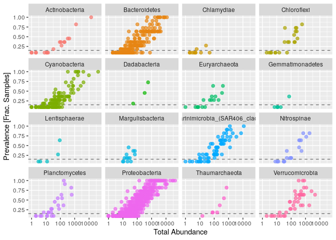

Contrôle continu 2 - Ecogénomique 2 - Rade de Brest
================

  - [Introduction](#introduction)
  - [Importation des packages](#importation-des-packages)
  - [Importation des données](#importation-des-données)
  - [Forward and Reverse](#forward-and-reverse)
  - [Profils de score de qualité](#profils-de-score-de-qualité)
  - [Apprendre le taux d’erreur](#apprendre-le-taux-derreur)
  - [Inférence des échantillons](#inférence-des-échantillons)
  - [Fusions des reads](#fusions-des-reads)
  - [Construction d’une table de
    séquence](#construction-dune-table-de-séquence)
      - [Distribution des longueurs des
        séquences](#distribution-des-longueurs-des-séquences)
  - [Elimination des chimères](#elimination-des-chimères)
  - [Suivi des reads dans le
    pipeline](#suivi-des-reads-dans-le-pipeline)
  - [Assignation de la taxonomie](#assignation-de-la-taxonomie)
  - [Evaluation de la précision](#evaluation-de-la-précision)
  - [Agglomération des taxons](#agglomération-des-taxons)
  - [Transformation de la valeur d’abondance selon la
    profondeur](#transformation-de-la-valeur-dabondance-selon-la-profondeur)
  - [Sous-ensemble par taxonomie](#sous-ensemble-par-taxonomie)
  - [Transformation de la valeur d’abondance selon la
    date](#transformation-de-la-valeur-dabondance-selon-la-date)
      - [Visualisation de l’ordination](#visualisation-de-lordination)
  - [Visualisation de l’abondance des différents
    phylums](#visualisation-de-labondance-des-différents-phylums)
  - [Conclusion](#conclusion)

# Introduction

A travers les différentes approches bioinformatiques utilisées,
l’objectif était de voir les influences relatives que pouvaient
entraîner la profondeur et la saison sur la structure des communautés
planctoniques de la rade de Brest. Enfin, nous voulions voir s’il
existait des biomarqueurs de saison (hiver et été).

# Importation des packages

``` r
library(BiocManager)
```

    ## Bioconductor version 3.11 (BiocManager 1.30.10), ?BiocManager::install for help

    ## Bioconductor version '3.11' is out-of-date; the current release version '3.12'
    ##   is available with R version '4.0'; see https://bioconductor.org/install

``` r
library(BiocVersion)
library(Biostrings)
```

    ## Loading required package: BiocGenerics

    ## Loading required package: parallel

    ## 
    ## Attaching package: 'BiocGenerics'

    ## The following objects are masked from 'package:parallel':
    ## 
    ##     clusterApply, clusterApplyLB, clusterCall, clusterEvalQ,
    ##     clusterExport, clusterMap, parApply, parCapply, parLapply,
    ##     parLapplyLB, parRapply, parSapply, parSapplyLB

    ## The following objects are masked from 'package:stats':
    ## 
    ##     IQR, mad, sd, var, xtabs

    ## The following objects are masked from 'package:base':
    ## 
    ##     anyDuplicated, append, as.data.frame, basename, cbind, colnames,
    ##     dirname, do.call, duplicated, eval, evalq, Filter, Find, get, grep,
    ##     grepl, intersect, is.unsorted, lapply, Map, mapply, match, mget,
    ##     order, paste, pmax, pmax.int, pmin, pmin.int, Position, rank,
    ##     rbind, Reduce, rownames, sapply, setdiff, sort, table, tapply,
    ##     union, unique, unsplit, which, which.max, which.min

    ## Loading required package: S4Vectors

    ## Loading required package: stats4

    ## 
    ## Attaching package: 'S4Vectors'

    ## The following object is masked from 'package:base':
    ## 
    ##     expand.grid

    ## Loading required package: IRanges

    ## Loading required package: XVector

    ## 
    ## Attaching package: 'Biostrings'

    ## The following object is masked from 'package:base':
    ## 
    ##     strsplit

``` r
library(dada2)
```

    ## Loading required package: Rcpp

``` r
library(DECIPHER)
```

    ## Loading required package: RSQLite

``` r
library(DESeq2)
```

    ## Loading required package: GenomicRanges

    ## Loading required package: GenomeInfoDb

    ## Loading required package: SummarizedExperiment

    ## Loading required package: Biobase

    ## Welcome to Bioconductor
    ## 
    ##     Vignettes contain introductory material; view with
    ##     'browseVignettes()'. To cite Bioconductor, see
    ##     'citation("Biobase")', and for packages 'citation("pkgname")'.

    ## Loading required package: DelayedArray

    ## Loading required package: matrixStats

    ## 
    ## Attaching package: 'matrixStats'

    ## The following objects are masked from 'package:Biobase':
    ## 
    ##     anyMissing, rowMedians

    ## 
    ## Attaching package: 'DelayedArray'

    ## The following objects are masked from 'package:matrixStats':
    ## 
    ##     colMaxs, colMins, colRanges, rowMaxs, rowMins, rowRanges

    ## The following objects are masked from 'package:base':
    ## 
    ##     aperm, apply, rowsum

``` r
library(ggplot2)
library(grDevices)
library(gridExtra)
```

    ## 
    ## Attaching package: 'gridExtra'

    ## The following object is masked from 'package:Biobase':
    ## 
    ##     combine

    ## The following object is masked from 'package:BiocGenerics':
    ## 
    ##     combine

``` r
library(igraph)
```

    ## 
    ## Attaching package: 'igraph'

    ## The following objects are masked from 'package:DelayedArray':
    ## 
    ##     path, simplify

    ## The following object is masked from 'package:GenomicRanges':
    ## 
    ##     union

    ## The following object is masked from 'package:Biostrings':
    ## 
    ##     union

    ## The following object is masked from 'package:IRanges':
    ## 
    ##     union

    ## The following object is masked from 'package:S4Vectors':
    ## 
    ##     union

    ## The following objects are masked from 'package:BiocGenerics':
    ## 
    ##     normalize, path, union

    ## The following objects are masked from 'package:stats':
    ## 
    ##     decompose, spectrum

    ## The following object is masked from 'package:base':
    ## 
    ##     union

``` r
library(IRanges)
library(phyloseq)
```

    ## 
    ## Attaching package: 'phyloseq'

    ## The following object is masked from 'package:SummarizedExperiment':
    ## 
    ##     distance

    ## The following object is masked from 'package:Biobase':
    ## 
    ##     sampleNames

    ## The following object is masked from 'package:GenomicRanges':
    ## 
    ##     distance

    ## The following object is masked from 'package:IRanges':
    ## 
    ##     distance

``` r
library(phyloseqGraphTest)
library(pls)
```

    ## 
    ## Attaching package: 'pls'

    ## The following object is masked from 'package:stats':
    ## 
    ##     loadings

``` r
library(ps)
library(reshape2)
```

# Importation des données

Les données ont été importées. Il s’agit de prélèvements effectués dans
la rade de Brest en 2014 et en 2015. Les données ont été définies dans
un répertoire précis.

``` bash
wget https://pagesperso.univ-brest.fr/~maignien/teaching/M1-MFA/UE-Ecogenomique2/EcoG2_data_cc2.tar.gz
tar xvzf EcoG2_data_cc2.tar.gz
```

    ## --2020-12-18 15:07:32--  https://pagesperso.univ-brest.fr/~maignien/teaching/M1-MFA/UE-Ecogenomique2/EcoG2_data_cc2.tar.gz
    ## Resolving pagesperso.univ-brest.fr (pagesperso.univ-brest.fr)... 195.83.247.112
    ## Connecting to pagesperso.univ-brest.fr (pagesperso.univ-brest.fr)|195.83.247.112|:443... connected.
    ## HTTP request sent, awaiting response... 200 OK
    ## Length: 333839543 (318M) [application/x-gzip]
    ## Saving to: ‘EcoG2_data_cc2.tar.gz.11’
    ## 
    ##      0K .......... .......... .......... .......... ..........  0% 1.22M 4m21s
    ##     50K .......... .......... .......... .......... ..........  0% 2.48M 3m14s
    ##    100K .......... .......... .......... .......... ..........  0% 2.38M 2m54s
    ##    150K .......... .......... .......... .......... ..........  0% 18.3M 2m15s
    ##    200K .......... .......... .......... .......... ..........  0% 2.59M 2m12s
    ##    250K .......... .......... .......... .......... ..........  0% 2.23M 2m14s
    ##    300K .......... .......... .......... .......... ..........  0% 2.87M 2m11s
    ##    350K .......... .......... .......... .......... ..........  0% 2.47M 2m11s
    ##    400K .......... .......... .......... .......... ..........  0% 2.50M 2m10s
    ##    450K .......... .......... .......... .......... ..........  0% 2.49M 2m10s
    ##    500K .......... .......... .......... .......... ..........  0% 11.2M 2m1s
    ##    550K .......... .......... .......... .......... ..........  0% 2.55M 2m1s
    ##    600K .......... .......... .......... .......... ..........  0% 2.45M 2m2s
    ##    650K .......... .......... .......... .......... ..........  0% 2.30M 2m3s
    ##    700K .......... .......... .......... .......... ..........  0% 1.41M 2m10s
    ##    750K .......... .......... .......... .......... ..........  0% 10.1M 2m4s
    ##    800K .......... .......... .......... .......... ..........  0% 2.48M 2m4s
    ##    850K .......... .......... .......... .......... ..........  0% 2.48M 2m4s
    ##    900K .......... .......... .......... .......... ..........  0% 2.45M 2m4s
    ##    950K .......... .......... .......... .......... ..........  0% 3.13M 2m3s
    ##   1000K .......... .......... .......... .......... ..........  0% 2.88M 2m2s
    ##   1050K .......... .......... .......... .......... ..........  0% 6.10M 1m59s
    ##   1100K .......... .......... .......... .......... ..........  0% 2.47M 2m0s
    ##   1150K .......... .......... .......... .......... ..........  0% 3.24M 1m59s
    ##   1200K .......... .......... .......... .......... ..........  0% 2.50M 1m59s
    ##   1250K .......... .......... .......... .......... ..........  0% 2.57M 1m59s
    ##   1300K .......... .......... .......... .......... ..........  0% 7.81M 1m56s
    ##   1350K .......... .......... .......... .......... ..........  0% 2.43M 1m57s
    ##   1400K .......... .......... .......... .......... ..........  0% 2.55M 1m57s
    ##   1450K .......... .......... .......... .......... ..........  0% 3.03M 1m57s
    ##   1500K .......... .......... .......... .......... ..........  0% 3.49M 1m56s
    ##   1550K .......... .......... .......... .......... ..........  0% 4.73M 1m54s
    ##   1600K .......... .......... .......... .......... ..........  0% 2.47M 1m55s
    ##   1650K .......... .......... .......... .......... ..........  0% 2.50M 1m55s
    ##   1700K .......... .......... .......... .......... ..........  0% 3.19M 1m54s
    ##   1750K .......... .......... .......... .......... ..........  0% 3.60M 1m54s
    ##   1800K .......... .......... .......... .......... ..........  0% 4.30M 1m53s
    ##   1850K .......... .......... .......... .......... ..........  0% 2.47M 1m53s
    ##   1900K .......... .......... .......... .......... ..........  0% 3.42M 1m52s
    ##   1950K .......... .......... .......... .......... ..........  0% 2.53M 1m53s
    ##   2000K .......... .......... .......... .......... ..........  0% 2.48M 1m53s
    ##   2050K .......... .......... .......... .......... ..........  0% 3.73M 1m52s
    ##   2100K .......... .......... .......... .......... ..........  0% 3.81M 1m52s
    ##   2150K .......... .......... .......... .......... ..........  0% 2.54M 1m52s
    ##   2200K .......... .......... .......... .......... ..........  0% 3.59M 1m51s
    ##   2250K .......... .......... .......... .......... ..........  0% 3.71M 1m51s
    ##   2300K .......... .......... .......... .......... ..........  0% 3.39M 1m50s
    ##   2350K .......... .......... .......... .......... ..........  0% 2.57M 1m51s
    ##   2400K .......... .......... .......... .......... ..........  0% 2.52M 1m51s
    ##   2450K .......... .......... .......... .......... ..........  0% 3.75M 1m50s
    ##   2500K .......... .......... .......... .......... ..........  0% 3.99M 1m50s
    ##   2550K .......... .......... .......... .......... ..........  0% 3.33M 1m49s
    ##   2600K .......... .......... .......... .......... ..........  0% 2.60M 1m50s
    ##   2650K .......... .......... .......... .......... ..........  0% 3.40M 1m49s
    ##   2700K .......... .......... .......... .......... ..........  0% 2.48M 1m50s
    ##   2750K .......... .......... .......... .......... ..........  0% 7.19M 1m48s
    ##   2800K .......... .......... .......... .......... ..........  0% 2.06M 1m49s
    ##   2850K .......... .......... .......... .......... ..........  0% 3.09M 1m49s
    ##   2900K .......... .......... .......... .......... ..........  0% 2.56M 1m49s
    ##   2950K .......... .......... .......... .......... ..........  0% 3.62M 1m49s
    ##   3000K .......... .......... .......... .......... ..........  0% 4.56M 1m48s
    ##   3050K .......... .......... .......... .......... ..........  0% 2.93M 1m48s
    ##   3100K .......... .......... .......... .......... ..........  0% 2.54M 1m48s
    ##   3150K .......... .......... .......... .......... ..........  0% 4.00M 1m48s
    ##   3200K .......... .......... .......... .......... ..........  0% 2.49M 1m48s
    ##   3250K .......... .......... .......... .......... ..........  1% 2.51M 1m49s
    ##   3300K .......... .......... .......... .......... ..........  1% 5.91M 1m48s
    ##   3350K .......... .......... .......... .......... ..........  1% 2.49M 1m48s
    ##   3400K .......... .......... .......... .......... ..........  1% 2.59M 1m48s
    ##   3450K .......... .......... .......... .......... ..........  1% 2.46M 1m48s
    ##   3500K .......... .......... .......... .......... ..........  1% 3.94M 1m48s
    ##   3550K .......... .......... .......... .......... ..........  1% 2.44M 1m48s
    ##   3600K .......... .......... .......... .......... ..........  1% 2.42M 1m49s
    ##   3650K .......... .......... .......... .......... ..........  1% 2.55M 1m49s
    ##   3700K .......... .......... .......... .......... ..........  1% 6.56M 1m48s
    ##   3750K .......... .......... .......... .......... ..........  1% 2.33M 1m48s
    ##   3800K .......... .......... .......... .......... ..........  1% 2.47M 1m48s
    ##   3850K .......... .......... .......... .......... ..........  1% 2.42M 1m49s
    ##   3900K .......... .......... .......... .......... ..........  1% 2.36M 1m49s
    ##   3950K .......... .......... .......... .......... ..........  1% 2.57M 1m49s
    ##   4000K .......... .......... .......... .......... ..........  1% 2.41M 1m49s
    ##   4050K .......... .......... .......... .......... ..........  1% 2.87M 1m49s
    ##   4100K .......... .......... .......... .......... ..........  1% 3.66M 1m49s
    ##   4150K .......... .......... .......... .......... ..........  1% 2.46M 1m49s
    ##   4200K .......... .......... .......... .......... ..........  1% 2.49M 1m49s
    ##   4250K .......... .......... .......... .......... ..........  1% 2.84M 1m49s
    ##   4300K .......... .......... .......... .......... ..........  1% 4.89M 1m49s
    ##   4350K .......... .......... .......... .......... ..........  1% 2.63M 1m49s
    ##   4400K .......... .......... .......... .......... ..........  1% 2.39M 1m49s
    ##   4450K .......... .......... .......... .......... ..........  1% 2.49M 1m49s
    ##   4500K .......... .......... .......... .......... ..........  1% 2.57M 1m50s
    ##   4550K .......... .......... .......... .......... ..........  1% 2.90M 1m50s
    ##   4600K .......... .......... .......... .......... ..........  1% 3.51M 1m49s
    ##   4650K .......... .......... .......... .......... ..........  1% 1.98M 1m50s
    ##   4700K .......... .......... .......... .......... ..........  1% 3.09M 1m50s
    ##   4750K .......... .......... .......... .......... ..........  1% 2.43M 1m50s
    ##   4800K .......... .......... .......... .......... ..........  1% 2.41M 1m50s
    ##   4850K .......... .......... .......... .......... ..........  1% 2.45M 1m50s
    ##   4900K .......... .......... .......... .......... ..........  1% 2.49M 1m50s
    ##   4950K .......... .......... .......... .......... ..........  1% 2.49M 1m51s
    ##   5000K .......... .......... .......... .......... ..........  1% 2.56M 1m51s
    ##   5050K .......... .......... .......... .......... ..........  1% 2.59M 1m51s
    ##   5100K .......... .......... .......... .......... ..........  1% 12.4M 1m50s
    ##   5150K .......... .......... .......... .......... ..........  1% 2.61M 1m50s
    ##   5200K .......... .......... .......... .......... ..........  1% 2.52M 1m50s
    ##   5250K .......... .......... .......... .......... ..........  1% 2.61M 1m50s
    ##   5300K .......... .......... .......... .......... ..........  1% 2.71M 1m50s
    ##   5350K .......... .......... .......... .......... ..........  1% 2.44M 1m50s
    ##   5400K .......... .......... .......... .......... ..........  1% 15.9M 1m49s
    ##   5450K .......... .......... .......... .......... ..........  1% 2.54M 1m50s
    ##   5500K .......... .......... .......... .......... ..........  1% 2.66M 1m50s
    ##   5550K .......... .......... .......... .......... ..........  1% 2.44M 1m50s
    ##   5600K .......... .......... .......... .......... ..........  1% 2.45M 1m50s
    ##   5650K .......... .......... .......... .......... ..........  1% 2.47M 1m50s
    ##   5700K .......... .......... .......... .......... ..........  1% 15.2M 1m49s
    ##   5750K .......... .......... .......... .......... ..........  1% 2.50M 1m49s
    ##   5800K .......... .......... .......... .......... ..........  1% 2.47M 1m50s
    ##   5850K .......... .......... .......... .......... ..........  1% 2.44M 1m50s
    ##   5900K .......... .......... .......... .......... ..........  1% 1.47M 1m51s
    ##   5950K .......... .......... .......... .......... ..........  1% 7.77M 1m50s
    ##   6000K .......... .......... .......... .......... ..........  1% 1.34M 1m51s
    ##   6050K .......... .......... .......... .......... ..........  1% 3.04M 1m51s
    ##   6100K .......... .......... .......... .......... ..........  1% 2.51M 1m51s
    ##   6150K .......... .......... .......... .......... ..........  1% 1.93M 1m51s
    ##   6200K .......... .......... .......... .......... ..........  1% 2.28M 1m51s
    ##   6250K .......... .......... .......... .......... ..........  1% 1.27M 1m53s
    ##   6300K .......... .......... .......... .......... ..........  1% 1.34M 1m53s
    ##   6350K .......... .......... .......... .......... ..........  1% 2.11M 1m54s
    ##   6400K .......... .......... .......... .......... ..........  1%  853K 1m56s
    ##   6450K .......... .......... .......... .......... ..........  1% 1.23M 1m57s
    ##   6500K .......... .......... .......... .......... ..........  2% 1.23M 1m58s
    ##   6550K .......... .......... .......... .......... ..........  2%  912K 2m0s
    ##   6600K .......... .......... .......... .......... ..........  2% 1.25M 2m0s
    ##   6650K .......... .......... .......... .......... ..........  2% 1.96M 2m1s
    ##   6700K .......... .......... .......... .......... ..........  2% 1.23M 2m2s
    ##   6750K .......... .......... .......... .......... ..........  2% 1.22M 2m3s
    ##   6800K .......... .......... .......... .......... ..........  2% 1.24M 2m4s
    ##   6850K .......... .......... .......... .......... ..........  2% 1.50M 2m4s
    ##   6900K .......... .......... .......... .......... ..........  2% 1.79M 2m5s
    ##   6950K .......... .......... .......... .......... ..........  2% 1.53M 2m5s
    ##   7000K .......... .......... .......... .......... ..........  2% 1.81M 2m5s
    ##   7050K .......... .......... .......... .......... ..........  2% 1.55M 2m6s
    ##   7100K .......... .......... .......... .......... ..........  2% 2.47M 2m6s
    ##   7150K .......... .......... .......... .......... ..........  2% 1.47M 2m6s
    ##   7200K .......... .......... .......... .......... ..........  2% 1.89M 2m7s
    ##   7250K .......... .......... .......... .......... ..........  2% 1.48M 2m7s
    ##   7300K .......... .......... .......... .......... ..........  2% 2.48M 2m7s
    ##   7350K .......... .......... .......... .......... ..........  2% 2.44M 2m7s
    ##   7400K .......... .......... .......... .......... ..........  2% 1.91M 2m7s
    ##   7450K .......... .......... .......... .......... ..........  2% 2.48M 2m7s
    ##   7500K .......... .......... .......... .......... ..........  2% 2.48M 2m7s
    ##   7550K .......... .......... .......... .......... ..........  2% 2.53M 2m7s
    ##   7600K .......... .......... .......... .......... ..........  2% 1.43M 2m8s
    ##   7650K .......... .......... .......... .......... ..........  2% 2.01M 2m8s
    ##   7700K .......... .......... .......... .......... ..........  2% 1.43M 2m9s
    ##   7750K .......... .......... .......... .......... ..........  2% 2.45M 2m9s
    ##   7800K .......... .......... .......... .......... ..........  2% 2.02M 2m9s
    ##   7850K .......... .......... .......... .......... ..........  2% 2.42M 2m9s
    ##   7900K .......... .......... .......... .......... ..........  2% 1.42M 2m9s
    ##   7950K .......... .......... .......... .......... ..........  2% 1.99M 2m9s
    ##   8000K .......... .......... .......... .......... ..........  2% 1.43M 2m10s
    ##   8050K .......... .......... .......... .......... ..........  2% 2.47M 2m10s
    ##   8100K .......... .......... .......... .......... ..........  2% 2.04M 2m10s
    ##   8150K .......... .......... .......... .......... ..........  2% 1.23M 2m11s
    ##   8200K .......... .......... .......... .......... ..........  2% 1.41M 2m11s
    ##   8250K .......... .......... .......... .......... ..........  2% 2.40M 2m11s
    ##   8300K .......... .......... .......... .......... ..........  2% 1.23M 2m12s
    ##   8350K .......... .......... .......... .......... ..........  2% 2.46M 2m12s
    ##   8400K .......... .......... .......... .......... ..........  2% 1.25M 2m12s
    ##   8450K .......... .......... .......... .......... ..........  2% 2.42M 2m12s
    ##   8500K .......... .......... .......... .......... ..........  2% 2.16M 2m12s
    ##   8550K .......... .......... .......... .......... ..........  2% 1.89M 2m13s
    ##   8600K .......... .......... .......... .......... ..........  2% 1.50M 2m13s
    ##   8650K .......... .......... .......... .......... ..........  2% 2.57M 2m13s
    ##   8700K .......... .......... .......... .......... ..........  2% 2.46M 2m13s
    ##   8750K .......... .......... .......... .......... ..........  2% 2.43M 2m13s
    ##   8800K .......... .......... .......... .......... ..........  2% 1.77M 2m13s
    ##   8850K .......... .......... .......... .......... ..........  2% 1.53M 2m13s
    ##   8900K .......... .......... .......... .......... ..........  2% 1.24M 2m14s
    ##   8950K .......... .......... .......... .......... ..........  2% 2.42M 2m14s
    ##   9000K .......... .......... .......... .......... ..........  2% 1.26M 2m15s
    ##   9050K .......... .......... .......... .......... ..........  2% 2.42M 2m15s
    ##   9100K .......... .......... .......... .......... ..........  2% 1.92M 2m15s
    ##   9150K .......... .......... .......... .......... ..........  2% 1.50M 2m15s
    ##   9200K .......... .......... .......... .......... ..........  2% 1.26M 2m16s
    ##   9250K .......... .......... .......... .......... ..........  2% 2.35M 2m16s
    ##   9300K .......... .......... .......... .......... ..........  2% 2.49M 2m16s
    ##   9350K .......... .......... .......... .......... ..........  2% 1.99M 2m16s
    ##   9400K .......... .......... .......... .......... ..........  2% 1.47M 2m16s
    ##   9450K .......... .......... .......... .......... ..........  2% 2.31M 2m16s
    ##   9500K .......... .......... .......... .......... ..........  2% 2.40M 2m16s
    ##   9550K .......... .......... .......... .......... ..........  2% 2.31M 2m16s
    ##   9600K .......... .......... .......... .......... ..........  2% 1.34M 2m16s
    ##   9650K .......... .......... .......... .......... ..........  2% 2.42M 2m16s
    ##   9700K .......... .......... .......... .......... ..........  2% 2.47M 2m16s
    ##   9750K .......... .......... .......... .......... ..........  3% 2.16M 2m16s
    ##   9800K .......... .......... .......... .......... ..........  3% 2.44M 2m16s
    ##   9850K .......... .......... .......... .......... ..........  3% 2.49M 2m16s
    ##   9900K .......... .......... .......... .......... ..........  3% 2.50M 2m16s
    ##   9950K .......... .......... .......... .......... ..........  3% 2.47M 2m16s
    ##  10000K .......... .......... .......... .......... ..........  3% 2.37M 2m16s
    ##  10050K .......... .......... .......... .......... ..........  3% 2.47M 2m16s
    ##  10100K .......... .......... .......... .......... ..........  3% 2.47M 2m16s
    ##  10150K .......... .......... .......... .......... ..........  3% 2.75M 2m16s
    ##  10200K .......... .......... .......... .......... ..........  3% 2.46M 2m15s
    ##  10250K .......... .......... .......... .......... ..........  3% 2.34M 2m15s
    ##  10300K .......... .......... .......... .......... ..........  3% 2.88M 2m15s
    ##  10350K .......... .......... .......... .......... ..........  3% 2.55M 2m15s
    ##  10400K .......... .......... .......... .......... ..........  3% 2.25M 2m15s
    ##  10450K .......... .......... .......... .......... ..........  3% 2.85M 2m15s
    ##  10500K .......... .......... .......... .......... ..........  3% 7.76M 2m15s
    ##  10550K .......... .......... .......... .......... ..........  3% 2.51M 2m14s
    ##  10600K .......... .......... .......... .......... ..........  3% 2.51M 2m14s
    ##  10650K .......... .......... .......... .......... ..........  3% 2.39M 2m14s
    ##  10700K .......... .......... .......... .......... ..........  3% 2.49M 2m14s
    ##  10750K .......... .......... .......... .......... ..........  3% 1.47M 2m15s
    ##  10800K .......... .......... .......... .......... ..........  3% 2.34M 2m15s
    ##  10850K .......... .......... .......... .......... ..........  3% 2.03M 2m15s
    ##  10900K .......... .......... .......... .......... ..........  3% 1.46M 2m15s
    ##  10950K .......... .......... .......... .......... ..........  3% 2.41M 2m15s
    ##  11000K .......... .......... .......... .......... ..........  3% 2.02M 2m15s
    ##  11050K .......... .......... .......... .......... ..........  3% 2.48M 2m15s
    ##  11100K .......... .......... .......... .......... ..........  3% 2.41M 2m15s
    ##  11150K .......... .......... .......... .......... ..........  3% 2.46M 2m15s
    ##  11200K .......... .......... .......... .......... ..........  3% 1.24M 2m15s
    ##  11250K .......... .......... .......... .......... ..........  3% 2.49M 2m15s
    ##  11300K .......... .......... .......... .......... ..........  3% 2.53M 2m15s
    ##  11350K .......... .......... .......... .......... ..........  3% 2.37M 2m15s
    ##  11400K .......... .......... .......... .......... ..........  3% 1.60M 2m15s
    ##  11450K .......... .......... .......... .......... ..........  3% 2.51M 2m15s
    ##  11500K .......... .......... .......... .......... ..........  3% 2.20M 2m15s
    ##  11550K .......... .......... .......... .......... ..........  3% 2.17M 2m15s
    ##  11600K .......... .......... .......... .......... ..........  3% 2.41M 2m15s
    ##  11650K .......... .......... .......... .......... ..........  3% 2.43M 2m15s
    ##  11700K .......... .......... .......... .......... ..........  3% 2.47M 2m15s
    ##  11750K .......... .......... .......... .......... ..........  3% 2.50M 2m15s
    ##  11800K .......... .......... .......... .......... ..........  3% 2.46M 2m15s
    ##  11850K .......... .......... .......... .......... ..........  3% 2.47M 2m15s
    ##  11900K .......... .......... .......... .......... ..........  3% 3.59M 2m15s
    ##  11950K .......... .......... .......... .......... ..........  3% 2.03M 2m15s
    ##  12000K .......... .......... .......... .......... ..........  3% 2.28M 2m15s
    ##  12050K .......... .......... .......... .......... ..........  3% 2.46M 2m15s
    ##  12100K .......... .......... .......... .......... ..........  3% 2.44M 2m14s
    ##  12150K .......... .......... .......... .......... ..........  3% 2.54M 2m14s
    ##  12200K .......... .......... .......... .......... ..........  3% 2.49M 2m14s
    ##  12250K .......... .......... .......... .......... ..........  3% 3.68M 2m14s
    ##  12300K .......... .......... .......... .......... ..........  3% 2.06M 2m14s
    ##  12350K .......... .......... .......... .......... ..........  3% 1.97M 2m14s
    ##  12400K .......... .......... .......... .......... ..........  3% 1.40M 2m15s
    ##  12450K .......... .......... .......... .......... ..........  3% 2.49M 2m14s
    ##  12500K .......... .......... .......... .......... ..........  3% 2.08M 2m14s
    ##  12550K .......... .......... .......... .......... ..........  3% 2.46M 2m14s
    ##  12600K .......... .......... .......... .......... ..........  3% 2.45M 2m14s
    ##  12650K .......... .......... .......... .......... ..........  3% 1.60M 2m15s
    ##  12700K .......... .......... .......... .......... ..........  3% 2.48M 2m14s
    ##  12750K .......... .......... .......... .......... ..........  3% 2.48M 2m14s
    ##  12800K .......... .......... .......... .......... ..........  3% 2.42M 2m14s
    ##  12850K .......... .......... .......... .......... ..........  3% 2.48M 2m14s
    ##  12900K .......... .......... .......... .......... ..........  3% 1.77M 2m14s
    ##  12950K .......... .......... .......... .......... ..........  3% 2.53M 2m14s
    ##  13000K .......... .......... .......... .......... ..........  4% 2.48M 2m14s
    ##  13050K .......... .......... .......... .......... ..........  4% 2.46M 2m14s
    ##  13100K .......... .......... .......... .......... ..........  4% 2.42M 2m14s
    ##  13150K .......... .......... .......... .......... ..........  4% 2.81M 2m14s
    ##  13200K .......... .......... .......... .......... ..........  4% 2.27M 2m14s
    ##  13250K .......... .......... .......... .......... ..........  4% 2.48M 2m14s
    ##  13300K .......... .......... .......... .......... ..........  4% 2.52M 2m14s
    ##  13350K .......... .......... .......... .......... ..........  4% 2.50M 2m14s
    ##  13400K .......... .......... .......... .......... ..........  4% 2.50M 2m14s
    ##  13450K .......... .......... .......... .......... ..........  4% 2.47M 2m14s
    ##  13500K .......... .......... .......... .......... ..........  4% 2.49M 2m14s
    ##  13550K .......... .......... .......... .......... ..........  4% 2.51M 2m14s
    ##  13600K .......... .......... .......... .......... ..........  4% 1.23M 2m14s
    ##  13650K .......... .......... .......... .......... ..........  4% 2.48M 2m14s
    ##  13700K .......... .......... .......... .......... ..........  4% 2.42M 2m14s
    ##  13750K .......... .......... .......... .......... ..........  4% 2.37M 2m14s
    ##  13800K .......... .......... .......... .......... ..........  4% 1.24M 2m14s
    ##  13850K .......... .......... .......... .......... ..........  4% 1.34M 2m15s
    ##  13900K .......... .......... .......... .......... ..........  4% 1.25M 2m15s
    ##  13950K .......... .......... .......... .......... ..........  4% 2.04M 2m15s
    ##  14000K .......... .......... .......... .......... ..........  4%  911K 2m16s
    ##  14050K .......... .......... .......... .......... ..........  4% 2.06M 2m16s
    ##  14100K .......... .......... .......... .......... ..........  4% 1.37M 2m16s
    ##  14150K .......... .......... .......... .......... ..........  4% 1.23M 2m16s
    ##  14200K .......... .......... .......... .......... ..........  4% 2.04M 2m16s
    ##  14250K .......... .......... .......... .......... ..........  4% 1.24M 2m17s
    ##  14300K .......... .......... .......... .......... ..........  4% 1.22M 2m17s
    ##  14350K .......... .......... .......... .......... ..........  4% 1.21M 2m17s
    ##  14400K .......... .......... .......... .......... ..........  4% 1.23M 2m18s
    ##  14450K .......... .......... .......... .......... ..........  4% 1.25M 2m18s
    ##  14500K .......... .......... .......... .......... ..........  4% 1.45M 2m18s
    ##  14550K .......... .......... .......... .......... ..........  4% 1.89M 2m18s
    ##  14600K .......... .......... .......... .......... ..........  4% 1.43M 2m19s
    ##  14650K .......... .......... .......... .......... ..........  4% 1.89M 2m19s
    ##  14700K .......... .......... .......... .......... ..........  4% 1.43M 2m19s
    ##  14750K .......... .......... .......... .......... ..........  4% 2.44M 2m19s
    ##  14800K .......... .......... .......... .......... ..........  4% 1.09M 2m19s
    ##  14850K .......... .......... .......... .......... ..........  4% 1.45M 2m20s
    ##  14900K .......... .......... .......... .......... ..........  4% 1.23M 2m20s
    ##  14950K .......... .......... .......... .......... ..........  4% 1.23M 2m20s
    ##  15000K .......... .......... .......... .......... ..........  4% 2.10M 2m20s
    ##  15050K .......... .......... .......... .......... ..........  4% 1.35M 2m20s
    ##  15100K .......... .......... .......... .......... ..........  4% 2.02M 2m20s
    ##  15150K .......... .......... .......... .......... ..........  4% 1.38M 2m21s
    ##  15200K .......... .......... .......... .......... ..........  4% 1.23M 2m21s
    ##  15250K .......... .......... .......... .......... ..........  4% 1.63M 2m21s
    ##  15300K .......... .......... .......... .......... ..........  4% 1.68M 2m21s
    ##  15350K .......... .......... .......... .......... ..........  4% 2.32M 2m21s
    ##  15400K .......... .......... .......... .......... ..........  4% 1.69M 2m21s
    ##  15450K .......... .......... .......... .......... ..........  4% 1.62M 2m21s
    ##  15500K .......... .......... .......... .......... ..........  4% 2.45M 2m21s
    ##  15550K .......... .......... .......... .......... ..........  4% 2.43M 2m21s
    ##  15600K .......... .......... .......... .......... ..........  4% 1.23M 2m22s
    ##  15650K .......... .......... .......... .......... ..........  4% 2.43M 2m22s
    ##  15700K .......... .......... .......... .......... ..........  4% 2.43M 2m21s
    ##  15750K .......... .......... .......... .......... ..........  4% 1.81M 2m22s
    ##  15800K .......... .......... .......... .......... ..........  4% 1.51M 2m22s
    ##  15850K .......... .......... .......... .......... ..........  4%  850K 2m22s
    ##  15900K .......... .......... .......... .......... ..........  4% 1.24M 2m23s
    ##  15950K .......... .......... .......... .......... ..........  4% 1.23M 2m23s
    ##  16000K .......... .......... .......... .......... ..........  4%  834K 2m24s
    ##  16050K .......... .......... .......... .......... ..........  4% 1.90M 2m24s
    ##  16100K .......... .......... .......... .......... ..........  4% 1.42M 2m24s
    ##  16150K .......... .......... .......... .......... ..........  4% 1.23M 2m24s
    ##  16200K .......... .......... .......... .......... ..........  4% 2.41M 2m24s
    ##  16250K .......... .......... .......... .......... ..........  4% 1.23M 2m24s
    ##  16300K .......... .......... .......... .......... ..........  5% 2.03M 2m24s
    ##  16350K .......... .......... .......... .......... ..........  5% 1.38M 2m25s
    ##  16400K .......... .......... .......... .......... ..........  5% 1.24M 2m25s
    ##  16450K .......... .......... .......... .......... ..........  5% 2.45M 2m25s
    ##  16500K .......... .......... .......... .......... ..........  5% 2.11M 2m25s
    ##  16550K .......... .......... .......... .......... ..........  5% 1.37M 2m25s
    ##  16600K .......... .......... .......... .......... ..........  5% 2.48M 2m25s
    ##  16650K .......... .......... .......... .......... ..........  5% 2.07M 2m25s
    ##  16700K .......... .......... .......... .......... ..........  5% 1.36M 2m25s
    ##  16750K .......... .......... .......... .......... ..........  5% 2.36M 2m25s
    ##  16800K .......... .......... .......... .......... ..........  5% 1.14M 2m25s
    ##  16850K .......... .......... .......... .......... ..........  5% 1.35M 2m25s
    ##  16900K .......... .......... .......... .......... ..........  5% 2.09M 2m25s
    ##  16950K .......... .......... .......... .......... ..........  5% 1.23M 2m26s
    ##  17000K .......... .......... .......... .......... ..........  5% 1.37M 2m26s
    ##  17050K .......... .......... .......... .......... ..........  5% 1.22M 2m26s
    ##  17100K .......... .......... .......... .......... ..........  5% 1.22M 2m26s
    ##  17150K .......... .......... .......... .......... ..........  5% 1.24M 2m27s
    ##  17200K .......... .......... .......... .......... ..........  5%  842K 2m27s
    ##  17250K .......... .......... .......... .......... ..........  5% 1.24M 2m28s
    ##  17300K .......... .......... .......... .......... ..........  5% 1.22M 2m28s
    ##  17350K .......... .......... .......... .......... ..........  5% 1.25M 2m28s
    ##  17400K .......... .......... .......... .......... ..........  5% 2.38M 2m28s
    ##  17450K .......... .......... .......... .......... ..........  5% 1.27M 2m28s
    ##  17500K .......... .......... .......... .......... ..........  5% 1.23M 2m29s
    ##  17550K .......... .......... .......... .......... ..........  5% 2.28M 2m28s
    ##  17600K .......... .......... .......... .......... ..........  5% 1.24M 2m29s
    ##  17650K .......... .......... .......... .......... ..........  5% 1.29M 2m29s
    ##  17700K .......... .......... .......... .......... ..........  5% 2.48M 2m29s
    ##  17750K .......... .......... .......... .......... ..........  5% 2.35M 2m29s
    ##  17800K .......... .......... .......... .......... ..........  5% 1.28M 2m29s
    ##  17850K .......... .......... .......... .......... ..........  5% 2.49M 2m29s
    ##  17900K .......... .......... .......... .......... ..........  5% 2.38M 2m29s
    ##  17950K .......... .......... .......... .......... ..........  5% 2.24M 2m29s
    ##  18000K .......... .......... .......... .......... ..........  5% 1.28M 2m29s
    ##  18050K .......... .......... .......... .......... ..........  5% 2.45M 2m29s
    ##  18100K .......... .......... .......... .......... ..........  5% 2.46M 2m29s
    ##  18150K .......... .......... .......... .......... ..........  5% 2.45M 2m29s
    ##  18200K .......... .......... .......... .......... ..........  5% 1.29M 2m29s
    ##  18250K .......... .......... .......... .......... ..........  5% 1.24M 2m29s
    ##  18300K .......... .......... .......... .......... ..........  5% 1.18M 2m29s
    ##  18350K .......... .......... .......... .......... ..........  5% 1.28M 2m29s
    ##  18400K .......... .......... .......... .......... ..........  5% 1.26M 2m30s
    ##  18450K .......... .......... .......... .......... ..........  5% 2.32M 2m30s
    ##  18500K .......... .......... .......... .......... ..........  5% 1.29M 2m30s
    ##  18550K .......... .......... .......... .......... ..........  5% 2.40M 2m30s
    ##  18600K .......... .......... .......... .......... ..........  5% 2.41M 2m30s
    ##  18650K .......... .......... .......... .......... ..........  5% 1.24M 2m30s
    ##  18700K .......... .......... .......... .......... ..........  5% 2.43M 2m30s
    ##  18750K .......... .......... .......... .......... ..........  5% 2.37M 2m30s
    ##  18800K .......... .......... .......... .......... ..........  5% 1.27M 2m30s
    ##  18850K .......... .......... .......... .......... ..........  5% 2.46M 2m30s
    ##  18900K .......... .......... .......... .......... ..........  5% 2.41M 2m30s
    ##  18950K .......... .......... .......... .......... ..........  5% 2.51M 2m30s
    ##  19000K .......... .......... .......... .......... ..........  5% 2.33M 2m30s
    ##  19050K .......... .......... .......... .......... ..........  5% 1.31M 2m30s
    ##  19100K .......... .......... .......... .......... ..........  5% 2.51M 2m30s
    ##  19150K .......... .......... .......... .......... ..........  5% 2.33M 2m30s
    ##  19200K .......... .......... .......... .......... ..........  5% 2.37M 2m29s
    ##  19250K .......... .......... .......... .......... ..........  5% 2.40M 2m29s
    ##  19300K .......... .......... .......... .......... ..........  5% 1.31M 2m30s
    ##  19350K .......... .......... .......... .......... ..........  5% 2.46M 2m29s
    ##  19400K .......... .......... .......... .......... ..........  5% 1.23M 2m30s
    ##  19450K .......... .......... .......... .......... ..........  5% 2.34M 2m30s
    ##  19500K .......... .......... .......... .......... ..........  5% 1.25M 2m30s
    ##  19550K .......... .......... .......... .......... ..........  6% 2.34M 2m30s
    ##  19600K .......... .......... .......... .......... ..........  6% 1.24M 2m30s
    ##  19650K .......... .......... .......... .......... ..........  6% 1.36M 2m30s
    ##  19700K .......... .......... .......... .......... ..........  6% 2.03M 2m30s
    ##  19750K .......... .......... .......... .......... ..........  6% 2.40M 2m30s
    ##  19800K .......... .......... .......... .......... ..........  6% 2.47M 2m30s
    ##  19850K .......... .......... .......... .......... ..........  6% 2.40M 2m30s
    ##  19900K .......... .......... .......... .......... ..........  6% 1.48M 2m30s
    ##  19950K .......... .......... .......... .......... ..........  6% 1.84M 2m30s
    ##  20000K .......... .......... .......... .......... ..........  6% 2.39M 2m30s
    ##  20050K .......... .......... .......... .......... ..........  6% 2.49M 2m30s
    ##  20100K .......... .......... .......... .......... ..........  6% 2.48M 2m30s
    ##  20150K .......... .......... .......... .......... ..........  6% 1.54M 2m30s
    ##  20200K .......... .......... .......... .......... ..........  6% 2.34M 2m30s
    ##  20250K .......... .......... .......... .......... ..........  6% 2.50M 2m29s
    ##  20300K .......... .......... .......... .......... ..........  6% 2.68M 2m29s
    ##  20350K .......... .......... .......... .......... ..........  6% 2.50M 2m29s
    ##  20400K .......... .......... .......... .......... ..........  6% 1.82M 2m29s
    ##  20450K .......... .......... .......... .......... ..........  6% 2.49M 2m29s
    ##  20500K .......... .......... .......... .......... ..........  6% 2.50M 2m29s
    ##  20550K .......... .......... .......... .......... ..........  6% 2.48M 2m29s
    ##  20600K .......... .......... .......... .......... ..........  6% 3.63M 2m29s
    ##  20650K .......... .......... .......... .......... ..........  6% 2.58M 2m29s
    ##  20700K .......... .......... .......... .......... ..........  6% 2.49M 2m29s
    ##  20750K .......... .......... .......... .......... ..........  6% 4.25M 2m28s
    ##  20800K .......... .......... .......... .......... ..........  6% 1.77M 2m28s
    ##  20850K .......... .......... .......... .......... ..........  6% 2.61M 2m28s
    ##  20900K .......... .......... .......... .......... ..........  6% 4.02M 2m28s
    ##  20950K .......... .......... .......... .......... ..........  6% 2.48M 2m28s
    ##  21000K .......... .......... .......... .......... ..........  6% 2.52M 2m28s
    ##  21050K .......... .......... .......... .......... ..........  6% 2.56M 2m28s
    ##  21100K .......... .......... .......... .......... ..........  6% 2.47M 2m28s
    ##  21150K .......... .......... .......... .......... ..........  6% 6.29M 2m27s
    ##  21200K .......... .......... .......... .......... ..........  6% 2.41M 2m27s
    ##  21250K .......... .......... .......... .......... ..........  6% 3.77M 2m27s
    ##  21300K .......... .......... .......... .......... ..........  6% 1.82M 2m27s
    ##  21350K .......... .......... .......... .......... ..........  6% 3.49M 2m27s
    ##  21400K .......... .......... .......... .......... ..........  6% 2.36M 2m27s
    ##  21450K .......... .......... .......... .......... ..........  6% 2.46M 2m27s
    ##  21500K .......... .......... .......... .......... ..........  6% 2.42M 2m27s
    ##  21550K .......... .......... .......... .......... ..........  6% 1.36M 2m27s
    ##  21600K .......... .......... .......... .......... ..........  6% 2.16M 2m27s
    ##  21650K .......... .......... .......... .......... ..........  6% 1.26M 2m27s
    ##  21700K .......... .......... .......... .......... ..........  6% 2.42M 2m27s
    ##  21750K .......... .......... .......... .......... ..........  6% 1.18M 2m27s
    ##  21800K .......... .......... .......... .......... ..........  6% 2.38M 2m27s
    ##  21850K .......... .......... .......... .......... ..........  6% 2.40M 2m27s
    ##  21900K .......... .......... .......... .......... ..........  6% 1.24M 2m27s
    ##  21950K .......... .......... .......... .......... ..........  6% 2.36M 2m27s
    ##  22000K .......... .......... .......... .......... ..........  6% 1.27M 2m27s
    ##  22050K .......... .......... .......... .......... ..........  6% 2.35M 2m27s
    ##  22100K .......... .......... .......... .......... ..........  6% 2.46M 2m27s
    ##  22150K .......... .......... .......... .......... ..........  6% 2.46M 2m27s
    ##  22200K .......... .......... .......... .......... ..........  6% 2.36M 2m27s
    ##  22250K .......... .......... .......... .......... ..........  6% 1.34M 2m27s
    ##  22300K .......... .......... .......... .......... ..........  6% 2.14M 2m27s
    ##  22350K .......... .......... .......... .......... ..........  6% 2.41M 2m27s
    ##  22400K .......... .......... .......... .......... ..........  6%  928K 2m27s
    ##  22450K .......... .......... .......... .......... ..........  6% 2.01M 2m27s
    ##  22500K .......... .......... .......... .......... ..........  6% 1.27M 2m28s
    ##  22550K .......... .......... .......... .......... ..........  6% 2.41M 2m28s
    ##  22600K .......... .......... .......... .......... ..........  6% 1.45M 2m28s
    ##  22650K .......... .......... .......... .......... ..........  6% 1.84M 2m28s
    ##  22700K .......... .......... .......... .......... ..........  6% 1.26M 2m28s
    ##  22750K .......... .......... .......... .......... ..........  6% 1.24M 2m28s
    ##  22800K .......... .......... .......... .......... ..........  7% 1.21M 2m28s
    ##  22850K .......... .......... .......... .......... ..........  7% 1.26M 2m28s
    ##  22900K .......... .......... .......... .......... ..........  7% 1.37M 2m28s
    ##  22950K .......... .......... .......... .......... ..........  7% 1.92M 2m28s
    ##  23000K .......... .......... .......... .......... ..........  7% 1.17M 2m29s
    ##  23050K .......... .......... .......... .......... ..........  7% 1.23M 2m29s
    ##  23100K .......... .......... .......... .......... ..........  7%  854K 2m29s
    ##  23150K .......... .......... .......... .......... ..........  7% 1.25M 2m29s
    ##  23200K .......... .......... .......... .......... ..........  7%  858K 2m30s
    ##  23250K .......... .......... .......... .......... ..........  7% 1.24M 2m30s
    ##  23300K .......... .......... .......... .......... ..........  7% 2.21M 2m30s
    ##  23350K .......... .......... .......... .......... ..........  7% 1.24M 2m30s
    ##  23400K .......... .......... .......... .......... ..........  7% 1.32M 2m30s
    ##  23450K .......... .......... .......... .......... ..........  7% 2.14M 2m30s
    ##  23500K .......... .......... .......... .......... ..........  7% 1.24M 2m30s
    ##  23550K .......... .......... .......... .......... ..........  7% 1.24M 2m30s
    ##  23600K .......... .......... .......... .......... ..........  7%  889K 2m31s
    ##  23650K .......... .......... .......... .......... ..........  7% 1.25M 2m31s
    ##  23700K .......... .......... .......... .......... ..........  7% 1.24M 2m31s
    ##  23750K .......... .......... .......... .......... ..........  7% 2.35M 2m31s
    ##  23800K .......... .......... .......... .......... ..........  7% 1.25M 2m31s
    ##  23850K .......... .......... .......... .......... ..........  7% 2.44M 2m31s
    ##  23900K .......... .......... .......... .......... ..........  7% 1.24M 2m31s
    ##  23950K .......... .......... .......... .......... ..........  7% 2.41M 2m31s
    ##  24000K .......... .......... .......... .......... ..........  7% 1.23M 2m31s
    ##  24050K .......... .......... .......... .......... ..........  7% 2.47M 2m31s
    ##  24100K .......... .......... .......... .......... ..........  7% 1.27M 2m31s
    ##  24150K .......... .......... .......... .......... ..........  7% 2.24M 2m31s
    ##  24200K .......... .......... .......... .......... ..........  7% 2.53M 2m31s
    ##  24250K .......... .......... .......... .......... ..........  7% 2.40M 2m31s
    ##  24300K .......... .......... .......... .......... ..........  7% 1.28M 2m31s
    ##  24350K .......... .......... .......... .......... ..........  7% 2.47M 2m31s
    ##  24400K .......... .......... .......... .......... ..........  7% 2.41M 2m31s
    ##  24450K .......... .......... .......... .......... ..........  7% 2.38M 2m31s
    ##  24500K .......... .......... .......... .......... ..........  7% 1.26M 2m31s
    ##  24550K .......... .......... .......... .......... ..........  7% 2.02M 2m31s
    ##  24600K .......... .......... .......... .......... ..........  7% 1.35M 2m31s
    ##  24650K .......... .......... .......... .......... ..........  7% 1.27M 2m31s
    ##  24700K .......... .......... .......... .......... ..........  7% 2.44M 2m31s
    ##  24750K .......... .......... .......... .......... ..........  7% 2.34M 2m31s
    ##  24800K .......... .......... .......... .......... ..........  7% 1.25M 2m31s
    ##  24850K .......... .......... .......... .......... ..........  7% 2.06M 2m31s
    ##  24900K .......... .......... .......... .......... ..........  7% 1.40M 2m31s
    ##  24950K .......... .......... .......... .......... ..........  7% 2.46M 2m31s
    ##  25000K .......... .......... .......... .......... ..........  7% 2.32M 2m31s
    ##  25050K .......... .......... .......... .......... ..........  7% 2.09M 2m31s
    ##  25100K .......... .......... .......... .......... ..........  7% 2.38M 2m31s
    ##  25150K .......... .......... .......... .......... ..........  7% 1.38M 2m31s
    ##  25200K .......... .......... .......... .......... ..........  7% 2.42M 2m31s
    ##  25250K .......... .......... .......... .......... ..........  7% 2.24M 2m31s
    ##  25300K .......... .......... .......... .......... ..........  7% 1.28M 2m31s
    ##  25350K .......... .......... .......... .......... ..........  7% 2.45M 2m31s
    ##  25400K .......... .......... .......... .......... ..........  7% 2.31M 2m31s
    ##  25450K .......... .......... .......... .......... ..........  7% 1.23M 2m31s
    ##  25500K .......... .......... .......... .......... ..........  7% 1.31M 2m31s
    ##  25550K .......... .......... .......... .......... ..........  7% 2.19M 2m31s
    ##  25600K .......... .......... .......... .......... ..........  7%  875K 2m32s
    ##  25650K .......... .......... .......... .......... ..........  7% 2.45M 2m32s
    ##  25700K .......... .......... .......... .......... ..........  7% 2.34M 2m31s
    ##  25750K .......... .......... .......... .......... ..........  7% 1.26M 2m32s
    ##  25800K .......... .......... .......... .......... ..........  7% 2.41M 2m32s
    ##  25850K .......... .......... .......... .......... ..........  7% 1.02M 2m32s
    ##  25900K .......... .......... .......... .......... ..........  7% 2.42M 2m32s
    ##  25950K .......... .......... .......... .......... ..........  7% 2.33M 2m32s
    ##  26000K .......... .......... .......... .......... ..........  7% 1.27M 2m32s
    ##  26050K .......... .......... .......... .......... ..........  8% 2.51M 2m32s
    ##  26100K .......... .......... .......... .......... ..........  8% 2.38M 2m32s
    ##  26150K .......... .......... .......... .......... ..........  8% 1.34M 2m32s
    ##  26200K .......... .......... .......... .......... ..........  8% 2.45M 2m32s
    ##  26250K .......... .......... .......... .......... ..........  8% 2.38M 2m31s
    ##  26300K .......... .......... .......... .......... ..........  8% 2.28M 2m31s
    ##  26350K .......... .......... .......... .......... ..........  8% 2.34M 2m31s
    ##  26400K .......... .......... .......... .......... ..........  8% 1.37M 2m31s
    ##  26450K .......... .......... .......... .......... ..........  8% 2.35M 2m31s
    ##  26500K .......... .......... .......... .......... ..........  8% 2.48M 2m31s
    ##  26550K .......... .......... .......... .......... ..........  8% 2.46M 2m31s
    ##  26600K .......... .......... .......... .......... ..........  8% 2.47M 2m31s
    ##  26650K .......... .......... .......... .......... ..........  8% 2.47M 2m31s
    ##  26700K .......... .......... .......... .......... ..........  8% 2.49M 2m31s
    ##  26750K .......... .......... .......... .......... ..........  8% 2.51M 2m31s
    ##  26800K .......... .......... .......... .......... ..........  8% 2.34M 2m31s
    ##  26850K .......... .......... .......... .......... ..........  8% 2.49M 2m31s
    ##  26900K .......... .......... .......... .......... ..........  8% 2.45M 2m31s
    ##  26950K .......... .......... .......... .......... ..........  8% 2.42M 2m31s
    ##  27000K .......... .......... .......... .......... ..........  8% 2.42M 2m30s
    ##  27050K .......... .......... .......... .......... ..........  8% 2.86M 2m30s
    ##  27100K .......... .......... .......... .......... ..........  8% 2.48M 2m30s
    ##  27150K .......... .......... .......... .......... ..........  8% 2.60M 2m30s
    ##  27200K .......... .......... .......... .......... ..........  8% 2.45M 2m30s
    ##  27250K .......... .......... .......... .......... ..........  8% 2.58M 2m30s
    ##  27300K .......... .......... .......... .......... ..........  8% 8.78M 2m30s
    ##  27350K .......... .......... .......... .......... ..........  8% 2.50M 2m30s
    ##  27400K .......... .......... .......... .......... ..........  8% 2.66M 2m30s
    ##  27450K .......... .......... .......... .......... ..........  8% 2.58M 2m29s
    ##  27500K .......... .......... .......... .......... ..........  8% 2.93M 2m29s
    ##  27550K .......... .......... .......... .......... ..........  8% 2.49M 2m29s
    ##  27600K .......... .......... .......... .......... ..........  8% 2.51M 2m29s
    ##  27650K .......... .......... .......... .......... ..........  8% 9.78M 2m29s
    ##  27700K .......... .......... .......... .......... ..........  8% 1.43M 2m29s
    ##  27750K .......... .......... .......... .......... ..........  8% 10.2M 2m29s
    ##  27800K .......... .......... .......... .......... ..........  8% 2.45M 2m29s
    ##  27850K .......... .......... .......... .......... ..........  8% 1.42M 2m29s
    ##  27900K .......... .......... .......... .......... ..........  8% 2.40M 2m29s
    ##  27950K .......... .......... .......... .......... ..........  8% 2.43M 2m29s
    ##  28000K .......... .......... .......... .......... ..........  8% 2.34M 2m29s
    ##  28050K .......... .......... .......... .......... ..........  8% 1.82M 2m29s
    ##  28100K .......... .......... .......... .......... ..........  8% 2.55M 2m28s
    ##  28150K .......... .......... .......... .......... ..........  8% 1.42M 2m29s
    ##  28200K .......... .......... .......... .......... ..........  8% 1.94M 2m28s
    ##  28250K .......... .......... .......... .......... ..........  8% 1.24M 2m29s
    ##  28300K .......... .......... .......... .......... ..........  8% 1.40M 2m29s
    ##  28350K .......... .......... .......... .......... ..........  8% 2.00M 2m29s
    ##  28400K .......... .......... .......... .......... ..........  8%  859K 2m29s
    ##  28450K .......... .......... .......... .......... ..........  8% 1.28M 2m29s
    ##  28500K .......... .......... .......... .......... ..........  8% 2.30M 2m29s
    ##  28550K .......... .......... .......... .......... ..........  8% 1.30M 2m29s
    ##  28600K .......... .......... .......... .......... ..........  8% 2.27M 2m29s
    ##  28650K .......... .......... .......... .......... ..........  8% 1.33M 2m29s
    ##  28700K .......... .......... .......... .......... ..........  8% 2.25M 2m29s
    ##  28750K .......... .......... .......... .......... ..........  8% 1.30M 2m29s
    ##  28800K .......... .......... .......... .......... ..........  8% 2.28M 2m29s
    ##  28850K .......... .......... .......... .......... ..........  8% 1.30M 2m29s
    ##  28900K .......... .......... .......... .......... ..........  8% 2.37M 2m29s
    ##  28950K .......... .......... .......... .......... ..........  8% 1.25M 2m29s
    ##  29000K .......... .......... .......... .......... ..........  8% 1.19M 2m29s
    ##  29050K .......... .......... .......... .......... ..........  8% 1.22M 2m30s
    ##  29100K .......... .......... .......... .......... ..........  8% 2.33M 2m30s
    ##  29150K .......... .......... .......... .......... ..........  8% 1.24M 2m30s
    ##  29200K .......... .......... .......... .......... ..........  8% 1.26M 2m30s
    ##  29250K .......... .......... .......... .......... ..........  8% 1.25M 2m30s
    ##  29300K .......... .......... .......... .......... ..........  9% 2.44M 2m30s
    ##  29350K .......... .......... .......... .......... ..........  9% 1.23M 2m30s
    ##  29400K .......... .......... .......... .......... ..........  9% 2.43M 2m30s
    ##  29450K .......... .......... .......... .......... ..........  9% 1.26M 2m30s
    ##  29500K .......... .......... .......... .......... ..........  9% 2.32M 2m30s
    ##  29550K .......... .......... .......... .......... ..........  9% 2.47M 2m30s
    ##  29600K .......... .......... .......... .......... ..........  9% 1.24M 2m30s
    ##  29650K .......... .......... .......... .......... ..........  9% 1.45M 2m30s
    ##  29700K .......... .......... .......... .......... ..........  9% 1.99M 2m30s
    ##  29750K .......... .......... .......... .......... ..........  9% 2.49M 2m30s
    ##  29800K .......... .......... .......... .......... ..........  9% 2.44M 2m30s
    ##  29850K .......... .......... .......... .......... ..........  9% 2.37M 2m30s
    ##  29900K .......... .......... .......... .......... ..........  9% 2.51M 2m30s
    ##  29950K .......... .......... .......... .......... ..........  9% 2.45M 2m30s
    ##  30000K .......... .......... .......... .......... ..........  9% 1.27M 2m30s
    ##  30050K .......... .......... .......... .......... ..........  9% 2.47M 2m30s
    ##  30100K .......... .......... .......... .......... ..........  9% 1.22M 2m30s
    ##  30150K .......... .......... .......... .......... ..........  9% 2.41M 2m30s
    ##  30200K .......... .......... .......... .......... ..........  9% 1.23M 2m30s
    ##  30250K .......... .......... .......... .......... ..........  9% 1.23M 2m30s
    ##  30300K .......... .......... .......... .......... ..........  9% 1.25M 2m30s
    ##  30350K .......... .......... .......... .......... ..........  9% 1.24M 2m30s
    ##  30400K .......... .......... .......... .......... ..........  9%  836K 2m30s
    ##  30450K .......... .......... .......... .......... ..........  9% 1.24M 2m30s
    ##  30500K .......... .......... .......... .......... ..........  9% 1.22M 2m31s
    ##  30550K .......... .......... .......... .......... ..........  9% 1.22M 2m31s
    ##  30600K .......... .......... .......... .......... ..........  9% 2.44M 2m31s
    ##  30650K .......... .......... .......... .......... ..........  9% 1.24M 2m31s
    ##  30700K .......... .......... .......... .......... ..........  9% 1.24M 2m31s
    ##  30750K .......... .......... .......... .......... ..........  9% 2.47M 2m31s
    ##  30800K .......... .......... .......... .......... ..........  9% 1.25M 2m31s
    ##  30850K .......... .......... .......... .......... ..........  9% 1.24M 2m31s
    ##  30900K .......... .......... .......... .......... ..........  9% 2.44M 2m31s
    ##  30950K .......... .......... .......... .......... ..........  9% 2.43M 2m31s
    ##  31000K .......... .......... .......... .......... ..........  9% 1.22M 2m31s
    ##  31050K .......... .......... .......... .......... ..........  9% 2.42M 2m31s
    ##  31100K .......... .......... .......... .......... ..........  9% 2.40M 2m31s
    ##  31150K .......... .......... .......... .......... ..........  9% 1.28M 2m31s
    ##  31200K .......... .......... .......... .......... ..........  9% 2.29M 2m31s
    ##  31250K .......... .......... .......... .......... ..........  9% 2.44M 2m31s
    ##  31300K .......... .......... .......... .......... ..........  9% 1.34M 2m31s
    ##  31350K .......... .......... .......... .......... ..........  9% 2.51M 2m31s
    ##  31400K .......... .......... .......... .......... ..........  9% 2.15M 2m31s
    ##  31450K .......... .......... .......... .......... ..........  9% 2.49M 2m31s
    ##  31500K .......... .......... .......... .......... ..........  9% 2.49M 2m30s
    ##  31550K .......... .......... .......... .......... ..........  9% 2.54M 2m30s
    ##  31600K .......... .......... .......... .......... ..........  9% 1.34M 2m30s
    ##  31650K .......... .......... .......... .......... ..........  9% 2.26M 2m30s
    ##  31700K .......... .......... .......... .......... ..........  9% 1.32M 2m31s
    ##  31750K .......... .......... .......... .......... ..........  9% 2.46M 2m30s
    ##  31800K .......... .......... .......... .......... ..........  9% 2.14M 2m30s
    ##  31850K .......... .......... .......... .......... ..........  9% 2.38M 2m30s
    ##  31900K .......... .......... .......... .......... ..........  9% 1.38M 2m30s
    ##  31950K .......... .......... .......... .......... ..........  9% 2.43M 2m30s
    ##  32000K .......... .......... .......... .......... ..........  9% 1.28M 2m30s
    ##  32050K .......... .......... .......... .......... ..........  9% 2.50M 2m30s
    ##  32100K .......... .......... .......... .......... ..........  9% 2.38M 2m30s
    ##  32150K .......... .......... .......... .......... ..........  9% 2.52M 2m30s
    ##  32200K .......... .......... .......... .......... ..........  9% 2.14M 2m30s
    ##  32250K .......... .......... .......... .......... ..........  9% 2.50M 2m30s
    ##  32300K .......... .......... .......... .......... ..........  9% 2.40M 2m30s
    ##  32350K .......... .......... .......... .......... ..........  9% 1.39M 2m30s
    ##  32400K .......... .......... .......... .......... ..........  9% 2.23M 2m30s
    ##  32450K .......... .......... .......... .......... ..........  9% 1.31M 2m30s
    ##  32500K .......... .......... .......... .......... ..........  9% 2.12M 2m30s
    ##  32550K .......... .......... .......... .......... ..........  9% 1.38M 2m30s
    ##  32600K .......... .......... .......... .......... .......... 10% 2.36M 2m30s
    ##  32650K .......... .......... .......... .......... .......... 10% 1.27M 2m30s
    ##  32700K .......... .......... .......... .......... .......... 10% 2.39M 2m30s
    ##  32750K .......... .......... .......... .......... .......... 10% 1.76M 2m30s
    ##  32800K .......... .......... .......... .......... .......... 10% 1.60M 2m30s
    ##  32850K .......... .......... .......... .......... .......... 10% 1.73M 2m30s
    ##  32900K .......... .......... .......... .......... .......... 10% 2.48M 2m30s
    ##  32950K .......... .......... .......... .......... .......... 10% 1.63M 2m30s
    ##  33000K .......... .......... .......... .......... .......... 10% 2.37M 2m30s
    ##  33050K .......... .......... .......... .......... .......... 10% 2.37M 2m30s
    ##  33100K .......... .......... .......... .......... .......... 10% 1.81M 2m30s
    ##  33150K .......... .......... .......... .......... .......... 10% 2.45M 2m30s
    ##  33200K .......... .......... .......... .......... .......... 10% 1.62M 2m30s
    ##  33250K .......... .......... .......... .......... .......... 10% 2.36M 2m30s
    ##  33300K .......... .......... .......... .......... .......... 10% 2.49M 2m30s
    ##  33350K .......... .......... .......... .......... .......... 10% 2.49M 2m29s
    ##  33400K .......... .......... .......... .......... .......... 10% 2.47M 2m29s
    ##  33450K .......... .......... .......... .......... .......... 10% 2.45M 2m29s
    ##  33500K .......... .......... .......... .......... .......... 10% 2.46M 2m29s
    ##  33550K .......... .......... .......... .......... .......... 10% 2.58M 2m29s
    ##  33600K .......... .......... .......... .......... .......... 10% 1.79M 2m29s
    ##  33650K .......... .......... .......... .......... .......... 10% 3.69M 2m29s
    ##  33700K .......... .......... .......... .......... .......... 10% 2.45M 2m29s
    ##  33750K .......... .......... .......... .......... .......... 10% 2.50M 2m29s
    ##  33800K .......... .......... .......... .......... .......... 10% 2.52M 2m29s
    ##  33850K .......... .......... .......... .......... .......... 10% 2.48M 2m29s
    ##  33900K .......... .......... .......... .......... .......... 10% 2.53M 2m29s
    ##  33950K .......... .......... .......... .......... .......... 10% 6.17M 2m28s
    ##  34000K .......... .......... .......... .......... .......... 10% 1.60M 2m29s
    ##  34050K .......... .......... .......... .......... .......... 10% 5.94M 2m28s
    ##  34100K .......... .......... .......... .......... .......... 10% 2.48M 2m28s
    ##  34150K .......... .......... .......... .......... .......... 10% 1.60M 2m28s
    ##  34200K .......... .......... .......... .......... .......... 10% 2.20M 2m28s
    ##  34250K .......... .......... .......... .......... .......... 10% 2.47M 2m28s
    ##  34300K .......... .......... .......... .......... .......... 10% 2.48M 2m28s
    ##  34350K .......... .......... .......... .......... .......... 10% 2.04M 2m28s
    ##  34400K .......... .......... .......... .......... .......... 10% 2.26M 2m28s
    ##  34450K .......... .......... .......... .......... .......... 10% 2.36M 2m28s
    ##  34500K .......... .......... .......... .......... .......... 10% 1.62M 2m28s
    ##  34550K .......... .......... .......... .......... .......... 10% 2.27M 2m28s
    ##  34600K .......... .......... .......... .......... .......... 10% 2.42M 2m28s
    ##  34650K .......... .......... .......... .......... .......... 10% 2.47M 2m28s
    ##  34700K .......... .......... .......... .......... .......... 10% 2.45M 2m28s
    ##  34750K .......... .......... .......... .......... .......... 10% 2.45M 2m28s
    ##  34800K .......... .......... .......... .......... .......... 10% 2.17M 2m28s
    ##  34850K .......... .......... .......... .......... .......... 10% 2.80M 2m27s
    ##  34900K .......... .......... .......... .......... .......... 10% 2.05M 2m27s
    ##  34950K .......... .......... .......... .......... .......... 10% 3.00M 2m27s
    ##  35000K .......... .......... .......... .......... .......... 10% 2.26M 2m27s
    ##  35050K .......... .......... .......... .......... .......... 10% 2.49M 2m27s
    ##  35100K .......... .......... .......... .......... .......... 10% 2.48M 2m27s
    ##  35150K .......... .......... .......... .......... .......... 10% 2.47M 2m27s
    ##  35200K .......... .......... .......... .......... .......... 10% 1.30M 2m27s
    ##  35250K .......... .......... .......... .......... .......... 10% 2.25M 2m27s
    ##  35300K .......... .......... .......... .......... .......... 10% 1.50M 2m27s
    ##  35350K .......... .......... .......... .......... .......... 10% 1.74M 2m27s
    ##  35400K .......... .......... .......... .......... .......... 10% 1.55M 2m27s
    ##  35450K .......... .......... .......... .......... .......... 10% 2.40M 2m27s
    ##  35500K .......... .......... .......... .......... .......... 10% 1.86M 2m27s
    ##  35550K .......... .......... .......... .......... .......... 10% 1.50M 2m27s
    ##  35600K .......... .......... .......... .......... .......... 10% 1.32M 2m27s
    ##  35650K .......... .......... .......... .......... .......... 10% 2.11M 2m27s
    ##  35700K .......... .......... .......... .......... .......... 10% 2.40M 2m27s
    ##  35750K .......... .......... .......... .......... .......... 10% 1.39M 2m27s
    ##  35800K .......... .......... .......... .......... .......... 10% 1.95M 2m27s
    ##  35850K .......... .......... .......... .......... .......... 11% 1.43M 2m27s
    ##  35900K .......... .......... .......... .......... .......... 11% 1.76M 2m27s
    ##  35950K .......... .......... .......... .......... .......... 11% 1.56M 2m27s
    ##  36000K .......... .......... .......... .......... .......... 11% 1.69M 2m27s
    ##  36050K .......... .......... .......... .......... .......... 11% 1.25M 2m27s
    ##  36100K .......... .......... .......... .......... .......... 11% 2.34M 2m27s
    ##  36150K .......... .......... .......... .......... .......... 11% 1.26M 2m27s
    ##  36200K .......... .......... .......... .......... .......... 11% 1.24M 2m27s
    ##  36250K .......... .......... .......... .......... .......... 11% 1.09M 2m27s
    ##  36300K .......... .......... .......... .......... .......... 11% 2.13M 2m27s
    ##  36350K .......... .......... .......... .......... .......... 11% 1.33M 2m27s
    ##  36400K .......... .......... .......... .......... .......... 11% 1.22M 2m28s
    ##  36450K .......... .......... .......... .......... .......... 11% 1.24M 2m28s
    ##  36500K .......... .......... .......... .......... .......... 11% 2.40M 2m28s
    ##  36550K .......... .......... .......... .......... .......... 11% 2.39M 2m28s
    ##  36600K .......... .......... .......... .......... .......... 11% 1.21M 2m28s
    ##  36650K .......... .......... .......... .......... .......... 11% 2.38M 2m28s
    ##  36700K .......... .......... .......... .......... .......... 11% 2.35M 2m27s
    ##  36750K .......... .......... .......... .......... .......... 11% 1.25M 2m28s
    ##  36800K .......... .......... .......... .......... .......... 11%  858K 2m28s
    ##  36850K .......... .......... .......... .......... .......... 11% 1.23M 2m28s
    ##  36900K .......... .......... .......... .......... .......... 11% 1.24M 2m28s
    ##  36950K .......... .......... .......... .......... .......... 11% 1.24M 2m28s
    ##  37000K .......... .......... .......... .......... .......... 11% 2.31M 2m28s
    ##  37050K .......... .......... .......... .......... .......... 11% 1.24M 2m28s
    ##  37100K .......... .......... .......... .......... .......... 11% 2.43M 2m28s
    ##  37150K .......... .......... .......... .......... .......... 11% 1.27M 2m28s
    ##  37200K .......... .......... .......... .......... .......... 11% 1.22M 2m28s
    ##  37250K .......... .......... .......... .......... .......... 11% 2.37M 2m28s
    ##  37300K .......... .......... .......... .......... .......... 11% 1.28M 2m28s
    ##  37350K .......... .......... .......... .......... .......... 11% 2.30M 2m28s
    ##  37400K .......... .......... .......... .......... .......... 11% 2.39M 2m28s
    ##  37450K .......... .......... .......... .......... .......... 11% 1.24M 2m28s
    ##  37500K .......... .......... .......... .......... .......... 11% 1.30M 2m28s
    ##  37550K .......... .......... .......... .......... .......... 11% 2.20M 2m28s
    ##  37600K .......... .......... .......... .......... .......... 11%  898K 2m28s
    ##  37650K .......... .......... .......... .......... .......... 11% 2.08M 2m28s
    ##  37700K .......... .......... .......... .......... .......... 11% 1.28M 2m28s
    ##  37750K .......... .......... .......... .......... .......... 11% 1.35M 2m28s
    ##  37800K .......... .......... .......... .......... .......... 11% 1.98M 2m28s
    ##  37850K .......... .......... .......... .......... .......... 11% 1.39M 2m28s
    ##  37900K .......... .......... .......... .......... .......... 11% 2.47M 2m28s
    ##  37950K .......... .......... .......... .......... .......... 11% 1.97M 2m28s
    ##  38000K .......... .......... .......... .......... .......... 11% 1.35M 2m28s
    ##  38050K .......... .......... .......... .......... .......... 11% 2.14M 2m28s
    ##  38100K .......... .......... .......... .......... .......... 11% 1.39M 2m28s
    ##  38150K .......... .......... .......... .......... .......... 11% 2.50M 2m28s
    ##  38200K .......... .......... .......... .......... .......... 11% 2.33M 2m28s
    ##  38250K .......... .......... .......... .......... .......... 11% 2.10M 2m28s
    ##  38300K .......... .......... .......... .......... .......... 11% 2.47M 2m28s
    ##  38350K .......... .......... .......... .......... .......... 11% 1.39M 2m28s
    ##  38400K .......... .......... .......... .......... .......... 11% 2.33M 2m28s
    ##  38450K .......... .......... .......... .......... .......... 11% 2.18M 2m28s
    ##  38500K .......... .......... .......... .......... .......... 11% 2.45M 2m28s
    ##  38550K .......... .......... .......... .......... .......... 11% 1.39M 2m28s
    ##  38600K .......... .......... .......... .......... .......... 11% 2.43M 2m28s
    ##  38650K .......... .......... .......... .......... .......... 11% 2.42M 2m28s
    ##  38700K .......... .......... .......... .......... .......... 11% 2.14M 2m28s
    ##  38750K .......... .......... .......... .......... .......... 11% 1.35M 2m28s
    ##  38800K .......... .......... .......... .......... .......... 11% 2.24M 2m28s
    ##  38850K .......... .......... .......... .......... .......... 11% 1.33M 2m28s
    ##  38900K .......... .......... .......... .......... .......... 11% 2.44M 2m28s
    ##  38950K .......... .......... .......... .......... .......... 11% 2.43M 2m28s
    ##  39000K .......... .......... .......... .......... .......... 11% 2.44M 2m28s
    ##  39050K .......... .......... .......... .......... .......... 11% 2.42M 2m28s
    ##  39100K .......... .......... .......... .......... .......... 12% 2.46M 2m28s
    ##  39150K .......... .......... .......... .......... .......... 12% 1.23M 2m28s
    ##  39200K .......... .......... .......... .......... .......... 12% 2.41M 2m28s
    ##  39250K .......... .......... .......... .......... .......... 12% 2.41M 2m27s
    ##  39300K .......... .......... .......... .......... .......... 12% 2.41M 2m27s
    ##  39350K .......... .......... .......... .......... .......... 12% 2.45M 2m27s
    ##  39400K .......... .......... .......... .......... .......... 12% 2.45M 2m27s
    ##  39450K .......... .......... .......... .......... .......... 12% 2.52M 2m27s
    ##  39500K .......... .......... .......... .......... .......... 12% 2.33M 2m27s
    ##  39550K .......... .......... .......... .......... .......... 12% 1.25M 2m27s
    ##  39600K .......... .......... .......... .......... .......... 12% 2.39M 2m27s
    ##  39650K .......... .......... .......... .......... .......... 12% 1.26M 2m27s
    ##  39700K .......... .......... .......... .......... .......... 12% 2.22M 2m27s
    ##  39750K .......... .......... .......... .......... .......... 12% 2.41M 2m27s
    ##  39800K .......... .......... .......... .......... .......... 12% 1.35M 2m27s
    ##  39850K .......... .......... .......... .......... .......... 12% 2.10M 2m27s
    ##  39900K .......... .......... .......... .......... .......... 12% 2.45M 2m27s
    ##  39950K .......... .......... .......... .......... .......... 12% 1.27M 2m27s
    ##  40000K .......... .......... .......... .......... .......... 12% 1.20M 2m27s
    ##  40050K .......... .......... .......... .......... .......... 12% 1.41M 2m27s
    ##  40100K .......... .......... .......... .......... .......... 12% 2.02M 2m27s
    ##  40150K .......... .......... .......... .......... .......... 12% 1.40M 2m27s
    ##  40200K .......... .......... .......... .......... .......... 12% 2.02M 2m27s
    ##  40250K .......... .......... .......... .......... .......... 12% 1.23M 2m27s
    ##  40300K .......... .......... .......... .......... .......... 12% 1.43M 2m27s
    ##  40350K .......... .......... .......... .......... .......... 12% 1.98M 2m27s
    ##  40400K .......... .......... .......... .......... .......... 12% 1.23M 2m27s
    ##  40450K .......... .......... .......... .......... .......... 12% 2.45M 2m27s
    ##  40500K .......... .......... .......... .......... .......... 12% 2.44M 2m27s
    ##  40550K .......... .......... .......... .......... .......... 12% 1.25M 2m27s
    ##  40600K .......... .......... .......... .......... .......... 12% 2.39M 2m27s
    ##  40650K .......... .......... .......... .......... .......... 12% 2.50M 2m27s
    ##  40700K .......... .......... .......... .......... .......... 12% 2.39M 2m27s
    ##  40750K .......... .......... .......... .......... .......... 12% 1.54M 2m27s
    ##  40800K .......... .......... .......... .......... .......... 12% 1.75M 2m27s
    ##  40850K .......... .......... .......... .......... .......... 12% 2.44M 2m27s
    ##  40900K .......... .......... .......... .......... .......... 12% 1.23M 2m27s
    ##  40950K .......... .......... .......... .......... .......... 12% 2.40M 2m27s
    ##  41000K .......... .......... .......... .......... .......... 12% 1.23M 2m27s
    ##  41050K .......... .......... .......... .......... .......... 12% 1.21M 2m27s
    ##  41100K .......... .......... .......... .......... .......... 12% 1.26M 2m27s
    ##  41150K .......... .......... .......... .......... .......... 12% 1.77M 2m27s
    ##  41200K .......... .......... .......... .......... .......... 12%  912K 2m27s
    ##  41250K .......... .......... .......... .......... .......... 12% 1.25M 2m27s
    ##  41300K .......... .......... .......... .......... .......... 12% 1.41M 2m28s
    ##  41350K .......... .......... .......... .......... .......... 12% 1.95M 2m27s
    ##  41400K .......... .......... .......... .......... .......... 12% 2.39M 2m27s
    ##  41450K .......... .......... .......... .......... .......... 12% 1.24M 2m27s
    ##  41500K .......... .......... .......... .......... .......... 12% 1.22M 2m28s
    ##  41550K .......... .......... .......... .......... .......... 12% 2.38M 2m27s
    ##  41600K .......... .......... .......... .......... .......... 12%  847K 2m28s
    ##  41650K .......... .......... .......... .......... .......... 12% 1.24M 2m28s
    ##  41700K .......... .......... .......... .......... .......... 12% 1.25M 2m28s
    ##  41750K .......... .......... .......... .......... .......... 12% 1.25M 2m28s
    ##  41800K .......... .......... .......... .......... .......... 12% 1.25M 2m28s
    ##  41850K .......... .......... .......... .......... .......... 12% 1.31M 2m28s
    ##  41900K .......... .......... .......... .......... .......... 12% 1.25M 2m28s
    ##  41950K .......... .......... .......... .......... .......... 12% 2.31M 2m28s
    ##  42000K .......... .......... .......... .......... .......... 12% 1.23M 2m28s
    ##  42050K .......... .......... .......... .......... .......... 12% 1.29M 2m28s
    ##  42100K .......... .......... .......... .......... .......... 12% 2.20M 2m28s
    ##  42150K .......... .......... .......... .......... .......... 12% 1.31M 2m28s
    ##  42200K .......... .......... .......... .......... .......... 12% 2.41M 2m28s
    ##  42250K .......... .......... .......... .......... .......... 12% 2.21M 2m28s
    ##  42300K .......... .......... .......... .......... .......... 12% 1.23M 2m28s
    ##  42350K .......... .......... .......... .......... .......... 13% 1.32M 2m28s
    ##  42400K .......... .......... .......... .......... .......... 13%  845K 2m28s
    ##  42450K .......... .......... .......... .......... .......... 13% 1.26M 2m28s
    ##  42500K .......... .......... .......... .......... .......... 13% 1.20M 2m28s
    ##  42550K .......... .......... .......... .......... .......... 13%  879K 2m29s
    ##  42600K .......... .......... .......... .......... .......... 13% 1.22M 2m29s
    ##  42650K .......... .......... .......... .......... .......... 13% 1.18M 2m29s
    ##  42700K .......... .......... .......... .......... .......... 13% 2.42M 2m29s
    ##  42750K .......... .......... .......... .......... .......... 13% 1.22M 2m29s
    ##  42800K .......... .......... .......... .......... .......... 13% 1.25M 2m29s
    ##  42850K .......... .......... .......... .......... .......... 13% 1.24M 2m29s
    ##  42900K .......... .......... .......... .......... .......... 13% 2.43M 2m29s
    ##  42950K .......... .......... .......... .......... .......... 13% 1.24M 2m29s
    ##  43000K .......... .......... .......... .......... .......... 13% 2.39M 2m29s
    ##  43050K .......... .......... .......... .......... .......... 13%  931K 2m29s
    ##  43100K .......... .......... .......... .......... .......... 13% 2.47M 2m29s
    ##  43150K .......... .......... .......... .......... .......... 13% 1.25M 2m29s
    ##  43200K .......... .......... .......... .......... .......... 13% 2.38M 2m29s
    ##  43250K .......... .......... .......... .......... .......... 13% 2.51M 2m29s
    ##  43300K .......... .......... .......... .......... .......... 13% 1.25M 2m29s
    ##  43350K .......... .......... .......... .......... .......... 13% 2.46M 2m29s
    ##  43400K .......... .......... .......... .......... .......... 13% 2.41M 2m29s
    ##  43450K .......... .......... .......... .......... .......... 13% 2.44M 2m29s
    ##  43500K .......... .......... .......... .......... .......... 13% 2.42M 2m29s
    ##  43550K .......... .......... .......... .......... .......... 13% 2.40M 2m29s
    ##  43600K .......... .......... .......... .......... .......... 13% 1.26M 2m29s
    ##  43650K .......... .......... .......... .......... .......... 13% 2.42M 2m29s
    ##  43700K .......... .......... .......... .......... .......... 13% 2.43M 2m28s
    ##  43750K .......... .......... .......... .......... .......... 13% 2.50M 2m28s
    ##  43800K .......... .......... .......... .......... .......... 13% 2.44M 2m28s
    ##  43850K .......... .......... .......... .......... .......... 13% 2.50M 2m28s
    ##  43900K .......... .......... .......... .......... .......... 13% 2.43M 2m28s
    ##  43950K .......... .......... .......... .......... .......... 13% 2.45M 2m28s
    ##  44000K .......... .......... .......... .......... .......... 13% 1.24M 2m28s
    ##  44050K .......... .......... .......... .......... .......... 13% 1.31M 2m28s
    ##  44100K .......... .......... .......... .......... .......... 13% 2.44M 2m28s
    ##  44150K .......... .......... .......... .......... .......... 13% 2.23M 2m28s
    ##  44200K .......... .......... .......... .......... .......... 13% 1.32M 2m28s
    ##  44250K .......... .......... .......... .......... .......... 13% 2.43M 2m28s
    ##  44300K .......... .......... .......... .......... .......... 13% 2.31M 2m28s
    ##  44350K .......... .......... .......... .......... .......... 13% 1.29M 2m28s
    ##  44400K .......... .......... .......... .......... .......... 13% 1.25M 2m28s
    ##  44450K .......... .......... .......... .......... .......... 13% 1.24M 2m28s
    ##  44500K .......... .......... .......... .......... .......... 13% 1.24M 2m28s
    ##  44550K .......... .......... .......... .......... .......... 13% 2.43M 2m28s
    ##  44600K .......... .......... .......... .......... .......... 13% 1.22M 2m28s
    ##  44650K .......... .......... .......... .......... .......... 13% 1.23M 2m28s
    ##  44700K .......... .......... .......... .......... .......... 13% 2.43M 2m28s
    ##  44750K .......... .......... .......... .......... .......... 13% 1.26M 2m28s
    ##  44800K .......... .......... .......... .......... .......... 13% 1.25M 2m28s
    ##  44850K .......... .......... .......... .......... .......... 13% 2.32M 2m28s
    ##  44900K .......... .......... .......... .......... .......... 13% 2.34M 2m28s
    ##  44950K .......... .......... .......... .......... .......... 13% 1.33M 2m28s
    ##  45000K .......... .......... .......... .......... .......... 13% 2.39M 2m28s
    ##  45050K .......... .......... .......... .......... .......... 13% 2.30M 2m28s
    ##  45100K .......... .......... .......... .......... .......... 13% 2.44M 2m28s
    ##  45150K .......... .......... .......... .......... .......... 13% 1.34M 2m28s
    ##  45200K .......... .......... .......... .......... .......... 13% 2.15M 2m28s
    ##  45250K .......... .......... .......... .......... .......... 13% 2.49M 2m28s
    ##  45300K .......... .......... .......... .......... .......... 13% 2.45M 2m28s
    ##  45350K .......... .......... .......... .......... .......... 13% 2.47M 2m28s
    ##  45400K .......... .......... .......... .......... .......... 13% 1.30M 2m28s
    ##  45450K .......... .......... .......... .......... .......... 13% 2.26M 2m28s
    ##  45500K .......... .......... .......... .......... .......... 13% 1.25M 2m28s
    ##  45550K .......... .......... .......... .......... .......... 13% 1.29M 2m28s
    ##  45600K .......... .......... .......... .......... .......... 14% 1.24M 2m28s
    ##  45650K .......... .......... .......... .......... .......... 14% 2.44M 2m28s
    ##  45700K .......... .......... .......... .......... .......... 14% 2.44M 2m28s
    ##  45750K .......... .......... .......... .......... .......... 14% 1.24M 2m28s
    ##  45800K .......... .......... .......... .......... .......... 14% 2.30M 2m28s
    ##  45850K .......... .......... .......... .......... .......... 14% 1.24M 2m28s
    ##  45900K .......... .......... .......... .......... .......... 14% 2.47M 2m28s
    ##  45950K .......... .......... .......... .......... .......... 14% 1.24M 2m28s
    ##  46000K .......... .......... .......... .......... .......... 14% 1.24M 2m28s
    ##  46050K .......... .......... .......... .......... .......... 14% 1.28M 2m28s
    ##  46100K .......... .......... .......... .......... .......... 14% 2.23M 2m28s
    ##  46150K .......... .......... .......... .......... .......... 14% 1.25M 2m28s
    ##  46200K .......... .......... .......... .......... .......... 14% 2.35M 2m28s
    ##  46250K .......... .......... .......... .......... .......... 14% 1.24M 2m28s
    ##  46300K .......... .......... .......... .......... .......... 14% 1.22M 2m28s
    ##  46350K .......... .......... .......... .......... .......... 14% 2.41M 2m28s
    ##  46400K .......... .......... .......... .......... .......... 14% 1.22M 2m28s
    ##  46450K .......... .......... .......... .......... .......... 14% 1.28M 2m28s
    ##  46500K .......... .......... .......... .......... .......... 14% 1.51M 2m28s
    ##  46550K .......... .......... .......... .......... .......... 14% 1.76M 2m28s
    ##  46600K .......... .......... .......... .......... .......... 14% 1.22M 2m28s
    ##  46650K .......... .......... .......... .......... .......... 14% 1.24M 2m28s
    ##  46700K .......... .......... .......... .......... .......... 14% 1017K 2m28s
    ##  46750K .......... .......... .......... .......... .......... 14% 1010K 2m28s
    ##  46800K .......... .......... .......... .......... .......... 14% 1.01M 2m28s
    ##  46850K .......... .......... .......... .......... .......... 14% 1.25M 2m29s
    ##  46900K .......... .......... .......... .......... .......... 14% 1.60M 2m29s
    ##  46950K .......... .......... .......... .......... .......... 14% 1.26M 2m29s
    ##  47000K .......... .......... .......... .......... .......... 14% 1.23M 2m29s
    ##  47050K .......... .......... .......... .......... .......... 14% 2.39M 2m29s
    ##  47100K .......... .......... .......... .......... .......... 14% 1.27M 2m29s
    ##  47150K .......... .......... .......... .......... .......... 14% 2.38M 2m29s
    ##  47200K .......... .......... .......... .......... .......... 14% 1.26M 2m29s
    ##  47250K .......... .......... .......... .......... .......... 14% 1.25M 2m29s
    ##  47300K .......... .......... .......... .......... .......... 14% 1.87M 2m29s
    ##  47350K .......... .......... .......... .......... .......... 14% 1.44M 2m29s
    ##  47400K .......... .......... .......... .......... .......... 14% 1.24M 2m29s
    ##  47450K .......... .......... .......... .......... .......... 14% 2.36M 2m29s
    ##  47500K .......... .......... .......... .......... .......... 14% 1.25M 2m29s
    ##  47550K .......... .......... .......... .......... .......... 14% 2.35M 2m29s
    ##  47600K .......... .......... .......... .......... .......... 14% 1.22M 2m29s
    ##  47650K .......... .......... .......... .......... .......... 14% 1.27M 2m29s
    ##  47700K .......... .......... .......... .......... .......... 14% 2.45M 2m29s
    ##  47750K .......... .......... .......... .......... .......... 14% 2.37M 2m29s
    ##  47800K .......... .......... .......... .......... .......... 14% 2.30M 2m28s
    ##  47850K .......... .......... .......... .......... .......... 14% 1.28M 2m29s
    ##  47900K .......... .......... .......... .......... .......... 14% 2.40M 2m28s
    ##  47950K .......... .......... .......... .......... .......... 14% 2.42M 2m28s
    ##  48000K .......... .......... .......... .......... .......... 14% 1.27M 2m28s
    ##  48050K .......... .......... .......... .......... .......... 14% 2.45M 2m28s
    ##  48100K .......... .......... .......... .......... .......... 14% 2.36M 2m28s
    ##  48150K .......... .......... .......... .......... .......... 14% 2.45M 2m28s
    ##  48200K .......... .......... .......... .......... .......... 14% 2.44M 2m28s
    ##  48250K .......... .......... .......... .......... .......... 14% 2.43M 2m28s
    ##  48300K .......... .......... .......... .......... .......... 14% 2.47M 2m28s
    ##  48350K .......... .......... .......... .......... .......... 14% 2.48M 2m28s
    ##  48400K .......... .......... .......... .......... .......... 14% 1.27M 2m28s
    ##  48450K .......... .......... .......... .......... .......... 14% 2.46M 2m28s
    ##  48500K .......... .......... .......... .......... .......... 14% 1.26M 2m28s
    ##  48550K .......... .......... .......... .......... .......... 14% 2.39M 2m28s
    ##  48600K .......... .......... .......... .......... .......... 14% 1.27M 2m28s
    ##  48650K .......... .......... .......... .......... .......... 14% 2.19M 2m28s
    ##  48700K .......... .......... .......... .......... .......... 14% 2.44M 2m28s
    ##  48750K .......... .......... .......... .......... .......... 14% 1.28M 2m28s
    ##  48800K .......... .......... .......... .......... .......... 14% 1.28M 2m28s
    ##  48850K .......... .......... .......... .......... .......... 14% 2.13M 2m28s
    ##  48900K .......... .......... .......... .......... .......... 15% 1.34M 2m28s
    ##  48950K .......... .......... .......... .......... .......... 15% 2.34M 2m28s
    ##  49000K .......... .......... .......... .......... .......... 15% 2.34M 2m28s
    ##  49050K .......... .......... .......... .......... .......... 15% 1.27M 2m28s
    ##  49100K .......... .......... .......... .......... .......... 15% 2.42M 2m28s
    ##  49150K .......... .......... .......... .......... .......... 15% 2.41M 2m28s
    ##  49200K .......... .......... .......... .......... .......... 15% 1.28M 2m28s
    ##  49250K .......... .......... .......... .......... .......... 15% 2.36M 2m28s
    ##  49300K .......... .......... .......... .......... .......... 15% 2.46M 2m28s
    ##  49350K .......... .......... .......... .......... .......... 15% 2.50M 2m28s
    ##  49400K .......... .......... .......... .......... .......... 15% 1.30M 2m28s
    ##  49450K .......... .......... .......... .......... .......... 15% 2.20M 2m28s
    ##  49500K .......... .......... .......... .......... .......... 15% 2.44M 2m27s
    ##  49550K .......... .......... .......... .......... .......... 15% 2.41M 2m27s
    ##  49600K .......... .......... .......... .......... .......... 15% 2.41M 2m27s
    ##  49650K .......... .......... .......... .......... .......... 15% 2.42M 2m27s
    ##  49700K .......... .......... .......... .......... .......... 15% 2.43M 2m27s
    ##  49750K .......... .......... .......... .......... .......... 15% 2.46M 2m27s
    ##  49800K .......... .......... .......... .......... .......... 15% 2.38M 2m27s
    ##  49850K .......... .......... .......... .......... .......... 15% 1.22M 2m27s
    ##  49900K .......... .......... .......... .......... .......... 15% 2.42M 2m27s
    ##  49950K .......... .......... .......... .......... .......... 15% 1.25M 2m27s
    ##  50000K .......... .......... .......... .......... .......... 15% 1.42M 2m27s
    ##  50050K .......... .......... .......... .......... .......... 15% 1.95M 2m27s
    ##  50100K .......... .......... .......... .......... .......... 15% 1.24M 2m27s
    ##  50150K .......... .......... .......... .......... .......... 15% 1.47M 2m27s
    ##  50200K .......... .......... .......... .......... .......... 15% 1.85M 2m27s
    ##  50250K .......... .......... .......... .......... .......... 15% 1.51M 2m27s
    ##  50300K .......... .......... .......... .......... .......... 15% 1.74M 2m27s
    ##  50350K .......... .......... .......... .......... .......... 15% 2.31M 2m27s
    ##  50400K .......... .......... .......... .......... .......... 15% 1.30M 2m27s
    ##  50450K .......... .......... .......... .......... .......... 15% 2.44M 2m27s
    ##  50500K .......... .......... .......... .......... .......... 15% 1.62M 2m27s
    ##  50550K .......... .......... .......... .......... .......... 15% 1.72M 2m27s
    ##  50600K .......... .......... .......... .......... .......... 15% 2.46M 2m27s
    ##  50650K .......... .......... .......... .......... .......... 15% 2.40M 2m27s
    ##  50700K .......... .......... .......... .......... .......... 15% 1.62M 2m27s
    ##  50750K .......... .......... .......... .......... .......... 15% 1.98M 2m27s
    ##  50800K .......... .......... .......... .......... .......... 15% 1.41M 2m27s
    ##  50850K .......... .......... .......... .......... .......... 15% 1.74M 2m27s
    ##  50900K .......... .......... .......... .......... .......... 15% 1.56M 2m27s
    ##  50950K .......... .......... .......... .......... .......... 15% 1.76M 2m27s
    ##  51000K .......... .......... .......... .......... .......... 15% 1.55M 2m27s
    ##  51050K .......... .......... .......... .......... .......... 15% 1.72M 2m27s
    ##  51100K .......... .......... .......... .......... .......... 15% 1.44M 2m27s
    ##  51150K .......... .......... .......... .......... .......... 15% 1.92M 2m27s
    ##  51200K .......... .......... .......... .......... .......... 15% 1.64M 2m27s
    ##  51250K .......... .......... .......... .......... .......... 15% 1.63M 2m27s
    ##  51300K .......... .......... .......... .......... .......... 15% 1.24M 2m27s
    ##  51350K .......... .......... .......... .......... .......... 15% 2.36M 2m27s
    ##  51400K .......... .......... .......... .......... .......... 15% 1.24M 2m27s
    ##  51450K .......... .......... .......... .......... .......... 15% 2.40M 2m27s
    ##  51500K .......... .......... .......... .......... .......... 15% 1.65M 2m27s
    ##  51550K .......... .......... .......... .......... .......... 15% 1.67M 2m27s
    ##  51600K .......... .......... .......... .......... .......... 15% 1.22M 2m27s
    ##  51650K .......... .......... .......... .......... .......... 15% 1.92M 2m27s
    ##  51700K .......... .......... .......... .......... .......... 15% 1.49M 2m27s
    ##  51750K .......... .......... .......... .......... .......... 15% 1.24M 2m27s
    ##  51800K .......... .......... .......... .......... .......... 15% 2.22M 2m27s
    ##  51850K .......... .......... .......... .......... .......... 15% 2.46M 2m27s
    ##  51900K .......... .......... .......... .......... .......... 15% 1.33M 2m27s
    ##  51950K .......... .......... .......... .......... .......... 15% 2.15M 2m27s
    ##  52000K .......... .......... .......... .......... .......... 15% 1.35M 2m27s
    ##  52050K .......... .......... .......... .......... .......... 15% 2.13M 2m27s
    ##  52100K .......... .......... .......... .......... .......... 15% 2.48M 2m26s
    ##  52150K .......... .......... .......... .......... .......... 16% 2.29M 2m26s
    ##  52200K .......... .......... .......... .......... .......... 16% 2.41M 2m26s
    ##  52250K .......... .......... .......... .......... .......... 16% 1.43M 2m26s
    ##  52300K .......... .......... .......... .......... .......... 16% 2.51M 2m26s
    ##  52350K .......... .......... .......... .......... .......... 16% 1.86M 2m26s
    ##  52400K .......... .......... .......... .......... .......... 16% 2.44M 2m26s
    ##  52450K .......... .......... .......... .......... .......... 16% 2.46M 2m26s
    ##  52500K .......... .......... .......... .......... .......... 16% 2.42M 2m26s
    ##  52550K .......... .......... .......... .......... .......... 16% 2.43M 2m26s
    ##  52600K .......... .......... .......... .......... .......... 16% 2.44M 2m26s
    ##  52650K .......... .......... .......... .......... .......... 16% 1.58M 2m26s
    ##  52700K .......... .......... .......... .......... .......... 16% 1.68M 2m26s
    ##  52750K .......... .......... .......... .......... .......... 16% 2.44M 2m26s
    ##  52800K .......... .......... .......... .......... .......... 16% 1.23M 2m26s
    ##  52850K .......... .......... .......... .......... .......... 16% 2.41M 2m26s
    ##  52900K .......... .......... .......... .......... .......... 16% 1.73M 2m26s
    ##  52950K .......... .......... .......... .......... .......... 16% 1.56M 2m26s
    ##  53000K .......... .......... .......... .......... .......... 16% 2.39M 2m26s
    ##  53050K .......... .......... .......... .......... .......... 16% 2.42M 2m26s
    ##  53100K .......... .......... .......... .......... .......... 16% 1.91M 2m26s
    ##  53150K .......... .......... .......... .......... .......... 16% 1.40M 2m26s
    ##  53200K .......... .......... .......... .......... .......... 16% 2.44M 2m26s
    ##  53250K .......... .......... .......... .......... .......... 16% 2.11M 2m26s
    ##  53300K .......... .......... .......... .......... .......... 16% 1.35M 2m26s
    ##  53350K .......... .......... .......... .......... .......... 16% 2.17M 2m26s
    ##  53400K .......... .......... .......... .......... .......... 16% 1.31M 2m26s
    ##  53450K .......... .......... .......... .......... .......... 16% 2.29M 2m26s
    ##  53500K .......... .......... .......... .......... .......... 16% 1.26M 2m26s
    ##  53550K .......... .......... .......... .......... .......... 16% 1.93M 2m26s
    ##  53600K .......... .......... .......... .......... .......... 16% 1.23M 2m26s
    ##  53650K .......... .......... .......... .......... .......... 16% 2.36M 2m26s
    ##  53700K .......... .......... .......... .......... .......... 16% 2.42M 2m25s
    ##  53750K .......... .......... .......... .......... .......... 16% 1.25M 2m26s
    ##  53800K .......... .......... .......... .......... .......... 16% 2.43M 2m25s
    ##  53850K .......... .......... .......... .......... .......... 16% 2.39M 2m25s
    ##  53900K .......... .......... .......... .......... .......... 16% 2.40M 2m25s
    ##  53950K .......... .......... .......... .......... .......... 16% 2.42M 2m25s
    ##  54000K .......... .......... .......... .......... .......... 16% 1.24M 2m25s
    ##  54050K .......... .......... .......... .......... .......... 16% 2.37M 2m25s
    ##  54100K .......... .......... .......... .......... .......... 16% 1.23M 2m25s
    ##  54150K .......... .......... .......... .......... .......... 16% 1.25M 2m25s
    ##  54200K .......... .......... .......... .......... .......... 16% 2.25M 2m25s
    ##  54250K .......... .......... .......... .......... .......... 16% 1.26M 2m25s
    ##  54300K .......... .......... .......... .......... .......... 16% 1.33M 2m25s
    ##  54350K .......... .......... .......... .......... .......... 16% 2.09M 2m25s
    ##  54400K .......... .......... .......... .......... .......... 16% 1.23M 2m25s
    ##  54450K .......... .......... .......... .......... .......... 16% 1.24M 2m25s
    ##  54500K .......... .......... .......... .......... .......... 16% 2.42M 2m25s
    ##  54550K .......... .......... .......... .......... .......... 16% 1.46M 2m25s
    ##  54600K .......... .......... .......... .......... .......... 16% 1.85M 2m25s
    ##  54650K .......... .......... .......... .......... .......... 16% 2.40M 2m25s
    ##  54700K .......... .......... .......... .......... .......... 16% 1.76M 2m25s
    ##  54750K .......... .......... .......... .......... .......... 16% 1.53M 2m25s
    ##  54800K .......... .......... .......... .......... .......... 16% 1.82M 2m25s
    ##  54850K .......... .......... .......... .......... .......... 16% 1.48M 2m25s
    ##  54900K .......... .......... .......... .......... .......... 16% 2.48M 2m25s
    ##  54950K .......... .......... .......... .......... .......... 16% 2.45M 2m25s
    ##  55000K .......... .......... .......... .......... .......... 16% 2.42M 2m25s
    ##  55050K .......... .......... .......... .......... .......... 16% 1.87M 2m25s
    ##  55100K .......... .......... .......... .......... .......... 16% 2.45M 2m25s
    ##  55150K .......... .......... .......... .......... .......... 16% 1.49M 2m25s
    ##  55200K .......... .......... .......... .......... .......... 16% 1.83M 2m25s
    ##  55250K .......... .......... .......... .......... .......... 16% 1.49M 2m25s
    ##  55300K .......... .......... .......... .......... .......... 16% 2.00M 2m25s
    ##  55350K .......... .......... .......... .......... .......... 16% 2.27M 2m25s
    ##  55400K .......... .......... .......... .......... .......... 17% 2.39M 2m25s
    ##  55450K .......... .......... .......... .......... .......... 17% 2.54M 2m25s
    ##  55500K .......... .......... .......... .......... .......... 17% 1.44M 2m25s
    ##  55550K .......... .......... .......... .......... .......... 17% 2.44M 2m25s
    ##  55600K .......... .......... .......... .......... .......... 17% 1.97M 2m25s
    ##  55650K .......... .......... .......... .......... .......... 17% 2.49M 2m25s
    ##  55700K .......... .......... .......... .......... .......... 17% 2.49M 2m24s
    ##  55750K .......... .......... .......... .......... .......... 17% 2.48M 2m24s
    ##  55800K .......... .......... .......... .......... .......... 17% 2.42M 2m24s
    ##  55850K .......... .......... .......... .......... .......... 17% 1.42M 2m24s
    ##  55900K .......... .......... .......... .......... .......... 17% 2.50M 2m24s
    ##  55950K .......... .......... .......... .......... .......... 17% 1.92M 2m24s
    ##  56000K .......... .......... .......... .......... .......... 17% 1.46M 2m24s
    ##  56050K .......... .......... .......... .......... .......... 17% 1.86M 2m24s
    ##  56100K .......... .......... .......... .......... .......... 17% 2.46M 2m24s
    ##  56150K .......... .......... .......... .......... .......... 17% 2.37M 2m24s
    ##  56200K .......... .......... .......... .......... .......... 17% 1.53M 2m24s
    ##  56250K .......... .......... .......... .......... .......... 17% 2.12M 2m24s
    ##  56300K .......... .......... .......... .......... .......... 17% 2.50M 2m24s
    ##  56350K .......... .......... .......... .......... .......... 17% 2.14M 2m24s
    ##  56400K .......... .......... .......... .......... .......... 17% 1.47M 2m24s
    ##  56450K .......... .......... .......... .......... .......... 17% 2.45M 2m24s
    ##  56500K .......... .......... .......... .......... .......... 17% 1.98M 2m24s
    ##  56550K .......... .......... .......... .......... .......... 17% 2.10M 2m24s
    ##  56600K .......... .......... .......... .......... .......... 17% 1.54M 2m24s
    ##  56650K .......... .......... .......... .......... .......... 17% 1.22M 2m24s
    ##  56700K .......... .......... .......... .......... .......... 17% 1.78M 2m24s
    ##  56750K .......... .......... .......... .......... .......... 17% 1.51M 2m24s
    ##  56800K .......... .......... .......... .......... .......... 17% 1.84M 2m24s
    ##  56850K .......... .......... .......... .......... .......... 17% 1.50M 2m24s
    ##  56900K .......... .......... .......... .......... .......... 17% 2.36M 2m24s
    ##  56950K .......... .......... .......... .......... .......... 17% 1.89M 2m24s
    ##  57000K .......... .......... .......... .......... .......... 17% 1.49M 2m24s
    ##  57050K .......... .......... .......... .......... .......... 17% 2.46M 2m24s
    ##  57100K .......... .......... .......... .......... .......... 17% 2.37M 2m24s
    ##  57150K .......... .......... .......... .......... .......... 17% 1.94M 2m24s
    ##  57200K .......... .......... .......... .......... .......... 17% 1.48M 2m24s
    ##  57250K .......... .......... .......... .......... .......... 17% 1.87M 2m24s
    ##  57300K .......... .......... .......... .......... .......... 17% 1.51M 2m24s
    ##  57350K .......... .......... .......... .......... .......... 17% 1.83M 2m24s
    ##  57400K .......... .......... .......... .......... .......... 17% 1.28M 2m24s
    ##  57450K .......... .......... .......... .......... .......... 17% 1.43M 2m24s
    ##  57500K .......... .......... .......... .......... .......... 17% 1.86M 2m24s
    ##  57550K .......... .......... .......... .......... .......... 17% 1.47M 2m24s
    ##  57600K .......... .......... .......... .......... .......... 17% 1.06M 2m24s
    ##  57650K .......... .......... .......... .......... .......... 17% 1.14M 2m24s
    ##  57700K .......... .......... .......... .......... .......... 17% 1.22M 2m24s
    ##  57750K .......... .......... .......... .......... .......... 17% 1.71M 2m24s
    ##  57800K .......... .......... .......... .......... .......... 17% 1.23M 2m24s
    ##  57850K .......... .......... .......... .......... .......... 17% 1.52M 2m24s
    ##  57900K .......... .......... .......... .......... .......... 17% 1.25M 2m24s
    ##  57950K .......... .......... .......... .......... .......... 17% 1.83M 2m24s
    ##  58000K .......... .......... .......... .......... .......... 17% 1.25M 2m24s
    ##  58050K .......... .......... .......... .......... .......... 17% 1.44M 2m24s
    ##  58100K .......... .......... .......... .......... .......... 17% 1.95M 2m24s
    ##  58150K .......... .......... .......... .......... .......... 17% 1.40M 2m24s
    ##  58200K .......... .......... .......... .......... .......... 17% 2.33M 2m24s
    ##  58250K .......... .......... .......... .......... .......... 17% 1.27M 2m24s
    ##  58300K .......... .......... .......... .......... .......... 17% 1.23M 2m24s
    ##  58350K .......... .......... .......... .......... .......... 17% 1.23M 2m24s
    ##  58400K .......... .......... .......... .......... .......... 17% 1.26M 2m24s
    ##  58450K .......... .......... .......... .......... .......... 17% 1.23M 2m24s
    ##  58500K .......... .......... .......... .......... .......... 17% 2.07M 2m24s
    ##  58550K .......... .......... .......... .......... .......... 17% 1.35M 2m24s
    ##  58600K .......... .......... .......... .......... .......... 17% 2.08M 2m24s
    ##  58650K .......... .......... .......... .......... .......... 18% 1.36M 2m24s
    ##  58700K .......... .......... .......... .......... .......... 18% 2.43M 2m24s
    ##  58750K .......... .......... .......... .......... .......... 18% 2.24M 2m24s
    ##  58800K .......... .......... .......... .......... .......... 18% 1.27M 2m24s
    ##  58850K .......... .......... .......... .......... .......... 18% 1.25M 2m24s
    ##  58900K .......... .......... .......... .......... .......... 18% 2.45M 2m24s
    ##  58950K .......... .......... .......... .......... .......... 18% 2.42M 2m24s
    ##  59000K .......... .......... .......... .......... .......... 18% 2.44M 2m24s
    ##  59050K .......... .......... .......... .......... .......... 18% 2.42M 2m23s
    ##  59100K .......... .......... .......... .......... .......... 18% 2.45M 2m23s
    ##  59150K .......... .......... .......... .......... .......... 18% 1.28M 2m23s
    ##  59200K .......... .......... .......... .......... .......... 18% 2.25M 2m23s
    ##  59250K .......... .......... .......... .......... .......... 18% 2.55M 2m23s
    ##  59300K .......... .......... .......... .......... .......... 18% 1.29M 2m23s
    ##  59350K .......... .......... .......... .......... .......... 18% 2.22M 2m23s
    ##  59400K .......... .......... .......... .......... .......... 18% 1.30M 2m23s
    ##  59450K .......... .......... .......... .......... .......... 18% 2.21M 2m23s
    ##  59500K .......... .......... .......... .......... .......... 18% 1.32M 2m23s
    ##  59550K .......... .......... .......... .......... .......... 18% 2.21M 2m23s
    ##  59600K .......... .......... .......... .......... .......... 18% 1.33M 2m23s
    ##  59650K .......... .......... .......... .......... .......... 18% 2.17M 2m23s
    ##  59700K .......... .......... .......... .......... .......... 18% 1.33M 2m23s
    ##  59750K .......... .......... .......... .......... .......... 18% 2.45M 2m23s
    ##  59800K .......... .......... .......... .......... .......... 18% 2.10M 2m23s
    ##  59850K .......... .......... .......... .......... .......... 18% 1.22M 2m23s
    ##  59900K .......... .......... .......... .......... .......... 18% 2.32M 2m23s
    ##  59950K .......... .......... .......... .......... .......... 18% 1.25M 2m23s
    ##  60000K .......... .......... .......... .......... .......... 18% 1.24M 2m23s
    ##  60050K .......... .......... .......... .......... .......... 18% 2.37M 2m23s
    ##  60100K .......... .......... .......... .......... .......... 18% 1.24M 2m23s
    ##  60150K .......... .......... .......... .......... .......... 18% 2.45M 2m23s
    ##  60200K .......... .......... .......... .......... .......... 18% 1.25M 2m23s
    ##  60250K .......... .......... .......... .......... .......... 18% 2.46M 2m23s
    ##  60300K .......... .......... .......... .......... .......... 18% 1.25M 2m23s
    ##  60350K .......... .......... .......... .......... .......... 18% 2.47M 2m23s
    ##  60400K .......... .......... .......... .......... .......... 18% 1.23M 2m23s
    ##  60450K .......... .......... .......... .......... .......... 18% 2.40M 2m23s
    ##  60500K .......... .......... .......... .......... .......... 18% 2.41M 2m23s
    ##  60550K .......... .......... .......... .......... .......... 18% 1.70M 2m23s
    ##  60600K .......... .......... .......... .......... .......... 18% 2.49M 2m23s
    ##  60650K .......... .......... .......... .......... .......... 18% 1.56M 2m23s
    ##  60700K .......... .......... .......... .......... .......... 18% 2.50M 2m23s
    ##  60750K .......... .......... .......... .......... .......... 18% 2.43M 2m23s
    ##  60800K .......... .......... .......... .......... .......... 18% 1.79M 2m23s
    ##  60850K .......... .......... .......... .......... .......... 18% 2.47M 2m23s
    ##  60900K .......... .......... .......... .......... .......... 18% 2.48M 2m23s
    ##  60950K .......... .......... .......... .......... .......... 18% 2.48M 2m23s
    ##  61000K .......... .......... .......... .......... .......... 18% 1.47M 2m23s
    ##  61050K .......... .......... .......... .......... .......... 18% 1.88M 2m23s
    ##  61100K .......... .......... .......... .......... .......... 18% 1.42M 2m23s
    ##  61150K .......... .......... .......... .......... .......... 18% 2.38M 2m22s
    ##  61200K .......... .......... .......... .......... .......... 18% 1.11M 2m23s
    ##  61250K .......... .......... .......... .......... .......... 18% 1.40M 2m23s
    ##  61300K .......... .......... .......... .......... .......... 18% 1.40M 2m23s
    ##  61350K .......... .......... .......... .......... .......... 18% 1.99M 2m22s
    ##  61400K .......... .......... .......... .......... .......... 18% 2.38M 2m22s
    ##  61450K .......... .......... .......... .......... .......... 18% 1.25M 2m22s
    ##  61500K .......... .......... .......... .......... .......... 18% 2.43M 2m22s
    ##  61550K .......... .......... .......... .......... .......... 18% 2.31M 2m22s
    ##  61600K .......... .......... .......... .......... .......... 18% 1.29M 2m22s
    ##  61650K .......... .......... .......... .......... .......... 18% 2.46M 2m22s
    ##  61700K .......... .......... .......... .......... .......... 18% 2.45M 2m22s
    ##  61750K .......... .......... .......... .......... .......... 18% 1.55M 2m22s
    ##  61800K .......... .......... .......... .......... .......... 18% 1.70M 2m22s
    ##  61850K .......... .......... .......... .......... .......... 18% 2.39M 2m22s
    ##  61900K .......... .......... .......... .......... .......... 19% 2.46M 2m22s
    ##  61950K .......... .......... .......... .......... .......... 19% 2.32M 2m22s
    ##  62000K .......... .......... .......... .......... .......... 19% 1.78M 2m22s
    ##  62050K .......... .......... .......... .......... .......... 19% 2.10M 2m22s
    ##  62100K .......... .......... .......... .......... .......... 19% 2.49M 2m22s
    ##  62150K .......... .......... .......... .......... .......... 19% 2.50M 2m22s
    ##  62200K .......... .......... .......... .......... .......... 19% 2.44M 2m22s
    ##  62250K .......... .......... .......... .......... .......... 19% 2.49M 2m22s
    ##  62300K .......... .......... .......... .......... .......... 19% 2.48M 2m22s
    ##  62350K .......... .......... .......... .......... .......... 19% 1.68M 2m22s
    ##  62400K .......... .......... .......... .......... .......... 19% 1.25M 2m22s
    ##  62450K .......... .......... .......... .......... .......... 19% 2.49M 2m22s
    ##  62500K .......... .......... .......... .......... .......... 19% 1.65M 2m22s
    ##  62550K .......... .......... .......... .......... .......... 19% 1.60M 2m22s
    ##  62600K .......... .......... .......... .......... .......... 19% 2.39M 2m22s
    ##  62650K .......... .......... .......... .......... .......... 19% 2.41M 2m22s
    ##  62700K .......... .......... .......... .......... .......... 19% 1.84M 2m21s
    ##  62750K .......... .......... .......... .......... .......... 19% 1.46M 2m21s
    ##  62800K .......... .......... .......... .......... .......... 19% 2.38M 2m21s
    ##  62850K .......... .......... .......... .......... .......... 19% 2.48M 2m21s
    ##  62900K .......... .......... .......... .......... .......... 19% 2.02M 2m21s
    ##  62950K .......... .......... .......... .......... .......... 19% 1.85M 2m21s
    ##  63000K .......... .......... .......... .......... .......... 19% 2.46M 2m21s
    ##  63050K .......... .......... .......... .......... .......... 19% 1.65M 2m21s
    ##  63100K .......... .......... .......... .......... .......... 19% 2.47M 2m21s
    ##  63150K .......... .......... .......... .......... .......... 19% 2.48M 2m21s
    ##  63200K .......... .......... .......... .......... .......... 19% 2.47M 2m21s
    ##  63250K .......... .......... .......... .......... .......... 19% 2.39M 2m21s
    ##  63300K .......... .......... .......... .......... .......... 19% 2.39M 2m21s
    ##  63350K .......... .......... .......... .......... .......... 19% 2.42M 2m21s
    ##  63400K .......... .......... .......... .......... .......... 19% 2.37M 2m21s
    ##  63450K .......... .......... .......... .......... .......... 19% 2.32M 2m21s
    ##  63500K .......... .......... .......... .......... .......... 19% 2.49M 2m21s
    ##  63550K .......... .......... .......... .......... .......... 19% 2.50M 2m21s
    ##  63600K .......... .......... .......... .......... .......... 19% 1.24M 2m21s
    ##  63650K .......... .......... .......... .......... .......... 19% 2.16M 2m21s
    ##  63700K .......... .......... .......... .......... .......... 19% 1.30M 2m21s
    ##  63750K .......... .......... .......... .......... .......... 19% 2.40M 2m21s
    ##  63800K .......... .......... .......... .......... .......... 19% 1.18M 2m21s
    ##  63850K .......... .......... .......... .......... .......... 19% 1.27M 2m21s
    ##  63900K .......... .......... .......... .......... .......... 19% 1.22M 2m21s
    ##  63950K .......... .......... .......... .......... .......... 19% 1.21M 2m21s
    ##  64000K .......... .......... .......... .......... .......... 19%  880K 2m21s
    ##  64050K .......... .......... .......... .......... .......... 19% 2.21M 2m21s
    ##  64100K .......... .......... .......... .......... .......... 19% 1.23M 2m21s
    ##  64150K .......... .......... .......... .......... .......... 19% 2.45M 2m21s
    ##  64200K .......... .......... .......... .......... .......... 19% 1.25M 2m21s
    ##  64250K .......... .......... .......... .......... .......... 19% 2.40M 2m21s
    ##  64300K .......... .......... .......... .......... .......... 19% 1.25M 2m21s
    ##  64350K .......... .......... .......... .......... .......... 19% 2.42M 2m21s
    ##  64400K .......... .......... .......... .......... .......... 19% 1.27M 2m21s
    ##  64450K .......... .......... .......... .......... .......... 19% 2.35M 2m21s
    ##  64500K .......... .......... .......... .......... .......... 19% 2.36M 2m21s
    ##  64550K .......... .......... .......... .......... .......... 19% 1.49M 2m21s
    ##  64600K .......... .......... .......... .......... .......... 19% 2.07M 2m21s
    ##  64650K .......... .......... .......... .......... .......... 19% 2.12M 2m21s
    ##  64700K .......... .......... .......... .......... .......... 19% 2.44M 2m20s
    ##  64750K .......... .......... .......... .......... .......... 19% 2.41M 2m20s
    ##  64800K .......... .......... .......... .......... .......... 19% 1.43M 2m20s
    ##  64850K .......... .......... .......... .......... .......... 19% 1.98M 2m20s
    ##  64900K .......... .......... .......... .......... .......... 19% 2.29M 2m20s
    ##  64950K .......... .......... .......... .......... .......... 19% 2.43M 2m20s
    ##  65000K .......... .......... .......... .......... .......... 19% 2.40M 2m20s
    ##  65050K .......... .......... .......... .......... .......... 19% 2.42M 2m20s
    ##  65100K .......... .......... .......... .......... .......... 19% 1.65M 2m20s
    ##  65150K .......... .......... .......... .......... .......... 19% 2.45M 2m20s
    ##  65200K .......... .......... .......... .......... .......... 20% 2.42M 2m20s
    ##  65250K .......... .......... .......... .......... .......... 20% 2.42M 2m20s
    ##  65300K .......... .......... .......... .......... .......... 20% 2.44M 2m20s
    ##  65350K .......... .......... .......... .......... .......... 20% 2.38M 2m20s
    ##  65400K .......... .......... .......... .......... .......... 20% 2.37M 2m20s
    ##  65450K .......... .......... .......... .......... .......... 20% 2.45M 2m20s
    ##  65500K .......... .......... .......... .......... .......... 20% 1.90M 2m20s
    ##  65550K .......... .......... .......... .......... .......... 20% 1.44M 2m20s
    ##  65600K .......... .......... .......... .......... .......... 20% 1.24M 2m20s
    ##  65650K .......... .......... .......... .......... .......... 20% 2.45M 2m20s
    ##  65700K .......... .......... .......... .......... .......... 20% 2.25M 2m20s
    ##  65750K .......... .......... .......... .......... .......... 20% 1.26M 2m20s
    ##  65800K .......... .......... .......... .......... .......... 20% 2.36M 2m20s
    ##  65850K .......... .......... .......... .......... .......... 20% 2.32M 2m20s
    ##  65900K .......... .......... .......... .......... .......... 20% 2.38M 2m20s
    ##  65950K .......... .......... .......... .......... .......... 20% 1.28M 2m20s
    ##  66000K .......... .......... .......... .......... .......... 20% 2.46M 2m20s
    ##  66050K .......... .......... .......... .......... .......... 20% 2.44M 2m19s
    ##  66100K .......... .......... .......... .......... .......... 20% 2.41M 2m19s
    ##  66150K .......... .......... .......... .......... .......... 20% 2.44M 2m19s
    ##  66200K .......... .......... .......... .......... .......... 20% 2.40M 2m19s
    ##  66250K .......... .......... .......... .......... .......... 20% 1.22M 2m19s
    ##  66300K .......... .......... .......... .......... .......... 20% 2.47M 2m19s
    ##  66350K .......... .......... .......... .......... .......... 20% 1.27M 2m19s
    ##  66400K .......... .......... .......... .......... .......... 20% 1.25M 2m19s
    ##  66450K .......... .......... .......... .......... .......... 20% 2.31M 2m19s
    ##  66500K .......... .......... .......... .......... .......... 20% 1.24M 2m19s
    ##  66550K .......... .......... .......... .......... .......... 20% 2.30M 2m19s
    ##  66600K .......... .......... .......... .......... .......... 20% 1.26M 2m19s
    ##  66650K .......... .......... .......... .......... .......... 20% 1.22M 2m19s
    ##  66700K .......... .......... .......... .......... .......... 20% 1.24M 2m19s
    ##  66750K .......... .......... .......... .......... .......... 20%  846K 2m19s
    ##  66800K .......... .......... .......... .......... .......... 20% 1.19M 2m19s
    ##  66850K .......... .......... .......... .......... .......... 20% 1.21M 2m19s
    ##  66900K .......... .......... .......... .......... .......... 20%  849K 2m20s
    ##  66950K .......... .......... .......... .......... .......... 20% 1.21M 2m20s
    ##  67000K .......... .......... .......... .......... .......... 20% 1.22M 2m20s
    ##  67050K .......... .......... .......... .......... .......... 20% 1.23M 2m20s
    ##  67100K .......... .......... .......... .......... .......... 20% 1.22M 2m20s
    ##  67150K .......... .......... .......... .......... .......... 20% 2.35M 2m20s
    ##  67200K .......... .......... .......... .......... .......... 20%  853K 2m20s
    ##  67250K .......... .......... .......... .......... .......... 20% 1.25M 2m20s
    ##  67300K .......... .......... .......... .......... .......... 20% 1.25M 2m20s
    ##  67350K .......... .......... .......... .......... .......... 20% 1.24M 2m20s
    ##  67400K .......... .......... .......... .......... .......... 20% 1.23M 2m20s
    ##  67450K .......... .......... .......... .......... .......... 20% 1.28M 2m20s
    ##  67500K .......... .......... .......... .......... .......... 20% 1.23M 2m20s
    ##  67550K .......... .......... .......... .......... .......... 20% 2.34M 2m20s
    ##  67600K .......... .......... .......... .......... .......... 20% 1.26M 2m20s
    ##  67650K .......... .......... .......... .......... .......... 20% 1.25M 2m20s
    ##  67700K .......... .......... .......... .......... .......... 20% 2.44M 2m20s
    ##  67750K .......... .......... .......... .......... .......... 20% 2.39M 2m20s
    ##  67800K .......... .......... .......... .......... .......... 20% 1.23M 2m20s
    ##  67850K .......... .......... .......... .......... .......... 20% 2.37M 2m20s
    ##  67900K .......... .......... .......... .......... .......... 20% 2.45M 2m20s
    ##  67950K .......... .......... .......... .......... .......... 20% 1.27M 2m20s
    ##  68000K .......... .......... .......... .......... .......... 20% 1.19M 2m20s
    ##  68050K .......... .......... .......... .......... .......... 20% 1.28M 2m20s
    ##  68100K .......... .......... .......... .......... .......... 20% 2.24M 2m20s
    ##  68150K .......... .......... .......... .......... .......... 20% 1.23M 2m20s
    ##  68200K .......... .......... .......... .......... .......... 20% 1.29M 2m20s
    ##  68250K .......... .......... .......... .......... .......... 20% 1.29M 2m20s
    ##  68300K .......... .......... .......... .......... .......... 20% 2.26M 2m20s
    ##  68350K .......... .......... .......... .......... .......... 20% 1.32M 2m20s
    ##  68400K .......... .......... .......... .......... .......... 20% 1.24M 2m20s
    ##  68450K .......... .......... .......... .......... .......... 21% 2.29M 2m20s
    ##  68500K .......... .......... .......... .......... .......... 21% 1.30M 2m20s
    ##  68550K .......... .......... .......... .......... .......... 21% 2.38M 2m20s
    ##  68600K .......... .......... .......... .......... .......... 21% 2.35M 2m20s
    ##  68650K .......... .......... .......... .......... .......... 21% 1.26M 2m20s
    ##  68700K .......... .......... .......... .......... .......... 21% 2.37M 2m19s
    ##  68750K .......... .......... .......... .......... .......... 21% 2.41M 2m19s
    ##  68800K .......... .......... .......... .......... .......... 21% 1.21M 2m19s
    ##  68850K .......... .......... .......... .......... .......... 21% 2.41M 2m19s
    ##  68900K .......... .......... .......... .......... .......... 21% 2.44M 2m19s
    ##  68950K .......... .......... .......... .......... .......... 21% 2.41M 2m19s
    ##  69000K .......... .......... .......... .......... .......... 21% 2.44M 2m19s
    ##  69050K .......... .......... .......... .......... .......... 21% 2.41M 2m19s
    ##  69100K .......... .......... .......... .......... .......... 21% 1.24M 2m19s
    ##  69150K .......... .......... .......... .......... .......... 21% 2.43M 2m19s
    ##  69200K .......... .......... .......... .......... .......... 21% 1.22M 2m19s
    ##  69250K .......... .......... .......... .......... .......... 21% 1.24M 2m19s
    ##  69300K .......... .......... .......... .......... .......... 21% 2.38M 2m19s
    ##  69350K .......... .......... .......... .......... .......... 21% 1.22M 2m19s
    ##  69400K .......... .......... .......... .......... .......... 21% 2.41M 2m19s
    ##  69450K .......... .......... .......... .......... .......... 21% 1.72M 2m19s
    ##  69500K .......... .......... .......... .......... .......... 21% 2.48M 2m19s
    ##  69550K .......... .......... .......... .......... .......... 21% 1.53M 2m19s
    ##  69600K .......... .......... .......... .......... .......... 21% 2.38M 2m19s
    ##  69650K .......... .......... .......... .......... .......... 21% 2.31M 2m19s
    ##  69700K .......... .......... .......... .......... .......... 21% 2.00M 2m19s
    ##  69750K .......... .......... .......... .......... .......... 21% 1.43M 2m19s
    ##  69800K .......... .......... .......... .......... .......... 21% 2.40M 2m19s
    ##  69850K .......... .......... .......... .......... .......... 21% 2.42M 2m19s
    ##  69900K .......... .......... .......... .......... .......... 21% 1.26M 2m19s
    ##  69950K .......... .......... .......... .......... .......... 21% 2.28M 2m19s
    ##  70000K .......... .......... .......... .......... .......... 21% 1.24M 2m19s
    ##  70050K .......... .......... .......... .......... .......... 21% 1.23M 2m19s
    ##  70100K .......... .......... .......... .......... .......... 21% 1.35M 2m19s
    ##  70150K .......... .......... .......... .......... .......... 21% 2.02M 2m19s
    ##  70200K .......... .......... .......... .......... .......... 21% 1.21M 2m19s
    ##  70250K .......... .......... .......... .......... .......... 21% 2.46M 2m19s
    ##  70300K .......... .......... .......... .......... .......... 21% 1.43M 2m19s
    ##  70350K .......... .......... .......... .......... .......... 21% 1.92M 2m19s
    ##  70400K .......... .......... .......... .......... .......... 21% 1.46M 2m19s
    ##  70450K .......... .......... .......... .......... .......... 21% 1.89M 2m19s
    ##  70500K .......... .......... .......... .......... .......... 21% 2.41M 2m19s
    ##  70550K .......... .......... .......... .......... .......... 21% 2.34M 2m19s
    ##  70600K .......... .......... .......... .......... .......... 21% 2.41M 2m18s
    ##  70650K .......... .......... .......... .......... .......... 21% 1.55M 2m18s
    ##  70700K .......... .......... .......... .......... .......... 21% 2.43M 2m18s
    ##  70750K .......... .......... .......... .......... .......... 21% 1.79M 2m18s
    ##  70800K .......... .......... .......... .......... .......... 21% 1.23M 2m18s
    ##  70850K .......... .......... .......... .......... .......... 21% 1.56M 2m18s
    ##  70900K .......... .......... .......... .......... .......... 21% 1.70M 2m18s
    ##  70950K .......... .......... .......... .......... .......... 21% 1.61M 2m18s
    ##  71000K .......... .......... .......... .......... .......... 21% 1.64M 2m18s
    ##  71050K .......... .......... .......... .......... .......... 21% 2.41M 2m18s
    ##  71100K .......... .......... .......... .......... .......... 21% 1.68M 2m18s
    ##  71150K .......... .......... .......... .......... .......... 21% 1.68M 2m18s
    ##  71200K .......... .......... .......... .......... .......... 21% 1.64M 2m18s
    ##  71250K .......... .......... .......... .......... .......... 21% 1.66M 2m18s
    ##  71300K .......... .......... .......... .......... .......... 21% 2.44M 2m18s
    ##  71350K .......... .......... .......... .......... .......... 21% 2.41M 2m18s
    ##  71400K .......... .......... .......... .......... .......... 21% 2.35M 2m18s
    ##  71450K .......... .......... .......... .......... .......... 21% 2.53M 2m18s
    ##  71500K .......... .......... .......... .......... .......... 21% 1.75M 2m18s
    ##  71550K .......... .......... .......... .......... .......... 21% 2.44M 2m18s
    ##  71600K .......... .......... .......... .......... .......... 21% 1.23M 2m18s
    ##  71650K .......... .......... .......... .......... .......... 21% 1.53M 2m18s
    ##  71700K .......... .......... .......... .......... .......... 22% 1.76M 2m18s
    ##  71750K .......... .......... .......... .......... .......... 22% 1.57M 2m18s
    ##  71800K .......... .......... .......... .......... .......... 22% 2.44M 2m18s
    ##  71850K .......... .......... .......... .......... .......... 22% 1.78M 2m18s
    ##  71900K .......... .......... .......... .......... .......... 22% 1.58M 2m18s
    ##  71950K .......... .......... .......... .......... .......... 22% 2.44M 2m18s
    ##  72000K .......... .......... .......... .......... .......... 22% 1.22M 2m18s
    ##  72050K .......... .......... .......... .......... .......... 22% 1.83M 2m18s
    ##  72100K .......... .......... .......... .......... .......... 22% 1.46M 2m18s
    ##  72150K .......... .......... .......... .......... .......... 22% 1.30M 2m18s
    ##  72200K .......... .......... .......... .......... .......... 22% 2.17M 2m18s
    ##  72250K .......... .......... .......... .......... .......... 22% 1.33M 2m18s
    ##  72300K .......... .......... .......... .......... .......... 22% 2.20M 2m18s
    ##  72350K .......... .......... .......... .......... .......... 22% 1.96M 2m18s
    ##  72400K .......... .......... .......... .......... .......... 22% 1.36M 2m18s
    ##  72450K .......... .......... .......... .......... .......... 22% 1.27M 2m18s
    ##  72500K .......... .......... .......... .......... .......... 22% 2.44M 2m18s
    ##  72550K .......... .......... .......... .......... .......... 22% 2.37M 2m18s
    ##  72600K .......... .......... .......... .......... .......... 22% 2.32M 2m18s
    ##  72650K .......... .......... .......... .......... .......... 22% 1.27M 2m18s
    ##  72700K .......... .......... .......... .......... .......... 22% 2.49M 2m17s
    ##  72750K .......... .......... .......... .......... .......... 22% 2.47M 2m17s
    ##  72800K .......... .......... .......... .......... .......... 22% 2.39M 2m17s
    ##  72850K .......... .......... .......... .......... .......... 22% 1.24M 2m17s
    ##  72900K .......... .......... .......... .......... .......... 22% 2.42M 2m17s
    ##  72950K .......... .......... .......... .......... .......... 22% 2.41M 2m17s
    ##  73000K .......... .......... .......... .......... .......... 22% 1.25M 2m17s
    ##  73050K .......... .......... .......... .......... .......... 22% 2.34M 2m17s
    ##  73100K .......... .......... .......... .......... .......... 22% 1.39M 2m17s
    ##  73150K .......... .......... .......... .......... .......... 22% 2.11M 2m17s
    ##  73200K .......... .......... .......... .......... .......... 22% 1.37M 2m17s
    ##  73250K .......... .......... .......... .......... .......... 22% 2.11M 2m17s
    ##  73300K .......... .......... .......... .......... .......... 22% 2.50M 2m17s
    ##  73350K .......... .......... .......... .......... .......... 22% 2.40M 2m17s
    ##  73400K .......... .......... .......... .......... .......... 22% 2.49M 2m17s
    ##  73450K .......... .......... .......... .......... .......... 22% 1.35M 2m17s
    ##  73500K .......... .......... .......... .......... .......... 22% 2.46M 2m17s
    ##  73550K .......... .......... .......... .......... .......... 22% 2.40M 2m17s
    ##  73600K .......... .......... .......... .......... .......... 22% 2.23M 2m17s
    ##  73650K .......... .......... .......... .......... .......... 22% 2.38M 2m17s
    ##  73700K .......... .......... .......... .......... .......... 22% 2.47M 2m17s
    ##  73750K .......... .......... .......... .......... .......... 22% 2.51M 2m17s
    ##  73800K .......... .......... .......... .......... .......... 22% 2.44M 2m17s
    ##  73850K .......... .......... .......... .......... .......... 22% 2.47M 2m17s
    ##  73900K .......... .......... .......... .......... .......... 22% 1.31M 2m17s
    ##  73950K .......... .......... .......... .......... .......... 22% 2.20M 2m17s
    ##  74000K .......... .......... .......... .......... .......... 22%  886K 2m17s
    ##  74050K .......... .......... .......... .......... .......... 22% 1.21M 2m17s
    ##  74100K .......... .......... .......... .......... .......... 22% 1.27M 2m17s
    ##  74150K .......... .......... .......... .......... .......... 22% 1.24M 2m17s
    ##  74200K .......... .......... .......... .......... .......... 22% 2.23M 2m17s
    ##  74250K .......... .......... .......... .......... .......... 22% 1.24M 2m17s
    ##  74300K .......... .......... .......... .......... .......... 22% 1.30M 2m17s
    ##  74350K .......... .......... .......... .......... .......... 22% 2.19M 2m17s
    ##  74400K .......... .......... .......... .......... .......... 22%  881K 2m17s
    ##  74450K .......... .......... .......... .......... .......... 22% 2.29M 2m17s
    ##  74500K .......... .......... .......... .......... .......... 22% 1.25M 2m17s
    ##  74550K .......... .......... .......... .......... .......... 22% 1.26M 2m17s
    ##  74600K .......... .......... .......... .......... .......... 22% 2.33M 2m17s
    ##  74650K .......... .......... .......... .......... .......... 22% 1.26M 2m17s
    ##  74700K .......... .......... .......... .......... .......... 22% 2.36M 2m17s
    ##  74750K .......... .......... .......... .......... .......... 22% 1.23M 2m17s
    ##  74800K .......... .......... .......... .......... .......... 22% 1.21M 2m17s
    ##  74850K .......... .......... .......... .......... .......... 22% 2.39M 2m17s
    ##  74900K .......... .......... .......... .......... .......... 22% 2.43M 2m17s
    ##  74950K .......... .......... .......... .......... .......... 23% 2.46M 2m16s
    ##  75000K .......... .......... .......... .......... .......... 23% 1.26M 2m16s
    ##  75050K .......... .......... .......... .......... .......... 23% 2.48M 2m16s
    ##  75100K .......... .......... .......... .......... .......... 23% 2.38M 2m16s
    ##  75150K .......... .......... .......... .......... .......... 23% 2.43M 2m16s
    ##  75200K .......... .......... .......... .......... .......... 23% 1.28M 2m16s
    ##  75250K .......... .......... .......... .......... .......... 23% 2.44M 2m16s
    ##  75300K .......... .......... .......... .......... .......... 23% 2.42M 2m16s
    ##  75350K .......... .......... .......... .......... .......... 23% 2.46M 2m16s
    ##  75400K .......... .......... .......... .......... .......... 23% 2.45M 2m16s
    ##  75450K .......... .......... .......... .......... .......... 23% 1.24M 2m16s
    ##  75500K .......... .......... .......... .......... .......... 23% 2.42M 2m16s
    ##  75550K .......... .......... .......... .......... .......... 23% 1.24M 2m16s
    ##  75600K .......... .......... .......... .......... .......... 23% 1.24M 2m16s
    ##  75650K .......... .......... .......... .......... .......... 23% 2.32M 2m16s
    ##  75700K .......... .......... .......... .......... .......... 23% 1.27M 2m16s
    ##  75750K .......... .......... .......... .......... .......... 23% 2.41M 2m16s
    ##  75800K .......... .......... .......... .......... .......... 23% 2.35M 2m16s
    ##  75850K .......... .......... .......... .......... .......... 23% 1.27M 2m16s
    ##  75900K .......... .......... .......... .......... .......... 23% 1.93M 2m16s
    ##  75950K .......... .......... .......... .......... .......... 23% 2.37M 2m16s
    ##  76000K .......... .......... .......... .......... .......... 23% 1.22M 2m16s
    ##  76050K .......... .......... .......... .......... .......... 23% 2.46M 2m16s
    ##  76100K .......... .......... .......... .......... .......... 23% 2.44M 2m16s
    ##  76150K .......... .......... .......... .......... .......... 23% 2.40M 2m16s
    ##  76200K .......... .......... .......... .......... .......... 23% 2.38M 2m16s
    ##  76250K .......... .......... .......... .......... .......... 23% 2.47M 2m16s
    ##  76300K .......... .......... .......... .......... .......... 23% 2.43M 2m16s
    ##  76350K .......... .......... .......... .......... .......... 23% 2.45M 2m16s
    ##  76400K .......... .......... .......... .......... .......... 23% 1.24M 2m16s
    ##  76450K .......... .......... .......... .......... .......... 23% 2.53M 2m16s
    ##  76500K .......... .......... .......... .......... .......... 23% 2.49M 2m15s
    ##  76550K .......... .......... .......... .......... .......... 23% 2.45M 2m15s
    ##  76600K .......... .......... .......... .......... .......... 23% 2.44M 2m15s
    ##  76650K .......... .......... .......... .......... .......... 23% 2.47M 2m15s
    ##  76700K .......... .......... .......... .......... .......... 23% 2.47M 2m15s
    ##  76750K .......... .......... .......... .......... .......... 23% 2.49M 2m15s
    ##  76800K .......... .......... .......... .......... .......... 23% 2.47M 2m15s
    ##  76850K .......... .......... .......... .......... .......... 23% 2.20M 2m15s
    ##  76900K .......... .......... .......... .......... .......... 23% 2.49M 2m15s
    ##  76950K .......... .......... .......... .......... .......... 23% 1.33M 2m15s
    ##  77000K .......... .......... .......... .......... .......... 23% 2.40M 2m15s
    ##  77050K .......... .......... .......... .......... .......... 23% 2.22M 2m15s
    ##  77100K .......... .......... .......... .......... .......... 23% 2.45M 2m15s
    ##  77150K .......... .......... .......... .......... .......... 23% 1.31M 2m15s
    ##  77200K .......... .......... .......... .......... .......... 23% 2.25M 2m15s
    ##  77250K .......... .......... .......... .......... .......... 23% 2.48M 2m15s
    ##  77300K .......... .......... .......... .......... .......... 23% 2.42M 2m15s
    ##  77350K .......... .......... .......... .......... .......... 23% 2.45M 2m15s
    ##  77400K .......... .......... .......... .......... .......... 23% 2.38M 2m15s
    ##  77450K .......... .......... .......... .......... .......... 23% 1.40M 2m15s
    ##  77500K .......... .......... .......... .......... .......... 23% 2.51M 2m15s
    ##  77550K .......... .......... .......... .......... .......... 23% 2.52M 2m15s
    ##  77600K .......... .......... .......... .......... .......... 23% 1.98M 2m15s
    ##  77650K .......... .......... .......... .......... .......... 23% 2.44M 2m15s
    ##  77700K .......... .......... .......... .......... .......... 23% 2.45M 2m14s
    ##  77750K .......... .......... .......... .......... .......... 23% 2.39M 2m14s
    ##  77800K .......... .......... .......... .......... .......... 23% 2.46M 2m14s
    ##  77850K .......... .......... .......... .......... .......... 23% 2.42M 2m14s
    ##  77900K .......... .......... .......... .......... .......... 23% 1.38M 2m14s
    ##  77950K .......... .......... .......... .......... .......... 23% 2.14M 2m14s
    ##  78000K .......... .......... .......... .......... .......... 23%  876K 2m14s
    ##  78050K .......... .......... .......... .......... .......... 23% 2.41M 2m14s
    ##  78100K .......... .......... .......... .......... .......... 23% 1.22M 2m14s
    ##  78150K .......... .......... .......... .......... .......... 23% 1.25M 2m14s
    ##  78200K .......... .......... .......... .......... .......... 24% 1.27M 2m14s
    ##  78250K .......... .......... .......... .......... .......... 24% 1.25M 2m14s
    ##  78300K .......... .......... .......... .......... .......... 24% 1.20M 2m14s
    ##  78350K .......... .......... .......... .......... .......... 24% 1.28M 2m14s
    ##  78400K .......... .......... .......... .......... .......... 24% 1.21M 2m14s
    ##  78450K .......... .......... .......... .......... .......... 24% 1.26M 2m14s
    ##  78500K .......... .......... .......... .......... .......... 24% 1.22M 2m14s
    ##  78550K .......... .......... .......... .......... .......... 24% 2.36M 2m14s
    ##  78600K .......... .......... .......... .......... .......... 24% 1.26M 2m14s
    ##  78650K .......... .......... .......... .......... .......... 24% 2.34M 2m14s
    ##  78700K .......... .......... .......... .......... .......... 24% 1.25M 2m14s
    ##  78750K .......... .......... .......... .......... .......... 24% 2.40M 2m14s
    ##  78800K .......... .......... .......... .......... .......... 24% 1.28M 2m14s
    ##  78850K .......... .......... .......... .......... .......... 24% 2.38M 2m14s
    ##  78900K .......... .......... .......... .......... .......... 24% 2.46M 2m14s
    ##  78950K .......... .......... .......... .......... .......... 24% 1.19M 2m14s
    ##  79000K .......... .......... .......... .......... .......... 24% 2.43M 2m14s
    ##  79050K .......... .......... .......... .......... .......... 24% 2.46M 2m14s
    ##  79100K .......... .......... .......... .......... .......... 24% 2.45M 2m14s
    ##  79150K .......... .......... .......... .......... .......... 24% 2.53M 2m14s
    ##  79200K .......... .......... .......... .......... .......... 24% 1.27M 2m14s
    ##  79250K .......... .......... .......... .......... .......... 24% 2.44M 2m14s
    ##  79300K .......... .......... .......... .......... .......... 24% 2.40M 2m14s
    ##  79350K .......... .......... .......... .......... .......... 24% 2.50M 2m14s
    ##  79400K .......... .......... .......... .......... .......... 24% 2.48M 2m14s
    ##  79450K .......... .......... .......... .......... .......... 24% 1.29M 2m14s
    ##  79500K .......... .......... .......... .......... .......... 24% 2.41M 2m14s
    ##  79550K .......... .......... .......... .......... .......... 24% 2.34M 2m14s
    ##  79600K .......... .......... .......... .......... .......... 24% 1.25M 2m14s
    ##  79650K .......... .......... .......... .......... .......... 24% 1.31M 2m14s
    ##  79700K .......... .......... .......... .......... .......... 24% 2.30M 2m14s
    ##  79750K .......... .......... .......... .......... .......... 24% 2.33M 2m14s
    ##  79800K .......... .......... .......... .......... .......... 24% 1.32M 2m14s
    ##  79850K .......... .......... .......... .......... .......... 24% 2.45M 2m14s
    ##  79900K .......... .......... .......... .......... .......... 24% 2.45M 2m14s
    ##  79950K .......... .......... .......... .......... .......... 24% 2.35M 2m13s
    ##  80000K .......... .......... .......... .......... .......... 24% 1.29M 2m14s
    ##  80050K .......... .......... .......... .......... .......... 24% 2.43M 2m13s
    ##  80100K .......... .......... .......... .......... .......... 24% 2.48M 2m13s
    ##  80150K .......... .......... .......... .......... .......... 24% 2.42M 2m13s
    ##  80200K .......... .......... .......... .......... .......... 24% 2.45M 2m13s
    ##  80250K .......... .......... .......... .......... .......... 24% 2.47M 2m13s
    ##  80300K .......... .......... .......... .......... .......... 24% 2.47M 2m13s
    ##  80350K .......... .......... .......... .......... .......... 24% 2.44M 2m13s
    ##  80400K .......... .......... .......... .......... .......... 24% 1.31M 2m13s
    ##  80450K .......... .......... .......... .......... .......... 24% 2.53M 2m13s
    ##  80500K .......... .......... .......... .......... .......... 24% 2.48M 2m13s
    ##  80550K .......... .......... .......... .......... .......... 24% 2.50M 2m13s
    ##  80600K .......... .......... .......... .......... .......... 24% 2.57M 2m13s
    ##  80650K .......... .......... .......... .......... .......... 24% 2.39M 2m13s
    ##  80700K .......... .......... .......... .......... .......... 24% 2.50M 2m13s
    ##  80750K .......... .......... .......... .......... .......... 24% 2.47M 2m13s
    ##  80800K .......... .......... .......... .......... .......... 24% 2.00M 2m13s
    ##  80850K .......... .......... .......... .......... .......... 24% 1.44M 2m13s
    ##  80900K .......... .......... .......... .......... .......... 24% 1.40M 2m13s
    ##  80950K .......... .......... .......... .......... .......... 24% 2.46M 2m13s
    ##  81000K .......... .......... .......... .......... .......... 24% 2.33M 2m13s
    ##  81050K .......... .......... .......... .......... .......... 24% 1.30M 2m13s
    ##  81100K .......... .......... .......... .......... .......... 24% 2.28M 2m13s
    ##  81150K .......... .......... .......... .......... .......... 24% 1.31M 2m13s
    ##  81200K .......... .......... .......... .......... .......... 24% 1.20M 2m13s
    ##  81250K .......... .......... .......... .......... .......... 24% 2.33M 2m13s
    ##  81300K .......... .......... .......... .......... .......... 24% 1.24M 2m13s
    ##  81350K .......... .......... .......... .......... .......... 24% 2.38M 2m13s
    ##  81400K .......... .......... .......... .......... .......... 24% 2.45M 2m13s
    ##  81450K .......... .......... .......... .......... .......... 24% 1.24M 2m13s
    ##  81500K .......... .......... .......... .......... .......... 25% 2.44M 2m12s
    ##  81550K .......... .......... .......... .......... .......... 25% 2.36M 2m12s
    ##  81600K .......... .......... .......... .......... .......... 25% 2.44M 2m12s
    ##  81650K .......... .......... .......... .......... .......... 25% 1.22M 2m12s
    ##  81700K .......... .......... .......... .......... .......... 25% 2.48M 2m12s
    ##  81750K .......... .......... .......... .......... .......... 25% 2.49M 2m12s
    ##  81800K .......... .......... .......... .......... .......... 25% 2.31M 2m12s
    ##  81850K .......... .......... .......... .......... .......... 25% 2.51M 2m12s
    ##  81900K .......... .......... .......... .......... .......... 25% 2.36M 2m12s
    ##  81950K .......... .......... .......... .......... .......... 25% 1.24M 2m12s
    ##  82000K .......... .......... .......... .......... .......... 25% 1.24M 2m12s
    ##  82050K .......... .......... .......... .......... .......... 25% 1.28M 2m12s
    ##  82100K .......... .......... .......... .......... .......... 25% 2.36M 2m12s
    ##  82150K .......... .......... .......... .......... .......... 25% 1.29M 2m12s
    ##  82200K .......... .......... .......... .......... .......... 25% 2.37M 2m12s
    ##  82250K .......... .......... .......... .......... .......... 25% 1.29M 2m12s
    ##  82300K .......... .......... .......... .......... .......... 25% 2.45M 2m12s
    ##  82350K .......... .......... .......... .......... .......... 25% 1.23M 2m12s
    ##  82400K .......... .......... .......... .......... .......... 25% 1.23M 2m12s
    ##  82450K .......... .......... .......... .......... .......... 25% 1.27M 2m12s
    ##  82500K .......... .......... .......... .......... .......... 25% 1.24M 2m12s
    ##  82550K .......... .......... .......... .......... .......... 25% 1.25M 2m12s
    ##  82600K .......... .......... .......... .......... .......... 25% 2.38M 2m12s
    ##  82650K .......... .......... .......... .......... .......... 25% 1.27M 2m12s
    ##  82700K .......... .......... .......... .......... .......... 25% 1.28M 2m12s
    ##  82750K .......... .......... .......... .......... .......... 25% 2.22M 2m12s
    ##  82800K .......... .......... .......... .......... .......... 25%  885K 2m12s
    ##  82850K .......... .......... .......... .......... .......... 25% 1.14M 2m12s
    ##  82900K .......... .......... .......... .......... .......... 25% 1.26M 2m12s
    ##  82950K .......... .......... .......... .......... .......... 25% 1.28M 2m12s
    ##  83000K .......... .......... .......... .......... .......... 25% 1.26M 2m12s
    ##  83050K .......... .......... .......... .......... .......... 25% 1.26M 2m12s
    ##  83100K .......... .......... .......... .......... .......... 25% 1.26M 2m12s
    ##  83150K .......... .......... .......... .......... .......... 25% 2.35M 2m12s
    ##  83200K .......... .......... .......... .......... .......... 25% 1.27M 2m12s
    ##  83250K .......... .......... .......... .......... .......... 25% 1.29M 2m12s
    ##  83300K .......... .......... .......... .......... .......... 25% 2.43M 2m12s
    ##  83350K .......... .......... .......... .......... .......... 25% 1.28M 2m12s
    ##  83400K .......... .......... .......... .......... .......... 25% 2.38M 2m12s
    ##  83450K .......... .......... .......... .......... .......... 25% 1.23M 2m12s
    ##  83500K .......... .......... .......... .......... .......... 25% 1.26M 2m12s
    ##  83550K .......... .......... .......... .......... .......... 25% 1.23M 2m12s
    ##  83600K .......... .......... .......... .......... .......... 25% 1.23M 2m12s
    ##  83650K .......... .......... .......... .......... .......... 25% 1.23M 2m12s
    ##  83700K .......... .......... .......... .......... .......... 25% 1.22M 2m12s
    ##  83750K .......... .......... .......... .......... .......... 25% 1.23M 2m12s
    ##  83800K .......... .......... .......... .......... .......... 25% 1.23M 2m12s
    ##  83850K .......... .......... .......... .......... .......... 25% 2.35M 2m12s
    ##  83900K .......... .......... .......... .......... .......... 25% 1.24M 2m12s
    ##  83950K .......... .......... .......... .......... .......... 25% 1.23M 2m12s
    ##  84000K .......... .......... .......... .......... .......... 25% 1.25M 2m12s
    ##  84050K .......... .......... .......... .......... .......... 25% 2.48M 2m12s
    ##  84100K .......... .......... .......... .......... .......... 25% 1.26M 2m12s
    ##  84150K .......... .......... .......... .......... .......... 25% 2.38M 2m12s
    ##  84200K .......... .......... .......... .......... .......... 25% 1.21M 2m12s
    ##  84250K .......... .......... .......... .......... .......... 25% 2.33M 2m12s
    ##  84300K .......... .......... .......... .......... .......... 25% 2.49M 2m12s
    ##  84350K .......... .......... .......... .......... .......... 25% 1.24M 2m12s
    ##  84400K .......... .......... .......... .......... .......... 25% 2.40M 2m12s
    ##  84450K .......... .......... .......... .......... .......... 25% 1.24M 2m12s
    ##  84500K .......... .......... .......... .......... .......... 25% 2.40M 2m12s
    ##  84550K .......... .......... .......... .......... .......... 25% 2.45M 2m12s
    ##  84600K .......... .......... .......... .......... .......... 25% 2.33M 2m12s
    ##  84650K .......... .......... .......... .......... .......... 25% 2.46M 2m12s
    ##  84700K .......... .......... .......... .......... .......... 25% 2.45M 2m12s
    ##  84750K .......... .......... .......... .......... .......... 26% 1.24M 2m12s
    ##  84800K .......... .......... .......... .......... .......... 26% 2.44M 2m12s
    ##  84850K .......... .......... .......... .......... .......... 26% 2.35M 2m12s
    ##  84900K .......... .......... .......... .......... .......... 26% 1.23M 2m12s
    ##  84950K .......... .......... .......... .......... .......... 26% 2.41M 2m11s
    ##  85000K .......... .......... .......... .......... .......... 26% 1.22M 2m11s
    ##  85050K .......... .......... .......... .......... .......... 26% 1.22M 2m11s
    ##  85100K .......... .......... .......... .......... .......... 26% 1.22M 2m12s
    ##  85150K .......... .......... .......... .......... .......... 26% 1.21M 2m12s
    ##  85200K .......... .......... .......... .......... .......... 26% 1.22M 2m12s
    ##  85250K .......... .......... .......... .......... .......... 26% 1.25M 2m12s
    ##  85300K .......... .......... .......... .......... .......... 26% 1.24M 2m12s
    ##  85350K .......... .......... .......... .......... .......... 26% 1.24M 2m12s
    ##  85400K .......... .......... .......... .......... .......... 26% 2.42M 2m11s
    ##  85450K .......... .......... .......... .......... .......... 26% 1.23M 2m11s
    ##  85500K .......... .......... .......... .......... .......... 26% 2.40M 2m11s
    ##  85550K .......... .......... .......... .......... .......... 26% 1.26M 2m11s
    ##  85600K .......... .......... .......... .......... .......... 26% 2.30M 2m11s
    ##  85650K .......... .......... .......... .......... .......... 26% 1.30M 2m11s
    ##  85700K .......... .......... .......... .......... .......... 26% 2.34M 2m11s
    ##  85750K .......... .......... .......... .......... .......... 26% 2.44M 2m11s
    ##  85800K .......... .......... .......... .......... .......... 26% 1.31M 2m11s
    ##  85850K .......... .......... .......... .......... .......... 26% 2.42M 2m11s
    ##  85900K .......... .......... .......... .......... .......... 26% 2.31M 2m11s
    ##  85950K .......... .......... .......... .......... .......... 26% 2.41M 2m11s
    ##  86000K .......... .......... .......... .......... .......... 26% 1.27M 2m11s
    ##  86050K .......... .......... .......... .......... .......... 26% 2.35M 2m11s
    ##  86100K .......... .......... .......... .......... .......... 26% 1.26M 2m11s
    ##  86150K .......... .......... .......... .......... .......... 26% 2.35M 2m11s
    ##  86200K .......... .......... .......... .......... .......... 26% 1.25M 2m11s
    ##  86250K .......... .......... .......... .......... .......... 26% 2.40M 2m11s
    ##  86300K .......... .......... .......... .......... .......... 26% 1.31M 2m11s
    ##  86350K .......... .......... .......... .......... .......... 26% 2.17M 2m11s
    ##  86400K .......... .......... .......... .......... .......... 26% 1.15M 2m11s
    ##  86450K .......... .......... .......... .......... .......... 26% 1.48M 2m11s
    ##  86500K .......... .......... .......... .......... .......... 26% 1.87M 2m11s
    ##  86550K .......... .......... .......... .......... .......... 26% 1.52M 2m11s
    ##  86600K .......... .......... .......... .......... .......... 26% 1.77M 2m11s
    ##  86650K .......... .......... .......... .......... .......... 26% 2.43M 2m11s
    ##  86700K .......... .......... .......... .......... .......... 26% 1.23M 2m11s
    ##  86750K .......... .......... .......... .......... .......... 26% 2.47M 2m11s
    ##  86800K .......... .......... .......... .......... .......... 26% 1.22M 2m11s
    ##  86850K .......... .......... .......... .......... .......... 26% 2.43M 2m11s
    ##  86900K .......... .......... .......... .......... .......... 26% 2.40M 2m11s
    ##  86950K .......... .......... .......... .......... .......... 26% 1.72M 2m11s
    ##  87000K .......... .......... .......... .......... .......... 26% 2.44M 2m11s
    ##  87050K .......... .......... .......... .......... .......... 26% 1.61M 2m11s
    ##  87100K .......... .......... .......... .......... .......... 26% 2.38M 2m11s
    ##  87150K .......... .......... .......... .......... .......... 26% 2.42M 2m11s
    ##  87200K .......... .......... .......... .......... .......... 26% 1.80M 2m11s
    ##  87250K .......... .......... .......... .......... .......... 26% 2.45M 2m11s
    ##  87300K .......... .......... .......... .......... .......... 26% 1.49M 2m10s
    ##  87350K .......... .......... .......... .......... .......... 26% 1.88M 2m10s
    ##  87400K .......... .......... .......... .......... .......... 26% 1.48M 2m10s
    ##  87450K .......... .......... .......... .......... .......... 26% 2.47M 2m10s
    ##  87500K .......... .......... .......... .......... .......... 26% 1.23M 2m10s
    ##  87550K .......... .......... .......... .......... .......... 26% 2.46M 2m10s
    ##  87600K .......... .......... .......... .......... .......... 26% 1.25M 2m10s
    ##  87650K .......... .......... .......... .......... .......... 26% 2.43M 2m10s
    ##  87700K .......... .......... .......... .......... .......... 26% 2.42M 2m10s
    ##  87750K .......... .......... .......... .......... .......... 26% 1.24M 2m10s
    ##  87800K .......... .......... .......... .......... .......... 26% 1.23M 2m10s
    ##  87850K .......... .......... .......... .......... .......... 26% 2.46M 2m10s
    ##  87900K .......... .......... .......... .......... .......... 26% 1.24M 2m10s
    ##  87950K .......... .......... .......... .......... .......... 26% 2.41M 2m10s
    ##  88000K .......... .......... .......... .......... .......... 27% 1.23M 2m10s
    ##  88050K .......... .......... .......... .......... .......... 27% 2.46M 2m10s
    ##  88100K .......... .......... .......... .......... .......... 27% 1.23M 2m10s
    ##  88150K .......... .......... .......... .......... .......... 27% 2.50M 2m10s
    ##  88200K .......... .......... .......... .......... .......... 27% 2.44M 2m10s
    ##  88250K .......... .......... .......... .......... .......... 27% 2.50M 2m10s
    ##  88300K .......... .......... .......... .......... .......... 27% 2.44M 2m10s
    ##  88350K .......... .......... .......... .......... .......... 27% 1.31M 2m10s
    ##  88400K .......... .......... .......... .......... .......... 27% 2.36M 2m10s
    ##  88450K .......... .......... .......... .......... .......... 27% 2.46M 2m10s
    ##  88500K .......... .......... .......... .......... .......... 27% 1.29M 2m10s
    ##  88550K .......... .......... .......... .......... .......... 27% 2.28M 2m10s
    ##  88600K .......... .......... .......... .......... .......... 27% 1.25M 2m10s
    ##  88650K .......... .......... .......... .......... .......... 27% 2.42M 2m10s
    ##  88700K .......... .......... .......... .......... .......... 27% 2.36M 2m10s
    ##  88750K .......... .......... .......... .......... .......... 27% 1.23M 2m10s
    ##  88800K .......... .......... .......... .......... .......... 27% 2.42M 2m10s
    ##  88850K .......... .......... .......... .......... .......... 27% 1.26M 2m10s
    ##  88900K .......... .......... .......... .......... .......... 27% 2.42M 2m10s
    ##  88950K .......... .......... .......... .......... .......... 27% 2.46M 2m10s
    ##  89000K .......... .......... .......... .......... .......... 27% 2.41M 2m10s
    ##  89050K .......... .......... .......... .......... .......... 27% 2.39M 2m10s
    ##  89100K .......... .......... .......... .......... .......... 27% 2.46M 2m9s
    ##  89150K .......... .......... .......... .......... .......... 27% 1.42M 2m9s
    ##  89200K .......... .......... .......... .......... .......... 27% 2.12M 2m9s
    ##  89250K .......... .......... .......... .......... .......... 27% 2.46M 2m9s
    ##  89300K .......... .......... .......... .......... .......... 27% 2.50M 2m9s
    ##  89350K .......... .......... .......... .......... .......... 27% 2.47M 2m9s
    ##  89400K .......... .......... .......... .......... .......... 27% 2.41M 2m9s
    ##  89450K .......... .......... .......... .......... .......... 27% 2.44M 2m9s
    ##  89500K .......... .......... .......... .......... .......... 27% 2.45M 2m9s
    ##  89550K .......... .......... .......... .......... .......... 27% 2.44M 2m9s
    ##  89600K .......... .......... .......... .......... .......... 27% 1.30M 2m9s
    ##  89650K .......... .......... .......... .......... .......... 27% 2.28M 2m9s
    ##  89700K .......... .......... .......... .......... .......... 27% 1.29M 2m9s
    ##  89750K .......... .......... .......... .......... .......... 27% 2.47M 2m9s
    ##  89800K .......... .......... .......... .......... .......... 27% 2.41M 2m9s
    ##  89850K .......... .......... .......... .......... .......... 27% 2.44M 2m9s
    ##  89900K .......... .......... .......... .......... .......... 27% 2.46M 2m9s
    ##  89950K .......... .......... .......... .......... .......... 27% 2.49M 2m9s
    ##  90000K .......... .......... .......... .......... .......... 27% 1.27M 2m9s
    ##  90050K .......... .......... .......... .......... .......... 27% 2.41M 2m9s
    ##  90100K .......... .......... .......... .......... .......... 27% 2.39M 2m9s
    ##  90150K .......... .......... .......... .......... .......... 27% 1.24M 2m9s
    ##  90200K .......... .......... .......... .......... .......... 27% 2.28M 2m9s
    ##  90250K .......... .......... .......... .......... .......... 27% 1.31M 2m9s
    ##  90300K .......... .......... .......... .......... .......... 27% 2.19M 2m9s
    ##  90350K .......... .......... .......... .......... .......... 27% 1.23M 2m9s
    ##  90400K .......... .......... .......... .......... .......... 27% 1.40M 2m9s
    ##  90450K .......... .......... .......... .......... .......... 27% 1.98M 2m9s
    ##  90500K .......... .......... .......... .......... .......... 27% 2.43M 2m9s
    ##  90550K .......... .......... .......... .......... .......... 27% 1.44M 2m9s
    ##  90600K .......... .......... .......... .......... .......... 27% 2.43M 2m9s
    ##  90650K .......... .......... .......... .......... .......... 27% 1.96M 2m8s
    ##  90700K .......... .......... .......... .......... .......... 27% 2.47M 2m8s
    ##  90750K .......... .......... .......... .......... .......... 27% 1.43M 2m8s
    ##  90800K .......... .......... .......... .......... .......... 27% 2.00M 2m8s
    ##  90850K .......... .......... .......... .......... .......... 27% 2.48M 2m8s
    ##  90900K .......... .......... .......... .......... .......... 27% 1.41M 2m8s
    ##  90950K .......... .......... .......... .......... .......... 27% 2.43M 2m8s
    ##  91000K .......... .......... .......... .......... .......... 27% 1016K 2m8s
    ##  91050K .......... .......... .......... .......... .......... 27% 1.23M 2m8s
    ##  91100K .......... .......... .......... .......... .......... 27% 1.24M 2m8s
    ##  91150K .......... .......... .......... .......... .......... 27% 1.22M 2m8s
    ##  91200K .......... .......... .......... .......... .......... 27%  853K 2m8s
    ##  91250K .......... .......... .......... .......... .......... 28%  857K 2m8s
    ##  91300K .......... .......... .......... .......... .......... 28% 1.22M 2m8s
    ##  91350K .......... .......... .......... .......... .......... 28% 1.23M 2m8s
    ##  91400K .......... .......... .......... .......... .......... 28% 1.24M 2m8s
    ##  91450K .......... .......... .......... .......... .......... 28% 1.23M 2m8s
    ##  91500K .......... .......... .......... .......... .......... 28% 1.24M 2m8s
    ##  91550K .......... .......... .......... .......... .......... 28% 1.24M 2m8s
    ##  91600K .......... .......... .......... .......... .......... 28% 1.26M 2m8s
    ##  91650K .......... .......... .......... .......... .......... 28% 1.23M 2m8s
    ##  91700K .......... .......... .......... .......... .......... 28% 2.43M 2m8s
    ##  91750K .......... .......... .......... .......... .......... 28% 1.23M 2m8s
    ##  91800K .......... .......... .......... .......... .......... 28% 2.44M 2m8s
    ##  91850K .......... .......... .......... .......... .......... 28% 2.47M 2m8s
    ##  91900K .......... .......... .......... .......... .......... 28% 1.19M 2m8s
    ##  91950K .......... .......... .......... .......... .......... 28% 2.39M 2m8s
    ##  92000K .......... .......... .......... .......... .......... 28% 1.23M 2m8s
    ##  92050K .......... .......... .......... .......... .......... 28% 2.38M 2m8s
    ##  92100K .......... .......... .......... .......... .......... 28% 2.47M 2m8s
    ##  92150K .......... .......... .......... .......... .......... 28% 2.44M 2m8s
    ##  92200K .......... .......... .......... .......... .......... 28% 1.24M 2m8s
    ##  92250K .......... .......... .......... .......... .......... 28% 2.43M 2m8s
    ##  92300K .......... .......... .......... .......... .......... 28% 2.41M 2m8s
    ##  92350K .......... .......... .......... .......... .......... 28% 2.41M 2m8s
    ##  92400K .......... .......... .......... .......... .......... 28% 1.22M 2m8s
    ##  92450K .......... .......... .......... .......... .......... 28% 2.42M 2m8s
    ##  92500K .......... .......... .......... .......... .......... 28% 2.41M 2m8s
    ##  92550K .......... .......... .......... .......... .......... 28% 2.25M 2m8s
    ##  92600K .......... .......... .......... .......... .......... 28% 2.41M 2m8s
    ##  92650K .......... .......... .......... .......... .......... 28% 2.40M 2m8s
    ##  92700K .......... .......... .......... .......... .......... 28% 2.45M 2m8s
    ##  92750K .......... .......... .......... .......... .......... 28% 1.42M 2m8s
    ##  92800K .......... .......... .......... .......... .......... 28% 2.01M 2m8s
    ##  92850K .......... .......... .......... .......... .......... 28% 1.29M 2m8s
    ##  92900K .......... .......... .......... .......... .......... 28% 2.28M 2m8s
    ##  92950K .......... .......... .......... .......... .......... 28% 1.27M 2m8s
    ##  93000K .......... .......... .......... .......... .......... 28% 2.33M 2m8s
    ##  93050K .......... .......... .......... .......... .......... 28% 1.28M 2m8s
    ##  93100K .......... .......... .......... .......... .......... 28% 1.46M 2m8s
    ##  93150K .......... .......... .......... .......... .......... 28% 1.84M 2m8s
    ##  93200K .......... .......... .......... .......... .......... 28% 1.25M 2m8s
    ##  93250K .......... .......... .......... .......... .......... 28% 1.24M 2m8s
    ##  93300K .......... .......... .......... .......... .......... 28% 2.48M 2m8s
    ##  93350K .......... .......... .......... .......... .......... 28% 2.42M 2m8s
    ##  93400K .......... .......... .......... .......... .......... 28% 1.24M 2m8s
    ##  93450K .......... .......... .......... .......... .......... 28% 2.41M 2m7s
    ##  93500K .......... .......... .......... .......... .......... 28% 2.43M 2m7s
    ##  93550K .......... .......... .......... .......... .......... 28% 1.53M 2m7s
    ##  93600K .......... .......... .......... .......... .......... 28% 1.84M 2m7s
    ##  93650K .......... .......... .......... .......... .......... 28% 2.49M 2m7s
    ##  93700K .......... .......... .......... .......... .......... 28% 2.52M 2m7s
    ##  93750K .......... .......... .......... .......... .......... 28% 1.52M 2m7s
    ##  93800K .......... .......... .......... .......... .......... 28% 1.79M 2m7s
    ##  93850K .......... .......... .......... .......... .......... 28% 2.45M 2m7s
    ##  93900K .......... .......... .......... .......... .......... 28% 2.41M 2m7s
    ##  93950K .......... .......... .......... .......... .......... 28% 2.46M 2m7s
    ##  94000K .......... .......... .......... .......... .......... 28% 1.23M 2m7s
    ##  94050K .......... .......... .......... .......... .......... 28% 2.37M 2m7s
    ##  94100K .......... .......... .......... .......... .......... 28% 2.44M 2m7s
    ##  94150K .......... .......... .......... .......... .......... 28% 1.24M 2m7s
    ##  94200K .......... .......... .......... .......... .......... 28% 2.34M 2m7s
    ##  94250K .......... .......... .......... .......... .......... 28% 1.29M 2m7s
    ##  94300K .......... .......... .......... .......... .......... 28% 2.30M 2m7s
    ##  94350K .......... .......... .......... .......... .......... 28% 1.29M 2m7s
    ##  94400K .......... .......... .......... .......... .......... 28% 2.38M 2m7s
    ##  94450K .......... .......... .......... .......... .......... 28% 1.28M 2m7s
    ##  94500K .......... .......... .......... .......... .......... 29% 2.48M 2m7s
    ##  94550K .......... .......... .......... .......... .......... 29% 2.38M 2m7s
    ##  94600K .......... .......... .......... .......... .......... 29% 1.26M 2m7s
    ##  94650K .......... .......... .......... .......... .......... 29% 2.43M 2m7s
    ##  94700K .......... .......... .......... .......... .......... 29% 1.25M 2m7s
    ##  94750K .......... .......... .......... .......... .......... 29% 2.40M 2m7s
    ##  94800K .......... .......... .......... .......... .......... 29% 1.24M 2m7s
    ##  94850K .......... .......... .......... .......... .......... 29% 2.38M 2m7s
    ##  94900K .......... .......... .......... .......... .......... 29% 1.26M 2m7s
    ##  94950K .......... .......... .......... .......... .......... 29% 2.35M 2m7s
    ##  95000K .......... .......... .......... .......... .......... 29% 2.37M 2m7s
    ##  95050K .......... .......... .......... .......... .......... 29% 1.25M 2m7s
    ##  95100K .......... .......... .......... .......... .......... 29% 2.48M 2m7s
    ##  95150K .......... .......... .......... .......... .......... 29% 2.42M 2m6s
    ##  95200K .......... .......... .......... .......... .......... 29% 2.28M 2m6s
    ##  95250K .......... .......... .......... .......... .......... 29% 2.42M 2m6s
    ##  95300K .......... .......... .......... .......... .......... 29% 1.28M 2m6s
    ##  95350K .......... .......... .......... .......... .......... 29% 2.44M 2m6s
    ##  95400K .......... .......... .......... .......... .......... 29% 2.48M 2m6s
    ##  95450K .......... .......... .......... .......... .......... 29% 2.26M 2m6s
    ##  95500K .......... .......... .......... .......... .......... 29% 2.34M 2m6s
    ##  95550K .......... .......... .......... .......... .......... 29% 2.42M 2m6s
    ##  95600K .......... .......... .......... .......... .......... 29% 1.23M 2m6s
    ##  95650K .......... .......... .......... .......... .......... 29% 2.46M 2m6s
    ##  95700K .......... .......... .......... .......... .......... 29% 1.42M 2m6s
    ##  95750K .......... .......... .......... .......... .......... 29% 1.95M 2m6s
    ##  95800K .......... .......... .......... .......... .......... 29% 2.41M 2m6s
    ##  95850K .......... .......... .......... .......... .......... 29% 2.44M 2m6s
    ##  95900K .......... .......... .......... .......... .......... 29% 2.44M 2m6s
    ##  95950K .......... .......... .......... .......... .......... 29% 2.41M 2m6s
    ##  96000K .......... .......... .......... .......... .......... 29% 1.26M 2m6s
    ##  96050K .......... .......... .......... .......... .......... 29% 2.32M 2m6s
    ##  96100K .......... .......... .......... .......... .......... 29% 2.45M 2m6s
    ##  96150K .......... .......... .......... .......... .......... 29% 2.43M 2m6s
    ##  96200K .......... .......... .......... .......... .......... 29% 2.39M 2m6s
    ##  96250K .......... .......... .......... .......... .......... 29% 2.45M 2m6s
    ##  96300K .......... .......... .......... .......... .......... 29% 2.46M 2m6s
    ##  96350K .......... .......... .......... .......... .......... 29% 2.37M 2m6s
    ##  96400K .......... .......... .......... .......... .......... 29% 1.38M 2m6s
    ##  96450K .......... .......... .......... .......... .......... 29% 1.45M 2m6s
    ##  96500K .......... .......... .......... .......... .......... 29% 1.70M 2m6s
    ##  96550K .......... .......... .......... .......... .......... 29% 1.61M 2m6s
    ##  96600K .......... .......... .......... .......... .......... 29% 1.99M 2m5s
    ##  96650K .......... .......... .......... .......... .......... 29% 1.39M 2m5s
    ##  96700K .......... .......... .......... .......... .......... 29% 1.78M 2m5s
    ##  96750K .......... .......... .......... .......... .......... 29% 1.50M 2m5s
    ##  96800K .......... .......... .......... .......... .......... 29% 1.21M 2m5s
    ##  96850K .......... .......... .......... .......... .......... 29% 2.45M 2m5s
    ##  96900K .......... .......... .......... .......... .......... 29% 1.25M 2m5s
    ##  96950K .......... .......... .......... .......... .......... 29% 2.37M 2m5s
    ##  97000K .......... .......... .......... .......... .......... 29% 2.46M 2m5s
    ##  97050K .......... .......... .......... .......... .......... 29% 1.21M 2m5s
    ##  97100K .......... .......... .......... .......... .......... 29% 2.41M 2m5s
    ##  97150K .......... .......... .......... .......... .......... 29% 2.18M 2m5s
    ##  97200K .......... .......... .......... .......... .......... 29% 1.24M 2m5s
    ##  97250K .......... .......... .......... .......... .......... 29% 2.48M 2m5s
    ##  97300K .......... .......... .......... .......... .......... 29% 2.33M 2m5s
    ##  97350K .......... .......... .......... .......... .......... 29% 2.47M 2m5s
    ##  97400K .......... .......... .......... .......... .......... 29% 2.39M 2m5s
    ##  97450K .......... .......... .......... .......... .......... 29% 2.45M 2m5s
    ##  97500K .......... .......... .......... .......... .......... 29% 2.48M 2m5s
    ##  97550K .......... .......... .......... .......... .......... 29% 2.50M 2m5s
    ##  97600K .......... .......... .......... .......... .......... 29% 1.30M 2m5s
    ##  97650K .......... .......... .......... .......... .......... 29% 2.45M 2m5s
    ##  97700K .......... .......... .......... .......... .......... 29% 2.48M 2m5s
    ##  97750K .......... .......... .......... .......... .......... 29% 2.46M 2m5s
    ##  97800K .......... .......... .......... .......... .......... 30% 2.47M 2m5s
    ##  97850K .......... .......... .......... .......... .......... 30% 2.44M 2m5s
    ##  97900K .......... .......... .......... .......... .......... 30% 2.47M 2m5s
    ##  97950K .......... .......... .......... .......... .......... 30% 2.48M 2m5s
    ##  98000K .......... .......... .......... .......... .......... 30% 2.39M 2m5s
    ##  98050K .......... .......... .......... .......... .......... 30% 2.57M 2m5s
    ##  98100K .......... .......... .......... .......... .......... 30% 35.0M 2m4s
    ##  98150K .......... .......... .......... .......... .......... 30% 1.25M 2m4s
    ##  98200K .......... .......... .......... .......... .......... 30% 2.26M 2m4s
    ##  98250K .......... .......... .......... .......... .......... 30% 1.35M 2m4s
    ##  98300K .......... .......... .......... .......... .......... 30% 2.16M 2m4s
    ##  98350K .......... .......... .......... .......... .......... 30% 1.35M 2m4s
    ##  98400K .......... .......... .......... .......... .......... 30% 1.13M 2m4s
    ##  98450K .......... .......... .......... .......... .......... 30% 1.39M 2m4s
    ##  98500K .......... .......... .......... .......... .......... 30% 2.03M 2m4s
    ##  98550K .......... .......... .......... .......... .......... 30% 1.44M 2m4s
    ##  98600K .......... .......... .......... .......... .......... 30% 1.97M 2m4s
    ##  98650K .......... .......... .......... .......... .......... 30% 1.45M 2m4s
    ##  98700K .......... .......... .......... .......... .......... 30% 1.91M 2m4s
    ##  98750K .......... .......... .......... .......... .......... 30% 2.44M 2m4s
    ##  98800K .......... .......... .......... .......... .......... 30% 1.23M 2m4s
    ##  98850K .......... .......... .......... .......... .......... 30% 2.40M 2m4s
    ##  98900K .......... .......... .......... .......... .......... 30% 1.56M 2m4s
    ##  98950K .......... .......... .......... .......... .......... 30% 1.70M 2m4s
    ##  99000K .......... .......... .......... .......... .......... 30% 2.47M 2m4s
    ##  99050K .......... .......... .......... .......... .......... 30% 2.38M 2m4s
    ##  99100K .......... .......... .......... .......... .......... 30% 2.41M 2m4s
    ##  99150K .......... .......... .......... .......... .......... 30% 1.26M 2m4s
    ##  99200K .......... .......... .......... .......... .......... 30% 1.25M 2m4s
    ##  99250K .......... .......... .......... .......... .......... 30% 2.36M 2m4s
    ##  99300K .......... .......... .......... .......... .......... 30% 1.78M 2m4s
    ##  99350K .......... .......... .......... .......... .......... 30% 1.52M 2m4s
    ##  99400K .......... .......... .......... .......... .......... 30% 1.30M 2m4s
    ##  99450K .......... .......... .......... .......... .......... 30% 2.28M 2m4s
    ##  99500K .......... .......... .......... .......... .......... 30% 1.87M 2m4s
    ##  99550K .......... .......... .......... .......... .......... 30% 1.46M 2m4s
    ##  99600K .......... .......... .......... .......... .......... 30% 1.25M 2m4s
    ##  99650K .......... .......... .......... .......... .......... 30% 2.39M 2m4s
    ##  99700K .......... .......... .......... .......... .......... 30% 1.99M 2m4s
    ##  99750K .......... .......... .......... .......... .......... 30% 1.47M 2m4s
    ##  99800K .......... .......... .......... .......... .......... 30% 1.87M 2m4s
    ##  99850K .......... .......... .......... .......... .......... 30% 1.44M 2m4s
    ##  99900K .......... .......... .......... .......... .......... 30% 1.25M 2m4s
    ##  99950K .......... .......... .......... .......... .......... 30% 2.38M 2m4s
    ## 100000K .......... .......... .......... .......... .......... 30%  858K 2m4s
    ## 100050K .......... .......... .......... .......... .......... 30% 1.23M 2m4s
    ## 100100K .......... .......... .......... .......... .......... 30% 2.34M 2m4s
    ## 100150K .......... .......... .......... .......... .......... 30% 1.27M 2m4s
    ## 100200K .......... .......... .......... .......... .......... 30% 2.22M 2m4s
    ## 100250K .......... .......... .......... .......... .......... 30% 1.23M 2m4s
    ## 100300K .......... .......... .......... .......... .......... 30% 1.31M 2m4s
    ## 100350K .......... .......... .......... .......... .......... 30% 2.17M 2m4s
    ## 100400K .......... .......... .......... .......... .......... 30% 1.26M 2m4s
    ## 100450K .......... .......... .......... .......... .......... 30% 2.35M 2m3s
    ## 100500K .......... .......... .......... .......... .......... 30% 1.37M 2m3s
    ## 100550K .......... .......... .......... .......... .......... 30% 2.08M 2m3s
    ## 100600K .......... .......... .......... .......... .......... 30% 1.35M 2m3s
    ## 100650K .......... .......... .......... .......... .......... 30% 2.48M 2m3s
    ## 100700K .......... .......... .......... .......... .......... 30% 2.05M 2m3s
    ## 100750K .......... .......... .......... .......... .......... 30% 1.34M 2m3s
    ## 100800K .......... .......... .......... .......... .......... 30% 2.13M 2m3s
    ## 100850K .......... .......... .......... .......... .......... 30% 1.36M 2m3s
    ## 100900K .......... .......... .......... .......... .......... 30% 2.30M 2m3s
    ## 100950K .......... .......... .......... .......... .......... 30% 2.21M 2m3s
    ## 101000K .......... .......... .......... .......... .......... 30% 2.43M 2m3s
    ## 101050K .......... .......... .......... .......... .......... 31% 1.41M 2m3s
    ## 101100K .......... .......... .......... .......... .......... 31% 2.28M 2m3s
    ## 101150K .......... .......... .......... .......... .......... 31% 2.15M 2m3s
    ## 101200K .......... .......... .......... .......... .......... 31% 1.24M 2m3s
    ## 101250K .......... .......... .......... .......... .......... 31% 1.24M 2m3s
    ## 101300K .......... .......... .......... .......... .......... 31% 1.44M 2m3s
    ## 101350K .......... .......... .......... .......... .......... 31% 2.02M 2m3s
    ## 101400K .......... .......... .......... .......... .......... 31% 1.39M 2m3s
    ## 101450K .......... .......... .......... .......... .......... 31% 1.98M 2m3s
    ## 101500K .......... .......... .......... .......... .......... 31% 1.41M 2m3s
    ## 101550K .......... .......... .......... .......... .......... 31% 2.50M 2m3s
    ## 101600K .......... .......... .......... .......... .......... 31% 1.25M 2m3s
    ## 101650K .......... .......... .......... .......... .......... 31% 2.47M 2m3s
    ## 101700K .......... .......... .......... .......... .......... 31% 2.03M 2m3s
    ## 101750K .......... .......... .......... .......... .......... 31% 2.47M 2m3s
    ## 101800K .......... .......... .......... .......... .......... 31% 2.44M 2m3s
    ## 101850K .......... .......... .......... .......... .......... 31% 1.43M 2m3s
    ## 101900K .......... .......... .......... .......... .......... 31% 2.50M 2m3s
    ## 101950K .......... .......... .......... .......... .......... 31% 2.44M 2m3s
    ## 102000K .......... .......... .......... .......... .......... 31% 2.02M 2m3s
    ## 102050K .......... .......... .......... .......... .......... 31% 2.49M 2m3s
    ## 102100K .......... .......... .......... .......... .......... 31% 2.45M 2m3s
    ## 102150K .......... .......... .......... .......... .......... 31% 1.36M 2m3s
    ## 102200K .......... .......... .......... .......... .......... 31% 1.21M 2m3s
    ## 102250K .......... .......... .......... .......... .......... 31% 1.24M 2m3s
    ## 102300K .......... .......... .......... .......... .......... 31% 2.19M 2m2s
    ## 102350K .......... .......... .......... .......... .......... 31%  870K 2m3s
    ## 102400K .......... .......... .......... .......... .......... 31% 1.24M 2m3s
    ## 102450K .......... .......... .......... .......... .......... 31% 1.24M 2m3s
    ## 102500K .......... .......... .......... .......... .......... 31% 1.22M 2m3s
    ## 102550K .......... .......... .......... .......... .......... 31% 1.22M 2m3s
    ## 102600K .......... .......... .......... .......... .......... 31%  845K 2m3s
    ## 102650K .......... .......... .......... .......... .......... 31% 1.24M 2m3s
    ## 102700K .......... .......... .......... .......... .......... 31%  837K 2m3s
    ## 102750K .......... .......... .......... .......... .......... 31% 1.23M 2m3s
    ## 102800K .......... .......... .......... .......... .......... 31%  633K 2m3s
    ## 102850K .......... .......... .......... .......... .......... 31% 1.22M 2m3s
    ## 102900K .......... .......... .......... .......... .......... 31% 1.23M 2m3s
    ## 102950K .......... .......... .......... .......... .......... 31% 2.44M 2m3s
    ## 103000K .......... .......... .......... .......... .......... 31% 1.24M 2m3s
    ## 103050K .......... .......... .......... .......... .......... 31% 1.26M 2m3s
    ## 103100K .......... .......... .......... .......... .......... 31% 2.45M 2m3s
    ## 103150K .......... .......... .......... .......... .......... 31% 1.27M 2m3s
    ## 103200K .......... .......... .......... .......... .......... 31% 1.24M 2m3s
    ## 103250K .......... .......... .......... .......... .......... 31% 2.42M 2m3s
    ## 103300K .......... .......... .......... .......... .......... 31% 1.26M 2m3s
    ## 103350K .......... .......... .......... .......... .......... 31% 2.46M 2m2s
    ## 103400K .......... .......... .......... .......... .......... 31% 2.30M 2m2s
    ## 103450K .......... .......... .......... .......... .......... 31% 1.27M 2m2s
    ## 103500K .......... .......... .......... .......... .......... 31% 2.48M 2m2s
    ## 103550K .......... .......... .......... .......... .......... 31% 2.34M 2m2s
    ## 103600K .......... .......... .......... .......... .......... 31% 1.26M 2m2s
    ## 103650K .......... .......... .......... .......... .......... 31% 2.30M 2m2s
    ## 103700K .......... .......... .......... .......... .......... 31% 2.45M 2m2s
    ## 103750K .......... .......... .......... .......... .......... 31% 2.46M 2m2s
    ## 103800K .......... .......... .......... .......... .......... 31% 2.40M 2m2s
    ## 103850K .......... .......... .......... .......... .......... 31% 1.30M 2m2s
    ## 103900K .......... .......... .......... .......... .......... 31% 2.46M 2m2s
    ## 103950K .......... .......... .......... .......... .......... 31% 2.48M 2m2s
    ## 104000K .......... .......... .......... .......... .......... 31% 2.40M 2m2s
    ## 104050K .......... .......... .......... .......... .......... 31% 2.45M 2m2s
    ## 104100K .......... .......... .......... .......... .......... 31% 2.44M 2m2s
    ## 104150K .......... .......... .......... .......... .......... 31% 2.40M 2m2s
    ## 104200K .......... .......... .......... .......... .......... 31% 2.44M 2m2s
    ## 104250K .......... .......... .......... .......... .......... 31% 2.46M 2m2s
    ## 104300K .......... .......... .......... .......... .......... 32% 2.47M 2m2s
    ## 104350K .......... .......... .......... .......... .......... 32% 2.55M 2m2s
    ## 104400K .......... .......... .......... .......... .......... 32% 2.34M 2m2s
    ## 104450K .......... .......... .......... .......... .......... 32% 2.36M 2m2s
    ## 104500K .......... .......... .......... .......... .......... 32% 2.55M 2m2s
    ## 104550K .......... .......... .......... .......... .......... 32% 2.48M 2m2s
    ## 104600K .......... .......... .......... .......... .......... 32% 2.32M 2m2s
    ## 104650K .......... .......... .......... .......... .......... 32% 1.25M 2m2s
    ## 104700K .......... .......... .......... .......... .......... 32% 2.41M 2m1s
    ## 104750K .......... .......... .......... .......... .......... 32% 1.33M 2m1s
    ## 104800K .......... .......... .......... .......... .......... 32% 1.14M 2m1s
    ## 104850K .......... .......... .......... .......... .......... 32% 2.49M 2m1s
    ## 104900K .......... .......... .......... .......... .......... 32% 1.25M 2m1s
    ## 104950K .......... .......... .......... .......... .......... 32% 2.40M 2m1s
    ## 105000K .......... .......... .......... .......... .......... 32% 1.24M 2m1s
    ## 105050K .......... .......... .......... .......... .......... 32% 2.31M 2m1s
    ## 105100K .......... .......... .......... .......... .......... 32% 2.31M 2m1s
    ## 105150K .......... .......... .......... .......... .......... 32% 2.49M 2m1s
    ## 105200K .......... .......... .......... .......... .......... 32% 1.26M 2m1s
    ## 105250K .......... .......... .......... .......... .......... 32% 2.30M 2m1s
    ## 105300K .......... .......... .......... .......... .......... 32% 2.43M 2m1s
    ## 105350K .......... .......... .......... .......... .......... 32% 2.44M 2m1s
    ## 105400K .......... .......... .......... .......... .......... 32% 1.40M 2m1s
    ## 105450K .......... .......... .......... .......... .......... 32% 2.46M 2m1s
    ## 105500K .......... .......... .......... .......... .......... 32% 2.09M 2m1s
    ## 105550K .......... .......... .......... .......... .......... 32% 1.36M 2m1s
    ## 105600K .......... .......... .......... .......... .......... 32%  851K 2m1s
    ## 105650K .......... .......... .......... .......... .......... 32% 1.22M 2m1s
    ## 105700K .......... .......... .......... .......... .......... 32% 1.25M 2m1s
    ## 105750K .......... .......... .......... .......... .......... 32% 1.22M 2m1s
    ## 105800K .......... .......... .......... .......... .......... 32% 1.24M 2m1s
    ## 105850K .......... .......... .......... .......... .......... 32% 1.21M 2m1s
    ## 105900K .......... .......... .......... .......... .......... 32% 1.24M 2m1s
    ## 105950K .......... .......... .......... .......... .......... 32% 1.18M 2m1s
    ## 106000K .......... .......... .......... .......... .......... 32% 1.25M 2m1s
    ## 106050K .......... .......... .......... .......... .......... 32% 2.36M 2m1s
    ## 106100K .......... .......... .......... .......... .......... 32% 1.27M 2m1s
    ## 106150K .......... .......... .......... .......... .......... 32% 2.37M 2m1s
    ## 106200K .......... .......... .......... .......... .......... 32% 1.25M 2m1s
    ## 106250K .......... .......... .......... .......... .......... 32% 2.34M 2m1s
    ## 106300K .......... .......... .......... .......... .......... 32% 1.26M 2m1s
    ## 106350K .......... .......... .......... .......... .......... 32% 2.42M 2m1s
    ## 106400K .......... .......... .......... .......... .......... 32% 1.20M 2m1s
    ## 106450K .......... .......... .......... .......... .......... 32% 2.33M 2m1s
    ## 106500K .......... .......... .......... .......... .......... 32% 1.25M 2m1s
    ## 106550K .......... .......... .......... .......... .......... 32% 1.33M 2m1s
    ## 106600K .......... .......... .......... .......... .......... 32% 2.11M 2m1s
    ## 106650K .......... .......... .......... .......... .......... 32% 1.35M 2m1s
    ## 106700K .......... .......... .......... .......... .......... 32% 2.10M 2m1s
    ## 106750K .......... .......... .......... .......... .......... 32% 1.26M 2m1s
    ## 106800K .......... .......... .......... .......... .......... 32% 1.22M 2m1s
    ## 106850K .......... .......... .......... .......... .......... 32% 1.25M 2m1s
    ## 106900K .......... .......... .......... .......... .......... 32% 1.23M 2m1s
    ## 106950K .......... .......... .......... .......... .......... 32% 1.32M 2m1s
    ## 107000K .......... .......... .......... .......... .......... 32% 2.16M 2m1s
    ## 107050K .......... .......... .......... .......... .......... 32% 1.23M 2m1s
    ## 107100K .......... .......... .......... .......... .......... 32% 1.33M 2m1s
    ## 107150K .......... .......... .......... .......... .......... 32% 2.24M 2m1s
    ## 107200K .......... .......... .......... .......... .......... 32% 1.33M 2m1s
    ## 107250K .......... .......... .......... .......... .......... 32% 2.25M 2m1s
    ## 107300K .......... .......... .......... .......... .......... 32% 1.30M 2m1s
    ## 107350K .......... .......... .......... .......... .......... 32% 2.16M 2m1s
    ## 107400K .......... .......... .......... .......... .......... 32% 2.45M 2m0s
    ## 107450K .......... .......... .......... .......... .......... 32% 1.33M 2m0s
    ## 107500K .......... .......... .......... .......... .......... 32% 2.45M 2m0s
    ## 107550K .......... .......... .......... .......... .......... 33% 2.18M 2m0s
    ## 107600K .......... .......... .......... .......... .......... 33% 1.34M 2m0s
    ## 107650K .......... .......... .......... .......... .......... 33% 2.52M 2m0s
    ## 107700K .......... .......... .......... .......... .......... 33% 2.03M 2m0s
    ## 107750K .......... .......... .......... .......... .......... 33% 2.38M 2m0s
    ## 107800K .......... .......... .......... .......... .......... 33% 2.43M 2m0s
    ## 107850K .......... .......... .......... .......... .......... 33% 2.44M 2m0s
    ## 107900K .......... .......... .......... .......... .......... 33% 2.44M 2m0s
    ## 107950K .......... .......... .......... .......... .......... 33% 2.38M 2m0s
    ## 108000K .......... .......... .......... .......... .......... 33% 1.26M 2m0s
    ## 108050K .......... .......... .......... .......... .......... 33% 30.9M 2m0s
    ## 108100K .......... .......... .......... .......... .......... 33% 2.44M 2m0s
    ## 108150K .......... .......... .......... .......... .......... 33% 2.43M 2m0s
    ## 108200K .......... .......... .......... .......... .......... 33% 2.41M 2m0s
    ## 108250K .......... .......... .......... .......... .......... 33% 2.45M 2m0s
    ## 108300K .......... .......... .......... .......... .......... 33% 1.27M 2m0s
    ## 108350K .......... .......... .......... .......... .......... 33% 2.32M 2m0s
    ## 108400K .......... .......... .......... .......... .......... 33%  851K 2m0s
    ## 108450K .......... .......... .......... .......... .......... 33% 1.23M 2m0s
    ## 108500K .......... .......... .......... .......... .......... 33% 1.22M 2m0s
    ## 108550K .......... .......... .......... .......... .......... 33% 1.23M 2m0s
    ## 108600K .......... .......... .......... .......... .......... 33% 2.37M 2m0s
    ## 108650K .......... .......... .......... .......... .......... 33% 1.23M 2m0s
    ## 108700K .......... .......... .......... .......... .......... 33% 1.22M 2m0s
    ## 108750K .......... .......... .......... .......... .......... 33% 2.43M 2m0s
    ## 108800K .......... .......... .......... .......... .......... 33% 1.23M 2m0s
    ## 108850K .......... .......... .......... .......... .......... 33% 1.23M 2m0s
    ## 108900K .......... .......... .......... .......... .......... 33% 2.46M 2m0s
    ## 108950K .......... .......... .......... .......... .......... 33% 2.42M 2m0s
    ## 109000K .......... .......... .......... .......... .......... 33% 1.23M 2m0s
    ## 109050K .......... .......... .......... .......... .......... 33% 2.44M 2m0s
    ## 109100K .......... .......... .......... .......... .......... 33% 2.45M 2m0s
    ## 109150K .......... .......... .......... .......... .......... 33% 1.45M 2m0s
    ## 109200K .......... .......... .......... .......... .......... 33% 1.88M 2m0s
    ## 109250K .......... .......... .......... .......... .......... 33% 2.41M 1m59s
    ## 109300K .......... .......... .......... .......... .......... 33% 2.47M 1m59s
    ## 109350K .......... .......... .......... .......... .......... 33% 1.52M 1m59s
    ## 109400K .......... .......... .......... .......... .......... 33% 1.79M 1m59s
    ## 109450K .......... .......... .......... .......... .......... 33% 2.38M 1m59s
    ## 109500K .......... .......... .......... .......... .......... 33% 2.51M 1m59s
    ## 109550K .......... .......... .......... .......... .......... 33% 2.48M 1m59s
    ## 109600K .......... .......... .......... .......... .......... 33% 2.41M 1m59s
    ## 109650K .......... .......... .......... .......... .......... 33% 2.46M 1m59s
    ## 109700K .......... .......... .......... .......... .......... 33% 1.66M 1m59s
    ## 109750K .......... .......... .......... .......... .......... 33% 2.50M 1m59s
    ## 109800K .......... .......... .......... .......... .......... 33% 1.51M 1m59s
    ## 109850K .......... .......... .......... .......... .......... 33% 2.87M 1m59s
    ## 109900K .......... .......... .......... .......... .......... 33% 5.36M 1m59s
    ## 109950K .......... .......... .......... .......... .......... 33% 1.44M 1m59s
    ## 110000K .......... .......... .......... .......... .......... 33% 1.23M 1m59s
    ## 110050K .......... .......... .......... .......... .......... 33% 2.42M 1m59s
    ## 110100K .......... .......... .......... .......... .......... 33% 2.47M 1m59s
    ## 110150K .......... .......... .......... .......... .......... 33% 2.07M 1m59s
    ## 110200K .......... .......... .......... .......... .......... 33% 1.37M 1m59s
    ## 110250K .......... .......... .......... .......... .......... 33% 2.44M 1m59s
    ## 110300K .......... .......... .......... .......... .......... 33% 2.44M 1m59s
    ## 110350K .......... .......... .......... .......... .......... 33% 2.42M 1m59s
    ## 110400K .......... .......... .......... .......... .......... 33% 1.25M 1m59s
    ## 110450K .......... .......... .......... .......... .......... 33% 2.46M 1m59s
    ## 110500K .......... .......... .......... .......... .......... 33% 2.42M 1m59s
    ## 110550K .......... .......... .......... .......... .......... 33% 2.24M 1m59s
    ## 110600K .......... .......... .......... .......... .......... 33% 1.27M 1m59s
    ## 110650K .......... .......... .......... .......... .......... 33% 2.44M 1m59s
    ## 110700K .......... .......... .......... .......... .......... 33% 2.33M 1m58s
    ## 110750K .......... .......... .......... .......... .......... 33% 1.25M 1m58s
    ## 110800K .......... .......... .......... .......... .......... 34%  836K 1m59s
    ## 110850K .......... .......... .......... .......... .......... 34% 1.21M 1m59s
    ## 110900K .......... .......... .......... .......... .......... 34% 1.20M 1m59s
    ## 110950K .......... .......... .......... .......... .......... 34% 1.22M 1m58s
    ## 111000K .......... .......... .......... .......... .......... 34% 1.23M 1m58s
    ## 111050K .......... .......... .......... .......... .......... 34% 1.26M 1m58s
    ## 111100K .......... .......... .......... .......... .......... 34% 1.22M 1m58s
    ## 111150K .......... .......... .......... .......... .......... 34% 2.38M 1m58s
    ## 111200K .......... .......... .......... .......... .......... 34% 1.20M 1m58s
    ## 111250K .......... .......... .......... .......... .......... 34% 1.29M 1m58s
    ## 111300K .......... .......... .......... .......... .......... 34% 2.35M 1m58s
    ## 111350K .......... .......... .......... .......... .......... 34% 1.26M 1m58s
    ## 111400K .......... .......... .......... .......... .......... 34% 2.29M 1m58s
    ## 111450K .......... .......... .......... .......... .......... 34% 1.27M 1m58s
    ## 111500K .......... .......... .......... .......... .......... 34% 2.33M 1m58s
    ## 111550K .......... .......... .......... .......... .......... 34% 2.42M 1m58s
    ## 111600K .......... .......... .......... .......... .......... 34% 1.22M 1m58s
    ## 111650K .......... .......... .......... .......... .......... 34% 2.47M 1m58s
    ## 111700K .......... .......... .......... .......... .......... 34% 2.39M 1m58s
    ## 111750K .......... .......... .......... .......... .......... 34% 2.44M 1m58s
    ## 111800K .......... .......... .......... .......... .......... 34% 2.34M 1m58s
    ## 111850K .......... .......... .......... .......... .......... 34% 1.39M 1m58s
    ## 111900K .......... .......... .......... .......... .......... 34% 2.30M 1m58s
    ## 111950K .......... .......... .......... .......... .......... 34% 2.47M 1m58s
    ## 112000K .......... .......... .......... .......... .......... 34% 2.12M 1m58s
    ## 112050K .......... .......... .......... .......... .......... 34% 2.36M 1m58s
    ## 112100K .......... .......... .......... .......... .......... 34% 2.45M 1m58s
    ## 112150K .......... .......... .......... .......... .......... 34% 2.45M 1m58s
    ## 112200K .......... .......... .......... .......... .......... 34% 2.41M 1m58s
    ## 112250K .......... .......... .......... .......... .......... 34% 2.48M 1m58s
    ## 112300K .......... .......... .......... .......... .......... 34% 2.41M 1m58s
    ## 112350K .......... .......... .......... .......... .......... 34% 2.48M 1m58s
    ## 112400K .......... .......... .......... .......... .......... 34% 1.26M 1m58s
    ## 112450K .......... .......... .......... .......... .......... 34% 1.45M 1m58s
    ## 112500K .......... .......... .......... .......... .......... 34% 2.43M 1m58s
    ## 112550K .......... .......... .......... .......... .......... 34% 1.97M 1m58s
    ## 112600K .......... .......... .......... .......... .......... 34% 1.40M 1m58s
    ## 112650K .......... .......... .......... .......... .......... 34% 2.41M 1m58s
    ## 112700K .......... .......... .......... .......... .......... 34% 2.14M 1m57s
    ## 112750K .......... .......... .......... .......... .......... 34% 2.38M 1m57s
    ## 112800K .......... .......... .......... .......... .......... 34% 1.33M 1m57s
    ## 112850K .......... .......... .......... .......... .......... 34% 2.43M 1m57s
    ## 112900K .......... .......... .......... .......... .......... 34% 2.32M 1m57s
    ## 112950K .......... .......... .......... .......... .......... 34% 1.18M 1m57s
    ## 113000K .......... .......... .......... .......... .......... 34% 2.37M 1m57s
    ## 113050K .......... .......... .......... .......... .......... 34% 2.34M 1m57s
    ## 113100K .......... .......... .......... .......... .......... 34% 2.39M 1m57s
    ## 113150K .......... .......... .......... .......... .......... 34% 1.27M 1m57s
    ## 113200K .......... .......... .......... .......... .......... 34% 2.41M 1m57s
    ## 113250K .......... .......... .......... .......... .......... 34% 2.39M 1m57s
    ## 113300K .......... .......... .......... .......... .......... 34% 1.30M 1m57s
    ## 113350K .......... .......... .......... .......... .......... 34% 2.29M 1m57s
    ## 113400K .......... .......... .......... .......... .......... 34% 2.46M 1m57s
    ## 113450K .......... .......... .......... .......... .......... 34% 2.45M 1m57s
    ## 113500K .......... .......... .......... .......... .......... 34% 2.49M 1m57s
    ## 113550K .......... .......... .......... .......... .......... 34% 2.25M 1m57s
    ## 113600K .......... .......... .......... .......... .......... 34% 1.37M 1m57s
    ## 113650K .......... .......... .......... .......... .......... 34% 2.48M 1m57s
    ## 113700K .......... .......... .......... .......... .......... 34% 2.20M 1m57s
    ## 113750K .......... .......... .......... .......... .......... 34% 2.47M 1m57s
    ## 113800K .......... .......... .......... .......... .......... 34% 2.42M 1m57s
    ## 113850K .......... .......... .......... .......... .......... 34% 2.41M 1m57s
    ## 113900K .......... .......... .......... .......... .......... 34% 1.33M 1m57s
    ## 113950K .......... .......... .......... .......... .......... 34% 2.20M 1m57s
    ## 114000K .......... .......... .......... .......... .......... 34% 1.25M 1m57s
    ## 114050K .......... .......... .......... .......... .......... 34% 2.30M 1m57s
    ## 114100K .......... .......... .......... .......... .......... 35% 1.24M 1m57s
    ## 114150K .......... .......... .......... .......... .......... 35% 1.24M 1m57s
    ## 114200K .......... .......... .......... .......... .......... 35% 2.30M 1m57s
    ## 114250K .......... .......... .......... .......... .......... 35% 2.47M 1m57s
    ## 114300K .......... .......... .......... .......... .......... 35% 1.22M 1m57s
    ## 114350K .......... .......... .......... .......... .......... 35% 2.44M 1m56s
    ## 114400K .......... .......... .......... .......... .......... 35% 1.22M 1m56s
    ## 114450K .......... .......... .......... .......... .......... 35%  856K 1m56s
    ## 114500K .......... .......... .......... .......... .......... 35% 1.22M 1m56s
    ## 114550K .......... .......... .......... .......... .......... 35%  851K 1m57s
    ## 114600K .......... .......... .......... .......... .......... 35% 1.22M 1m57s
    ## 114650K .......... .......... .......... .......... .......... 35% 1.22M 1m57s
    ## 114700K .......... .......... .......... .......... .......... 35% 1.22M 1m57s
    ## 114750K .......... .......... .......... .......... .......... 35% 1.22M 1m57s
    ## 114800K .......... .......... .......... .......... .......... 35% 1.21M 1m56s
    ## 114850K .......... .......... .......... .......... .......... 35% 1.26M 1m56s
    ## 114900K .......... .......... .......... .......... .......... 35% 1.24M 1m56s
    ## 114950K .......... .......... .......... .......... .......... 35% 2.40M 1m56s
    ## 115000K .......... .......... .......... .......... .......... 35% 1.24M 1m56s
    ## 115050K .......... .......... .......... .......... .......... 35% 1.21M 1m56s
    ## 115100K .......... .......... .......... .......... .......... 35% 2.36M 1m56s
    ## 115150K .......... .......... .......... .......... .......... 35% 2.40M 1m56s
    ## 115200K .......... .......... .......... .......... .......... 35% 1.27M 1m56s
    ## 115250K .......... .......... .......... .......... .......... 35% 1.27M 1m56s
    ## 115300K .......... .......... .......... .......... .......... 35% 2.30M 1m56s
    ## 115350K .......... .......... .......... .......... .......... 35% 1.23M 1m56s
    ## 115400K .......... .......... .......... .......... .......... 35% 1.22M 1m56s
    ## 115450K .......... .......... .......... .......... .......... 35%  839K 1m56s
    ## 115500K .......... .......... .......... .......... .......... 35% 1.23M 1m56s
    ## 115550K .......... .......... .......... .......... .......... 35%  895K 1m56s
    ## 115600K .......... .......... .......... .......... .......... 35%  848K 1m56s
    ## 115650K .......... .......... .......... .......... .......... 35% 1.24M 1m56s
    ## 115700K .......... .......... .......... .......... .......... 35% 1.23M 1m56s
    ## 115750K .......... .......... .......... .......... .......... 35% 1.22M 1m56s
    ## 115800K .......... .......... .......... .......... .......... 35% 2.10M 1m56s
    ## 115850K .......... .......... .......... .......... .......... 35% 1.34M 1m56s
    ## 115900K .......... .......... .......... .......... .......... 35% 2.15M 1m56s
    ## 115950K .......... .......... .......... .......... .......... 35% 1.34M 1m56s
    ## 116000K .......... .......... .......... .......... .......... 35% 1.19M 1m56s
    ## 116050K .......... .......... .......... .......... .......... 35% 2.30M 1m56s
    ## 116100K .......... .......... .......... .......... .......... 35% 1.23M 1m56s
    ## 116150K .......... .......... .......... .......... .......... 35% 2.35M 1m56s
    ## 116200K .......... .......... .......... .......... .......... 35% 1.24M 1m56s
    ## 116250K .......... .......... .......... .......... .......... 35% 2.36M 1m56s
    ## 116300K .......... .......... .......... .......... .......... 35% 2.42M 1m56s
    ## 116350K .......... .......... .......... .......... .......... 35% 2.37M 1m56s
    ## 116400K .......... .......... .......... .......... .......... 35% 1.27M 1m56s
    ## 116450K .......... .......... .......... .......... .......... 35% 2.39M 1m56s
    ## 116500K .......... .......... .......... .......... .......... 35% 2.46M 1m56s
    ## 116550K .......... .......... .......... .......... .......... 35% 2.43M 1m56s
    ## 116600K .......... .......... .......... .......... .......... 35% 2.46M 1m56s
    ## 116650K .......... .......... .......... .......... .......... 35% 1.34M 1m56s
    ## 116700K .......... .......... .......... .......... .......... 35% 2.50M 1m56s
    ## 116750K .......... .......... .......... .......... .......... 35% 2.48M 1m56s
    ## 116800K .......... .......... .......... .......... .......... 35% 2.33M 1m56s
    ## 116850K .......... .......... .......... .......... .......... 35% 2.19M 1m56s
    ## 116900K .......... .......... .......... .......... .......... 35% 1.31M 1m56s
    ## 116950K .......... .......... .......... .......... .......... 35% 1.30M 1m56s
    ## 117000K .......... .......... .......... .......... .......... 35% 1.21M 1m56s
    ## 117050K .......... .......... .......... .......... .......... 35% 1.21M 1m56s
    ## 117100K .......... .......... .......... .......... .......... 35% 1.24M 1m56s
    ## 117150K .......... .......... .......... .......... .......... 35% 1.24M 1m56s
    ## 117200K .......... .......... .......... .......... .......... 35%  842K 1m56s
    ## 117250K .......... .......... .......... .......... .......... 35% 1.35M 1m56s
    ## 117300K .......... .......... .......... .......... .......... 35% 2.10M 1m56s
    ## 117350K .......... .......... .......... .......... .......... 36% 1.24M 1m56s
    ## 117400K .......... .......... .......... .......... .......... 36% 1.35M 1m56s
    ## 117450K .......... .......... .......... .......... .......... 36% 2.07M 1m56s
    ## 117500K .......... .......... .......... .......... .......... 36% 1.38M 1m56s
    ## 117550K .......... .......... .......... .......... .......... 36% 2.08M 1m56s
    ## 117600K .......... .......... .......... .......... .......... 36% 1.23M 1m56s
    ## 117650K .......... .......... .......... .......... .......... 36% 1.22M 1m56s
    ## 117700K .......... .......... .......... .......... .......... 36% 1.40M 1m55s
    ## 117750K .......... .......... .......... .......... .......... 36% 1.97M 1m55s
    ## 117800K .......... .......... .......... .......... .......... 36%  840K 1m55s
    ## 117850K .......... .......... .......... .......... .......... 36% 1.23M 1m55s
    ## 117900K .......... .......... .......... .......... .......... 36% 1.51M 1m55s
    ## 117950K .......... .......... .......... .......... .......... 36% 1.74M 1m55s
    ## 118000K .......... .......... .......... .......... .......... 36%  984K 1m55s
    ## 118050K .......... .......... .......... .......... .......... 36% 1.73M 1m55s
    ## 118100K .......... .......... .......... .......... .......... 36% 1.25M 1m55s
    ## 118150K .......... .......... .......... .......... .......... 36% 2.46M 1m55s
    ## 118200K .......... .......... .......... .......... .......... 36% 1.27M 1m55s
    ## 118250K .......... .......... .......... .......... .......... 36% 2.41M 1m55s
    ## 118300K .......... .......... .......... .......... .......... 36% 2.46M 1m55s
    ## 118350K .......... .......... .......... .......... .......... 36% 1.27M 1m55s
    ## 118400K .......... .......... .......... .......... .......... 36% 1.65M 1m55s
    ## 118450K .......... .......... .......... .......... .......... 36% 1.65M 1m55s
    ## 118500K .......... .......... .......... .......... .......... 36% 2.47M 1m55s
    ## 118550K .......... .......... .......... .......... .......... 36% 2.45M 1m55s
    ## 118600K .......... .......... .......... .......... .......... 36% 1.26M 1m55s
    ## 118650K .......... .......... .......... .......... .......... 36% 1.01M 1m55s
    ## 118700K .......... .......... .......... .......... .......... 36% 1.23M 1m55s
    ## 118750K .......... .......... .......... .......... .......... 36% 1.23M 1m55s
    ## 118800K .......... .......... .......... .......... .......... 36%  845K 1m55s
    ## 118850K .......... .......... .......... .......... .......... 36% 1.24M 1m55s
    ## 118900K .......... .......... .......... .......... .......... 36% 1.24M 1m55s
    ## 118950K .......... .......... .......... .......... .......... 36% 1.12M 1m55s
    ## 119000K .......... .......... .......... .......... .......... 36% 1.89M 1m55s
    ## 119050K .......... .......... .......... .......... .......... 36% 1.23M 1m55s
    ## 119100K .......... .......... .......... .......... .......... 36% 1.46M 1m55s
    ## 119150K .......... .......... .......... .......... .......... 36% 1.86M 1m55s
    ## 119200K .......... .......... .......... .......... .......... 36%  952K 1m55s
    ## 119250K .......... .......... .......... .......... .......... 36% 1.24M 1m55s
    ## 119300K .......... .......... .......... .......... .......... 36% 1.23M 1m55s
    ## 119350K .......... .......... .......... .......... .......... 36%  830K 1m55s
    ## 119400K .......... .......... .......... .......... .......... 36% 2.38M 1m55s
    ## 119450K .......... .......... .......... .......... .......... 36% 1.23M 1m55s
    ## 119500K .......... .......... .......... .......... .......... 36% 1.25M 1m55s
    ## 119550K .......... .......... .......... .......... .......... 36%  832K 1m55s
    ## 119600K .......... .......... .......... .......... .......... 36%  841K 1m55s
    ## 119650K .......... .......... .......... .......... .......... 36% 2.33M 1m55s
    ## 119700K .......... .......... .......... .......... .......... 36% 1.23M 1m55s
    ## 119750K .......... .......... .......... .......... .......... 36% 1.23M 1m55s
    ## 119800K .......... .......... .......... .......... .......... 36% 1.22M 1m55s
    ## 119850K .......... .......... .......... .......... .......... 36% 1.24M 1m55s
    ## 119900K .......... .......... .......... .......... .......... 36%  870K 1m55s
    ## 119950K .......... .......... .......... .......... .......... 36% 2.18M 1m55s
    ## 120000K .......... .......... .......... .......... .......... 36%  842K 1m55s
    ## 120050K .......... .......... .......... .......... .......... 36% 1.23M 1m55s
    ## 120100K .......... .......... .......... .......... .......... 36%  899K 1m55s
    ## 120150K .......... .......... .......... .......... .......... 36% 2.00M 1m55s
    ## 120200K .......... .......... .......... .......... .......... 36%  840K 1m55s
    ## 120250K .......... .......... .......... .......... .......... 36%  833K 1m55s
    ## 120300K .......... .......... .......... .......... .......... 36%  835K 1m55s
    ## 120350K .......... .......... .......... .......... .......... 36% 1.23M 1m55s
    ## 120400K .......... .......... .......... .......... .......... 36%  626K 1m55s
    ## 120450K .......... .......... .......... .......... .......... 36%  844K 1m55s
    ## 120500K .......... .......... .......... .......... .......... 36% 1.23M 1m55s
    ## 120550K .......... .......... .......... .......... .......... 36% 1.21M 1m55s
    ## 120600K .......... .......... .......... .......... .......... 37% 1.23M 1m55s
    ## 120650K .......... .......... .......... .......... .......... 37%  848K 1m55s
    ## 120700K .......... .......... .......... .......... .......... 37% 2.42M 1m55s
    ## 120750K .......... .......... .......... .......... .......... 37% 1.23M 1m55s
    ## 120800K .......... .......... .......... .......... .......... 37%  846K 1m55s
    ## 120850K .......... .......... .......... .......... .......... 37% 2.39M 1m55s
    ## 120900K .......... .......... .......... .......... .......... 37% 1.23M 1m55s
    ## 120950K .......... .......... .......... .......... .......... 37% 2.42M 1m55s
    ## 121000K .......... .......... .......... .......... .......... 37% 1.28M 1m55s
    ## 121050K .......... .......... .......... .......... .......... 37% 2.29M 1m55s
    ## 121100K .......... .......... .......... .......... .......... 37% 1.30M 1m55s
    ## 121150K .......... .......... .......... .......... .......... 37% 2.27M 1m55s
    ## 121200K .......... .......... .......... .......... .......... 37% 1.28M 1m55s
    ## 121250K .......... .......... .......... .......... .......... 37% 2.46M 1m55s
    ## 121300K .......... .......... .......... .......... .......... 37% 2.29M 1m55s
    ## 121350K .......... .......... .......... .......... .......... 37% 2.47M 1m55s
    ## 121400K .......... .......... .......... .......... .......... 37% 2.35M 1m55s
    ## 121450K .......... .......... .......... .......... .......... 37% 1.32M 1m55s
    ## 121500K .......... .......... .......... .......... .......... 37% 2.49M 1m55s
    ## 121550K .......... .......... .......... .......... .......... 37% 2.48M 1m55s
    ## 121600K .......... .......... .......... .......... .......... 37% 2.22M 1m55s
    ## 121650K .......... .......... .......... .......... .......... 37% 2.29M 1m55s
    ## 121700K .......... .......... .......... .......... .......... 37% 2.44M 1m55s
    ## 121750K .......... .......... .......... .......... .......... 37% 2.47M 1m55s
    ## 121800K .......... .......... .......... .......... .......... 37% 2.40M 1m54s
    ## 121850K .......... .......... .......... .......... .......... 37% 2.46M 1m54s
    ## 121900K .......... .......... .......... .......... .......... 37% 2.46M 1m54s
    ## 121950K .......... .......... .......... .......... .......... 37% 1.38M 1m54s
    ## 122000K .......... .......... .......... .......... .......... 37% 2.13M 1m54s
    ## 122050K .......... .......... .......... .......... .......... 37% 1.33M 1m54s
    ## 122100K .......... .......... .......... .......... .......... 37% 1.23M 1m54s
    ## 122150K .......... .......... .......... .......... .......... 37% 1.24M 1m54s
    ## 122200K .......... .......... .......... .......... .......... 37% 2.32M 1m54s
    ## 122250K .......... .......... .......... .......... .......... 37% 1.26M 1m54s
    ## 122300K .......... .......... .......... .......... .......... 37% 2.54M 1m54s
    ## 122350K .......... .......... .......... .......... .......... 37% 2.37M 1m54s
    ## 122400K .......... .......... .......... .......... .......... 37% 1.30M 1m54s
    ## 122450K .......... .......... .......... .......... .......... 37% 2.38M 1m54s
    ## 122500K .......... .......... .......... .......... .......... 37% 1.45M 1m54s
    ## 122550K .......... .......... .......... .......... .......... 37% 1.97M 1m54s
    ## 122600K .......... .......... .......... .......... .......... 37% 2.47M 1m54s
    ## 122650K .......... .......... .......... .......... .......... 37% 2.34M 1m54s
    ## 122700K .......... .......... .......... .......... .......... 37% 2.42M 1m54s
    ## 122750K .......... .......... .......... .......... .......... 37% 2.40M 1m54s
    ## 122800K .......... .......... .......... .......... .......... 37% 1.53M 1m54s
    ## 122850K .......... .......... .......... .......... .......... 37% 1.86M 1m54s
    ## 122900K .......... .......... .......... .......... .......... 37% 1.51M 1m54s
    ## 122950K .......... .......... .......... .......... .......... 37% 2.02M 1m54s
    ## 123000K .......... .......... .......... .......... .......... 37% 2.22M 1m54s
    ## 123050K .......... .......... .......... .......... .......... 37% 1.48M 1m54s
    ## 123100K .......... .......... .......... .......... .......... 37% 2.45M 1m54s
    ## 123150K .......... .......... .......... .......... .......... 37% 2.15M 1m54s
    ## 123200K .......... .......... .......... .......... .......... 37% 1.37M 1m54s
    ## 123250K .......... .......... .......... .......... .......... 37% 2.42M 1m54s
    ## 123300K .......... .......... .......... .......... .......... 37% 2.20M 1m54s
    ## 123350K .......... .......... .......... .......... .......... 37% 2.22M 1m54s
    ## 123400K .......... .......... .......... .......... .......... 37% 1.92M 1m53s
    ## 123450K .......... .......... .......... .......... .......... 37% 2.47M 1m53s
    ## 123500K .......... .......... .......... .......... .......... 37% 2.47M 1m53s
    ## 123550K .......... .......... .......... .......... .......... 37% 2.49M 1m53s
    ## 123600K .......... .......... .......... .......... .......... 37% 1.64M 1m53s
    ## 123650K .......... .......... .......... .......... .......... 37% 2.38M 1m53s
    ## 123700K .......... .......... .......... .......... .......... 37% 2.46M 1m53s
    ## 123750K .......... .......... .......... .......... .......... 37% 2.45M 1m53s
    ## 123800K .......... .......... .......... .......... .......... 37% 2.30M 1m53s
    ## 123850K .......... .......... .......... .......... .......... 38% 2.41M 1m53s
    ## 123900K .......... .......... .......... .......... .......... 38% 1.97M 1m53s
    ## 123950K .......... .......... .......... .......... .......... 38% 1.42M 1m53s
    ## 124000K .......... .......... .......... .......... .......... 38% 1.34M 1m53s
    ## 124050K .......... .......... .......... .......... .......... 38% 2.09M 1m53s
    ## 124100K .......... .......... .......... .......... .......... 38% 1.39M 1m53s
    ## 124150K .......... .......... .......... .......... .......... 38% 2.04M 1m53s
    ## 124200K .......... .......... .......... .......... .......... 38% 2.42M 1m53s
    ## 124250K .......... .......... .......... .......... .......... 38% 1.37M 1m53s
    ## 124300K .......... .......... .......... .......... .......... 38% 1.28M 1m53s
    ## 124350K .......... .......... .......... .......... .......... 38% 1.95M 1m53s
    ## 124400K .......... .......... .......... .......... .......... 38% 1.44M 1m53s
    ## 124450K .......... .......... .......... .......... .......... 38% 1.94M 1m53s
    ## 124500K .......... .......... .......... .......... .......... 38% 2.44M 1m53s
    ## 124550K .......... .......... .......... .......... .......... 38% 1.44M 1m53s
    ## 124600K .......... .......... .......... .......... .......... 38% 2.33M 1m53s
    ## 124650K .......... .......... .......... .......... .......... 38% 2.00M 1m53s
    ## 124700K .......... .......... .......... .......... .......... 38% 2.45M 1m53s
    ## 124750K .......... .......... .......... .......... .......... 38% 1.41M 1m53s
    ## 124800K .......... .......... .......... .......... .......... 38% 2.39M 1m53s
    ## 124850K .......... .......... .......... .......... .......... 38% 2.07M 1m53s
    ## 124900K .......... .......... .......... .......... .......... 38% 2.47M 1m53s
    ## 124950K .......... .......... .......... .......... .......... 38% 2.44M 1m52s
    ## 125000K .......... .......... .......... .......... .......... 38% 2.42M 1m52s
    ## 125050K .......... .......... .......... .......... .......... 38% 2.47M 1m52s
    ## 125100K .......... .......... .......... .......... .......... 38% 2.40M 1m52s
    ## 125150K .......... .......... .......... .......... .......... 38% 2.41M 1m52s
    ## 125200K .......... .......... .......... .......... .......... 38% 1.29M 1m52s
    ## 125250K .......... .......... .......... .......... .......... 38% 1.81M 1m52s
    ## 125300K .......... .......... .......... .......... .......... 38% 3.65M 1m52s
    ## 125350K .......... .......... .......... .......... .......... 38% 2.49M 1m52s
    ## 125400K .......... .......... .......... .......... .......... 38% 1.37M 1m52s
    ## 125450K .......... .......... .......... .......... .......... 38% 2.06M 1m52s
    ## 125500K .......... .......... .......... .......... .......... 38% 1.35M 1m52s
    ## 125550K .......... .......... .......... .......... .......... 38% 1.72M 1m52s
    ## 125600K .......... .......... .......... .......... .......... 38% 1.23M 1m52s
    ## 125650K .......... .......... .......... .......... .......... 38%  989K 1m52s
    ## 125700K .......... .......... .......... .......... .......... 38% 1.75M 1m52s
    ## 125750K .......... .......... .......... .......... .......... 38% 1.24M 1m52s
    ## 125800K .......... .......... .......... .......... .......... 38% 1.24M 1m52s
    ## 125850K .......... .......... .......... .......... .......... 38% 1.23M 1m52s
    ## 125900K .......... .......... .......... .......... .......... 38% 1.50M 1m52s
    ## 125950K .......... .......... .......... .......... .......... 38% 1.79M 1m52s
    ## 126000K .......... .......... .......... .......... .......... 38% 1.24M 1m52s
    ## 126050K .......... .......... .......... .......... .......... 38% 1.53M 1m52s
    ## 126100K .......... .......... .......... .......... .......... 38% 1.77M 1m52s
    ## 126150K .......... .......... .......... .......... .......... 38% 1.55M 1m52s
    ## 126200K .......... .......... .......... .......... .......... 38% 2.45M 1m52s
    ## 126250K .......... .......... .......... .......... .......... 38% 1.78M 1m52s
    ## 126300K .......... .......... .......... .......... .......... 38% 1.52M 1m52s
    ## 126350K .......... .......... .......... .......... .......... 38% 2.45M 1m52s
    ## 126400K .......... .......... .......... .......... .......... 38% 1.79M 1m52s
    ## 126450K .......... .......... .......... .......... .......... 38% 1.53M 1m52s
    ## 126500K .......... .......... .......... .......... .......... 38% 2.51M 1m52s
    ## 126550K .......... .......... .......... .......... .......... 38% 2.39M 1m52s
    ## 126600K .......... .......... .......... .......... .......... 38% 2.46M 1m52s
    ## 126650K .......... .......... .......... .......... .......... 38% 1.94M 1m52s
    ## 126700K .......... .......... .......... .......... .......... 38% 1.44M 1m52s
    ## 126750K .......... .......... .......... .......... .......... 38% 1.90M 1m52s
    ## 126800K .......... .......... .......... .......... .......... 38% 1.28M 1m52s
    ## 126850K .......... .......... .......... .......... .......... 38% 1.49M 1m51s
    ## 126900K .......... .......... .......... .......... .......... 38% 1.85M 1m51s
    ## 126950K .......... .......... .......... .......... .......... 38% 1.49M 1m51s
    ## 127000K .......... .......... .......... .......... .......... 38% 1.79M 1m51s
    ## 127050K .......... .......... .......... .......... .......... 38% 1.26M 1m51s
    ## 127100K .......... .......... .......... .......... .......... 39% 1.22M 1m51s
    ## 127150K .......... .......... .......... .......... .......... 39% 1.49M 1m51s
    ## 127200K .......... .......... .......... .......... .......... 39% 1.04M 1m51s
    ## 127250K .......... .......... .......... .......... .......... 39% 1.53M 1m51s
    ## 127300K .......... .......... .......... .......... .......... 39% 1.74M 1m51s
    ## 127350K .......... .......... .......... .......... .......... 39% 1.57M 1m51s
    ## 127400K .......... .......... .......... .......... .......... 39% 1.75M 1m51s
    ## 127450K .......... .......... .......... .......... .......... 39% 1.54M 1m51s
    ## 127500K .......... .......... .......... .......... .......... 39% 1.85M 1m51s
    ## 127550K .......... .......... .......... .......... .......... 39% 1.44M 1m51s
    ## 127600K .......... .......... .......... .......... .......... 39%  854K 1m51s
    ## 127650K .......... .......... .......... .......... .......... 39% 2.35M 1m51s
    ## 127700K .......... .......... .......... .......... .......... 39% 1.26M 1m51s
    ## 127750K .......... .......... .......... .......... .......... 39% 2.38M 1m51s
    ## 127800K .......... .......... .......... .......... .......... 39% 1.27M 1m51s
    ## 127850K .......... .......... .......... .......... .......... 39% 2.35M 1m51s
    ## 127900K .......... .......... .......... .......... .......... 39% 1.29M 1m51s
    ## 127950K .......... .......... .......... .......... .......... 39% 2.25M 1m51s
    ## 128000K .......... .......... .......... .......... .......... 39% 1.32M 1m51s
    ## 128050K .......... .......... .......... .......... .......... 39% 2.25M 1m51s
    ## 128100K .......... .......... .......... .......... .......... 39% 2.48M 1m51s
    ## 128150K .......... .......... .......... .......... .......... 39% 2.32M 1m51s
    ## 128200K .......... .......... .......... .......... .......... 39% 1.32M 1m51s
    ## 128250K .......... .......... .......... .......... .......... 39% 2.43M 1m51s
    ## 128300K .......... .......... .......... .......... .......... 39% 2.29M 1m51s
    ## 128350K .......... .......... .......... .......... .......... 39% 2.42M 1m51s
    ## 128400K .......... .......... .......... .......... .......... 39% 1.28M 1m51s
    ## 128450K .......... .......... .......... .......... .......... 39% 2.46M 1m51s
    ## 128500K .......... .......... .......... .......... .......... 39% 2.44M 1m51s
    ## 128550K .......... .......... .......... .......... .......... 39% 2.47M 1m51s
    ## 128600K .......... .......... .......... .......... .......... 39% 2.39M 1m51s
    ## 128650K .......... .......... .......... .......... .......... 39% 2.39M 1m51s
    ## 128700K .......... .......... .......... .......... .......... 39% 2.45M 1m50s
    ## 128750K .......... .......... .......... .......... .......... 39% 2.42M 1m50s
    ## 128800K .......... .......... .......... .......... .......... 39% 2.27M 1m50s
    ## 128850K .......... .......... .......... .......... .......... 39% 1.31M 1m50s
    ## 128900K .......... .......... .......... .......... .......... 39% 2.20M 1m50s
    ## 128950K .......... .......... .......... .......... .......... 39% 1.23M 1m50s
    ## 129000K .......... .......... .......... .......... .......... 39% 1.29M 1m50s
    ## 129050K .......... .......... .......... .......... .......... 39% 1.24M 1m50s
    ## 129100K .......... .......... .......... .......... .......... 39% 2.08M 1m50s
    ## 129150K .......... .......... .......... .......... .......... 39% 1.24M 1m50s
    ## 129200K .......... .......... .......... .......... .......... 39% 1.23M 1m50s
    ## 129250K .......... .......... .......... .......... .......... 39% 1.24M 1m50s
    ## 129300K .......... .......... .......... .......... .......... 39% 2.43M 1m50s
    ## 129350K .......... .......... .......... .......... .......... 39% 1.22M 1m50s
    ## 129400K .......... .......... .......... .......... .......... 39% 2.32M 1m50s
    ## 129450K .......... .......... .......... .......... .......... 39% 1.48M 1m50s
    ## 129500K .......... .......... .......... .......... .......... 39% 1.85M 1m50s
    ## 129550K .......... .......... .......... .......... .......... 39% 2.44M 1m50s
    ## 129600K .......... .......... .......... .......... .......... 39% 1.25M 1m50s
    ## 129650K .......... .......... .......... .......... .......... 39% 2.45M 1m50s
    ## 129700K .......... .......... .......... .......... .......... 39% 2.46M 1m50s
    ## 129750K .......... .......... .......... .......... .......... 39% 1.50M 1m50s
    ## 129800K .......... .......... .......... .......... .......... 39% 2.42M 1m50s
    ## 129850K .......... .......... .......... .......... .......... 39% 2.49M 1m50s
    ## 129900K .......... .......... .......... .......... .......... 39% 1.85M 1m50s
    ## 129950K .......... .......... .......... .......... .......... 39% 2.47M 1m50s
    ## 130000K .......... .......... .......... .......... .......... 39% 2.46M 1m50s
    ## 130050K .......... .......... .......... .......... .......... 39% 1.51M 1m50s
    ## 130100K .......... .......... .......... .......... .......... 39% 2.42M 1m50s
    ## 130150K .......... .......... .......... .......... .......... 39% 1.87M 1m50s
    ## 130200K .......... .......... .......... .......... .......... 39% 1.45M 1m50s
    ## 130250K .......... .......... .......... .......... .......... 39% 2.44M 1m50s
    ## 130300K .......... .......... .......... .......... .......... 39% 1.90M 1m50s
    ## 130350K .......... .......... .......... .......... .......... 39% 2.50M 1m50s
    ## 130400K .......... .......... .......... .......... .......... 40% 1.44M 1m50s
    ## 130450K .......... .......... .......... .......... .......... 40% 2.44M 1m50s
    ## 130500K .......... .......... .......... .......... .......... 40% 1.99M 1m49s
    ## 130550K .......... .......... .......... .......... .......... 40% 1.44M 1m49s
    ## 130600K .......... .......... .......... .......... .......... 40% 1.87M 1m49s
    ## 130650K .......... .......... .......... .......... .......... 40% 1.44M 1m49s
    ## 130700K .......... .......... .......... .......... .......... 40% 1.25M 1m49s
    ## 130750K .......... .......... .......... .......... .......... 40% 2.02M 1m49s
    ## 130800K .......... .......... .......... .......... .......... 40% 1.33M 1m49s
    ## 130850K .......... .......... .......... .......... .......... 40% 1.20M 1m49s
    ## 130900K .......... .......... .......... .......... .......... 40% 2.41M 1m49s
    ## 130950K .......... .......... .......... .......... .......... 40% 1.30M 1m49s
    ## 131000K .......... .......... .......... .......... .......... 40% 2.34M 1m49s
    ## 131050K .......... .......... .......... .......... .......... 40% 2.41M 1m49s
    ## 131100K .......... .......... .......... .......... .......... 40% 1.33M 1m49s
    ## 131150K .......... .......... .......... .......... .......... 40% 2.19M 1m49s
    ## 131200K .......... .......... .......... .......... .......... 40% 2.44M 1m49s
    ## 131250K .......... .......... .......... .......... .......... 40% 1.33M 1m49s
    ## 131300K .......... .......... .......... .......... .......... 40% 2.24M 1m49s
    ## 131350K .......... .......... .......... .......... .......... 40% 2.48M 1m49s
    ## 131400K .......... .......... .......... .......... .......... 40% 2.45M 1m49s
    ## 131450K .......... .......... .......... .......... .......... 40% 2.42M 1m49s
    ## 131500K .......... .......... .......... .......... .......... 40% 2.48M 1m49s
    ## 131550K .......... .......... .......... .......... .......... 40% 2.28M 1m49s
    ## 131600K .......... .......... .......... .......... .......... 40% 1.45M 1m49s
    ## 131650K .......... .......... .......... .......... .......... 40% 1.95M 1m49s
    ## 131700K .......... .......... .......... .......... .......... 40% 2.40M 1m49s
    ## 131750K .......... .......... .......... .......... .......... 40% 1.50M 1m49s
    ## 131800K .......... .......... .......... .......... .......... 40% 1.86M 1m49s
    ## 131850K .......... .......... .......... .......... .......... 40% 2.45M 1m49s
    ## 131900K .......... .......... .......... .......... .......... 40% 1.51M 1m49s
    ## 131950K .......... .......... .......... .......... .......... 40% 1.80M 1m49s
    ## 132000K .......... .......... .......... .......... .......... 40% 1.57M 1m49s
    ## 132050K .......... .......... .......... .......... .......... 40% 1.77M 1m49s
    ## 132100K .......... .......... .......... .......... .......... 40% 2.38M 1m49s
    ## 132150K .......... .......... .......... .......... .......... 40% 2.45M 1m48s
    ## 132200K .......... .......... .......... .......... .......... 40% 1.58M 1m48s
    ## 132250K .......... .......... .......... .......... .......... 40% 2.44M 1m48s
    ## 132300K .......... .......... .......... .......... .......... 40% 1.75M 1m48s
    ## 132350K .......... .......... .......... .......... .......... 40% 2.02M 1m48s
    ## 132400K .......... .......... .......... .......... .......... 40% 1.89M 1m48s
    ## 132450K .......... .......... .......... .......... .......... 40% 2.26M 1m48s
    ## 132500K .......... .......... .......... .......... .......... 40% 2.50M 1m48s
    ## 132550K .......... .......... .......... .......... .......... 40% 2.49M 1m48s
    ## 132600K .......... .......... .......... .......... .......... 40% 2.47M 1m48s
    ## 132650K .......... .......... .......... .......... .......... 40% 1.71M 1m48s
    ## 132700K .......... .......... .......... .......... .......... 40% 2.39M 1m48s
    ## 132750K .......... .......... .......... .......... .......... 40% 2.42M 1m48s
    ## 132800K .......... .......... .......... .......... .......... 40% 1.23M 1m48s
    ## 132850K .......... .......... .......... .......... .......... 40% 1.31M 1m48s
    ## 132900K .......... .......... .......... .......... .......... 40% 2.30M 1m48s
    ## 132950K .......... .......... .......... .......... .......... 40% 1.68M 1m48s
    ## 133000K .......... .......... .......... .......... .......... 40% 2.46M 1m48s
    ## 133050K .......... .......... .......... .......... .......... 40% 1.25M 1m48s
    ## 133100K .......... .......... .......... .......... .......... 40% 1.65M 1m48s
    ## 133150K .......... .......... .......... .......... .......... 40% 1.79M 1m48s
    ## 133200K .......... .......... .......... .......... .......... 40% 1.51M 1m48s
    ## 133250K .......... .......... .......... .......... .......... 40% 1.58M 1m48s
    ## 133300K .......... .......... .......... .......... .......... 40% 1.23M 1m48s
    ## 133350K .......... .......... .......... .......... .......... 40% 1.20M 1m48s
    ## 133400K .......... .......... .......... .......... .......... 40% 1.23M 1m48s
    ## 133450K .......... .......... .......... .......... .......... 40% 1.23M 1m48s
    ## 133500K .......... .......... .......... .......... .......... 40% 1.26M 1m48s
    ## 133550K .......... .......... .......... .......... .......... 40% 1.24M 1m48s
    ## 133600K .......... .......... .......... .......... .......... 40% 1.21M 1m48s
    ## 133650K .......... .......... .......... .......... .......... 41% 2.39M 1m48s
    ## 133700K .......... .......... .......... .......... .......... 41% 1.25M 1m48s
    ## 133750K .......... .......... .......... .......... .......... 41% 2.40M 1m48s
    ## 133800K .......... .......... .......... .......... .......... 41% 1.27M 1m48s
    ## 133850K .......... .......... .......... .......... .......... 41% 2.32M 1m48s
    ## 133900K .......... .......... .......... .......... .......... 41% 2.40M 1m48s
    ## 133950K .......... .......... .......... .......... .......... 41% 2.46M 1m48s
    ## 134000K .......... .......... .......... .......... .......... 41% 1.24M 1m48s
    ## 134050K .......... .......... .......... .......... .......... 41% 2.42M 1m47s
    ## 134100K .......... .......... .......... .......... .......... 41% 1.32M 1m47s
    ## 134150K .......... .......... .......... .......... .......... 41% 2.50M 1m47s
    ## 134200K .......... .......... .......... .......... .......... 41% 2.27M 1m47s
    ## 134250K .......... .......... .......... .......... .......... 41% 2.48M 1m47s
    ## 134300K .......... .......... .......... .......... .......... 41% 2.28M 1m47s
    ## 134350K .......... .......... .......... .......... .......... 41% 2.42M 1m47s
    ## 134400K .......... .......... .......... .......... .......... 41% 1.31M 1m47s
    ## 134450K .......... .......... .......... .......... .......... 41% 2.45M 1m47s
    ## 134500K .......... .......... .......... .......... .......... 41% 2.45M 1m47s
    ## 134550K .......... .......... .......... .......... .......... 41% 2.36M 1m47s
    ## 134600K .......... .......... .......... .......... .......... 41% 2.39M 1m47s
    ## 134650K .......... .......... .......... .......... .......... 41% 2.42M 1m47s
    ## 134700K .......... .......... .......... .......... .......... 41% 1.28M 1m47s
    ## 134750K .......... .......... .......... .......... .......... 41% 2.34M 1m47s
    ## 134800K .......... .......... .......... .......... .......... 41% 1.21M 1m47s
    ## 134850K .......... .......... .......... .......... .......... 41% 1.25M 1m47s
    ## 134900K .......... .......... .......... .......... .......... 41% 1.23M 1m47s
    ## 134950K .......... .......... .......... .......... .......... 41% 2.39M 1m47s
    ## 135000K .......... .......... .......... .......... .......... 41% 1.25M 1m47s
    ## 135050K .......... .......... .......... .......... .......... 41% 2.37M 1m47s
    ## 135100K .......... .......... .......... .......... .......... 41% 1.25M 1m47s
    ## 135150K .......... .......... .......... .......... .......... 41% 2.37M 1m47s
    ## 135200K .......... .......... .......... .......... .......... 41% 1.24M 1m47s
    ## 135250K .......... .......... .......... .......... .......... 41% 1.25M 1m47s
    ## 135300K .......... .......... .......... .......... .......... 41% 2.46M 1m47s
    ## 135350K .......... .......... .......... .......... .......... 41% 1.28M 1m47s
    ## 135400K .......... .......... .......... .......... .......... 41% 2.28M 1m47s
    ## 135450K .......... .......... .......... .......... .......... 41% 1.27M 1m47s
    ## 135500K .......... .......... .......... .......... .......... 41% 2.36M 1m47s
    ## 135550K .......... .......... .......... .......... .......... 41% 2.35M 1m47s
    ## 135600K .......... .......... .......... .......... .......... 41% 1.27M 1m47s
    ## 135650K .......... .......... .......... .......... .......... 41% 2.47M 1m47s
    ## 135700K .......... .......... .......... .......... .......... 41% 2.35M 1m47s
    ## 135750K .......... .......... .......... .......... .......... 41% 1.27M 1m47s
    ## 135800K .......... .......... .......... .......... .......... 41% 2.44M 1m46s
    ## 135850K .......... .......... .......... .......... .......... 41% 2.33M 1m46s
    ## 135900K .......... .......... .......... .......... .......... 41% 2.42M 1m46s
    ## 135950K .......... .......... .......... .......... .......... 41% 1.33M 1m46s
    ## 136000K .......... .......... .......... .......... .......... 41% 2.24M 1m46s
    ## 136050K .......... .......... .......... .......... .......... 41% 2.34M 1m46s
    ## 136100K .......... .......... .......... .......... .......... 41% 2.45M 1m46s
    ## 136150K .......... .......... .......... .......... .......... 41% 1.30M 1m46s
    ## 136200K .......... .......... .......... .......... .......... 41% 2.43M 1m46s
    ## 136250K .......... .......... .......... .......... .......... 41% 2.21M 1m46s
    ## 136300K .......... .......... .......... .......... .......... 41% 1.35M 1m46s
    ## 136350K .......... .......... .......... .......... .......... 41% 2.31M 1m46s
    ## 136400K .......... .......... .......... .......... .......... 41% 1.33M 1m46s
    ## 136450K .......... .......... .......... .......... .......... 41% 2.24M 1m46s
    ## 136500K .......... .......... .......... .......... .......... 41% 1.28M 1m46s
    ## 136550K .......... .......... .......... .......... .......... 41% 2.25M 1m46s
    ## 136600K .......... .......... .......... .......... .......... 41% 1.28M 1m46s
    ## 136650K .......... .......... .......... .......... .......... 41% 2.42M 1m46s
    ## 136700K .......... .......... .......... .......... .......... 41% 2.34M 1m46s
    ## 136750K .......... .......... .......... .......... .......... 41% 1.25M 1m46s
    ## 136800K .......... .......... .......... .......... .......... 41% 1.20M 1m46s
    ## 136850K .......... .......... .......... .......... .......... 41% 2.35M 1m46s
    ## 136900K .......... .......... .......... .......... .......... 42% 1.27M 1m46s
    ## 136950K .......... .......... .......... .......... .......... 42% 2.32M 1m46s
    ## 137000K .......... .......... .......... .......... .......... 42% 1.25M 1m46s
    ## 137050K .......... .......... .......... .......... .......... 42% 2.31M 1m46s
    ## 137100K .......... .......... .......... .......... .......... 42% 1.30M 1m46s
    ## 137150K .......... .......... .......... .......... .......... 42% 2.31M 1m46s
    ## 137200K .......... .......... .......... .......... .......... 42% 1.30M 1m46s
    ## 137250K .......... .......... .......... .......... .......... 42% 2.27M 1m46s
    ## 137300K .......... .......... .......... .......... .......... 42% 2.38M 1m46s
    ## 137350K .......... .......... .......... .......... .......... 42% 2.38M 1m46s
    ## 137400K .......... .......... .......... .......... .......... 42% 1.34M 1m46s
    ## 137450K .......... .......... .......... .......... .......... 42% 2.05M 1m46s
    ## 137500K .......... .......... .......... .......... .......... 42% 2.47M 1m46s
    ## 137550K .......... .......... .......... .......... .......... 42% 2.33M 1m45s
    ## 137600K .......... .......... .......... .......... .......... 42% 1.43M 1m45s
    ## 137650K .......... .......... .......... .......... .......... 42% 2.37M 1m45s
    ## 137700K .......... .......... .......... .......... .......... 42% 2.01M 1m45s
    ## 137750K .......... .......... .......... .......... .......... 42% 2.49M 1m45s
    ## 137800K .......... .......... .......... .......... .......... 42% 2.40M 1m45s
    ## 137850K .......... .......... .......... .......... .......... 42% 2.45M 1m45s
    ## 137900K .......... .......... .......... .......... .......... 42% 2.52M 1m45s
    ## 137950K .......... .......... .......... .......... .......... 42% 2.45M 1m45s
    ## 138000K .......... .......... .......... .......... .......... 42% 2.37M 1m45s
    ## 138050K .......... .......... .......... .......... .......... 42% 2.45M 1m45s
    ## 138100K .......... .......... .......... .......... .......... 42% 2.49M 1m45s
    ## 138150K .......... .......... .......... .......... .......... 42% 2.48M 1m45s
    ## 138200K .......... .......... .......... .......... .......... 42% 2.42M 1m45s
    ## 138250K .......... .......... .......... .......... .......... 42% 2.61M 1m45s
    ## 138300K .......... .......... .......... .......... .......... 42% 2.92M 1m45s
    ## 138350K .......... .......... .......... .......... .......... 42% 2.58M 1m45s
    ## 138400K .......... .......... .......... .......... .......... 42% 2.41M 1m45s
    ## 138450K .......... .......... .......... .......... .......... 42% 2.55M 1m45s
    ## 138500K .......... .......... .......... .......... .......... 42% 2.39M 1m45s
    ## 138550K .......... .......... .......... .......... .......... 42% 2.56M 1m45s
    ## 138600K .......... .......... .......... .......... .......... 42% 2.40M 1m45s
    ## 138650K .......... .......... .......... .......... .......... 42% 12.3M 1m45s
    ## 138700K .......... .......... .......... .......... .......... 42% 2.64M 1m45s
    ## 138750K .......... .......... .......... .......... .......... 42% 2.50M 1m45s
    ## 138800K .......... .......... .......... .......... .......... 42% 2.45M 1m44s
    ## 138850K .......... .......... .......... .......... .......... 42% 2.44M 1m44s
    ## 138900K .......... .......... .......... .......... .......... 42% 2.29M 1m44s
    ## 138950K .......... .......... .......... .......... .......... 42% 1.36M 1m44s
    ## 139000K .......... .......... .......... .......... .......... 42% 2.30M 1m44s
    ## 139050K .......... .......... .......... .......... .......... 42% 1.31M 1m44s
    ## 139100K .......... .......... .......... .......... .......... 42% 2.30M 1m44s
    ## 139150K .......... .......... .......... .......... .......... 42% 2.37M 1m44s
    ## 139200K .......... .......... .......... .......... .......... 42% 1.28M 1m44s
    ## 139250K .......... .......... .......... .......... .......... 42% 2.49M 1m44s
    ## 139300K .......... .......... .......... .......... .......... 42% 1.28M 1m44s
    ## 139350K .......... .......... .......... .......... .......... 42% 2.50M 1m44s
    ## 139400K .......... .......... .......... .......... .......... 42% 2.36M 1m44s
    ## 139450K .......... .......... .......... .......... .......... 42% 1.35M 1m44s
    ## 139500K .......... .......... .......... .......... .......... 42% 2.51M 1m44s
    ## 139550K .......... .......... .......... .......... .......... 42% 2.38M 1m44s
    ## 139600K .......... .......... .......... .......... .......... 42% 2.21M 1m44s
    ## 139650K .......... .......... .......... .......... .......... 42% 2.38M 1m44s
    ## 139700K .......... .......... .......... .......... .......... 42% 1.39M 1m44s
    ## 139750K .......... .......... .......... .......... .......... 42% 2.51M 1m44s
    ## 139800K .......... .......... .......... .......... .......... 42% 2.40M 1m44s
    ## 139850K .......... .......... .......... .......... .......... 42% 2.47M 1m44s
    ## 139900K .......... .......... .......... .......... .......... 42% 2.36M 1m44s
    ## 139950K .......... .......... .......... .......... .......... 42% 2.50M 1m44s
    ## 140000K .......... .......... .......... .......... .......... 42% 2.14M 1m44s
    ## 140050K .......... .......... .......... .......... .......... 42% 2.84M 1m44s
    ## 140100K .......... .......... .......... .......... .......... 42% 2.22M 1m44s
    ## 140150K .......... .......... .......... .......... .......... 43% 2.85M 1m44s
    ## 140200K .......... .......... .......... .......... .......... 43% 2.44M 1m44s
    ## 140250K .......... .......... .......... .......... .......... 43% 2.49M 1m44s
    ## 140300K .......... .......... .......... .......... .......... 43% 2.48M 1m43s
    ## 140350K .......... .......... .......... .......... .......... 43% 2.64M 1m43s
    ## 140400K .......... .......... .......... .......... .......... 43% 2.40M 1m43s
    ## 140450K .......... .......... .......... .......... .......... 43% 2.52M 1m43s
    ## 140500K .......... .......... .......... .......... .......... 43% 2.58M 1m43s
    ## 140550K .......... .......... .......... .......... .......... 43% 2.34M 1m43s
    ## 140600K .......... .......... .......... .......... .......... 43% 2.05M 1m43s
    ## 140650K .......... .......... .......... .......... .......... 43% 1.51M 1m43s
    ## 140700K .......... .......... .......... .......... .......... 43% 2.30M 1m43s
    ## 140750K .......... .......... .......... .......... .......... 43% 2.31M 1m43s
    ## 140800K .......... .......... .......... .......... .......... 43% 2.03M 1m43s
    ## 140850K .......... .......... .......... .......... .......... 43% 1.50M 1m43s
    ## 140900K .......... .......... .......... .......... .......... 43% 2.37M 1m43s
    ## 140950K .......... .......... .......... .......... .......... 43% 2.34M 1m43s
    ## 141000K .......... .......... .......... .......... .......... 43% 2.40M 1m43s
    ## 141050K .......... .......... .......... .......... .......... 43% 2.51M 1m43s
    ## 141100K .......... .......... .......... .......... .......... 43% 1.76M 1m43s
    ## 141150K .......... .......... .......... .......... .......... 43% 1.59M 1m43s
    ## 141200K .......... .......... .......... .......... .......... 43% 1.26M 1m43s
    ## 141250K .......... .......... .......... .......... .......... 43% 2.33M 1m43s
    ## 141300K .......... .......... .......... .......... .......... 43% 1.89M 1m43s
    ## 141350K .......... .......... .......... .......... .......... 43% 1.49M 1m43s
    ## 141400K .......... .......... .......... .......... .......... 43% 1.85M 1m43s
    ## 141450K .......... .......... .......... .......... .......... 43% 1.51M 1m43s
    ## 141500K .......... .......... .......... .......... .......... 43% 1.24M 1m43s
    ## 141550K .......... .......... .......... .......... .......... 43% 1.25M 1m43s
    ## 141600K .......... .......... .......... .......... .......... 43% 1.22M 1m43s
    ## 141650K .......... .......... .......... .......... .......... 43% 1.28M 1m43s
    ## 141700K .......... .......... .......... .......... .......... 43% 1.23M 1m43s
    ## 141750K .......... .......... .......... .......... .......... 43% 2.43M 1m43s
    ## 141800K .......... .......... .......... .......... .......... 43% 1.22M 1m43s
    ## 141850K .......... .......... .......... .......... .......... 43% 2.35M 1m43s
    ## 141900K .......... .......... .......... .......... .......... 43% 1.26M 1m43s
    ## 141950K .......... .......... .......... .......... .......... 43% 2.42M 1m43s
    ## 142000K .......... .......... .......... .......... .......... 43% 1.25M 1m43s
    ## 142050K .......... .......... .......... .......... .......... 43% 1.22M 1m43s
    ## 142100K .......... .......... .......... .......... .......... 43% 1.22M 1m43s
    ## 142150K .......... .......... .......... .......... .......... 43% 1.21M 1m42s
    ## 142200K .......... .......... .......... .......... .......... 43% 1.29M 1m42s
    ## 142250K .......... .......... .......... .......... .......... 43% 1.27M 1m42s
    ## 142300K .......... .......... .......... .......... .......... 43% 2.18M 1m42s
    ## 142350K .......... .......... .......... .......... .......... 43% 1.25M 1m42s
    ## 142400K .......... .......... .......... .......... .......... 43% 1.24M 1m42s
    ## 142450K .......... .......... .......... .......... .......... 43% 1.48M 1m42s
    ## 142500K .......... .......... .......... .......... .......... 43% 1.82M 1m42s
    ## 142550K .......... .......... .......... .......... .......... 43% 1.52M 1m42s
    ## 142600K .......... .......... .......... .......... .......... 43% 2.16M 1m42s
    ## 142650K .......... .......... .......... .......... .......... 43% 1.98M 1m42s
    ## 142700K .......... .......... .......... .......... .......... 43% 1.55M 1m42s
    ## 142750K .......... .......... .......... .......... .......... 43% 2.47M 1m42s
    ## 142800K .......... .......... .......... .......... .......... 43% 1.24M 1m42s
    ## 142850K .......... .......... .......... .......... .......... 43% 2.45M 1m42s
    ## 142900K .......... .......... .......... .......... .......... 43% 2.45M 1m42s
    ## 142950K .......... .......... .......... .......... .......... 43% 1.44M 1m42s
    ## 143000K .......... .......... .......... .......... .......... 43% 2.43M 1m42s
    ## 143050K .......... .......... .......... .......... .......... 43% 1.93M 1m42s
    ## 143100K .......... .......... .......... .......... .......... 43% 1.25M 1m42s
    ## 143150K .......... .......... .......... .......... .......... 43% 1.45M 1m42s
    ## 143200K .......... .......... .......... .......... .......... 43% 1.22M 1m42s
    ## 143250K .......... .......... .......... .......... .......... 43% 1.23M 1m42s
    ## 143300K .......... .......... .......... .......... .......... 43% 2.41M 1m42s
    ## 143350K .......... .......... .......... .......... .......... 43% 1.23M 1m42s
    ## 143400K .......... .......... .......... .......... .......... 44% 2.47M 1m42s
    ## 143450K .......... .......... .......... .......... .......... 44% 2.42M 1m42s
    ## 143500K .......... .......... .......... .......... .......... 44% 2.14M 1m42s
    ## 143550K .......... .......... .......... .......... .......... 44% 1.37M 1m42s
    ## 143600K .......... .......... .......... .......... .......... 44% 2.45M 1m42s
    ## 143650K .......... .......... .......... .......... .......... 44% 2.21M 1m42s
    ## 143700K .......... .......... .......... .......... .......... 44% 1.30M 1m42s
    ## 143750K .......... .......... .......... .......... .......... 44% 2.42M 1m42s
    ## 143800K .......... .......... .......... .......... .......... 44% 2.41M 1m42s
    ## 143850K .......... .......... .......... .......... .......... 44% 2.40M 1m42s
    ## 143900K .......... .......... .......... .......... .......... 44% 2.42M 1m42s
    ## 143950K .......... .......... .......... .......... .......... 44% 1.31M 1m42s
    ## 144000K .......... .......... .......... .......... .......... 44% 1.26M 1m42s
    ## 144050K .......... .......... .......... .......... .......... 44% 2.32M 1m41s
    ## 144100K .......... .......... .......... .......... .......... 44% 1.26M 1m41s
    ## 144150K .......... .......... .......... .......... .......... 44% 2.42M 1m41s
    ## 144200K .......... .......... .......... .......... .......... 44% 1.29M 1m41s
    ## 144250K .......... .......... .......... .......... .......... 44% 2.20M 1m41s
    ## 144300K .......... .......... .......... .......... .......... 44% 2.42M 1m41s
    ## 144350K .......... .......... .......... .......... .......... 44% 1.35M 1m41s
    ## 144400K .......... .......... .......... .......... .......... 44% 2.11M 1m41s
    ## 144450K .......... .......... .......... .......... .......... 44% 2.42M 1m41s
    ## 144500K .......... .......... .......... .......... .......... 44% 1.39M 1m41s
    ## 144550K .......... .......... .......... .......... .......... 44% 2.01M 1m41s
    ## 144600K .......... .......... .......... .......... .......... 44% 2.43M 1m41s
    ## 144650K .......... .......... .......... .......... .......... 44% 1.42M 1m41s
    ## 144700K .......... .......... .......... .......... .......... 44% 1.94M 1m41s
    ## 144750K .......... .......... .......... .......... .......... 44% 2.43M 1m41s
    ## 144800K .......... .......... .......... .......... .......... 44% 1.24M 1m41s
    ## 144850K .......... .......... .......... .......... .......... 44% 2.44M 1m41s
    ## 144900K .......... .......... .......... .......... .......... 44% 2.41M 1m41s
    ## 144950K .......... .......... .......... .......... .......... 44% 1.56M 1m41s
    ## 145000K .......... .......... .......... .......... .......... 44% 2.37M 1m41s
    ## 145050K .......... .......... .......... .......... .......... 44% 2.34M 1m41s
    ## 145100K .......... .......... .......... .......... .......... 44% 2.05M 1m41s
    ## 145150K .......... .......... .......... .......... .......... 44% 2.47M 1m41s
    ## 145200K .......... .......... .......... .......... .......... 44% 1.50M 1m41s
    ## 145250K .......... .......... .......... .......... .......... 44% 2.49M 1m41s
    ## 145300K .......... .......... .......... .......... .......... 44% 2.47M 1m41s
    ## 145350K .......... .......... .......... .......... .......... 44% 2.24M 1m41s
    ## 145400K .......... .......... .......... .......... .......... 44% 1.30M 1m41s
    ## 145450K .......... .......... .......... .......... .......... 44% 2.22M 1m41s
    ## 145500K .......... .......... .......... .......... .......... 44% 1.30M 1m41s
    ## 145550K .......... .......... .......... .......... .......... 44% 1.99M 1m41s
    ## 145600K .......... .......... .......... .......... .......... 44%  816K 1m41s
    ## 145650K .......... .......... .......... .......... .......... 44% 1.22M 1m41s
    ## 145700K .......... .......... .......... .......... .......... 44% 1.25M 1m41s
    ## 145750K .......... .......... .......... .......... .......... 44% 1.24M 1m41s
    ## 145800K .......... .......... .......... .......... .......... 44% 1.24M 1m41s
    ## 145850K .......... .......... .......... .......... .......... 44% 1.24M 1m41s
    ## 145900K .......... .......... .......... .......... .......... 44% 1.27M 1m41s
    ## 145950K .......... .......... .......... .......... .......... 44% 2.30M 1m40s
    ## 146000K .......... .......... .......... .......... .......... 44%  852K 1m40s
    ## 146050K .......... .......... .......... .......... .......... 44% 2.34M 1m40s
    ## 146100K .......... .......... .......... .......... .......... 44% 2.36M 1m40s
    ## 146150K .......... .......... .......... .......... .......... 44% 1.28M 1m40s
    ## 146200K .......... .......... .......... .......... .......... 44% 2.36M 1m40s
    ## 146250K .......... .......... .......... .......... .......... 44% 1.26M 1m40s
    ## 146300K .......... .......... .......... .......... .......... 44% 2.48M 1m40s
    ## 146350K .......... .......... .......... .......... .......... 44% 2.41M 1m40s
    ## 146400K .......... .......... .......... .......... .......... 44% 1.25M 1m40s
    ## 146450K .......... .......... .......... .......... .......... 44% 2.38M 1m40s
    ## 146500K .......... .......... .......... .......... .......... 44% 2.45M 1m40s
    ## 146550K .......... .......... .......... .......... .......... 44% 2.34M 1m40s
    ## 146600K .......... .......... .......... .......... .......... 44% 1.34M 1m40s
    ## 146650K .......... .......... .......... .......... .......... 44% 2.47M 1m40s
    ## 146700K .......... .......... .......... .......... .......... 45% 2.20M 1m40s
    ## 146750K .......... .......... .......... .......... .......... 45% 2.47M 1m40s
    ## 146800K .......... .......... .......... .......... .......... 45% 2.39M 1m40s
    ## 146850K .......... .......... .......... .......... .......... 45% 2.45M 1m40s
    ## 146900K .......... .......... .......... .......... .......... 45% 2.48M 1m40s
    ## 146950K .......... .......... .......... .......... .......... 45% 1.37M 1m40s
    ## 147000K .......... .......... .......... .......... .......... 45% 2.02M 1m40s
    ## 147050K .......... .......... .......... .......... .......... 45% 1.23M 1m40s
    ## 147100K .......... .......... .......... .......... .......... 45% 1.25M 1m40s
    ## 147150K .......... .......... .......... .......... .......... 45% 1.25M 1m40s
    ## 147200K .......... .......... .......... .......... .......... 45%  886K 1m40s
    ## 147250K .......... .......... .......... .......... .......... 45% 1.28M 1m40s
    ## 147300K .......... .......... .......... .......... .......... 45% 1.21M 1m40s
    ## 147350K .......... .......... .......... .......... .......... 45% 1.24M 1m40s
    ## 147400K .......... .......... .......... .......... .......... 45% 2.27M 1m40s
    ## 147450K .......... .......... .......... .......... .......... 45% 1.30M 1m40s
    ## 147500K .......... .......... .......... .......... .......... 45% 2.34M 1m40s
    ## 147550K .......... .......... .......... .......... .......... 45% 1.26M 1m40s
    ## 147600K .......... .......... .......... .......... .......... 45% 1.21M 1m40s
    ## 147650K .......... .......... .......... .......... .......... 45% 1.24M 1m40s
    ## 147700K .......... .......... .......... .......... .......... 45% 1.22M 1m40s
    ## 147750K .......... .......... .......... .......... .......... 45% 1.24M 1m40s
    ## 147800K .......... .......... .......... .......... .......... 45% 1.30M 1m40s
    ## 147850K .......... .......... .......... .......... .......... 45% 2.24M 1m40s
    ## 147900K .......... .......... .......... .......... .......... 45% 1.24M 1m40s
    ## 147950K .......... .......... .......... .......... .......... 45% 1.29M 1m40s
    ## 148000K .......... .......... .......... .......... .......... 45% 1.24M 1m40s
    ## 148050K .......... .......... .......... .......... .......... 45% 2.26M 99s
    ## 148100K .......... .......... .......... .......... .......... 45% 2.46M 99s
    ## 148150K .......... .......... .......... .......... .......... 45% 1.29M 99s
    ## 148200K .......... .......... .......... .......... .......... 45% 2.26M 99s
    ## 148250K .......... .......... .......... .......... .......... 45% 2.46M 99s
    ## 148300K .......... .......... .......... .......... .......... 45% 1.23M 99s
    ## 148350K .......... .......... .......... .......... .......... 45% 2.43M 99s
    ## 148400K .......... .......... .......... .......... .......... 45% 2.42M 99s
    ## 148450K .......... .......... .......... .......... .......... 45% 1.27M 99s
    ## 148500K .......... .......... .......... .......... .......... 45% 2.49M 99s
    ## 148550K .......... .......... .......... .......... .......... 45% 2.44M 99s
    ## 148600K .......... .......... .......... .......... .......... 45% 2.26M 99s
    ## 148650K .......... .......... .......... .......... .......... 45% 2.50M 99s
    ## 148700K .......... .......... .......... .......... .......... 45% 1.29M 99s
    ## 148750K .......... .......... .......... .......... .......... 45% 2.40M 99s
    ## 148800K .......... .......... .......... .......... .......... 45% 1.26M 99s
    ## 148850K .......... .......... .......... .......... .......... 45% 2.33M 99s
    ## 148900K .......... .......... .......... .......... .......... 45% 2.42M 99s
    ## 148950K .......... .......... .......... .......... .......... 45% 1.28M 99s
    ## 149000K .......... .......... .......... .......... .......... 45% 2.34M 99s
    ## 149050K .......... .......... .......... .......... .......... 45% 2.39M 99s
    ## 149100K .......... .......... .......... .......... .......... 45% 2.50M 99s
    ## 149150K .......... .......... .......... .......... .......... 45% 2.44M 99s
    ## 149200K .......... .......... .......... .......... .......... 45% 1.31M 99s
    ## 149250K .......... .......... .......... .......... .......... 45% 2.41M 99s
    ## 149300K .......... .......... .......... .......... .......... 45% 2.34M 99s
    ## 149350K .......... .......... .......... .......... .......... 45% 1.26M 99s
    ## 149400K .......... .......... .......... .......... .......... 45% 2.36M 99s
    ## 149450K .......... .......... .......... .......... .......... 45% 1.29M 99s
    ## 149500K .......... .......... .......... .......... .......... 45% 2.37M 99s
    ## 149550K .......... .......... .......... .......... .......... 45% 1.26M 99s
    ## 149600K .......... .......... .......... .......... .......... 45% 2.38M 99s
    ## 149650K .......... .......... .......... .......... .......... 45% 1.30M 99s
    ## 149700K .......... .......... .......... .......... .......... 45% 2.46M 99s
    ## 149750K .......... .......... .......... .......... .......... 45% 2.47M 98s
    ## 149800K .......... .......... .......... .......... .......... 45% 2.45M 98s
    ## 149850K .......... .......... .......... .......... .......... 45% 1.30M 98s
    ## 149900K .......... .......... .......... .......... .......... 45% 2.50M 98s
    ## 149950K .......... .......... .......... .......... .......... 46% 2.35M 98s
    ## 150000K .......... .......... .......... .......... .......... 46% 2.46M 98s
    ## 150050K .......... .......... .......... .......... .......... 46% 1.31M 98s
    ## 150100K .......... .......... .......... .......... .......... 46% 1.24M 98s
    ## 150150K .......... .......... .......... .......... .......... 46% 2.33M 98s
    ## 150200K .......... .......... .......... .......... .......... 46% 1.22M 98s
    ## 150250K .......... .......... .......... .......... .......... 46% 1.25M 98s
    ## 150300K .......... .......... .......... .......... .......... 46% 1.23M 98s
    ## 150350K .......... .......... .......... .......... .......... 46% 1.21M 98s
    ## 150400K .......... .......... .......... .......... .......... 46% 1.26M 98s
    ## 150450K .......... .......... .......... .......... .......... 46% 1.23M 98s
    ## 150500K .......... .......... .......... .......... .......... 46% 2.44M 98s
    ## 150550K .......... .......... .......... .......... .......... 46% 1.24M 98s
    ## 150600K .......... .......... .......... .......... .......... 46% 2.38M 98s
    ## 150650K .......... .......... .......... .......... .......... 46% 1.29M 98s
    ## 150700K .......... .......... .......... .......... .......... 46% 2.27M 98s
    ## 150750K .......... .......... .......... .......... .......... 46% 1.26M 98s
    ## 150800K .......... .......... .......... .......... .......... 46% 1.22M 98s
    ## 150850K .......... .......... .......... .......... .......... 46% 1.28M 98s
    ## 150900K .......... .......... .......... .......... .......... 46% 1.23M 98s
    ## 150950K .......... .......... .......... .......... .......... 46% 1.22M 98s
    ## 151000K .......... .......... .......... .......... .......... 46% 2.43M 98s
    ## 151050K .......... .......... .......... .......... .......... 46% 1.25M 98s
    ## 151100K .......... .......... .......... .......... .......... 46% 2.45M 98s
    ## 151150K .......... .......... .......... .......... .......... 46% 1.23M 98s
    ## 151200K .......... .......... .......... .......... .......... 46% 1.22M 98s
    ## 151250K .......... .......... .......... .......... .......... 46%  863K 98s
    ## 151300K .......... .......... .......... .......... .......... 46% 2.34M 98s
    ## 151350K .......... .......... .......... .......... .......... 46% 1.20M 98s
    ## 151400K .......... .......... .......... .......... .......... 46% 1.22M 98s
    ## 151450K .......... .......... .......... .......... .......... 46% 1.23M 98s
    ## 151500K .......... .......... .......... .......... .......... 46% 2.42M 98s
    ## 151550K .......... .......... .......... .......... .......... 46% 1.26M 98s
    ## 151600K .......... .......... .......... .......... .......... 46% 1.22M 98s
    ## 151650K .......... .......... .......... .......... .......... 46% 2.34M 98s
    ## 151700K .......... .......... .......... .......... .......... 46% 1.22M 98s
    ## 151750K .......... .......... .......... .......... .......... 46% 2.38M 98s
    ## 151800K .......... .......... .......... .......... .......... 46% 2.41M 98s
    ## 151850K .......... .......... .......... .......... .......... 46% 1.20M 98s
    ## 151900K .......... .......... .......... .......... .......... 46% 2.44M 98s
    ## 151950K .......... .......... .......... .......... .......... 46% 2.44M 97s
    ## 152000K .......... .......... .......... .......... .......... 46% 1.23M 97s
    ## 152050K .......... .......... .......... .......... .......... 46% 2.42M 97s
    ## 152100K .......... .......... .......... .......... .......... 46% 1.22M 97s
    ## 152150K .......... .......... .......... .......... .......... 46% 1.32M 97s
    ## 152200K .......... .......... .......... .......... .......... 46% 2.23M 97s
    ## 152250K .......... .......... .......... .......... .......... 46% 1.25M 97s
    ## 152300K .......... .......... .......... .......... .......... 46% 2.44M 97s
    ## 152350K .......... .......... .......... .......... .......... 46% 1.24M 97s
    ## 152400K .......... .......... .......... .......... .......... 46% 1.24M 97s
    ## 152450K .......... .......... .......... .......... .......... 46% 2.48M 97s
    ## 152500K .......... .......... .......... .......... .......... 46% 1.33M 97s
    ## 152550K .......... .......... .......... .......... .......... 46% 2.15M 97s
    ## 152600K .......... .......... .......... .......... .......... 46% 2.43M 97s
    ## 152650K .......... .......... .......... .......... .......... 46% 1.37M 97s
    ## 152700K .......... .......... .......... .......... .......... 46% 2.13M 97s
    ## 152750K .......... .......... .......... .......... .......... 46% 2.47M 97s
    ## 152800K .......... .......... .......... .......... .......... 46% 1.37M 97s
    ## 152850K .......... .......... .......... .......... .......... 46% 2.05M 97s
    ## 152900K .......... .......... .......... .......... .......... 46% 1.37M 97s
    ## 152950K .......... .......... .......... .......... .......... 46% 1.22M 97s
    ## 153000K .......... .......... .......... .......... .......... 46% 2.11M 97s
    ## 153050K .......... .......... .......... .......... .......... 46% 1.23M 97s
    ## 153100K .......... .......... .......... .......... .......... 46% 1.23M 97s
    ## 153150K .......... .......... .......... .......... .......... 46% 1.24M 97s
    ## 153200K .......... .......... .......... .......... .......... 47% 1.22M 97s
    ## 153250K .......... .......... .......... .......... .......... 47% 1.28M 97s
    ## 153300K .......... .......... .......... .......... .......... 47% 1.39M 97s
    ## 153350K .......... .......... .......... .......... .......... 47% 1.95M 97s
    ## 153400K .......... .......... .......... .......... .......... 47% 1.25M 97s
    ## 153450K .......... .......... .......... .......... .......... 47% 1.24M 97s
    ## 153500K .......... .......... .......... .......... .......... 47% 1.21M 97s
    ## 153550K .......... .......... .......... .......... .......... 47% 1.45M 97s
    ## 153600K .......... .......... .......... .......... .......... 47% 1.07M 97s
    ## 153650K .......... .......... .......... .......... .......... 47% 2.42M 97s
    ## 153700K .......... .......... .......... .......... .......... 47% 1.25M 97s
    ## 153750K .......... .......... .......... .......... .......... 47% 2.43M 97s
    ## 153800K .......... .......... .......... .......... .......... 47% 1.49M 97s
    ## 153850K .......... .......... .......... .......... .......... 47% 1.22M 97s
    ## 153900K .......... .......... .......... .......... .......... 47% 1.86M 97s
    ## 153950K .......... .......... .......... .......... .......... 47% 1.25M 97s
    ## 154000K .......... .......... .......... .......... .......... 47% 1.23M 97s
    ## 154050K .......... .......... .......... .......... .......... 47% 1.46M 97s
    ## 154100K .......... .......... .......... .......... .......... 47% 1.24M 96s
    ## 154150K .......... .......... .......... .......... .......... 47% 1.22M 96s
    ## 154200K .......... .......... .......... .......... .......... 47% 1.22M 96s
    ## 154250K .......... .......... .......... .......... .......... 47% 1.22M 96s
    ## 154300K .......... .......... .......... .......... .......... 47% 1.23M 96s
    ## 154350K .......... .......... .......... .......... .......... 47% 1.27M 96s
    ## 154400K .......... .......... .......... .......... .......... 47% 1.21M 96s
    ## 154450K .......... .......... .......... .......... .......... 47% 1.26M 96s
    ## 154500K .......... .......... .......... .......... .......... 47% 1.24M 96s
    ## 154550K .......... .......... .......... .......... .......... 47% 1.24M 96s
    ## 154600K .......... .......... .......... .......... .......... 47% 1.21M 96s
    ## 154650K .......... .......... .......... .......... .......... 47% 2.43M 96s
    ## 154700K .......... .......... .......... .......... .......... 47% 1.21M 96s
    ## 154750K .......... .......... .......... .......... .......... 47% 2.40M 96s
    ## 154800K .......... .......... .......... .......... .......... 47% 1.22M 96s
    ## 154850K .......... .......... .......... .......... .......... 47% 1.27M 96s
    ## 154900K .......... .......... .......... .......... .......... 47% 2.43M 96s
    ## 154950K .......... .......... .......... .......... .......... 47% 2.42M 96s
    ## 155000K .......... .......... .......... .......... .......... 47% 1.23M 96s
    ## 155050K .......... .......... .......... .......... .......... 47% 2.40M 96s
    ## 155100K .......... .......... .......... .......... .......... 47% 2.39M 96s
    ## 155150K .......... .......... .......... .......... .......... 47% 2.31M 96s
    ## 155200K .......... .......... .......... .......... .......... 47% 1.25M 96s
    ## 155250K .......... .......... .......... .......... .......... 47% 1.25M 96s
    ## 155300K .......... .......... .......... .......... .......... 47% 2.40M 96s
    ## 155350K .......... .......... .......... .......... .......... 47% 1.26M 96s
    ## 155400K .......... .......... .......... .......... .......... 47% 2.40M 96s
    ## 155450K .......... .......... .......... .......... .......... 47% 1.23M 96s
    ## 155500K .......... .......... .......... .......... .......... 47% 2.46M 96s
    ## 155550K .......... .......... .......... .......... .......... 47% 2.39M 96s
    ## 155600K .......... .......... .......... .......... .......... 47% 1.22M 96s
    ## 155650K .......... .......... .......... .......... .......... 47% 1.23M 96s
    ## 155700K .......... .......... .......... .......... .......... 47% 2.38M 96s
    ## 155750K .......... .......... .......... .......... .......... 47% 2.46M 96s
    ## 155800K .......... .......... .......... .......... .......... 47% 2.43M 96s
    ## 155850K .......... .......... .......... .......... .......... 47% 1.26M 96s
    ## 155900K .......... .......... .......... .......... .......... 47% 2.33M 96s
    ## 155950K .......... .......... .......... .......... .......... 47% 2.44M 96s
    ## 156000K .......... .......... .......... .......... .......... 47% 2.46M 96s
    ## 156050K .......... .......... .......... .......... .......... 47% 2.26M 96s
    ## 156100K .......... .......... .......... .......... .......... 47% 1.39M 95s
    ## 156150K .......... .......... .......... .......... .......... 47% 2.52M 95s
    ## 156200K .......... .......... .......... .......... .......... 47% 2.45M 95s
    ## 156250K .......... .......... .......... .......... .......... 47% 2.47M 95s
    ## 156300K .......... .......... .......... .......... .......... 47% 2.48M 95s
    ## 156350K .......... .......... .......... .......... .......... 47% 2.46M 95s
    ## 156400K .......... .......... .......... .......... .......... 47% 2.15M 95s
    ## 156450K .......... .......... .......... .......... .......... 48% 2.49M 95s
    ## 156500K .......... .......... .......... .......... .......... 48% 2.46M 95s
    ## 156550K .......... .......... .......... .......... .......... 48% 2.39M 95s
    ## 156600K .......... .......... .......... .......... .......... 48% 2.41M 95s
    ## 156650K .......... .......... .......... .......... .......... 48% 2.42M 95s
    ## 156700K .......... .......... .......... .......... .......... 48% 1.37M 95s
    ## 156750K .......... .......... .......... .......... .......... 48% 2.18M 95s
    ## 156800K .......... .......... .......... .......... .......... 48% 1.31M 95s
    ## 156850K .......... .......... .......... .......... .......... 48% 2.11M 95s
    ## 156900K .......... .......... .......... .......... .......... 48% 1.34M 95s
    ## 156950K .......... .......... .......... .......... .......... 48% 2.14M 95s
    ## 157000K .......... .......... .......... .......... .......... 48% 2.43M 95s
    ## 157050K .......... .......... .......... .......... .......... 48% 2.45M 95s
    ## 157100K .......... .......... .......... .......... .......... 48% 2.47M 95s
    ## 157150K .......... .......... .......... .......... .......... 48% 1.36M 95s
    ## 157200K .......... .......... .......... .......... .......... 48% 2.14M 95s
    ## 157250K .......... .......... .......... .......... .......... 48% 2.38M 95s
    ## 157300K .......... .......... .......... .......... .......... 48% 2.41M 95s
    ## 157350K .......... .......... .......... .......... .......... 48% 2.43M 95s
    ## 157400K .......... .......... .......... .......... .......... 48% 1.26M 95s
    ## 157450K .......... .......... .......... .......... .......... 48% 2.37M 95s
    ## 157500K .......... .......... .......... .......... .......... 48% 1.25M 95s
    ## 157550K .......... .......... .......... .......... .......... 48% 1.22M 95s
    ## 157600K .......... .......... .......... .......... .......... 48%  932K 95s
    ## 157650K .......... .......... .......... .......... .......... 48% 1.23M 95s
    ## 157700K .......... .......... .......... .......... .......... 48% 1.93M 95s
    ## 157750K .......... .......... .......... .......... .......... 48% 1.32M 95s
    ## 157800K .......... .......... .......... .......... .......... 48% 2.20M 94s
    ## 157850K .......... .......... .......... .......... .......... 48% 1.34M 94s
    ## 157900K .......... .......... .......... .......... .......... 48% 2.14M 94s
    ## 157950K .......... .......... .......... .......... .......... 48% 1.47M 94s
    ## 158000K .......... .......... .......... .......... .......... 48% 1.24M 94s
    ## 158050K .......... .......... .......... .......... .......... 48% 2.13M 94s
    ## 158100K .......... .......... .......... .......... .......... 48% 2.12M 94s
    ## 158150K .......... .......... .......... .......... .......... 48% 2.27M 94s
    ## 158200K .......... .......... .......... .......... .......... 48% 1.52M 94s
    ## 158250K .......... .......... .......... .......... .......... 48% 2.45M 94s
    ## 158300K .......... .......... .......... .......... .......... 48% 2.25M 94s
    ## 158350K .......... .......... .......... .......... .......... 48% 2.03M 94s
    ## 158400K .......... .......... .......... .......... .......... 48% 1.45M 94s
    ## 158450K .......... .......... .......... .......... .......... 48% 2.43M 94s
    ## 158500K .......... .......... .......... .......... .......... 48% 2.44M 94s
    ## 158550K .......... .......... .......... .......... .......... 48% 1.23M 94s
    ## 158600K .......... .......... .......... .......... .......... 48% 2.40M 94s
    ## 158650K .......... .......... .......... .......... .......... 48% 2.05M 94s
    ## 158700K .......... .......... .......... .......... .......... 48% 1.38M 94s
    ## 158750K .......... .......... .......... .......... .......... 48% 2.11M 94s
    ## 158800K .......... .......... .......... .......... .......... 48% 1.34M 94s
    ## 158850K .......... .......... .......... .......... .......... 48% 2.15M 94s
    ## 158900K .......... .......... .......... .......... .......... 48% 1.34M 94s
    ## 158950K .......... .......... .......... .......... .......... 48% 2.45M 94s
    ## 159000K .......... .......... .......... .......... .......... 48% 2.18M 94s
    ## 159050K .......... .......... .......... .......... .......... 48% 2.47M 94s
    ## 159100K .......... .......... .......... .......... .......... 48% 1.33M 94s
    ## 159150K .......... .......... .......... .......... .......... 48% 2.45M 94s
    ## 159200K .......... .......... .......... .......... .......... 48% 2.18M 94s
    ## 159250K .......... .......... .......... .......... .......... 48% 2.51M 94s
    ## 159300K .......... .......... .......... .......... .......... 48% 2.52M 94s
    ## 159350K .......... .......... .......... .......... .......... 48% 1.36M 94s
    ## 159400K .......... .......... .......... .......... .......... 48% 2.49M 94s
    ## 159450K .......... .......... .......... .......... .......... 48% 2.53M 93s
    ## 159500K .......... .......... .......... .......... .......... 48% 2.50M 93s
    ## 159550K .......... .......... .......... .......... .......... 48% 2.37M 93s
    ## 159600K .......... .......... .......... .......... .......... 48% 1.24M 93s
    ## 159650K .......... .......... .......... .......... .......... 48% 2.31M 93s
    ## 159700K .......... .......... .......... .......... .......... 49% 2.36M 93s
    ## 159750K .......... .......... .......... .......... .......... 49% 1.32M 93s
    ## 159800K .......... .......... .......... .......... .......... 49% 2.22M 93s
    ## 159850K .......... .......... .......... .......... .......... 49% 2.35M 93s
    ## 159900K .......... .......... .......... .......... .......... 49% 1.36M 93s
    ## 159950K .......... .......... .......... .......... .......... 49% 2.18M 93s
    ## 160000K .......... .......... .......... .......... .......... 49% 2.42M 93s
    ## 160050K .......... .......... .......... .......... .......... 49% 1.33M 93s
    ## 160100K .......... .......... .......... .......... .......... 49% 2.47M 93s
    ## 160150K .......... .......... .......... .......... .......... 49% 2.19M 93s
    ## 160200K .......... .......... .......... .......... .......... 49% 2.46M 93s
    ## 160250K .......... .......... .......... .......... .......... 49% 2.47M 93s
    ## 160300K .......... .......... .......... .......... .......... 49% 2.49M 93s
    ## 160350K .......... .......... .......... .......... .......... 49% 2.38M 93s
    ## 160400K .......... .......... .......... .......... .......... 49% 1.36M 93s
    ## 160450K .......... .......... .......... .......... .......... 49% 2.36M 93s
    ## 160500K .......... .......... .......... .......... .......... 49% 2.23M 93s
    ## 160550K .......... .......... .......... .......... .......... 49% 1.32M 93s
    ## 160600K .......... .......... .......... .......... .......... 49% 2.36M 93s
    ## 160650K .......... .......... .......... .......... .......... 49% 2.22M 93s
    ## 160700K .......... .......... .......... .......... .......... 49% 2.39M 93s
    ## 160750K .......... .......... .......... .......... .......... 49% 1.37M 93s
    ## 160800K .......... .......... .......... .......... .......... 49% 2.16M 93s
    ## 160850K .......... .......... .......... .......... .......... 49% 1.49M 93s
    ## 160900K .......... .......... .......... .......... .......... 49% 2.13M 93s
    ## 160950K .......... .......... .......... .......... .......... 49% 2.49M 93s
    ## 161000K .......... .......... .......... .......... .......... 49% 2.32M 93s
    ## 161050K .......... .......... .......... .......... .......... 49% 2.31M 92s
    ## 161100K .......... .......... .......... .......... .......... 49% 2.33M 92s
    ## 161150K .......... .......... .......... .......... .......... 49% 1.51M 92s
    ## 161200K .......... .......... .......... .......... .......... 49% 1.26M 92s
    ## 161250K .......... .......... .......... .......... .......... 49% 2.21M 92s
    ## 161300K .......... .......... .......... .......... .......... 49% 2.02M 92s
    ## 161350K .......... .......... .......... .......... .......... 49% 2.14M 92s
    ## 161400K .......... .......... .......... .......... .......... 49% 1.66M 92s
    ## 161450K .......... .......... .......... .......... .......... 49% 1.80M 92s
    ## 161500K .......... .......... .......... .......... .......... 49% 1.54M 92s
    ## 161550K .......... .......... .......... .......... .......... 49% 1.73M 92s
    ## 161600K .......... .......... .......... .......... .......... 49% 1.20M 92s
    ## 161650K .......... .......... .......... .......... .......... 49% 1.70M 92s
    ## 161700K .......... .......... .......... .......... .......... 49% 1.62M 92s
    ## 161750K .......... .......... .......... .......... .......... 49% 2.44M 92s
    ## 161800K .......... .......... .......... .......... .......... 49% 2.32M 92s
    ## 161850K .......... .......... .......... .......... .......... 49% 1.28M 92s
    ## 161900K .......... .......... .......... .......... .......... 49% 2.42M 92s
    ## 161950K .......... .......... .......... .......... .......... 49% 2.36M 92s
    ## 162000K .......... .......... .......... .......... .......... 49% 1.26M 92s
    ## 162050K .......... .......... .......... .......... .......... 49% 2.44M 92s
    ## 162100K .......... .......... .......... .......... .......... 49% 1.82M 92s
    ## 162150K .......... .......... .......... .......... .......... 49% 2.45M 92s
    ## 162200K .......... .......... .......... .......... .......... 49% 2.42M 92s
    ## 162250K .......... .......... .......... .......... .......... 49% 2.40M 92s
    ## 162300K .......... .......... .......... .......... .......... 49% 2.45M 92s
    ## 162350K .......... .......... .......... .......... .......... 49% 2.40M 92s
    ## 162400K .......... .......... .......... .......... .......... 49% 1.26M 92s
    ## 162450K .......... .......... .......... .......... .......... 49% 2.40M 92s
    ## 162500K .......... .......... .......... .......... .......... 49% 1.24M 92s
    ## 162550K .......... .......... .......... .......... .......... 49% 2.44M 92s
    ## 162600K .......... .......... .......... .......... .......... 49% 1.31M 92s
    ## 162650K .......... .......... .......... .......... .......... 49% 2.07M 92s
    ## 162700K .......... .......... .......... .......... .......... 49% 2.39M 92s
    ## 162750K .......... .......... .......... .......... .......... 49% 1.41M 91s
    ## 162800K .......... .......... .......... .......... .......... 49% 2.03M 91s
    ## 162850K .......... .......... .......... .......... .......... 49% 1.39M 91s
    ## 162900K .......... .......... .......... .......... .......... 49% 2.17M 91s
    ## 162950K .......... .......... .......... .......... .......... 49% 2.31M 91s
    ## 163000K .......... .......... .......... .......... .......... 50% 2.40M 91s
    ## 163050K .......... .......... .......... .......... .......... 50% 2.47M 91s
    ## 163100K .......... .......... .......... .......... .......... 50% 2.26M 91s
    ## 163150K .......... .......... .......... .......... .......... 50% 2.48M 91s
    ## 163200K .......... .......... .......... .......... .......... 50% 1.44M 91s
    ## 163250K .......... .......... .......... .......... .......... 50% 2.10M 91s
    ## 163300K .......... .......... .......... .......... .......... 50% 2.44M 91s
    ## 163350K .......... .......... .......... .......... .......... 50% 2.47M 91s
    ## 163400K .......... .......... .......... .......... .......... 50% 2.45M 91s
    ## 163450K .......... .......... .......... .......... .......... 50% 2.51M 91s
    ## 163500K .......... .......... .......... .......... .......... 50% 2.85M 91s
    ## 163550K .......... .......... .......... .......... .......... 50% 2.09M 91s
    ## 163600K .......... .......... .......... .......... .......... 50% 1.38M 91s
    ## 163650K .......... .......... .......... .......... .......... 50% 2.43M 91s
    ## 163700K .......... .......... .......... .......... .......... 50% 1.22M 91s
    ## 163750K .......... .......... .......... .......... .......... 50% 2.38M 91s
    ## 163800K .......... .......... .......... .......... .......... 50%  841K 91s
    ## 163850K .......... .......... .......... .......... .......... 50% 1.23M 91s
    ## 163900K .......... .......... .......... .......... .......... 50% 2.33M 91s
    ## 163950K .......... .......... .......... .......... .......... 50% 1.25M 91s
    ## 164000K .......... .......... .......... .......... .......... 50% 1.23M 91s
    ## 164050K .......... .......... .......... .......... .......... 50% 1.25M 91s
    ## 164100K .......... .......... .......... .......... .......... 50% 2.32M 91s
    ## 164150K .......... .......... .......... .......... .......... 50% 1.24M 91s
    ## 164200K .......... .......... .......... .......... .......... 50% 2.35M 91s
    ## 164250K .......... .......... .......... .......... .......... 50% 2.37M 91s
    ## 164300K .......... .......... .......... .......... .......... 50% 1.27M 91s
    ## 164350K .......... .......... .......... .......... .......... 50% 2.25M 91s
    ## 164400K .......... .......... .......... .......... .......... 50% 1.23M 91s
    ## 164450K .......... .......... .......... .......... .......... 50% 2.41M 91s
    ## 164500K .......... .......... .......... .......... .......... 50% 2.37M 90s
    ## 164550K .......... .......... .......... .......... .......... 50% 1.34M 90s
    ## 164600K .......... .......... .......... .......... .......... 50% 2.42M 90s
    ## 164650K .......... .......... .......... .......... .......... 50% 2.03M 90s
    ## 164700K .......... .......... .......... .......... .......... 50% 2.51M 90s
    ## 164750K .......... .......... .......... .......... .......... 50% 2.34M 90s
    ## 164800K .......... .......... .......... .......... .......... 50% 2.39M 90s
    ## 164850K .......... .......... .......... .......... .......... 50% 2.46M 90s
    ## 164900K .......... .......... .......... .......... .......... 50% 1.46M 90s
    ## 164950K .......... .......... .......... .......... .......... 50% 2.43M 90s
    ## 165000K .......... .......... .......... .......... .......... 50% 2.42M 90s
    ## 165050K .......... .......... .......... .......... .......... 50% 2.43M 90s
    ## 165100K .......... .......... .......... .......... .......... 50% 7.98M 90s
    ## 165150K .......... .......... .......... .......... .......... 50% 2.48M 90s
    ## 165200K .......... .......... .......... .......... .......... 50% 1.49M 90s
    ## 165250K .......... .......... .......... .......... .......... 50% 2.44M 90s
    ## 165300K .......... .......... .......... .......... .......... 50% 2.33M 90s
    ## 165350K .......... .......... .......... .......... .......... 50% 1.95M 90s
    ## 165400K .......... .......... .......... .......... .......... 50% 2.42M 90s
    ## 165450K .......... .......... .......... .......... .......... 50% 1.45M 90s
    ## 165500K .......... .......... .......... .......... .......... 50% 2.47M 90s
    ## 165550K .......... .......... .......... .......... .......... 50% 1.81M 90s
    ## 165600K .......... .......... .......... .......... .......... 50% 1.52M 90s
    ## 165650K .......... .......... .......... .......... .......... 50% 2.46M 90s
    ## 165700K .......... .......... .......... .......... .......... 50% 2.20M 90s
    ## 165750K .......... .......... .......... .......... .......... 50% 2.51M 90s
    ## 165800K .......... .......... .......... .......... .......... 50% 1.97M 90s
    ## 165850K .......... .......... .......... .......... .......... 50% 2.37M 90s
    ## 165900K .......... .......... .......... .......... .......... 50% 2.53M 90s
    ## 165950K .......... .......... .......... .......... .......... 50% 2.50M 90s
    ## 166000K .......... .......... .......... .......... .......... 50% 1.49M 89s
    ## 166050K .......... .......... .......... .......... .......... 50% 2.49M 89s
    ## 166100K .......... .......... .......... .......... .......... 50% 2.42M 89s
    ## 166150K .......... .......... .......... .......... .......... 50% 2.45M 89s
    ## 166200K .......... .......... .......... .......... .......... 50% 2.49M 89s
    ## 166250K .......... .......... .......... .......... .......... 51% 2.48M 89s
    ## 166300K .......... .......... .......... .......... .......... 51% 6.49M 89s
    ## 166350K .......... .......... .......... .......... .......... 51% 1.50M 89s
    ## 166400K .......... .......... .......... .......... .......... 51% 1.25M 89s
    ## 166450K .......... .......... .......... .......... .......... 51% 2.42M 89s
    ## 166500K .......... .......... .......... .......... .......... 51% 1.90M 89s
    ## 166550K .......... .......... .......... .......... .......... 51% 1.54M 89s
    ## 166600K .......... .......... .......... .......... .......... 51% 2.27M 89s
    ## 166650K .......... .......... .......... .......... .......... 51% 1.86M 89s
    ## 166700K .......... .......... .......... .......... .......... 51% 2.48M 89s
    ## 166750K .......... .......... .......... .......... .......... 51% 2.36M 89s
    ## 166800K .......... .......... .......... .......... .......... 51% 1.33M 89s
    ## 166850K .......... .......... .......... .......... .......... 51% 2.21M 89s
    ## 166900K .......... .......... .......... .......... .......... 51% 2.50M 89s
    ## 166950K .......... .......... .......... .......... .......... 51% 2.47M 89s
    ## 167000K .......... .......... .......... .......... .......... 51% 2.42M 89s
    ## 167050K .......... .......... .......... .......... .......... 51% 1.50M 89s
    ## 167100K .......... .......... .......... .......... .......... 51% 1.87M 89s
    ## 167150K .......... .......... .......... .......... .......... 51% 1.42M 89s
    ## 167200K .......... .......... .......... .......... .......... 51% 1.24M 89s
    ## 167250K .......... .......... .......... .......... .......... 51% 2.00M 89s
    ## 167300K .......... .......... .......... .......... .......... 51% 1.40M 89s
    ## 167350K .......... .......... .......... .......... .......... 51% 2.03M 89s
    ## 167400K .......... .......... .......... .......... .......... 51% 2.46M 89s
    ## 167450K .......... .......... .......... .......... .......... 51% 1.29M 89s
    ## 167500K .......... .......... .......... .......... .......... 51% 2.44M 89s
    ## 167550K .......... .......... .......... .......... .......... 51% 2.32M 89s
    ## 167600K .......... .......... .......... .......... .......... 51% 1.27M 89s
    ## 167650K .......... .......... .......... .......... .......... 51% 2.37M 88s
    ## 167700K .......... .......... .......... .......... .......... 51% 2.50M 88s
    ## 167750K .......... .......... .......... .......... .......... 51% 1.59M 88s
    ## 167800K .......... .......... .......... .......... .......... 51% 2.47M 88s
    ## 167850K .......... .......... .......... .......... .......... 51% 2.38M 88s
    ## 167900K .......... .......... .......... .......... .......... 51% 2.48M 88s
    ## 167950K .......... .......... .......... .......... .......... 51% 2.48M 88s
    ## 168000K .......... .......... .......... .......... .......... 51% 1.28M 88s
    ## 168050K .......... .......... .......... .......... .......... 51% 2.37M 88s
    ## 168100K .......... .......... .......... .......... .......... 51% 1000K 88s
    ## 168150K .......... .......... .......... .......... .......... 51% 1.03M 88s
    ## 168200K .......... .......... .......... .......... .......... 51%  839K 88s
    ## 168250K .......... .......... .......... .......... .......... 51%  845K 88s
    ## 168300K .......... .......... .......... .......... .......... 51%  837K 88s
    ## 168350K .......... .......... .......... .......... .......... 51% 1.24M 88s
    ## 168400K .......... .......... .......... .......... .......... 51%  634K 88s
    ## 168450K .......... .......... .......... .......... .......... 51%  858K 88s
    ## 168500K .......... .......... .......... .......... .......... 51% 1.22M 88s
    ## 168550K .......... .......... .......... .......... .......... 51%  846K 88s
    ## 168600K .......... .......... .......... .......... .......... 51% 1.23M 88s
    ## 168650K .......... .......... .......... .......... .......... 51% 1.23M 88s
    ## 168700K .......... .......... .......... .......... .......... 51% 1.23M 88s
    ## 168750K .......... .......... .......... .......... .......... 51% 1.25M 88s
    ## 168800K .......... .......... .......... .......... .......... 51% 1.24M 88s
    ## 168850K .......... .......... .......... .......... .......... 51% 1.23M 88s
    ## 168900K .......... .......... .......... .......... .......... 51% 2.38M 88s
    ## 168950K .......... .......... .......... .......... .......... 51% 1.24M 88s
    ## 169000K .......... .......... .......... .......... .......... 51% 2.39M 88s
    ## 169050K .......... .......... .......... .......... .......... 51% 1.24M 88s
    ## 169100K .......... .......... .......... .......... .......... 51% 2.32M 88s
    ## 169150K .......... .......... .......... .......... .......... 51% 2.43M 88s
    ## 169200K .......... .......... .......... .......... .......... 51% 1.25M 88s
    ## 169250K .......... .......... .......... .......... .......... 51% 1.22M 88s
    ## 169300K .......... .......... .......... .......... .......... 51% 2.47M 88s
    ## 169350K .......... .......... .......... .......... .......... 51% 1.23M 88s
    ## 169400K .......... .......... .......... .......... .......... 51% 1.24M 88s
    ## 169450K .......... .......... .......... .......... .......... 51% 1.24M 88s
    ## 169500K .......... .......... .......... .......... .......... 52% 2.26M 88s
    ## 169550K .......... .......... .......... .......... .......... 52% 1.26M 88s
    ## 169600K .......... .......... .......... .......... .......... 52% 1.23M 88s
    ## 169650K .......... .......... .......... .......... .......... 52% 1.23M 88s
    ## 169700K .......... .......... .......... .......... .......... 52% 1.37M 88s
    ## 169750K .......... .......... .......... .......... .......... 52% 2.03M 88s
    ## 169800K .......... .......... .......... .......... .......... 52% 1.39M 88s
    ## 169850K .......... .......... .......... .......... .......... 52% 1.95M 88s
    ## 169900K .......... .......... .......... .......... .......... 52% 2.38M 88s
    ## 169950K .......... .......... .......... .......... .......... 52% 1.50M 88s
    ## 170000K .......... .......... .......... .......... .......... 52% 1.25M 88s
    ## 170050K .......... .......... .......... .......... .......... 52% 1.94M 88s
    ## 170100K .......... .......... .......... .......... .......... 52% 1.19M 87s
    ## 170150K .......... .......... .......... .......... .......... 52% 1.29M 87s
    ## 170200K .......... .......... .......... .......... .......... 52% 1.39M 87s
    ## 170250K .......... .......... .......... .......... .......... 52% 1.23M 87s
    ## 170300K .......... .......... .......... .......... .......... 52% 1.22M 87s
    ## 170350K .......... .......... .......... .......... .......... 52% 1.22M 87s
    ## 170400K .......... .......... .......... .......... .......... 52% 1.22M 87s
    ## 170450K .......... .......... .......... .......... .......... 52% 1.21M 87s
    ## 170500K .......... .......... .......... .......... .......... 52% 2.42M 87s
    ## 170550K .......... .......... .......... .......... .......... 52% 1.22M 87s
    ## 170600K .......... .......... .......... .......... .......... 52% 1.26M 87s
    ## 170650K .......... .......... .......... .......... .......... 52% 2.36M 87s
    ## 170700K .......... .......... .......... .......... .......... 52% 1.26M 87s
    ## 170750K .......... .......... .......... .......... .......... 52% 2.42M 87s
    ## 170800K .......... .......... .......... .......... .......... 52% 1.23M 87s
    ## 170850K .......... .......... .......... .......... .......... 52% 1.26M 87s
    ## 170900K .......... .......... .......... .......... .......... 52% 2.42M 87s
    ## 170950K .......... .......... .......... .......... .......... 52% 2.41M 87s
    ## 171000K .......... .......... .......... .......... .......... 52% 1.22M 87s
    ## 171050K .......... .......... .......... .......... .......... 52% 2.43M 87s
    ## 171100K .......... .......... .......... .......... .......... 52% 2.42M 87s
    ## 171150K .......... .......... .......... .......... .......... 52% 2.43M 87s
    ## 171200K .......... .......... .......... .......... .......... 52% 1.23M 87s
    ## 171250K .......... .......... .......... .......... .......... 52% 2.40M 87s
    ## 171300K .......... .......... .......... .......... .......... 52% 2.47M 87s
    ## 171350K .......... .......... .......... .......... .......... 52% 2.41M 87s
    ## 171400K .......... .......... .......... .......... .......... 52% 1.23M 87s
    ## 171450K .......... .......... .......... .......... .......... 52% 2.38M 87s
    ## 171500K .......... .......... .......... .......... .......... 52% 2.33M 87s
    ## 171550K .......... .......... .......... .......... .......... 52% 1.28M 87s
    ## 171600K .......... .......... .......... .......... .......... 52% 2.35M 87s
    ## 171650K .......... .......... .......... .......... .......... 52% 1.28M 87s
    ## 171700K .......... .......... .......... .......... .......... 52% 2.36M 87s
    ## 171750K .......... .......... .......... .......... .......... 52% 2.45M 87s
    ## 171800K .......... .......... .......... .......... .......... 52% 1.33M 87s
    ## 171850K .......... .......... .......... .......... .......... 52% 2.46M 87s
    ## 171900K .......... .......... .......... .......... .......... 52% 2.37M 87s
    ## 171950K .......... .......... .......... .......... .......... 52% 2.36M 86s
    ## 172000K .......... .......... .......... .......... .......... 52% 2.40M 86s
    ## 172050K .......... .......... .......... .......... .......... 52% 1.35M 86s
    ## 172100K .......... .......... .......... .......... .......... 52% 2.47M 86s
    ## 172150K .......... .......... .......... .......... .......... 52% 2.49M 86s
    ## 172200K .......... .......... .......... .......... .......... 52% 2.20M 86s
    ## 172250K .......... .......... .......... .......... .......... 52% 1.31M 86s
    ## 172300K .......... .......... .......... .......... .......... 52% 2.38M 86s
    ## 172350K .......... .......... .......... .......... .......... 52% 2.40M 86s
    ## 172400K .......... .......... .......... .......... .......... 52% 1.26M 86s
    ## 172450K .......... .......... .......... .......... .......... 52% 2.36M 86s
    ## 172500K .......... .......... .......... .......... .......... 52% 2.34M 86s
    ## 172550K .......... .......... .......... .......... .......... 52% 1.35M 86s
    ## 172600K .......... .......... .......... .......... .......... 52% 2.32M 86s
    ## 172650K .......... .......... .......... .......... .......... 52% 2.41M 86s
    ## 172700K .......... .......... .......... .......... .......... 52% 2.45M 86s
    ## 172750K .......... .......... .......... .......... .......... 53% 2.43M 86s
    ## 172800K .......... .......... .......... .......... .......... 53% 1.35M 86s
    ## 172850K .......... .......... .......... .......... .......... 53% 2.17M 86s
    ## 172900K .......... .......... .......... .......... .......... 53% 2.35M 86s
    ## 172950K .......... .......... .......... .......... .......... 53% 1.36M 86s
    ## 173000K .......... .......... .......... .......... .......... 53% 2.04M 86s
    ## 173050K .......... .......... .......... .......... .......... 53% 2.39M 86s
    ## 173100K .......... .......... .......... .......... .......... 53% 1.33M 86s
    ## 173150K .......... .......... .......... .......... .......... 53% 2.27M 86s
    ## 173200K .......... .......... .......... .......... .......... 53% 1.31M 86s
    ## 173250K .......... .......... .......... .......... .......... 53% 2.24M 86s
    ## 173300K .......... .......... .......... .......... .......... 53% 2.38M 86s
    ## 173350K .......... .......... .......... .......... .......... 53% 2.38M 86s
    ## 173400K .......... .......... .......... .......... .......... 53% 1.37M 86s
    ## 173450K .......... .......... .......... .......... .......... 53% 2.51M 86s
    ## 173500K .......... .......... .......... .......... .......... 53% 2.50M 86s
    ## 173550K .......... .......... .......... .......... .......... 53% 2.23M 86s
    ## 173600K .......... .......... .......... .......... .......... 53% 1.49M 85s
    ## 173650K .......... .......... .......... .......... .......... 53% 2.48M 85s
    ## 173700K .......... .......... .......... .......... .......... 53% 2.48M 85s
    ## 173750K .......... .......... .......... .......... .......... 53% 2.48M 85s
    ## 173800K .......... .......... .......... .......... .......... 53% 2.33M 85s
    ## 173850K .......... .......... .......... .......... .......... 53% 2.56M 85s
    ## 173900K .......... .......... .......... .......... .......... 53% 2.49M 85s
    ## 173950K .......... .......... .......... .......... .......... 53% 2.49M 85s
    ## 174000K .......... .......... .......... .......... .......... 53% 2.18M 85s
    ## 174050K .......... .......... .......... .......... .......... 53% 2.20M 85s
    ## 174100K .......... .......... .......... .......... .......... 53% 2.53M 85s
    ## 174150K .......... .......... .......... .......... .......... 53% 2.61M 85s
    ## 174200K .......... .......... .......... .......... .......... 53% 2.49M 85s
    ## 174250K .......... .......... .......... .......... .......... 53% 2.91M 85s
    ## 174300K .......... .......... .......... .......... .......... 53% 2.45M 85s
    ## 174350K .......... .......... .......... .......... .......... 53% 7.30M 85s
    ## 174400K .......... .......... .......... .......... .......... 53% 1.48M 85s
    ## 174450K .......... .......... .......... .......... .......... 53% 8.31M 85s
    ## 174500K .......... .......... .......... .......... .......... 53% 2.88M 85s
    ## 174550K .......... .......... .......... .......... .......... 53% 2.41M 85s
    ## 174600K .......... .......... .......... .......... .......... 53% 2.41M 85s
    ## 174650K .......... .......... .......... .......... .......... 53% 2.56M 85s
    ## 174700K .......... .......... .......... .......... .......... 53% 2.87M 85s
    ## 174750K .......... .......... .......... .......... .......... 53% 7.53M 85s
    ## 174800K .......... .......... .......... .......... .......... 53% 1.49M 85s
    ## 174850K .......... .......... .......... .......... .......... 53% 11.4M 85s
    ## 174900K .......... .......... .......... .......... .......... 53% 2.55M 85s
    ## 174950K .......... .......... .......... .......... .......... 53% 2.44M 85s
    ## 175000K .......... .......... .......... .......... .......... 53% 2.93M 84s
    ## 175050K .......... .......... .......... .......... .......... 53% 2.63M 84s
    ## 175100K .......... .......... .......... .......... .......... 53% 8.41M 84s
    ## 175150K .......... .......... .......... .......... .......... 53% 2.46M 84s
    ## 175200K .......... .......... .......... .......... .......... 53% 2.47M 84s
    ## 175250K .......... .......... .......... .......... .......... 53% 3.37M 84s
    ## 175300K .......... .......... .......... .......... .......... 53% 2.54M 84s
    ## 175350K .......... .......... .......... .......... .......... 53% 7.09M 84s
    ## 175400K .......... .......... .......... .......... .......... 53% 2.44M 84s
    ## 175450K .......... .......... .......... .......... .......... 53% 3.50M 84s
    ## 175500K .......... .......... .......... .......... .......... 53% 2.47M 84s
    ## 175550K .......... .......... .......... .......... .......... 53% 2.56M 84s
    ## 175600K .......... .......... .......... .......... .......... 53% 2.41M 84s
    ## 175650K .......... .......... .......... .......... .......... 53% 7.66M 84s
    ## 175700K .......... .......... .......... .......... .......... 53% 2.57M 84s
    ## 175750K .......... .......... .......... .......... .......... 53% 3.06M 84s
    ## 175800K .......... .......... .......... .......... .......... 53% 2.45M 84s
    ## 175850K .......... .......... .......... .......... .......... 53% 11.2M 84s
    ## 175900K .......... .......... .......... .......... .......... 53% 2.52M 84s
    ## 175950K .......... .......... .......... .......... .......... 53% 2.98M 84s
    ## 176000K .......... .......... .......... .......... .......... 54% 2.48M 84s
    ## 176050K .......... .......... .......... .......... .......... 54% 2.51M 84s
    ## 176100K .......... .......... .......... .......... .......... 54% 8.03M 84s
    ## 176150K .......... .......... .......... .......... .......... 54% 2.60M 84s
    ## 176200K .......... .......... .......... .......... .......... 54% 2.44M 84s
    ## 176250K .......... .......... .......... .......... .......... 54% 3.35M 84s
    ## 176300K .......... .......... .......... .......... .......... 54% 2.51M 83s
    ## 176350K .......... .......... .......... .......... .......... 54% 7.95M 83s
    ## 176400K .......... .......... .......... .......... .......... 54% 2.48M 83s
    ## 176450K .......... .......... .......... .......... .......... 54% 2.46M 83s
    ## 176500K .......... .......... .......... .......... .......... 54% 3.64M 83s
    ## 176550K .......... .......... .......... .......... .......... 54% 2.51M 83s
    ## 176600K .......... .......... .......... .......... .......... 54% 2.37M 83s
    ## 176650K .......... .......... .......... .......... .......... 54% 2.47M 83s
    ## 176700K .......... .......... .......... .......... .......... 54% 2.40M 83s
    ## 176750K .......... .......... .......... .......... .......... 54% 1.91M 83s
    ## 176800K .......... .......... .......... .......... .......... 54% 1.85M 83s
    ## 176850K .......... .......... .......... .......... .......... 54% 2.42M 83s
    ## 176900K .......... .......... .......... .......... .......... 54% 2.49M 83s
    ## 176950K .......... .......... .......... .......... .......... 54% 1.42M 83s
    ## 177000K .......... .......... .......... .......... .......... 54% 2.54M 83s
    ## 177050K .......... .......... .......... .......... .......... 54% 2.34M 83s
    ## 177100K .......... .......... .......... .......... .......... 54% 2.48M 83s
    ## 177150K .......... .......... .......... .......... .......... 54% 2.05M 83s
    ## 177200K .......... .......... .......... .......... .......... 54% 1.37M 83s
    ## 177250K .......... .......... .......... .......... .......... 54% 2.43M 83s
    ## 177300K .......... .......... .......... .......... .......... 54% 2.43M 83s
    ## 177350K .......... .......... .......... .......... .......... 54% 2.47M 83s
    ## 177400K .......... .......... .......... .......... .......... 54% 2.46M 83s
    ## 177450K .......... .......... .......... .......... .......... 54% 2.48M 83s
    ## 177500K .......... .......... .......... .......... .......... 54% 2.49M 83s
    ## 177550K .......... .......... .......... .......... .......... 54% 2.43M 83s
    ## 177600K .......... .......... .......... .......... .......... 54% 2.35M 83s
    ## 177650K .......... .......... .......... .......... .......... 54% 2.47M 83s
    ## 177700K .......... .......... .......... .......... .......... 54% 2.48M 83s
    ## 177750K .......... .......... .......... .......... .......... 54% 2.51M 83s
    ## 177800K .......... .......... .......... .......... .......... 54% 2.81M 82s
    ## 177850K .......... .......... .......... .......... .......... 54% 2.38M 82s
    ## 177900K .......... .......... .......... .......... .......... 54% 2.48M 82s
    ## 177950K .......... .......... .......... .......... .......... 54% 2.50M 82s
    ## 178000K .......... .......... .......... .......... .......... 54% 2.24M 82s
    ## 178050K .......... .......... .......... .......... .......... 54% 1.57M 82s
    ## 178100K .......... .......... .......... .......... .......... 54% 5.64M 82s
    ## 178150K .......... .......... .......... .......... .......... 54% 1.32M 82s
    ## 178200K .......... .......... .......... .......... .......... 54% 2.45M 82s
    ## 178250K .......... .......... .......... .......... .......... 54% 2.43M 82s
    ## 178300K .......... .......... .......... .......... .......... 54% 2.27M 82s
    ## 178350K .......... .......... .......... .......... .......... 54% 2.30M 82s
    ## 178400K .......... .......... .......... .......... .......... 54% 2.44M 82s
    ## 178450K .......... .......... .......... .......... .......... 54% 2.35M 82s
    ## 178500K .......... .......... .......... .......... .......... 54% 1.46M 82s
    ## 178550K .......... .......... .......... .......... .......... 54% 1.92M 82s
    ## 178600K .......... .......... .......... .......... .......... 54% 2.44M 82s
    ## 178650K .......... .......... .......... .......... .......... 54% 1.47M 82s
    ## 178700K .......... .......... .......... .......... .......... 54% 2.05M 82s
    ## 178750K .......... .......... .......... .......... .......... 54% 2.52M 82s
    ## 178800K .......... .......... .......... .......... .......... 54% 2.26M 82s
    ## 178850K .......... .......... .......... .......... .......... 54% 1.26M 82s
    ## 178900K .......... .......... .......... .......... .......... 54% 2.50M 82s
    ## 178950K .......... .......... .......... .......... .......... 54% 2.70M 82s
    ## 179000K .......... .......... .......... .......... .......... 54% 2.29M 82s
    ## 179050K .......... .......... .......... .......... .......... 54% 1.36M 82s
    ## 179100K .......... .......... .......... .......... .......... 54% 2.46M 82s
    ## 179150K .......... .......... .......... .......... .......... 54% 2.28M 82s
    ## 179200K .......... .......... .......... .......... .......... 54% 1.28M 82s
    ## 179250K .......... .......... .......... .......... .......... 54% 2.36M 82s
    ## 179300K .......... .......... .......... .......... .......... 55% 1.28M 82s
    ## 179350K .......... .......... .......... .......... .......... 55% 2.39M 82s
    ## 179400K .......... .......... .......... .......... .......... 55% 2.30M 81s
    ## 179450K .......... .......... .......... .......... .......... 55% 1.32M 81s
    ## 179500K .......... .......... .......... .......... .......... 55% 2.28M 81s
    ## 179550K .......... .......... .......... .......... .......... 55% 2.40M 81s
    ## 179600K .......... .......... .......... .......... .......... 55% 1.23M 81s
    ## 179650K .......... .......... .......... .......... .......... 55% 2.44M 81s
    ## 179700K .......... .......... .......... .......... .......... 55% 2.48M 81s
    ## 179750K .......... .......... .......... .......... .......... 55% 1.36M 81s
    ## 179800K .......... .......... .......... .......... .......... 55% 2.48M 81s
    ## 179850K .......... .......... .......... .......... .......... 55% 2.02M 81s
    ## 179900K .......... .......... .......... .......... .......... 55% 2.43M 81s
    ## 179950K .......... .......... .......... .......... .......... 55% 2.42M 81s
    ## 180000K .......... .......... .......... .......... .......... 55% 1.43M 81s
    ## 180050K .......... .......... .......... .......... .......... 55% 2.48M 81s
    ## 180100K .......... .......... .......... .......... .......... 55% 2.48M 81s
    ## 180150K .......... .......... .......... .......... .......... 55% 1.83M 81s
    ## 180200K .......... .......... .......... .......... .......... 55% 3.82M 81s
    ## 180250K .......... .......... .......... .......... .......... 55% 1.82M 81s
    ## 180300K .......... .......... .......... .......... .......... 55% 1.51M 81s
    ## 180350K .......... .......... .......... .......... .......... 55% 1.70M 81s
    ## 180400K .......... .......... .......... .......... .......... 55% 1.24M 81s
    ## 180450K .......... .......... .......... .......... .......... 55% 1.28M 81s
    ## 180500K .......... .......... .......... .......... .......... 55% 2.23M 81s
    ## 180550K .......... .......... .......... .......... .......... 55% 2.41M 81s
    ## 180600K .......... .......... .......... .......... .......... 55% 1.21M 81s
    ## 180650K .......... .......... .......... .......... .......... 55% 2.50M 81s
    ## 180700K .......... .......... .......... .......... .......... 55% 2.39M 81s
    ## 180750K .......... .......... .......... .......... .......... 55% 1.24M 81s
    ## 180800K .......... .......... .......... .......... .......... 55% 2.35M 81s
    ## 180850K .......... .......... .......... .......... .......... 55% 1.23M 81s
    ## 180900K .......... .......... .......... .......... .......... 55% 1.23M 81s
    ## 180950K .......... .......... .......... .......... .......... 55% 1.22M 81s
    ## 181000K .......... .......... .......... .......... .......... 55% 1.23M 81s
    ## 181050K .......... .......... .......... .......... .......... 55% 2.42M 81s
    ## 181100K .......... .......... .......... .......... .......... 55% 1.23M 81s
    ## 181150K .......... .......... .......... .......... .......... 55% 2.38M 81s
    ## 181200K .......... .......... .......... .......... .......... 55% 1.23M 80s
    ## 181250K .......... .......... .......... .......... .......... 55% 1.24M 80s
    ## 181300K .......... .......... .......... .......... .......... 55% 2.43M 80s
    ## 181350K .......... .......... .......... .......... .......... 55% 2.42M 80s
    ## 181400K .......... .......... .......... .......... .......... 55% 1.23M 80s
    ## 181450K .......... .......... .......... .......... .......... 55% 2.40M 80s
    ## 181500K .......... .......... .......... .......... .......... 55% 2.43M 80s
    ## 181550K .......... .......... .......... .......... .......... 55% 1.22M 80s
    ## 181600K .......... .......... .......... .......... .......... 55% 1.24M 80s
    ## 181650K .......... .......... .......... .......... .......... 55% 1.22M 80s
    ## 181700K .......... .......... .......... .......... .......... 55% 2.39M 80s
    ## 181750K .......... .......... .......... .......... .......... 55% 1.22M 80s
    ## 181800K .......... .......... .......... .......... .......... 55% 2.42M 80s
    ## 181850K .......... .......... .......... .......... .......... 55% 1.24M 80s
    ## 181900K .......... .......... .......... .......... .......... 55% 2.41M 80s
    ## 181950K .......... .......... .......... .......... .......... 55% 1.36M 80s
    ## 182000K .......... .......... .......... .......... .......... 55% 2.03M 80s
    ## 182050K .......... .......... .......... .......... .......... 55% 1.22M 80s
    ## 182100K .......... .......... .......... .......... .......... 55% 2.45M 80s
    ## 182150K .......... .......... .......... .......... .......... 55% 2.40M 80s
    ## 182200K .......... .......... .......... .......... .......... 55% 2.44M 80s
    ## 182250K .......... .......... .......... .......... .......... 55% 1.52M 80s
    ## 182300K .......... .......... .......... .......... .......... 55% 1.83M 80s
    ## 182350K .......... .......... .......... .......... .......... 55% 2.43M 80s
    ## 182400K .......... .......... .......... .......... .......... 55% 2.38M 80s
    ## 182450K .......... .......... .......... .......... .......... 55% 2.44M 80s
    ## 182500K .......... .......... .......... .......... .......... 55% 2.43M 80s
    ## 182550K .......... .......... .......... .......... .......... 56% 1.36M 80s
    ## 182600K .......... .......... .......... .......... .......... 56% 2.41M 80s
    ## 182650K .......... .......... .......... .......... .......... 56% 2.51M 80s
    ## 182700K .......... .......... .......... .......... .......... 56% 2.55M 80s
    ## 182750K .......... .......... .......... .......... .......... 56% 2.44M 80s
    ## 182800K .......... .......... .......... .......... .......... 56% 2.11M 80s
    ## 182850K .......... .......... .......... .......... .......... 56% 2.45M 80s
    ## 182900K .......... .......... .......... .......... .......... 56% 2.46M 80s
    ## 182950K .......... .......... .......... .......... .......... 56% 2.46M 79s
    ## 183000K .......... .......... .......... .......... .......... 56% 2.44M 79s
    ## 183050K .......... .......... .......... .......... .......... 56% 2.49M 79s
    ## 183100K .......... .......... .......... .......... .......... 56% 1.63M 79s
    ## 183150K .......... .......... .......... .......... .......... 56% 2.47M 79s
    ## 183200K .......... .......... .......... .......... .......... 56% 1.23M 79s
    ## 183250K .......... .......... .......... .......... .......... 56% 2.36M 79s
    ## 183300K .......... .......... .......... .......... .......... 56% 1.25M 79s
    ## 183350K .......... .......... .......... .......... .......... 56% 2.45M 79s
    ## 183400K .......... .......... .......... .......... .......... 56% 2.42M 79s
    ## 183450K .......... .......... .......... .......... .......... 56% 1.81M 79s
    ## 183500K .......... .......... .......... .......... .......... 56% 1.50M 79s
    ## 183550K .......... .......... .......... .......... .......... 56% 2.43M 79s
    ## 183600K .......... .......... .......... .......... .......... 56% 2.34M 79s
    ## 183650K .......... .......... .......... .......... .......... 56% 1.25M 79s
    ## 183700K .......... .......... .......... .......... .......... 56% 2.48M 79s
    ## 183750K .......... .......... .......... .......... .......... 56% 2.34M 79s
    ## 183800K .......... .......... .......... .......... .......... 56% 2.39M 79s
    ## 183850K .......... .......... .......... .......... .......... 56% 1.30M 79s
    ## 183900K .......... .......... .......... .......... .......... 56% 2.21M 79s
    ## 183950K .......... .......... .......... .......... .......... 56% 2.47M 79s
    ## 184000K .......... .......... .......... .......... .......... 56% 1.25M 79s
    ## 184050K .......... .......... .......... .......... .......... 56% 1.26M 79s
    ## 184100K .......... .......... .......... .......... .......... 56% 2.34M 79s
    ## 184150K .......... .......... .......... .......... .......... 56% 1.23M 79s
    ## 184200K .......... .......... .......... .......... .......... 56% 2.43M 79s
    ## 184250K .......... .......... .......... .......... .......... 56% 1.23M 79s
    ## 184300K .......... .......... .......... .......... .......... 56% 1.22M 79s
    ## 184350K .......... .......... .......... .......... .......... 56% 2.46M 79s
    ## 184400K .......... .......... .......... .......... .......... 56% 1.26M 79s
    ## 184450K .......... .......... .......... .......... .......... 56% 2.38M 79s
    ## 184500K .......... .......... .......... .......... .......... 56% 2.41M 79s
    ## 184550K .......... .......... .......... .......... .......... 56% 2.49M 79s
    ## 184600K .......... .......... .......... .......... .......... 56% 1.30M 79s
    ## 184650K .......... .......... .......... .......... .......... 56% 2.30M 79s
    ## 184700K .......... .......... .......... .......... .......... 56% 2.44M 78s
    ## 184750K .......... .......... .......... .......... .......... 56% 2.43M 78s
    ## 184800K .......... .......... .......... .......... .......... 56% 1.35M 78s
    ## 184850K .......... .......... .......... .......... .......... 56% 2.16M 78s
    ## 184900K .......... .......... .......... .......... .......... 56% 2.42M 78s
    ## 184950K .......... .......... .......... .......... .......... 56% 2.51M 78s
    ## 185000K .......... .......... .......... .......... .......... 56% 1.28M 78s
    ## 185050K .......... .......... .......... .......... .......... 56% 2.38M 78s
    ## 185100K .......... .......... .......... .......... .......... 56% 1.29M 78s
    ## 185150K .......... .......... .......... .......... .......... 56% 2.35M 78s
    ## 185200K .......... .......... .......... .......... .......... 56%  857K 78s
    ## 185250K .......... .......... .......... .......... .......... 56% 1.23M 78s
    ## 185300K .......... .......... .......... .......... .......... 56% 1.23M 78s
    ## 185350K .......... .......... .......... .......... .......... 56% 2.46M 78s
    ## 185400K .......... .......... .......... .......... .......... 56% 1.22M 78s
    ## 185450K .......... .......... .......... .......... .......... 56% 1.24M 78s
    ## 185500K .......... .......... .......... .......... .......... 56% 2.39M 78s
    ## 185550K .......... .......... .......... .......... .......... 56% 1.27M 78s
    ## 185600K .......... .......... .......... .......... .......... 56% 2.29M 78s
    ## 185650K .......... .......... .......... .......... .......... 56% 1.25M 78s
    ## 185700K .......... .......... .......... .......... .......... 56% 2.45M 78s
    ## 185750K .......... .......... .......... .......... .......... 56% 1.28M 78s
    ## 185800K .......... .......... .......... .......... .......... 57% 2.45M 78s
    ## 185850K .......... .......... .......... .......... .......... 57% 2.26M 78s
    ## 185900K .......... .......... .......... .......... .......... 57% 2.47M 78s
    ## 185950K .......... .......... .......... .......... .......... 57% 1.29M 78s
    ## 186000K .......... .......... .......... .......... .......... 57% 2.12M 78s
    ## 186050K .......... .......... .......... .......... .......... 57% 1.36M 78s
    ## 186100K .......... .......... .......... .......... .......... 57% 2.14M 78s
    ## 186150K .......... .......... .......... .......... .......... 57% 1.35M 78s
    ## 186200K .......... .......... .......... .......... .......... 57% 2.26M 78s
    ## 186250K .......... .......... .......... .......... .......... 57% 2.37M 78s
    ## 186300K .......... .......... .......... .......... .......... 57% 1.34M 78s
    ## 186350K .......... .......... .......... .......... .......... 57% 2.19M 78s
    ## 186400K .......... .......... .......... .......... .......... 57% 1.34M 78s
    ## 186450K .......... .......... .......... .......... .......... 57% 2.40M 78s
    ## 186500K .......... .......... .......... .......... .......... 57% 2.35M 78s
    ## 186550K .......... .......... .......... .......... .......... 57% 1.29M 77s
    ## 186600K .......... .......... .......... .......... .......... 57% 2.46M 77s
    ## 186650K .......... .......... .......... .......... .......... 57% 2.45M 77s
    ## 186700K .......... .......... .......... .......... .......... 57% 2.43M 77s
    ## 186750K .......... .......... .......... .......... .......... 57% 2.46M 77s
    ## 186800K .......... .......... .......... .......... .......... 57% 1.26M 77s
    ## 186850K .......... .......... .......... .......... .......... 57% 2.49M 77s
    ## 186900K .......... .......... .......... .......... .......... 57% 2.41M 77s
    ## 186950K .......... .......... .......... .......... .......... 57% 2.25M 77s
    ## 187000K .......... .......... .......... .......... .......... 57% 1.28M 77s
    ## 187050K .......... .......... .......... .......... .......... 57% 2.41M 77s
    ## 187100K .......... .......... .......... .......... .......... 57% 1.23M 77s
    ## 187150K .......... .......... .......... .......... .......... 57% 2.43M 77s
    ## 187200K .......... .......... .......... .......... .......... 57% 1.23M 77s
    ## 187250K .......... .......... .......... .......... .......... 57% 2.45M 77s
    ## 187300K .......... .......... .......... .......... .......... 57% 2.41M 77s
    ## 187350K .......... .......... .......... .......... .......... 57% 2.39M 77s
    ## 187400K .......... .......... .......... .......... .......... 57% 2.44M 77s
    ## 187450K .......... .......... .......... .......... .......... 57% 1.23M 77s
    ## 187500K .......... .......... .......... .......... .......... 57% 2.46M 77s
    ## 187550K .......... .......... .......... .......... .......... 57% 2.47M 77s
    ## 187600K .......... .......... .......... .......... .......... 57% 2.45M 77s
    ## 187650K .......... .......... .......... .......... .......... 57% 2.35M 77s
    ## 187700K .......... .......... .......... .......... .......... 57% 1.24M 77s
    ## 187750K .......... .......... .......... .......... .......... 57% 1.27M 77s
    ## 187800K .......... .......... .......... .......... .......... 57% 2.37M 77s
    ## 187850K .......... .......... .......... .......... .......... 57% 2.39M 77s
    ## 187900K .......... .......... .......... .......... .......... 57% 1.23M 77s
    ## 187950K .......... .......... .......... .......... .......... 57% 2.37M 77s
    ## 188000K .......... .......... .......... .......... .......... 57% 1.27M 77s
    ## 188050K .......... .......... .......... .......... .......... 57% 2.32M 77s
    ## 188100K .......... .......... .......... .......... .......... 57% 2.41M 77s
    ## 188150K .......... .......... .......... .......... .......... 57% 1.28M 77s
    ## 188200K .......... .......... .......... .......... .......... 57% 2.45M 77s
    ## 188250K .......... .......... .......... .......... .......... 57% 2.47M 77s
    ## 188300K .......... .......... .......... .......... .......... 57% 2.24M 76s
    ## 188350K .......... .......... .......... .......... .......... 57% 2.44M 76s
    ## 188400K .......... .......... .......... .......... .......... 57% 1.22M 76s
    ## 188450K .......... .......... .......... .......... .......... 57% 1.29M 76s
    ## 188500K .......... .......... .......... .......... .......... 57% 2.23M 76s
    ## 188550K .......... .......... .......... .......... .......... 57% 1.32M 76s
    ## 188600K .......... .......... .......... .......... .......... 57% 2.23M 76s
    ## 188650K .......... .......... .......... .......... .......... 57% 1.35M 76s
    ## 188700K .......... .......... .......... .......... .......... 57% 2.23M 76s
    ## 188750K .......... .......... .......... .......... .......... 57% 1.36M 76s
    ## 188800K .......... .......... .......... .......... .......... 57% 1.26M 76s
    ## 188850K .......... .......... .......... .......... .......... 57% 2.34M 76s
    ## 188900K .......... .......... .......... .......... .......... 57% 2.36M 76s
    ## 188950K .......... .......... .......... .......... .......... 57% 1.31M 76s
    ## 189000K .......... .......... .......... .......... .......... 57% 2.42M 76s
    ## 189050K .......... .......... .......... .......... .......... 58% 2.26M 76s
    ## 189100K .......... .......... .......... .......... .......... 58% 1.28M 76s
    ## 189150K .......... .......... .......... .......... .......... 58% 2.47M 76s
    ## 189200K .......... .......... .......... .......... .......... 58% 2.31M 76s
    ## 189250K .......... .......... .......... .......... .......... 58% 2.49M 76s
    ## 189300K .......... .......... .......... .......... .......... 58% 1.27M 76s
    ## 189350K .......... .......... .......... .......... .......... 58% 2.53M 76s
    ## 189400K .......... .......... .......... .......... .......... 58% 2.30M 76s
    ## 189450K .......... .......... .......... .......... .......... 58% 1.23M 76s
    ## 189500K .......... .......... .......... .......... .......... 58% 2.31M 76s
    ## 189550K .......... .......... .......... .......... .......... 58% 1.23M 76s
    ## 189600K .......... .......... .......... .......... .......... 58% 1.24M 76s
    ## 189650K .......... .......... .......... .......... .......... 58% 2.34M 76s
    ## 189700K .......... .......... .......... .......... .......... 58% 1.21M 76s
    ## 189750K .......... .......... .......... .......... .......... 58% 1.27M 76s
    ## 189800K .......... .......... .......... .......... .......... 58% 1.26M 76s
    ## 189850K .......... .......... .......... .......... .......... 58% 2.41M 76s
    ## 189900K .......... .......... .......... .......... .......... 58% 2.41M 76s
    ## 189950K .......... .......... .......... .......... .......... 58% 1.22M 76s
    ## 190000K .......... .......... .......... .......... .......... 58% 1.21M 76s
    ## 190050K .......... .......... .......... .......... .......... 58% 2.41M 76s
    ## 190100K .......... .......... .......... .......... .......... 58% 2.43M 76s
    ## 190150K .......... .......... .......... .......... .......... 58% 2.42M 75s
    ## 190200K .......... .......... .......... .......... .......... 58% 1.28M 75s
    ## 190250K .......... .......... .......... .......... .......... 58% 2.46M 75s
    ## 190300K .......... .......... .......... .......... .......... 58% 2.49M 75s
    ## 190350K .......... .......... .......... .......... .......... 58% 2.30M 75s
    ## 190400K .......... .......... .......... .......... .......... 58% 2.44M 75s
    ## 190450K .......... .......... .......... .......... .......... 58% 1.31M 75s
    ## 190500K .......... .......... .......... .......... .......... 58% 2.32M 75s
    ## 190550K .......... .......... .......... .......... .......... 58% 2.34M 75s
    ## 190600K .......... .......... .......... .......... .......... 58% 1.27M 75s
    ## 190650K .......... .......... .......... .......... .......... 58% 2.41M 75s
    ## 190700K .......... .......... .......... .......... .......... 58% 1.23M 75s
    ## 190750K .......... .......... .......... .......... .......... 58% 1.23M 75s
    ## 190800K .......... .......... .......... .......... .......... 58% 1.21M 75s
    ## 190850K .......... .......... .......... .......... .......... 58% 1.25M 75s
    ## 190900K .......... .......... .......... .......... .......... 58% 1.23M 75s
    ## 190950K .......... .......... .......... .......... .......... 58% 1.22M 75s
    ## 191000K .......... .......... .......... .......... .......... 58% 1.23M 75s
    ## 191050K .......... .......... .......... .......... .......... 58% 1.22M 75s
    ## 191100K .......... .......... .......... .......... .......... 58% 1.34M 75s
    ## 191150K .......... .......... .......... .......... .......... 58% 1.25M 75s
    ## 191200K .......... .......... .......... .......... .......... 58% 1.12M 75s
    ## 191250K .......... .......... .......... .......... .......... 58% 1.23M 75s
    ## 191300K .......... .......... .......... .......... .......... 58% 1.24M 75s
    ## 191350K .......... .......... .......... .......... .......... 58% 1.23M 75s
    ## 191400K .......... .......... .......... .......... .......... 58%  918K 75s
    ## 191450K .......... .......... .......... .......... .......... 58% 1.95M 75s
    ## 191500K .......... .......... .......... .......... .......... 58% 1.23M 75s
    ## 191550K .......... .......... .......... .......... .......... 58% 1.24M 75s
    ## 191600K .......... .......... .......... .......... .......... 58% 1.24M 75s
    ## 191650K .......... .......... .......... .......... .......... 58% 1.43M 75s
    ## 191700K .......... .......... .......... .......... .......... 58% 1.26M 75s
    ## 191750K .......... .......... .......... .......... .......... 58% 1.95M 75s
    ## 191800K .......... .......... .......... .......... .......... 58% 1.41M 75s
    ## 191850K .......... .......... .......... .......... .......... 58% 2.39M 75s
    ## 191900K .......... .......... .......... .......... .......... 58% 2.04M 75s
    ## 191950K .......... .......... .......... .......... .......... 58% 1.38M 75s
    ## 192000K .......... .......... .......... .......... .......... 58% 2.06M 75s
    ## 192050K .......... .......... .......... .......... .......... 58% 1.37M 75s
    ## 192100K .......... .......... .......... .......... .......... 58% 2.44M 75s
    ## 192150K .......... .......... .......... .......... .......... 58% 2.18M 75s
    ## 192200K .......... .......... .......... .......... .......... 58% 2.49M 74s
    ## 192250K .......... .......... .......... .......... .......... 58% 1.29M 74s
    ## 192300K .......... .......... .......... .......... .......... 59% 2.43M 74s
    ## 192350K .......... .......... .......... .......... .......... 59% 2.46M 74s
    ## 192400K .......... .......... .......... .......... .......... 59% 2.34M 74s
    ## 192450K .......... .......... .......... .......... .......... 59% 2.48M 74s
    ## 192500K .......... .......... .......... .......... .......... 59% 2.46M 74s
    ## 192550K .......... .......... .......... .......... .......... 59% 2.48M 74s
    ## 192600K .......... .......... .......... .......... .......... 59% 1.25M 74s
    ## 192650K .......... .......... .......... .......... .......... 59% 2.32M 74s
    ## 192700K .......... .......... .......... .......... .......... 59% 1.30M 74s
    ## 192750K .......... .......... .......... .......... .......... 59% 2.15M 74s
    ## 192800K .......... .......... .......... .......... .......... 59% 1.24M 74s
    ## 192850K .......... .......... .......... .......... .......... 59% 1.40M 74s
    ## 192900K .......... .......... .......... .......... .......... 59% 2.16M 74s
    ## 192950K .......... .......... .......... .......... .......... 59% 2.14M 74s
    ## 193000K .......... .......... .......... .......... .......... 59% 2.45M 74s
    ## 193050K .......... .......... .......... .......... .......... 59% 1.53M 74s
    ## 193100K .......... .......... .......... .......... .......... 59% 1.96M 74s
    ## 193150K .......... .......... .......... .......... .......... 59% 2.45M 74s
    ## 193200K .......... .......... .......... .......... .......... 59% 2.22M 74s
    ## 193250K .......... .......... .......... .......... .......... 59% 1.51M 74s
    ## 193300K .......... .......... .......... .......... .......... 59% 2.48M 74s
    ## 193350K .......... .......... .......... .......... .......... 59% 2.48M 74s
    ## 193400K .......... .......... .......... .......... .......... 59% 1.94M 74s
    ## 193450K .......... .......... .......... .......... .......... 59% 2.49M 74s
    ## 193500K .......... .......... .......... .......... .......... 59% 2.50M 74s
    ## 193550K .......... .......... .......... .......... .......... 59% 2.48M 74s
    ## 193600K .......... .......... .......... .......... .......... 59% 2.46M 74s
    ## 193650K .......... .......... .......... .......... .......... 59% 2.47M 74s
    ## 193700K .......... .......... .......... .......... .......... 59% 2.51M 74s
    ## 193750K .......... .......... .......... .......... .......... 59% 2.26M 74s
    ## 193800K .......... .......... .......... .......... .......... 59% 1.46M 74s
    ## 193850K .......... .......... .......... .......... .......... 59% 2.01M 73s
    ## 193900K .......... .......... .......... .......... .......... 59% 2.46M 73s
    ## 193950K .......... .......... .......... .......... .......... 59% 1.41M 73s
    ## 194000K .......... .......... .......... .......... .......... 59% 2.01M 73s
    ## 194050K .......... .......... .......... .......... .......... 59% 2.48M 73s
    ## 194100K .......... .......... .......... .......... .......... 59% 1.42M 73s
    ## 194150K .......... .......... .......... .......... .......... 59% 1.95M 73s
    ## 194200K .......... .......... .......... .......... .......... 59% 1.43M 73s
    ## 194250K .......... .......... .......... .......... .......... 59% 2.48M 73s
    ## 194300K .......... .......... .......... .......... .......... 59% 1.94M 73s
    ## 194350K .......... .......... .......... .......... .......... 59% 1.47M 73s
    ## 194400K .......... .......... .......... .......... .......... 59% 1.27M 73s
    ## 194450K .......... .......... .......... .......... .......... 59% 2.00M 73s
    ## 194500K .......... .......... .......... .......... .......... 59% 2.44M 73s
    ## 194550K .......... .......... .......... .......... .......... 59% 1.25M 73s
    ## 194600K .......... .......... .......... .......... .......... 59% 1.24M 73s
    ## 194650K .......... .......... .......... .......... .......... 59% 1.49M 73s
    ## 194700K .......... .......... .......... .......... .......... 59% 1.88M 73s
    ## 194750K .......... .......... .......... .......... .......... 59% 2.51M 73s
    ## 194800K .......... .......... .......... .......... .......... 59%  974K 73s
    ## 194850K .......... .......... .......... .......... .......... 59% 1.25M 73s
    ## 194900K .......... .......... .......... .......... .......... 59% 1.25M 73s
    ## 194950K .......... .......... .......... .......... .......... 59% 1.23M 73s
    ## 195000K .......... .......... .......... .......... .......... 59% 1.27M 73s
    ## 195050K .......... .......... .......... .......... .......... 59% 2.23M 73s
    ## 195100K .......... .......... .......... .......... .......... 59% 1.25M 73s
    ## 195150K .......... .......... .......... .......... .......... 59% 2.14M 73s
    ## 195200K .......... .......... .......... .......... .......... 59% 1.27M 73s
    ## 195250K .......... .......... .......... .......... .......... 59% 1.40M 73s
    ## 195300K .......... .......... .......... .......... .......... 59% 2.19M 73s
    ## 195350K .......... .......... .......... .......... .......... 59% 1.27M 73s
    ## 195400K .......... .......... .......... .......... .......... 59% 2.41M 73s
    ## 195450K .......... .......... .......... .......... .......... 59% 2.36M 73s
    ## 195500K .......... .......... .......... .......... .......... 59% 2.33M 73s
    ## 195550K .......... .......... .......... .......... .......... 59% 1.25M 73s
    ## 195600K .......... .......... .......... .......... .......... 60% 1.26M 73s
    ## 195650K .......... .......... .......... .......... .......... 60% 1.26M 73s
    ## 195700K .......... .......... .......... .......... .......... 60% 2.28M 73s
    ## 195750K .......... .......... .......... .......... .......... 60% 1.24M 73s
    ## 195800K .......... .......... .......... .......... .......... 60% 1.24M 72s
    ## 195850K .......... .......... .......... .......... .......... 60% 1.31M 72s
    ## 195900K .......... .......... .......... .......... .......... 60% 1.24M 72s
    ## 195950K .......... .......... .......... .......... .......... 60% 1.25M 72s
    ## 196000K .......... .......... .......... .......... .......... 60% 1.26M 72s
    ## 196050K .......... .......... .......... .......... .......... 60% 2.36M 72s
    ## 196100K .......... .......... .......... .......... .......... 60% 1.28M 72s
    ## 196150K .......... .......... .......... .......... .......... 60% 2.38M 72s
    ## 196200K .......... .......... .......... .......... .......... 60% 1.25M 72s
    ## 196250K .......... .......... .......... .......... .......... 60% 2.41M 72s
    ## 196300K .......... .......... .......... .......... .......... 60% 2.39M 72s
    ## 196350K .......... .......... .......... .......... .......... 60% 1.29M 72s
    ## 196400K .......... .......... .......... .......... .......... 60% 2.20M 72s
    ## 196450K .......... .......... .......... .......... .......... 60% 2.47M 72s
    ## 196500K .......... .......... .......... .......... .......... 60% 1.34M 72s
    ## 196550K .......... .......... .......... .......... .......... 60% 2.48M 72s
    ## 196600K .......... .......... .......... .......... .......... 60% 2.11M 72s
    ## 196650K .......... .......... .......... .......... .......... 60% 2.45M 72s
    ## 196700K .......... .......... .......... .......... .......... 60% 2.47M 72s
    ## 196750K .......... .......... .......... .......... .......... 60% 2.43M 72s
    ## 196800K .......... .......... .......... .......... .......... 60% 1.34M 72s
    ## 196850K .......... .......... .......... .......... .......... 60% 2.48M 72s
    ## 196900K .......... .......... .......... .......... .......... 60% 2.06M 72s
    ## 196950K .......... .......... .......... .......... .......... 60% 2.51M 72s
    ## 197000K .......... .......... .......... .......... .......... 60% 2.42M 72s
    ## 197050K .......... .......... .......... .......... .......... 60% 1.38M 72s
    ## 197100K .......... .......... .......... .......... .......... 60% 2.02M 72s
    ## 197150K .......... .......... .......... .......... .......... 60% 1.39M 72s
    ## 197200K .......... .......... .......... .......... .......... 60% 1.12M 72s
    ## 197250K .......... .......... .......... .......... .......... 60% 1.23M 72s
    ## 197300K .......... .......... .......... .......... .......... 60% 1.22M 72s
    ## 197350K .......... .......... .......... .......... .......... 60% 1.47M 72s
    ## 197400K .......... .......... .......... .......... .......... 60% 1.85M 72s
    ## 197450K .......... .......... .......... .......... .......... 60% 2.39M 72s
    ## 197500K .......... .......... .......... .......... .......... 60% 1.51M 72s
    ## 197550K .......... .......... .......... .......... .......... 60% 2.38M 72s
    ## 197600K .......... .......... .......... .......... .......... 60% 1.28M 72s
    ## 197650K .......... .......... .......... .......... .......... 60% 2.29M 71s
    ## 197700K .......... .......... .......... .......... .......... 60% 2.46M 71s
    ## 197750K .......... .......... .......... .......... .......... 60% 2.47M 71s
    ## 197800K .......... .......... .......... .......... .......... 60% 1.91M 71s
    ## 197850K .......... .......... .......... .......... .......... 60% 2.48M 71s
    ## 197900K .......... .......... .......... .......... .......... 60% 1.58M 71s
    ## 197950K .......... .......... .......... .......... .......... 60% 2.46M 71s
    ## 198000K .......... .......... .......... .......... .......... 60% 2.12M 71s
    ## 198050K .......... .......... .......... .......... .......... 60% 2.01M 71s
    ## 198100K .......... .......... .......... .......... .......... 60% 1.53M 71s
    ## 198150K .......... .......... .......... .......... .......... 60% 1.81M 71s
    ## 198200K .......... .......... .......... .......... .......... 60% 1.50M 71s
    ## 198250K .......... .......... .......... .......... .......... 60% 2.53M 71s
    ## 198300K .......... .......... .......... .......... .......... 60% 1.84M 71s
    ## 198350K .......... .......... .......... .......... .......... 60% 1.51M 71s
    ## 198400K .......... .......... .......... .......... .......... 60% 2.32M 71s
    ## 198450K .......... .......... .......... .......... .......... 60% 1.93M 71s
    ## 198500K .......... .......... .......... .......... .......... 60% 1.51M 71s
    ## 198550K .......... .......... .......... .......... .......... 60% 2.47M 71s
    ## 198600K .......... .......... .......... .......... .......... 60% 2.30M 71s
    ## 198650K .......... .......... .......... .......... .......... 60% 2.43M 71s
    ## 198700K .......... .......... .......... .......... .......... 60% 2.45M 71s
    ## 198750K .......... .......... .......... .......... .......... 60% 2.57M 71s
    ## 198800K .......... .......... .......... .......... .......... 60% 1.28M 71s
    ## 198850K .......... .......... .......... .......... .......... 61% 2.48M 71s
    ## 198900K .......... .......... .......... .......... .......... 61% 2.46M 71s
    ## 198950K .......... .......... .......... .......... .......... 61% 2.30M 71s
    ## 199000K .......... .......... .......... .......... .......... 61% 1.23M 71s
    ## 199050K .......... .......... .......... .......... .......... 61% 1.29M 71s
    ## 199100K .......... .......... .......... .......... .......... 61% 2.38M 71s
    ## 199150K .......... .......... .......... .......... .......... 61% 1.25M 71s
    ## 199200K .......... .......... .......... .......... .......... 61%  857K 71s
    ## 199250K .......... .......... .......... .......... .......... 61% 1.09M 71s
    ## 199300K .......... .......... .......... .......... .......... 61% 2.46M 71s
    ## 199350K .......... .......... .......... .......... .......... 61% 1.23M 71s
    ## 199400K .......... .......... .......... .......... .......... 61% 1.21M 70s
    ## 199450K .......... .......... .......... .......... .......... 61%  864K 70s
    ## 199500K .......... .......... .......... .......... .......... 61% 1.23M 70s
    ## 199550K .......... .......... .......... .......... .......... 61% 1.23M 70s
    ## 199600K .......... .......... .......... .......... .......... 61% 1.23M 70s
    ## 199650K .......... .......... .......... .......... .......... 61% 1.23M 70s
    ## 199700K .......... .......... .......... .......... .......... 61% 1.24M 70s
    ## 199750K .......... .......... .......... .......... .......... 61% 1.04M 70s
    ## 199800K .......... .......... .......... .......... .......... 61% 2.41M 70s
    ## 199850K .......... .......... .......... .......... .......... 61% 1.23M 70s
    ## 199900K .......... .......... .......... .......... .......... 61% 2.44M 70s
    ## 199950K .......... .......... .......... .......... .......... 61% 1.25M 70s
    ## 200000K .......... .......... .......... .......... .......... 61% 1.31M 70s
    ## 200050K .......... .......... .......... .......... .......... 61% 2.18M 70s
    ## 200100K .......... .......... .......... .......... .......... 61% 2.39M 70s
    ## 200150K .......... .......... .......... .......... .......... 61% 1.38M 70s
    ## 200200K .......... .......... .......... .......... .......... 61% 2.13M 70s
    ## 200250K .......... .......... .......... .......... .......... 61% 2.45M 70s
    ## 200300K .......... .......... .......... .......... .......... 61% 2.48M 70s
    ## 200350K .......... .......... .......... .......... .......... 61% 1.39M 70s
    ## 200400K .......... .......... .......... .......... .......... 61% 2.03M 70s
    ## 200450K .......... .......... .......... .......... .......... 61% 2.46M 70s
    ## 200500K .......... .......... .......... .......... .......... 61% 2.46M 70s
    ## 200550K .......... .......... .......... .......... .......... 61% 2.43M 70s
    ## 200600K .......... .......... .......... .......... .......... 61% 1.40M 70s
    ## 200650K .......... .......... .......... .......... .......... 61% 2.49M 70s
    ## 200700K .......... .......... .......... .......... .......... 61% 2.42M 70s
    ## 200750K .......... .......... .......... .......... .......... 61% 2.00M 70s
    ## 200800K .......... .......... .......... .......... .......... 61%  938K 70s
    ## 200850K .......... .......... .......... .......... .......... 61% 2.43M 70s
    ## 200900K .......... .......... .......... .......... .......... 61% 2.01M 70s
    ## 200950K .......... .......... .......... .......... .......... 61% 1.38M 70s
    ## 201000K .......... .......... .......... .......... .......... 61% 2.07M 70s
    ## 201050K .......... .......... .......... .......... .......... 61% 1.35M 70s
    ## 201100K .......... .......... .......... .......... .......... 61% 2.14M 70s
    ## 201150K .......... .......... .......... .......... .......... 61% 1.33M 70s
    ## 201200K .......... .......... .......... .......... .......... 61% 2.20M 70s
    ## 201250K .......... .......... .......... .......... .......... 61% 1.31M 70s
    ## 201300K .......... .......... .......... .......... .......... 61% 2.46M 69s
    ## 201350K .......... .......... .......... .......... .......... 61% 2.29M 69s
    ## 201400K .......... .......... .......... .......... .......... 61% 1.29M 69s
    ## 201450K .......... .......... .......... .......... .......... 61% 2.43M 69s
    ## 201500K .......... .......... .......... .......... .......... 61% 2.45M 69s
    ## 201550K .......... .......... .......... .......... .......... 61% 2.31M 69s
    ## 201600K .......... .......... .......... .......... .......... 61% 1.24M 69s
    ## 201650K .......... .......... .......... .......... .......... 61% 1.21M 69s
    ## 201700K .......... .......... .......... .......... .......... 61% 2.44M 69s
    ## 201750K .......... .......... .......... .......... .......... 61% 1.29M 69s
    ## 201800K .......... .......... .......... .......... .......... 61% 2.25M 69s
    ## 201850K .......... .......... .......... .......... .......... 61% 1.30M 69s
    ## 201900K .......... .......... .......... .......... .......... 61% 2.22M 69s
    ## 201950K .......... .......... .......... .......... .......... 61% 2.46M 69s
    ## 202000K .......... .......... .......... .......... .......... 61% 1.23M 69s
    ## 202050K .......... .......... .......... .......... .......... 61% 2.43M 69s
    ## 202100K .......... .......... .......... .......... .......... 62% 1.32M 69s
    ## 202150K .......... .......... .......... .......... .......... 62% 2.45M 69s
    ## 202200K .......... .......... .......... .......... .......... 62% 2.19M 69s
    ## 202250K .......... .......... .......... .......... .......... 62% 2.47M 69s
    ## 202300K .......... .......... .......... .......... .......... 62% 1.30M 69s
    ## 202350K .......... .......... .......... .......... .......... 62% 1.23M 69s
    ## 202400K .......... .......... .......... .......... .......... 62% 1.20M 69s
    ## 202450K .......... .......... .......... .......... .......... 62% 1.24M 69s
    ## 202500K .......... .......... .......... .......... .......... 62%  877K 69s
    ## 202550K .......... .......... .......... .......... .......... 62% 1.25M 69s
    ## 202600K .......... .......... .......... .......... .......... 62% 1.25M 69s
    ## 202650K .......... .......... .......... .......... .......... 62% 2.15M 69s
    ## 202700K .......... .......... .......... .......... .......... 62% 1.24M 69s
    ## 202750K .......... .......... .......... .......... .......... 62% 1.33M 69s
    ## 202800K .......... .......... .......... .......... .......... 62% 1.23M 69s
    ## 202850K .......... .......... .......... .......... .......... 62% 2.14M 69s
    ## 202900K .......... .......... .......... .......... .......... 62% 1.34M 69s
    ## 202950K .......... .......... .......... .......... .......... 62% 2.14M 69s
    ## 203000K .......... .......... .......... .......... .......... 62% 1.33M 69s
    ## 203050K .......... .......... .......... .......... .......... 62% 2.15M 69s
    ## 203100K .......... .......... .......... .......... .......... 62% 1.35M 69s
    ## 203150K .......... .......... .......... .......... .......... 62% 2.11M 69s
    ## 203200K .......... .......... .......... .......... .......... 62% 1.25M 69s
    ## 203250K .......... .......... .......... .......... .......... 62% 1.27M 68s
    ## 203300K .......... .......... .......... .......... .......... 62% 2.35M 68s
    ## 203350K .......... .......... .......... .......... .......... 62% 1.41M 68s
    ## 203400K .......... .......... .......... .......... .......... 62% 2.08M 68s
    ## 203450K .......... .......... .......... .......... .......... 62% 2.31M 68s
    ## 203500K .......... .......... .......... .......... .......... 62% 1.44M 68s
    ## 203550K .......... .......... .......... .......... .......... 62% 2.06M 68s
    ## 203600K .......... .......... .......... .......... .......... 62% 1.38M 68s
    ## 203650K .......... .......... .......... .......... .......... 62% 2.00M 68s
    ## 203700K .......... .......... .......... .......... .......... 62% 2.45M 68s
    ## 203750K .......... .......... .......... .......... .......... 62% 2.43M 68s
    ## 203800K .......... .......... .......... .......... .......... 62% 2.27M 68s
    ## 203850K .......... .......... .......... .......... .......... 62% 2.47M 68s
    ## 203900K .......... .......... .......... .......... .......... 62% 1.49M 68s
    ## 203950K .......... .......... .......... .......... .......... 62% 2.44M 68s
    ## 204000K .......... .......... .......... .......... .......... 62% 1.98M 68s
    ## 204050K .......... .......... .......... .......... .......... 62% 2.46M 68s
    ## 204100K .......... .......... .......... .......... .......... 62% 2.52M 68s
    ## 204150K .......... .......... .......... .......... .......... 62% 2.45M 68s
    ## 204200K .......... .......... .......... .......... .......... 62% 1.41M 68s
    ## 204250K .......... .......... .......... .......... .......... 62% 2.41M 68s
    ## 204300K .......... .......... .......... .......... .......... 62% 1.62M 68s
    ## 204350K .......... .......... .......... .......... .......... 62% 1.71M 68s
    ## 204400K .......... .......... .......... .......... .......... 62% 1.61M 68s
    ## 204450K .......... .......... .......... .......... .......... 62% 1.70M 68s
    ## 204500K .......... .......... .......... .......... .......... 62% 2.49M 68s
    ## 204550K .......... .......... .......... .......... .......... 62% 1.62M 68s
    ## 204600K .......... .......... .......... .......... .......... 62% 2.46M 68s
    ## 204650K .......... .......... .......... .......... .......... 62% 1.69M 68s
    ## 204700K .......... .......... .......... .......... .......... 62% 2.47M 68s
    ## 204750K .......... .......... .......... .......... .......... 62% 2.46M 68s
    ## 204800K .......... .......... .......... .......... .......... 62% 1007K 68s
    ## 204850K .......... .......... .......... .......... .......... 62% 1.23M 68s
    ## 204900K .......... .......... .......... .......... .......... 62% 1.23M 68s
    ## 204950K .......... .......... .......... .......... .......... 62% 1.00M 68s
    ## 205000K .......... .......... .......... .......... .......... 62% 1.19M 68s
    ## 205050K .......... .......... .......... .......... .......... 62% 1.25M 67s
    ## 205100K .......... .......... .......... .......... .......... 62% 1.20M 67s
    ## 205150K .......... .......... .......... .......... .......... 62% 1.08M 67s
    ## 205200K .......... .......... .......... .......... .......... 62%  709K 67s
    ## 205250K .......... .......... .......... .......... .......... 62% 1.24M 67s
    ## 205300K .......... .......... .......... .......... .......... 62% 1.24M 67s
    ## 205350K .......... .......... .......... .......... .......... 63% 1.25M 67s
    ## 205400K .......... .......... .......... .......... .......... 63% 1.24M 67s
    ## 205450K .......... .......... .......... .......... .......... 63% 1.23M 67s
    ## 205500K .......... .......... .......... .......... .......... 63% 1.93M 67s
    ## 205550K .......... .......... .......... .......... .......... 63% 1.42M 67s
    ## 205600K .......... .......... .......... .......... .......... 63% 1.24M 67s
    ## 205650K .......... .......... .......... .......... .......... 63% 2.01M 67s
    ## 205700K .......... .......... .......... .......... .......... 63% 1.41M 67s
    ## 205750K .......... .......... .......... .......... .......... 63% 1.97M 67s
    ## 205800K .......... .......... .......... .......... .......... 63% 1.40M 67s
    ## 205850K .......... .......... .......... .......... .......... 63% 2.44M 67s
    ## 205900K .......... .......... .......... .......... .......... 63% 2.04M 67s
    ## 205950K .......... .......... .......... .......... .......... 63% 2.46M 67s
    ## 206000K .......... .......... .......... .......... .......... 63% 1.25M 67s
    ## 206050K .......... .......... .......... .......... .......... 63% 2.49M 67s
    ## 206100K .......... .......... .......... .......... .......... 63% 2.45M 67s
    ## 206150K .......... .......... .......... .......... .......... 63% 1.36M 67s
    ## 206200K .......... .......... .......... .......... .......... 63% 2.49M 67s
    ## 206250K .......... .......... .......... .......... .......... 63% 1.98M 67s
    ## 206300K .......... .......... .......... .......... .......... 63% 2.41M 67s
    ## 206350K .......... .......... .......... .......... .......... 63% 2.38M 67s
    ## 206400K .......... .......... .......... .......... .......... 63% 1.27M 67s
    ## 206450K .......... .......... .......... .......... .......... 63% 2.42M 67s
    ## 206500K .......... .......... .......... .......... .......... 63% 1.58M 67s
    ## 206550K .......... .......... .......... .......... .......... 63% 2.31M 67s
    ## 206600K .......... .......... .......... .......... .......... 63% 1.91M 67s
    ## 206650K .......... .......... .......... .......... .......... 63% 1.53M 67s
    ## 206700K .......... .......... .......... .......... .......... 63% 1.49M 67s
    ## 206750K .......... .......... .......... .......... .......... 63% 1.87M 67s
    ## 206800K .......... .......... .......... .......... .......... 63% 1.47M 67s
    ## 206850K .......... .......... .......... .......... .......... 63% 1.24M 67s
    ## 206900K .......... .......... .......... .......... .......... 63% 2.46M 67s
    ## 206950K .......... .......... .......... .......... .......... 63% 1.83M 66s
    ## 207000K .......... .......... .......... .......... .......... 63% 1.49M 66s
    ## 207050K .......... .......... .......... .......... .......... 63% 1.94M 66s
    ## 207100K .......... .......... .......... .......... .......... 63% 2.43M 66s
    ## 207150K .......... .......... .......... .......... .......... 63% 1.47M 66s
    ## 207200K .......... .......... .......... .......... .......... 63% 1.91M 66s
    ## 207250K .......... .......... .......... .......... .......... 63% 1.46M 66s
    ## 207300K .......... .......... .......... .......... .......... 63% 2.43M 66s
    ## 207350K .......... .......... .......... .......... .......... 63% 1.92M 66s
    ## 207400K .......... .......... .......... .......... .......... 63% 1.44M 66s
    ## 207450K .......... .......... .......... .......... .......... 63% 1.26M 66s
    ## 207500K .......... .......... .......... .......... .......... 63% 1.84M 66s
    ## 207550K .......... .......... .......... .......... .......... 63% 1.23M 66s
    ## 207600K .......... .......... .......... .......... .......... 63% 1.24M 66s
    ## 207650K .......... .......... .......... .......... .......... 63% 1.51M 66s
    ## 207700K .......... .......... .......... .......... .......... 63% 1.81M 66s
    ## 207750K .......... .......... .......... .......... .......... 63% 1.51M 66s
    ## 207800K .......... .......... .......... .......... .......... 63% 1.78M 66s
    ## 207850K .......... .......... .......... .......... .......... 63% 2.57M 66s
    ## 207900K .......... .......... .......... .......... .......... 63% 1.52M 66s
    ## 207950K .......... .......... .......... .......... .......... 63% 2.29M 66s
    ## 208000K .......... .......... .......... .......... .......... 63% 1.31M 66s
    ## 208050K .......... .......... .......... .......... .......... 63% 2.28M 66s
    ## 208100K .......... .......... .......... .......... .......... 63% 2.48M 66s
    ## 208150K .......... .......... .......... .......... .......... 63% 2.43M 66s
    ## 208200K .......... .......... .......... .......... .......... 63% 1.74M 66s
    ## 208250K .......... .......... .......... .......... .......... 63% 2.47M 66s
    ## 208300K .......... .......... .......... .......... .......... 63% 2.40M 66s
    ## 208350K .......... .......... .......... .......... .......... 63% 1.80M 66s
    ## 208400K .......... .......... .......... .......... .......... 63% 1.68M 66s
    ## 208450K .......... .......... .......... .......... .......... 63% 2.49M 66s
    ## 208500K .......... .......... .......... .......... .......... 63% 2.46M 66s
    ## 208550K .......... .......... .......... .......... .......... 63% 2.49M 66s
    ## 208600K .......... .......... .......... .......... .......... 64% 2.48M 66s
    ## 208650K .......... .......... .......... .......... .......... 64% 2.45M 66s
    ## 208700K .......... .......... .......... .......... .......... 64% 2.43M 65s
    ## 208750K .......... .......... .......... .......... .......... 64% 2.43M 65s
    ## 208800K .......... .......... .......... .......... .......... 64% 2.49M 65s
    ## 208850K .......... .......... .......... .......... .......... 64% 2.49M 65s
    ## 208900K .......... .......... .......... .......... .......... 64% 2.09M 65s
    ## 208950K .......... .......... .......... .......... .......... 64% 3.01M 65s
    ## 209000K .......... .......... .......... .......... .......... 64% 2.36M 65s
    ## 209050K .......... .......... .......... .......... .......... 64% 2.17M 65s
    ## 209100K .......... .......... .......... .......... .......... 64% 2.23M 65s
    ## 209150K .......... .......... .......... .......... .......... 64% 1.88M 65s
    ## 209200K .......... .......... .......... .......... .......... 64% 1.73M 65s
    ## 209250K .......... .......... .......... .......... .......... 64% 2.03M 65s
    ## 209300K .......... .......... .......... .......... .......... 64% 2.34M 65s
    ## 209350K .......... .......... .......... .......... .......... 64% 1.49M 65s
    ## 209400K .......... .......... .......... .......... .......... 64% 2.19M 65s
    ## 209450K .......... .......... .......... .......... .......... 64% 2.45M 65s
    ## 209500K .......... .......... .......... .......... .......... 64% 2.44M 65s
    ## 209550K .......... .......... .......... .......... .......... 64% 2.35M 65s
    ## 209600K .......... .......... .......... .......... .......... 64% 2.39M 65s
    ## 209650K .......... .......... .......... .......... .......... 64% 2.42M 65s
    ## 209700K .......... .......... .......... .......... .......... 64% 2.46M 65s
    ## 209750K .......... .......... .......... .......... .......... 64% 2.30M 65s
    ## 209800K .......... .......... .......... .......... .......... 64% 2.43M 65s
    ## 209850K .......... .......... .......... .......... .......... 64% 2.54M 65s
    ## 209900K .......... .......... .......... .......... .......... 64% 2.43M 65s
    ## 209950K .......... .......... .......... .......... .......... 64% 2.47M 65s
    ## 210000K .......... .......... .......... .......... .......... 64% 1.32M 65s
    ## 210050K .......... .......... .......... .......... .......... 64% 2.12M 65s
    ## 210100K .......... .......... .......... .......... .......... 64% 1.37M 65s
    ## 210150K .......... .......... .......... .......... .......... 64% 2.09M 65s
    ## 210200K .......... .......... .......... .......... .......... 64% 2.42M 65s
    ## 210250K .......... .......... .......... .......... .......... 64% 2.37M 65s
    ## 210300K .......... .......... .......... .......... .......... 64% 2.44M 65s
    ## 210350K .......... .......... .......... .......... .......... 64% 1.66M 64s
    ## 210400K .......... .......... .......... .......... .......... 64% 1.67M 64s
    ## 210450K .......... .......... .......... .......... .......... 64% 2.42M 64s
    ## 210500K .......... .......... .......... .......... .......... 64% 2.45M 64s
    ## 210550K .......... .......... .......... .......... .......... 64% 2.46M 64s
    ## 210600K .......... .......... .......... .......... .......... 64% 2.41M 64s
    ## 210650K .......... .......... .......... .......... .......... 64% 2.43M 64s
    ## 210700K .......... .......... .......... .......... .......... 64% 2.56M 64s
    ## 210750K .......... .......... .......... .......... .......... 64% 2.51M 64s
    ## 210800K .......... .......... .......... .......... .......... 64% 1.49M 64s
    ## 210850K .......... .......... .......... .......... .......... 64% 3.38M 64s
    ## 210900K .......... .......... .......... .......... .......... 64% 2.50M 64s
    ## 210950K .......... .......... .......... .......... .......... 64% 2.49M 64s
    ## 211000K .......... .......... .......... .......... .......... 64% 1.94M 64s
    ## 211050K .......... .......... .......... .......... .......... 64% 1.83M 64s
    ## 211100K .......... .......... .......... .......... .......... 64% 1.84M 64s
    ## 211150K .......... .......... .......... .......... .......... 64% 1.52M 64s
    ## 211200K .......... .......... .......... .......... .......... 64% 1.38M 64s
    ## 211250K .......... .......... .......... .......... .......... 64% 2.03M 64s
    ## 211300K .......... .......... .......... .......... .......... 64% 2.41M 64s
    ## 211350K .......... .......... .......... .......... .......... 64% 1.43M 64s
    ## 211400K .......... .......... .......... .......... .......... 64% 2.45M 64s
    ## 211450K .......... .......... .......... .......... .......... 64% 2.00M 64s
    ## 211500K .......... .......... .......... .......... .......... 64% 2.46M 64s
    ## 211550K .......... .......... .......... .......... .......... 64% 2.21M 64s
    ## 211600K .......... .......... .......... .......... .......... 64% 1.26M 64s
    ## 211650K .......... .......... .......... .......... .......... 64% 2.49M 64s
    ## 211700K .......... .......... .......... .......... .......... 64% 2.37M 64s
    ## 211750K .......... .......... .......... .......... .......... 64% 2.39M 64s
    ## 211800K .......... .......... .......... .......... .......... 64% 1.27M 64s
    ## 211850K .......... .......... .......... .......... .......... 64% 2.32M 64s
    ## 211900K .......... .......... .......... .......... .......... 65% 1.30M 64s
    ## 211950K .......... .......... .......... .......... .......... 65% 2.45M 64s
    ## 212000K .......... .......... .......... .......... .......... 65% 1.24M 64s
    ## 212050K .......... .......... .......... .......... .......... 65% 2.43M 63s
    ## 212100K .......... .......... .......... .......... .......... 65% 2.32M 63s
    ## 212150K .......... .......... .......... .......... .......... 65% 2.47M 63s
    ## 212200K .......... .......... .......... .......... .......... 65% 2.30M 63s
    ## 212250K .......... .......... .......... .......... .......... 65% 1.24M 63s
    ## 212300K .......... .......... .......... .......... .......... 65% 2.26M 63s
    ## 212350K .......... .......... .......... .......... .......... 65% 2.67M 63s
    ## 212400K .......... .......... .......... .......... .......... 65% 1.27M 63s
    ## 212450K .......... .......... .......... .......... .......... 65% 2.48M 63s
    ## 212500K .......... .......... .......... .......... .......... 65% 2.30M 63s
    ## 212550K .......... .......... .......... .......... .......... 65% 2.47M 63s
    ## 212600K .......... .......... .......... .......... .......... 65% 2.42M 63s
    ## 212650K .......... .......... .......... .......... .......... 65% 2.49M 63s
    ## 212700K .......... .......... .......... .......... .......... 65% 2.46M 63s
    ## 212750K .......... .......... .......... .......... .......... 65% 2.50M 63s
    ## 212800K .......... .......... .......... .......... .......... 65% 2.21M 63s
    ## 212850K .......... .......... .......... .......... .......... 65% 2.56M 63s
    ## 212900K .......... .......... .......... .......... .......... 65% 2.48M 63s
    ## 212950K .......... .......... .......... .......... .......... 65% 1.60M 63s
    ## 213000K .......... .......... .......... .......... .......... 65% 1.81M 63s
    ## 213050K .......... .......... .......... .......... .......... 65% 1.31M 63s
    ## 213100K .......... .......... .......... .......... .......... 65% 2.05M 63s
    ## 213150K .......... .......... .......... .......... .......... 65% 1.39M 63s
    ## 213200K .......... .......... .......... .......... .......... 65% 1.49M 63s
    ## 213250K .......... .......... .......... .......... .......... 65% 1.24M 63s
    ## 213300K .......... .......... .......... .......... .......... 65% 1.24M 63s
    ## 213350K .......... .......... .......... .......... .......... 65% 1.24M 63s
    ## 213400K .......... .......... .......... .......... .......... 65% 1.22M 63s
    ## 213450K .......... .......... .......... .......... .......... 65%  848K 63s
    ## 213500K .......... .......... .......... .......... .......... 65% 1.23M 63s
    ## 213550K .......... .......... .......... .......... .......... 65%  844K 63s
    ## 213600K .......... .......... .......... .......... .......... 65% 1.03M 63s
    ## 213650K .......... .......... .......... .......... .......... 65% 1.27M 63s
    ## 213700K .......... .......... .......... .......... .......... 65% 1.24M 63s
    ## 213750K .......... .......... .......... .......... .......... 65% 1.45M 63s
    ## 213800K .......... .......... .......... .......... .......... 65% 1.21M 63s
    ## 213850K .......... .......... .......... .......... .......... 65% 2.03M 63s
    ## 213900K .......... .......... .......... .......... .......... 65% 1.36M 62s
    ## 213950K .......... .......... .......... .......... .......... 65% 1.25M 62s
    ## 214000K .......... .......... .......... .......... .......... 65% 1.23M 62s
    ## 214050K .......... .......... .......... .......... .......... 65% 2.47M 62s
    ## 214100K .......... .......... .......... .......... .......... 65% 2.24M 62s
    ## 214150K .......... .......... .......... .......... .......... 65% 1.31M 62s
    ## 214200K .......... .......... .......... .......... .......... 65% 2.43M 62s
    ## 214250K .......... .......... .......... .......... .......... 65% 2.29M 62s
    ## 214300K .......... .......... .......... .......... .......... 65% 1.27M 62s
    ## 214350K .......... .......... .......... .......... .......... 65% 1.23M 62s
    ## 214400K .......... .......... .......... .......... .......... 65% 1.21M 62s
    ## 214450K .......... .......... .......... .......... .......... 65% 1.25M 62s
    ## 214500K .......... .......... .......... .......... .......... 65% 1.25M 62s
    ## 214550K .......... .......... .......... .......... .......... 65% 1.26M 62s
    ## 214600K .......... .......... .......... .......... .......... 65% 1.24M 62s
    ## 214650K .......... .......... .......... .......... .......... 65% 1.26M 62s
    ## 214700K .......... .......... .......... .......... .......... 65% 1.25M 62s
    ## 214750K .......... .......... .......... .......... .......... 65% 1.23M 62s
    ## 214800K .......... .......... .......... .......... .......... 65% 1.20M 62s
    ## 214850K .......... .......... .......... .......... .......... 65% 2.43M 62s
    ## 214900K .......... .......... .......... .......... .......... 65% 1.22M 62s
    ## 214950K .......... .......... .......... .......... .......... 65% 2.40M 62s
    ## 215000K .......... .......... .......... .......... .......... 65% 1.33M 62s
    ## 215050K .......... .......... .......... .......... .......... 65% 1.97M 62s
    ## 215100K .......... .......... .......... .......... .......... 65% 2.28M 62s
    ## 215150K .......... .......... .......... .......... .......... 66% 2.39M 62s
    ## 215200K .......... .......... .......... .......... .......... 66% 1.25M 62s
    ## 215250K .......... .......... .......... .......... .......... 66% 2.43M 62s
    ## 215300K .......... .......... .......... .......... .......... 66% 1.55M 62s
    ## 215350K .......... .......... .......... .......... .......... 66% 2.49M 62s
    ## 215400K .......... .......... .......... .......... .......... 66% 2.00M 62s
    ## 215450K .......... .......... .......... .......... .......... 66% 1.98M 62s
    ## 215500K .......... .......... .......... .......... .......... 66% 2.47M 62s
    ## 215550K .......... .......... .......... .......... .......... 66% 1.63M 62s
    ## 215600K .......... .......... .......... .......... .......... 66% 1.25M 62s
    ## 215650K .......... .......... .......... .......... .......... 66% 1.29M 62s
    ## 215700K .......... .......... .......... .......... .......... 66% 2.30M 62s
    ## 215750K .......... .......... .......... .......... .......... 66% 1.69M 62s
    ## 215800K .......... .......... .......... .......... .......... 66% 1.58M 62s
    ## 215850K .......... .......... .......... .......... .......... 66% 1.71M 61s
    ## 215900K .......... .......... .......... .......... .......... 66% 1.71M 61s
    ## 215950K .......... .......... .......... .......... .......... 66% 2.25M 61s
    ## 216000K .......... .......... .......... .......... .......... 66% 1.69M 61s
    ## 216050K .......... .......... .......... .......... .......... 66% 1.62M 61s
    ## 216100K .......... .......... .......... .......... .......... 66% 1.56M 61s
    ## 216150K .......... .......... .......... .......... .......... 66% 2.47M 61s
    ## 216200K .......... .......... .......... .......... .......... 66% 2.44M 61s
    ## 216250K .......... .......... .......... .......... .......... 66% 2.49M 61s
    ## 216300K .......... .......... .......... .......... .......... 66% 1.24M 61s
    ## 216350K .......... .......... .......... .......... .......... 66% 2.48M 61s
    ## 216400K .......... .......... .......... .......... .......... 66% 1.24M 61s
    ## 216450K .......... .......... .......... .......... .......... 66% 2.05M 61s
    ## 216500K .......... .......... .......... .......... .......... 66% 1.38M 61s
    ## 216550K .......... .......... .......... .......... .......... 66% 2.47M 61s
    ## 216600K .......... .......... .......... .......... .......... 66% 2.07M 61s
    ## 216650K .......... .......... .......... .......... .......... 66% 1.33M 61s
    ## 216700K .......... .......... .......... .......... .......... 66% 2.13M 61s
    ## 216750K .......... .......... .......... .......... .......... 66% 1.24M 61s
    ## 216800K .......... .......... .......... .......... .......... 66% 1.31M 61s
    ## 216850K .......... .......... .......... .......... .......... 66% 1.25M 61s
    ## 216900K .......... .......... .......... .......... .......... 66% 2.46M 61s
    ## 216950K .......... .......... .......... .......... .......... 66% 2.27M 61s
    ## 217000K .......... .......... .......... .......... .......... 66% 1.30M 61s
    ## 217050K .......... .......... .......... .......... .......... 66% 2.26M 61s
    ## 217100K .......... .......... .......... .......... .......... 66% 2.46M 61s
    ## 217150K .......... .......... .......... .......... .......... 66% 1.29M 61s
    ## 217200K .......... .......... .......... .......... .......... 66% 2.31M 61s
    ## 217250K .......... .......... .......... .......... .......... 66% 1.30M 61s
    ## 217300K .......... .......... .......... .......... .......... 66% 2.47M 61s
    ## 217350K .......... .......... .......... .......... .......... 66% 2.43M 61s
    ## 217400K .......... .......... .......... .......... .......... 66% 2.29M 61s
    ## 217450K .......... .......... .......... .......... .......... 66% 2.50M 61s
    ## 217500K .......... .......... .......... .......... .......... 66% 2.46M 61s
    ## 217550K .......... .......... .......... .......... .......... 66% 2.44M 61s
    ## 217600K .......... .......... .......... .......... .......... 66% 1.31M 60s
    ## 217650K .......... .......... .......... .......... .......... 66% 2.46M 60s
    ## 217700K .......... .......... .......... .......... .......... 66% 2.44M 60s
    ## 217750K .......... .......... .......... .......... .......... 66% 2.49M 60s
    ## 217800K .......... .......... .......... .......... .......... 66% 2.45M 60s
    ## 217850K .......... .......... .......... .......... .......... 66% 2.49M 60s
    ## 217900K .......... .......... .......... .......... .......... 66% 2.36M 60s
    ## 217950K .......... .......... .......... .......... .......... 66% 2.42M 60s
    ## 218000K .......... .......... .......... .......... .......... 66% 1.22M 60s
    ## 218050K .......... .......... .......... .......... .......... 66% 2.45M 60s
    ## 218100K .......... .......... .......... .......... .......... 66% 2.39M 60s
    ## 218150K .......... .......... .......... .......... .......... 66% 1.25M 60s
    ## 218200K .......... .......... .......... .......... .......... 66% 2.40M 60s
    ## 218250K .......... .......... .......... .......... .......... 66% 1.24M 60s
    ## 218300K .......... .......... .......... .......... .......... 66% 1.23M 60s
    ## 218350K .......... .......... .......... .......... .......... 66% 1.23M 60s
    ## 218400K .......... .......... .......... .......... .......... 67%  842K 60s
    ## 218450K .......... .......... .......... .......... .......... 67%  855K 60s
    ## 218500K .......... .......... .......... .......... .......... 67% 1.24M 60s
    ## 218550K .......... .......... .......... .......... .......... 67%  852K 60s
    ## 218600K .......... .......... .......... .......... .......... 67% 1.22M 60s
    ## 218650K .......... .......... .......... .......... .......... 67% 1.23M 60s
    ## 218700K .......... .......... .......... .......... .......... 67% 1.22M 60s
    ## 218750K .......... .......... .......... .......... .......... 67% 1.25M 60s
    ## 218800K .......... .......... .......... .......... .......... 67% 1.25M 60s
    ## 218850K .......... .......... .......... .......... .......... 67% 1.23M 60s
    ## 218900K .......... .......... .......... .......... .......... 67% 2.40M 60s
    ## 218950K .......... .......... .......... .......... .......... 67% 1.24M 60s
    ## 219000K .......... .......... .......... .......... .......... 67% 2.38M 60s
    ## 219050K .......... .......... .......... .......... .......... 67% 1.23M 60s
    ## 219100K .......... .......... .......... .......... .......... 67% 2.43M 60s
    ## 219150K .......... .......... .......... .......... .......... 67% 2.45M 60s
    ## 219200K .......... .......... .......... .......... .......... 67%  859K 60s
    ## 219250K .......... .......... .......... .......... .......... 67% 1.24M 60s
    ## 219300K .......... .......... .......... .......... .......... 67% 1.24M 60s
    ## 219350K .......... .......... .......... .......... .......... 67% 2.35M 60s
    ## 219400K .......... .......... .......... .......... .......... 67% 1.25M 60s
    ## 219450K .......... .......... .......... .......... .......... 67% 1.24M 60s
    ## 219500K .......... .......... .......... .......... .......... 67% 1.30M 60s
    ## 219550K .......... .......... .......... .......... .......... 67% 2.35M 60s
    ## 219600K .......... .......... .......... .......... .......... 67%  880K 59s
    ## 219650K .......... .......... .......... .......... .......... 67% 2.32M 59s
    ## 219700K .......... .......... .......... .......... .......... 67% 2.47M 59s
    ## 219750K .......... .......... .......... .......... .......... 67% 1.32M 59s
    ## 219800K .......... .......... .......... .......... .......... 67% 2.26M 59s
    ## 219850K .......... .......... .......... .......... .......... 67% 1.31M 59s
    ## 219900K .......... .......... .......... .......... .......... 67% 2.41M 59s
    ## 219950K .......... .......... .......... .......... .......... 67% 2.30M 59s
    ## 220000K .......... .......... .......... .......... .......... 67% 1.30M 59s
    ## 220050K .......... .......... .......... .......... .......... 67% 2.21M 59s
    ## 220100K .......... .......... .......... .......... .......... 67% 1.30M 59s
    ## 220150K .......... .......... .......... .......... .......... 67% 2.32M 59s
    ## 220200K .......... .......... .......... .......... .......... 67% 1.28M 59s
    ## 220250K .......... .......... .......... .......... .......... 67% 2.33M 59s
    ## 220300K .......... .......... .......... .......... .......... 67% 1.31M 59s
    ## 220350K .......... .......... .......... .......... .......... 67% 2.21M 59s
    ## 220400K .......... .......... .......... .......... .......... 67% 1.26M 59s
    ## 220450K .......... .......... .......... .......... .......... 67% 2.44M 59s
    ## 220500K .......... .......... .......... .......... .......... 67% 1.25M 59s
    ## 220550K .......... .......... .......... .......... .......... 67% 2.39M 59s
    ## 220600K .......... .......... .......... .......... .......... 67% 2.47M 59s
    ## 220650K .......... .......... .......... .......... .......... 67% 1.33M 59s
    ## 220700K .......... .......... .......... .......... .......... 67% 2.08M 59s
    ## 220750K .......... .......... .......... .......... .......... 67% 2.45M 59s
    ## 220800K .......... .......... .......... .......... .......... 67% 1.38M 59s
    ## 220850K .......... .......... .......... .......... .......... 67% 2.00M 59s
    ## 220900K .......... .......... .......... .......... .......... 67% 2.47M 59s
    ## 220950K .......... .......... .......... .......... .......... 67% 2.46M 59s
    ## 221000K .......... .......... .......... .......... .......... 67% 2.41M 59s
    ## 221050K .......... .......... .......... .......... .......... 67% 2.46M 59s
    ## 221100K .......... .......... .......... .......... .......... 67% 2.45M 59s
    ## 221150K .......... .......... .......... .......... .......... 67% 2.45M 59s
    ## 221200K .......... .......... .......... .......... .......... 67% 1.42M 59s
    ## 221250K .......... .......... .......... .......... .......... 67% 2.56M 59s
    ## 221300K .......... .......... .......... .......... .......... 67% 2.61M 59s
    ## 221350K .......... .......... .......... .......... .......... 67% 2.45M 58s
    ## 221400K .......... .......... .......... .......... .......... 67% 2.47M 58s
    ## 221450K .......... .......... .......... .......... .......... 67% 2.51M 58s
    ## 221500K .......... .......... .......... .......... .......... 67% 2.45M 58s
    ## 221550K .......... .......... .......... .......... .......... 67% 5.40M 58s
    ## 221600K .......... .......... .......... .......... .......... 67% 1.61M 58s
    ## 221650K .......... .......... .......... .......... .......... 68% 2.49M 58s
    ## 221700K .......... .......... .......... .......... .......... 68% 5.04M 58s
    ## 221750K .......... .......... .......... .......... .......... 68% 2.52M 58s
    ## 221800K .......... .......... .......... .......... .......... 68% 2.41M 58s
    ## 221850K .......... .......... .......... .......... .......... 68% 2.45M 58s
    ## 221900K .......... .......... .......... .......... .......... 68% 2.47M 58s
    ## 221950K .......... .......... .......... .......... .......... 68% 4.09M 58s
    ## 222000K .......... .......... .......... .......... .......... 68% 1.94M 58s
    ## 222050K .......... .......... .......... .......... .......... 68% 2.53M 58s
    ## 222100K .......... .......... .......... .......... .......... 68% 2.47M 58s
    ## 222150K .......... .......... .......... .......... .......... 68% 2.37M 58s
    ## 222200K .......... .......... .......... .......... .......... 68% 1.57M 58s
    ## 222250K .......... .......... .......... .......... .......... 68% 1.68M 58s
    ## 222300K .......... .......... .......... .......... .......... 68% 1.61M 58s
    ## 222350K .......... .......... .......... .......... .......... 68% 1.73M 58s
    ## 222400K .......... .......... .......... .......... .......... 68% 1.09M 58s
    ## 222450K .......... .......... .......... .......... .......... 68% 1.95M 58s
    ## 222500K .......... .......... .......... .......... .......... 68% 1.79M 58s
    ## 222550K .......... .......... .......... .......... .......... 68% 1.55M 58s
    ## 222600K .......... .......... .......... .......... .......... 68% 2.45M 58s
    ## 222650K .......... .......... .......... .......... .......... 68% 1.81M 58s
    ## 222700K .......... .......... .......... .......... .......... 68% 1.85M 58s
    ## 222750K .......... .......... .......... .......... .......... 68% 1.91M 58s
    ## 222800K .......... .......... .......... .......... .......... 68% 1.47M 58s
    ## 222850K .......... .......... .......... .......... .......... 68% 1.78M 58s
    ## 222900K .......... .......... .......... .......... .......... 68% 2.43M 58s
    ## 222950K .......... .......... .......... .......... .......... 68% 2.44M 58s
    ## 223000K .......... .......... .......... .......... .......... 68% 2.40M 57s
    ## 223050K .......... .......... .......... .......... .......... 68% 2.43M 57s
    ## 223100K .......... .......... .......... .......... .......... 68% 2.25M 57s
    ## 223150K .......... .......... .......... .......... .......... 68% 2.50M 57s
    ## 223200K .......... .......... .......... .......... .......... 68% 1.25M 57s
    ## 223250K .......... .......... .......... .......... .......... 68% 2.52M 57s
    ## 223300K .......... .......... .......... .......... .......... 68% 2.43M 57s
    ## 223350K .......... .......... .......... .......... .......... 68% 2.44M 57s
    ## 223400K .......... .......... .......... .......... .......... 68% 2.49M 57s
    ## 223450K .......... .......... .......... .......... .......... 68% 5.49M 57s
    ## 223500K .......... .......... .......... .......... .......... 68% 2.50M 57s
    ## 223550K .......... .......... .......... .......... .......... 68% 2.48M 57s
    ## 223600K .......... .......... .......... .......... .......... 68% 1.59M 57s
    ## 223650K .......... .......... .......... .......... .......... 68% 5.77M 57s
    ## 223700K .......... .......... .......... .......... .......... 68% 2.50M 57s
    ## 223750K .......... .......... .......... .......... .......... 68% 3.26M 57s
    ## 223800K .......... .......... .......... .......... .......... 68% 2.45M 57s
    ## 223850K .......... .......... .......... .......... .......... 68% 2.38M 57s
    ## 223900K .......... .......... .......... .......... .......... 68% 2.44M 57s
    ## 223950K .......... .......... .......... .......... .......... 68% 2.56M 57s
    ## 224000K .......... .......... .......... .......... .......... 68% 1.47M 57s
    ## 224050K .......... .......... .......... .......... .......... 68% 2.51M 57s
    ## 224100K .......... .......... .......... .......... .......... 68% 1.92M 57s
    ## 224150K .......... .......... .......... .......... .......... 68% 2.35M 57s
    ## 224200K .......... .......... .......... .......... .......... 68% 2.28M 57s
    ## 224250K .......... .......... .......... .......... .......... 68% 2.47M 57s
    ## 224300K .......... .......... .......... .......... .......... 68% 1.61M 57s
    ## 224350K .......... .......... .......... .......... .......... 68% 2.45M 57s
    ## 224400K .......... .......... .......... .......... .......... 68% 1.87M 57s
    ## 224450K .......... .......... .......... .......... .......... 68% 2.48M 57s
    ## 224500K .......... .......... .......... .......... .......... 68% 2.48M 57s
    ## 224550K .......... .......... .......... .......... .......... 68% 2.50M 57s
    ## 224600K .......... .......... .......... .......... .......... 68% 2.48M 56s
    ## 224650K .......... .......... .......... .......... .......... 68% 2.50M 56s
    ## 224700K .......... .......... .......... .......... .......... 68% 2.50M 56s
    ## 224750K .......... .......... .......... .......... .......... 68% 2.63M 56s
    ## 224800K .......... .......... .......... .......... .......... 68% 2.18M 56s
    ## 224850K .......... .......... .......... .......... .......... 68% 2.78M 56s
    ## 224900K .......... .......... .......... .......... .......... 68% 2.47M 56s
    ## 224950K .......... .......... .......... .......... .......... 69% 2.48M 56s
    ## 225000K .......... .......... .......... .......... .......... 69% 2.77M 56s
    ## 225050K .......... .......... .......... .......... .......... 69% 2.98M 56s
    ## 225100K .......... .......... .......... .......... .......... 69% 2.35M 56s
    ## 225150K .......... .......... .......... .......... .......... 69% 4.60M 56s
    ## 225200K .......... .......... .......... .......... .......... 69% 1.76M 56s
    ## 225250K .......... .......... .......... .......... .......... 69% 3.78M 56s
    ## 225300K .......... .......... .......... .......... .......... 69% 2.46M 56s
    ## 225350K .......... .......... .......... .......... .......... 69% 2.50M 56s
    ## 225400K .......... .......... .......... .......... .......... 69% 4.23M 56s
    ## 225450K .......... .......... .......... .......... .......... 69% 3.25M 56s
    ## 225500K .......... .......... .......... .......... .......... 69% 2.56M 56s
    ## 225550K .......... .......... .......... .......... .......... 69% 3.67M 56s
    ## 225600K .......... .......... .......... .......... .......... 69% 2.49M 56s
    ## 225650K .......... .......... .......... .......... .......... 69% 2.50M 56s
    ## 225700K .......... .......... .......... .......... .......... 69% 4.32M 56s
    ## 225750K .......... .......... .......... .......... .......... 69% 1.69M 56s
    ## 225800K .......... .......... .......... .......... .......... 69% 6.68M 56s
    ## 225850K .......... .......... .......... .......... .......... 69% 2.48M 56s
    ## 225900K .......... .......... .......... .......... .......... 69% 2.47M 56s
    ## 225950K .......... .......... .......... .......... .......... 69% 2.44M 56s
    ## 226000K .......... .......... .......... .......... .......... 69% 1.53M 56s
    ## 226050K .......... .......... .......... .......... .......... 69% 2.46M 56s
    ## 226100K .......... .......... .......... .......... .......... 69% 2.65M 56s
    ## 226150K .......... .......... .......... .......... .......... 69% 2.49M 55s
    ## 226200K .......... .......... .......... .......... .......... 69% 2.47M 55s
    ## 226250K .......... .......... .......... .......... .......... 69% 2.48M 55s
    ## 226300K .......... .......... .......... .......... .......... 69% 5.19M 55s
    ## 226350K .......... .......... .......... .......... .......... 69% 2.42M 55s
    ## 226400K .......... .......... .......... .......... .......... 69% 1.65M 55s
    ## 226450K .......... .......... .......... .......... .......... 69% 2.36M 55s
    ## 226500K .......... .......... .......... .......... .......... 69% 2.49M 55s
    ## 226550K .......... .......... .......... .......... .......... 69% 2.46M 55s
    ## 226600K .......... .......... .......... .......... .......... 69% 2.46M 55s
    ## 226650K .......... .......... .......... .......... .......... 69% 2.47M 55s
    ## 226700K .......... .......... .......... .......... .......... 69% 2.49M 55s
    ## 226750K .......... .......... .......... .......... .......... 69% 2.48M 55s
    ## 226800K .......... .......... .......... .......... .......... 69% 2.35M 55s
    ## 226850K .......... .......... .......... .......... .......... 69% 2.46M 55s
    ## 226900K .......... .......... .......... .......... .......... 69% 2.48M 55s
    ## 226950K .......... .......... .......... .......... .......... 69% 2.45M 55s
    ## 227000K .......... .......... .......... .......... .......... 69% 2.45M 55s
    ## 227050K .......... .......... .......... .......... .......... 69% 2.84M 55s
    ## 227100K .......... .......... .......... .......... .......... 69% 2.42M 55s
    ## 227150K .......... .......... .......... .......... .......... 69% 2.49M 55s
    ## 227200K .......... .......... .......... .......... .......... 69% 2.02M 55s
    ## 227250K .......... .......... .......... .......... .......... 69% 1.39M 55s
    ## 227300K .......... .......... .......... .......... .......... 69% 2.46M 55s
    ## 227350K .......... .......... .......... .......... .......... 69% 2.01M 55s
    ## 227400K .......... .......... .......... .......... .......... 69% 1.43M 55s
    ## 227450K .......... .......... .......... .......... .......... 69% 2.48M 55s
    ## 227500K .......... .......... .......... .......... .......... 69% 2.40M 55s
    ## 227550K .......... .......... .......... .......... .......... 69% 2.17M 55s
    ## 227600K .......... .......... .......... .......... .......... 69%  903K 55s
    ## 227650K .......... .......... .......... .......... .......... 69% 2.21M 55s
    ## 227700K .......... .......... .......... .......... .......... 69% 1.24M 55s
    ## 227750K .......... .......... .......... .......... .......... 69% 2.44M 55s
    ## 227800K .......... .......... .......... .......... .......... 69% 1.21M 55s
    ## 227850K .......... .......... .......... .......... .......... 69% 2.42M 54s
    ## 227900K .......... .......... .......... .......... .......... 69% 2.34M 54s
    ## 227950K .......... .......... .......... .......... .......... 69% 1.16M 54s
    ## 228000K .......... .......... .......... .......... .......... 69% 1.23M 54s
    ## 228050K .......... .......... .......... .......... .......... 69% 2.42M 54s
    ## 228100K .......... .......... .......... .......... .......... 69% 2.37M 54s
    ## 228150K .......... .......... .......... .......... .......... 69% 1.28M 54s
    ## 228200K .......... .......... .......... .......... .......... 70% 2.25M 54s
    ## 228250K .......... .......... .......... .......... .......... 70% 2.44M 54s
    ## 228300K .......... .......... .......... .......... .......... 70% 2.46M 54s
    ## 228350K .......... .......... .......... .......... .......... 70% 2.42M 54s
    ## 228400K .......... .......... .......... .......... .......... 70% 1.26M 54s
    ## 228450K .......... .......... .......... .......... .......... 70% 2.43M 54s
    ## 228500K .......... .......... .......... .......... .......... 70% 2.43M 54s
    ## 228550K .......... .......... .......... .......... .......... 70% 1.23M 54s
    ## 228600K .......... .......... .......... .......... .......... 70% 1.40M 54s
    ## 228650K .......... .......... .......... .......... .......... 70% 1.99M 54s
    ## 228700K .......... .......... .......... .......... .......... 70% 1.26M 54s
    ## 228750K .......... .......... .......... .......... .......... 70% 1.37M 54s
    ## 228800K .......... .......... .......... .......... .......... 70% 1.23M 54s
    ## 228850K .......... .......... .......... .......... .......... 70% 2.45M 54s
    ## 228900K .......... .......... .......... .......... .......... 70% 2.11M 54s
    ## 228950K .......... .......... .......... .......... .......... 70% 1.36M 54s
    ## 229000K .......... .......... .......... .......... .......... 70% 2.44M 54s
    ## 229050K .......... .......... .......... .......... .......... 70% 2.11M 54s
    ## 229100K .......... .......... .......... .......... .......... 70% 1.27M 54s
    ## 229150K .......... .......... .......... .......... .......... 70% 2.46M 54s
    ## 229200K .......... .......... .......... .......... .......... 70% 2.29M 54s
    ## 229250K .......... .......... .......... .......... .......... 70% 1.28M 54s
    ## 229300K .......... .......... .......... .......... .......... 70% 2.45M 54s
    ## 229350K .......... .......... .......... .......... .......... 70% 2.43M 54s
    ## 229400K .......... .......... .......... .......... .......... 70% 2.36M 54s
    ## 229450K .......... .......... .......... .......... .......... 70% 1.24M 54s
    ## 229500K .......... .......... .......... .......... .......... 70% 2.46M 54s
    ## 229550K .......... .......... .......... .......... .......... 70% 2.40M 54s
    ## 229600K .......... .......... .......... .......... .......... 70% 1.21M 54s
    ## 229650K .......... .......... .......... .......... .......... 70% 1.27M 53s
    ## 229700K .......... .......... .......... .......... .......... 70% 2.24M 53s
    ## 229750K .......... .......... .......... .......... .......... 70% 1.30M 53s
    ## 229800K .......... .......... .......... .......... .......... 70% 2.18M 53s
    ## 229850K .......... .......... .......... .......... .......... 70% 1.31M 53s
    ## 229900K .......... .......... .......... .......... .......... 70% 2.17M 53s
    ## 229950K .......... .......... .......... .......... .......... 70% 1.32M 53s
    ## 230000K .......... .......... .......... .......... .......... 70% 1.07M 53s
    ## 230050K .......... .......... .......... .......... .......... 70% 1.20M 53s
    ## 230100K .......... .......... .......... .......... .......... 70% 2.42M 53s
    ## 230150K .......... .......... .......... .......... .......... 70% 1.16M 53s
    ## 230200K .......... .......... .......... .......... .......... 70% 1.21M 53s
    ## 230250K .......... .......... .......... .......... .......... 70%  836K 53s
    ## 230300K .......... .......... .......... .......... .......... 70% 1.22M 53s
    ## 230350K .......... .......... .......... .......... .......... 70% 1.23M 53s
    ## 230400K .......... .......... .......... .......... .......... 70%  844K 53s
    ## 230450K .......... .......... .......... .......... .......... 70% 1.24M 53s
    ## 230500K .......... .......... .......... .......... .......... 70% 1.22M 53s
    ## 230550K .......... .......... .......... .......... .......... 70% 1.23M 53s
    ## 230600K .......... .......... .......... .......... .......... 70% 1.23M 53s
    ## 230650K .......... .......... .......... .......... .......... 70% 2.46M 53s
    ## 230700K .......... .......... .......... .......... .......... 70% 1.25M 53s
    ## 230750K .......... .......... .......... .......... .......... 70% 1.23M 53s
    ## 230800K .......... .......... .......... .......... .......... 70% 1.23M 53s
    ## 230850K .......... .......... .......... .......... .......... 70% 2.42M 53s
    ## 230900K .......... .......... .......... .......... .......... 70% 2.48M 53s
    ## 230950K .......... .......... .......... .......... .......... 70% 1.24M 53s
    ## 231000K .......... .......... .......... .......... .......... 70% 2.43M 53s
    ## 231050K .......... .......... .......... .......... .......... 70% 2.44M 53s
    ## 231100K .......... .......... .......... .......... .......... 70% 1.23M 53s
    ## 231150K .......... .......... .......... .......... .......... 70% 2.43M 53s
    ## 231200K .......... .......... .......... .......... .......... 70% 1.22M 53s
    ## 231250K .......... .......... .......... .......... .......... 70% 1.23M 53s
    ## 231300K .......... .......... .......... .......... .......... 70% 1.23M 53s
    ## 231350K .......... .......... .......... .......... .......... 70% 2.43M 53s
    ## 231400K .......... .......... .......... .......... .......... 70% 1.25M 53s
    ## 231450K .......... .......... .......... .......... .......... 71% 2.40M 53s
    ## 231500K .......... .......... .......... .......... .......... 71% 1.23M 53s
    ## 231550K .......... .......... .......... .......... .......... 71% 2.39M 53s
    ## 231600K .......... .......... .......... .......... .......... 71% 1.26M 53s
    ## 231650K .......... .......... .......... .......... .......... 71% 2.43M 52s
    ## 231700K .......... .......... .......... .......... .......... 71% 2.35M 52s
    ## 231750K .......... .......... .......... .......... .......... 71% 1.25M 52s
    ## 231800K .......... .......... .......... .......... .......... 71% 2.47M 52s
    ## 231850K .......... .......... .......... .......... .......... 71% 2.44M 52s
    ## 231900K .......... .......... .......... .......... .......... 71% 2.37M 52s
    ## 231950K .......... .......... .......... .......... .......... 71% 1.22M 52s
    ## 232000K .......... .......... .......... .......... .......... 71% 1.26M 52s
    ## 232050K .......... .......... .......... .......... .......... 71% 1.22M 52s
    ## 232100K .......... .......... .......... .......... .......... 71% 2.40M 52s
    ## 232150K .......... .......... .......... .......... .......... 71% 1.24M 52s
    ## 232200K .......... .......... .......... .......... .......... 71% 2.36M 52s
    ## 232250K .......... .......... .......... .......... .......... 71% 1.23M 52s
    ## 232300K .......... .......... .......... .......... .......... 71% 2.32M 52s
    ## 232350K .......... .......... .......... .......... .......... 71% 1.27M 52s
    ## 232400K .......... .......... .......... .......... .......... 71% 1.23M 52s
    ## 232450K .......... .......... .......... .......... .......... 71% 2.33M 52s
    ## 232500K .......... .......... .......... .......... .......... 71% 1.24M 52s
    ## 232550K .......... .......... .......... .......... .......... 71% 2.41M 52s
    ## 232600K .......... .......... .......... .......... .......... 71%  836K 52s
    ## 232650K .......... .......... .......... .......... .......... 71% 1.24M 52s
    ## 232700K .......... .......... .......... .......... .......... 71% 1.24M 52s
    ## 232750K .......... .......... .......... .......... .......... 71%  845K 52s
    ## 232800K .......... .......... .......... .......... .......... 71% 1.21M 52s
    ## 232850K .......... .......... .......... .......... .......... 71% 1.23M 52s
    ## 232900K .......... .......... .......... .......... .......... 71% 1.22M 52s
    ## 232950K .......... .......... .......... .......... .......... 71% 1.20M 52s
    ## 233000K .......... .......... .......... .......... .......... 71% 1.18M 52s
    ## 233050K .......... .......... .......... .......... .......... 71%  821K 52s
    ## 233100K .......... .......... .......... .......... .......... 71% 1.22M 52s
    ## 233150K .......... .......... .......... .......... .......... 71% 1.23M 52s
    ## 233200K .......... .......... .......... .......... .......... 71%  851K 52s
    ## 233250K .......... .......... .......... .......... .......... 71% 1.23M 52s
    ## 233300K .......... .......... .......... .......... .......... 71% 1.23M 52s
    ## 233350K .......... .......... .......... .......... .......... 71% 1.22M 52s
    ## 233400K .......... .......... .......... .......... .......... 71% 1.22M 52s
    ## 233450K .......... .......... .......... .......... .......... 71% 2.40M 52s
    ## 233500K .......... .......... .......... .......... .......... 71% 1.21M 52s
    ## 233550K .......... .......... .......... .......... .......... 71% 2.39M 52s
    ## 233600K .......... .......... .......... .......... .......... 71% 1.23M 52s
    ## 233650K .......... .......... .......... .......... .......... 71% 1.27M 52s
    ## 233700K .......... .......... .......... .......... .......... 71% 2.21M 51s
    ## 233750K .......... .......... .......... .......... .......... 71% 1.24M 51s
    ## 233800K .......... .......... .......... .......... .......... 71% 1.32M 51s
    ## 233850K .......... .......... .......... .......... .......... 71% 1.23M 51s
    ## 233900K .......... .......... .......... .......... .......... 71%  837K 51s
    ## 233950K .......... .......... .......... .......... .......... 71% 1.23M 51s
    ## 234000K .......... .......... .......... .......... .......... 71%  843K 51s
    ## 234050K .......... .......... .......... .......... .......... 71% 2.38M 51s
    ## 234100K .......... .......... .......... .......... .......... 71% 1.22M 51s
    ## 234150K .......... .......... .......... .......... .......... 71% 1.25M 51s
    ## 234200K .......... .......... .......... .......... .......... 71%  844K 51s
    ## 234250K .......... .......... .......... .......... .......... 71% 1.22M 51s
    ## 234300K .......... .......... .......... .......... .......... 71% 1.22M 51s
    ## 234350K .......... .......... .......... .......... .......... 71% 1.23M 51s
    ## 234400K .......... .......... .......... .......... .......... 71%  852K 51s
    ## 234450K .......... .......... .......... .......... .......... 71% 1.23M 51s
    ## 234500K .......... .......... .......... .......... .......... 71% 2.42M 51s
    ## 234550K .......... .......... .......... .......... .......... 71% 1.24M 51s
    ## 234600K .......... .......... .......... .......... .......... 71% 1.26M 51s
    ## 234650K .......... .......... .......... .......... .......... 71% 2.32M 51s
    ## 234700K .......... .......... .......... .......... .......... 72% 1.22M 51s
    ## 234750K .......... .......... .......... .......... .......... 72% 2.41M 51s
    ## 234800K .......... .......... .......... .......... .......... 72% 1.22M 51s
    ## 234850K .......... .......... .......... .......... .......... 72% 1.35M 51s
    ## 234900K .......... .......... .......... .......... .......... 72% 2.49M 51s
    ## 234950K .......... .......... .......... .......... .......... 72% 2.10M 51s
    ## 235000K .......... .......... .......... .......... .......... 72% 2.28M 51s
    ## 235050K .......... .......... .......... .......... .......... 72% 1.38M 51s
    ## 235100K .......... .......... .......... .......... .......... 72% 2.46M 51s
    ## 235150K .......... .......... .......... .......... .......... 72% 2.23M 51s
    ## 235200K .......... .......... .......... .......... .......... 72% 1.29M 51s
    ## 235250K .......... .......... .......... .......... .......... 72% 2.44M 51s
    ## 235300K .......... .......... .......... .......... .......... 72% 2.41M 51s
    ## 235350K .......... .......... .......... .......... .......... 72% 2.43M 51s
    ## 235400K .......... .......... .......... .......... .......... 72% 2.34M 51s
    ## 235450K .......... .......... .......... .......... .......... 72% 2.36M 51s
    ## 235500K .......... .......... .......... .......... .......... 72% 2.53M 51s
    ## 235550K .......... .......... .......... .......... .......... 72% 2.47M 51s
    ## 235600K .......... .......... .......... .......... .......... 72% 1.23M 50s
    ## 235650K .......... .......... .......... .......... .......... 72% 1.25M 50s
    ## 235700K .......... .......... .......... .......... .......... 72% 1.20M 50s
    ## 235750K .......... .......... .......... .......... .......... 72% 2.43M 50s
    ## 235800K .......... .......... .......... .......... .......... 72% 1.21M 50s
    ## 235850K .......... .......... .......... .......... .......... 72% 1.21M 50s
    ## 235900K .......... .......... .......... .......... .......... 72% 2.41M 50s
    ## 235950K .......... .......... .......... .......... .......... 72% 1.22M 50s
    ## 236000K .......... .......... .......... .......... .......... 72% 1.23M 50s
    ## 236050K .......... .......... .......... .......... .......... 72% 2.38M 50s
    ## 236100K .......... .......... .......... .......... .......... 72% 1.27M 50s
    ## 236150K .......... .......... .......... .......... .......... 72% 2.37M 50s
    ## 236200K .......... .......... .......... .......... .......... 72% 1.23M 50s
    ## 236250K .......... .......... .......... .......... .......... 72% 1.19M 50s
    ## 236300K .......... .......... .......... .......... .......... 72% 2.43M 50s
    ## 236350K .......... .......... .......... .......... .......... 72%  885K 50s
    ## 236400K .......... .......... .......... .......... .......... 72% 1.14M 50s
    ## 236450K .......... .......... .......... .......... .......... 72% 1.23M 50s
    ## 236500K .......... .......... .......... .......... .......... 72% 2.36M 50s
    ## 236550K .......... .......... .......... .......... .......... 72% 1.24M 50s
    ## 236600K .......... .......... .......... .......... .......... 72% 1.24M 50s
    ## 236650K .......... .......... .......... .......... .......... 72% 2.40M 50s
    ## 236700K .......... .......... .......... .......... .......... 72% 2.38M 50s
    ## 236750K .......... .......... .......... .......... .......... 72% 1.27M 50s
    ## 236800K .......... .......... .......... .......... .......... 72% 1.25M 50s
    ## 236850K .......... .......... .......... .......... .......... 72% 2.46M 50s
    ## 236900K .......... .......... .......... .......... .......... 72% 2.34M 50s
    ## 236950K .......... .......... .......... .......... .......... 72% 2.46M 50s
    ## 237000K .......... .......... .......... .......... .......... 72% 1.22M 50s
    ## 237050K .......... .......... .......... .......... .......... 72% 2.34M 50s
    ## 237100K .......... .......... .......... .......... .......... 72% 2.43M 50s
    ## 237150K .......... .......... .......... .......... .......... 72% 2.42M 50s
    ## 237200K .......... .......... .......... .......... .......... 72% 1.29M 50s
    ## 237250K .......... .......... .......... .......... .......... 72% 2.47M 50s
    ## 237300K .......... .......... .......... .......... .......... 72% 1.22M 50s
    ## 237350K .......... .......... .......... .......... .......... 72% 2.38M 50s
    ## 237400K .......... .......... .......... .......... .......... 72% 1.23M 50s
    ## 237450K .......... .......... .......... .......... .......... 72% 1.20M 50s
    ## 237500K .......... .......... .......... .......... .......... 72% 2.38M 49s
    ## 237550K .......... .......... .......... .......... .......... 72% 1.22M 49s
    ## 237600K .......... .......... .......... .......... .......... 72% 1.24M 49s
    ## 237650K .......... .......... .......... .......... .......... 72% 1.23M 49s
    ## 237700K .......... .......... .......... .......... .......... 72% 2.41M 49s
    ## 237750K .......... .......... .......... .......... .......... 72% 1.21M 49s
    ## 237800K .......... .......... .......... .......... .......... 72% 2.39M 49s
    ## 237850K .......... .......... .......... .......... .......... 72% 2.45M 49s
    ## 237900K .......... .......... .......... .......... .......... 72% 1.21M 49s
    ## 237950K .......... .......... .......... .......... .......... 73% 2.45M 49s
    ## 238000K .......... .......... .......... .......... .......... 73% 1.58M 49s
    ## 238050K .......... .......... .......... .......... .......... 73% 1.66M 49s
    ## 238100K .......... .......... .......... .......... .......... 73% 2.43M 49s
    ## 238150K .......... .......... .......... .......... .......... 73% 2.44M 49s
    ## 238200K .......... .......... .......... .......... .......... 73% 2.39M 49s
    ## 238250K .......... .......... .......... .......... .......... 73% 2.31M 49s
    ## 238300K .......... .......... .......... .......... .......... 73% 1.26M 49s
    ## 238350K .......... .......... .......... .......... .......... 73% 2.46M 49s
    ## 238400K .......... .......... .......... .......... .......... 73% 1.34M 49s
    ## 238450K .......... .......... .......... .......... .......... 73% 2.05M 49s
    ## 238500K .......... .......... .......... .......... .......... 73% 1.27M 49s
    ## 238550K .......... .......... .......... .......... .......... 73% 1.38M 49s
    ## 238600K .......... .......... .......... .......... .......... 73% 1.96M 49s
    ## 238650K .......... .......... .......... .......... .......... 73% 1.30M 49s
    ## 238700K .......... .......... .......... .......... .......... 73% 2.25M 49s
    ## 238750K .......... .......... .......... .......... .......... 73% 1.30M 49s
    ## 238800K .......... .......... .......... .......... .......... 73% 1.24M 49s
    ## 238850K .......... .......... .......... .......... .......... 73% 1.25M 49s
    ## 238900K .......... .......... .......... .......... .......... 73% 1.41M 49s
    ## 238950K .......... .......... .......... .......... .......... 73% 1.96M 49s
    ## 239000K .......... .......... .......... .......... .......... 73% 1.38M 49s
    ## 239050K .......... .......... .......... .......... .......... 73% 1.28M 49s
    ## 239100K .......... .......... .......... .......... .......... 73% 2.27M 49s
    ## 239150K .......... .......... .......... .......... .......... 73% 1.30M 49s
    ## 239200K .......... .......... .......... .......... .......... 73% 1.24M 49s
    ## 239250K .......... .......... .......... .......... .......... 73% 2.19M 49s
    ## 239300K .......... .......... .......... .......... .......... 73% 2.10M 49s
    ## 239350K .......... .......... .......... .......... .......... 73% 1.49M 48s
    ## 239400K .......... .......... .......... .......... .......... 73% 2.14M 48s
    ## 239450K .......... .......... .......... .......... .......... 73% 2.47M 48s
    ## 239500K .......... .......... .......... .......... .......... 73% 2.18M 48s
    ## 239550K .......... .......... .......... .......... .......... 73% 1.42M 48s
    ## 239600K .......... .......... .......... .......... .......... 73% 2.18M 48s
    ## 239650K .......... .......... .......... .......... .......... 73% 2.29M 48s
    ## 239700K .......... .......... .......... .......... .......... 73% 2.45M 48s
    ## 239750K .......... .......... .......... .......... .......... 73% 1.40M 48s
    ## 239800K .......... .......... .......... .......... .......... 73% 2.48M 48s
    ## 239850K .......... .......... .......... .......... .......... 73% 2.49M 48s
    ## 239900K .......... .......... .......... .......... .......... 73% 2.45M 48s
    ## 239950K .......... .......... .......... .......... .......... 73% 2.46M 48s
    ## 240000K .......... .......... .......... .......... .......... 73% 1.24M 48s
    ## 240050K .......... .......... .......... .......... .......... 73% 2.46M 48s
    ## 240100K .......... .......... .......... .......... .......... 73% 2.03M 48s
    ## 240150K .......... .......... .......... .......... .......... 73% 1.35M 48s
    ## 240200K .......... .......... .......... .......... .......... 73% 2.39M 48s
    ## 240250K .......... .......... .......... .......... .......... 73% 2.41M 48s
    ## 240300K .......... .......... .......... .......... .......... 73% 2.29M 48s
    ## 240350K .......... .......... .......... .......... .......... 73% 2.38M 48s
    ## 240400K .......... .......... .......... .......... .......... 73% 1.31M 48s
    ## 240450K .......... .......... .......... .......... .......... 73% 2.42M 48s
    ## 240500K .......... .......... .......... .......... .......... 73% 2.43M 48s
    ## 240550K .......... .......... .......... .......... .......... 73% 2.43M 48s
    ## 240600K .......... .......... .......... .......... .......... 73% 2.33M 48s
    ## 240650K .......... .......... .......... .......... .......... 73% 2.46M 48s
    ## 240700K .......... .......... .......... .......... .......... 73% 2.41M 48s
    ## 240750K .......... .......... .......... .......... .......... 73% 2.45M 48s
    ## 240800K .......... .......... .......... .......... .......... 73% 1.28M 48s
    ## 240850K .......... .......... .......... .......... .......... 73% 2.37M 48s
    ## 240900K .......... .......... .......... .......... .......... 73% 2.37M 48s
    ## 240950K .......... .......... .......... .......... .......... 73% 1.25M 48s
    ## 241000K .......... .......... .......... .......... .......... 73% 1.24M 48s
    ## 241050K .......... .......... .......... .......... .......... 73% 2.26M 47s
    ## 241100K .......... .......... .......... .......... .......... 73% 1.24M 47s
    ## 241150K .......... .......... .......... .......... .......... 73% 1.23M 47s
    ## 241200K .......... .......... .......... .......... .......... 73% 1.22M 47s
    ## 241250K .......... .......... .......... .......... .......... 74% 2.35M 47s
    ## 241300K .......... .......... .......... .......... .......... 74% 1.27M 47s
    ## 241350K .......... .......... .......... .......... .......... 74% 2.34M 47s
    ## 241400K .......... .......... .......... .......... .......... 74% 1.25M 47s
    ## 241450K .......... .......... .......... .......... .......... 74% 2.35M 47s
    ## 241500K .......... .......... .......... .......... .......... 74% 1.51M 47s
    ## 241550K .......... .......... .......... .......... .......... 74% 1.86M 47s
    ## 241600K .......... .......... .......... .......... .......... 74% 1.50M 47s
    ## 241650K .......... .......... .......... .......... .......... 74% 2.31M 47s
    ## 241700K .......... .......... .......... .......... .......... 74% 1.92M 47s
    ## 241750K .......... .......... .......... .......... .......... 74% 2.45M 47s
    ## 241800K .......... .......... .......... .......... .......... 74% 2.36M 47s
    ## 241850K .......... .......... .......... .......... .......... 74% 1.59M 47s
    ## 241900K .......... .......... .......... .......... .......... 74% 2.51M 47s
    ## 241950K .......... .......... .......... .......... .......... 74% 2.25M 47s
    ## 242000K .......... .......... .......... .......... .......... 74% 1.75M 47s
    ## 242050K .......... .......... .......... .......... .......... 74% 2.44M 47s
    ## 242100K .......... .......... .......... .......... .......... 74% 2.40M 47s
    ## 242150K .......... .......... .......... .......... .......... 74% 2.44M 47s
    ## 242200K .......... .......... .......... .......... .......... 74% 2.38M 47s
    ## 242250K .......... .......... .......... .......... .......... 74% 2.40M 47s
    ## 242300K .......... .......... .......... .......... .......... 74% 2.43M 47s
    ## 242350K .......... .......... .......... .......... .......... 74% 2.43M 47s
    ## 242400K .......... .......... .......... .......... .......... 74% 1.92M 47s
    ## 242450K .......... .......... .......... .......... .......... 74% 3.33M 47s
    ## 242500K .......... .......... .......... .......... .......... 74% 1.45M 47s
    ## 242550K .......... .......... .......... .......... .......... 74% 1.93M 47s
    ## 242600K .......... .......... .......... .......... .......... 74% 2.25M 47s
    ## 242650K .......... .......... .......... .......... .......... 74% 1.49M 47s
    ## 242700K .......... .......... .......... .......... .......... 74% 1.83M 47s
    ## 242750K .......... .......... .......... .......... .......... 74% 2.34M 47s
    ## 242800K .......... .......... .......... .......... .......... 74% 1.25M 46s
    ## 242850K .......... .......... .......... .......... .......... 74% 2.48M 46s
    ## 242900K .......... .......... .......... .......... .......... 74% 2.33M 46s
    ## 242950K .......... .......... .......... .......... .......... 74% 1.66M 46s
    ## 243000K .......... .......... .......... .......... .......... 74% 2.43M 46s
    ## 243050K .......... .......... .......... .......... .......... 74% 2.38M 46s
    ## 243100K .......... .......... .......... .......... .......... 74% 1.67M 46s
    ## 243150K .......... .......... .......... .......... .......... 74% 2.43M 46s
    ## 243200K .......... .......... .......... .......... .......... 74% 2.39M 46s
    ## 243250K .......... .......... .......... .......... .......... 74% 2.49M 46s
    ## 243300K .......... .......... .......... .......... .......... 74% 1.78M 46s
    ## 243350K .......... .......... .......... .......... .......... 74% 2.37M 46s
    ## 243400K .......... .......... .......... .......... .......... 74% 1.26M 46s
    ## 243450K .......... .......... .......... .......... .......... 74% 2.39M 46s
    ## 243500K .......... .......... .......... .......... .......... 74% 1.62M 46s
    ## 243550K .......... .......... .......... .......... .......... 74% 1.65M 46s
    ## 243600K .......... .......... .......... .......... .......... 74% 1.66M 46s
    ## 243650K .......... .......... .......... .......... .......... 74% 1.60M 46s
    ## 243700K .......... .......... .......... .......... .......... 74% 2.44M 46s
    ## 243750K .......... .......... .......... .......... .......... 74% 2.43M 46s
    ## 243800K .......... .......... .......... .......... .......... 74% 2.47M 46s
    ## 243850K .......... .......... .......... .......... .......... 74% 1.74M 46s
    ## 243900K .......... .......... .......... .......... .......... 74% 2.50M 46s
    ## 243950K .......... .......... .......... .......... .......... 74% 1.50M 46s
    ## 244000K .......... .......... .......... .......... .......... 74% 1.90M 46s
    ## 244050K .......... .......... .......... .......... .......... 74% 1.46M 46s
    ## 244100K .......... .......... .......... .......... .......... 74% 2.37M 46s
    ## 244150K .......... .......... .......... .......... .......... 74% 2.44M 46s
    ## 244200K .......... .......... .......... .......... .......... 74% 1.22M 46s
    ## 244250K .......... .......... .......... .......... .......... 74% 2.41M 46s
    ## 244300K .......... .......... .......... .......... .......... 74% 2.39M 46s
    ## 244350K .......... .......... .......... .......... .......... 74% 2.32M 46s
    ## 244400K .......... .......... .......... .......... .......... 74% 1.25M 46s
    ## 244450K .......... .......... .......... .......... .......... 74% 2.45M 46s
    ## 244500K .......... .......... .......... .......... .......... 75% 2.48M 46s
    ## 244550K .......... .......... .......... .......... .......... 75% 2.42M 45s
    ## 244600K .......... .......... .......... .......... .......... 75% 2.36M 45s
    ## 244650K .......... .......... .......... .......... .......... 75% 2.42M 45s
    ## 244700K .......... .......... .......... .......... .......... 75% 2.42M 45s
    ## 244750K .......... .......... .......... .......... .......... 75% 1.73M 45s
    ## 244800K .......... .......... .......... .......... .......... 75% 2.62M 45s
    ## 244850K .......... .......... .......... .......... .......... 75% 1.49M 45s
    ## 244900K .......... .......... .......... .......... .......... 75% 2.40M 45s
    ## 244950K .......... .......... .......... .......... .......... 75% 2.43M 45s
    ## 245000K .......... .......... .......... .......... .......... 75% 1.24M 45s
    ## 245050K .......... .......... .......... .......... .......... 75% 2.28M 45s
    ## 245100K .......... .......... .......... .......... .......... 75% 1.24M 45s
    ## 245150K .......... .......... .......... .......... .......... 75% 2.34M 45s
    ## 245200K .......... .......... .......... .......... .......... 75% 1.27M 45s
    ## 245250K .......... .......... .......... .......... .......... 75% 2.33M 45s
    ## 245300K .......... .......... .......... .......... .......... 75% 1.96M 45s
    ## 245350K .......... .......... .......... .......... .......... 75% 2.27M 45s
    ## 245400K .......... .......... .......... .......... .......... 75% 1.51M 45s
    ## 245450K .......... .......... .......... .......... .......... 75% 2.43M 45s
    ## 245500K .......... .......... .......... .......... .......... 75% 2.39M 45s
    ## 245550K .......... .......... .......... .......... .......... 75% 1.99M 45s
    ## 245600K .......... .......... .......... .......... .......... 75% 1.43M 45s
    ## 245650K .......... .......... .......... .......... .......... 75% 2.46M 45s
    ## 245700K .......... .......... .......... .......... .......... 75% 2.54M 45s
    ## 245750K .......... .......... .......... .......... .......... 75% 1.96M 45s
    ## 245800K .......... .......... .......... .......... .......... 75% 2.41M 45s
    ## 245850K .......... .......... .......... .......... .......... 75% 1.38M 45s
    ## 245900K .......... .......... .......... .......... .......... 75% 2.16M 45s
    ## 245950K .......... .......... .......... .......... .......... 75% 1.45M 45s
    ## 246000K .......... .......... .......... .......... .......... 75% 2.04M 45s
    ## 246050K .......... .......... .......... .......... .......... 75% 1.42M 45s
    ## 246100K .......... .......... .......... .......... .......... 75% 2.24M 45s
    ## 246150K .......... .......... .......... .......... .......... 75% 2.36M 45s
    ## 246200K .......... .......... .......... .......... .......... 75% 2.37M 45s
    ## 246250K .......... .......... .......... .......... .......... 75% 2.18M 44s
    ## 246300K .......... .......... .......... .......... .......... 75% 1.55M 44s
    ## 246350K .......... .......... .......... .......... .......... 75% 2.21M 44s
    ## 246400K .......... .......... .......... .......... .......... 75% 2.22M 44s
    ## 246450K .......... .......... .......... .......... .......... 75% 2.46M 44s
    ## 246500K .......... .......... .......... .......... .......... 75% 2.49M 44s
    ## 246550K .......... .......... .......... .......... .......... 75% 2.51M 44s
    ## 246600K .......... .......... .......... .......... .......... 75% 1.40M 44s
    ## 246650K .......... .......... .......... .......... .......... 75% 2.47M 44s
    ## 246700K .......... .......... .......... .......... .......... 75% 2.49M 44s
    ## 246750K .......... .......... .......... .......... .......... 75% 9.15M 44s
    ## 246800K .......... .......... .......... .......... .......... 75% 1.40M 44s
    ## 246850K .......... .......... .......... .......... .......... 75% 2.46M 44s
    ## 246900K .......... .......... .......... .......... .......... 75% 2.60M 44s
    ## 246950K .......... .......... .......... .......... .......... 75% 2.47M 44s
    ## 247000K .......... .......... .......... .......... .......... 75% 2.45M 44s
    ## 247050K .......... .......... .......... .......... .......... 75% 8.23M 44s
    ## 247100K .......... .......... .......... .......... .......... 75% 2.50M 44s
    ## 247150K .......... .......... .......... .......... .......... 75% 2.49M 44s
    ## 247200K .......... .......... .......... .......... .......... 75% 2.47M 44s
    ## 247250K .......... .......... .......... .......... .......... 75% 2.48M 44s
    ## 247300K .......... .......... .......... .......... .......... 75% 2.44M 44s
    ## 247350K .......... .......... .......... .......... .......... 75% 1.35M 44s
    ## 247400K .......... .......... .......... .......... .......... 75% 2.32M 44s
    ## 247450K .......... .......... .......... .......... .......... 75% 2.58M 44s
    ## 247500K .......... .......... .......... .......... .......... 75% 1.17M 44s
    ## 247550K .......... .......... .......... .......... .......... 75% 2.34M 44s
    ## 247600K .......... .......... .......... .......... .......... 75%  827K 44s
    ## 247650K .......... .......... .......... .......... .......... 75%  839K 44s
    ## 247700K .......... .......... .......... .......... .......... 75% 1.24M 44s
    ## 247750K .......... .......... .......... .......... .......... 76%  846K 44s
    ## 247800K .......... .......... .......... .......... .......... 76% 1.24M 44s
    ## 247850K .......... .......... .......... .......... .......... 76% 1.25M 44s
    ## 247900K .......... .......... .......... .......... .......... 76% 1.25M 44s
    ## 247950K .......... .......... .......... .......... .......... 76% 1.21M 44s
    ## 248000K .......... .......... .......... .......... .......... 76%  943K 44s
    ## 248050K .......... .......... .......... .......... .......... 76% 1.91M 44s
    ## 248100K .......... .......... .......... .......... .......... 76% 1.26M 43s
    ## 248150K .......... .......... .......... .......... .......... 76% 1.24M 43s
    ## 248200K .......... .......... .......... .......... .......... 76% 1.23M 43s
    ## 248250K .......... .......... .......... .......... .......... 76% 1.37M 43s
    ## 248300K .......... .......... .......... .......... .......... 76% 1.32M 43s
    ## 248350K .......... .......... .......... .......... .......... 76% 1.92M 43s
    ## 248400K .......... .......... .......... .......... .......... 76%  943K 43s
    ## 248450K .......... .......... .......... .......... .......... 76% 1.92M 43s
    ## 248500K .......... .......... .......... .......... .......... 76% 1.44M 43s
    ## 248550K .......... .......... .......... .......... .......... 76% 2.02M 43s
    ## 248600K .......... .......... .......... .......... .......... 76% 1.38M 43s
    ## 248650K .......... .......... .......... .......... .......... 76% 2.34M 43s
    ## 248700K .......... .......... .......... .......... .......... 76% 2.16M 43s
    ## 248750K .......... .......... .......... .......... .......... 76% 1.34M 43s
    ## 248800K .......... .......... .......... .......... .......... 76% 2.46M 43s
    ## 248850K .......... .......... .......... .......... .......... 76% 1.26M 43s
    ## 248900K .......... .......... .......... .......... .......... 76% 2.42M 43s
    ## 248950K .......... .......... .......... .......... .......... 76% 2.43M 43s
    ## 249000K .......... .......... .......... .......... .......... 76% 2.44M 43s
    ## 249050K .......... .......... .......... .......... .......... 76% 2.45M 43s
    ## 249100K .......... .......... .......... .......... .......... 76% 2.44M 43s
    ## 249150K .......... .......... .......... .......... .......... 76% 2.42M 43s
    ## 249200K .......... .......... .......... .......... .......... 76% 1.26M 43s
    ## 249250K .......... .......... .......... .......... .......... 76% 2.37M 43s
    ## 249300K .......... .......... .......... .......... .......... 76% 1.23M 43s
    ## 249350K .......... .......... .......... .......... .......... 76% 1.30M 43s
    ## 249400K .......... .......... .......... .......... .......... 76% 2.04M 43s
    ## 249450K .......... .......... .......... .......... .......... 76% 2.41M 43s
    ## 249500K .......... .......... .......... .......... .......... 76% 1.24M 43s
    ## 249550K .......... .......... .......... .......... .......... 76% 2.40M 43s
    ## 249600K .......... .......... .......... .......... .......... 76%  937K 43s
    ## 249650K .......... .......... .......... .......... .......... 76% 1.93M 43s
    ## 249700K .......... .......... .......... .......... .......... 76% 1.45M 43s
    ## 249750K .......... .......... .......... .......... .......... 76% 1.96M 43s
    ## 249800K .......... .......... .......... .......... .......... 76% 1.42M 43s
    ## 249850K .......... .......... .......... .......... .......... 76% 1.87M 43s
    ## 249900K .......... .......... .......... .......... .......... 76% 1.45M 42s
    ## 249950K .......... .......... .......... .......... .......... 76% 2.48M 42s
    ## 250000K .......... .......... .......... .......... .......... 76% 1.19M 42s
    ## 250050K .......... .......... .......... .......... .......... 76% 2.46M 42s
    ## 250100K .......... .......... .......... .......... .......... 76% 2.00M 42s
    ## 250150K .......... .......... .......... .......... .......... 76% 1.97M 42s
    ## 250200K .......... .......... .......... .......... .......... 76% 1.61M 42s
    ## 250250K .......... .......... .......... .......... .......... 76% 2.46M 42s
    ## 250300K .......... .......... .......... .......... .......... 76% 2.50M 42s
    ## 250350K .......... .......... .......... .......... .......... 76% 1.99M 42s
    ## 250400K .......... .......... .......... .......... .......... 76% 2.07M 42s
    ## 250450K .......... .......... .......... .......... .......... 76% 2.50M 42s
    ## 250500K .......... .......... .......... .......... .......... 76% 2.47M 42s
    ## 250550K .......... .......... .......... .......... .......... 76% 2.47M 42s
    ## 250600K .......... .......... .......... .......... .......... 76% 2.47M 42s
    ## 250650K .......... .......... .......... .......... .......... 76% 2.51M 42s
    ## 250700K .......... .......... .......... .......... .......... 76% 2.51M 42s
    ## 250750K .......... .......... .......... .......... .......... 76% 2.48M 42s
    ## 250800K .......... .......... .......... .......... .......... 76% 1.32M 42s
    ## 250850K .......... .......... .......... .......... .......... 76% 1.42M 42s
    ## 250900K .......... .......... .......... .......... .......... 76% 1.98M 42s
    ## 250950K .......... .......... .......... .......... .......... 76% 1.25M 42s
    ## 251000K .......... .......... .......... .......... .......... 77% 1.24M 42s
    ## 251050K .......... .......... .......... .......... .......... 77% 1.43M 42s
    ## 251100K .......... .......... .......... .......... .......... 77% 1.95M 42s
    ## 251150K .......... .......... .......... .......... .......... 77% 1.43M 42s
    ## 251200K .......... .......... .......... .......... .......... 77% 1.22M 42s
    ## 251250K .......... .......... .......... .......... .......... 77% 2.13M 42s
    ## 251300K .......... .......... .......... .......... .......... 77% 1.43M 42s
    ## 251350K .......... .......... .......... .......... .......... 77% 1.99M 42s
    ## 251400K .......... .......... .......... .......... .......... 77% 2.45M 42s
    ## 251450K .......... .......... .......... .......... .......... 77% 1.40M 42s
    ## 251500K .......... .......... .......... .......... .......... 77% 2.46M 42s
    ## 251550K .......... .......... .......... .......... .......... 77% 2.05M 42s
    ## 251600K .......... .......... .......... .......... .......... 77% 1.25M 42s
    ## 251650K .......... .......... .......... .......... .......... 77% 1.36M 42s
    ## 251700K .......... .......... .......... .......... .......... 77% 2.10M 41s
    ## 251750K .......... .......... .......... .......... .......... 77% 1.34M 41s
    ## 251800K .......... .......... .......... .......... .......... 77% 1.22M 41s
    ## 251850K .......... .......... .......... .......... .......... 77% 1.23M 41s
    ## 251900K .......... .......... .......... .......... .......... 77% 2.36M 41s
    ## 251950K .......... .......... .......... .......... .......... 77% 1.23M 41s
    ## 252000K .......... .......... .......... .......... .......... 77%  856K 41s
    ## 252050K .......... .......... .......... .......... .......... 77% 2.39M 41s
    ## 252100K .......... .......... .......... .......... .......... 77% 1.25M 41s
    ## 252150K .......... .......... .......... .......... .......... 77% 2.38M 41s
    ## 252200K .......... .......... .......... .......... .......... 77% 1.23M 41s
    ## 252250K .......... .......... .......... .......... .......... 77% 2.45M 41s
    ## 252300K .......... .......... .......... .......... .......... 77% 2.40M 41s
    ## 252350K .......... .......... .......... .......... .......... 77% 1.25M 41s
    ## 252400K .......... .......... .......... .......... .......... 77% 2.45M 41s
    ## 252450K .......... .......... .......... .......... .......... 77% 1.26M 41s
    ## 252500K .......... .......... .......... .......... .......... 77% 2.46M 41s
    ## 252550K .......... .......... .......... .......... .......... 77% 2.42M 41s
    ## 252600K .......... .......... .......... .......... .......... 77% 2.41M 41s
    ## 252650K .......... .......... .......... .......... .......... 77% 1.33M 41s
    ## 252700K .......... .......... .......... .......... .......... 77% 2.47M 41s
    ## 252750K .......... .......... .......... .......... .......... 77% 2.47M 41s
    ## 252800K .......... .......... .......... .......... .......... 77% 2.17M 41s
    ## 252850K .......... .......... .......... .......... .......... 77% 1.29M 41s
    ## 252900K .......... .......... .......... .......... .......... 77% 2.39M 41s
    ## 252950K .......... .......... .......... .......... .......... 77% 1.33M 41s
    ## 253000K .......... .......... .......... .......... .......... 77% 1.23M 41s
    ## 253050K .......... .......... .......... .......... .......... 77% 2.16M 41s
    ## 253100K .......... .......... .......... .......... .......... 77% 2.30M 41s
    ## 253150K .......... .......... .......... .......... .......... 77% 1.04M 41s
    ## 253200K .......... .......... .......... .......... .......... 77% 1.25M 41s
    ## 253250K .......... .......... .......... .......... .......... 77% 2.31M 41s
    ## 253300K .......... .......... .......... .......... .......... 77% 1.25M 41s
    ## 253350K .......... .......... .......... .......... .......... 77% 2.26M 41s
    ## 253400K .......... .......... .......... .......... .......... 77% 1.21M 41s
    ## 253450K .......... .......... .......... .......... .......... 77% 1.51M 41s
    ## 253500K .......... .......... .......... .......... .......... 77% 1.96M 40s
    ## 253550K .......... .......... .......... .......... .......... 77% 1.22M 40s
    ## 253600K .......... .......... .......... .......... .......... 77% 1.20M 40s
    ## 253650K .......... .......... .......... .......... .......... 77% 1.32M 40s
    ## 253700K .......... .......... .......... .......... .......... 77% 2.38M 40s
    ## 253750K .......... .......... .......... .......... .......... 77% 2.37M 40s
    ## 253800K .......... .......... .......... .......... .......... 77% 1.34M 40s
    ## 253850K .......... .......... .......... .......... .......... 77% 2.14M 40s
    ## 253900K .......... .......... .......... .......... .......... 77% 2.46M 40s
    ## 253950K .......... .......... .......... .......... .......... 77% 1.73M 40s
    ## 254000K .......... .......... .......... .......... .......... 77% 1.65M 40s
    ## 254050K .......... .......... .......... .......... .......... 77% 2.49M 40s
    ## 254100K .......... .......... .......... .......... .......... 77% 2.42M 40s
    ## 254150K .......... .......... .......... .......... .......... 77% 1.73M 40s
    ## 254200K .......... .......... .......... .......... .......... 77% 2.42M 40s
    ## 254250K .......... .......... .......... .......... .......... 78% 2.54M 40s
    ## 254300K .......... .......... .......... .......... .......... 78% 1.52M 40s
    ## 254350K .......... .......... .......... .......... .......... 78% 2.38M 40s
    ## 254400K .......... .......... .......... .......... .......... 78% 1.22M 40s
    ## 254450K .......... .......... .......... .......... .......... 78% 1.23M 40s
    ## 254500K .......... .......... .......... .......... .......... 78% 1.23M 40s
    ## 254550K .......... .......... .......... .......... .......... 78% 2.36M 40s
    ## 254600K .......... .......... .......... .......... .......... 78% 1.20M 40s
    ## 254650K .......... .......... .......... .......... .......... 78% 1.24M 40s
    ## 254700K .......... .......... .......... .......... .......... 78% 2.38M 40s
    ## 254750K .......... .......... .......... .......... .......... 78% 1.19M 40s
    ## 254800K .......... .......... .......... .......... .......... 78% 1.27M 40s
    ## 254850K .......... .......... .......... .......... .......... 78% 2.33M 40s
    ## 254900K .......... .......... .......... .......... .......... 78% 1.28M 40s
    ## 254950K .......... .......... .......... .......... .......... 78% 2.50M 40s
    ## 255000K .......... .......... .......... .......... .......... 78% 2.35M 40s
    ## 255050K .......... .......... .......... .......... .......... 78% 2.47M 40s
    ## 255100K .......... .......... .......... .......... .......... 78% 1.29M 40s
    ## 255150K .......... .......... .......... .......... .......... 78% 2.40M 40s
    ## 255200K .......... .......... .......... .......... .......... 78% 2.30M 40s
    ## 255250K .......... .......... .......... .......... .......... 78% 2.50M 40s
    ## 255300K .......... .......... .......... .......... .......... 78% 2.43M 39s
    ## 255350K .......... .......... .......... .......... .......... 78% 1.28M 39s
    ## 255400K .......... .......... .......... .......... .......... 78% 2.28M 39s
    ## 255450K .......... .......... .......... .......... .......... 78% 2.39M 39s
    ## 255500K .......... .......... .......... .......... .......... 78% 2.36M 39s
    ## 255550K .......... .......... .......... .......... .......... 78% 2.48M 39s
    ## 255600K .......... .......... .......... .......... .......... 78% 1.23M 39s
    ## 255650K .......... .......... .......... .......... .......... 78% 2.42M 39s
    ## 255700K .......... .......... .......... .......... .......... 78% 1.33M 39s
    ## 255750K .......... .......... .......... .......... .......... 78% 2.24M 39s
    ## 255800K .......... .......... .......... .......... .......... 78% 1.40M 39s
    ## 255850K .......... .......... .......... .......... .......... 78% 2.23M 39s
    ## 255900K .......... .......... .......... .......... .......... 78% 2.28M 39s
    ## 255950K .......... .......... .......... .......... .......... 78% 2.33M 39s
    ## 256000K .......... .......... .......... .......... .......... 78% 1.33M 39s
    ## 256050K .......... .......... .......... .......... .......... 78% 2.46M 39s
    ## 256100K .......... .......... .......... .......... .......... 78% 2.26M 39s
    ## 256150K .......... .......... .......... .......... .......... 78% 2.52M 39s
    ## 256200K .......... .......... .......... .......... .......... 78% 1.37M 39s
    ## 256250K .......... .......... .......... .......... .......... 78% 2.48M 39s
    ## 256300K .......... .......... .......... .......... .......... 78% 2.43M 39s
    ## 256350K .......... .......... .......... .......... .......... 78% 2.49M 39s
    ## 256400K .......... .......... .......... .......... .......... 78% 2.20M 39s
    ## 256450K .......... .......... .......... .......... .......... 78% 2.55M 39s
    ## 256500K .......... .......... .......... .......... .......... 78% 2.48M 39s
    ## 256550K .......... .......... .......... .......... .......... 78% 2.06M 39s
    ## 256600K .......... .......... .......... .......... .......... 78% 3.01M 39s
    ## 256650K .......... .......... .......... .......... .......... 78% 1.23M 39s
    ## 256700K .......... .......... .......... .......... .......... 78% 2.37M 39s
    ## 256750K .......... .......... .......... .......... .......... 78% 1.31M 39s
    ## 256800K .......... .......... .......... .......... .......... 78% 2.32M 39s
    ## 256850K .......... .......... .......... .......... .......... 78% 1.31M 39s
    ## 256900K .......... .......... .......... .......... .......... 78% 2.45M 39s
    ## 256950K .......... .......... .......... .......... .......... 78% 2.47M 39s
    ## 257000K .......... .......... .......... .......... .......... 78% 2.44M 39s
    ## 257050K .......... .......... .......... .......... .......... 78% 1.31M 38s
    ## 257100K .......... .......... .......... .......... .......... 78% 2.44M 38s
    ## 257150K .......... .......... .......... .......... .......... 78% 2.48M 38s
    ## 257200K .......... .......... .......... .......... .......... 78% 2.49M 38s
    ## 257250K .......... .......... .......... .......... .......... 78% 2.49M 38s
    ## 257300K .......... .......... .......... .......... .......... 78% 1.29M 38s
    ## 257350K .......... .......... .......... .......... .......... 78% 2.44M 38s
    ## 257400K .......... .......... .......... .......... .......... 78% 1.27M 38s
    ## 257450K .......... .......... .......... .......... .......... 78% 2.45M 38s
    ## 257500K .......... .......... .......... .......... .......... 78% 1.29M 38s
    ## 257550K .......... .......... .......... .......... .......... 79% 2.49M 38s
    ## 257600K .......... .......... .......... .......... .......... 79% 1.27M 38s
    ## 257650K .......... .......... .......... .......... .......... 79% 2.50M 38s
    ## 257700K .......... .......... .......... .......... .......... 79% 1.27M 38s
    ## 257750K .......... .......... .......... .......... .......... 79% 2.52M 38s
    ## 257800K .......... .......... .......... .......... .......... 79% 2.37M 38s
    ## 257850K .......... .......... .......... .......... .......... 79% 2.48M 38s
    ## 257900K .......... .......... .......... .......... .......... 79% 1.31M 38s
    ## 257950K .......... .......... .......... .......... .......... 79% 2.45M 38s
    ## 258000K .......... .......... .......... .......... .......... 79% 2.43M 38s
    ## 258050K .......... .......... .......... .......... .......... 79% 2.40M 38s
    ## 258100K .......... .......... .......... .......... .......... 79% 2.46M 38s
    ## 258150K .......... .......... .......... .......... .......... 79% 1.35M 38s
    ## 258200K .......... .......... .......... .......... .......... 79% 2.16M 38s
    ## 258250K .......... .......... .......... .......... .......... 79% 2.44M 38s
    ## 258300K .......... .......... .......... .......... .......... 79% 2.33M 38s
    ## 258350K .......... .......... .......... .......... .......... 79% 1.30M 38s
    ## 258400K .......... .......... .......... .......... .......... 79% 1.24M 38s
    ## 258450K .......... .......... .......... .......... .......... 79% 2.29M 38s
    ## 258500K .......... .......... .......... .......... .......... 79% 2.41M 38s
    ## 258550K .......... .......... .......... .......... .......... 79% 1.27M 38s
    ## 258600K .......... .......... .......... .......... .......... 79% 2.47M 38s
    ## 258650K .......... .......... .......... .......... .......... 79% 2.42M 38s
    ## 258700K .......... .......... .......... .......... .......... 79% 1.32M 38s
    ## 258750K .......... .......... .......... .......... .......... 79% 2.22M 38s
    ## 258800K .......... .......... .......... .......... .......... 79% 1.31M 37s
    ## 258850K .......... .......... .......... .......... .......... 79% 2.45M 37s
    ## 258900K .......... .......... .......... .......... .......... 79% 2.48M 37s
    ## 258950K .......... .......... .......... .......... .......... 79% 2.33M 37s
    ## 259000K .......... .......... .......... .......... .......... 79% 2.48M 37s
    ## 259050K .......... .......... .......... .......... .......... 79% 2.51M 37s
    ## 259100K .......... .......... .......... .......... .......... 79% 2.46M 37s
    ## 259150K .......... .......... .......... .......... .......... 79% 2.37M 37s
    ## 259200K .......... .......... .......... .......... .......... 79% 1.23M 37s
    ## 259250K .......... .......... .......... .......... .......... 79% 1.31M 37s
    ## 259300K .......... .......... .......... .......... .......... 79% 2.34M 37s
    ## 259350K .......... .......... .......... .......... .......... 79% 2.31M 37s
    ## 259400K .......... .......... .......... .......... .......... 79% 2.31M 37s
    ## 259450K .......... .......... .......... .......... .......... 79% 1.40M 37s
    ## 259500K .......... .......... .......... .......... .......... 79% 1.99M 37s
    ## 259550K .......... .......... .......... .......... .......... 79% 2.43M 37s
    ## 259600K .......... .......... .......... .......... .......... 79% 1.24M 37s
    ## 259650K .......... .......... .......... .......... .......... 79% 2.49M 37s
    ## 259700K .......... .......... .......... .......... .......... 79% 2.47M 37s
    ## 259750K .......... .......... .......... .......... .......... 79% 1.48M 37s
    ## 259800K .......... .......... .......... .......... .......... 79% 1.84M 37s
    ## 259850K .......... .......... .......... .......... .......... 79% 2.46M 37s
    ## 259900K .......... .......... .......... .......... .......... 79% 2.45M 37s
    ## 259950K .......... .......... .......... .......... .......... 79% 2.42M 37s
    ## 260000K .......... .......... .......... .......... .......... 79% 1.59M 37s
    ## 260050K .......... .......... .......... .......... .......... 79% 2.48M 37s
    ## 260100K .......... .......... .......... .......... .......... 79% 2.48M 37s
    ## 260150K .......... .......... .......... .......... .......... 79% 1.64M 37s
    ## 260200K .......... .......... .......... .......... .......... 79% 1.84M 37s
    ## 260250K .......... .......... .......... .......... .......... 79% 10.5M 37s
    ## 260300K .......... .......... .......... .......... .......... 79% 1.38M 37s
    ## 260350K .......... .......... .......... .......... .......... 79% 2.43M 37s
    ## 260400K .......... .......... .......... .......... .......... 79% 2.34M 37s
    ## 260450K .......... .......... .......... .......... .......... 79% 2.39M 37s
    ## 260500K .......... .......... .......... .......... .......... 79% 2.53M 37s
    ## 260550K .......... .......... .......... .......... .......... 79% 2.47M 36s
    ## 260600K .......... .......... .......... .......... .......... 79% 2.36M 36s
    ## 260650K .......... .......... .......... .......... .......... 79% 3.10M 36s
    ## 260700K .......... .......... .......... .......... .......... 79% 2.38M 36s
    ## 260750K .......... .......... .......... .......... .......... 79% 2.17M 36s
    ## 260800K .......... .......... .......... .......... .......... 80% 1.25M 36s
    ## 260850K .......... .......... .......... .......... .......... 80% 1.35M 36s
    ## 260900K .......... .......... .......... .......... .......... 80% 2.37M 36s
    ## 260950K .......... .......... .......... .......... .......... 80% 2.49M 36s
    ## 261000K .......... .......... .......... .......... .......... 80% 2.27M 36s
    ## 261050K .......... .......... .......... .......... .......... 80% 1.29M 36s
    ## 261100K .......... .......... .......... .......... .......... 80% 2.40M 36s
    ## 261150K .......... .......... .......... .......... .......... 80% 2.43M 36s
    ## 261200K .......... .......... .......... .......... .......... 80% 1.21M 36s
    ## 261250K .......... .......... .......... .......... .......... 80% 2.45M 36s
    ## 261300K .......... .......... .......... .......... .......... 80% 2.40M 36s
    ## 261350K .......... .......... .......... .......... .......... 80% 2.46M 36s
    ## 261400K .......... .......... .......... .......... .......... 80% 2.39M 36s
    ## 261450K .......... .......... .......... .......... .......... 80% 2.44M 36s
    ## 261500K .......... .......... .......... .......... .......... 80% 2.50M 36s
    ## 261550K .......... .......... .......... .......... .......... 80% 2.44M 36s
    ## 261600K .......... .......... .......... .......... .......... 80% 1.29M 36s
    ## 261650K .......... .......... .......... .......... .......... 80% 26.5M 36s
    ## 261700K .......... .......... .......... .......... .......... 80% 1.28M 36s
    ## 261750K .......... .......... .......... .......... .......... 80% 2.44M 36s
    ## 261800K .......... .......... .......... .......... .......... 80% 2.46M 36s
    ## 261850K .......... .......... .......... .......... .......... 80% 2.34M 36s
    ## 261900K .......... .......... .......... .......... .......... 80% 1.28M 36s
    ## 261950K .......... .......... .......... .......... .......... 80% 2.35M 36s
    ## 262000K .......... .......... .......... .......... .......... 80% 1.29M 36s
    ## 262050K .......... .......... .......... .......... .......... 80% 2.16M 36s
    ## 262100K .......... .......... .......... .......... .......... 80% 2.43M 36s
    ## 262150K .......... .......... .......... .......... .......... 80% 2.40M 36s
    ## 262200K .......... .......... .......... .......... .......... 80% 1.41M 36s
    ## 262250K .......... .......... .......... .......... .......... 80% 1.95M 36s
    ## 262300K .......... .......... .......... .......... .......... 80% 2.41M 35s
    ## 262350K .......... .......... .......... .......... .......... 80% 1.39M 35s
    ## 262400K .......... .......... .......... .......... .......... 80% 2.11M 35s
    ## 262450K .......... .......... .......... .......... .......... 80% 1.29M 35s
    ## 262500K .......... .......... .......... .......... .......... 80% 1.33M 35s
    ## 262550K .......... .......... .......... .......... .......... 80% 2.17M 35s
    ## 262600K .......... .......... .......... .......... .......... 80% 1.31M 35s
    ## 262650K .......... .......... .......... .......... .......... 80% 1.23M 35s
    ## 262700K .......... .......... .......... .......... .......... 80% 2.32M 35s
    ## 262750K .......... .......... .......... .......... .......... 80% 1.26M 35s
    ## 262800K .......... .......... .......... .......... .......... 80%  854K 35s
    ## 262850K .......... .......... .......... .......... .......... 80% 1.26M 35s
    ## 262900K .......... .......... .......... .......... .......... 80% 2.42M 35s
    ## 262950K .......... .......... .......... .......... .......... 80% 1.26M 35s
    ## 263000K .......... .......... .......... .......... .......... 80% 2.38M 35s
    ## 263050K .......... .......... .......... .......... .......... 80% 1.09M 35s
    ## 263100K .......... .......... .......... .......... .......... 80% 2.46M 35s
    ## 263150K .......... .......... .......... .......... .......... 80% 1.23M 35s
    ## 263200K .......... .......... .......... .......... .......... 80% 1.25M 35s
    ## 263250K .......... .......... .......... .......... .......... 80% 2.44M 35s
    ## 263300K .......... .......... .......... .......... .......... 80% 2.43M 35s
    ## 263350K .......... .......... .......... .......... .......... 80% 2.43M 35s
    ## 263400K .......... .......... .......... .......... .......... 80% 1.26M 35s
    ## 263450K .......... .......... .......... .......... .......... 80% 2.35M 35s
    ## 263500K .......... .......... .......... .......... .......... 80% 2.42M 35s
    ## 263550K .......... .......... .......... .......... .......... 80% 2.47M 35s
    ## 263600K .......... .......... .......... .......... .......... 80% 1.33M 35s
    ## 263650K .......... .......... .......... .......... .......... 80% 2.49M 35s
    ## 263700K .......... .......... .......... .......... .......... 80% 2.20M 35s
    ## 263750K .......... .......... .......... .......... .......... 80% 2.45M 35s
    ## 263800K .......... .......... .......... .......... .......... 80% 2.41M 35s
    ## 263850K .......... .......... .......... .......... .......... 80% 2.45M 35s
    ## 263900K .......... .......... .......... .......... .......... 80% 1.34M 35s
    ## 263950K .......... .......... .......... .......... .......... 80% 2.14M 35s
    ## 264000K .......... .......... .......... .......... .......... 80% 1.36M 35s
    ## 264050K .......... .......... .......... .......... .......... 81% 2.12M 35s
    ## 264100K .......... .......... .......... .......... .......... 81% 1.36M 34s
    ## 264150K .......... .......... .......... .......... .......... 81% 2.41M 34s
    ## 264200K .......... .......... .......... .......... .......... 81% 2.18M 34s
    ## 264250K .......... .......... .......... .......... .......... 81% 1.32M 34s
    ## 264300K .......... .......... .......... .......... .......... 81% 2.43M 34s
    ## 264350K .......... .......... .......... .......... .......... 81% 2.40M 34s
    ## 264400K .......... .......... .......... .......... .......... 81% 2.44M 34s
    ## 264450K .......... .......... .......... .......... .......... 81% 1.26M 34s
    ## 264500K .......... .......... .......... .......... .......... 81% 2.44M 34s
    ## 264550K .......... .......... .......... .......... .......... 81% 2.42M 34s
    ## 264600K .......... .......... .......... .......... .......... 81% 2.28M 34s
    ## 264650K .......... .......... .......... .......... .......... 81% 2.41M 34s
    ## 264700K .......... .......... .......... .......... .......... 81% 2.51M 34s
    ## 264750K .......... .......... .......... .......... .......... 81% 2.48M 34s
    ## 264800K .......... .......... .......... .......... .......... 81% 2.43M 34s
    ## 264850K .......... .......... .......... .......... .......... 81% 2.50M 34s
    ## 264900K .......... .......... .......... .......... .......... 81% 2.48M 34s
    ## 264950K .......... .......... .......... .......... .......... 81% 2.43M 34s
    ## 265000K .......... .......... .......... .......... .......... 81% 2.45M 34s
    ## 265050K .......... .......... .......... .......... .......... 81% 2.65M 34s
    ## 265100K .......... .......... .......... .......... .......... 81% 2.36M 34s
    ## 265150K .......... .......... .......... .......... .......... 81% 2.43M 34s
    ## 265200K .......... .......... .......... .......... .......... 81% 1.32M 34s
    ## 265250K .......... .......... .......... .......... .......... 81% 2.31M 34s
    ## 265300K .......... .......... .......... .......... .......... 81% 2.34M 34s
    ## 265350K .......... .......... .......... .......... .......... 81% 2.43M 34s
    ## 265400K .......... .......... .......... .......... .......... 81% 1.39M 34s
    ## 265450K .......... .......... .......... .......... .......... 81% 2.16M 34s
    ## 265500K .......... .......... .......... .......... .......... 81% 2.49M 34s
    ## 265550K .......... .......... .......... .......... .......... 81% 2.27M 34s
    ## 265600K .......... .......... .......... .......... .......... 81% 2.37M 34s
    ## 265650K .......... .......... .......... .......... .......... 81% 1.29M 34s
    ## 265700K .......... .......... .......... .......... .......... 81% 2.48M 34s
    ## 265750K .......... .......... .......... .......... .......... 81% 2.54M 34s
    ## 265800K .......... .......... .......... .......... .......... 81% 2.41M 34s
    ## 265850K .......... .......... .......... .......... .......... 81% 2.51M 33s
    ## 265900K .......... .......... .......... .......... .......... 81% 2.52M 33s
    ## 265950K .......... .......... .......... .......... .......... 81% 2.46M 33s
    ## 266000K .......... .......... .......... .......... .......... 81% 2.36M 33s
    ## 266050K .......... .......... .......... .......... .......... 81% 2.48M 33s
    ## 266100K .......... .......... .......... .......... .......... 81% 2.42M 33s
    ## 266150K .......... .......... .......... .......... .......... 81% 2.50M 33s
    ## 266200K .......... .......... .......... .......... .......... 81% 2.71M 33s
    ## 266250K .......... .......... .......... .......... .......... 81% 2.50M 33s
    ## 266300K .......... .......... .......... .......... .......... 81% 2.85M 33s
    ## 266350K .......... .......... .......... .......... .......... 81% 2.45M 33s
    ## 266400K .......... .......... .......... .......... .......... 81% 2.41M 33s
    ## 266450K .......... .......... .......... .......... .......... 81% 2.58M 33s
    ## 266500K .......... .......... .......... .......... .......... 81% 2.51M 33s
    ## 266550K .......... .......... .......... .......... .......... 81% 6.80M 33s
    ## 266600K .......... .......... .......... .......... .......... 81% 2.87M 33s
    ## 266650K .......... .......... .......... .......... .......... 81% 2.67M 33s
    ## 266700K .......... .......... .......... .......... .......... 81% 2.92M 33s
    ## 266750K .......... .......... .......... .......... .......... 81% 2.50M 33s
    ## 266800K .......... .......... .......... .......... .......... 81% 2.48M 33s
    ## 266850K .......... .......... .......... .......... .......... 81% 2.42M 33s
    ## 266900K .......... .......... .......... .......... .......... 81% 2.48M 33s
    ## 266950K .......... .......... .......... .......... .......... 81% 12.0M 33s
    ## 267000K .......... .......... .......... .......... .......... 81% 2.74M 33s
    ## 267050K .......... .......... .......... .......... .......... 81% 2.66M 33s
    ## 267100K .......... .......... .......... .......... .......... 81% 2.51M 33s
    ## 267150K .......... .......... .......... .......... .......... 81% 15.8M 33s
    ## 267200K .......... .......... .......... .......... .......... 81% 2.50M 33s
    ## 267250K .......... .......... .......... .......... .......... 81% 2.74M 33s
    ## 267300K .......... .......... .......... .......... .......... 82% 2.61M 33s
    ## 267350K .......... .......... .......... .......... .......... 82% 2.52M 33s
    ## 267400K .......... .......... .......... .......... .......... 82% 2.47M 33s
    ## 267450K .......... .......... .......... .......... .......... 82% 27.5M 33s
    ## 267500K .......... .......... .......... .......... .......... 82% 2.47M 32s
    ## 267550K .......... .......... .......... .......... .......... 82% 2.56M 32s
    ## 267600K .......... .......... .......... .......... .......... 82% 2.50M 32s
    ## 267650K .......... .......... .......... .......... .......... 82% 2.53M 32s
    ## 267700K .......... .......... .......... .......... .......... 82% 26.2M 32s
    ## 267750K .......... .......... .......... .......... .......... 82% 2.54M 32s
    ## 267800K .......... .......... .......... .......... .......... 82% 2.44M 32s
    ## 267850K .......... .......... .......... .......... .......... 82% 2.56M 32s
    ## 267900K .......... .......... .......... .......... .......... 82% 2.60M 32s
    ## 267950K .......... .......... .......... .......... .......... 82% 2.38M 32s
    ## 268000K .......... .......... .......... .......... .......... 82% 1.28M 32s
    ## 268050K .......... .......... .......... .......... .......... 82% 2.43M 32s
    ## 268100K .......... .......... .......... .......... .......... 82% 2.20M 32s
    ## 268150K .......... .......... .......... .......... .......... 82% 2.41M 32s
    ## 268200K .......... .......... .......... .......... .......... 82% 2.44M 32s
    ## 268250K .......... .......... .......... .......... .......... 82% 2.38M 32s
    ## 268300K .......... .......... .......... .......... .......... 82% 1.29M 32s
    ## 268350K .......... .......... .......... .......... .......... 82% 2.30M 32s
    ## 268400K .......... .......... .......... .......... .......... 82% 2.34M 32s
    ## 268450K .......... .......... .......... .......... .......... 82% 2.31M 32s
    ## 268500K .......... .......... .......... .......... .......... 82% 2.33M 32s
    ## 268550K .......... .......... .......... .......... .......... 82% 2.55M 32s
    ## 268600K .......... .......... .......... .......... .......... 82% 2.58M 32s
    ## 268650K .......... .......... .......... .......... .......... 82% 2.36M 32s
    ## 268700K .......... .......... .......... .......... .......... 82% 2.31M 32s
    ## 268750K .......... .......... .......... .......... .......... 82% 1.31M 32s
    ## 268800K .......... .......... .......... .......... .......... 82% 1.26M 32s
    ## 268850K .......... .......... .......... .......... .......... 82% 2.36M 32s
    ## 268900K .......... .......... .......... .......... .......... 82% 1.28M 32s
    ## 268950K .......... .......... .......... .......... .......... 82% 1.27M 32s
    ## 269000K .......... .......... .......... .......... .......... 82% 1.23M 32s
    ## 269050K .......... .......... .......... .......... .......... 82% 2.29M 32s
    ## 269100K .......... .......... .......... .......... .......... 82% 1.25M 32s
    ## 269150K .......... .......... .......... .......... .......... 82% 1.02M 32s
    ## 269200K .......... .......... .......... .......... .......... 82% 1.22M 32s
    ## 269250K .......... .......... .......... .......... .......... 82% 2.43M 31s
    ## 269300K .......... .......... .......... .......... .......... 82% 1.31M 31s
    ## 269350K .......... .......... .......... .......... .......... 82% 2.34M 31s
    ## 269400K .......... .......... .......... .......... .......... 82% 2.30M 31s
    ## 269450K .......... .......... .......... .......... .......... 82% 1.32M 31s
    ## 269500K .......... .......... .......... .......... .......... 82% 2.23M 31s
    ## 269550K .......... .......... .......... .......... .......... 82% 1.33M 31s
    ## 269600K .......... .......... .......... .......... .......... 82%  843K 31s
    ## 269650K .......... .......... .......... .......... .......... 82% 1.25M 31s
    ## 269700K .......... .......... .......... .......... .......... 82% 2.39M 31s
    ## 269750K .......... .......... .......... .......... .......... 82% 1.25M 31s
    ## 269800K .......... .......... .......... .......... .......... 82% 1.24M 31s
    ## 269850K .......... .......... .......... .......... .......... 82% 2.40M 31s
    ## 269900K .......... .......... .......... .......... .......... 82% 1.24M 31s
    ## 269950K .......... .......... .......... .......... .......... 82% 2.43M 31s
    ## 270000K .......... .......... .......... .......... .......... 82% 1.23M 31s
    ## 270050K .......... .......... .......... .......... .......... 82% 2.51M 31s
    ## 270100K .......... .......... .......... .......... .......... 82% 1.28M 31s
    ## 270150K .......... .......... .......... .......... .......... 82% 2.41M 31s
    ## 270200K .......... .......... .......... .......... .......... 82% 2.49M 31s
    ## 270250K .......... .......... .......... .......... .......... 82% 2.47M 31s
    ## 270300K .......... .......... .......... .......... .......... 82% 1.26M 31s
    ## 270350K .......... .......... .......... .......... .......... 82% 2.45M 31s
    ## 270400K .......... .......... .......... .......... .......... 82% 1.25M 31s
    ## 270450K .......... .......... .......... .......... .......... 82% 2.35M 31s
    ## 270500K .......... .......... .......... .......... .......... 82% 2.40M 31s
    ## 270550K .......... .......... .......... .......... .......... 83% 1.27M 31s
    ## 270600K .......... .......... .......... .......... .......... 83% 2.39M 31s
    ## 270650K .......... .......... .......... .......... .......... 83% 1.32M 31s
    ## 270700K .......... .......... .......... .......... .......... 83% 2.34M 31s
    ## 270750K .......... .......... .......... .......... .......... 83% 1.34M 31s
    ## 270800K .......... .......... .......... .......... .......... 83% 1.29M 31s
    ## 270850K .......... .......... .......... .......... .......... 83% 2.28M 31s
    ## 270900K .......... .......... .......... .......... .......... 83% 2.43M 31s
    ## 270950K .......... .......... .......... .......... .......... 83% 2.48M 31s
    ## 271000K .......... .......... .......... .......... .......... 83% 1.34M 31s
    ## 271050K .......... .......... .......... .......... .......... 83% 2.24M 30s
    ## 271100K .......... .......... .......... .......... .......... 83% 2.49M 30s
    ## 271150K .......... .......... .......... .......... .......... 83% 2.46M 30s
    ## 271200K .......... .......... .......... .......... .......... 83% 1.30M 30s
    ## 271250K .......... .......... .......... .......... .......... 83% 2.20M 30s
    ## 271300K .......... .......... .......... .......... .......... 83% 2.46M 30s
    ## 271350K .......... .......... .......... .......... .......... 83% 2.46M 30s
    ## 271400K .......... .......... .......... .......... .......... 83% 2.46M 30s
    ## 271450K .......... .......... .......... .......... .......... 83% 1.34M 30s
    ## 271500K .......... .......... .......... .......... .......... 83% 2.54M 30s
    ## 271550K .......... .......... .......... .......... .......... 83% 2.42M 30s
    ## 271600K .......... .......... .......... .......... .......... 83% 1.25M 30s
    ## 271650K .......... .......... .......... .......... .......... 83% 1.23M 30s
    ## 271700K .......... .......... .......... .......... .......... 83% 2.44M 30s
    ## 271750K .......... .......... .......... .......... .......... 83% 2.45M 30s
    ## 271800K .......... .......... .......... .......... .......... 83% 1.23M 30s
    ## 271850K .......... .......... .......... .......... .......... 83% 2.43M 30s
    ## 271900K .......... .......... .......... .......... .......... 83% 2.42M 30s
    ## 271950K .......... .......... .......... .......... .......... 83% 1.25M 30s
    ## 272000K .......... .......... .......... .......... .......... 83% 2.43M 30s
    ## 272050K .......... .......... .......... .......... .......... 83% 2.41M 30s
    ## 272100K .......... .......... .......... .......... .......... 83% 1.26M 30s
    ## 272150K .......... .......... .......... .......... .......... 83% 2.45M 30s
    ## 272200K .......... .......... .......... .......... .......... 83% 2.48M 30s
    ## 272250K .......... .......... .......... .......... .......... 83% 2.35M 30s
    ## 272300K .......... .......... .......... .......... .......... 83% 1.23M 30s
    ## 272350K .......... .......... .......... .......... .......... 83% 2.39M 30s
    ## 272400K .......... .......... .......... .......... .......... 83% 1.24M 30s
    ## 272450K .......... .......... .......... .......... .......... 83% 2.48M 30s
    ## 272500K .......... .......... .......... .......... .......... 83% 2.48M 30s
    ## 272550K .......... .......... .......... .......... .......... 83% 1.28M 30s
    ## 272600K .......... .......... .......... .......... .......... 83% 2.33M 30s
    ## 272650K .......... .......... .......... .......... .......... 83% 2.46M 30s
    ## 272700K .......... .......... .......... .......... .......... 83% 2.48M 30s
    ## 272750K .......... .......... .......... .......... .......... 83% 2.36M 30s
    ## 272800K .......... .......... .......... .......... .......... 83% 1.31M 30s
    ## 272850K .......... .......... .......... .......... .......... 83% 2.48M 29s
    ## 272900K .......... .......... .......... .......... .......... 83% 2.29M 29s
    ## 272950K .......... .......... .......... .......... .......... 83% 2.37M 29s
    ## 273000K .......... .......... .......... .......... .......... 83% 1.41M 29s
    ## 273050K .......... .......... .......... .......... .......... 83% 2.49M 29s
    ## 273100K .......... .......... .......... .......... .......... 83% 2.42M 29s
    ## 273150K .......... .......... .......... .......... .......... 83% 2.48M 29s
    ## 273200K .......... .......... .......... .......... .......... 83% 1.22M 29s
    ## 273250K .......... .......... .......... .......... .......... 83% 2.04M 29s
    ## 273300K .......... .......... .......... .......... .......... 83% 1.38M 29s
    ## 273350K .......... .......... .......... .......... .......... 83% 2.14M 29s
    ## 273400K .......... .......... .......... .......... .......... 83% 1.32M 29s
    ## 273450K .......... .......... .......... .......... .......... 83% 2.38M 29s
    ## 273500K .......... .......... .......... .......... .......... 83% 2.51M 29s
    ## 273550K .......... .......... .......... .......... .......... 83% 1.27M 29s
    ## 273600K .......... .......... .......... .......... .......... 83% 2.45M 29s
    ## 273650K .......... .......... .......... .......... .......... 83% 2.13M 29s
    ## 273700K .......... .......... .......... .......... .......... 83% 1.38M 29s
    ## 273750K .......... .......... .......... .......... .......... 83% 2.37M 29s
    ## 273800K .......... .......... .......... .......... .......... 83% 2.43M 29s
    ## 273850K .......... .......... .......... .......... .......... 84% 2.49M 29s
    ## 273900K .......... .......... .......... .......... .......... 84% 2.40M 29s
    ## 273950K .......... .......... .......... .......... .......... 84% 2.50M 29s
    ## 274000K .......... .......... .......... .......... .......... 84% 1.35M 29s
    ## 274050K .......... .......... .......... .......... .......... 84% 2.49M 29s
    ## 274100K .......... .......... .......... .......... .......... 84% 2.50M 29s
    ## 274150K .......... .......... .......... .......... .......... 84% 2.47M 29s
    ## 274200K .......... .......... .......... .......... .......... 84% 2.44M 29s
    ## 274250K .......... .......... .......... .......... .......... 84% 2.48M 29s
    ## 274300K .......... .......... .......... .......... .......... 84% 2.46M 29s
    ## 274350K .......... .......... .......... .......... .......... 84% 2.46M 29s
    ## 274400K .......... .......... .......... .......... .......... 84% 1.24M 29s
    ## 274450K .......... .......... .......... .......... .......... 84% 2.30M 29s
    ## 274500K .......... .......... .......... .......... .......... 84% 1.28M 29s
    ## 274550K .......... .......... .......... .......... .......... 84% 1.31M 29s
    ## 274600K .......... .......... .......... .......... .......... 84% 2.16M 28s
    ## 274650K .......... .......... .......... .......... .......... 84% 1.22M 28s
    ## 274700K .......... .......... .......... .......... .......... 84% 1.22M 28s
    ## 274750K .......... .......... .......... .......... .......... 84% 1.43M 28s
    ## 274800K .......... .......... .......... .......... .......... 84% 1.25M 28s
    ## 274850K .......... .......... .......... .......... .......... 84% 1.90M 28s
    ## 274900K .......... .......... .......... .......... .......... 84% 1.46M 28s
    ## 274950K .......... .......... .......... .......... .......... 84% 1.84M 28s
    ## 275000K .......... .......... .......... .......... .......... 84% 2.08M 28s
    ## 275050K .......... .......... .......... .......... .......... 84% 1.69M 28s
    ## 275100K .......... .......... .......... .......... .......... 84% 1.63M 28s
    ## 275150K .......... .......... .......... .......... .......... 84% 2.47M 28s
    ## 275200K .......... .......... .......... .......... .......... 84% 1.24M 28s
    ## 275250K .......... .......... .......... .......... .......... 84% 2.46M 28s
    ## 275300K .......... .......... .......... .......... .......... 84% 2.42M 28s
    ## 275350K .......... .......... .......... .......... .......... 84% 2.45M 28s
    ## 275400K .......... .......... .......... .......... .......... 84% 1.80M 28s
    ## 275450K .......... .......... .......... .......... .......... 84% 2.47M 28s
    ## 275500K .......... .......... .......... .......... .......... 84% 2.46M 28s
    ## 275550K .......... .......... .......... .......... .......... 84% 1.46M 28s
    ## 275600K .......... .......... .......... .......... .......... 84% 1.22M 28s
    ## 275650K .......... .......... .......... .......... .......... 84% 2.44M 28s
    ## 275700K .......... .......... .......... .......... .......... 84% 1.23M 28s
    ## 275750K .......... .......... .......... .......... .......... 84% 2.37M 28s
    ## 275800K .......... .......... .......... .......... .......... 84% 1.17M 28s
    ## 275850K .......... .......... .......... .......... .......... 84%  874K 28s
    ## 275900K .......... .......... .......... .......... .......... 84% 1.23M 28s
    ## 275950K .......... .......... .......... .......... .......... 84% 1.20M 28s
    ## 276000K .......... .......... .......... .......... .......... 84%  869K 28s
    ## 276050K .......... .......... .......... .......... .......... 84% 1.24M 28s
    ## 276100K .......... .......... .......... .......... .......... 84% 1.24M 28s
    ## 276150K .......... .......... .......... .......... .......... 84% 2.46M 28s
    ## 276200K .......... .......... .......... .......... .......... 84% 1.24M 28s
    ## 276250K .......... .......... .......... .......... .......... 84% 2.39M 28s
    ## 276300K .......... .......... .......... .......... .......... 84% 1.24M 28s
    ## 276350K .......... .......... .......... .......... .......... 84% 1.24M 28s
    ## 276400K .......... .......... .......... .......... .......... 84% 1.25M 28s
    ## 276450K .......... .......... .......... .......... .......... 84% 2.36M 28s
    ## 276500K .......... .......... .......... .......... .......... 84% 2.33M 27s
    ## 276550K .......... .......... .......... .......... .......... 84% 1.30M 27s
    ## 276600K .......... .......... .......... .......... .......... 84% 2.25M 27s
    ## 276650K .......... .......... .......... .......... .......... 84% 2.38M 27s
    ## 276700K .......... .......... .......... .......... .......... 84% 2.45M 27s
    ## 276750K .......... .......... .......... .......... .......... 84% 1.34M 27s
    ## 276800K .......... .......... .......... .......... .......... 84% 2.17M 27s
    ## 276850K .......... .......... .......... .......... .......... 84% 2.50M 27s
    ## 276900K .......... .......... .......... .......... .......... 84% 2.48M 27s
    ## 276950K .......... .......... .......... .......... .......... 84% 2.42M 27s
    ## 277000K .......... .......... .......... .......... .......... 84% 2.45M 27s
    ## 277050K .......... .......... .......... .......... .......... 84% 1.46M 27s
    ## 277100K .......... .......... .......... .......... .......... 85% 2.51M 27s
    ## 277150K .......... .......... .......... .......... .......... 85% 2.07M 27s
    ## 277200K .......... .......... .......... .......... .......... 85% 2.36M 27s
    ## 277250K .......... .......... .......... .......... .......... 85% 2.34M 27s
    ## 277300K .......... .......... .......... .......... .......... 85% 1.32M 27s
    ## 277350K .......... .......... .......... .......... .......... 85% 2.31M 27s
    ## 277400K .......... .......... .......... .......... .......... 85% 1.48M 27s
    ## 277450K .......... .......... .......... .......... .......... 85% 1.96M 27s
    ## 277500K .......... .......... .......... .......... .......... 85% 2.28M 27s
    ## 277550K .......... .......... .......... .......... .......... 85% 1.54M 27s
    ## 277600K .......... .......... .......... .......... .......... 85% 1.80M 27s
    ## 277650K .......... .......... .......... .......... .......... 85% 2.37M 27s
    ## 277700K .......... .......... .......... .......... .......... 85% 1.35M 27s
    ## 277750K .......... .......... .......... .......... .......... 85% 2.45M 27s
    ## 277800K .......... .......... .......... .......... .......... 85% 2.40M 27s
    ## 277850K .......... .......... .......... .......... .......... 85% 2.28M 27s
    ## 277900K .......... .......... .......... .......... .......... 85% 2.46M 27s
    ## 277950K .......... .......... .......... .......... .......... 85% 2.42M 27s
    ## 278000K .......... .......... .......... .......... .......... 85% 1.31M 27s
    ## 278050K .......... .......... .......... .......... .......... 85% 2.46M 27s
    ## 278100K .......... .......... .......... .......... .......... 85% 2.47M 27s
    ## 278150K .......... .......... .......... .......... .......... 85% 2.40M 27s
    ## 278200K .......... .......... .......... .......... .......... 85% 1.32M 27s
    ## 278250K .......... .......... .......... .......... .......... 85% 2.11M 26s
    ## 278300K .......... .......... .......... .......... .......... 85% 2.50M 26s
    ## 278350K .......... .......... .......... .......... .......... 85% 1.30M 26s
    ## 278400K .......... .......... .......... .......... .......... 85% 1.32M 26s
    ## 278450K .......... .......... .......... .......... .......... 85% 2.18M 26s
    ## 278500K .......... .......... .......... .......... .......... 85% 1.33M 26s
    ## 278550K .......... .......... .......... .......... .......... 85% 2.46M 26s
    ## 278600K .......... .......... .......... .......... .......... 85% 2.29M 26s
    ## 278650K .......... .......... .......... .......... .......... 85% 2.37M 26s
    ## 278700K .......... .......... .......... .......... .......... 85% 1.29M 26s
    ## 278750K .......... .......... .......... .......... .......... 85% 2.42M 26s
    ## 278800K .......... .......... .......... .......... .......... 85% 1.22M 26s
    ## 278850K .......... .......... .......... .......... .......... 85% 2.33M 26s
    ## 278900K .......... .......... .......... .......... .......... 85% 1.28M 26s
    ## 278950K .......... .......... .......... .......... .......... 85% 2.31M 26s
    ## 279000K .......... .......... .......... .......... .......... 85% 1.23M 26s
    ## 279050K .......... .......... .......... .......... .......... 85% 2.45M 26s
    ## 279100K .......... .......... .......... .......... .......... 85% 1.25M 26s
    ## 279150K .......... .......... .......... .......... .......... 85% 2.46M 26s
    ## 279200K .......... .......... .......... .......... .......... 85% 1.25M 26s
    ## 279250K .......... .......... .......... .......... .......... 85% 2.42M 26s
    ## 279300K .......... .......... .......... .......... .......... 85% 1.34M 26s
    ## 279350K .......... .......... .......... .......... .......... 85% 2.09M 26s
    ## 279400K .......... .......... .......... .......... .......... 85% 2.46M 26s
    ## 279450K .......... .......... .......... .......... .......... 85% 2.42M 26s
    ## 279500K .......... .......... .......... .......... .......... 85% 2.37M 26s
    ## 279550K .......... .......... .......... .......... .......... 85% 1.40M 26s
    ## 279600K .......... .......... .......... .......... .......... 85% 2.00M 26s
    ## 279650K .......... .......... .......... .......... .......... 85% 1.41M 26s
    ## 279700K .......... .......... .......... .......... .......... 85% 1.87M 26s
    ## 279750K .......... .......... .......... .......... .......... 85% 1.25M 26s
    ## 279800K .......... .......... .......... .......... .......... 85% 1.26M 26s
    ## 279850K .......... .......... .......... .......... .......... 85% 2.27M 26s
    ## 279900K .......... .......... .......... .......... .......... 85% 1.24M 26s
    ## 279950K .......... .......... .......... .......... .......... 85% 1.24M 26s
    ## 280000K .......... .......... .......... .......... .......... 85%  867K 26s
    ## 280050K .......... .......... .......... .......... .......... 85% 2.27M 25s
    ## 280100K .......... .......... .......... .......... .......... 85% 1.23M 25s
    ## 280150K .......... .......... .......... .......... .......... 85% 1.29M 25s
    ## 280200K .......... .......... .......... .......... .......... 85% 2.26M 25s
    ## 280250K .......... .......... .......... .......... .......... 85% 1.28M 25s
    ## 280300K .......... .......... .......... .......... .......... 85% 2.31M 25s
    ## 280350K .......... .......... .......... .......... .......... 86% 1.27M 25s
    ## 280400K .......... .......... .......... .......... .......... 86% 1.24M 25s
    ## 280450K .......... .......... .......... .......... .......... 86% 2.37M 25s
    ## 280500K .......... .......... .......... .......... .......... 86% 2.46M 25s
    ## 280550K .......... .......... .......... .......... .......... 86% 1.27M 25s
    ## 280600K .......... .......... .......... .......... .......... 86% 2.39M 25s
    ## 280650K .......... .......... .......... .......... .......... 86% 2.41M 25s
    ## 280700K .......... .......... .......... .......... .......... 86% 2.43M 25s
    ## 280750K .......... .......... .......... .......... .......... 86% 1.25M 25s
    ## 280800K .......... .......... .......... .......... .......... 86% 2.39M 25s
    ## 280850K .......... .......... .......... .......... .......... 86% 2.43M 25s
    ## 280900K .......... .......... .......... .......... .......... 86% 2.37M 25s
    ## 280950K .......... .......... .......... .......... .......... 86% 2.46M 25s
    ## 281000K .......... .......... .......... .......... .......... 86% 1.25M 25s
    ## 281050K .......... .......... .......... .......... .......... 86% 2.33M 25s
    ## 281100K .......... .......... .......... .......... .......... 86% 2.33M 25s
    ## 281150K .......... .......... .......... .......... .......... 86% 1.31M 25s
    ## 281200K .......... .......... .......... .......... .......... 86% 1.15M 25s
    ## 281250K .......... .......... .......... .......... .......... 86% 1.37M 25s
    ## 281300K .......... .......... .......... .......... .......... 86% 1.97M 25s
    ## 281350K .......... .......... .......... .......... .......... 86% 2.42M 25s
    ## 281400K .......... .......... .......... .......... .......... 86% 1.23M 25s
    ## 281450K .......... .......... .......... .......... .......... 86% 1.43M 25s
    ## 281500K .......... .......... .......... .......... .......... 86% 1.91M 25s
    ## 281550K .......... .......... .......... .......... .......... 86% 2.40M 25s
    ## 281600K .......... .......... .......... .......... .......... 86% 1.23M 25s
    ## 281650K .......... .......... .......... .......... .......... 86% 1.51M 25s
    ## 281700K .......... .......... .......... .......... .......... 86% 2.20M 25s
    ## 281750K .......... .......... .......... .......... .......... 86% 1.98M 25s
    ## 281800K .......... .......... .......... .......... .......... 86% 1.55M 25s
    ## 281850K .......... .......... .......... .......... .......... 86% 1.74M 25s
    ## 281900K .......... .......... .......... .......... .......... 86% 2.40M 24s
    ## 281950K .......... .......... .......... .......... .......... 86% 1.48M 24s
    ## 282000K .......... .......... .......... .......... .......... 86% 1.88M 24s
    ## 282050K .......... .......... .......... .......... .......... 86% 1.65M 24s
    ## 282100K .......... .......... .......... .......... .......... 86% 2.08M 24s
    ## 282150K .......... .......... .......... .......... .......... 86% 2.10M 24s
    ## 282200K .......... .......... .......... .......... .......... 86% 2.10M 24s
    ## 282250K .......... .......... .......... .......... .......... 86% 2.48M 24s
    ## 282300K .......... .......... .......... .......... .......... 86% 2.37M 24s
    ## 282350K .......... .......... .......... .......... .......... 86% 1.49M 24s
    ## 282400K .......... .......... .......... .......... .......... 86% 1.25M 24s
    ## 282450K .......... .......... .......... .......... .......... 86% 1.26M 24s
    ## 282500K .......... .......... .......... .......... .......... 86% 2.38M 24s
    ## 282550K .......... .......... .......... .......... .......... 86% 2.02M 24s
    ## 282600K .......... .......... .......... .......... .......... 86% 1.40M 24s
    ## 282650K .......... .......... .......... .......... .......... 86% 2.39M 24s
    ## 282700K .......... .......... .......... .......... .......... 86% 2.05M 24s
    ## 282750K .......... .......... .......... .......... .......... 86% 1.43M 24s
    ## 282800K .......... .......... .......... .......... .......... 86% 2.32M 24s
    ## 282850K .......... .......... .......... .......... .......... 86% 2.14M 24s
    ## 282900K .......... .......... .......... .......... .......... 86% 2.01M 24s
    ## 282950K .......... .......... .......... .......... .......... 86% 1.70M 24s
    ## 283000K .......... .......... .......... .......... .......... 86% 2.22M 24s
    ## 283050K .......... .......... .......... .......... .......... 86% 2.35M 24s
    ## 283100K .......... .......... .......... .......... .......... 86% 2.11M 24s
    ## 283150K .......... .......... .......... .......... .......... 86% 2.49M 24s
    ## 283200K .......... .......... .......... .......... .......... 86% 2.13M 24s
    ## 283250K .......... .......... .......... .......... .......... 86% 2.37M 24s
    ## 283300K .......... .......... .......... .......... .......... 86% 2.51M 24s
    ## 283350K .......... .......... .......... .......... .......... 86% 2.51M 24s
    ## 283400K .......... .......... .......... .......... .......... 86% 2.60M 24s
    ## 283450K .......... .......... .......... .......... .......... 86% 2.20M 24s
    ## 283500K .......... .......... .......... .......... .......... 86% 2.45M 24s
    ## 283550K .......... .......... .......... .......... .......... 86% 2.56M 24s
    ## 283600K .......... .......... .......... .......... .......... 87% 2.26M 24s
    ## 283650K .......... .......... .......... .......... .......... 87% 2.37M 23s
    ## 283700K .......... .......... .......... .......... .......... 87% 2.44M 23s
    ## 283750K .......... .......... .......... .......... .......... 87% 2.53M 23s
    ## 283800K .......... .......... .......... .......... .......... 87% 2.43M 23s
    ## 283850K .......... .......... .......... .......... .......... 87% 6.19M 23s
    ## 283900K .......... .......... .......... .......... .......... 87% 2.81M 23s
    ## 283950K .......... .......... .......... .......... .......... 87% 2.24M 23s
    ## 284000K .......... .......... .......... .......... .......... 87% 1.48M 23s
    ## 284050K .......... .......... .......... .......... .......... 87% 1.89M 23s
    ## 284100K .......... .......... .......... .......... .......... 87% 1.59M 23s
    ## 284150K .......... .......... .......... .......... .......... 87% 2.17M 23s
    ## 284200K .......... .......... .......... .......... .......... 87% 2.43M 23s
    ## 284250K .......... .......... .......... .......... .......... 87% 1.88M 23s
    ## 284300K .......... .......... .......... .......... .......... 87% 1.60M 23s
    ## 284350K .......... .......... .......... .......... .......... 87% 2.48M 23s
    ## 284400K .......... .......... .......... .......... .......... 87% 2.16M 23s
    ## 284450K .......... .......... .......... .......... .......... 87% 1.94M 23s
    ## 284500K .......... .......... .......... .......... .......... 87% 2.48M 23s
    ## 284550K .......... .......... .......... .......... .......... 87% 1.55M 23s
    ## 284600K .......... .......... .......... .......... .......... 87% 2.43M 23s
    ## 284650K .......... .......... .......... .......... .......... 87% 2.47M 23s
    ## 284700K .......... .......... .......... .......... .......... 87% 2.50M 23s
    ## 284750K .......... .......... .......... .......... .......... 87% 2.50M 23s
    ## 284800K .......... .......... .......... .......... .......... 87% 2.38M 23s
    ## 284850K .......... .......... .......... .......... .......... 87% 2.48M 23s
    ## 284900K .......... .......... .......... .......... .......... 87% 2.47M 23s
    ## 284950K .......... .......... .......... .......... .......... 87% 2.42M 23s
    ## 285000K .......... .......... .......... .......... .......... 87% 1.93M 23s
    ## 285050K .......... .......... .......... .......... .......... 87% 1.53M 23s
    ## 285100K .......... .......... .......... .......... .......... 87% 2.14M 23s
    ## 285150K .......... .......... .......... .......... .......... 87% 2.45M 23s
    ## 285200K .......... .......... .......... .......... .......... 87% 1.24M 23s
    ## 285250K .......... .......... .......... .......... .......... 87% 2.39M 23s
    ## 285300K .......... .......... .......... .......... .......... 87% 2.37M 23s
    ## 285350K .......... .......... .......... .......... .......... 87% 1.45M 23s
    ## 285400K .......... .......... .......... .......... .......... 87% 1.87M 22s
    ## 285450K .......... .......... .......... .......... .......... 87% 1.47M 22s
    ## 285500K .......... .......... .......... .......... .......... 87% 1.89M 22s
    ## 285550K .......... .......... .......... .......... .......... 87% 2.49M 22s
    ## 285600K .......... .......... .......... .......... .......... 87% 1.23M 22s
    ## 285650K .......... .......... .......... .......... .......... 87% 1.54M 22s
    ## 285700K .......... .......... .......... .......... .......... 87% 1.75M 22s
    ## 285750K .......... .......... .......... .......... .......... 87% 1.24M 22s
    ## 285800K .......... .......... .......... .......... .......... 87% 2.36M 22s
    ## 285850K .......... .......... .......... .......... .......... 87% 1.29M 22s
    ## 285900K .......... .......... .......... .......... .......... 87% 2.41M 22s
    ## 285950K .......... .......... .......... .......... .......... 87% 2.37M 22s
    ## 286000K .......... .......... .......... .......... .......... 87% 1.26M 22s
    ## 286050K .......... .......... .......... .......... .......... 87% 2.35M 22s
    ## 286100K .......... .......... .......... .......... .......... 87% 1.26M 22s
    ## 286150K .......... .......... .......... .......... .......... 87% 2.33M 22s
    ## 286200K .......... .......... .......... .......... .......... 87% 1.27M 22s
    ## 286250K .......... .......... .......... .......... .......... 87% 1.23M 22s
    ## 286300K .......... .......... .......... .......... .......... 87% 2.35M 22s
    ## 286350K .......... .......... .......... .......... .......... 87% 1.24M 22s
    ## 286400K .......... .......... .......... .......... .......... 87% 1.21M 22s
    ## 286450K .......... .......... .......... .......... .......... 87% 2.39M 22s
    ## 286500K .......... .......... .......... .......... .......... 87% 2.44M 22s
    ## 286550K .......... .......... .......... .......... .......... 87% 1.22M 22s
    ## 286600K .......... .......... .......... .......... .......... 87% 2.40M 22s
    ## 286650K .......... .......... .......... .......... .......... 87% 2.46M 22s
    ## 286700K .......... .......... .......... .......... .......... 87% 2.31M 22s
    ## 286750K .......... .......... .......... .......... .......... 87% 1.27M 22s
    ## 286800K .......... .......... .......... .......... .......... 87%  851K 22s
    ## 286850K .......... .......... .......... .......... .......... 88% 2.21M 22s
    ## 286900K .......... .......... .......... .......... .......... 88% 1.22M 22s
    ## 286950K .......... .......... .......... .......... .......... 88% 2.41M 22s
    ## 287000K .......... .......... .......... .......... .......... 88% 1.22M 22s
    ## 287050K .......... .......... .......... .......... .......... 88% 2.42M 22s
    ## 287100K .......... .......... .......... .......... .......... 88% 1.45M 22s
    ## 287150K .......... .......... .......... .......... .......... 88% 1.85M 22s
    ## 287200K .......... .......... .......... .......... .......... 88% 1.51M 22s
    ## 287250K .......... .......... .......... .......... .......... 88% 1.81M 21s
    ## 287300K .......... .......... .......... .......... .......... 88% 2.40M 21s
    ## 287350K .......... .......... .......... .......... .......... 88% 1.24M 21s
    ## 287400K .......... .......... .......... .......... .......... 88% 2.44M 21s
    ## 287450K .......... .......... .......... .......... .......... 88% 2.36M 21s
    ## 287500K .......... .......... .......... .......... .......... 88% 1.24M 21s
    ## 287550K .......... .......... .......... .......... .......... 88% 1.22M 21s
    ## 287600K .......... .......... .......... .......... .......... 88% 1.20M 21s
    ## 287650K .......... .......... .......... .......... .......... 88% 1.25M 21s
    ## 287700K .......... .......... .......... .......... .......... 88% 2.38M 21s
    ## 287750K .......... .......... .......... .......... .......... 88% 1.24M 21s
    ## 287800K .......... .......... .......... .......... .......... 88% 1.25M 21s
    ## 287850K .......... .......... .......... .......... .......... 88% 2.41M 21s
    ## 287900K .......... .......... .......... .......... .......... 88% 2.37M 21s
    ## 287950K .......... .......... .......... .......... .......... 88% 1.23M 21s
    ## 288000K .......... .......... .......... .......... .......... 88%  841K 21s
    ## 288050K .......... .......... .......... .......... .......... 88% 1.23M 21s
    ## 288100K .......... .......... .......... .......... .......... 88%  844K 21s
    ## 288150K .......... .......... .......... .......... .......... 88% 1.25M 21s
    ## 288200K .......... .......... .......... .......... .......... 88% 1.24M 21s
    ## 288250K .......... .......... .......... .......... .......... 88% 2.29M 21s
    ## 288300K .......... .......... .......... .......... .......... 88% 1.24M 21s
    ## 288350K .......... .......... .......... .......... .......... 88% 1.28M 21s
    ## 288400K .......... .......... .......... .......... .......... 88% 1.19M 21s
    ## 288450K .......... .......... .......... .......... .......... 88% 1.28M 21s
    ## 288500K .......... .......... .......... .......... .......... 88% 2.43M 21s
    ## 288550K .......... .......... .......... .......... .......... 88% 1.23M 21s
    ## 288600K .......... .......... .......... .......... .......... 88% 2.47M 21s
    ## 288650K .......... .......... .......... .......... .......... 88% 2.41M 21s
    ## 288700K .......... .......... .......... .......... .......... 88% 1.25M 21s
    ## 288750K .......... .......... .......... .......... .......... 88% 2.46M 21s
    ## 288800K .......... .......... .......... .......... .......... 88% 1.22M 21s
    ## 288850K .......... .......... .......... .......... .......... 88% 1.24M 21s
    ## 288900K .......... .......... .......... .......... .......... 88% 1.22M 21s
    ## 288950K .......... .......... .......... .......... .......... 88% 1.29M 21s
    ## 289000K .......... .......... .......... .......... .......... 88% 2.28M 21s
    ## 289050K .......... .......... .......... .......... .......... 88% 1.25M 21s
    ## 289100K .......... .......... .......... .......... .......... 88% 1.34M 20s
    ## 289150K .......... .......... .......... .......... .......... 88% 2.13M 20s
    ## 289200K .......... .......... .......... .......... .......... 88% 1.22M 20s
    ## 289250K .......... .......... .......... .......... .......... 88% 1.38M 20s
    ## 289300K .......... .......... .......... .......... .......... 88% 2.45M 20s
    ## 289350K .......... .......... .......... .......... .......... 88% 2.02M 20s
    ## 289400K .......... .......... .......... .......... .......... 88% 2.47M 20s
    ## 289450K .......... .......... .......... .......... .......... 88% 1.39M 20s
    ## 289500K .......... .......... .......... .......... .......... 88% 1.85M 20s
    ## 289550K .......... .......... .......... .......... .......... 88% 2.66M 20s
    ## 289600K .......... .......... .......... .......... .......... 88% 1.43M 20s
    ## 289650K .......... .......... .......... .......... .......... 88% 2.46M 20s
    ## 289700K .......... .......... .......... .......... .......... 88% 1.88M 20s
    ## 289750K .......... .......... .......... .......... .......... 88% 2.45M 20s
    ## 289800K .......... .......... .......... .......... .......... 88% 2.09M 20s
    ## 289850K .......... .......... .......... .......... .......... 88% 2.69M 20s
    ## 289900K .......... .......... .......... .......... .......... 88% 2.48M 20s
    ## 289950K .......... .......... .......... .......... .......... 88% 2.49M 20s
    ## 290000K .......... .......... .......... .......... .......... 88% 1.32M 20s
    ## 290050K .......... .......... .......... .......... .......... 88% 1.47M 20s
    ## 290100K .......... .......... .......... .......... .......... 88% 1.86M 20s
    ## 290150K .......... .......... .......... .......... .......... 89% 1.51M 20s
    ## 290200K .......... .......... .......... .......... .......... 89% 1.67M 20s
    ## 290250K .......... .......... .......... .......... .......... 89% 2.44M 20s
    ## 290300K .......... .......... .......... .......... .......... 89% 2.42M 20s
    ## 290350K .......... .......... .......... .......... .......... 89% 1.27M 20s
    ## 290400K .......... .......... .......... .......... .......... 89% 2.35M 20s
    ## 290450K .......... .......... .......... .......... .......... 89% 1.41M 20s
    ## 290500K .......... .......... .......... .......... .......... 89% 2.05M 20s
    ## 290550K .......... .......... .......... .......... .......... 89% 2.48M 20s
    ## 290600K .......... .......... .......... .......... .......... 89% 2.31M 20s
    ## 290650K .......... .......... .......... .......... .......... 89% 1.43M 20s
    ## 290700K .......... .......... .......... .......... .......... 89% 2.01M 20s
    ## 290750K .......... .......... .......... .......... .......... 89% 2.14M 20s
    ## 290800K .......... .......... .......... .......... .......... 89% 1.23M 20s
    ## 290850K .......... .......... .......... .......... .......... 89% 1.23M 20s
    ## 290900K .......... .......... .......... .......... .......... 89% 2.43M 19s
    ## 290950K .......... .......... .......... .......... .......... 89% 2.42M 19s
    ## 291000K .......... .......... .......... .......... .......... 89% 1.21M 19s
    ## 291050K .......... .......... .......... .......... .......... 89% 2.42M 19s
    ## 291100K .......... .......... .......... .......... .......... 89% 2.44M 19s
    ## 291150K .......... .......... .......... .......... .......... 89% 1.23M 19s
    ## 291200K .......... .......... .......... .......... .......... 89% 2.39M 19s
    ## 291250K .......... .......... .......... .......... .......... 89% 1.23M 19s
    ## 291300K .......... .......... .......... .......... .......... 89% 2.48M 19s
    ## 291350K .......... .......... .......... .......... .......... 89% 2.51M 19s
    ## 291400K .......... .......... .......... .......... .......... 89% 2.41M 19s
    ## 291450K .......... .......... .......... .......... .......... 89% 2.41M 19s
    ## 291500K .......... .......... .......... .......... .......... 89% 2.44M 19s
    ## 291550K .......... .......... .......... .......... .......... 89% 2.24M 19s
    ## 291600K .......... .......... .......... .......... .......... 89% 1.24M 19s
    ## 291650K .......... .......... .......... .......... .......... 89% 2.34M 19s
    ## 291700K .......... .......... .......... .......... .......... 89% 2.40M 19s
    ## 291750K .......... .......... .......... .......... .......... 89% 2.36M 19s
    ## 291800K .......... .......... .......... .......... .......... 89% 1.23M 19s
    ## 291850K .......... .......... .......... .......... .......... 89% 2.42M 19s
    ## 291900K .......... .......... .......... .......... .......... 89% 2.39M 19s
    ## 291950K .......... .......... .......... .......... .......... 89% 2.47M 19s
    ## 292000K .......... .......... .......... .......... .......... 89% 1.25M 19s
    ## 292050K .......... .......... .......... .......... .......... 89% 1.25M 19s
    ## 292100K .......... .......... .......... .......... .......... 89% 2.43M 19s
    ## 292150K .......... .......... .......... .......... .......... 89% 1.24M 19s
    ## 292200K .......... .......... .......... .......... .......... 89% 2.44M 19s
    ## 292250K .......... .......... .......... .......... .......... 89% 1.23M 19s
    ## 292300K .......... .......... .......... .......... .......... 89% 2.43M 19s
    ## 292350K .......... .......... .......... .......... .......... 89% 1.23M 19s
    ## 292400K .......... .......... .......... .......... .......... 89%  889K 19s
    ## 292450K .......... .......... .......... .......... .......... 89% 1.98M 19s
    ## 292500K .......... .......... .......... .......... .......... 89% 1.25M 19s
    ## 292550K .......... .......... .......... .......... .......... 89% 1.24M 19s
    ## 292600K .......... .......... .......... .......... .......... 89% 1.23M 19s
    ## 292650K .......... .......... .......... .......... .......... 89% 1.11M 19s
    ## 292700K .......... .......... .......... .......... .......... 89% 1.24M 18s
    ## 292750K .......... .......... .......... .......... .......... 89% 1.74M 18s
    ## 292800K .......... .......... .......... .......... .......... 89%  853K 18s
    ## 292850K .......... .......... .......... .......... .......... 89% 1.26M 18s
    ## 292900K .......... .......... .......... .......... .......... 89%  967K 18s
    ## 292950K .......... .......... .......... .......... .......... 89%  856K 18s
    ## 293000K .......... .......... .......... .......... .......... 89% 1.23M 18s
    ## 293050K .......... .......... .......... .......... .......... 89%  847K 18s
    ## 293100K .......... .......... .......... .......... .......... 89% 1.22M 18s
    ## 293150K .......... .......... .......... .......... .......... 89% 1.23M 18s
    ## 293200K .......... .......... .......... .......... .......... 89%  844K 18s
    ## 293250K .......... .......... .......... .......... .......... 89% 1.22M 18s
    ## 293300K .......... .......... .......... .......... .......... 89% 1.24M 18s
    ## 293350K .......... .......... .......... .......... .......... 89% 1.21M 18s
    ## 293400K .......... .......... .......... .......... .......... 90% 2.43M 18s
    ## 293450K .......... .......... .......... .......... .......... 90% 1.24M 18s
    ## 293500K .......... .......... .......... .......... .......... 90% 1.34M 18s
    ## 293550K .......... .......... .......... .......... .......... 90% 2.11M 18s
    ## 293600K .......... .......... .......... .......... .......... 90% 1.24M 18s
    ## 293650K .......... .......... .......... .......... .......... 90% 1.36M 18s
    ## 293700K .......... .......... .......... .......... .......... 90% 2.43M 18s
    ## 293750K .......... .......... .......... .......... .......... 90% 2.18M 18s
    ## 293800K .......... .......... .......... .......... .......... 90% 1.32M 18s
    ## 293850K .......... .......... .......... .......... .......... 90% 2.42M 18s
    ## 293900K .......... .......... .......... .......... .......... 90% 2.42M 18s
    ## 293950K .......... .......... .......... .......... .......... 90% 2.43M 18s
    ## 294000K .......... .......... .......... .......... .......... 90% 1.22M 18s
    ## 294050K .......... .......... .......... .......... .......... 90% 2.39M 18s
    ## 294100K .......... .......... .......... .......... .......... 90% 2.35M 18s
    ## 294150K .......... .......... .......... .......... .......... 90% 2.41M 18s
    ## 294200K .......... .......... .......... .......... .......... 90% 1.36M 18s
    ## 294250K .......... .......... .......... .......... .......... 90% 2.04M 18s
    ## 294300K .......... .......... .......... .......... .......... 90% 1.26M 18s
    ## 294350K .......... .......... .......... .......... .......... 90% 1.40M 18s
    ## 294400K .......... .......... .......... .......... .......... 90% 1.25M 18s
    ## 294450K .......... .......... .......... .......... .......... 90% 2.09M 18s
    ## 294500K .......... .......... .......... .......... .......... 90% 2.33M 18s
    ## 294550K .......... .......... .......... .......... .......... 90% 1.43M 17s
    ## 294600K .......... .......... .......... .......... .......... 90% 2.04M 17s
    ## 294650K .......... .......... .......... .......... .......... 90% 2.33M 17s
    ## 294700K .......... .......... .......... .......... .......... 90% 1.40M 17s
    ## 294750K .......... .......... .......... .......... .......... 90% 2.33M 17s
    ## 294800K .......... .......... .......... .......... .......... 90% 1.29M 17s
    ## 294850K .......... .......... .......... .......... .......... 90% 2.42M 17s
    ## 294900K .......... .......... .......... .......... .......... 90% 2.39M 17s
    ## 294950K .......... .......... .......... .......... .......... 90% 2.46M 17s
    ## 295000K .......... .......... .......... .......... .......... 90% 2.27M 17s
    ## 295050K .......... .......... .......... .......... .......... 90% 1.23M 17s
    ## 295100K .......... .......... .......... .......... .......... 90% 1.25M 17s
    ## 295150K .......... .......... .......... .......... .......... 90% 1.28M 17s
    ## 295200K .......... .......... .......... .......... .......... 90%  849K 17s
    ## 295250K .......... .......... .......... .......... .......... 90% 1.24M 17s
    ## 295300K .......... .......... .......... .......... .......... 90% 1.23M 17s
    ## 295350K .......... .......... .......... .......... .......... 90% 1.23M 17s
    ## 295400K .......... .......... .......... .......... .......... 90% 2.35M 17s
    ## 295450K .......... .......... .......... .......... .......... 90% 1.24M 17s
    ## 295500K .......... .......... .......... .......... .......... 90% 1.21M 17s
    ## 295550K .......... .......... .......... .......... .......... 90% 2.37M 17s
    ## 295600K .......... .......... .......... .......... .......... 90% 1.25M 17s
    ## 295650K .......... .......... .......... .......... .......... 90% 1.26M 17s
    ## 295700K .......... .......... .......... .......... .......... 90% 2.38M 17s
    ## 295750K .......... .......... .......... .......... .......... 90% 2.39M 17s
    ## 295800K .......... .......... .......... .......... .......... 90% 1.25M 17s
    ## 295850K .......... .......... .......... .......... .......... 90% 2.42M 17s
    ## 295900K .......... .......... .......... .......... .......... 90% 2.41M 17s
    ## 295950K .......... .......... .......... .......... .......... 90% 2.41M 17s
    ## 296000K .......... .......... .......... .......... .......... 90% 1.27M 17s
    ## 296050K .......... .......... .......... .......... .......... 90% 2.40M 17s
    ## 296100K .......... .......... .......... .......... .......... 90% 2.42M 17s
    ## 296150K .......... .......... .......... .......... .......... 90% 2.47M 17s
    ## 296200K .......... .......... .......... .......... .......... 90% 1.40M 17s
    ## 296250K .......... .......... .......... .......... .......... 90% 2.50M 17s
    ## 296300K .......... .......... .......... .......... .......... 90% 2.15M 17s
    ## 296350K .......... .......... .......... .......... .......... 90% 2.47M 16s
    ## 296400K .......... .......... .......... .......... .......... 90% 2.38M 16s
    ## 296450K .......... .......... .......... .......... .......... 90% 2.48M 16s
    ## 296500K .......... .......... .......... .......... .......... 90% 2.49M 16s
    ## 296550K .......... .......... .......... .......... .......... 90% 2.45M 16s
    ## 296600K .......... .......... .......... .......... .......... 90% 2.43M 16s
    ## 296650K .......... .......... .......... .......... .......... 91% 2.49M 16s
    ## 296700K .......... .......... .......... .......... .......... 91% 2.49M 16s
    ## 296750K .......... .......... .......... .......... .......... 91% 2.49M 16s
    ## 296800K .......... .......... .......... .......... .......... 91% 1.44M 16s
    ## 296850K .......... .......... .......... .......... .......... 91% 2.42M 16s
    ## 296900K .......... .......... .......... .......... .......... 91% 2.07M 16s
    ## 296950K .......... .......... .......... .......... .......... 91% 2.33M 16s
    ## 297000K .......... .......... .......... .......... .......... 91% 1.42M 16s
    ## 297050K .......... .......... .......... .......... .......... 91% 1.72M 16s
    ## 297100K .......... .......... .......... .......... .......... 91% 2.42M 16s
    ## 297150K .......... .......... .......... .......... .......... 91% 1.25M 16s
    ## 297200K .......... .......... .......... .......... .......... 91% 1.58M 16s
    ## 297250K .......... .......... .......... .......... .......... 91% 1.79M 16s
    ## 297300K .......... .......... .......... .......... .......... 91% 2.33M 16s
    ## 297350K .......... .......... .......... .......... .......... 91% 2.49M 16s
    ## 297400K .......... .......... .......... .......... .......... 91% 2.33M 16s
    ## 297450K .......... .......... .......... .......... .......... 91% 1.69M 16s
    ## 297500K .......... .......... .......... .......... .......... 91% 1.70M 16s
    ## 297550K .......... .......... .......... .......... .......... 91% 2.47M 16s
    ## 297600K .......... .......... .......... .......... .......... 91% 2.26M 16s
    ## 297650K .......... .......... .......... .......... .......... 91% 2.38M 16s
    ## 297700K .......... .......... .......... .......... .......... 91% 2.47M 16s
    ## 297750K .......... .......... .......... .......... .......... 91% 2.44M 16s
    ## 297800K .......... .......... .......... .......... .......... 91% 2.41M 16s
    ## 297850K .......... .......... .......... .......... .......... 91% 2.42M 16s
    ## 297900K .......... .......... .......... .......... .......... 91% 1.38M 16s
    ## 297950K .......... .......... .......... .......... .......... 91% 2.40M 16s
    ## 298000K .......... .......... .......... .......... .......... 91% 1.17M 16s
    ## 298050K .......... .......... .......... .......... .......... 91% 2.38M 16s
    ## 298100K .......... .......... .......... .......... .......... 91% 2.12M 15s
    ## 298150K .......... .......... .......... .......... .......... 91% 1.35M 15s
    ## 298200K .......... .......... .......... .......... .......... 91% 2.29M 15s
    ## 298250K .......... .......... .......... .......... .......... 91% 2.47M 15s
    ## 298300K .......... .......... .......... .......... .......... 91% 2.33M 15s
    ## 298350K .......... .......... .......... .......... .......... 91% 1.27M 15s
    ## 298400K .......... .......... .......... .......... .......... 91% 2.38M 15s
    ## 298450K .......... .......... .......... .......... .......... 91% 2.46M 15s
    ## 298500K .......... .......... .......... .......... .......... 91% 1.18M 15s
    ## 298550K .......... .......... .......... .......... .......... 91% 2.56M 15s
    ## 298600K .......... .......... .......... .......... .......... 91% 1.22M 15s
    ## 298650K .......... .......... .......... .......... .......... 91% 1.23M 15s
    ## 298700K .......... .......... .......... .......... .......... 91% 1.22M 15s
    ## 298750K .......... .......... .......... .......... .......... 91%  836K 15s
    ## 298800K .......... .......... .......... .......... .......... 91%  630K 15s
    ## 298850K .......... .......... .......... .......... .......... 91% 1.24M 15s
    ## 298900K .......... .......... .......... .......... .......... 91%  844K 15s
    ## 298950K .......... .......... .......... .......... .......... 91% 1.23M 15s
    ## 299000K .......... .......... .......... .......... .......... 91% 1.21M 15s
    ## 299050K .......... .......... .......... .......... .......... 91%  847K 15s
    ## 299100K .......... .......... .......... .......... .......... 91% 2.44M 15s
    ## 299150K .......... .......... .......... .......... .......... 91% 1.23M 15s
    ## 299200K .......... .......... .......... .......... .......... 91% 1.22M 15s
    ## 299250K .......... .......... .......... .......... .......... 91% 1.26M 15s
    ## 299300K .......... .......... .......... .......... .......... 91% 1.28M 15s
    ## 299350K .......... .......... .......... .......... .......... 91% 2.27M 15s
    ## 299400K .......... .......... .......... .......... .......... 91% 1.30M 15s
    ## 299450K .......... .......... .......... .......... .......... 91% 2.24M 15s
    ## 299500K .......... .......... .......... .......... .......... 91% 2.36M 15s
    ## 299550K .......... .......... .......... .......... .......... 91% 1.30M 15s
    ## 299600K .......... .......... .......... .......... .......... 91% 1.31M 15s
    ## 299650K .......... .......... .......... .......... .......... 91% 2.31M 15s
    ## 299700K .......... .......... .......... .......... .......... 91% 2.44M 15s
    ## 299750K .......... .......... .......... .......... .......... 91% 2.45M 15s
    ## 299800K .......... .......... .......... .......... .......... 91% 1.15M 15s
    ## 299850K .......... .......... .......... .......... .......... 91% 1.95M 15s
    ## 299900K .......... .......... .......... .......... .......... 92% 2.44M 15s
    ## 299950K .......... .......... .......... .......... .......... 92% 2.41M 14s
    ## 300000K .......... .......... .......... .......... .......... 92% 1.21M 14s
    ## 300050K .......... .......... .......... .......... .......... 92% 1.23M 14s
    ## 300100K .......... .......... .......... .......... .......... 92% 1.22M 14s
    ## 300150K .......... .......... .......... .......... .......... 92% 2.43M 14s
    ## 300200K .......... .......... .......... .......... .......... 92% 1.23M 14s
    ## 300250K .......... .......... .......... .......... .......... 92% 2.45M 14s
    ## 300300K .......... .......... .......... .......... .......... 92% 1.58M 14s
    ## 300350K .......... .......... .......... .......... .......... 92% 1.75M 14s
    ## 300400K .......... .......... .......... .......... .......... 92%  999K 14s
    ## 300450K .......... .......... .......... .......... .......... 92% 1.64M 14s
    ## 300500K .......... .......... .......... .......... .......... 92% 1.28M 14s
    ## 300550K .......... .......... .......... .......... .......... 92% 1.25M 14s
    ## 300600K .......... .......... .......... .......... .......... 92% 1.23M 14s
    ## 300650K .......... .......... .......... .......... .......... 92% 1.29M 14s
    ## 300700K .......... .......... .......... .......... .......... 92% 2.29M 14s
    ## 300750K .......... .......... .......... .......... .......... 92% 1.28M 14s
    ## 300800K .......... .......... .......... .......... .......... 92% 1.24M 14s
    ## 300850K .......... .......... .......... .......... .......... 92% 2.32M 14s
    ## 300900K .......... .......... .......... .......... .......... 92% 1.85M 14s
    ## 300950K .......... .......... .......... .......... .......... 92% 1.53M 14s
    ## 301000K .......... .......... .......... .......... .......... 92% 2.30M 14s
    ## 301050K .......... .......... .......... .......... .......... 92% 1.89M 14s
    ## 301100K .......... .......... .......... .......... .......... 92% 1.50M 14s
    ## 301150K .......... .......... .......... .......... .......... 92% 2.46M 14s
    ## 301200K .......... .......... .......... .......... .......... 92% 1.95M 14s
    ## 301250K .......... .......... .......... .......... .......... 92% 1.39M 14s
    ## 301300K .......... .......... .......... .......... .......... 92% 2.42M 14s
    ## 301350K .......... .......... .......... .......... .......... 92% 2.38M 14s
    ## 301400K .......... .......... .......... .......... .......... 92% 2.39M 14s
    ## 301450K .......... .......... .......... .......... .......... 92% 2.37M 14s
    ## 301500K .......... .......... .......... .......... .......... 92% 2.42M 14s
    ## 301550K .......... .......... .......... .......... .......... 92% 1.29M 14s
    ## 301600K .......... .......... .......... .......... .......... 92% 2.35M 14s
    ## 301650K .......... .......... .......... .......... .......... 92% 1.29M 14s
    ## 301700K .......... .......... .......... .......... .......... 92% 2.37M 14s
    ## 301750K .......... .......... .......... .......... .......... 92% 2.47M 13s
    ## 301800K .......... .......... .......... .......... .......... 92% 1.27M 13s
    ## 301850K .......... .......... .......... .......... .......... 92% 2.33M 13s
    ## 301900K .......... .......... .......... .......... .......... 92% 1.27M 13s
    ## 301950K .......... .......... .......... .......... .......... 92% 2.31M 13s
    ## 302000K .......... .......... .......... .......... .......... 92% 1.30M 13s
    ## 302050K .......... .......... .......... .......... .......... 92% 2.33M 13s
    ## 302100K .......... .......... .......... .......... .......... 92% 2.14M 13s
    ## 302150K .......... .......... .......... .......... .......... 92% 1.41M 13s
    ## 302200K .......... .......... .......... .......... .......... 92% 2.37M 13s
    ## 302250K .......... .......... .......... .......... .......... 92% 2.46M 13s
    ## 302300K .......... .......... .......... .......... .......... 92% 2.32M 13s
    ## 302350K .......... .......... .......... .......... .......... 92% 2.48M 13s
    ## 302400K .......... .......... .......... .......... .......... 92% 1.29M 13s
    ## 302450K .......... .......... .......... .......... .......... 92% 2.36M 13s
    ## 302500K .......... .......... .......... .......... .......... 92% 2.46M 13s
    ## 302550K .......... .......... .......... .......... .......... 92% 2.48M 13s
    ## 302600K .......... .......... .......... .......... .......... 92% 2.29M 13s
    ## 302650K .......... .......... .......... .......... .......... 92% 1.43M 13s
    ## 302700K .......... .......... .......... .......... .......... 92% 2.06M 13s
    ## 302750K .......... .......... .......... .......... .......... 92% 2.38M 13s
    ## 302800K .......... .......... .......... .......... .......... 92% 1.19M 13s
    ## 302850K .......... .......... .......... .......... .......... 92% 2.43M 13s
    ## 302900K .......... .......... .......... .......... .......... 92% 2.34M 13s
    ## 302950K .......... .......... .......... .......... .......... 92% 2.39M 13s
    ## 303000K .......... .......... .......... .......... .......... 92% 1.65M 13s
    ## 303050K .......... .......... .......... .......... .......... 92% 1.67M 13s
    ## 303100K .......... .......... .......... .......... .......... 92% 2.35M 13s
    ## 303150K .......... .......... .......... .......... .......... 93% 1.79M 13s
    ## 303200K .......... .......... .......... .......... .......... 93% 1.25M 13s
    ## 303250K .......... .......... .......... .......... .......... 93% 1.52M 13s
    ## 303300K .......... .......... .......... .......... .......... 93% 1.84M 13s
    ## 303350K .......... .......... .......... .......... .......... 93% 1.48M 13s
    ## 303400K .......... .......... .......... .......... .......... 93% 2.44M 13s
    ## 303450K .......... .......... .......... .......... .......... 93% 1.26M 13s
    ## 303500K .......... .......... .......... .......... .......... 93% 2.36M 13s
    ## 303550K .......... .......... .......... .......... .......... 93% 2.47M 12s
    ## 303600K .......... .......... .......... .......... .......... 93% 1.26M 12s
    ## 303650K .......... .......... .......... .......... .......... 93% 2.40M 12s
    ## 303700K .......... .......... .......... .......... .......... 93% 2.02M 12s
    ## 303750K .......... .......... .......... .......... .......... 93% 1.42M 12s
    ## 303800K .......... .......... .......... .......... .......... 93% 2.40M 12s
    ## 303850K .......... .......... .......... .......... .......... 93% 2.47M 12s
    ## 303900K .......... .......... .......... .......... .......... 93% 2.30M 12s
    ## 303950K .......... .......... .......... .......... .......... 93% 2.40M 12s
    ## 304000K .......... .......... .......... .......... .......... 93% 1.25M 12s
    ## 304050K .......... .......... .......... .......... .......... 93% 2.43M 12s
    ## 304100K .......... .......... .......... .......... .......... 93% 2.47M 12s
    ## 304150K .......... .......... .......... .......... .......... 93% 2.08M 12s
    ## 304200K .......... .......... .......... .......... .......... 93% 1.34M 12s
    ## 304250K .......... .......... .......... .......... .......... 93% 1.23M 12s
    ## 304300K .......... .......... .......... .......... .......... 93% 2.41M 12s
    ## 304350K .......... .......... .......... .......... .......... 93% 2.28M 12s
    ## 304400K .......... .......... .......... .......... .......... 93% 1.24M 12s
    ## 304450K .......... .......... .......... .......... .......... 93% 1.28M 12s
    ## 304500K .......... .......... .......... .......... .......... 93% 2.47M 12s
    ## 304550K .......... .......... .......... .......... .......... 93% 2.40M 12s
    ## 304600K .......... .......... .......... .......... .......... 93% 2.42M 12s
    ## 304650K .......... .......... .......... .......... .......... 93% 1.31M 12s
    ## 304700K .......... .......... .......... .......... .......... 93% 2.19M 12s
    ## 304750K .......... .......... .......... .......... .......... 93% 1.22M 12s
    ## 304800K .......... .......... .......... .......... .......... 93% 1.22M 12s
    ## 304850K .......... .......... .......... .......... .......... 93% 1.23M 12s
    ## 304900K .......... .......... .......... .......... .......... 93% 1.48M 12s
    ## 304950K .......... .......... .......... .......... .......... 93% 1.86M 12s
    ## 305000K .......... .......... .......... .......... .......... 93% 1.23M 12s
    ## 305050K .......... .......... .......... .......... .......... 93% 2.37M 12s
    ## 305100K .......... .......... .......... .......... .......... 93% 1.26M 12s
    ## 305150K .......... .......... .......... .......... .......... 93% 2.35M 12s
    ## 305200K .......... .......... .......... .......... .......... 93% 1.26M 12s
    ## 305250K .......... .......... .......... .......... .......... 93% 2.43M 12s
    ## 305300K .......... .......... .......... .......... .......... 93% 1.43M 12s
    ## 305350K .......... .......... .......... .......... .......... 93% 1.94M 11s
    ## 305400K .......... .......... .......... .......... .......... 93% 2.45M 11s
    ## 305450K .......... .......... .......... .......... .......... 93% 2.40M 11s
    ## 305500K .......... .......... .......... .......... .......... 93% 2.49M 11s
    ## 305550K .......... .......... .......... .......... .......... 93% 1.50M 11s
    ## 305600K .......... .......... .......... .......... .......... 93% 1.81M 11s
    ## 305650K .......... .......... .......... .......... .......... 93% 2.48M 11s
    ## 305700K .......... .......... .......... .......... .......... 93% 1.84M 11s
    ## 305750K .......... .......... .......... .......... .......... 93% 2.44M 11s
    ## 305800K .......... .......... .......... .......... .......... 93% 2.50M 11s
    ## 305850K .......... .......... .......... .......... .......... 93% 2.48M 11s
    ## 305900K .......... .......... .......... .......... .......... 93% 2.47M 11s
    ## 305950K .......... .......... .......... .......... .......... 93% 2.50M 11s
    ## 306000K .......... .......... .......... .......... .......... 93% 1.92M 11s
    ## 306050K .......... .......... .......... .......... .......... 93% 1.42M 11s
    ## 306100K .......... .......... .......... .......... .......... 93% 2.43M 11s
    ## 306150K .......... .......... .......... .......... .......... 93% 2.03M 11s
    ## 306200K .......... .......... .......... .......... .......... 93% 1.37M 11s
    ## 306250K .......... .......... .......... .......... .......... 93% 2.07M 11s
    ## 306300K .......... .......... .......... .......... .......... 93% 1.38M 11s
    ## 306350K .......... .......... .......... .......... .......... 93% 2.14M 11s
    ## 306400K .......... .......... .......... .......... .......... 93% 1.33M 11s
    ## 306450K .......... .......... .......... .......... .......... 94% 2.30M 11s
    ## 306500K .......... .......... .......... .......... .......... 94% 1.27M 11s
    ## 306550K .......... .......... .......... .......... .......... 94% 2.38M 11s
    ## 306600K .......... .......... .......... .......... .......... 94% 2.42M 11s
    ## 306650K .......... .......... .......... .......... .......... 94% 2.42M 11s
    ## 306700K .......... .......... .......... .......... .......... 94% 1.26M 11s
    ## 306750K .......... .......... .......... .......... .......... 94% 2.45M 11s
    ## 306800K .......... .......... .......... .......... .......... 94% 2.36M 11s
    ## 306850K .......... .......... .......... .......... .......... 94% 2.52M 11s
    ## 306900K .......... .......... .......... .......... .......... 94% 2.48M 11s
    ## 306950K .......... .......... .......... .......... .......... 94% 1.26M 11s
    ## 307000K .......... .......... .......... .......... .......... 94% 2.42M 11s
    ## 307050K .......... .......... .......... .......... .......... 94% 1.33M 11s
    ## 307100K .......... .......... .......... .......... .......... 94% 2.17M 11s
    ## 307150K .......... .......... .......... .......... .......... 94% 2.39M 10s
    ## 307200K .......... .......... .......... .......... .......... 94% 1.24M 10s
    ## 307250K .......... .......... .......... .......... .......... 94% 1.39M 10s
    ## 307300K .......... .......... .......... .......... .......... 94% 1.97M 10s
    ## 307350K .......... .......... .......... .......... .......... 94% 2.46M 10s
    ## 307400K .......... .......... .......... .......... .......... 94% 2.35M 10s
    ## 307450K .......... .......... .......... .......... .......... 94% 2.28M 10s
    ## 307500K .......... .......... .......... .......... .......... 94% 1.56M 10s
    ## 307550K .......... .......... .......... .......... .......... 94% 1.81M 10s
    ## 307600K .......... .......... .......... .......... .......... 94% 2.46M 10s
    ## 307650K .......... .......... .......... .......... .......... 94% 2.31M 10s
    ## 307700K .......... .......... .......... .......... .......... 94% 1.64M 10s
    ## 307750K .......... .......... .......... .......... .......... 94% 2.49M 10s
    ## 307800K .......... .......... .......... .......... .......... 94% 2.47M 10s
    ## 307850K .......... .......... .......... .......... .......... 94% 2.52M 10s
    ## 307900K .......... .......... .......... .......... .......... 94% 2.52M 10s
    ## 307950K .......... .......... .......... .......... .......... 94% 2.47M 10s
    ## 308000K .......... .......... .......... .......... .......... 94% 1.68M 10s
    ## 308050K .......... .......... .......... .......... .......... 94% 2.51M 10s
    ## 308100K .......... .......... .......... .......... .......... 94% 2.48M 10s
    ## 308150K .......... .......... .......... .......... .......... 94% 2.55M 10s
    ## 308200K .......... .......... .......... .......... .......... 94% 2.48M 10s
    ## 308250K .......... .......... .......... .......... .......... 94% 2.49M 10s
    ## 308300K .......... .......... .......... .......... .......... 94% 4.58M 10s
    ## 308350K .......... .......... .......... .......... .......... 94% 2.54M 10s
    ## 308400K .......... .......... .......... .......... .......... 94% 2.39M 10s
    ## 308450K .......... .......... .......... .......... .......... 94% 2.51M 10s
    ## 308500K .......... .......... .......... .......... .......... 94% 2.65M 10s
    ## 308550K .......... .......... .......... .......... .......... 94% 4.18M 10s
    ## 308600K .......... .......... .......... .......... .......... 94% 2.51M 10s
    ## 308650K .......... .......... .......... .......... .......... 94% 2.71M 10s
    ## 308700K .......... .......... .......... .......... .......... 94% 3.88M 10s
    ## 308750K .......... .......... .......... .......... .......... 94% 2.74M 10s
    ## 308800K .......... .......... .......... .......... .......... 94% 2.38M 10s
    ## 308850K .......... .......... .......... .......... .......... 94% 2.70M 10s
    ## 308900K .......... .......... .......... .......... .......... 94% 2.65M 9s
    ## 308950K .......... .......... .......... .......... .......... 94% 4.26M 9s
    ## 309000K .......... .......... .......... .......... .......... 94% 2.53M 9s
    ## 309050K .......... .......... .......... .......... .......... 94% 2.49M 9s
    ## 309100K .......... .......... .......... .......... .......... 94% 2.55M 9s
    ## 309150K .......... .......... .......... .......... .......... 94% 2.42M 9s
    ## 309200K .......... .......... .......... .......... .......... 94% 1.26M 9s
    ## 309250K .......... .......... .......... .......... .......... 94% 2.48M 9s
    ## 309300K .......... .......... .......... .......... .......... 94% 2.44M 9s
    ## 309350K .......... .......... .......... .......... .......... 94% 1.58M 9s
    ## 309400K .......... .......... .......... .......... .......... 94% 2.45M 9s
    ## 309450K .......... .......... .......... .......... .......... 94% 2.52M 9s
    ## 309500K .......... .......... .......... .......... .......... 94% 1.72M 9s
    ## 309550K .......... .......... .......... .......... .......... 94% 1.71M 9s
    ## 309600K .......... .......... .......... .......... .......... 94% 1.63M 9s
    ## 309650K .......... .......... .......... .......... .......... 94% 1.26M 9s
    ## 309700K .......... .......... .......... .......... .......... 95% 1.59M 9s
    ## 309750K .......... .......... .......... .......... .......... 95% 1.30M 9s
    ## 309800K .......... .......... .......... .......... .......... 95% 1.25M 9s
    ## 309850K .......... .......... .......... .......... .......... 95% 1001K 9s
    ## 309900K .......... .......... .......... .......... .......... 95%  854K 9s
    ## 309950K .......... .......... .......... .......... .......... 95%  847K 9s
    ## 310000K .......... .......... .......... .......... .......... 95%  642K 9s
    ## 310050K .......... .......... .......... .......... .......... 95% 1002K 9s
    ## 310100K .......... .......... .......... .......... .......... 95% 1.03M 9s
    ## 310150K .......... .......... .......... .......... .......... 95% 1.24M 9s
    ## 310200K .......... .......... .......... .......... .......... 95% 1.25M 9s
    ## 310250K .......... .......... .......... .......... .......... 95% 1.24M 9s
    ## 310300K .......... .......... .......... .......... .......... 95% 1.25M 9s
    ## 310350K .......... .......... .......... .......... .......... 95% 1.58M 9s
    ## 310400K .......... .......... .......... .......... .......... 95% 1.07M 9s
    ## 310450K .......... .......... .......... .......... .......... 95% 2.44M 9s
    ## 310500K .......... .......... .......... .......... .......... 95% 1.28M 9s
    ## 310550K .......... .......... .......... .......... .......... 95% 2.50M 9s
    ## 310600K .......... .......... .......... .......... .......... 95% 2.48M 9s
    ## 310650K .......... .......... .......... .......... .......... 95% 1.27M 9s
    ## 310700K .......... .......... .......... .......... .......... 95% 2.46M 8s
    ## 310750K .......... .......... .......... .......... .......... 95% 1.63M 8s
    ## 310800K .......... .......... .......... .......... .......... 95% 1.72M 8s
    ## 310850K .......... .......... .......... .......... .......... 95% 2.46M 8s
    ## 310900K .......... .......... .......... .......... .......... 95% 1.69M 8s
    ## 310950K .......... .......... .......... .......... .......... 95% 1.63M 8s
    ## 311000K .......... .......... .......... .......... .......... 95% 2.37M 8s
    ## 311050K .......... .......... .......... .......... .......... 95% 2.38M 8s
    ## 311100K .......... .......... .......... .......... .......... 95% 2.46M 8s
    ## 311150K .......... .......... .......... .......... .......... 95% 2.43M 8s
    ## 311200K .......... .......... .......... .......... .......... 95% 1.24M 8s
    ## 311250K .......... .......... .......... .......... .......... 95% 2.48M 8s
    ## 311300K .......... .......... .......... .......... .......... 95% 2.46M 8s
    ## 311350K .......... .......... .......... .......... .......... 95% 2.47M 8s
    ## 311400K .......... .......... .......... .......... .......... 95% 2.42M 8s
    ## 311450K .......... .......... .......... .......... .......... 95% 2.10M 8s
    ## 311500K .......... .......... .......... .......... .......... 95% 2.42M 8s
    ## 311550K .......... .......... .......... .......... .......... 95% 1.41M 8s
    ## 311600K .......... .......... .......... .......... .......... 95% 1.23M 8s
    ## 311650K .......... .......... .......... .......... .......... 95% 1.27M 8s
    ## 311700K .......... .......... .......... .......... .......... 95% 2.39M 8s
    ## 311750K .......... .......... .......... .......... .......... 95% 1.26M 8s
    ## 311800K .......... .......... .......... .......... .......... 95% 2.34M 8s
    ## 311850K .......... .......... .......... .......... .......... 95% 2.49M 8s
    ## 311900K .......... .......... .......... .......... .......... 95% 2.49M 8s
    ## 311950K .......... .......... .......... .......... .......... 95% 1.29M 8s
    ## 312000K .......... .......... .......... .......... .......... 95% 2.30M 8s
    ## 312050K .......... .......... .......... .......... .......... 95% 1.29M 8s
    ## 312100K .......... .......... .......... .......... .......... 95% 2.45M 8s
    ## 312150K .......... .......... .......... .......... .......... 95% 2.48M 8s
    ## 312200K .......... .......... .......... .......... .......... 95% 2.36M 8s
    ## 312250K .......... .......... .......... .......... .......... 95% 1.27M 8s
    ## 312300K .......... .......... .......... .......... .......... 95% 2.42M 8s
    ## 312350K .......... .......... .......... .......... .......... 95% 1.20M 8s
    ## 312400K .......... .......... .......... .......... .......... 95% 1.23M 8s
    ## 312450K .......... .......... .......... .......... .......... 95% 2.40M 8s
    ## 312500K .......... .......... .......... .......... .......... 95% 1.25M 7s
    ## 312550K .......... .......... .......... .......... .......... 95% 2.45M 7s
    ## 312600K .......... .......... .......... .......... .......... 95% 1.23M 7s
    ## 312650K .......... .......... .......... .......... .......... 95% 2.43M 7s
    ## 312700K .......... .......... .......... .......... .......... 95% 2.43M 7s
    ## 312750K .......... .......... .......... .......... .......... 95% 1.22M 7s
    ## 312800K .......... .......... .......... .......... .......... 95% 1.24M 7s
    ## 312850K .......... .......... .......... .......... .......... 95% 1.28M 7s
    ## 312900K .......... .......... .......... .......... .......... 95% 1.47M 7s
    ## 312950K .......... .......... .......... .......... .......... 96% 1.80M 7s
    ## 313000K .......... .......... .......... .......... .......... 96% 1.31M 7s
    ## 313050K .......... .......... .......... .......... .......... 96% 1.43M 7s
    ## 313100K .......... .......... .......... .......... .......... 96% 1.80M 7s
    ## 313150K .......... .......... .......... .......... .......... 96% 1.56M 7s
    ## 313200K .......... .......... .......... .......... .......... 96% 1.25M 7s
    ## 313250K .......... .......... .......... .......... .......... 96% 2.03M 7s
    ## 313300K .......... .......... .......... .......... .......... 96% 2.11M 7s
    ## 313350K .......... .......... .......... .......... .......... 96% 1.56M 7s
    ## 313400K .......... .......... .......... .......... .......... 96% 2.07M 7s
    ## 313450K .......... .......... .......... .......... .......... 96% 2.04M 7s
    ## 313500K .......... .......... .......... .......... .......... 96% 2.49M 7s
    ## 313550K .......... .......... .......... .......... .......... 96% 1.58M 7s
    ## 313600K .......... .......... .......... .......... .......... 96% 1.74M 7s
    ## 313650K .......... .......... .......... .......... .......... 96% 2.47M 7s
    ## 313700K .......... .......... .......... .......... .......... 96% 2.45M 7s
    ## 313750K .......... .......... .......... .......... .......... 96% 1.61M 7s
    ## 313800K .......... .......... .......... .......... .......... 96% 2.44M 7s
    ## 313850K .......... .......... .......... .......... .......... 96% 2.45M 7s
    ## 313900K .......... .......... .......... .......... .......... 96% 2.50M 7s
    ## 313950K .......... .......... .......... .......... .......... 96% 2.04M 7s
    ## 314000K .......... .......... .......... .......... .......... 96% 1.40M 7s
    ## 314050K .......... .......... .......... .......... .......... 96% 2.48M 7s
    ## 314100K .......... .......... .......... .......... .......... 96% 2.13M 7s
    ## 314150K .......... .......... .......... .......... .......... 96% 2.02M 7s
    ## 314200K .......... .......... .......... .......... .......... 96% 1.51M 7s
    ## 314250K .......... .......... .......... .......... .......... 96% 2.48M 7s
    ## 314300K .......... .......... .......... .......... .......... 96% 2.15M 6s
    ## 314350K .......... .......... .......... .......... .......... 96% 2.44M 6s
    ## 314400K .......... .......... .......... .......... .......... 96% 1.39M 6s
    ## 314450K .......... .......... .......... .......... .......... 96% 2.45M 6s
    ## 314500K .......... .......... .......... .......... .......... 96% 2.45M 6s
    ## 314550K .......... .......... .......... .......... .......... 96% 2.42M 6s
    ## 314600K .......... .......... .......... .......... .......... 96% 2.47M 6s
    ## 314650K .......... .......... .......... .......... .......... 96% 2.20M 6s
    ## 314700K .......... .......... .......... .......... .......... 96% 2.49M 6s
    ## 314750K .......... .......... .......... .......... .......... 96% 1.38M 6s
    ## 314800K .......... .......... .......... .......... .......... 96% 1.24M 6s
    ## 314850K .......... .......... .......... .......... .......... 96% 1.25M 6s
    ## 314900K .......... .......... .......... .......... .......... 96% 1.23M 6s
    ## 314950K .......... .......... .......... .......... .......... 96% 1.24M 6s
    ## 315000K .......... .......... .......... .......... .......... 96% 2.13M 6s
    ## 315050K .......... .......... .......... .......... .......... 96% 1.30M 6s
    ## 315100K .......... .......... .......... .......... .......... 96% 1.28M 6s
    ## 315150K .......... .......... .......... .......... .......... 96% 2.33M 6s
    ## 315200K .......... .......... .......... .......... .......... 96% 1.23M 6s
    ## 315250K .......... .......... .......... .......... .......... 96% 1.24M 6s
    ## 315300K .......... .......... .......... .......... .......... 96% 2.40M 6s
    ## 315350K .......... .......... .......... .......... .......... 96% 1.27M 6s
    ## 315400K .......... .......... .......... .......... .......... 96% 2.36M 6s
    ## 315450K .......... .......... .......... .......... .......... 96% 2.35M 6s
    ## 315500K .......... .......... .......... .......... .......... 96% 1.30M 6s
    ## 315550K .......... .......... .......... .......... .......... 96% 2.39M 6s
    ## 315600K .......... .......... .......... .......... .......... 96% 1.26M 6s
    ## 315650K .......... .......... .......... .......... .......... 96% 2.43M 6s
    ## 315700K .......... .......... .......... .......... .......... 96% 2.32M 6s
    ## 315750K .......... .......... .......... .......... .......... 96% 2.45M 6s
    ## 315800K .......... .......... .......... .......... .......... 96% 2.39M 6s
    ## 315850K .......... .......... .......... .......... .......... 96% 2.33M 6s
    ## 315900K .......... .......... .......... .......... .......... 96% 2.49M 6s
    ## 315950K .......... .......... .......... .......... .......... 96% 1.27M 6s
    ## 316000K .......... .......... .......... .......... .......... 96% 1.29M 6s
    ## 316050K .......... .......... .......... .......... .......... 96% 2.36M 6s
    ## 316100K .......... .......... .......... .......... .......... 96% 2.38M 5s
    ## 316150K .......... .......... .......... .......... .......... 96% 1.30M 5s
    ## 316200K .......... .......... .......... .......... .......... 97% 2.34M 5s
    ## 316250K .......... .......... .......... .......... .......... 97% 2.46M 5s
    ## 316300K .......... .......... .......... .......... .......... 97% 2.39M 5s
    ## 316350K .......... .......... .......... .......... .......... 97% 1.31M 5s
    ## 316400K .......... .......... .......... .......... .......... 97% 2.40M 5s
    ## 316450K .......... .......... .......... .......... .......... 97% 2.38M 5s
    ## 316500K .......... .......... .......... .......... .......... 97% 1.32M 5s
    ## 316550K .......... .......... .......... .......... .......... 97% 2.30M 5s
    ## 316600K .......... .......... .......... .......... .......... 97% 1.23M 5s
    ## 316650K .......... .......... .......... .......... .......... 97%  849K 5s
    ## 316700K .......... .......... .......... .......... .......... 97% 1.23M 5s
    ## 316750K .......... .......... .......... .......... .......... 97% 1.24M 5s
    ## 316800K .......... .......... .......... .......... .......... 97%  856K 5s
    ## 316850K .......... .......... .......... .......... .......... 97% 1.24M 5s
    ## 316900K .......... .......... .......... .......... .......... 97% 2.28M 5s
    ## 316950K .......... .......... .......... .......... .......... 97% 1.28M 5s
    ## 317000K .......... .......... .......... .......... .......... 97% 1.22M 5s
    ## 317050K .......... .......... .......... .......... .......... 97% 2.37M 5s
    ## 317100K .......... .......... .......... .......... .......... 97% 1.26M 5s
    ## 317150K .......... .......... .......... .......... .......... 97% 2.33M 5s
    ## 317200K .......... .......... .......... .......... .......... 97% 1.26M 5s
    ## 317250K .......... .......... .......... .......... .......... 97% 1.26M 5s
    ## 317300K .......... .......... .......... .......... .......... 97% 2.36M 5s
    ## 317350K .......... .......... .......... .......... .......... 97% 2.42M 5s
    ## 317400K .......... .......... .......... .......... .......... 97% 1.27M 5s
    ## 317450K .......... .......... .......... .......... .......... 97% 2.38M 5s
    ## 317500K .......... .......... .......... .......... .......... 97% 2.43M 5s
    ## 317550K .......... .......... .......... .......... .......... 97% 2.35M 5s
    ## 317600K .......... .......... .......... .......... .......... 97% 1.26M 5s
    ## 317650K .......... .......... .......... .......... .......... 97% 2.51M 5s
    ## 317700K .......... .......... .......... .......... .......... 97% 2.43M 5s
    ## 317750K .......... .......... .......... .......... .......... 97% 2.43M 5s
    ## 317800K .......... .......... .......... .......... .......... 97% 2.45M 5s
    ## 317850K .......... .......... .......... .......... .......... 97% 2.44M 5s
    ## 317900K .......... .......... .......... .......... .......... 97% 1.30M 4s
    ## 317950K .......... .......... .......... .......... .......... 97% 2.40M 4s
    ## 318000K .......... .......... .......... .......... .......... 97% 1.23M 4s
    ## 318050K .......... .......... .......... .......... .......... 97% 2.37M 4s
    ## 318100K .......... .......... .......... .......... .......... 97% 1.27M 4s
    ## 318150K .......... .......... .......... .......... .......... 97% 2.19M 4s
    ## 318200K .......... .......... .......... .......... .......... 97% 1.33M 4s
    ## 318250K .......... .......... .......... .......... .......... 97% 1.33M 4s
    ## 318300K .......... .......... .......... .......... .......... 97% 1.94M 4s
    ## 318350K .......... .......... .......... .......... .......... 97% 2.25M 4s
    ## 318400K .......... .......... .......... .......... .......... 97% 1.24M 4s
    ## 318450K .......... .......... .......... .......... .......... 97% 1.25M 4s
    ## 318500K .......... .......... .......... .......... .......... 97% 2.47M 4s
    ## 318550K .......... .......... .......... .......... .......... 97% 2.47M 4s
    ## 318600K .......... .......... .......... .......... .......... 97% 1.25M 4s
    ## 318650K .......... .......... .......... .......... .......... 97% 2.47M 4s
    ## 318700K .......... .......... .......... .......... .......... 97% 2.34M 4s
    ## 318750K .......... .......... .......... .......... .......... 97% 1.57M 4s
    ## 318800K .......... .......... .......... .......... .......... 97% 1.81M 4s
    ## 318850K .......... .......... .......... .......... .......... 97% 2.35M 4s
    ## 318900K .......... .......... .......... .......... .......... 97% 1.31M 4s
    ## 318950K .......... .......... .......... .......... .......... 97% 2.47M 4s
    ## 319000K .......... .......... .......... .......... .......... 97% 1.59M 4s
    ## 319050K .......... .......... .......... .......... .......... 97% 1.76M 4s
    ## 319100K .......... .......... .......... .......... .......... 97% 2.43M 4s
    ## 319150K .......... .......... .......... .......... .......... 97% 1.57M 4s
    ## 319200K .......... .......... .......... .......... .......... 97% 1.74M 4s
    ## 319250K .......... .......... .......... .......... .......... 97% 2.39M 4s
    ## 319300K .......... .......... .......... .......... .......... 97% 1.64M 4s
    ## 319350K .......... .......... .......... .......... .......... 97% 2.48M 4s
    ## 319400K .......... .......... .......... .......... .......... 97% 2.41M 4s
    ## 319450K .......... .......... .......... .......... .......... 98% 1.76M 4s
    ## 319500K .......... .......... .......... .......... .......... 98% 1.59M 4s
    ## 319550K .......... .......... .......... .......... .......... 98% 2.47M 4s
    ## 319600K .......... .......... .......... .......... .......... 98% 1.23M 4s
    ## 319650K .......... .......... .......... .......... .......... 98% 1.71M 4s
    ## 319700K .......... .......... .......... .......... .......... 98% 1.59M 3s
    ## 319750K .......... .......... .......... .......... .......... 98% 1.04M 3s
    ## 319800K .......... .......... .......... .......... .......... 98% 1.54M 3s
    ## 319850K .......... .......... .......... .......... .......... 98% 1.24M 3s
    ## 319900K .......... .......... .......... .......... .......... 98% 1.23M 3s
    ## 319950K .......... .......... .......... .......... .......... 98% 1.23M 3s
    ## 320000K .......... .......... .......... .......... .......... 98% 1.24M 3s
    ## 320050K .......... .......... .......... .......... .......... 98% 1.22M 3s
    ## 320100K .......... .......... .......... .......... .......... 98% 1.27M 3s
    ## 320150K .......... .......... .......... .......... .......... 98% 1.27M 3s
    ## 320200K .......... .......... .......... .......... .......... 98% 2.35M 3s
    ## 320250K .......... .......... .......... .......... .......... 98% 1.23M 3s
    ## 320300K .......... .......... .......... .......... .......... 98% 2.40M 3s
    ## 320350K .......... .......... .......... .......... .......... 98% 2.43M 3s
    ## 320400K .......... .......... .......... .......... .......... 98% 1.22M 3s
    ## 320450K .......... .......... .......... .......... .......... 98% 2.37M 3s
    ## 320500K .......... .......... .......... .......... .......... 98% 1.28M 3s
    ## 320550K .......... .......... .......... .......... .......... 98% 2.42M 3s
    ## 320600K .......... .......... .......... .......... .......... 98% 2.44M 3s
    ## 320650K .......... .......... .......... .......... .......... 98% 2.38M 3s
    ## 320700K .......... .......... .......... .......... .......... 98% 1.12M 3s
    ## 320750K .......... .......... .......... .......... .......... 98% 2.47M 3s
    ## 320800K .......... .......... .......... .......... .......... 98% 2.41M 3s
    ## 320850K .......... .......... .......... .......... .......... 98% 1.25M 3s
    ## 320900K .......... .......... .......... .......... .......... 98% 2.31M 3s
    ## 320950K .......... .......... .......... .......... .......... 98% 1.25M 3s
    ## 321000K .......... .......... .......... .......... .......... 98% 2.35M 3s
    ## 321050K .......... .......... .......... .......... .......... 98% 2.40M 3s
    ## 321100K .......... .......... .......... .......... .......... 98% 2.37M 3s
    ## 321150K .......... .......... .......... .......... .......... 98% 1.27M 3s
    ## 321200K .......... .......... .......... .......... .......... 98% 2.32M 3s
    ## 321250K .......... .......... .......... .......... .......... 98% 1.25M 3s
    ## 321300K .......... .......... .......... .......... .......... 98% 2.43M 3s
    ## 321350K .......... .......... .......... .......... .......... 98% 2.24M 3s
    ## 321400K .......... .......... .......... .......... .......... 98% 2.35M 3s
    ## 321450K .......... .......... .......... .......... .......... 98% 2.46M 3s
    ## 321500K .......... .......... .......... .......... .......... 98% 2.38M 2s
    ## 321550K .......... .......... .......... .......... .......... 98% 2.38M 2s
    ## 321600K .......... .......... .......... .......... .......... 98% 1.27M 2s
    ## 321650K .......... .......... .......... .......... .......... 98% 2.52M 2s
    ## 321700K .......... .......... .......... .......... .......... 98% 2.38M 2s
    ## 321750K .......... .......... .......... .......... .......... 98% 2.47M 2s
    ## 321800K .......... .......... .......... .......... .......... 98% 2.51M 2s
    ## 321850K .......... .......... .......... .......... .......... 98% 2.23M 2s
    ## 321900K .......... .......... .......... .......... .......... 98% 2.39M 2s
    ## 321950K .......... .......... .......... .......... .......... 98% 1.36M 2s
    ## 322000K .......... .......... .......... .......... .......... 98% 1.19M 2s
    ## 322050K .......... .......... .......... .......... .......... 98% 2.48M 2s
    ## 322100K .......... .......... .......... .......... .......... 98% 2.26M 2s
    ## 322150K .......... .......... .......... .......... .......... 98% 1.40M 2s
    ## 322200K .......... .......... .......... .......... .......... 98% 1.70M 2s
    ## 322250K .......... .......... .......... .......... .......... 98% 2.45M 2s
    ## 322300K .......... .......... .......... .......... .......... 98% 2.43M 2s
    ## 322350K .......... .......... .......... .......... .......... 98% 1.63M 2s
    ## 322400K .......... .......... .......... .......... .......... 98% 1.67M 2s
    ## 322450K .......... .......... .......... .......... .......... 98% 2.44M 2s
    ## 322500K .......... .......... .......... .......... .......... 98% 2.50M 2s
    ## 322550K .......... .......... .......... .......... .......... 98% 2.52M 2s
    ## 322600K .......... .......... .......... .......... .......... 98% 1.68M 2s
    ## 322650K .......... .......... .......... .......... .......... 98% 2.48M 2s
    ## 322700K .......... .......... .......... .......... .......... 98% 2.49M 2s
    ## 322750K .......... .......... .......... .......... .......... 99% 2.48M 2s
    ## 322800K .......... .......... .......... .......... .......... 99% 1.60M 2s
    ## 322850K .......... .......... .......... .......... .......... 99% 2.41M 2s
    ## 322900K .......... .......... .......... .......... .......... 99% 2.45M 2s
    ## 322950K .......... .......... .......... .......... .......... 99% 2.43M 2s
    ## 323000K .......... .......... .......... .......... .......... 99% 3.92M 2s
    ## 323050K .......... .......... .......... .......... .......... 99% 3.37M 2s
    ## 323100K .......... .......... .......... .......... .......... 99% 1.52M 2s
    ## 323150K .......... .......... .......... .......... .......... 99% 6.86M 2s
    ## 323200K .......... .......... .......... .......... .......... 99% 1.51M 2s
    ## 323250K .......... .......... .......... .......... .......... 99% 2.44M 2s
    ## 323300K .......... .......... .......... .......... .......... 99% 1.87M 1s
    ## 323350K .......... .......... .......... .......... .......... 99% 2.44M 1s
    ## 323400K .......... .......... .......... .......... .......... 99% 2.41M 1s
    ## 323450K .......... .......... .......... .......... .......... 99% 2.38M 1s
    ## 323500K .......... .......... .......... .......... .......... 99% 1.53M 1s
    ## 323550K .......... .......... .......... .......... .......... 99% 2.48M 1s
    ## 323600K .......... .......... .......... .......... .......... 99% 1.76M 1s
    ## 323650K .......... .......... .......... .......... .......... 99% 2.46M 1s
    ## 323700K .......... .......... .......... .......... .......... 99% 2.48M 1s
    ## 323750K .......... .......... .......... .......... .......... 99% 2.42M 1s
    ## 323800K .......... .......... .......... .......... .......... 99% 1.55M 1s
    ## 323850K .......... .......... .......... .......... .......... 99% 1.77M 1s
    ## 323900K .......... .......... .......... .......... .......... 99% 1.52M 1s
    ## 323950K .......... .......... .......... .......... .......... 99% 1.34M 1s
    ## 324000K .......... .......... .......... .......... .......... 99% 1.13M 1s
    ## 324050K .......... .......... .......... .......... .......... 99% 1.23M 1s
    ## 324100K .......... .......... .......... .......... .......... 99% 1.21M 1s
    ## 324150K .......... .......... .......... .......... .......... 99% 1.23M 1s
    ## 324200K .......... .......... .......... .......... .......... 99% 1.22M 1s
    ## 324250K .......... .......... .......... .......... .......... 99% 1.22M 1s
    ## 324300K .......... .......... .......... .......... .......... 99% 1.24M 1s
    ## 324350K .......... .......... .......... .......... .......... 99% 1.25M 1s
    ## 324400K .......... .......... .......... .......... .......... 99% 1.25M 1s
    ## 324450K .......... .......... .......... .......... .......... 99% 1.22M 1s
    ## 324500K .......... .......... .......... .......... .......... 99% 1.21M 1s
    ## 324550K .......... .......... .......... .......... .......... 99% 1.21M 1s
    ## 324600K .......... .......... .......... .......... .......... 99% 1.19M 1s
    ## 324650K .......... .......... .......... .......... .......... 99% 1.16M 1s
    ## 324700K .......... .......... .......... .......... .......... 99% 1.23M 1s
    ## 324750K .......... .......... .......... .......... .......... 99% 1.25M 1s
    ## 324800K .......... .......... .......... .......... .......... 99% 1.21M 1s
    ## 324850K .......... .......... .......... .......... .......... 99% 1.21M 1s
    ## 324900K .......... .......... .......... .......... .......... 99% 1.23M 1s
    ## 324950K .......... .......... .......... .......... .......... 99% 2.45M 1s
    ## 325000K .......... .......... .......... .......... .......... 99% 1.21M 1s
    ## 325050K .......... .......... .......... .......... .......... 99% 2.34M 1s
    ## 325100K .......... .......... .......... .......... .......... 99% 2.35M 0s
    ## 325150K .......... .......... .......... .......... .......... 99% 1.30M 0s
    ## 325200K .......... .......... .......... .......... .......... 99% 2.24M 0s
    ## 325250K .......... .......... .......... .......... .......... 99% 1.27M 0s
    ## 325300K .......... .......... .......... .......... .......... 99% 2.43M 0s
    ## 325350K .......... .......... .......... .......... .......... 99% 2.39M 0s
    ## 325400K .......... .......... .......... .......... .......... 99% 1.30M 0s
    ## 325450K .......... .......... .......... .......... .......... 99% 2.19M 0s
    ## 325500K .......... .......... .......... .......... .......... 99% 2.44M 0s
    ## 325550K .......... .......... .......... .......... .......... 99% 2.35M 0s
    ## 325600K .......... .......... .......... .......... .......... 99% 1.24M 0s
    ## 325650K .......... .......... .......... .......... .......... 99% 2.37M 0s
    ## 325700K .......... .......... .......... .......... .......... 99% 1.21M 0s
    ## 325750K .......... .......... .......... .......... .......... 99% 1.25M 0s
    ## 325800K .......... .......... .......... .......... .......... 99% 1.23M 0s
    ## 325850K .......... .......... .......... .......... .......... 99% 1022K 0s
    ## 325900K .......... .......... .......... .......... .......... 99% 1016K 0s
    ## 325950K .......... .......... .......... .......... .......... 99% 1.72M 0s
    ## 326000K .......... .....                                      100% 1.29M=3m2s
    ## 
    ## 2020-12-18 15:10:34 (1.75 MB/s) - ‘EcoG2_data_cc2.tar.gz.11’ saved [333839543/333839543]
    ## 
    ## St_Stratif_10sept14/
    ## St_Stratif_10sept14/Station5_Fond1_10sept14_R1.fastq
    ## St_Stratif_10sept14/Station5_Fond1_10sept14_R2.fastq
    ## St_Stratif_10sept14/Station5_Fond2_10sept14_R2.fastq
    ## St_Stratif_10sept14/Station5_Fond2_10sept14_R1.fastq
    ## St_Stratif_10sept14/Station5_Fond3_10sept14_R1.fastq
    ## St_Stratif_10sept14/Station5_Fond3_10sept14_R2.fastq
    ## St_Stratif_10sept14/Station5_Median1_10sept14_R2.fastq
    ## St_Stratif_10sept14/Station5_Median1_10sept14_R1.fastq
    ## St_Stratif_10sept14/Station5_Median2_10sept14_R1.fastq
    ## St_Stratif_10sept14/Station5_Median2_10sept14_R2.fastq
    ## St_Stratif_10sept14/Station5_Surface1_10sept14_R2.fastq
    ## St_Stratif_10sept14/Station5_Surface1_10sept14_R1.fastq
    ## St_Stratif_10sept14/Station5_Surface2_10sept14_R1.fastq
    ## St_Stratif_10sept14/Station5_Surface2_10sept14_R2.fastq
    ## St_Stratif_11mars15/
    ## St_Stratif_11mars15/Station5_Fond1_11mars15_R1.fastq
    ## St_Stratif_11mars15/Station5_Fond1_11mars15_R2.fastq
    ## St_Stratif_11mars15/Station5_Fond2_11mars15_R1.fastq
    ## St_Stratif_11mars15/Station5_Fond2_11mars15_R2.fastq
    ## St_Stratif_11mars15/Station5_Surface1_11mars15_R1.fastq
    ## St_Stratif_11mars15/Station5_Surface1_11mars15_R2.fastq
    ## St_Stratif_11mars15/Station5_Surface2_11mars15_R1.fastq
    ## St_Stratif_11mars15/Station5_Surface2_11mars15_R2.fastq

``` r
path <- "~/controle_continu_2/controle_continu_2/Stratif_CC2"
list.files(path)
```

    ##  [1] "filtered"                            "Station5_Fond1_10sept14_R1.fastq"   
    ##  [3] "Station5_Fond1_10sept14_R2.fastq"    "Station5_Fond1_11mars15_R1.fastq"   
    ##  [5] "Station5_Fond1_11mars15_R2.fastq"    "Station5_Fond2_10sept14_R1.fastq"   
    ##  [7] "Station5_Fond2_10sept14_R2.fastq"    "Station5_Fond2_11mars15_R1.fastq"   
    ##  [9] "Station5_Fond2_11mars15_R2.fastq"    "Station5_Fond3_10sept14_R1.fastq"   
    ## [11] "Station5_Fond3_10sept14_R2.fastq"    "Station5_Median1_10sept14_R1.fastq" 
    ## [13] "Station5_Median1_10sept14_R2.fastq"  "Station5_Median2_10sept14_R1.fastq" 
    ## [15] "Station5_Median2_10sept14_R2.fastq"  "Station5_Surface1_10sept14_R1.fastq"
    ## [17] "Station5_Surface1_10sept14_R2.fastq" "Station5_Surface1_11mars15_R1.fastq"
    ## [19] "Station5_Surface1_11mars15_R2.fastq" "Station5_Surface2_10sept14_R1.fastq"
    ## [21] "Station5_Surface2_10sept14_R2.fastq" "Station5_Surface2_11mars15_R1.fastq"
    ## [23] "Station5_Surface2_11mars15_R2.fastq"

Cette liste représente les 11 échantillons qui ont été prélevés, avec
les reads 1 et 2 pour chaque échantillon. Il s’agit de fichiers fastq,
des séquences associées à des scores de qualité.

# Forward and Reverse

``` r
fnFs <- sort(list.files(path, pattern="_R1.fastq", full.names = TRUE))
fnRs <- sort(list.files(path, pattern="_R2.fastq", full.names = TRUE))

sample.names <- sapply(strsplit(basename(fnFs), "_R"), `[`,1)
```

Les données ont été nommées selon qu’il s’agisse de reads 1 ou 2. La
distinction a été effectuée en considérant la fin des titres des
séquences.

``` r
library(dada2)
```

# Profils de score de qualité

``` r
plotQualityProfile(fnFs[1:2])
```

<!-- -->

Ici sont présentés les profiles des scores de qualité des forwards de
deux échantillons différents. Le score de qualité moyen correspond à la
ligne verte.  
Les premières lectures sont de bonne qualité. Plus on fait de lectures,
moins la qualité est bonne. C’est pour cela qu’on filtrera plus tard.

Nous faisons la même chose pour les mêmes échantillons, cette fois-ci
avec les reverse :

``` r
plotQualityProfile(fnRs[1:2])
```

<!-- -->

Nous pouvons constater que les read reverse sont de moins bonne qualité,
ce qui apparaît souvent avec Illumina. Nous allons également découper.

\#Filtrage et coupures

Tout d’abord, nous attribuons des noms aux fichiers filtrés. Ainsi, les
forward filtrés sont sauvegardés sous le nom de filtFs et les reverse
filtrés sous le nom de filtRs.

``` r
filtFs <- file.path(path, "filtered", paste0(sample.names, "_F_filt.fastq.gz"))
filtRs <- file.path(path, "filtered", paste0(sample.names, "_R_filt.fastq.gz"))
names(filtFs) <- sample.names
names(filtRs) <- sample.names
```

``` r
out <- filterAndTrim(fnFs, filtFs, fnRs, filtRs, truncLen=c(250,220), trimLeft=c(21,21), maxN=0, maxEE=c(2,2), truncQ=2, rm.phix=TRUE, compress=TRUE, multithread = TRUE)
head(out)
```

    ##                                    reads.in reads.out
    ## Station5_Fond1_10sept14_R1.fastq     159971    140426
    ## Station5_Fond1_11mars15_R1.fastq     175993    155169
    ## Station5_Fond2_10sept14_R1.fastq     197039    170640
    ## Station5_Fond2_11mars15_R1.fastq      87585     77454
    ## Station5_Fond3_10sept14_R1.fastq     117140    102584
    ## Station5_Median1_10sept14_R1.fastq   116519    103406

Nous avons choisi de couper à 250 pb pour les forward. Cela a été fait à
220pb pour les reverse. Il était nécessaire d’avoir une séqence de 450
pb environ, car la région V4-V5 comporte ce nombre de pb environ. Il
faut que les read se chevauchent.

Nous avions vu précédemment, par les graphiques, que la qualité des
forward était meilleur que les reverse. .

Nous voyons que le filtrage a été effectué, le nombre de reads retenus
étant inférieur aux reads avant le filtrage.

Le paramètre trimLeft a été utilisé afin d’enlever les primers utilisés
précédemment.

# Apprendre le taux d’erreur

Les manipulations suivantes permettront de visualiser l’estimation des
taux d’erreur et l’inférence de la composition de l’échantillon, afin de
converger pour une meilleure cohérence. Nous faisons cela pour les
Forward tout d’abord, puis pour les Reverse.

``` r
errF <- learnErrors(filtFs, multithread=TRUE)
```

    ## 106767815 total bases in 466235 reads from 3 samples will be used for learning the error rates.

Il s’agit de nombre de bases qui seront utilisées pour l’apprentisssage
du taux d’erreur pour les forward.

``` r
errR <- learnErrors(filtRs, multithread=TRUE)
```

    ## 108194111 total bases in 543689 reads from 4 samples will be used for learning the error rates.

Il s’agit du nombre de bases qui seront utilisées pour l’apprentissage
du taux d’erreur pour les Reverse.

Nous allons ensuite visualiser le taux d’erreurs, selon des erreurs de
bases qui pourraient se produire. Cet exemple concerne les forward.

``` r
plotErrors(errF, nominalQ=TRUE)
```

    ## Warning: Transformation introduced infinite values in continuous y-axis
    
    ## Warning: Transformation introduced infinite values in continuous y-axis

<!-- -->

Nous voyons que les taux d’erreur ont une tendance à diminuer des lors
que l’on obtient une qualité plus forte. Ainsi, nous pouvons considérer
d’après ce graphique que tout semble bon.

# Inférence des échantillons

Nous appliquons cela aux forward filtrés et découpés. Cela permet de
faire des comparaisons. Nous commençons par les forward puis nous
faisons cette manipulation pour les reverse.

``` r
dadaFs <- dada(filtFs, err=errF, multithread=TRUE)
```

    ## Sample 1 - 140426 reads in 38016 unique sequences.
    ## Sample 2 - 155169 reads in 35872 unique sequences.
    ## Sample 3 - 170640 reads in 47222 unique sequences.
    ## Sample 4 - 77454 reads in 20445 unique sequences.
    ## Sample 5 - 102584 reads in 30421 unique sequences.
    ## Sample 6 - 103406 reads in 28779 unique sequences.
    ## Sample 7 - 95733 reads in 25683 unique sequences.
    ## Sample 8 - 104313 reads in 26810 unique sequences.
    ## Sample 9 - 68774 reads in 18014 unique sequences.
    ## Sample 10 - 75850 reads in 20182 unique sequences.
    ## Sample 11 - 88570 reads in 24685 unique sequences.

``` r
dadaRs <- dada(filtRs, err=errR, multithread = TRUE)
```

    ## Sample 1 - 140426 reads in 51188 unique sequences.
    ## Sample 2 - 155169 reads in 47006 unique sequences.
    ## Sample 3 - 170640 reads in 62320 unique sequences.
    ## Sample 4 - 77454 reads in 26303 unique sequences.
    ## Sample 5 - 102584 reads in 39012 unique sequences.
    ## Sample 6 - 103406 reads in 36126 unique sequences.
    ## Sample 7 - 95733 reads in 33034 unique sequences.
    ## Sample 8 - 104313 reads in 33464 unique sequences.
    ## Sample 9 - 68774 reads in 24172 unique sequences.
    ## Sample 10 - 75850 reads in 25212 unique sequences.
    ## Sample 11 - 88570 reads in 32082 unique sequences.

``` r
dadaFs[[1]]
```

    ## dada-class: object describing DADA2 denoising results
    ## 1008 sequence variants were inferred from 38016 input unique sequences.
    ## Key parameters: OMEGA_A = 1e-40, OMEGA_C = 1e-40, BAND_SIZE = 16

Ce résultat signifie qu’il y a 937 variants de séquences à partir de
38016 séquences uniques pour le premier échantilon (Forward).

# Fusions des reads

La fusion des forward et des reverse permet d’avoir des séquences
débruitées. Cela peut se faire par complémentarité inverse entre les
forward et les reverse. Il y a formation de contigs. Il faut absolument
qu’il y ait un certain chevauchement.

La fonction “merge” permet de faire cela, tout en éliminant les paires
qui ne se chevauchent pas donc, ou s’il y trop de divergences dans cette
région chevauchante. Le fait de mettre “verbose=TRUE” permet d’avoir une
sortie sur le document.

``` r
mergers <- mergePairs(dadaFs, filtFs, dadaRs, filtRs, verbose=TRUE)
```

    ## 110252 paired-reads (in 3534 unique pairings) successfully merged out of 135111 (in 19053 pairings) input.

    ## 131273 paired-reads (in 2785 unique pairings) successfully merged out of 150524 (in 14179 pairings) input.

    ## 133305 paired-reads (in 4822 unique pairings) successfully merged out of 163945 (in 24000 pairings) input.

    ## 62971 paired-reads (in 1696 unique pairings) successfully merged out of 74668 (in 8634 pairings) input.

    ## 78497 paired-reads (in 2410 unique pairings) successfully merged out of 97666 (in 14362 pairings) input.

    ## 82217 paired-reads (in 2555 unique pairings) successfully merged out of 99554 (in 12643 pairings) input.

    ## 77182 paired-reads (in 2050 unique pairings) successfully merged out of 92146 (in 10913 pairings) input.

    ## 85179 paired-reads (in 2286 unique pairings) successfully merged out of 100559 (in 10943 pairings) input.

    ## 55988 paired-reads (in 1283 unique pairings) successfully merged out of 65995 (in 7103 pairings) input.

    ## 63178 paired-reads (in 1397 unique pairings) successfully merged out of 73615 (in 7438 pairings) input.

    ## 69246 paired-reads (in 1929 unique pairings) successfully merged out of 84711 (in 10872 pairings) input.

# Construction d’une table de séquence

Nous construisons une table ASV, pour Amplicon Sequence Variant table.
Un variant de séquence d’amplicon est une séquence unique d’ADN. Ces
variants sont créés après le filtrage que nous avons effectué
auparavant. Cela permet la classification des séquences en groupement
d’espèces. Cette méthode est plus précise que les OTU car la première
permet de voir ne serait-ce qu’un changement de nucléotide.

``` r
seqtab <- makeSequenceTable(mergers)
dim(seqtab)
```

    ## [1]    11 13428

Nous voyons qu’il y a 11099 ASV dans les 11 échantillons.

## Distribution des longueurs des séquences

``` r
table(nchar(getSequences(seqtab)))
```

    ## 
    ##  352  353  363  364  365  366  367  368  369  370  371  372  373  374  375  376 
    ##    2    1    1    4  163   21  124  120 3660 1930 1658 1927 2180   93 1448   74 
    ##  377  378  382  386  387  389  392  397  398  406 
    ##    5    1    1    2    1    1    5    3    2    1

Nous avons les longueurs des séquences.

# Elimination des chimères

Dada ne permet pas d’éliminer les chimères. Ceci est plus facile à faire
à partir d’ASV en comparaison aux OTU.

``` r
seqtab.nochim <- removeBimeraDenovo(seqtab, method="consensus", multithread=TRUE, verbose=TRUE)
```

    ## Identified 12003 bimeras out of 13428 input sequences.

``` r
dim(seqtab.nochim)
```

    ## [1]   11 1425

``` r
sum(seqtab.nochim)/sum(seqtab)
```

    ## [1] 0.7963231

Nous voyons qu’il y a environ 20% de chimères.

# Suivi des reads dans le pipeline

Ces tests permettent de voir à quel degré nous avons conservé les reads
de départ. Comparer les pertes \!\!

``` r
getN <- function(x) sum(getUniques(x))
track <- cbind(out, sapply(dadaFs, getN), sapply(dadaRs, getN), sapply(mergers, getN), rowSums(seqtab.nochim))

colnames(track) <- c("input", "filtered", "denoisedF", "denoisedR", "merged", "nonchim")
rownames(track) <- sample.names
head(track)
```

    ##                            input filtered denoisedF denoisedR merged nonchim
    ## Station5_Fond1_10sept14   159971   140426    137784    137489 110252   84920
    ## Station5_Fond1_11mars15   175993   155169    152596    152766 131273  107804
    ## Station5_Fond2_10sept14   197039   170640    166816    167419 133305  100033
    ## Station5_Fond2_11mars15    87585    77454     76079     75826  62971   52787
    ## Station5_Fond3_10sept14   117140   102584     99921    100069  78497   61892
    ## Station5_Median1_10sept14 116519   103406    101336    101437  82217   63656

Par exemple, pour l’échantillon du Fond1 prélevé le 10 septembre 2014,
nous voyons qu’il y a une perte de 47% à peu près à la suite de
filtrage, de débruitage et de fusion. Cela nous a permis de vérifier la
cohérence. Nous voyons donc que le nombre a chuté à l’issue du filtrage.

# Assignation de la taxonomie

Grâce à la fonction “assignTaxonomy”, cela permet de classer les
séquences avec une taxonomie connue. Nous prenons la base de données
Silva.

``` bash
wget https://zenodo.org/record/1172783/files/silva_nr_v132_train_set.fa.gz
```

    ## --2020-12-18 16:01:57--  https://zenodo.org/record/1172783/files/silva_nr_v132_train_set.fa.gz
    ## Resolving zenodo.org (zenodo.org)... 137.138.76.77
    ## Connecting to zenodo.org (zenodo.org)|137.138.76.77|:443... connected.
    ## HTTP request sent, awaiting response... 200 OK
    ## Length: 60083420 (57M) [application/octet-stream]
    ## Saving to: ‘silva_nr_v132_train_set.fa.gz.6’
    ## 
    ##      0K .......... .......... .......... .......... ..........  0% 17.9M 3s
    ##     50K .......... .......... .......... .......... ..........  0% 3.96M 9s
    ##    100K .......... .......... .......... .......... ..........  0% 8.06M 8s
    ##    150K .......... .......... .......... .......... ..........  0% 24.6M 7s
    ##    200K .......... .......... .......... .......... ..........  0% 18.7M 6s
    ##    250K .......... .......... .......... .......... ..........  0% 42.1M 5s
    ##    300K .......... .......... .......... .......... ..........  0% 67.5M 5s
    ##    350K .......... .......... .......... .......... ..........  0% 22.8M 4s
    ##    400K .......... .......... .......... .......... ..........  0% 28.9M 4s
    ##    450K .......... .......... .......... .......... ..........  0% 24.7M 4s
    ##    500K .......... .......... .......... .......... ..........  0% 30.6M 4s
    ##    550K .......... .......... .......... .......... ..........  1% 28.5M 4s
    ##    600K .......... .......... .......... .......... ..........  1% 22.3M 3s
    ##    650K .......... .......... .......... .......... ..........  1% 24.8M 3s
    ##    700K .......... .......... .......... .......... ..........  1% 66.9M 3s
    ##    750K .......... .......... .......... .......... ..........  1% 21.2M 3s
    ##    800K .......... .......... .......... .......... ..........  1% 33.8M 3s
    ##    850K .......... .......... .......... .......... ..........  1% 25.4M 3s
    ##    900K .......... .......... .......... .......... ..........  1% 27.7M 3s
    ##    950K .......... .......... .......... .......... ..........  1% 81.1M 3s
    ##   1000K .......... .......... .......... .......... ..........  1% 28.1M 3s
    ##   1050K .......... .......... .......... .......... ..........  1% 52.8M 3s
    ##   1100K .......... .......... .......... .......... ..........  1% 23.9M 3s
    ##   1150K .......... .......... .......... .......... ..........  2% 17.3M 3s
    ##   1200K .......... .......... .......... .......... ..........  2% 29.8M 3s
    ##   1250K .......... .......... .......... .......... ..........  2% 83.3M 3s
    ##   1300K .......... .......... .......... .......... ..........  2% 79.9M 3s
    ##   1350K .......... .......... .......... .......... ..........  2% 22.7M 3s
    ##   1400K .......... .......... .......... .......... ..........  2% 24.4M 3s
    ##   1450K .......... .......... .......... .......... ..........  2% 19.4M 3s
    ##   1500K .......... .......... .......... .......... ..........  2% 66.5M 2s
    ##   1550K .......... .......... .......... .......... ..........  2% 68.0M 2s
    ##   1600K .......... .......... .......... .......... ..........  2% 40.7M 2s
    ##   1650K .......... .......... .......... .......... ..........  2% 73.6M 2s
    ##   1700K .......... .......... .......... .......... ..........  2% 27.2M 2s
    ##   1750K .......... .......... .......... .......... ..........  3% 29.9M 2s
    ##   1800K .......... .......... .......... .......... ..........  3% 39.6M 2s
    ##   1850K .......... .......... .......... .......... ..........  3% 34.9M 2s
    ##   1900K .......... .......... .......... .......... ..........  3% 53.3M 2s
    ##   1950K .......... .......... .......... .......... ..........  3% 26.6M 2s
    ##   2000K .......... .......... .......... .......... ..........  3% 25.6M 2s
    ##   2050K .......... .......... .......... .......... ..........  3% 26.6M 2s
    ##   2100K .......... .......... .......... .......... ..........  3% 28.8M 2s
    ##   2150K .......... .......... .......... .......... ..........  3% 83.1M 2s
    ##   2200K .......... .......... .......... .......... ..........  3% 22.7M 2s
    ##   2250K .......... .......... .......... .......... ..........  3% 24.6M 2s
    ##   2300K .......... .......... .......... .......... ..........  4% 26.5M 2s
    ##   2350K .......... .......... .......... .......... ..........  4% 86.6M 2s
    ##   2400K .......... .......... .......... .......... ..........  4% 12.3M 2s
    ##   2450K .......... .......... .......... .......... ..........  4% 76.2M 2s
    ##   2500K .......... .......... .......... .......... ..........  4% 17.0M 2s
    ##   2550K .......... .......... .......... .......... ..........  4% 34.4M 2s
    ##   2600K .......... .......... .......... .......... ..........  4% 66.0M 2s
    ##   2650K .......... .......... .......... .......... ..........  4% 26.4M 2s
    ##   2700K .......... .......... .......... .......... ..........  4% 40.3M 2s
    ##   2750K .......... .......... .......... .......... ..........  4% 47.5M 2s
    ##   2800K .......... .......... .......... .......... ..........  4% 22.5M 2s
    ##   2850K .......... .......... .......... .......... ..........  4% 79.2M 2s
    ##   2900K .......... .......... .......... .......... ..........  5% 30.7M 2s
    ##   2950K .......... .......... .......... .......... ..........  5% 24.0M 2s
    ##   3000K .......... .......... .......... .......... ..........  5% 30.0M 2s
    ##   3050K .......... .......... .......... .......... ..........  5% 29.4M 2s
    ##   3100K .......... .......... .......... .......... ..........  5% 73.3M 2s
    ##   3150K .......... .......... .......... .......... ..........  5% 27.6M 2s
    ##   3200K .......... .......... .......... .......... ..........  5% 24.2M 2s
    ##   3250K .......... .......... .......... .......... ..........  5% 31.5M 2s
    ##   3300K .......... .......... .......... .......... ..........  5% 80.1M 2s
    ##   3350K .......... .......... .......... .......... ..........  5% 25.5M 2s
    ##   3400K .......... .......... .......... .......... ..........  5% 27.5M 2s
    ##   3450K .......... .......... .......... .......... ..........  5% 25.6M 2s
    ##   3500K .......... .......... .......... .......... ..........  6% 44.1M 2s
    ##   3550K .......... .......... .......... .......... ..........  6% 72.5M 2s
    ##   3600K .......... .......... .......... .......... ..........  6% 25.3M 2s
    ##   3650K .......... .......... .......... .......... ..........  6% 28.0M 2s
    ##   3700K .......... .......... .......... .......... ..........  6% 28.1M 2s
    ##   3750K .......... .......... .......... .......... ..........  6% 35.0M 2s
    ##   3800K .......... .......... .......... .......... ..........  6% 80.9M 2s
    ##   3850K .......... .......... .......... .......... ..........  6% 30.0M 2s
    ##   3900K .......... .......... .......... .......... ..........  6% 30.0M 2s
    ##   3950K .......... .......... .......... .......... ..........  6% 45.4M 2s
    ##   4000K .......... .......... .......... .......... ..........  6% 32.9M 2s
    ##   4050K .......... .......... .......... .......... ..........  6% 72.7M 2s
    ##   4100K .......... .......... .......... .......... ..........  7% 90.0M 2s
    ##   4150K .......... .......... .......... .......... ..........  7% 44.4M 2s
    ##   4200K .......... .......... .......... .......... ..........  7% 23.5M 2s
    ##   4250K .......... .......... .......... .......... ..........  7% 65.7M 2s
    ##   4300K .......... .......... .......... .......... ..........  7% 82.2M 2s
    ##   4350K .......... .......... .......... .......... ..........  7% 53.8M 2s
    ##   4400K .......... .......... .......... .......... ..........  7% 24.3M 2s
    ##   4450K .......... .......... .......... .......... ..........  7% 75.6M 2s
    ##   4500K .......... .......... .......... .......... ..........  7% 92.1M 2s
    ##   4550K .......... .......... .......... .......... ..........  7% 59.2M 2s
    ##   4600K .......... .......... .......... .......... ..........  7% 20.0M 2s
    ##   4650K .......... .......... .......... .......... ..........  8% 72.0M 2s
    ##   4700K .......... .......... .......... .......... ..........  8% 91.5M 2s
    ##   4750K .......... .......... .......... .......... ..........  8% 10.4M 2s
    ##   4800K .......... .......... .......... .......... ..........  8% 42.6M 2s
    ##   4850K .......... .......... .......... .......... ..........  8% 74.8M 2s
    ##   4900K .......... .......... .......... .......... ..........  8% 29.3M 2s
    ##   4950K .......... .......... .......... .......... ..........  8% 96.9M 2s
    ##   5000K .......... .......... .......... .......... ..........  8% 55.5M 2s
    ##   5050K .......... .......... .......... .......... ..........  8% 67.7M 2s
    ##   5100K .......... .......... .......... .......... ..........  8% 5.65M 2s
    ##   5150K .......... .......... .......... .......... ..........  8% 72.0M 2s
    ##   5200K .......... .......... .......... .......... ..........  8% 52.7M 2s
    ##   5250K .......... .......... .......... .......... ..........  9% 85.2M 2s
    ##   5300K .......... .......... .......... .......... ..........  9% 31.5M 2s
    ##   5350K .......... .......... .......... .......... ..........  9% 59.8M 2s
    ##   5400K .......... .......... .......... .......... ..........  9% 56.3M 2s
    ##   5450K .......... .......... .......... .......... ..........  9%  111M 2s
    ##   5500K .......... .......... .......... .......... ..........  9% 49.6M 2s
    ##   5550K .......... .......... .......... .......... ..........  9% 16.0M 2s
    ##   5600K .......... .......... .......... .......... ..........  9% 69.4M 2s
    ##   5650K .......... .......... .......... .......... ..........  9%  110M 2s
    ##   5700K .......... .......... .......... .......... ..........  9% 84.1M 2s
    ##   5750K .......... .......... .......... .......... ..........  9% 13.4M 2s
    ##   5800K .......... .......... .......... .......... ..........  9% 72.6M 2s
    ##   5850K .......... .......... .......... .......... .......... 10% 82.6M 2s
    ##   5900K .......... .......... .......... .......... .......... 10% 95.0M 2s
    ##   5950K .......... .......... .......... .......... .......... 10% 23.9M 2s
    ##   6000K .......... .......... .......... .......... .......... 10% 54.5M 2s
    ##   6050K .......... .......... .......... .......... .......... 10% 90.6M 2s
    ##   6100K .......... .......... .......... .......... .......... 10% 72.2M 2s
    ##   6150K .......... .......... .......... .......... .......... 10% 91.2M 2s
    ##   6200K .......... .......... .......... .......... .......... 10% 54.0M 2s
    ##   6250K .......... .......... .......... .......... .......... 10% 19.7M 2s
    ##   6300K .......... .......... .......... .......... .......... 10% 56.1M 2s
    ##   6350K .......... .......... .......... .......... .......... 10% 78.6M 2s
    ##   6400K .......... .......... .......... .......... .......... 10% 81.3M 2s
    ##   6450K .......... .......... .......... .......... .......... 11% 48.5M 2s
    ##   6500K .......... .......... .......... .......... .......... 11% 29.8M 2s
    ##   6550K .......... .......... .......... .......... .......... 11%  101M 2s
    ##   6600K .......... .......... .......... .......... .......... 11% 82.7M 2s
    ##   6650K .......... .......... .......... .......... .......... 11% 61.5M 2s
    ##   6700K .......... .......... .......... .......... .......... 11% 34.7M 2s
    ##   6750K .......... .......... .......... .......... .......... 11% 15.1M 2s
    ##   6800K .......... .......... .......... .......... .......... 11% 50.7M 2s
    ##   6850K .......... .......... .......... .......... .......... 11%  105M 2s
    ##   6900K .......... .......... .......... .......... .......... 11% 19.8M 2s
    ##   6950K .......... .......... .......... .......... .......... 11% 99.6M 2s
    ##   7000K .......... .......... .......... .......... .......... 12% 91.9M 2s
    ##   7050K .......... .......... .......... .......... .......... 12% 46.0M 2s
    ##   7100K .......... .......... .......... .......... .......... 12% 23.7M 2s
    ##   7150K .......... .......... .......... .......... .......... 12%  100M 2s
    ##   7200K .......... .......... .......... .......... .......... 12% 31.9M 2s
    ##   7250K .......... .......... .......... .......... .......... 12%  113M 2s
    ##   7300K .......... .......... .......... .......... .......... 12% 79.8M 2s
    ##   7350K .......... .......... .......... .......... .......... 12% 76.7M 2s
    ##   7400K .......... .......... .......... .......... .......... 12% 93.1M 2s
    ##   7450K .......... .......... .......... .......... .......... 12% 17.5M 2s
    ##   7500K .......... .......... .......... .......... .......... 12% 79.5M 2s
    ##   7550K .......... .......... .......... .......... .......... 12% 61.9M 2s
    ##   7600K .......... .......... .......... .......... .......... 13% 92.4M 2s
    ##   7650K .......... .......... .......... .......... .......... 13% 33.4M 2s
    ##   7700K .......... .......... .......... .......... .......... 13% 18.1M 2s
    ##   7750K .......... .......... .......... .......... .......... 13% 76.3M 2s
    ##   7800K .......... .......... .......... .......... .......... 13% 81.0M 2s
    ##   7850K .......... .......... .......... .......... .......... 13% 72.5M 2s
    ##   7900K .......... .......... .......... .......... .......... 13% 76.9M 2s
    ##   7950K .......... .......... .......... .......... .......... 13% 81.6M 1s
    ##   8000K .......... .......... .......... .......... .......... 13% 24.2M 1s
    ##   8050K .......... .......... .......... .......... .......... 13% 73.1M 1s
    ##   8100K .......... .......... .......... .......... .......... 13% 56.3M 1s
    ##   8150K .......... .......... .......... .......... .......... 13% 85.5M 1s
    ##   8200K .......... .......... .......... .......... .......... 14% 70.4M 1s
    ##   8250K .......... .......... .......... .......... .......... 14% 53.8M 1s
    ##   8300K .......... .......... .......... .......... .......... 14% 77.7M 1s
    ##   8350K .......... .......... .......... .......... .......... 14% 65.4M 1s
    ##   8400K .......... .......... .......... .......... .......... 14% 65.9M 1s
    ##   8450K .......... .......... .......... .......... .......... 14% 63.2M 1s
    ##   8500K .......... .......... .......... .......... .......... 14% 67.5M 1s
    ##   8550K .......... .......... .......... .......... .......... 14% 74.3M 1s
    ##   8600K .......... .......... .......... .......... .......... 14% 54.6M 1s
    ##   8650K .......... .......... .......... .......... .......... 14% 38.2M 1s
    ##   8700K .......... .......... .......... .......... .......... 14% 70.2M 1s
    ##   8750K .......... .......... .......... .......... .......... 14% 48.2M 1s
    ##   8800K .......... .......... .......... .......... .......... 15% 86.8M 1s
    ##   8850K .......... .......... .......... .......... .......... 15% 86.4M 1s
    ##   8900K .......... .......... .......... .......... .......... 15% 71.1M 1s
    ##   8950K .......... .......... .......... .......... .......... 15% 36.6M 1s
    ##   9000K .......... .......... .......... .......... .......... 15% 18.9M 1s
    ##   9050K .......... .......... .......... .......... .......... 15% 64.1M 1s
    ##   9100K .......... .......... .......... .......... .......... 15% 88.0M 1s
    ##   9150K .......... .......... .......... .......... .......... 15% 99.9M 1s
    ##   9200K .......... .......... .......... .......... .......... 15% 40.7M 1s
    ##   9250K .......... .......... .......... .......... .......... 15% 65.5M 1s
    ##   9300K .......... .......... .......... .......... .......... 15% 59.5M 1s
    ##   9350K .......... .......... .......... .......... .......... 16% 57.9M 1s
    ##   9400K .......... .......... .......... .......... .......... 16% 93.4M 1s
    ##   9450K .......... .......... .......... .......... .......... 16% 86.8M 1s
    ##   9500K .......... .......... .......... .......... .......... 16% 18.9M 1s
    ##   9550K .......... .......... .......... .......... .......... 16% 73.4M 1s
    ##   9600K .......... .......... .......... .......... .......... 16% 69.1M 1s
    ##   9650K .......... .......... .......... .......... .......... 16% 95.3M 1s
    ##   9700K .......... .......... .......... .......... .......... 16% 78.7M 1s
    ##   9750K .......... .......... .......... .......... .......... 16% 85.7M 1s
    ##   9800K .......... .......... .......... .......... .......... 16% 60.6M 1s
    ##   9850K .......... .......... .......... .......... .......... 16% 41.6M 1s
    ##   9900K .......... .......... .......... .......... .......... 16% 57.6M 1s
    ##   9950K .......... .......... .......... .......... .......... 17% 88.0M 1s
    ##  10000K .......... .......... .......... .......... .......... 17% 38.8M 1s
    ##  10050K .......... .......... .......... .......... .......... 17% 37.1M 1s
    ##  10100K .......... .......... .......... .......... .......... 17% 61.7M 1s
    ##  10150K .......... .......... .......... .......... .......... 17% 51.9M 1s
    ##  10200K .......... .......... .......... .......... .......... 17% 64.3M 1s
    ##  10250K .......... .......... .......... .......... .......... 17% 68.8M 1s
    ##  10300K .......... .......... .......... .......... .......... 17% 70.1M 1s
    ##  10350K .......... .......... .......... .......... .......... 17% 97.5M 1s
    ##  10400K .......... .......... .......... .......... .......... 17% 14.9M 1s
    ##  10450K .......... .......... .......... .......... .......... 17% 72.2M 1s
    ##  10500K .......... .......... .......... .......... .......... 17% 84.3M 1s
    ##  10550K .......... .......... .......... .......... .......... 18% 88.4M 1s
    ##  10600K .......... .......... .......... .......... .......... 18% 47.9M 1s
    ##  10650K .......... .......... .......... .......... .......... 18% 62.0M 1s
    ##  10700K .......... .......... .......... .......... .......... 18% 70.7M 1s
    ##  10750K .......... .......... .......... .......... .......... 18% 91.4M 1s
    ##  10800K .......... .......... .......... .......... .......... 18% 5.08M 1s
    ##  10850K .......... .......... .......... .......... .......... 18% 43.8M 1s
    ##  10900K .......... .......... .......... .......... .......... 18% 61.1M 1s
    ##  10950K .......... .......... .......... .......... .......... 18% 86.0M 1s
    ##  11000K .......... .......... .......... .......... .......... 18% 77.1M 1s
    ##  11050K .......... .......... .......... .......... .......... 18% 30.6M 1s
    ##  11100K .......... .......... .......... .......... .......... 19% 64.3M 1s
    ##  11150K .......... .......... .......... .......... .......... 19% 45.6M 1s
    ##  11200K .......... .......... .......... .......... .......... 19% 58.3M 1s
    ##  11250K .......... .......... .......... .......... .......... 19% 60.1M 1s
    ##  11300K .......... .......... .......... .......... .......... 19% 32.0M 1s
    ##  11350K .......... .......... .......... .......... .......... 19% 91.0M 1s
    ##  11400K .......... .......... .......... .......... .......... 19% 61.4M 1s
    ##  11450K .......... .......... .......... .......... .......... 19% 19.2M 1s
    ##  11500K .......... .......... .......... .......... .......... 19% 78.5M 1s
    ##  11550K .......... .......... .......... .......... .......... 19% 69.4M 1s
    ##  11600K .......... .......... .......... .......... .......... 19% 76.4M 1s
    ##  11650K .......... .......... .......... .......... .......... 19% 65.4M 1s
    ##  11700K .......... .......... .......... .......... .......... 20% 6.58M 1s
    ##  11750K .......... .......... .......... .......... .......... 20% 64.5M 1s
    ##  11800K .......... .......... .......... .......... .......... 20% 48.5M 1s
    ##  11850K .......... .......... .......... .......... .......... 20% 73.6M 1s
    ##  11900K .......... .......... .......... .......... .......... 20% 74.3M 1s
    ##  11950K .......... .......... .......... .......... .......... 20% 86.7M 1s
    ##  12000K .......... .......... .......... .......... .......... 20% 16.1M 1s
    ##  12050K .......... .......... .......... .......... .......... 20% 72.2M 1s
    ##  12100K .......... .......... .......... .......... .......... 20% 34.9M 1s
    ##  12150K .......... .......... .......... .......... .......... 20% 57.3M 1s
    ##  12200K .......... .......... .......... .......... .......... 20% 32.6M 1s
    ##  12250K .......... .......... .......... .......... .......... 20% 92.4M 1s
    ##  12300K .......... .......... .......... .......... .......... 21% 23.8M 1s
    ##  12350K .......... .......... .......... .......... .......... 21%  104M 1s
    ##  12400K .......... .......... .......... .......... .......... 21% 19.1M 1s
    ##  12450K .......... .......... .......... .......... .......... 21% 69.8M 1s
    ##  12500K .......... .......... .......... .......... .......... 21% 42.3M 1s
    ##  12550K .......... .......... .......... .......... .......... 21% 60.3M 1s
    ##  12600K .......... .......... .......... .......... .......... 21% 87.2M 1s
    ##  12650K .......... .......... .......... .......... .......... 21% 14.9M 1s
    ##  12700K .......... .......... .......... .......... .......... 21% 42.1M 1s
    ##  12750K .......... .......... .......... .......... .......... 21% 87.8M 1s
    ##  12800K .......... .......... .......... .......... .......... 21% 60.5M 1s
    ##  12850K .......... .......... .......... .......... .......... 21% 91.8M 1s
    ##  12900K .......... .......... .......... .......... .......... 22% 6.55M 1s
    ##  12950K .......... .......... .......... .......... .......... 22% 22.6M 1s
    ##  13000K .......... .......... .......... .......... .......... 22% 90.2M 1s
    ##  13050K .......... .......... .......... .......... .......... 22%  108M 1s
    ##  13100K .......... .......... .......... .......... .......... 22% 80.8M 1s
    ##  13150K .......... .......... .......... .......... .......... 22% 35.2M 1s
    ##  13200K .......... .......... .......... .......... .......... 22% 31.8M 1s
    ##  13250K .......... .......... .......... .......... .......... 22% 93.1M 1s
    ##  13300K .......... .......... .......... .......... .......... 22% 37.4M 1s
    ##  13350K .......... .......... .......... .......... .......... 22% 97.1M 1s
    ##  13400K .......... .......... .......... .......... .......... 22% 9.34M 1s
    ##  13450K .......... .......... .......... .......... .......... 23% 14.7M 1s
    ##  13500K .......... .......... .......... .......... .......... 23% 29.6M 1s
    ##  13550K .......... .......... .......... .......... .......... 23% 92.5M 1s
    ##  13600K .......... .......... .......... .......... .......... 23% 45.0M 1s
    ##  13650K .......... .......... .......... .......... .......... 23% 51.0M 1s
    ##  13700K .......... .......... .......... .......... .......... 23% 91.4M 1s
    ##  13750K .......... .......... .......... .......... .......... 23% 62.2M 1s
    ##  13800K .......... .......... .......... .......... .......... 23% 40.6M 1s
    ##  13850K .......... .......... .......... .......... .......... 23% 75.6M 1s
    ##  13900K .......... .......... .......... .......... .......... 23% 62.4M 1s
    ##  13950K .......... .......... .......... .......... .......... 23% 21.5M 1s
    ##  14000K .......... .......... .......... .......... .......... 23% 23.6M 1s
    ##  14050K .......... .......... .......... .......... .......... 24% 64.4M 1s
    ##  14100K .......... .......... .......... .......... .......... 24% 56.2M 1s
    ##  14150K .......... .......... .......... .......... .......... 24% 93.2M 1s
    ##  14200K .......... .......... .......... .......... .......... 24% 80.7M 1s
    ##  14250K .......... .......... .......... .......... .......... 24% 85.7M 1s
    ##  14300K .......... .......... .......... .......... .......... 24% 41.4M 1s
    ##  14350K .......... .......... .......... .......... .......... 24% 54.4M 1s
    ##  14400K .......... .......... .......... .......... .......... 24% 62.0M 1s
    ##  14450K .......... .......... .......... .......... .......... 24% 82.9M 1s
    ##  14500K .......... .......... .......... .......... .......... 24% 8.92M 1s
    ##  14550K .......... .......... .......... .......... .......... 24% 49.7M 1s
    ##  14600K .......... .......... .......... .......... .......... 24% 52.7M 1s
    ##  14650K .......... .......... .......... .......... .......... 25% 63.0M 1s
    ##  14700K .......... .......... .......... .......... .......... 25% 74.3M 1s
    ##  14750K .......... .......... .......... .......... .......... 25% 6.49M 1s
    ##  14800K .......... .......... .......... .......... .......... 25% 54.3M 1s
    ##  14850K .......... .......... .......... .......... .......... 25% 57.1M 1s
    ##  14900K .......... .......... .......... .......... .......... 25% 62.0M 1s
    ##  14950K .......... .......... .......... .......... .......... 25% 96.4M 1s
    ##  15000K .......... .......... .......... .......... .......... 25% 73.7M 1s
    ##  15050K .......... .......... .......... .......... .......... 25% 83.5M 1s
    ##  15100K .......... .......... .......... .......... .......... 25% 63.4M 1s
    ##  15150K .......... .......... .......... .......... .......... 25% 50.1M 1s
    ##  15200K .......... .......... .......... .......... .......... 25% 61.9M 1s
    ##  15250K .......... .......... .......... .......... .......... 26% 77.7M 1s
    ##  15300K .......... .......... .......... .......... .......... 26% 47.3M 1s
    ##  15350K .......... .......... .......... .......... .......... 26% 33.2M 1s
    ##  15400K .......... .......... .......... .......... .......... 26% 31.5M 1s
    ##  15450K .......... .......... .......... .......... .......... 26% 99.4M 1s
    ##  15500K .......... .......... .......... .......... .......... 26% 98.1M 1s
    ##  15550K .......... .......... .......... .......... .......... 26% 91.7M 1s
    ##  15600K .......... .......... .......... .......... .......... 26% 66.1M 1s
    ##  15650K .......... .......... .......... .......... .......... 26%  120M 1s
    ##  15700K .......... .......... .......... .......... .......... 26% 20.4M 1s
    ##  15750K .......... .......... .......... .......... .......... 26%  104M 1s
    ##  15800K .......... .......... .......... .......... .......... 27% 57.5M 1s
    ##  15850K .......... .......... .......... .......... .......... 27% 80.5M 1s
    ##  15900K .......... .......... .......... .......... .......... 27% 78.5M 1s
    ##  15950K .......... .......... .......... .......... .......... 27%  113M 1s
    ##  16000K .......... .......... .......... .......... .......... 27% 14.1M 1s
    ##  16050K .......... .......... .......... .......... .......... 27% 18.9M 1s
    ##  16100K .......... .......... .......... .......... .......... 27% 17.3M 1s
    ##  16150K .......... .......... .......... .......... .......... 27% 17.1M 1s
    ##  16200K .......... .......... .......... .......... .......... 27% 18.1M 1s
    ##  16250K .......... .......... .......... .......... .......... 27% 21.1M 1s
    ##  16300K .......... .......... .......... .......... .......... 27% 19.4M 1s
    ##  16350K .......... .......... .......... .......... .......... 27% 19.6M 1s
    ##  16400K .......... .......... .......... .......... .......... 28% 18.5M 1s
    ##  16450K .......... .......... .......... .......... .......... 28% 20.3M 1s
    ##  16500K .......... .......... .......... .......... .......... 28% 20.0M 1s
    ##  16550K .......... .......... .......... .......... .......... 28% 22.1M 1s
    ##  16600K .......... .......... .......... .......... .......... 28% 21.3M 1s
    ##  16650K .......... .......... .......... .......... .......... 28% 20.9M 1s
    ##  16700K .......... .......... .......... .......... .......... 28% 21.0M 1s
    ##  16750K .......... .......... .......... .......... .......... 28% 23.4M 1s
    ##  16800K .......... .......... .......... .......... .......... 28% 14.6M 1s
    ##  16850K .......... .......... .......... .......... .......... 28% 23.2M 1s
    ##  16900K .......... .......... .......... .......... .......... 28% 23.8M 1s
    ##  16950K .......... .......... .......... .......... .......... 28% 22.7M 1s
    ##  17000K .......... .......... .......... .......... .......... 29% 24.3M 1s
    ##  17050K .......... .......... .......... .......... .......... 29% 26.4M 1s
    ##  17100K .......... .......... .......... .......... .......... 29% 23.6M 1s
    ##  17150K .......... .......... .......... .......... .......... 29% 24.6M 1s
    ##  17200K .......... .......... .......... .......... .......... 29% 26.8M 1s
    ##  17250K .......... .......... .......... .......... .......... 29% 25.5M 1s
    ##  17300K .......... .......... .......... .......... .......... 29% 24.0M 1s
    ##  17350K .......... .......... .......... .......... .......... 29% 29.9M 1s
    ##  17400K .......... .......... .......... .......... .......... 29% 23.7M 1s
    ##  17450K .......... .......... .......... .......... .......... 29% 26.7M 1s
    ##  17500K .......... .......... .......... .......... .......... 29% 27.6M 1s
    ##  17550K .......... .......... .......... .......... .......... 29% 29.8M 1s
    ##  17600K .......... .......... .......... .......... .......... 30% 25.8M 1s
    ##  17650K .......... .......... .......... .......... .......... 30% 27.0M 1s
    ##  17700K .......... .......... .......... .......... .......... 30% 28.7M 1s
    ##  17750K .......... .......... .......... .......... .......... 30% 27.9M 1s
    ##  17800K .......... .......... .......... .......... .......... 30% 30.6M 1s
    ##  17850K .......... .......... .......... .......... .......... 30% 30.6M 1s
    ##  17900K .......... .......... .......... .......... .......... 30% 27.6M 1s
    ##  17950K .......... .......... .......... .......... .......... 30% 27.6M 1s
    ##  18000K .......... .......... .......... .......... .......... 30% 27.7M 1s
    ##  18050K .......... .......... .......... .......... .......... 30% 31.5M 1s
    ##  18100K .......... .......... .......... .......... .......... 30% 28.8M 1s
    ##  18150K .......... .......... .......... .......... .......... 31% 32.4M 1s
    ##  18200K .......... .......... .......... .......... .......... 31% 28.0M 1s
    ##  18250K .......... .......... .......... .......... .......... 31% 27.2M 1s
    ##  18300K .......... .......... .......... .......... .......... 31% 31.3M 1s
    ##  18350K .......... .......... .......... .......... .......... 31% 33.7M 1s
    ##  18400K .......... .......... .......... .......... .......... 31% 30.2M 1s
    ##  18450K .......... .......... .......... .......... .......... 31% 35.7M 1s
    ##  18500K .......... .......... .......... .......... .......... 31% 30.6M 1s
    ##  18550K .......... .......... .......... .......... .......... 31% 31.2M 1s
    ##  18600K .......... .......... .......... .......... .......... 31% 29.1M 1s
    ##  18650K .......... .......... .......... .......... .......... 31% 32.2M 1s
    ##  18700K .......... .......... .......... .......... .......... 31% 34.5M 1s
    ##  18750K .......... .......... .......... .......... .......... 32% 34.4M 1s
    ##  18800K .......... .......... .......... .......... .......... 32% 33.7M 1s
    ##  18850K .......... .......... .......... .......... .......... 32% 30.6M 1s
    ##  18900K .......... .......... .......... .......... .......... 32% 33.1M 1s
    ##  18950K .......... .......... .......... .......... .......... 32% 35.2M 1s
    ##  19000K .......... .......... .......... .......... .......... 32% 33.9M 1s
    ##  19050K .......... .......... .......... .......... .......... 32% 36.0M 1s
    ##  19100K .......... .......... .......... .......... .......... 32% 30.8M 1s
    ##  19150K .......... .......... .......... .......... .......... 32% 32.0M 1s
    ##  19200K .......... .......... .......... .......... .......... 32% 34.1M 1s
    ##  19250K .......... .......... .......... .......... .......... 32% 37.6M 1s
    ##  19300K .......... .......... .......... .......... .......... 32% 35.6M 1s
    ##  19350K .......... .......... .......... .......... .......... 33% 38.3M 1s
    ##  19400K .......... .......... .......... .......... .......... 33% 33.6M 1s
    ##  19450K .......... .......... .......... .......... .......... 33% 33.8M 1s
    ##  19500K .......... .......... .......... .......... .......... 33% 34.9M 1s
    ##  19550K .......... .......... .......... .......... .......... 33% 33.4M 1s
    ##  19600K .......... .......... .......... .......... .......... 33% 34.3M 1s
    ##  19650K .......... .......... .......... .......... .......... 33% 30.1M 1s
    ##  19700K .......... .......... .......... .......... .......... 33% 32.3M 1s
    ##  19750K .......... .......... .......... .......... .......... 33% 38.3M 1s
    ##  19800K .......... .......... .......... .......... .......... 33% 32.8M 1s
    ##  19850K .......... .......... .......... .......... .......... 33% 34.8M 1s
    ##  19900K .......... .......... .......... .......... .......... 34% 35.3M 1s
    ##  19950K .......... .......... .......... .......... .......... 34% 35.1M 1s
    ##  20000K .......... .......... .......... .......... .......... 34% 36.2M 1s
    ##  20050K .......... .......... .......... .......... .......... 34% 56.2M 1s
    ##  20100K .......... .......... .......... .......... .......... 34% 60.1M 1s
    ##  20150K .......... .......... .......... .......... .......... 34% 76.3M 1s
    ##  20200K .......... .......... .......... .......... .......... 34% 78.8M 1s
    ##  20250K .......... .......... .......... .......... .......... 34% 64.5M 1s
    ##  20300K .......... .......... .......... .......... .......... 34% 78.2M 1s
    ##  20350K .......... .......... .......... .......... .......... 34% 67.6M 1s
    ##  20400K .......... .......... .......... .......... .......... 34% 49.8M 1s
    ##  20450K .......... .......... .......... .......... .......... 34% 83.7M 1s
    ##  20500K .......... .......... .......... .......... .......... 35% 80.6M 1s
    ##  20550K .......... .......... .......... .......... .......... 35% 85.0M 1s
    ##  20600K .......... .......... .......... .......... .......... 35% 76.6M 1s
    ##  20650K .......... .......... .......... .......... .......... 35% 74.0M 1s
    ##  20700K .......... .......... .......... .......... .......... 35% 66.8M 1s
    ##  20750K .......... .......... .......... .......... .......... 35% 71.3M 1s
    ##  20800K .......... .......... .......... .......... .......... 35% 59.8M 1s
    ##  20850K .......... .......... .......... .......... .......... 35% 86.0M 1s
    ##  20900K .......... .......... .......... .......... .......... 35% 72.7M 1s
    ##  20950K .......... .......... .......... .......... .......... 35% 76.3M 1s
    ##  21000K .......... .......... .......... .......... .......... 35% 74.2M 1s
    ##  21050K .......... .......... .......... .......... .......... 35% 86.9M 1s
    ##  21100K .......... .......... .......... .......... .......... 36% 74.7M 1s
    ##  21150K .......... .......... .......... .......... .......... 36% 91.0M 1s
    ##  21200K .......... .......... .......... .......... .......... 36% 58.1M 1s
    ##  21250K .......... .......... .......... .......... .......... 36% 87.1M 1s
    ##  21300K .......... .......... .......... .......... .......... 36% 80.0M 1s
    ##  21350K .......... .......... .......... .......... .......... 36% 77.9M 1s
    ##  21400K .......... .......... .......... .......... .......... 36% 92.5M 1s
    ##  21450K .......... .......... .......... .......... .......... 36% 89.0M 1s
    ##  21500K .......... .......... .......... .......... .......... 36% 96.4M 1s
    ##  21550K .......... .......... .......... .......... .......... 36% 75.0M 1s
    ##  21600K .......... .......... .......... .......... .......... 36% 72.1M 1s
    ##  21650K .......... .......... .......... .......... .......... 36% 66.6M 1s
    ##  21700K .......... .......... .......... .......... .......... 37% 79.0M 1s
    ##  21750K .......... .......... .......... .......... .......... 37% 74.2M 1s
    ##  21800K .......... .......... .......... .......... .......... 37% 79.3M 1s
    ##  21850K .......... .......... .......... .......... .......... 37% 78.6M 1s
    ##  21900K .......... .......... .......... .......... .......... 37% 83.1M 1s
    ##  21950K .......... .......... .......... .......... .......... 37% 93.2M 1s
    ##  22000K .......... .......... .......... .......... .......... 37% 38.9M 1s
    ##  22050K .......... .......... .......... .......... .......... 37% 91.1M 1s
    ##  22100K .......... .......... .......... .......... .......... 37%  101M 1s
    ##  22150K .......... .......... .......... .......... .......... 37% 93.1M 1s
    ##  22200K .......... .......... .......... .......... .......... 37% 99.6M 1s
    ##  22250K .......... .......... .......... .......... .......... 38% 50.1M 1s
    ##  22300K .......... .......... .......... .......... .......... 38% 48.8M 1s
    ##  22350K .......... .......... .......... .......... .......... 38% 66.2M 1s
    ##  22400K .......... .......... .......... .......... .......... 38% 85.9M 1s
    ##  22450K .......... .......... .......... .......... .......... 38% 88.8M 1s
    ##  22500K .......... .......... .......... .......... .......... 38% 17.8M 1s
    ##  22550K .......... .......... .......... .......... .......... 38% 65.1M 1s
    ##  22600K .......... .......... .......... .......... .......... 38% 68.2M 1s
    ##  22650K .......... .......... .......... .......... .......... 38% 86.8M 1s
    ##  22700K .......... .......... .......... .......... .......... 38% 99.6M 1s
    ##  22750K .......... .......... .......... .......... .......... 38% 57.3M 1s
    ##  22800K .......... .......... .......... .......... .......... 38% 55.0M 1s
    ##  22850K .......... .......... .......... .......... .......... 39% 31.4M 1s
    ##  22900K .......... .......... .......... .......... .......... 39% 12.1M 1s
    ##  22950K .......... .......... .......... .......... .......... 39%  115M 1s
    ##  23000K .......... .......... .......... .......... .......... 39% 12.3M 1s
    ##  23050K .......... .......... .......... .......... .......... 39% 95.4M 1s
    ##  23100K .......... .......... .......... .......... .......... 39% 89.9M 1s
    ##  23150K .......... .......... .......... .......... .......... 39%  104M 1s
    ##  23200K .......... .......... .......... .......... .......... 39% 37.1M 1s
    ##  23250K .......... .......... .......... .......... .......... 39%  110M 1s
    ##  23300K .......... .......... .......... .......... .......... 39% 86.3M 1s
    ##  23350K .......... .......... .......... .......... .......... 39% 12.8M 1s
    ##  23400K .......... .......... .......... .......... .......... 39% 98.5M 1s
    ##  23450K .......... .......... .......... .......... .......... 40%  113M 1s
    ##  23500K .......... .......... .......... .......... .......... 40% 98.6M 1s
    ##  23550K .......... .......... .......... .......... .......... 40%  115M 1s
    ##  23600K .......... .......... .......... .......... .......... 40%  105M 1s
    ##  23650K .......... .......... .......... .......... .......... 40%  104M 1s
    ##  23700K .......... .......... .......... .......... .......... 40% 12.7M 1s
    ##  23750K .......... .......... .......... .......... .......... 40%  118M 1s
    ##  23800K .......... .......... .......... .......... .......... 40%  103M 1s
    ##  23850K .......... .......... .......... .......... .......... 40%  111M 1s
    ##  23900K .......... .......... .......... .......... .......... 40%  114M 1s
    ##  23950K .......... .......... .......... .......... .......... 40% 98.1M 1s
    ##  24000K .......... .......... .......... .......... .......... 40% 13.9M 1s
    ##  24050K .......... .......... .......... .......... .......... 41% 95.5M 1s
    ##  24100K .......... .......... .......... .......... .......... 41% 68.7M 1s
    ##  24150K .......... .......... .......... .......... .......... 41% 76.2M 1s
    ##  24200K .......... .......... .......... .......... .......... 41% 74.5M 1s
    ##  24250K .......... .......... .......... .......... .......... 41% 62.4M 1s
    ##  24300K .......... .......... .......... .......... .......... 41% 61.2M 1s
    ##  24350K .......... .......... .......... .......... .......... 41% 69.4M 1s
    ##  24400K .......... .......... .......... .......... .......... 41% 56.5M 1s
    ##  24450K .......... .......... .......... .......... .......... 41% 74.6M 1s
    ##  24500K .......... .......... .......... .......... .......... 41% 80.7M 1s
    ##  24550K .......... .......... .......... .......... .......... 41% 68.5M 1s
    ##  24600K .......... .......... .......... .......... .......... 42% 64.1M 1s
    ##  24650K .......... .......... .......... .......... .......... 42% 72.4M 1s
    ##  24700K .......... .......... .......... .......... .......... 42% 54.9M 1s
    ##  24750K .......... .......... .......... .......... .......... 42% 68.8M 1s
    ##  24800K .......... .......... .......... .......... .......... 42% 79.5M 1s
    ##  24850K .......... .......... .......... .......... .......... 42% 63.9M 1s
    ##  24900K .......... .......... .......... .......... .......... 42% 81.4M 1s
    ##  24950K .......... .......... .......... .......... .......... 42% 90.9M 1s
    ##  25000K .......... .......... .......... .......... .......... 42% 62.4M 1s
    ##  25050K .......... .......... .......... .......... .......... 42% 71.1M 1s
    ##  25100K .......... .......... .......... .......... .......... 42% 85.1M 1s
    ##  25150K .......... .......... .......... .......... .......... 42% 65.9M 1s
    ##  25200K .......... .......... .......... .......... .......... 43% 70.8M 1s
    ##  25250K .......... .......... .......... .......... .......... 43% 78.1M 1s
    ##  25300K .......... .......... .......... .......... .......... 43% 72.8M 1s
    ##  25350K .......... .......... .......... .......... .......... 43% 71.9M 1s
    ##  25400K .......... .......... .......... .......... .......... 43% 77.4M 1s
    ##  25450K .......... .......... .......... .......... .......... 43% 80.0M 1s
    ##  25500K .......... .......... .......... .......... .......... 43% 70.5M 1s
    ##  25550K .......... .......... .......... .......... .......... 43% 69.0M 1s
    ##  25600K .......... .......... .......... .......... .......... 43% 68.6M 1s
    ##  25650K .......... .......... .......... .......... .......... 43% 70.1M 1s
    ##  25700K .......... .......... .......... .......... .......... 43% 83.5M 1s
    ##  25750K .......... .......... .......... .......... .......... 43% 83.1M 1s
    ##  25800K .......... .......... .......... .......... .......... 44% 67.4M 1s
    ##  25850K .......... .......... .......... .......... .......... 44% 68.6M 1s
    ##  25900K .......... .......... .......... .......... .......... 44% 44.6M 1s
    ##  25950K .......... .......... .......... .......... .......... 44% 74.5M 1s
    ##  26000K .......... .......... .......... .......... .......... 44% 83.9M 1s
    ##  26050K .......... .......... .......... .......... .......... 44% 21.7M 1s
    ##  26100K .......... .......... .......... .......... .......... 44% 41.5M 1s
    ##  26150K .......... .......... .......... .......... .......... 44% 49.5M 1s
    ##  26200K .......... .......... .......... .......... .......... 44% 31.4M 1s
    ##  26250K .......... .......... .......... .......... .......... 44% 63.9M 1s
    ##  26300K .......... .......... .......... .......... .......... 44% 54.3M 1s
    ##  26350K .......... .......... .......... .......... .......... 44% 64.9M 1s
    ##  26400K .......... .......... .......... .......... .......... 45% 56.0M 1s
    ##  26450K .......... .......... .......... .......... .......... 45% 86.1M 1s
    ##  26500K .......... .......... .......... .......... .......... 45% 65.0M 1s
    ##  26550K .......... .......... .......... .......... .......... 45% 58.4M 1s
    ##  26600K .......... .......... .......... .......... .......... 45% 45.2M 1s
    ##  26650K .......... .......... .......... .......... .......... 45% 60.6M 1s
    ##  26700K .......... .......... .......... .......... .......... 45% 33.2M 1s
    ##  26750K .......... .......... .......... .......... .......... 45% 77.0M 1s
    ##  26800K .......... .......... .......... .......... .......... 45% 50.7M 1s
    ##  26850K .......... .......... .......... .......... .......... 45% 28.0M 1s
    ##  26900K .......... .......... .......... .......... .......... 45% 88.0M 1s
    ##  26950K .......... .......... .......... .......... .......... 46%  112M 1s
    ##  27000K .......... .......... .......... .......... .......... 46%  102M 1s
    ##  27050K .......... .......... .......... .......... .......... 46% 49.4M 1s
    ##  27100K .......... .......... .......... .......... .......... 46%  106M 1s
    ##  27150K .......... .......... .......... .......... .......... 46% 22.5M 1s
    ##  27200K .......... .......... .......... .......... .......... 46% 91.5M 1s
    ##  27250K .......... .......... .......... .......... .......... 46%  108M 1s
    ##  27300K .......... .......... .......... .......... .......... 46% 83.7M 1s
    ##  27350K .......... .......... .......... .......... .......... 46%  112M 1s
    ##  27400K .......... .......... .......... .......... .......... 46% 26.2M 1s
    ##  27450K .......... .......... .......... .......... .......... 46% 85.0M 1s
    ##  27500K .......... .......... .......... .......... .......... 46% 67.1M 1s
    ##  27550K .......... .......... .......... .......... .......... 47% 35.1M 1s
    ##  27600K .......... .......... .......... .......... .......... 47% 95.0M 1s
    ##  27650K .......... .......... .......... .......... .......... 47%  119M 1s
    ##  27700K .......... .......... .......... .......... .......... 47% 30.5M 1s
    ##  27750K .......... .......... .......... .......... .......... 47%  101M 1s
    ##  27800K .......... .......... .......... .......... .......... 47% 40.1M 1s
    ##  27850K .......... .......... .......... .......... .......... 47% 80.9M 1s
    ##  27900K .......... .......... .......... .......... .......... 47%  105M 1s
    ##  27950K .......... .......... .......... .......... .......... 47% 38.8M 1s
    ##  28000K .......... .......... .......... .......... .......... 47%  118M 1s
    ##  28050K .......... .......... .......... .......... .......... 47% 60.6M 1s
    ##  28100K .......... .......... .......... .......... .......... 47% 99.5M 1s
    ##  28150K .......... .......... .......... .......... .......... 48% 38.0M 1s
    ##  28200K .......... .......... .......... .......... .......... 48% 94.4M 1s
    ##  28250K .......... .......... .......... .......... .......... 48%  112M 1s
    ##  28300K .......... .......... .......... .......... .......... 48% 72.1M 1s
    ##  28350K .......... .......... .......... .......... .......... 48% 86.6M 1s
    ##  28400K .......... .......... .......... .......... .......... 48% 34.7M 1s
    ##  28450K .......... .......... .......... .......... .......... 48% 39.7M 1s
    ##  28500K .......... .......... .......... .......... .......... 48% 41.4M 1s
    ##  28550K .......... .......... .......... .......... .......... 48% 71.9M 1s
    ##  28600K .......... .......... .......... .......... .......... 48%  108M 1s
    ##  28650K .......... .......... .......... .......... .......... 48%  111M 1s
    ##  28700K .......... .......... .......... .......... .......... 48% 94.2M 1s
    ##  28750K .......... .......... .......... .......... .......... 49% 10.9M 1s
    ##  28800K .......... .......... .......... .......... .......... 49% 98.3M 1s
    ##  28850K .......... .......... .......... .......... .......... 49%  110M 1s
    ##  28900K .......... .......... .......... .......... .......... 49% 46.0M 1s
    ##  28950K .......... .......... .......... .......... .......... 49% 29.8M 1s
    ##  29000K .......... .......... .......... .......... .......... 49% 21.2M 1s
    ##  29050K .......... .......... .......... .......... .......... 49% 51.3M 1s
    ##  29100K .......... .......... .......... .......... .......... 49% 92.3M 1s
    ##  29150K .......... .......... .......... .......... .......... 49%  123M 1s
    ##  29200K .......... .......... .......... .......... .......... 49%  102M 1s
    ##  29250K .......... .......... .......... .......... .......... 49%  119M 1s
    ##  29300K .......... .......... .......... .......... .......... 50% 31.7M 1s
    ##  29350K .......... .......... .......... .......... .......... 50% 82.3M 1s
    ##  29400K .......... .......... .......... .......... .......... 50% 43.5M 1s
    ##  29450K .......... .......... .......... .......... .......... 50%  105M 1s
    ##  29500K .......... .......... .......... .......... .......... 50% 84.3M 1s
    ##  29550K .......... .......... .......... .......... .......... 50%  101M 1s
    ##  29600K .......... .......... .......... .......... .......... 50% 74.0M 1s
    ##  29650K .......... .......... .......... .......... .......... 50% 54.4M 1s
    ##  29700K .......... .......... .......... .......... .......... 50% 56.7M 1s
    ##  29750K .......... .......... .......... .......... .......... 50% 48.8M 1s
    ##  29800K .......... .......... .......... .......... .......... 50% 69.7M 1s
    ##  29850K .......... .......... .......... .......... .......... 50% 38.8M 1s
    ##  29900K .......... .......... .......... .......... .......... 51% 97.1M 1s
    ##  29950K .......... .......... .......... .......... .......... 51%  108M 1s
    ##  30000K .......... .......... .......... .......... .......... 51% 78.7M 1s
    ##  30050K .......... .......... .......... .......... .......... 51% 60.1M 1s
    ##  30100K .......... .......... .......... .......... .......... 51% 36.6M 1s
    ##  30150K .......... .......... .......... .......... .......... 51% 84.4M 1s
    ##  30200K .......... .......... .......... .......... .......... 51% 35.5M 1s
    ##  30250K .......... .......... .......... .......... .......... 51%  106M 1s
    ##  30300K .......... .......... .......... .......... .......... 51% 90.7M 1s
    ##  30350K .......... .......... .......... .......... .......... 51% 57.8M 1s
    ##  30400K .......... .......... .......... .......... .......... 51% 20.2M 1s
    ##  30450K .......... .......... .......... .......... .......... 51%  105M 1s
    ##  30500K .......... .......... .......... .......... .......... 52% 99.3M 1s
    ##  30550K .......... .......... .......... .......... .......... 52% 95.3M 1s
    ##  30600K .......... .......... .......... .......... .......... 52%  115M 1s
    ##  30650K .......... .......... .......... .......... .......... 52%  106M 1s
    ##  30700K .......... .......... .......... .......... .......... 52% 52.1M 1s
    ##  30750K .......... .......... .......... .......... .......... 52% 88.4M 1s
    ##  30800K .......... .......... .......... .......... .......... 52% 43.9M 1s
    ##  30850K .......... .......... .......... .......... .......... 52% 19.4M 1s
    ##  30900K .......... .......... .......... .......... .......... 52% 84.0M 1s
    ##  30950K .......... .......... .......... .......... .......... 52% 27.2M 1s
    ##  31000K .......... .......... .......... .......... .......... 52% 86.1M 1s
    ##  31050K .......... .......... .......... .......... .......... 53% 53.5M 1s
    ##  31100K .......... .......... .......... .......... .......... 53% 69.4M 1s
    ##  31150K .......... .......... .......... .......... .......... 53% 98.6M 1s
    ##  31200K .......... .......... .......... .......... .......... 53% 12.4M 1s
    ##  31250K .......... .......... .......... .......... .......... 53%  102M 1s
    ##  31300K .......... .......... .......... .......... .......... 53% 25.5M 1s
    ##  31350K .......... .......... .......... .......... .......... 53%  110M 1s
    ##  31400K .......... .......... .......... .......... .......... 53% 97.9M 1s
    ##  31450K .......... .......... .......... .......... .......... 53% 97.9M 1s
    ##  31500K .......... .......... .......... .......... .......... 53% 88.1M 1s
    ##  31550K .......... .......... .......... .......... .......... 53% 12.1M 1s
    ##  31600K .......... .......... .......... .......... .......... 53% 59.3M 1s
    ##  31650K .......... .......... .......... .......... .......... 54% 88.7M 1s
    ##  31700K .......... .......... .......... .......... .......... 54% 80.9M 1s
    ##  31750K .......... .......... .......... .......... .......... 54% 84.7M 1s
    ##  31800K .......... .......... .......... .......... .......... 54% 10.5M 1s
    ##  31850K .......... .......... .......... .......... .......... 54% 64.5M 1s
    ##  31900K .......... .......... .......... .......... .......... 54% 68.8M 1s
    ##  31950K .......... .......... .......... .......... .......... 54% 76.2M 1s
    ##  32000K .......... .......... .......... .......... .......... 54% 81.0M 1s
    ##  32050K .......... .......... .......... .......... .......... 54%  101M 1s
    ##  32100K .......... .......... .......... .......... .......... 54% 90.2M 1s
    ##  32150K .......... .......... .......... .......... .......... 54% 64.4M 1s
    ##  32200K .......... .......... .......... .......... .......... 54% 22.6M 1s
    ##  32250K .......... .......... .......... .......... .......... 55%  103M 1s
    ##  32300K .......... .......... .......... .......... .......... 55% 81.5M 1s
    ##  32350K .......... .......... .......... .......... .......... 55%  105M 1s
    ##  32400K .......... .......... .......... .......... .......... 55% 95.0M 1s
    ##  32450K .......... .......... .......... .......... .......... 55% 41.0M 1s
    ##  32500K .......... .......... .......... .......... .......... 55% 44.7M 1s
    ##  32550K .......... .......... .......... .......... .......... 55% 41.8M 1s
    ##  32600K .......... .......... .......... .......... .......... 55% 20.7M 1s
    ##  32650K .......... .......... .......... .......... .......... 55% 85.1M 1s
    ##  32700K .......... .......... .......... .......... .......... 55%  101M 1s
    ##  32750K .......... .......... .......... .......... .......... 55% 96.3M 1s
    ##  32800K .......... .......... .......... .......... .......... 55% 96.7M 1s
    ##  32850K .......... .......... .......... .......... .......... 56% 97.9M 1s
    ##  32900K .......... .......... .......... .......... .......... 56% 25.2M 1s
    ##  32950K .......... .......... .......... .......... .......... 56%  120M 1s
    ##  33000K .......... .......... .......... .......... .......... 56% 41.0M 1s
    ##  33050K .......... .......... .......... .......... .......... 56% 66.6M 1s
    ##  33100K .......... .......... .......... .......... .......... 56% 80.5M 1s
    ##  33150K .......... .......... .......... .......... .......... 56% 92.3M 1s
    ##  33200K .......... .......... .......... .......... .......... 56%  106M 1s
    ##  33250K .......... .......... .......... .......... .......... 56% 23.1M 1s
    ##  33300K .......... .......... .......... .......... .......... 56% 97.9M 1s
    ##  33350K .......... .......... .......... .......... .......... 56%  113M 1s
    ##  33400K .......... .......... .......... .......... .......... 57% 83.1M 1s
    ##  33450K .......... .......... .......... .......... .......... 57%  107M 1s
    ##  33500K .......... .......... .......... .......... .......... 57%  115M 1s
    ##  33550K .......... .......... .......... .......... .......... 57% 39.2M 1s
    ##  33600K .......... .......... .......... .......... .......... 57% 63.6M 1s
    ##  33650K .......... .......... .......... .......... .......... 57% 17.6M 1s
    ##  33700K .......... .......... .......... .......... .......... 57% 70.4M 1s
    ##  33750K .......... .......... .......... .......... .......... 57% 93.9M 1s
    ##  33800K .......... .......... .......... .......... .......... 57% 99.3M 1s
    ##  33850K .......... .......... .......... .......... .......... 57% 68.8M 1s
    ##  33900K .......... .......... .......... .......... .......... 57% 85.9M 1s
    ##  33950K .......... .......... .......... .......... .......... 57% 91.0M 1s
    ##  34000K .......... .......... .......... .......... .......... 58% 60.5M 1s
    ##  34050K .......... .......... .......... .......... .......... 58% 27.6M 1s
    ##  34100K .......... .......... .......... .......... .......... 58% 46.0M 1s
    ##  34150K .......... .......... .......... .......... .......... 58% 50.2M 1s
    ##  34200K .......... .......... .......... .......... .......... 58% 89.7M 1s
    ##  34250K .......... .......... .......... .......... .......... 58% 86.6M 1s
    ##  34300K .......... .......... .......... .......... .......... 58% 88.6M 1s
    ##  34350K .......... .......... .......... .......... .......... 58% 95.5M 1s
    ##  34400K .......... .......... .......... .......... .......... 58% 55.1M 1s
    ##  34450K .......... .......... .......... .......... .......... 58% 32.6M 1s
    ##  34500K .......... .......... .......... .......... .......... 58% 79.4M 1s
    ##  34550K .......... .......... .......... .......... .......... 58%  101M 1s
    ##  34600K .......... .......... .......... .......... .......... 59% 68.8M 1s
    ##  34650K .......... .......... .......... .......... .......... 59% 30.8M 1s
    ##  34700K .......... .......... .......... .......... .......... 59% 79.3M 1s
    ##  34750K .......... .......... .......... .......... .......... 59% 87.9M 1s
    ##  34800K .......... .......... .......... .......... .......... 59% 16.8M 1s
    ##  34850K .......... .......... .......... .......... .......... 59% 90.6M 1s
    ##  34900K .......... .......... .......... .......... .......... 59% 88.0M 1s
    ##  34950K .......... .......... .......... .......... .......... 59% 91.5M 1s
    ##  35000K .......... .......... .......... .......... .......... 59% 84.7M 1s
    ##  35050K .......... .......... .......... .......... .......... 59% 91.7M 1s
    ##  35100K .......... .......... .......... .......... .......... 59% 52.9M 1s
    ##  35150K .......... .......... .......... .......... .......... 59%  101M 1s
    ##  35200K .......... .......... .......... .......... .......... 60% 31.1M 1s
    ##  35250K .......... .......... .......... .......... .......... 60% 75.6M 1s
    ##  35300K .......... .......... .......... .......... .......... 60% 75.8M 1s
    ##  35350K .......... .......... .......... .......... .......... 60% 10.4M 1s
    ##  35400K .......... .......... .......... .......... .......... 60% 49.3M 1s
    ##  35450K .......... .......... .......... .......... .......... 60% 95.7M 1s
    ##  35500K .......... .......... .......... .......... .......... 60% 58.0M 1s
    ##  35550K .......... .......... .......... .......... .......... 60% 67.1M 1s
    ##  35600K .......... .......... .......... .......... .......... 60% 95.2M 1s
    ##  35650K .......... .......... .......... .......... .......... 60%  109M 1s
    ##  35700K .......... .......... .......... .......... .......... 60% 80.3M 1s
    ##  35750K .......... .......... .......... .......... .......... 61% 23.9M 1s
    ##  35800K .......... .......... .......... .......... .......... 61% 62.3M 1s
    ##  35850K .......... .......... .......... .......... .......... 61% 68.9M 1s
    ##  35900K .......... .......... .......... .......... .......... 61% 69.3M 1s
    ##  35950K .......... .......... .......... .......... .......... 61%  113M 1s
    ##  36000K .......... .......... .......... .......... .......... 61% 39.6M 1s
    ##  36050K .......... .......... .......... .......... .......... 61% 95.3M 1s
    ##  36100K .......... .......... .......... .......... .......... 61% 87.7M 1s
    ##  36150K .......... .......... .......... .......... .......... 61% 78.6M 1s
    ##  36200K .......... .......... .......... .......... .......... 61% 96.4M 1s
    ##  36250K .......... .......... .......... .......... .......... 61% 43.9M 1s
    ##  36300K .......... .......... .......... .......... .......... 61% 44.3M 1s
    ##  36350K .......... .......... .......... .......... .......... 62% 87.4M 1s
    ##  36400K .......... .......... .......... .......... .......... 62% 67.3M 1s
    ##  36450K .......... .......... .......... .......... .......... 62% 69.2M 1s
    ##  36500K .......... .......... .......... .......... .......... 62% 79.1M 1s
    ##  36550K .......... .......... .......... .......... .......... 62% 95.9M 1s
    ##  36600K .......... .......... .......... .......... .......... 62% 80.6M 1s
    ##  36650K .......... .......... .......... .......... .......... 62% 14.7M 1s
    ##  36700K .......... .......... .......... .......... .......... 62% 79.3M 1s
    ##  36750K .......... .......... .......... .......... .......... 62% 83.1M 1s
    ##  36800K .......... .......... .......... .......... .......... 62% 66.8M 1s
    ##  36850K .......... .......... .......... .......... .......... 62%  107M 1s
    ##  36900K .......... .......... .......... .......... .......... 62% 93.2M 1s
    ##  36950K .......... .......... .......... .......... .......... 63%  110M 1s
    ##  37000K .......... .......... .......... .......... .......... 63% 16.5M 1s
    ##  37050K .......... .......... .......... .......... .......... 63% 47.5M 1s
    ##  37100K .......... .......... .......... .......... .......... 63% 69.6M 1s
    ##  37150K .......... .......... .......... .......... .......... 63% 77.2M 1s
    ##  37200K .......... .......... .......... .......... .......... 63% 85.4M 1s
    ##  37250K .......... .......... .......... .......... .......... 63%  106M 1s
    ##  37300K .......... .......... .......... .......... .......... 63% 97.8M 1s
    ##  37350K .......... .......... .......... .......... .......... 63% 56.3M 1s
    ##  37400K .......... .......... .......... .......... .......... 63% 37.8M 0s
    ##  37450K .......... .......... .......... .......... .......... 63% 70.3M 0s
    ##  37500K .......... .......... .......... .......... .......... 63% 51.4M 0s
    ##  37550K .......... .......... .......... .......... .......... 64% 86.2M 0s
    ##  37600K .......... .......... .......... .......... .......... 64% 79.2M 0s
    ##  37650K .......... .......... .......... .......... .......... 64% 62.0M 0s
    ##  37700K .......... .......... .......... .......... .......... 64% 79.5M 0s
    ##  37750K .......... .......... .......... .......... .......... 64%  125M 0s
    ##  37800K .......... .......... .......... .......... .......... 64% 29.2M 0s
    ##  37850K .......... .......... .......... .......... .......... 64% 68.8M 0s
    ##  37900K .......... .......... .......... .......... .......... 64% 75.7M 0s
    ##  37950K .......... .......... .......... .......... .......... 64% 88.3M 0s
    ##  38000K .......... .......... .......... .......... .......... 64% 84.8M 0s
    ##  38050K .......... .......... .......... .......... .......... 64%  127M 0s
    ##  38100K .......... .......... .......... .......... .......... 65% 25.6M 0s
    ##  38150K .......... .......... .......... .......... .......... 65%  104M 0s
    ##  38200K .......... .......... .......... .......... .......... 65% 90.7M 0s
    ##  38250K .......... .......... .......... .......... .......... 65% 83.0M 0s
    ##  38300K .......... .......... .......... .......... .......... 65% 85.7M 0s
    ##  38350K .......... .......... .......... .......... .......... 65%  109M 0s
    ##  38400K .......... .......... .......... .......... .......... 65% 42.2M 0s
    ##  38450K .......... .......... .......... .......... .......... 65% 74.8M 0s
    ##  38500K .......... .......... .......... .......... .......... 65% 73.3M 0s
    ##  38550K .......... .......... .......... .......... .......... 65%  112M 0s
    ##  38600K .......... .......... .......... .......... .......... 65% 49.6M 0s
    ##  38650K .......... .......... .......... .......... .......... 65% 94.5M 0s
    ##  38700K .......... .......... .......... .......... .......... 66% 89.5M 0s
    ##  38750K .......... .......... .......... .......... .......... 66% 23.3M 0s
    ##  38800K .......... .......... .......... .......... .......... 66% 88.0M 0s
    ##  38850K .......... .......... .......... .......... .......... 66% 86.8M 0s
    ##  38900K .......... .......... .......... .......... .......... 66% 61.7M 0s
    ##  38950K .......... .......... .......... .......... .......... 66%  103M 0s
    ##  39000K .......... .......... .......... .......... .......... 66%  106M 0s
    ##  39050K .......... .......... .......... .......... .......... 66% 81.8M 0s
    ##  39100K .......... .......... .......... .......... .......... 66% 90.6M 0s
    ##  39150K .......... .......... .......... .......... .......... 66% 61.5M 0s
    ##  39200K .......... .......... .......... .......... .......... 66% 44.7M 0s
    ##  39250K .......... .......... .......... .......... .......... 66% 13.5M 0s
    ##  39300K .......... .......... .......... .......... .......... 67% 97.9M 0s
    ##  39350K .......... .......... .......... .......... .......... 67% 98.4M 0s
    ##  39400K .......... .......... .......... .......... .......... 67%  102M 0s
    ##  39450K .......... .......... .......... .......... .......... 67%  113M 0s
    ##  39500K .......... .......... .......... .......... .......... 67% 17.2M 0s
    ##  39550K .......... .......... .......... .......... .......... 67% 37.8M 0s
    ##  39600K .......... .......... .......... .......... .......... 67% 63.8M 0s
    ##  39650K .......... .......... .......... .......... .......... 67% 78.7M 0s
    ##  39700K .......... .......... .......... .......... .......... 67% 84.0M 0s
    ##  39750K .......... .......... .......... .......... .......... 67% 63.5M 0s
    ##  39800K .......... .......... .......... .......... .......... 67% 82.8M 0s
    ##  39850K .......... .......... .......... .......... .......... 68% 98.1M 0s
    ##  39900K .......... .......... .......... .......... .......... 68% 32.0M 0s
    ##  39950K .......... .......... .......... .......... .......... 68% 83.1M 0s
    ##  40000K .......... .......... .......... .......... .......... 68% 86.8M 0s
    ##  40050K .......... .......... .......... .......... .......... 68% 7.08M 0s
    ##  40100K .......... .......... .......... .......... .......... 68% 83.9M 0s
    ##  40150K .......... .......... .......... .......... .......... 68% 80.8M 0s
    ##  40200K .......... .......... .......... .......... .......... 68% 92.8M 0s
    ##  40250K .......... .......... .......... .......... .......... 68% 95.0M 0s
    ##  40300K .......... .......... .......... .......... .......... 68% 97.4M 0s
    ##  40350K .......... .......... .......... .......... .......... 68%  113M 0s
    ##  40400K .......... .......... .......... .......... .......... 68% 21.8M 0s
    ##  40450K .......... .......... .......... .......... .......... 69% 88.0M 0s
    ##  40500K .......... .......... .......... .......... .......... 69% 35.5M 0s
    ##  40550K .......... .......... .......... .......... .......... 69% 65.1M 0s
    ##  40600K .......... .......... .......... .......... .......... 69% 67.8M 0s
    ##  40650K .......... .......... .......... .......... .......... 69% 96.5M 0s
    ##  40700K .......... .......... .......... .......... .......... 69% 88.4M 0s
    ##  40750K .......... .......... .......... .......... .......... 69% 98.9M 0s
    ##  40800K .......... .......... .......... .......... .......... 69% 85.7M 0s
    ##  40850K .......... .......... .......... .......... .......... 69% 19.3M 0s
    ##  40900K .......... .......... .......... .......... .......... 69% 85.1M 0s
    ##  40950K .......... .......... .......... .......... .......... 69% 96.1M 0s
    ##  41000K .......... .......... .......... .......... .......... 69% 99.1M 0s
    ##  41050K .......... .......... .......... .......... .......... 70%  110M 0s
    ##  41100K .......... .......... .......... .......... .......... 70%  100M 0s
    ##  41150K .......... .......... .......... .......... .......... 70% 42.1M 0s
    ##  41200K .......... .......... .......... .......... .......... 70% 63.8M 0s
    ##  41250K .......... .......... .......... .......... .......... 70% 28.3M 0s
    ##  41300K .......... .......... .......... .......... .......... 70% 71.0M 0s
    ##  41350K .......... .......... .......... .......... .......... 70% 82.2M 0s
    ##  41400K .......... .......... .......... .......... .......... 70% 81.1M 0s
    ##  41450K .......... .......... .......... .......... .......... 70%  109M 0s
    ##  41500K .......... .......... .......... .......... .......... 70% 94.9M 0s
    ##  41550K .......... .......... .......... .......... .......... 70% 93.4M 0s
    ##  41600K .......... .......... .......... .......... .......... 70% 25.7M 0s
    ##  41650K .......... .......... .......... .......... .......... 71% 87.1M 0s
    ##  41700K .......... .......... .......... .......... .......... 71% 80.4M 0s
    ##  41750K .......... .......... .......... .......... .......... 71% 16.2M 0s
    ##  41800K .......... .......... .......... .......... .......... 71% 41.1M 0s
    ##  41850K .......... .......... .......... .......... .......... 71% 58.0M 0s
    ##  41900K .......... .......... .......... .......... .......... 71% 71.4M 0s
    ##  41950K .......... .......... .......... .......... .......... 71% 68.8M 0s
    ##  42000K .......... .......... .......... .......... .......... 71% 49.7M 0s
    ##  42050K .......... .......... .......... .......... .......... 71% 57.9M 0s
    ##  42100K .......... .......... .......... .......... .......... 71% 42.3M 0s
    ##  42150K .......... .......... .......... .......... .......... 71% 62.4M 0s
    ##  42200K .......... .......... .......... .......... .......... 72% 71.4M 0s
    ##  42250K .......... .......... .......... .......... .......... 72% 70.6M 0s
    ##  42300K .......... .......... .......... .......... .......... 72% 57.8M 0s
    ##  42350K .......... .......... .......... .......... .......... 72% 75.4M 0s
    ##  42400K .......... .......... .......... .......... .......... 72% 66.1M 0s
    ##  42450K .......... .......... .......... .......... .......... 72% 69.4M 0s
    ##  42500K .......... .......... .......... .......... .......... 72% 64.2M 0s
    ##  42550K .......... .......... .......... .......... .......... 72% 72.6M 0s
    ##  42600K .......... .......... .......... .......... .......... 72% 65.5M 0s
    ##  42650K .......... .......... .......... .......... .......... 72% 68.3M 0s
    ##  42700K .......... .......... .......... .......... .......... 72% 48.4M 0s
    ##  42750K .......... .......... .......... .......... .......... 72% 45.5M 0s
    ##  42800K .......... .......... .......... .......... .......... 73% 64.7M 0s
    ##  42850K .......... .......... .......... .......... .......... 73% 66.8M 0s
    ##  42900K .......... .......... .......... .......... .......... 73% 69.0M 0s
    ##  42950K .......... .......... .......... .......... .......... 73% 86.0M 0s
    ##  43000K .......... .......... .......... .......... .......... 73% 71.0M 0s
    ##  43050K .......... .......... .......... .......... .......... 73% 61.6M 0s
    ##  43100K .......... .......... .......... .......... .......... 73% 63.8M 0s
    ##  43150K .......... .......... .......... .......... .......... 73% 68.1M 0s
    ##  43200K .......... .......... .......... .......... .......... 73% 66.1M 0s
    ##  43250K .......... .......... .......... .......... .......... 73% 74.3M 0s
    ##  43300K .......... .......... .......... .......... .......... 73% 70.4M 0s
    ##  43350K .......... .......... .......... .......... .......... 73% 81.8M 0s
    ##  43400K .......... .......... .......... .......... .......... 74% 79.0M 0s
    ##  43450K .......... .......... .......... .......... .......... 74% 77.6M 0s
    ##  43500K .......... .......... .......... .......... .......... 74% 37.4M 0s
    ##  43550K .......... .......... .......... .......... .......... 74% 67.4M 0s
    ##  43600K .......... .......... .......... .......... .......... 74% 78.4M 0s
    ##  43650K .......... .......... .......... .......... .......... 74% 85.1M 0s
    ##  43700K .......... .......... .......... .......... .......... 74% 81.1M 0s
    ##  43750K .......... .......... .......... .......... .......... 74% 88.1M 0s
    ##  43800K .......... .......... .......... .......... .......... 74% 76.6M 0s
    ##  43850K .......... .......... .......... .......... .......... 74% 56.9M 0s
    ##  43900K .......... .......... .......... .......... .......... 74% 65.6M 0s
    ##  43950K .......... .......... .......... .......... .......... 74% 62.6M 0s
    ##  44000K .......... .......... .......... .......... .......... 75% 64.8M 0s
    ##  44050K .......... .......... .......... .......... .......... 75% 82.5M 0s
    ##  44100K .......... .......... .......... .......... .......... 75% 67.7M 0s
    ##  44150K .......... .......... .......... .......... .......... 75% 67.0M 0s
    ##  44200K .......... .......... .......... .......... .......... 75% 68.0M 0s
    ##  44250K .......... .......... .......... .......... .......... 75% 80.2M 0s
    ##  44300K .......... .......... .......... .......... .......... 75% 65.3M 0s
    ##  44350K .......... .......... .......... .......... .......... 75% 62.5M 0s
    ##  44400K .......... .......... .......... .......... .......... 75% 72.4M 0s
    ##  44450K .......... .......... .......... .......... .......... 75% 59.6M 0s
    ##  44500K .......... .......... .......... .......... .......... 75% 73.9M 0s
    ##  44550K .......... .......... .......... .......... .......... 76% 91.1M 0s
    ##  44600K .......... .......... .......... .......... .......... 76% 73.5M 0s
    ##  44650K .......... .......... .......... .......... .......... 76% 73.4M 0s
    ##  44700K .......... .......... .......... .......... .......... 76% 31.0M 0s
    ##  44750K .......... .......... .......... .......... .......... 76% 63.5M 0s
    ##  44800K .......... .......... .......... .......... .......... 76% 77.6M 0s
    ##  44850K .......... .......... .......... .......... .......... 76% 93.4M 0s
    ##  44900K .......... .......... .......... .......... .......... 76% 69.5M 0s
    ##  44950K .......... .......... .......... .......... .......... 76% 73.9M 0s
    ##  45000K .......... .......... .......... .......... .......... 76% 63.9M 0s
    ##  45050K .......... .......... .......... .......... .......... 76% 64.6M 0s
    ##  45100K .......... .......... .......... .......... .......... 76% 82.7M 0s
    ##  45150K .......... .......... .......... .......... .......... 77%  112M 0s
    ##  45200K .......... .......... .......... .......... .......... 77% 61.9M 0s
    ##  45250K .......... .......... .......... .......... .......... 77% 60.8M 0s
    ##  45300K .......... .......... .......... .......... .......... 77% 59.1M 0s
    ##  45350K .......... .......... .......... .......... .......... 77%  102M 0s
    ##  45400K .......... .......... .......... .......... .......... 77% 41.4M 0s
    ##  45450K .......... .......... .......... .......... .......... 77%  103M 0s
    ##  45500K .......... .......... .......... .......... .......... 77% 82.8M 0s
    ##  45550K .......... .......... .......... .......... .......... 77% 88.5M 0s
    ##  45600K .......... .......... .......... .......... .......... 77% 43.0M 0s
    ##  45650K .......... .......... .......... .......... .......... 77% 76.4M 0s
    ##  45700K .......... .......... .......... .......... .......... 77% 45.9M 0s
    ##  45750K .......... .......... .......... .......... .......... 78% 86.6M 0s
    ##  45800K .......... .......... .......... .......... .......... 78% 82.1M 0s
    ##  45850K .......... .......... .......... .......... .......... 78% 84.3M 0s
    ##  45900K .......... .......... .......... .......... .......... 78% 75.3M 0s
    ##  45950K .......... .......... .......... .......... .......... 78% 91.7M 0s
    ##  46000K .......... .......... .......... .......... .......... 78% 69.7M 0s
    ##  46050K .......... .......... .......... .......... .......... 78%  100M 0s
    ##  46100K .......... .......... .......... .......... .......... 78% 22.1M 0s
    ##  46150K .......... .......... .......... .......... .......... 78% 93.9M 0s
    ##  46200K .......... .......... .......... .......... .......... 78% 45.6M 0s
    ##  46250K .......... .......... .......... .......... .......... 78% 95.6M 0s
    ##  46300K .......... .......... .......... .......... .......... 78% 79.3M 0s
    ##  46350K .......... .......... .......... .......... .......... 79%  111M 0s
    ##  46400K .......... .......... .......... .......... .......... 79% 90.9M 0s
    ##  46450K .......... .......... .......... .......... .......... 79%  105M 0s
    ##  46500K .......... .......... .......... .......... .......... 79% 22.5M 0s
    ##  46550K .......... .......... .......... .......... .......... 79% 76.9M 0s
    ##  46600K .......... .......... .......... .......... .......... 79% 71.5M 0s
    ##  46650K .......... .......... .......... .......... .......... 79% 76.4M 0s
    ##  46700K .......... .......... .......... .......... .......... 79% 70.7M 0s
    ##  46750K .......... .......... .......... .......... .......... 79% 92.2M 0s
    ##  46800K .......... .......... .......... .......... .......... 79% 90.8M 0s
    ##  46850K .......... .......... .......... .......... .......... 79% 92.6M 0s
    ##  46900K .......... .......... .......... .......... .......... 80% 44.5M 0s
    ##  46950K .......... .......... .......... .......... .......... 80% 71.0M 0s
    ##  47000K .......... .......... .......... .......... .......... 80% 88.8M 0s
    ##  47050K .......... .......... .......... .......... .......... 80%  105M 0s
    ##  47100K .......... .......... .......... .......... .......... 80% 37.2M 0s
    ##  47150K .......... .......... .......... .......... .......... 80% 93.9M 0s
    ##  47200K .......... .......... .......... .......... .......... 80%  101M 0s
    ##  47250K .......... .......... .......... .......... .......... 80% 96.8M 0s
    ##  47300K .......... .......... .......... .......... .......... 80% 73.5M 0s
    ##  47350K .......... .......... .......... .......... .......... 80% 97.3M 0s
    ##  47400K .......... .......... .......... .......... .......... 80% 74.4M 0s
    ##  47450K .......... .......... .......... .......... .......... 80% 78.5M 0s
    ##  47500K .......... .......... .......... .......... .......... 81% 71.6M 0s
    ##  47550K .......... .......... .......... .......... .......... 81% 19.8M 0s
    ##  47600K .......... .......... .......... .......... .......... 81% 84.9M 0s
    ##  47650K .......... .......... .......... .......... .......... 81% 41.8M 0s
    ##  47700K .......... .......... .......... .......... .......... 81% 63.2M 0s
    ##  47750K .......... .......... .......... .......... .......... 81%  104M 0s
    ##  47800K .......... .......... .......... .......... .......... 81% 66.0M 0s
    ##  47850K .......... .......... .......... .......... .......... 81% 79.0M 0s
    ##  47900K .......... .......... .......... .......... .......... 81% 84.8M 0s
    ##  47950K .......... .......... .......... .......... .......... 81% 22.0M 0s
    ##  48000K .......... .......... .......... .......... .......... 81% 84.0M 0s
    ##  48050K .......... .......... .......... .......... .......... 81% 75.3M 0s
    ##  48100K .......... .......... .......... .......... .......... 82% 7.60M 0s
    ##  48150K .......... .......... .......... .......... .......... 82%  103M 0s
    ##  48200K .......... .......... .......... .......... .......... 82% 95.9M 0s
    ##  48250K .......... .......... .......... .......... .......... 82% 98.2M 0s
    ##  48300K .......... .......... .......... .......... .......... 82% 96.2M 0s
    ##  48350K .......... .......... .......... .......... .......... 82%  108M 0s
    ##  48400K .......... .......... .......... .......... .......... 82% 96.1M 0s
    ##  48450K .......... .......... .......... .......... .......... 82%  124M 0s
    ##  48500K .......... .......... .......... .......... .......... 82% 74.4M 0s
    ##  48550K .......... .......... .......... .......... .......... 82%  101M 0s
    ##  48600K .......... .......... .......... .......... .......... 82% 85.4M 0s
    ##  48650K .......... .......... .......... .......... .......... 82% 85.2M 0s
    ##  48700K .......... .......... .......... .......... .......... 83% 68.1M 0s
    ##  48750K .......... .......... .......... .......... .......... 83%  110M 0s
    ##  48800K .......... .......... .......... .......... .......... 83%  109M 0s
    ##  48850K .......... .......... .......... .......... .......... 83% 98.6M 0s
    ##  48900K .......... .......... .......... .......... .......... 83%  118M 0s
    ##  48950K .......... .......... .......... .......... .......... 83% 22.2M 0s
    ##  49000K .......... .......... .......... .......... .......... 83% 84.7M 0s
    ##  49050K .......... .......... .......... .......... .......... 83% 45.5M 0s
    ##  49100K .......... .......... .......... .......... .......... 83% 87.2M 0s
    ##  49150K .......... .......... .......... .......... .......... 83% 74.2M 0s
    ##  49200K .......... .......... .......... .......... .......... 83% 65.3M 0s
    ##  49250K .......... .......... .......... .......... .......... 84%  101M 0s
    ##  49300K .......... .......... .......... .......... .......... 84% 19.5M 0s
    ##  49350K .......... .......... .......... .......... .......... 84% 78.0M 0s
    ##  49400K .......... .......... .......... .......... .......... 84% 89.3M 0s
    ##  49450K .......... .......... .......... .......... .......... 84% 85.7M 0s
    ##  49500K .......... .......... .......... .......... .......... 84% 89.6M 0s
    ##  49550K .......... .......... .......... .......... .......... 84%  106M 0s
    ##  49600K .......... .......... .......... .......... .......... 84% 90.0M 0s
    ##  49650K .......... .......... .......... .......... .......... 84% 86.4M 0s
    ##  49700K .......... .......... .......... .......... .......... 84% 48.0M 0s
    ##  49750K .......... .......... .......... .......... .......... 84% 65.7M 0s
    ##  49800K .......... .......... .......... .......... .......... 84%  102M 0s
    ##  49850K .......... .......... .......... .......... .......... 85% 63.0M 0s
    ##  49900K .......... .......... .......... .......... .......... 85% 77.2M 0s
    ##  49950K .......... .......... .......... .......... .......... 85%  107M 0s
    ##  50000K .......... .......... .......... .......... .......... 85% 99.2M 0s
    ##  50050K .......... .......... .......... .......... .......... 85% 34.2M 0s
    ##  50100K .......... .......... .......... .......... .......... 85%  103M 0s
    ##  50150K .......... .......... .......... .......... .......... 85% 58.9M 0s
    ##  50200K .......... .......... .......... .......... .......... 85% 81.5M 0s
    ##  50250K .......... .......... .......... .......... .......... 85% 90.7M 0s
    ##  50300K .......... .......... .......... .......... .......... 85% 26.0M 0s
    ##  50350K .......... .......... .......... .......... .......... 85% 74.1M 0s
    ##  50400K .......... .......... .......... .......... .......... 85%  101M 0s
    ##  50450K .......... .......... .......... .......... .......... 86%  116M 0s
    ##  50500K .......... .......... .......... .......... .......... 86% 88.2M 0s
    ##  50550K .......... .......... .......... .......... .......... 86% 93.1M 0s
    ##  50600K .......... .......... .......... .......... .......... 86% 79.8M 0s
    ##  50650K .......... .......... .......... .......... .......... 86% 89.8M 0s
    ##  50700K .......... .......... .......... .......... .......... 86% 59.7M 0s
    ##  50750K .......... .......... .......... .......... .......... 86% 18.3M 0s
    ##  50800K .......... .......... .......... .......... .......... 86% 94.1M 0s
    ##  50850K .......... .......... .......... .......... .......... 86%  110M 0s
    ##  50900K .......... .......... .......... .......... .......... 86% 96.1M 0s
    ##  50950K .......... .......... .......... .......... .......... 86%  115M 0s
    ##  51000K .......... .......... .......... .......... .......... 87% 35.7M 0s
    ##  51050K .......... .......... .......... .......... .......... 87% 96.9M 0s
    ##  51100K .......... .......... .......... .......... .......... 87% 91.0M 0s
    ##  51150K .......... .......... .......... .......... .......... 87% 45.2M 0s
    ##  51200K .......... .......... .......... .......... .......... 87% 77.4M 0s
    ##  51250K .......... .......... .......... .......... .......... 87% 77.0M 0s
    ##  51300K .......... .......... .......... .......... .......... 87% 71.0M 0s
    ##  51350K .......... .......... .......... .......... .......... 87%  118M 0s
    ##  51400K .......... .......... .......... .......... .......... 87% 92.5M 0s
    ##  51450K .......... .......... .......... .......... .......... 87%  100M 0s
    ##  51500K .......... .......... .......... .......... .......... 87% 49.6M 0s
    ##  51550K .......... .......... .......... .......... .......... 87% 35.9M 0s
    ##  51600K .......... .......... .......... .......... .......... 88% 55.3M 0s
    ##  51650K .......... .......... .......... .......... .......... 88%  116M 0s
    ##  51700K .......... .......... .......... .......... .......... 88% 73.8M 0s
    ##  51750K .......... .......... .......... .......... .......... 88% 78.9M 0s
    ##  51800K .......... .......... .......... .......... .......... 88% 88.7M 0s
    ##  51850K .......... .......... .......... .......... .......... 88% 99.5M 0s
    ##  51900K .......... .......... .......... .......... .......... 88% 80.7M 0s
    ##  51950K .......... .......... .......... .......... .......... 88% 89.1M 0s
    ##  52000K .......... .......... .......... .......... .......... 88% 94.4M 0s
    ##  52050K .......... .......... .......... .......... .......... 88% 71.9M 0s
    ##  52100K .......... .......... .......... .......... .......... 88% 69.8M 0s
    ##  52150K .......... .......... .......... .......... .......... 88% 78.5M 0s
    ##  52200K .......... .......... .......... .......... .......... 89% 79.1M 0s
    ##  52250K .......... .......... .......... .......... .......... 89% 90.5M 0s
    ##  52300K .......... .......... .......... .......... .......... 89% 86.8M 0s
    ##  52350K .......... .......... .......... .......... .......... 89% 85.2M 0s
    ##  52400K .......... .......... .......... .......... .......... 89% 77.7M 0s
    ##  52450K .......... .......... .......... .......... .......... 89%  102M 0s
    ##  52500K .......... .......... .......... .......... .......... 89% 96.5M 0s
    ##  52550K .......... .......... .......... .......... .......... 89%  113M 0s
    ##  52600K .......... .......... .......... .......... .......... 89% 73.3M 0s
    ##  52650K .......... .......... .......... .......... .......... 89%  102M 0s
    ##  52700K .......... .......... .......... .......... .......... 89% 74.6M 0s
    ##  52750K .......... .......... .......... .......... .......... 89% 89.4M 0s
    ##  52800K .......... .......... .......... .......... .......... 90% 76.8M 0s
    ##  52850K .......... .......... .......... .......... .......... 90%  126M 0s
    ##  52900K .......... .......... .......... .......... .......... 90% 74.0M 0s
    ##  52950K .......... .......... .......... .......... .......... 90% 80.2M 0s
    ##  53000K .......... .......... .......... .......... .......... 90% 79.3M 0s
    ##  53050K .......... .......... .......... .......... .......... 90% 91.2M 0s
    ##  53100K .......... .......... .......... .......... .......... 90%  110M 0s
    ##  53150K .......... .......... .......... .......... .......... 90% 91.3M 0s
    ##  53200K .......... .......... .......... .......... .......... 90% 84.3M 0s
    ##  53250K .......... .......... .......... .......... .......... 90% 92.9M 0s
    ##  53300K .......... .......... .......... .......... .......... 90% 81.8M 0s
    ##  53350K .......... .......... .......... .......... .......... 91% 97.7M 0s
    ##  53400K .......... .......... .......... .......... .......... 91% 20.3M 0s
    ##  53450K .......... .......... .......... .......... .......... 91% 64.9M 0s
    ##  53500K .......... .......... .......... .......... .......... 91% 88.6M 0s
    ##  53550K .......... .......... .......... .......... .......... 91%  132M 0s
    ##  53600K .......... .......... .......... .......... .......... 91% 95.2M 0s
    ##  53650K .......... .......... .......... .......... .......... 91%  121M 0s
    ##  53700K .......... .......... .......... .......... .......... 91% 76.3M 0s
    ##  53750K .......... .......... .......... .......... .......... 91% 39.4M 0s
    ##  53800K .......... .......... .......... .......... .......... 91% 47.9M 0s
    ##  53850K .......... .......... .......... .......... .......... 91%  100M 0s
    ##  53900K .......... .......... .......... .......... .......... 91% 95.8M 0s
    ##  53950K .......... .......... .......... .......... .......... 92%  114M 0s
    ##  54000K .......... .......... .......... .......... .......... 92% 94.2M 0s
    ##  54050K .......... .......... .......... .......... .......... 92% 74.6M 0s
    ##  54100K .......... .......... .......... .......... .......... 92% 80.0M 0s
    ##  54150K .......... .......... .......... .......... .......... 92% 3.59M 0s
    ##  54200K .......... .......... .......... .......... .......... 92% 50.2M 0s
    ##  54250K .......... .......... .......... .......... .......... 92%  122M 0s
    ##  54300K .......... .......... .......... .......... .......... 92% 99.5M 0s
    ##  54350K .......... .......... .......... .......... .......... 92% 78.8M 0s
    ##  54400K .......... .......... .......... .......... .......... 92%  104M 0s
    ##  54450K .......... .......... .......... .......... .......... 92%  105M 0s
    ##  54500K .......... .......... .......... .......... .......... 92% 80.7M 0s
    ##  54550K .......... .......... .......... .......... .......... 93%  117M 0s
    ##  54600K .......... .......... .......... .......... .......... 93%  106M 0s
    ##  54650K .......... .......... .......... .......... .......... 93%  105M 0s
    ##  54700K .......... .......... .......... .......... .......... 93% 94.5M 0s
    ##  54750K .......... .......... .......... .......... .......... 93%  104M 0s
    ##  54800K .......... .......... .......... .......... .......... 93% 79.7M 0s
    ##  54850K .......... .......... .......... .......... .......... 93% 88.9M 0s
    ##  54900K .......... .......... .......... .......... .......... 93% 99.4M 0s
    ##  54950K .......... .......... .......... .......... .......... 93%  109M 0s
    ##  55000K .......... .......... .......... .......... .......... 93%  115M 0s
    ##  55050K .......... .......... .......... .......... .......... 93%  129M 0s
    ##  55100K .......... .......... .......... .......... .......... 93%  113M 0s
    ##  55150K .......... .......... .......... .......... .......... 94%  104M 0s
    ##  55200K .......... .......... .......... .......... .......... 94%  123M 0s
    ##  55250K .......... .......... .......... .......... .......... 94% 81.7M 0s
    ##  55300K .......... .......... .......... .......... .......... 94%  105M 0s
    ##  55350K .......... .......... .......... .......... .......... 94% 86.0M 0s
    ##  55400K .......... .......... .......... .......... .......... 94% 98.5M 0s
    ##  55450K .......... .......... .......... .......... .......... 94%  111M 0s
    ##  55500K .......... .......... .......... .......... .......... 94% 42.3M 0s
    ##  55550K .......... .......... .......... .......... .......... 94% 91.1M 0s
    ##  55600K .......... .......... .......... .......... .......... 94% 45.4M 0s
    ##  55650K .......... .......... .......... .......... .......... 94% 26.5M 0s
    ##  55700K .......... .......... .......... .......... .......... 95% 35.2M 0s
    ##  55750K .......... .......... .......... .......... .......... 95%  107M 0s
    ##  55800K .......... .......... .......... .......... .......... 95% 76.2M 0s
    ##  55850K .......... .......... .......... .......... .......... 95% 92.7M 0s
    ##  55900K .......... .......... .......... .......... .......... 95% 91.2M 0s
    ##  55950K .......... .......... .......... .......... .......... 95% 26.4M 0s
    ##  56000K .......... .......... .......... .......... .......... 95% 44.5M 0s
    ##  56050K .......... .......... .......... .......... .......... 95%  110M 0s
    ##  56100K .......... .......... .......... .......... .......... 95% 55.8M 0s
    ##  56150K .......... .......... .......... .......... .......... 95%  114M 0s
    ##  56200K .......... .......... .......... .......... .......... 95% 80.1M 0s
    ##  56250K .......... .......... .......... .......... .......... 95% 36.0M 0s
    ##  56300K .......... .......... .......... .......... .......... 96% 41.9M 0s
    ##  56350K .......... .......... .......... .......... .......... 96% 75.2M 0s
    ##  56400K .......... .......... .......... .......... .......... 96% 87.7M 0s
    ##  56450K .......... .......... .......... .......... .......... 96%  115M 0s
    ##  56500K .......... .......... .......... .......... .......... 96% 76.5M 0s
    ##  56550K .......... .......... .......... .......... .......... 96% 26.0M 0s
    ##  56600K .......... .......... .......... .......... .......... 96% 66.6M 0s
    ##  56650K .......... .......... .......... .......... .......... 96% 82.4M 0s
    ##  56700K .......... .......... .......... .......... .......... 96% 90.3M 0s
    ##  56750K .......... .......... .......... .......... .......... 96%  120M 0s
    ##  56800K .......... .......... .......... .......... .......... 96% 58.5M 0s
    ##  56850K .......... .......... .......... .......... .......... 96% 90.8M 0s
    ##  56900K .......... .......... .......... .......... .......... 97%  100M 0s
    ##  56950K .......... .......... .......... .......... .......... 97% 88.8M 0s
    ##  57000K .......... .......... .......... .......... .......... 97%  103M 0s
    ##  57050K .......... .......... .......... .......... .......... 97% 16.8M 0s
    ##  57100K .......... .......... .......... .......... .......... 97% 90.2M 0s
    ##  57150K .......... .......... .......... .......... .......... 97%  121M 0s
    ##  57200K .......... .......... .......... .......... .......... 97%  109M 0s
    ##  57250K .......... .......... .......... .......... .......... 97%  103M 0s
    ##  57300K .......... .......... .......... .......... .......... 97%  118M 0s
    ##  57350K .......... .......... .......... .......... .......... 97% 15.8M 0s
    ##  57400K .......... .......... .......... .......... .......... 97% 95.5M 0s
    ##  57450K .......... .......... .......... .......... .......... 97%  110M 0s
    ##  57500K .......... .......... .......... .......... .......... 98%  108M 0s
    ##  57550K .......... .......... .......... .......... .......... 98%  122M 0s
    ##  57600K .......... .......... .......... .......... .......... 98% 43.7M 0s
    ##  57650K .......... .......... .......... .......... .......... 98% 97.4M 0s
    ##  57700K .......... .......... .......... .......... .......... 98% 93.5M 0s
    ##  57750K .......... .......... .......... .......... .......... 98% 84.0M 0s
    ##  57800K .......... .......... .......... .......... .......... 98%  103M 0s
    ##  57850K .......... .......... .......... .......... .......... 98% 27.4M 0s
    ##  57900K .......... .......... .......... .......... .......... 98% 77.8M 0s
    ##  57950K .......... .......... .......... .......... .......... 98% 44.0M 0s
    ##  58000K .......... .......... .......... .......... .......... 98% 63.8M 0s
    ##  58050K .......... .......... .......... .......... .......... 99% 84.2M 0s
    ##  58100K .......... .......... .......... .......... .......... 99%  120M 0s
    ##  58150K .......... .......... .......... .......... .......... 99% 34.8M 0s
    ##  58200K .......... .......... .......... .......... .......... 99% 58.8M 0s
    ##  58250K .......... .......... .......... .......... .......... 99% 92.5M 0s
    ##  58300K .......... .......... .......... .......... .......... 99% 83.9M 0s
    ##  58350K .......... .......... .......... .......... .......... 99% 89.2M 0s
    ##  58400K .......... .......... .......... .......... .......... 99% 32.8M 0s
    ##  58450K .......... .......... .......... .......... .......... 99% 88.6M 0s
    ##  58500K .......... .......... .......... .......... .......... 99% 95.3M 0s
    ##  58550K .......... .......... .......... .......... .......... 99% 75.7M 0s
    ##  58600K .......... .......... .......... .......... .......... 99%  109M 0s
    ##  58650K .......... .......... .....                           100%  127M=1.2s
    ## 
    ## 2020-12-18 16:01:59 (46.9 MB/s) - ‘silva_nr_v132_train_set.fa.gz.6’ saved [60083420/60083420]

``` r
taxa <- assignTaxonomy(seqtab.nochim, "~/controle_continu_2/controle_continu_2/silva_nr_v132_train_set.fa.gz", multithread=TRUE)
```

Les taxons ont été assignés à une taxonomie particulière qui leur est
propre.

Nous allons regarder les affectations taxonomiques :

``` r
taxa.print <- taxa
rownames(taxa.print) <- NULL
head(taxa.print)
```

    ##      Kingdom    Phylum           Class                 Order            
    ## [1,] "Bacteria" "Proteobacteria" "Alphaproteobacteria" "SAR11_clade"    
    ## [2,] "Bacteria" "Cyanobacteria"  "Oxyphotobacteria"    "Synechococcales"
    ## [3,] "Bacteria" "Proteobacteria" "Alphaproteobacteria" "SAR11_clade"    
    ## [4,] "Bacteria" "Proteobacteria" "Alphaproteobacteria" "SAR11_clade"    
    ## [5,] "Bacteria" "Proteobacteria" "Alphaproteobacteria" "SAR11_clade"    
    ## [6,] "Bacteria" "Actinobacteria" "Acidimicrobiia"      "Actinomarinales"
    ##      Family             Genus                    
    ## [1,] "Clade_I"          "Clade_Ia"               
    ## [2,] "Cyanobiaceae"     "Synechococcus_CC9902"   
    ## [3,] "Clade_I"          "Clade_Ia"               
    ## [4,] "Clade_I"          "Clade_Ia"               
    ## [5,] "Clade_II"         NA                       
    ## [6,] "Actinomarinaceae" "Candidatus_Actinomarina"

Nous observons les 6 premiers taxons.

# Evaluation de la précision

``` r
unqs.mock <- seqtab.nochim["Mock"]
unqs.mock <- sort(unqs.mock[unqs.mock>0], decreasing=TRUE) # Drop ASVs absent in the Mock
cat("DADA2 inferred", length(unqs.mock), "sample sequences present in the Mock community.\n")
```

    ## DADA2 inferred 0 sample sequences present in the Mock community.

``` r
samples.out <- rownames(seqtab.nochim)
profondeur <- sapply(strsplit(samples.out, "D"), `[`, 1)
date <- substr(profondeur,0,11)
samdf <- data.frame(Profondeur=profondeur, Date=date)
samdf$Profondeur[samdf$Date>11] <- c("Fond","Median","Surface")
```

    ## Warning in samdf$Profondeur[samdf$Date > 11] <- c("Fond", "Median", "Surface"):
    ## number of items to replace is not a multiple of replacement length

``` r
samdf$Date[samdf$Profondeur>11] <- c("10sept14","11mars15")
```

    ## Warning in samdf$Date[samdf$Profondeur > 11] <- c("10sept14", "11mars15"):
    ## number of items to replace is not a multiple of replacement length

``` r
rownames(samdf) <- samples.out
```

``` r
write.csv(samdf, "samdf.csv")
```

``` r
samdf <-read.table("~/controle_continu_2/controle_continu_2/samdf.csv", sep=",", header=TRUE, row.names = 1)
```

Le package phangorn doit être téléchargé et appliqué pour la
construction d’un arbre phylogénétique plus tard.

``` r
library(phangorn)
```

    ## Loading required package: ape

    ## 
    ## Attaching package: 'ape'

    ## The following object is masked from 'package:pls':
    ## 
    ##     mvr

    ## The following objects are masked from 'package:igraph':
    ## 
    ##     edges, mst, ring

    ## The following object is masked from 'package:Biostrings':
    ## 
    ##     complement

    ## 
    ## Attaching package: 'phangorn'

    ## The following object is masked from 'package:igraph':
    ## 
    ##     diversity

``` r
library(DECIPHER)
seqs <- getSequences(seqtab.nochim)
names(seqs) <- seqs 
alignment <- AlignSeqs(DNAStringSet(seqs), anchor=NA,verbose=FALSE)
phangAlign <- phyDat(as(alignment, "matrix"), type="DNA")
dm <- dist.ml(phangAlign)
treeNJ <- NJ(dm) 
fit = pml(treeNJ, data=phangAlign)
```

    ## negative edges length changed to 0!

``` r
fitGTR <- update(fit, k=4, inv=0.2)
fitGTR <- optim.pml(fitGTR, model="GTR", optInv=TRUE, optGamma=TRUE,
        rearrangement = "stochastic", control = pml.control(trace = 0))
detach("package:phangorn", unload=TRUE)
```

``` r
library(phyloseq)
```

``` r
ps <- phyloseq(otu_table(seqtab.nochim, taxa_are_rows=FALSE), 
               sample_data(samdf), 
               tax_table(taxa),phy_tree(fitGTR$tree))
ps
```

    ## phyloseq-class experiment-level object
    ## otu_table()   OTU Table:         [ 1425 taxa and 11 samples ]
    ## sample_data() Sample Data:       [ 11 samples by 2 sample variables ]
    ## tax_table()   Taxonomy Table:    [ 1425 taxa by 6 taxonomic ranks ]
    ## phy_tree()    Phylogenetic Tree: [ 1425 tips and 1423 internal nodes ]

Accessoirement, nous pouvons voir une alpha-diversité.

``` r
plot_richness(ps, x="Date", measures=c("Shannon", "Simpson"), color="Profondeur")
```

<!-- -->

Pour voir les rangs présents dans le jeu de données, les codes suivants
sont appliqués. Les taxa sont alors désignés en tant que Phylum.

``` r
rank_names(ps)
```

    ## [1] "Kingdom" "Phylum"  "Class"   "Order"   "Family"  "Genus"

``` r
table(tax_table(ps)[, "Phylum"], exclude = NULL)
```

    ## 
    ##                Actinobacteria                 Bacteroidetes 
    ##                            18                           226 
    ##                    Chlamydiae                   Chloroflexi 
    ##                            10                            21 
    ##                 Cyanobacteria                  Dadabacteria 
    ##                           139                             3 
    ##                 Elusimicrobia            Epsilonbacteraeota 
    ##                             1                             1 
    ##                 Euryarchaeota                 Fibrobacteres 
    ##                            17                             1 
    ##              Gemmatimonadetes               Hydrogenedentes 
    ##                             6                             1 
    ##                 Lentisphaerae              Margulisbacteria 
    ##                             5                            13 
    ## Marinimicrobia_(SAR406_clade)                   Nitrospinae 
    ##                            68                            20 
    ##              Omnitrophicaeota                       PAUC34f 
    ##                             3                             3 
    ##                Planctomycetes                Proteobacteria 
    ##                            25                           759 
    ##                Thaumarchaeota               Verrucomicrobia 
    ##                             7                            42 
    ##                          <NA> 
    ##                            36

A partir de notre jeu de données, et par les choix qui ont été réalisés,
les Proteobacteria sont les plus représentés dans nos échantillons,
suivis par les Bacteroidetes puis les Cyanobactéries. Les
protéobactéries sont des bactéries à Gram négatif.

``` r
ps <- subset_taxa(ps, !is.na(Phylum) & !Phylum %in% c("", "uncharacterized"))
```

Nous évaluons ensuite la prévalence de chaque élément, présents dans le
jeu de données.Ensuite, nous assignons la taxonomie et le nombre total à
ce jeu de données.

``` r
prevdf = apply(X = otu_table(ps),
               MARGIN = ifelse(taxa_are_rows(ps), yes = 1, no = 2),
               FUN = function(x){sum(x > 0)})

prevdf = data.frame(Prevalence = prevdf,
                    TotalAbundance = taxa_sums(ps),
                    tax_table(ps))
```

Nous voulons ensuite voir s’il existe des Phylum ayant des faibles
prévalences.

``` r
plyr::ddply(prevdf, "Phylum", function(df1){cbind(mean(df1$Prevalence),sum(df1$Prevalence))})
```

    ##                           Phylum        1    2
    ## 1                 Actinobacteria 3.277778   59
    ## 2                  Bacteroidetes 4.053097  916
    ## 3                     Chlamydiae 1.300000   13
    ## 4                    Chloroflexi 4.095238   86
    ## 5                  Cyanobacteria 3.179856  442
    ## 6                   Dadabacteria 5.000000   15
    ## 7                  Elusimicrobia 1.000000    1
    ## 8             Epsilonbacteraeota 2.000000    2
    ## 9                  Euryarchaeota 2.882353   49
    ## 10                 Fibrobacteres 1.000000    1
    ## 11              Gemmatimonadetes 1.500000    9
    ## 12               Hydrogenedentes 1.000000    1
    ## 13                 Lentisphaerae 2.600000   13
    ## 14              Margulisbacteria 2.384615   31
    ## 15 Marinimicrobia_(SAR406_clade) 4.764706  324
    ## 16                   Nitrospinae 3.750000   75
    ## 17              Omnitrophicaeota 1.000000    3
    ## 18                       PAUC34f 3.333333   10
    ## 19                Planctomycetes 3.760000   94
    ## 20                Proteobacteria 4.283267 3251
    ## 21                Thaumarchaeota 3.714286   26
    ## 22               Verrucomicrobia 5.261905  221

Nous remarquons que quelques Phylum ont une prévalence très faible, que
nous excluons pour la suite de notre analyse. Il s’agit d’une étape de
filtrage.

``` r
filterPhyla = c("Elusimicrobia", "Epsilonbacteraeota", "Fibrobacteres", "Hydrogenedentes", "Omnitrophicaeota", "PAUC34f")

ps1 = subset_taxa(ps, !Phylum %in% filterPhyla)
ps1
```

    ## phyloseq-class experiment-level object
    ## otu_table()   OTU Table:         [ 1379 taxa and 11 samples ]
    ## sample_data() Sample Data:       [ 11 samples by 2 sample variables ]
    ## tax_table()   Taxonomy Table:    [ 1379 taxa by 6 taxonomic ranks ]
    ## phy_tree()    Phylogenetic Tree: [ 1379 tips and 1377 internal nodes ]

Nous voulons visualiser la prévalence des phylum. Pour se faire, nous
utilisons différentes fonctions. Ces graphiques montrent le lien entre
la prévalence et l’abondance totale.

``` r
prevdf1 = subset(prevdf, Phylum %in% get_taxa_unique(ps1, "Phylum"))
ggplot(prevdf1, aes(TotalAbundance, Prevalence / nsamples(ps),color=Phylum)) +

  geom_hline(yintercept = 0.15, alpha = 0.5, linetype = 2) +  geom_point(size = 2, alpha = 0.7) +
  scale_x_log10() +  xlab("Total Abundance") + ylab("Prevalence [Frac. Samples]") +
  facet_wrap(~Phylum) + theme(legend.position="none")
```

<!-- -->

Nous définissons ensuite un seuil de prévalence à 15%.

``` r
prevalenceThreshold = 0.15 * nsamples(ps)
prevalenceThreshold
```

    ## [1] 1.65

Nous faisons ensuite un filtrage de la prévalence en utilisant la
fonction “prune\_taxa”, qui permet d’éliminer les taxons que l’on ne
souhaite pas voir apparaître. Le jeu de données est alors assigné sous
“ps2”.

``` r
# Execute prevalence filter, using `prune_taxa()` function
keepTaxa = rownames(prevdf1)[(prevdf1$Prevalence >= prevalenceThreshold)]
ps2 = prune_taxa(keepTaxa, ps)
```

# Agglomération des taxons

Nous voulons savoir combien de genres seront présents après le filtrage.

``` r
length(get_taxa_unique(ps2, taxonomic.rank = "Genus"))
```

    ## [1] 81

Il y a 95 genres présents. Nous assignons alors ce résultat sous le nom
de “ps3”.

``` r
ps3 = tax_glom(ps2, "Genus", NArm = TRUE)
```

Nous défissons ensuite la hauteur de l’arbre qu’on construira. La
fonction “tip\_glom” permet d’agglomérer les extrémités de l’arbre
lorsque la distance est inférieur à 0.4.

``` r
h1 = 0.4
ps4 = tip_glom(ps2, h = h1)
```

Nous voulons créer des arbres. Le premier permet d’en créer un avant
l’agglomération, avec les données de “ps2”. La deuxième fonction
permet de créer un arbre selon le genre et la troisième fonction selon
la hauteur de l’arbre.

``` r
multiPlotTitleTextSize = 15
p2tree = plot_tree(ps2, method = "treeonly",
                   ladderize = "left",
                   title = "Before Agglomeration") +
  theme(plot.title = element_text(size = multiPlotTitleTextSize))
p3tree = plot_tree(ps3, method = "treeonly",
                   ladderize = "left", title = "By Genus") +
  theme(plot.title = element_text(size = multiPlotTitleTextSize))
p4tree = plot_tree(ps4, method = "treeonly",
                   ladderize = "left", title = "By Height") +
  theme(plot.title = element_text(size = multiPlotTitleTextSize))
```

``` r
# group plots together
grid.arrange(nrow = 1, p2tree, p3tree, p4tree)
```

<!-- -->

Nous remarquons qu’il y a moins d’extrémités lorsque nous construisons
un arbre selon le genre.

# Transformation de la valeur d’abondance selon la profondeur

Ceci est rendu possible par la fonction “transform\_sample\_counts”. La
fonction “plot\_abundance” permet de créer un graphique selon
l’abondance relative.

Le Phylum qui est utilisé par la suite est celui des Actinobacteria. Ce
choix est totalement arbitraire, il s’agit d’un exemple.

``` r
plot_abundance = function(physeq,title = "",
                          Facet = "Order", Color = "Phylum"){
  # Arbitrary subset, based on Phylum, for plotting
  p1f = subset_taxa(physeq, Phylum %in% c("Actinobacteria"))
  mphyseq = psmelt(p1f)
  mphyseq <- subset(mphyseq, Abundance > 0)
  ggplot(data = mphyseq, mapping = aes_string(x = "Profondeur",y = "Abundance",
                              color = Color, fill = Color)) +
    geom_violin(fill = NA) +
    geom_point(size = 1, alpha = 0.3,
               position = position_jitter(width = 0.3)) +
    facet_wrap(facets = Facet) + scale_y_log10()+
    theme(legend.position="none")
}
```

Nous transformons donc le jeu de données en abondance relative, que nous
enregistrons sous l’objet “ps3ra”.

``` r
# Transform to relative abundance. Save as new object.
ps3ra = transform_sample_counts(ps3, function(x){x / sum(x)})
```

Nous pouvons ensuite voir l’abondance après transformation.

``` r
plotBefore = plot_abundance(ps3,"")
plotAfter = plot_abundance(ps3ra,"")
grid.arrange(nrow = 2,  plotBefore, plotAfter)
```

<!-- -->

Les ordres des Actinobacteria présents sont les Actinomarinales et les
Microtrichales. Nous pouvons constater que les Actinomarinales sont
présentes en plus grande abondance relative que les Microtrichales. Le
premier ordre semblerait plus abondant dans les profondeurs de la rade
de Brest qu’à la surface par exemple. Les Microtrichales quant à elles
ne sembleraient pas abondantes dans une profondeur moyenne. Ceci est en
corrélation avec le graphique des abondances en bar plot effectué
précédemment. En regardant “taxa\_print”, il s’avère que le genre qui
appartient aux Actinomarinales est du genre des Candidatus.

# Sous-ensemble par taxonomie

Nous spécifions un rang taxonomique plus précis. Comme dit précédemment,
le seul genre des Actinomarinales présent est Candidatus. Nous
constatons que ce genre est présent en plus grande abondance en
profondeu, et semble être plus dispersé à la surface.

``` r
psOrd = subset_taxa(ps3ra, Order == "Actinomarinales")
```

    ## Warning in prune_taxa(taxa, phy_tree(x)): prune_taxa attempted to reduce tree to 1 or fewer tips.
    ##  tree replaced with NULL.

``` r
plot_abundance(psOrd, Facet = "Genus", Color = NULL)
```

<!-- -->

# Transformation de la valeur d’abondance selon la date

``` r
plot_abundance1 = function(physeq,title = "",
                          Facet = "Order", Color = "Phylum"){
  # Arbitrary subset, based on Phylum, for plotting
  p1f = subset_taxa(physeq, Phylum %in% c("Actinobacteria"))
  mphyseq = psmelt(p1f)
  mphyseq <- subset(mphyseq, Abundance > 0)
  ggplot(data = mphyseq, mapping = aes_string(x = "Date",y = "Abundance",
                              color = Color, fill = Color)) +
    geom_violin(fill = NA) +
    geom_point(size = 1, alpha = 0.3,
               position = position_jitter(width = 0.3)) +
    facet_wrap(facets = Facet) + scale_y_log10()+
    theme(legend.position="none")
}
```

``` r
# Transform to relative abundance. Save as new object.
ps3ra1 = transform_sample_counts(ps3, function(x){x / sum(x)})
```

``` r
plotBefore1 = plot_abundance1(ps3,"")
plotAfter1 = plot_abundance1(ps3ra1,"")
# Combine each plot into one graphic.
grid.arrange(nrow = 2,  plotBefore1, plotAfter1)
```

<!-- -->

Nous constatons une nouvelle fois que les Actinomarinales semblent plus
abondants que les Microtrichales et cela, peu qu’importe la date, donc
la saison. Les Actinomarinales sembleraient abondants aussi bien en fin
d’été qu’en fin de la saison d’hiver. Concernant les Microtrichales, il
s’avère que les données sont un peu plus dispersées mais il y aurait une
légère tendance à une abondance relative plus importante à l’approche du
printemps que quelques jours avant l’automne.

``` r
psOrd1 = subset_taxa(ps3ra1, Order == "Actinomarinales")
```

    ## Warning in prune_taxa(taxa, phy_tree(x)): prune_taxa attempted to reduce tree to 1 or fewer tips.
    ##  tree replaced with NULL.

``` r
plot_abundance1(psOrd1, Facet = "Genus", Color = NULL)
```

<!-- -->

Bien que les données ne sont pas très nettes, ce genre semble plus
présent en fin de saison hivernale, même si rien n’est réellement
précis.

``` r
# Transform data to proportions as appropriate for Bray-Curtis distances
ps.prop <- transform_sample_counts(ps, function(tax_table) tax_table/sum(tax_table))
ord.pcoa.bray <- ordinate(ps.prop, method="PCoA", distance="bray")
```

## Visualisation de l’ordination

``` r
pslog <- transform_sample_counts(ps, function(x) log(1 + x))
out.wuf.log <- ordinate(pslog, method = "PCoA", distance = "bray")
```

``` r
evals <- out.wuf.log$values$Eigenvalues
plot_ordination(pslog, out.wuf.log, color = "Profondeur", shape="Date") +
  labs(col = "Profondeur",shape= "Date")
```

<!-- -->

Nous remarquons que les échantillons sont corrélés selon la profondeur
et la saison. Nous remarquons une probable correspondance entre les
échantillons profonds et de surface pour la saison d’hiver. Cela sera
confirmé par la suite, en regardant l’abondance des Phylum et des
genres, où on voit une faible différence d’abondance.

# Visualisation de l’abondance des différents phylums

Nous pouvons en plus créer un graphique représentant l’abondance des
différents phylums selon la date.

``` r
top20 <- names(sort(taxa_sums(ps), decreasing=TRUE))[1:20]
ps.top20 <- transform_sample_counts(ps, function(OTU) OTU/sum(OTU))
ps.top20 <- prune_taxa(top20, ps.top20)
plot_bar(ps.top20, x="Date", fill="Phylum") + facet_wrap(~Profondeur, scales="free_x")
```

<!-- -->

Nous remarquons que quelque soit la date et la profondeur, les
protéobactéries sont les plus abondantes. Nous voyons en plus que pour
les cyanobactéries, ces espèces sont retrouvées en plus grande abondance
dans une profondeur moyenne et à la surface de la rade de Brest.

Nous pouvons faire une analyse plus précise pour voir les genres les
plus abondants. Pour ceci, nous faisons le même code qu’avant, en
remplaçant “Phylum” par “Genus”.

``` r
top20 <- names(sort(taxa_sums(ps), decreasing=TRUE))[1:20]
ps.top20 <- transform_sample_counts(ps, function(OTU) OTU/sum(OTU))
ps.top20 <- prune_taxa(top20, ps.top20)
plot_bar(ps.top20, x="Date", fill="Genus") + facet_wrap(~Profondeur, scales="free_x")
```

<!-- -->

Nous remarquons ainsi que dans les profondeurs, le genre le plus
abondant est “Clade\_Ia” quelque soit la saison. En moyenne profondeur,
il semblerait que Synechococcus et Clade\_IA soit en abondance relative
plus ou moins égale. Par contre, à la surface de la rade de Brest, le
genre le plus abondant en été est Synechococcus tandis qu’en hiver, il
n’y en a pas, ou non visible du moins sur ces graphiques. Dans la
littérature, il est prouvé que Synechococcus sembleraient toutes
photoautotrophes obligatoires, c’est pour cette raison que leur
abondance est très basse dans l’environnement profond. La prolifération
des cyanobactéries, dont font partis les Synechococcus est meilleure
quand les eaux sont relativement plus chaudes. C’est donc pour cette
raison qu’on les retrouve préférentiellement en été plutôt qu’en hiver.

# Conclusion

A travers ces méthodes bioinformatiques, nous avons pu, à partir d’un
jeu de données, apprécier les abondances différentielles des
microorganismes dans les eaux de la rade de Brest. Les échantillonnages
ont eu lieu lors de deux saisons différentes : en hiver et en été.
Egalement, il y a eu des prélèvements avec des profondeurs différentes :
au fond, à une profondeur moyenne et à la surface. Après toutes les
étapes qui ont été faites, de l’échantillonnage jusqu’à l’appréciation
de l’abondance des microorganismes en passant par des étapes de filtrage
et de transformation, nous pouvons conclure qu’il existe un lien entre
les abondances de bactéries, les saisons et les profondeurs. Les
Synechococcus représentent des biomarqueurs dans les zones eutrophiques,
photiques avec une température minimale nécessaire.
